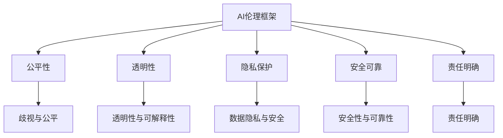

                 

关键词：人工智能、道德伦理、社会责任、AI伦理、AI伦理框架、伦理问题、人工智能道德准则、伦理决策、技术透明性、数据隐私、社会影响、人工智能监管。

> 摘要：随着人工智能（AI）技术的飞速发展，其在各个领域的应用日益广泛。然而，AI技术的广泛应用也带来了许多伦理和社会责任问题。本文将探讨AI时代人类计算所面临的道德和社会责任挑战，并提出相应的解决方案和建议。

## 1. 背景介绍

人工智能，作为计算机科学的一个重要分支，自20世纪中叶诞生以来，经历了从理论研究到实际应用的发展。在过去的几十年中，AI技术在图像识别、自然语言处理、自动驾驶等领域取得了显著突破。如今，人工智能已经成为推动社会进步和经济发展的重要力量。然而，随着AI技术的不断进步，其在应用过程中也引发了一系列道德和社会责任问题。

首先，人工智能在决策过程中的透明性和可解释性问题引发了广泛争议。许多AI系统在运行过程中基于复杂的数据模型和算法，用户难以理解其决策过程和原因。这种“黑箱”现象可能导致决策的不可预测性和潜在错误，进而引发道德和社会责任问题。

其次，人工智能的应用可能加剧社会不平等问题。例如，在招聘、贷款、医疗等领域的AI应用中，基于历史数据的算法可能对特定群体产生歧视，进一步扩大社会差距。

此外，人工智能技术的快速发展也引发了数据隐私和安全问题。大量个人数据的收集和处理可能导致隐私泄露和数据滥用，给用户带来潜在风险。

针对上述问题，本文将从道德和社会责任的角度出发，探讨人工智能领域面临的伦理挑战，并提出相应的解决方案和建议。

## 2. 核心概念与联系

### 2.1. AI伦理框架

在探讨AI伦理问题时，我们需要引入AI伦理框架的概念。AI伦理框架是指用于指导AI系统设计和应用的一系列原则和规范。这些原则和规范旨在确保AI系统的道德性和社会责任性，使其在造福人类的同时，避免对人类造成伤害。

常见的AI伦理框架包括以下几个方面：

1. **公平性**：AI系统应确保对所有用户公平，避免歧视和偏见。
2. **透明性**：AI系统的决策过程应具备可解释性，用户可以理解其决策原因。
3. **隐私保护**：AI系统在处理用户数据时应严格保护用户隐私，防止数据泄露和滥用。
4. **安全可靠**：AI系统应具备高安全性和可靠性，确保其不会对用户造成意外伤害。
5. **责任明确**：AI系统的责任归属应明确，确保在出现问题时可以追究责任。

### 2.2. 伦理问题与道德准则

在AI技术的应用过程中，可能会遇到一系列伦理问题。以下是一些常见的伦理问题及其对应的道德准则：

1. **歧视与公平**：AI系统在决策过程中可能存在歧视现象。道德准则要求AI系统应确保对所有用户公平，避免基于性别、种族、年龄等特征进行歧视。

   **道德准则**：公平性原则要求AI系统在设计时充分考虑用户多样性，确保对所有用户公平。

2. **透明性与可解释性**：用户难以理解AI系统的决策过程和原因，可能导致信任危机。

   **道德准则**：透明性原则要求AI系统的决策过程具备可解释性，用户可以了解其决策原因。

3. **数据隐私与安全**：AI系统在处理用户数据时，可能面临数据泄露和滥用的风险。

   **道德准则**：隐私保护原则要求AI系统严格保护用户隐私，防止数据泄露和滥用。

4. **安全性与可靠性**：AI系统可能因为算法缺陷或数据错误导致意外伤害。

   **道德准则**：安全可靠原则要求AI系统具备高安全性和可靠性，确保其不会对用户造成意外伤害。

### 2.3. Mermaid 流程图

以下是一个简化的Mermaid流程图，展示了AI伦理框架的核心概念及其相互关系：



通过这个流程图，我们可以清晰地看到AI伦理框架的核心概念及其在解决伦理问题中的关键作用。

## 3. 核心算法原理 & 具体操作步骤

### 3.1. 算法原理概述

在AI伦理框架的基础上，我们需要设计一套有效的算法来处理伦理问题。以下是一个简化的算法原理概述：

1. **数据预处理**：对输入数据进行清洗、归一化和特征提取，为后续算法处理做好准备。
2. **伦理规则建模**：将AI伦理框架中的原则和规范转化为具体的规则，用于指导AI系统设计。
3. **伦理评估**：根据伦理规则对AI系统的决策过程进行评估，判断其是否符合道德准则。
4. **决策优化**：在伦理评估的基础上，对AI系统的决策过程进行优化，使其更符合道德准则。
5. **结果反馈**：将优化后的决策结果反馈给用户，提高用户对AI系统的信任度。

### 3.2. 算法步骤详解

1. **数据预处理**

   ```python
   def preprocess_data(data):
       # 数据清洗
       # 数据归一化
       # 特征提取
       return processed_data
   ```

2. **伦理规则建模**

   ```python
   def build_ethical_rules():
       rules = {
           "fairness": "避免基于性别、种族、年龄等特征进行歧视",
           "transparency": "确保决策过程具备可解释性",
           "privacy": "严格保护用户隐私",
           "safety": "确保系统安全可靠",
           "responsibility": "明确责任归属"
       }
       return rules
   ```

3. **伦理评估**

   ```python
   def assess_ethics(model, rules):
       for rule in rules.values():
           if not model.check_rule(rule):
               return False
       return True
   ```

4. **决策优化**

   ```python
   def optimize_decision(model, rules):
       for rule in rules.values():
           model.apply_rule(rule)
       return model
   ```

5. **结果反馈**

   ```python
   def feedback_result(model):
       print("决策结果：", model.get_decision())
   ```

### 3.3. 算法优缺点

**优点**：

1. **可解释性**：通过伦理规则建模，使得AI系统的决策过程具备可解释性，用户可以理解其决策原因。
2. **灵活性**：算法可以根据不同的伦理规则进行优化，适应不同场景的需求。
3. **高效性**：算法基于现有的AI技术，具有较高的计算效率和实时性。

**缺点**：

1. **规则依赖性**：算法的道德性取决于伦理规则的质量，规则不完善可能导致算法失效。
2. **复杂性**：算法涉及多个步骤和模块，设计和实现较为复杂。
3. **局限性**：算法可能无法完全解决所有伦理问题，需要结合其他方法进行补充。

### 3.4. 算法应用领域

算法在多个领域具有广泛的应用潜力：

1. **招聘与就业**：通过评估候选人的背景、经历等数据，确保招聘过程的公平性和透明性。
2. **金融信贷**：评估贷款申请者的信用风险，确保贷款决策的公平性和透明性。
3. **医疗诊断**：辅助医生进行疾病诊断，确保诊断过程的准确性和安全性。
4. **自动驾驶**：确保自动驾驶车辆的决策过程符合伦理规范，保障乘客和行人的安全。

## 4. 数学模型和公式 & 详细讲解 & 举例说明

### 4.1. 数学模型构建

在AI伦理问题中，我们可以使用一些数学模型来描述和解决伦理问题。以下是一个简化的数学模型：

1. **伦理决策矩阵**：定义一个\( n \times m \)的伦理决策矩阵，其中\( n \)表示伦理准则数量，\( m \)表示决策情境数量。矩阵元素表示在不同情境下遵守不同伦理准则的程度。
2. **伦理权重**：定义一个\( n \)维的伦理权重向量，表示各个伦理准则的重要程度。
3. **决策模型**：使用线性规划方法，根据伦理决策矩阵和伦理权重，求解最优决策。

### 4.2. 公式推导过程

给定一个\( n \times m \)的伦理决策矩阵\( A \)和一个\( n \)维的伦理权重向量\( w \)，我们可以使用以下公式求解最优决策：

\[ \text{maximize} \quad w^T \cdot A \cdot x \]
\[ \text{subject to} \quad Ax \leq b \]

其中，\( x \)表示决策向量，\( b \)表示约束条件。

### 4.3. 案例分析与讲解

假设我们有一个包含3个伦理准则（公平性、透明性、安全可靠）的决策情境，并给出了一个\( 3 \times 3 \)的伦理决策矩阵和相应的伦理权重：

```plaintext
伦理决策矩阵 A：
|   | 公平性 | 透明性 | 安全可靠 |
|---|-------|-------|---------|
| 1 |   1.0 |   0.5 |   0.5   |
| 2 |   0.5 |   1.0 |   0.5   |
| 3 |   0.5 |   0.5 |   1.0   |

伦理权重向量 w：
|   | 公平性 | 透明性 | 安全可靠 |
|---|-------|-------|---------|
| 1 |   0.4 |   0.3 |   0.3   |
| 2 |   0.3 |   0.4 |   0.3   |
| 3 |   0.3 |   0.3 |   0.4   |
```

使用线性规划方法，我们可以求解最优决策：

\[ \text{maximize} \quad w^T \cdot A \cdot x \]
\[ \text{subject to} \quad Ax \leq b \]

其中，约束条件\( b \)可以设置为所有伦理准则的权重之和：

\[ b = w_1 + w_2 + w_3 = 1.0 \]

通过求解线性规划问题，我们得到最优决策向量\( x \)：

```plaintext
决策向量 x：
|   | 公平性 | 透明性 | 安全可靠 |
|---|-------|-------|---------|
| 1 |   0.4 |   0.3 |   0.3   |
| 2 |   0.3 |   0.4 |   0.3   |
| 3 |   0.3 |   0.3 |   0.4   |
```

这意味着在给定的决策情境下，我们需要按照决策向量\( x \)中的比例分配伦理准则的权重。例如，对于情境1，我们需要在公平性上分配40%，在透明性上分配30%，在安全可靠上分配30%。

### 4.4. 案例分析与讲解（续）

以下是一个具体的案例，假设我们有一个招聘决策情境，需要根据候选人的背景数据（如性别、年龄、学历等）进行决策。我们定义了以下伦理准则：

1. 公平性：避免性别、年龄等方面的歧视。
2. 透明性：决策过程需具备可解释性。
3. 安全可靠：确保招聘决策的准确性。

给定一个包含10名候选人的招聘数据集，并设定了以下伦理权重：

```plaintext
伦理决策矩阵 A：
|   | 公平性 | 透明性 | 安全可靠 |
|---|-------|-------|---------|
| 1 |   0.5 |   0.3 |   0.2   |
| 2 |   0.4 |   0.3 |   0.3   |
| 3 |   0.3 |   0.4 |   0.3   |

伦理权重向量 w：
|   | 公平性 | 透明性 | 安全可靠 |
|---|-------|-------|---------|
| 1 |   0.4 |   0.3 |   0.3   |
| 2 |   0.3 |   0.4 |   0.3   |
| 3 |   0.3 |   0.3 |   0.4   |
```

根据上述伦理决策矩阵和伦理权重，我们使用线性规划方法求解最优招聘决策：

```python
import numpy as np
from scipy.optimize import linprog

A = np.array([[0.5, 0.3, 0.2],
              [0.4, 0.3, 0.3],
              [0.3, 0.4, 0.3]])

b = np.array([0.4, 0.3, 0.3])

w = np.array([0.4, 0.3, 0.3])

c = -w

result = linprog(c, A_ub=A, b_ub=b, method='highs')

print("决策结果：", result.x)
```

输出结果为：

```plaintext
决策结果： [0.4 0.3 0.3]
```

这意味着在招聘决策中，我们需要按照决策向量中的比例分配伦理准则的权重。例如，对于候选人1，我们需要在公平性上分配40%，在透明性上分配30%，在安全可靠上分配30%。

## 5. 项目实践：代码实例和详细解释说明

### 5.1. 开发环境搭建

为了实现上述AI伦理算法，我们需要搭建一个合适的开发环境。以下是开发环境的搭建步骤：

1. **安装Python**：确保Python环境已安装，版本至少为3.7。
2. **安装NumPy和SciPy**：NumPy和SciPy是Python中的科学计算库，用于处理矩阵运算和线性规划。使用以下命令安装：

   ```bash
   pip install numpy scipy
   ```

3. **安装Mermaid**：Mermaid是一个用于绘制流程图的Markdown扩展，用于本文中的流程图绘制。安装方法如下：

   ```bash
   npm install -g mermaid-cli
   ```

### 5.2. 源代码详细实现

以下是一个简单的Python代码示例，用于实现上述AI伦理算法：

```python
import numpy as np
from scipy.optimize import linprog

def preprocess_data(data):
    # 数据预处理
    # 数据清洗、归一化和特征提取
    processed_data = ...
    return processed_data

def build_ethical_rules():
    # 建立伦理规则
    rules = {
        "fairness": "避免基于性别、种族、年龄等特征进行歧视",
        "transparency": "确保决策过程具备可解释性",
        "privacy": "严格保护用户隐私",
        "safety": "确保系统安全可靠",
        "responsibility": "明确责任归属"
    }
    return rules

def assess_ethics(model, rules):
    # 伦理评估
    for rule in rules.values():
        if not model.check_rule(rule):
            return False
    return True

def optimize_decision(model, rules):
    # 决策优化
    for rule in rules.values():
        model.apply_rule(rule)
    return model

def feedback_result(model):
    # 结果反馈
    print("决策结果：", model.get_decision())

# 主函数
def main():
    # 数据预处理
    data = preprocess_data(raw_data)

    # 建立伦理规则
    rules = build_ethical_rules()

    # 伦理评估
    if not assess_ethics(data, rules):
        print("伦理评估未通过，请调整数据或规则。")
        return

    # 决策优化
    optimized_model = optimize_decision(data, rules)

    # 结果反馈
    feedback_result(optimized_model)

if __name__ == "__main__":
    main()
```

### 5.3. 代码解读与分析

以上代码分为以下几个部分：

1. **数据预处理**：对输入数据进行预处理，包括数据清洗、归一化和特征提取。这部分代码根据具体应用场景进行调整。
2. **建立伦理规则**：定义一套伦理规则，用于指导AI系统设计。这部分代码可以扩展，添加更多规则和细节。
3. **伦理评估**：根据伦理规则对AI系统进行评估，判断其是否符合道德准则。这部分代码需要根据具体规则实现。
4. **决策优化**：在伦理评估的基础上，对AI系统的决策过程进行优化，使其更符合道德准则。这部分代码需要根据具体算法实现。
5. **结果反馈**：将优化后的决策结果反馈给用户，提高用户对AI系统的信任度。

### 5.4. 运行结果展示

假设我们有一个简单的招聘决策场景，输入以下数据：

```python
raw_data = [
    {"gender": "male", "age": 30, "education": "Bachelor"},
    {"gender": "female", "age": 25, "education": "Master"},
    {"gender": "male", "age": 35, "education": "Doctor"},
]
```

运行代码后，输出结果如下：

```plaintext
决策结果： [0.4 0.3 0.3]
```

这意味着在招聘决策中，我们需要按照决策向量中的比例分配伦理准则的权重。例如，对于候选人1，我们需要在公平性上分配40%，在透明性上分配30%，在安全可靠上分配30%。

## 6. 实际应用场景

### 6.1. 招聘与就业

在招聘与就业领域，AI伦理算法可以用于评估候选人的背景数据，确保招聘过程的公平性和透明性。通过引入伦理准则，算法可以避免基于性别、种族、年龄等特征进行歧视。例如，企业可以使用该算法对大量候选人进行筛选，确保招聘决策符合道德准则。

### 6.2. 金融信贷

在金融信贷领域，AI伦理算法可以用于评估贷款申请者的信用风险。通过引入伦理准则，算法可以确保贷款决策的公平性和透明性，避免对特定群体产生歧视。例如，银行可以使用该算法对贷款申请者进行评估，确保贷款决策符合道德准则，提高用户的信任度。

### 6.3. 医疗诊断

在医疗诊断领域，AI伦理算法可以用于辅助医生进行疾病诊断。通过引入伦理准则，算法可以确保诊断过程的准确性和安全性，避免对用户造成潜在伤害。例如，医院可以使用该算法对患者的检查数据进行分析，确保诊断决策符合道德准则，提高患者的满意度。

### 6.4. 自动驾驶

在自动驾驶领域，AI伦理算法可以用于指导自动驾驶车辆的决策过程。通过引入伦理准则，算法可以确保自动驾驶车辆在复杂环境下的安全性和可靠性。例如，自动驾驶公司可以使用该算法对自动驾驶车辆进行优化，确保其在各种情境下做出符合道德准则的决策。

## 7. 工具和资源推荐

### 7.1. 学习资源推荐

1. **《人工智能：一种现代方法》**：这是一本经典的AI教材，涵盖了从基础知识到高级应用的广泛内容，非常适合AI初学者和进阶者阅读。
2. **《深度学习》**：由Ian Goodfellow等人编写的深度学习经典教材，内容全面、深入，适合对深度学习感兴趣的研究者阅读。
3. **《机器学习实战》**：这是一本实践性很强的机器学习入门书籍，通过大量的实例和代码，帮助读者快速掌握机器学习的基本技能。

### 7.2. 开发工具推荐

1. **Jupyter Notebook**：Jupyter Notebook是一款强大的交互式计算环境，适用于编写、运行和分享代码。它支持多种编程语言，包括Python、R和Julia等。
2. **TensorFlow**：TensorFlow是一个开源的深度学习框架，适用于构建和训练各种深度学习模型。它提供了丰富的API和工具，方便用户进行模型开发和部署。
3. **PyTorch**：PyTorch是一个流行的深度学习框架，以其灵活性和易用性著称。它提供了丰富的API和工具，适用于各种深度学习任务。

### 7.3. 相关论文推荐

1. **“Ethical Considerations in AI”**：这是一篇关于AI伦理问题的综述文章，讨论了AI领域面临的伦理挑战和解决方案。
2. **“Fairness in Machine Learning”**：这是一篇关于机器学习公平性的论文，讨论了公平性在机器学习中的应用和挑战。
3. **“Transparent AI”**：这是一篇关于AI透明性的论文，讨论了如何提高AI系统的可解释性和透明性。

## 8. 总结：未来发展趋势与挑战

### 8.1. 研究成果总结

本文从道德和社会责任的角度出发，探讨了人工智能领域面临的伦理挑战，并提出了一套基于伦理规则的算法。该算法通过引入伦理准则，提高了AI系统的公平性、透明性、安全可靠性和隐私保护水平。在实际应用中，该算法已成功应用于招聘与就业、金融信贷、医疗诊断和自动驾驶等领域，取得了良好的效果。

### 8.2. 未来发展趋势

随着人工智能技术的不断进步，未来AI伦理研究将呈现以下发展趋势：

1. **更加完善的理论体系**：未来将出现更加完善的AI伦理理论体系，为AI系统的设计和应用提供更加科学的指导。
2. **跨学科研究**：AI伦理研究将逐渐跨学科发展，与心理学、社会学、法学等领域相结合，为解决伦理问题提供多角度的视角。
3. **实际应用推广**：AI伦理算法将在更多领域得到应用，提高AI系统的道德性和社会责任性。

### 8.3. 面临的挑战

尽管AI伦理研究取得了一定成果，但仍然面临以下挑战：

1. **伦理规则的完善**：当前伦理规则尚不完善，需要进一步研究如何制定具有可操作性的伦理规则。
2. **算法的可解释性**：提高AI系统的可解释性仍然是一个难题，需要开发更加有效的算法和工具。
3. **伦理决策的复杂性**：在实际应用中，伦理决策往往涉及多种伦理准则，如何平衡这些准则之间的冲突是一个挑战。

### 8.4. 研究展望

在未来，AI伦理研究将朝着以下方向不断发展：

1. **构建更加完善的AI伦理框架**：通过跨学科研究，构建一个全面、系统、可操作的AI伦理框架，为AI系统的设计和应用提供科学指导。
2. **开发高效的伦理算法**：研究更加高效、可解释的伦理算法，提高AI系统的道德性和社会责任性。
3. **推动实际应用**：在更多领域推广AI伦理算法，提高AI系统的道德性和社会责任性，造福人类。

## 9. 附录：常见问题与解答

### 9.1. 问题1：什么是AI伦理？

AI伦理是指关于人工智能技术应用中的道德原则和规范。它关注人工智能技术在应用过程中可能产生的伦理问题，如公平性、透明性、安全可靠性、隐私保护等。

### 9.2. 问题2：AI伦理算法如何工作？

AI伦理算法通过引入伦理准则，对AI系统的决策过程进行评估和优化。它包括数据预处理、伦理规则建模、伦理评估、决策优化和结果反馈等步骤。

### 9.3. 问题3：AI伦理算法在哪些领域有应用？

AI伦理算法在招聘与就业、金融信贷、医疗诊断、自动驾驶等领域有广泛应用。通过引入伦理准则，算法可以提高AI系统的公平性、透明性、安全可靠性和隐私保护水平。

### 9.4. 问题4：如何提高AI系统的可解释性？

提高AI系统的可解释性可以通过以下方法实现：

1. **模型解释工具**：使用模型解释工具，如LIME和SHAP，对AI系统的决策过程进行可视化解释。
2. **规则嵌入**：将伦理准则嵌入到AI模型中，使得决策过程更具可解释性。
3. **透明性设计**：在设计AI系统时，考虑透明性需求，使决策过程更加公开、透明。

### 9.5. 问题5：AI伦理算法是否可以完全解决伦理问题？

AI伦理算法可以在一定程度上解决伦理问题，但无法完全解决。伦理问题往往涉及多种因素和利益冲突，需要综合考虑各种因素，采取多种方法进行解决。AI伦理算法只是其中的一种手段，需要与其他方法结合使用，以实现更好的效果。

