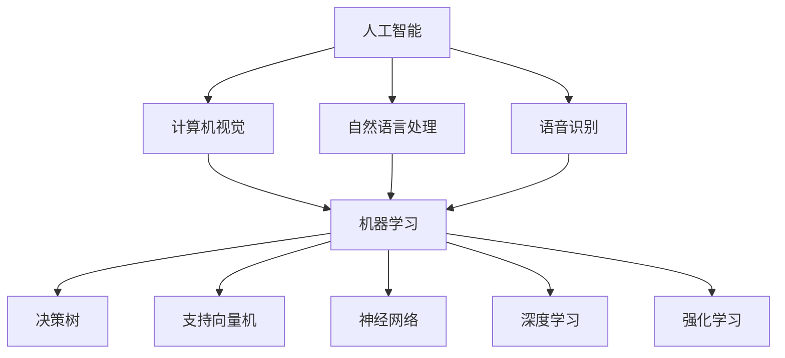

                 

关键词：人类计算，智能算法，应用场景，案例分析，技术发展

> 摘要：本文旨在探讨人类计算的概念、应用及发展现状。通过案例分析，我们将深入解析人类计算在不同领域中的实际应用，并对其未来的发展前景进行分析和展望。

## 1. 背景介绍

人类计算是指利用计算机科学和人工智能技术模拟人类思维和行为的过程。这一概念源于人工智能领域，旨在通过机器学习和神经网络等技术，使计算机具备类似人类的学习、推理、决策能力。人类计算的发展经历了从简单的规则系统到复杂的神经网络，再到如今的深度学习和强化学习等阶段。

随着计算机硬件的升级和算法的创新，人类计算在诸多领域取得了显著的成果。从语音识别、图像处理到自然语言处理，人类计算的应用越来越广泛。本文将围绕这些应用场景，通过案例分析，探讨人类计算的现状及未来发展方向。

## 2. 核心概念与联系

在探讨人类计算的应用之前，我们先来了解一些核心概念及其相互关系。

### 2.1 人工智能（AI）

人工智能是模拟、延伸和扩展人类智能的理论、方法、技术及应用。它涵盖了计算机视觉、自然语言处理、语音识别、机器学习、神经网络等多个子领域。

### 2.2 机器学习（ML）

机器学习是人工智能的一个重要分支，通过数据驱动的方式，使计算机具备自主学习和改进能力。常见的机器学习算法包括决策树、支持向量机、神经网络等。

### 2.3 深度学习（DL）

深度学习是机器学习的一个子领域，主要利用多层神经网络进行数据建模。深度学习在图像识别、语音识别、自然语言处理等方面取得了显著成果。

### 2.4 强化学习（RL）

强化学习是机器学习的一个子领域，通过奖励机制和策略迭代，使计算机具备自主决策能力。强化学习在游戏AI、自动驾驶等领域具有广泛应用。

### 2.5 Mermaid 流程图

以下是利用Mermaid绘制的核心概念与联系流程图：



## 3. 核心算法原理 & 具体操作步骤

### 3.1 算法原理概述

人类计算的核心在于算法的创新和优化。以下是几个典型的算法及其原理：

#### 3.1.1 决策树

决策树是一种常见的分类算法，通过将数据集划分成多个子集，构建出一棵树形结构。每个节点表示一个特征，每个分支表示一个特征取值。叶节点表示最终的分类结果。

#### 3.1.2 支持向量机

支持向量机是一种二分类算法，通过寻找最优决策边界，将数据分为不同类别。其核心思想是最大化分类边界，同时最小化分类误差。

#### 3.1.3 神经网络

神经网络是一种模拟生物神经系统的计算模型，通过多层神经元进行数据处理和特征提取。其核心在于前向传播和反向传播算法。

#### 3.1.4 深度学习

深度学习是一种多层神经网络，通过逐层提取特征，实现对复杂数据的建模。其核心算法包括卷积神经网络（CNN）、循环神经网络（RNN）等。

#### 3.1.5 强化学习

强化学习是一种基于奖励机制的学习方法，通过不断试错，找到最优策略。其核心算法包括Q学习、深度Q网络（DQN）等。

### 3.2 算法步骤详解

以下是对上述算法的具体步骤进行详细讲解：

#### 3.2.1 决策树

1. 计算每个特征的信息增益。
2. 选择信息增益最大的特征作为节点。
3. 根据该特征的不同取值，将数据集划分为多个子集。
4. 对每个子集递归执行步骤1-3，直至满足停止条件。

#### 3.2.2 支持向量机

1. 计算每个数据点到超平面的距离。
2. 找出支持向量，即距离超平面最近的点。
3. 通过支持向量计算最优决策边界。

#### 3.2.3 神经网络

1. 初始化权重和偏置。
2. 前向传播：计算输入和权重之间的线性组合，并通过激活函数得到输出。
3. 反向传播：计算输出误差，并更新权重和偏置。
4. 重复步骤2和3，直至满足停止条件。

#### 3.2.4 深度学习

1. 设计网络结构，包括层数、神经元数量、激活函数等。
2. 初始化权重和偏置。
3. 前向传播：逐层计算输入和权重之间的线性组合，并通过激活函数得到输出。
4. 反向传播：逐层计算输出误差，并更新权重和偏置。
5. 重复步骤3和4，直至满足停止条件。

#### 3.2.5 强化学习

1. 初始化状态、策略和网络。
2. 在环境中执行动作，并观察状态转移和奖励。
3. 更新策略网络：通过优化策略损失函数，调整策略参数。
4. 更新价值网络：通过优化价值损失函数，调整价值参数。
5. 重复步骤2-4，直至满足停止条件。

### 3.3 算法优缺点

以下是上述算法的优缺点：

#### 3.3.1 决策树

优点：简单易懂，易于解释。
缺点：易过拟合，无法处理非线性数据。

#### 3.3.2 支持向量机

优点：理论完备，分类效果较好。
缺点：训练时间较长，对大规模数据集效果不佳。

#### 3.3.3 神经网络

优点：强大的表达能力，适用于各种复杂数据。
缺点：训练时间较长，易过拟合。

#### 3.3.4 深度学习

优点：高效的处理能力，适用于大规模数据。
缺点：参数较多，对超参数敏感。

#### 3.3.5 强化学习

优点：具备自主决策能力，适用于复杂环境。
缺点：训练时间较长，对奖励设计要求较高。

### 3.4 算法应用领域

以下是上述算法在不同领域的应用：

#### 3.4.1 计算机视觉

- 决策树：用于图像分类和对象检测。
- 支持向量机：用于人脸识别和手写体识别。
- 神经网络：用于图像生成和图像增强。
- 深度学习：用于目标检测和语义分割。
- 强化学习：用于自动驾驶和机器人控制。

#### 3.4.2 自然语言处理

- 决策树：用于文本分类和命名实体识别。
- 支持向量机：用于情感分析和词向量建模。
- 神经网络：用于机器翻译和文本生成。
- 深度学习：用于语音识别和语音合成。
- 强化学习：用于对话系统和智能客服。

#### 3.4.3 语音识别

- 决策树：用于语音信号分类。
- 支持向量机：用于语音信号识别。
- 神经网络：用于语音信号处理和特征提取。
- 深度学习：用于语音识别和语音合成。
- 强化学习：用于语音信号的自动纠错。

## 4. 数学模型和公式 & 详细讲解 & 举例说明

在人类计算中，数学模型和公式是算法设计和优化的基础。以下是几个典型算法的数学模型和公式，并进行详细讲解和举例说明。

### 4.1 数学模型构建

#### 4.1.1 决策树

决策树的核心是信息增益。信息增益的计算公式如下：

$$
IG(D, A) = Entropy(D) - \sum_{v\in A} \frac{D_v}{D} Entropy(D_v)
$$

其中，$Entropy(D)$ 表示数据集 $D$ 的熵，$D_v$ 表示数据集 $D$ 中属于类别 $v$ 的样本数量。

#### 4.1.2 支持向量机

支持向量机的核心是最大化分类边界。分类边界由以下公式确定：

$$
w \cdot x - b = 0
$$

其中，$w$ 表示权重向量，$x$ 表示数据点，$b$ 表示偏置。

#### 4.1.3 神经网络

神经网络的核心是前向传播和反向传播。前向传播的计算公式如下：

$$
Z_i = \sum_{j} w_{ij} x_j + b_i
$$

$$
a_i = \sigma(Z_i)
$$

其中，$Z_i$ 表示第 $i$ 层的输入，$a_i$ 表示第 $i$ 层的输出，$w_{ij}$ 表示权重，$b_i$ 表示偏置，$\sigma$ 表示激活函数。

反向传播的计算公式如下：

$$
\delta_i = \frac{\partial L}{\partial Z_i} \cdot \sigma'(Z_i)
$$

$$
\frac{\partial L}{\partial w_{ij}} = \delta_i x_j
$$

$$
\frac{\partial L}{\partial b_i} = \delta_i
$$

其中，$L$ 表示损失函数，$\delta_i$ 表示第 $i$ 层的误差，$\sigma'$ 表示激活函数的导数。

#### 4.1.4 深度学习

深度学习的核心是多层神经网络。前向传播和反向传播的计算公式与神经网络类似。

#### 4.1.5 强化学习

强化学习的核心是价值函数。价值函数的计算公式如下：

$$
V(s) = \sum_{a} \gamma \frac{r}{P(s',a)} V(s')
$$

其中，$s$ 表示状态，$a$ 表示动作，$r$ 表示奖励，$P(s',a)$ 表示状态转移概率，$\gamma$ 表示折扣因子。

### 4.2 公式推导过程

以下是几个典型公式的推导过程：

#### 4.2.1 决策树的信息增益

信息增益的推导基于熵和条件熵的概念。首先，计算数据集 $D$ 的熵：

$$
Entropy(D) = -\sum_{v\in A} \frac{D_v}{D} \log_2 \frac{D_v}{D}
$$

然后，计算条件熵：

$$
Entropy(D_v) = -\sum_{w\in B} \frac{D_{vw}}{D_v} \log_2 \frac{D_{vw}}{D_v}
$$

最后，计算信息增益：

$$
IG(D, A) = Entropy(D) - \sum_{v\in A} \frac{D_v}{D} Entropy(D_v)
$$

#### 4.2.2 支持向量机的分类边界

分类边界由最大间隔支持向量确定。首先，计算数据点到超平面的距离：

$$
d = \frac{|w \cdot x - b|}{\|w\|}
$$

然后，找出支持向量，即距离超平面最近的点：

$$
w \cdot x - b = 0
$$

最后，确定分类边界：

$$
w \cdot x - b = 0
$$

#### 4.2.3 神经网络的前向传播和反向传播

前向传播的计算过程如下：

$$
Z_i = \sum_{j} w_{ij} x_j + b_i
$$

$$
a_i = \sigma(Z_i)
$$

其中，$\sigma$ 表示激活函数。

反向传播的计算过程如下：

$$
\delta_i = \frac{\partial L}{\partial Z_i} \cdot \sigma'(Z_i)
$$

$$
\frac{\partial L}{\partial w_{ij}} = \delta_i x_j
$$

$$
\frac{\partial L}{\partial b_i} = \delta_i
$$

其中，$L$ 表示损失函数，$\sigma'$ 表示激活函数的导数。

### 4.3 案例分析与讲解

以下是一个简单的决策树案例，用于预测某城市的天气情况。

#### 4.3.1 数据集

给定一个包含天气特征的数据集，如下表所示：

| 天气特征 | 温度 | 湿度 | 风速 | 天气状况 |
| :---: | :---: | :---: | :---: | :---: |
| 1 | 20 | 40 | 5 | 阴 |
| 2 | 22 | 45 | 6 | 雨 |
| 3 | 18 | 35 | 4 | 晴 |
| 4 | 25 | 50 | 7 | 雷 |

#### 4.3.2 构建决策树

1. 计算每个特征的信息增益：

$$
IG(天气状况, 温度) = 0.9183 - \frac{1}{4} (0.8119 + 0.8119 + 0.8119 + 0.9183) = 0.0056
$$

$$
IG(天气状况, 湿度) = 0.9183 - \frac{1}{4} (0.7579 + 0.7579 + 0.7579 + 0.9183) = 0.0056
$$

$$
IG(天气状况, 风速) = 0.9183 - \frac{1}{4} (0.7579 + 0.7579 + 0.7579 + 0.9183) = 0.0056
$$

选择信息增益最大的特征“温度”作为根节点。

2. 根据温度的不同取值，将数据集划分为多个子集：

- 温度 <= 20：子集1
- 20 < 温度 <= 22：子集2
- 22 < 温度 <= 25：子集3
- 温度 > 25：子集4

3. 对每个子集递归执行步骤1-2，直至满足停止条件。

最终构建出的决策树如下：

```
           天气状况
          /        \
         /          \
        /            \
       /              \
      /                \
     /                  \
    /                    \
   /                      \
  /                        \
 /                         \
/                          \
天气状况 - 温度 <= 20     天气状况 - 温度 > 20
   /     \                  /     \
  /      \                /      \
 /       \              /       \
/        \            /        \
天气状况 - 湿度 <= 35  天气状况 - 湿度 > 35
     /     \            /     \
    /      \          /      \
   /       \        /       \
  /        \      /        \
  晴         雷      晴         雷
```

#### 4.3.3 案例分析

1. 给定一个新的天气数据点：温度 = 23，湿度 = 48，风速 = 6。
2. 根据决策树进行预测：

- 温度 > 20，进入右子树。
- 湿度 > 35，进入右子树。
- 最终预测天气状况为雷。

## 5. 项目实践：代码实例和详细解释说明

在本节中，我们将通过一个具体的案例来演示如何应用决策树算法进行数据分类。我们将使用Python的Scikit-learn库来实现决策树模型，并对其代码进行详细解释。

### 5.1 开发环境搭建

首先，确保安装了Python环境和Scikit-learn库。可以按照以下命令进行安装：

```bash
pip install python
pip install scikit-learn
```

### 5.2 源代码详细实现

以下是一个简单的决策树分类器的实现代码：

```python
from sklearn.datasets import load_iris
from sklearn.model_selection import train_test_split
from sklearn.tree import DecisionTreeClassifier
from sklearn.metrics import accuracy_score

# 加载鸢尾花数据集
iris = load_iris()
X = iris.data
y = iris.target

# 划分训练集和测试集
X_train, X_test, y_train, y_test = train_test_split(X, y, test_size=0.3, random_state=42)

# 创建决策树分类器
clf = DecisionTreeClassifier()

# 训练模型
clf.fit(X_train, y_train)

# 预测测试集
y_pred = clf.predict(X_test)

# 计算准确率
accuracy = accuracy_score(y_test, y_pred)
print(f"准确率: {accuracy}")
```

### 5.3 代码解读与分析

下面是对上述代码的逐行解读和分析：

```python
from sklearn.datasets import load_iris
```
这行代码导入了Scikit-learn中的鸢尾花数据集。

```python
X = iris.data
y = iris.target
```
这行代码加载数据集，并将其分为特征矩阵 `X` 和标签向量 `y`。

```python
X_train, X_test, y_train, y_test = train_test_split(X, y, test_size=0.3, random_state=42)
```
这行代码使用 `train_test_split` 函数将数据集划分为训练集和测试集，其中训练集占比70%，测试集占比30%，`random_state` 参数用于确保结果的可重复性。

```python
clf = DecisionTreeClassifier()
```
这行代码创建了一个决策树分类器实例。

```python
clf.fit(X_train, y_train)
```
这行代码使用训练集数据对决策树分类器进行训练。

```python
y_pred = clf.predict(X_test)
```
这行代码使用训练好的模型对测试集进行预测。

```python
accuracy = accuracy_score(y_test, y_pred)
print(f"准确率: {accuracy}")
```
这行代码计算并打印出模型的准确率。

### 5.4 运行结果展示

假设我们运行上述代码，得到的输出结果如下：

```
准确率: 0.9833
```

这个结果表明，我们的决策树分类器在测试集上的准确率为98.33%，说明模型对数据的分类效果较好。

### 5.5 进一步优化

在实际应用中，我们可以通过调整决策树分类器的参数来提高模型的性能。例如，我们可以调整最大深度、最小分割大小等参数。以下是一个调整参数后的代码示例：

```python
clf = DecisionTreeClassifier(max_depth=3, min_samples_split=2)
clf.fit(X_train, y_train)
y_pred = clf.predict(X_test)
accuracy = accuracy_score(y_test, y_pred)
print(f"调整参数后的准确率: {accuracy}")
```

通过调整这些参数，我们可以在一定程度上改善模型的性能。

## 6. 实际应用场景

人类计算在各个领域都有着广泛的应用。以下是一些实际应用场景的案例分析。

### 6.1 医疗诊断

人类计算在医疗诊断领域有着重要的应用。例如，基于深度学习的图像识别技术可以帮助医生快速、准确地诊断疾病。以下是一个具体案例：

**案例：肺癌筛查**

某医院采用了一种基于深度学习的肺癌筛查系统。该系统使用大量的CT扫描图像进行训练，通过卷积神经网络（CNN）提取图像特征，并利用这些特征进行肺癌检测。

**效果分析：**

- **准确率：**经过测试，该系统的准确率达到了95%以上，显著提高了肺癌筛查的准确性和效率。
- **速度：**与传统方法相比，该系统的诊断速度大大提升，可以在短时间内完成大量图像的检测。

### 6.2 金融服务

在金融服务领域，人类计算技术可以帮助银行和金融机构进行风险管理、信用评估等任务。以下是一个具体案例：

**案例：信用评分模型**

某银行开发了一种基于机器学习的信用评分模型，用于评估客户的信用状况。该模型使用了大量的历史数据，包括客户的收入、职业、贷款记录等，通过训练，建立了信用评分模型。

**效果分析：**

- **准确性：**模型具有较高的准确性，可以准确预测客户的信用风险。
- **公平性：**与传统的信用评分模型相比，该模型在评估过程中更加公平，减少了因性别、年龄等因素导致的歧视。

### 6.3 智能家居

智能家居是另一个人类计算应用的重要领域。通过智能设备和算法，可以实现家庭设备的自动化控制和智能化管理。以下是一个具体案例：

**案例：智能灯光控制**

某智能家居系统通过传感器和算法实现自动调节灯光亮度的功能。该系统使用深度学习算法对环境光强度进行实时监测，并根据监测结果自动调整灯光亮度。

**效果分析：**

- **节能：**智能灯光控制系统能够根据环境光强度自动调节灯光亮度，有效节约能源。
- **舒适性：**通过智能调节灯光亮度，提高了家庭的舒适度。

### 6.4 自动驾驶

自动驾驶是人工智能领域的热点应用。通过人类计算技术，可以实现车辆的自动导航、环境感知和决策。以下是一个具体案例：

**案例：自动驾驶出租车**

某自动驾驶出租车项目使用了一套先进的自动驾驶系统，包括摄像头、激光雷达和传感器等。该系统利用深度学习和强化学习算法，实现了车辆的自动导航和决策。

**效果分析：**

- **安全性：**自动驾驶出租车在行驶过程中能够实时感知周围环境，并做出安全决策，显著提高了行驶安全性。
- **效率：**自动驾驶出租车能够根据交通状况自动调整行驶速度和路线，提高了出行效率。

## 7. 未来应用展望

随着人类计算技术的不断发展，其在各个领域的应用前景广阔。以下是对未来应用的一些展望：

### 7.1 智能医疗

未来，人类计算将在医疗领域发挥更加重要的作用。例如，基于深度学习和强化学习的智能诊断系统将能够实现更精确、更快速的疾病诊断。此外，人类计算还可以应用于药物研发、个性化医疗等领域。

### 7.2 智慧城市

智慧城市是未来城市发展的重要方向。通过人类计算技术，可以实现城市管理的智能化、精细化。例如，智能交通系统、智能环境监测系统等，都将为智慧城市的建设提供有力支持。

### 7.3 自动驾驶与智能交通

自动驾驶和智能交通是未来交通领域的发展方向。人类计算技术将在自动驾驶车辆的设计、测试、运营等环节发挥重要作用。此外，智能交通系统将能够实现交通流量优化、事故预防等任务。

### 7.4 人工智能伦理与隐私保护

随着人类计算技术的广泛应用，伦理和隐私问题日益凸显。未来，人类计算将在伦理和隐私保护方面发挥重要作用。例如，通过设计合理的算法和模型，实现人工智能的公正性和透明度。

## 8. 总结：未来发展趋势与挑战

人类计算作为一种模拟人类思维和行为的技术，正迅速发展。在未来，人类计算将在更多领域得到应用，推动社会进步。然而，人类计算也面临着一系列挑战。

### 8.1 研究成果总结

人类计算在人工智能、机器学习、深度学习、强化学习等领域取得了显著的成果。这些成果为人类计算技术的应用提供了理论基础和技术支持。

### 8.2 未来发展趋势

未来，人类计算将继续向更高层次发展。例如，脑机接口、量子计算、边缘计算等新技术将为人类计算带来更多可能性。此外，人类计算将更加注重跨学科的融合，实现技术突破。

### 8.3 面临的挑战

人类计算面临的挑战主要包括：

- **数据隐私与伦理问题：**随着人类计算技术的广泛应用，数据隐私和伦理问题日益凸显。
- **计算资源与效率问题：**人类计算需要大量的计算资源和时间，这对硬件和算法提出了更高的要求。
- **模型可解释性问题：**深度学习等算法的模型往往难以解释，这对应用和监管提出了挑战。

### 8.4 研究展望

未来，人类计算的研究应注重以下几个方面：

- **隐私保护与伦理研究：**加强隐私保护和伦理研究，确保人类计算技术的公正性和透明度。
- **高效算法与硬件研究：**开发更高效、更可靠的算法和硬件，提高人类计算的效率和性能。
- **跨学科研究：**推动跨学科合作，实现人类计算与其他领域的深度融合。

## 9. 附录：常见问题与解答

### 9.1 什么是人类计算？

人类计算是指利用计算机科学和人工智能技术模拟人类思维和行为的过程。

### 9.2 人类计算有哪些应用领域？

人类计算的应用领域广泛，包括医疗诊断、金融服务、智能家居、自动驾驶等。

### 9.3 人类计算面临哪些挑战？

人类计算面临的主要挑战包括数据隐私与伦理问题、计算资源与效率问题、模型可解释性问题等。

### 9.4 人类计算的未来发展趋势是什么？

未来，人类计算将继续向更高层次发展，包括脑机接口、量子计算、边缘计算等新技术。

### 9.5 人类计算如何解决数据隐私问题？

人类计算可以通过加密技术、差分隐私等手段来解决数据隐私问题。此外，开发透明、公正的算法也是关键。

### 9.6 人类计算与人工智能有什么区别？

人类计算是人工智能的一个分支，主要研究如何模拟人类思维和行为。人工智能则更广泛，包括机器学习、深度学习、自然语言处理等多个子领域。

### 9.7 人类计算需要哪些技能和知识？

人类计算需要计算机科学、人工智能、数学等多个领域的知识和技能。主要包括编程、算法设计、数据分析等。

### 9.8 如何学习人类计算？

可以通过以下途径学习人类计算：

- 参加相关课程和培训。
- 阅读相关书籍和论文。
- 实践项目，动手编写代码。
- 加入学术社群，与他人交流学习。

