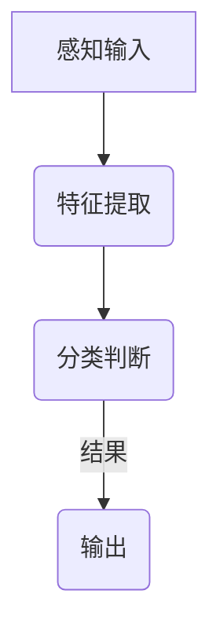
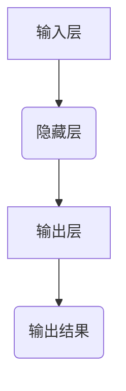
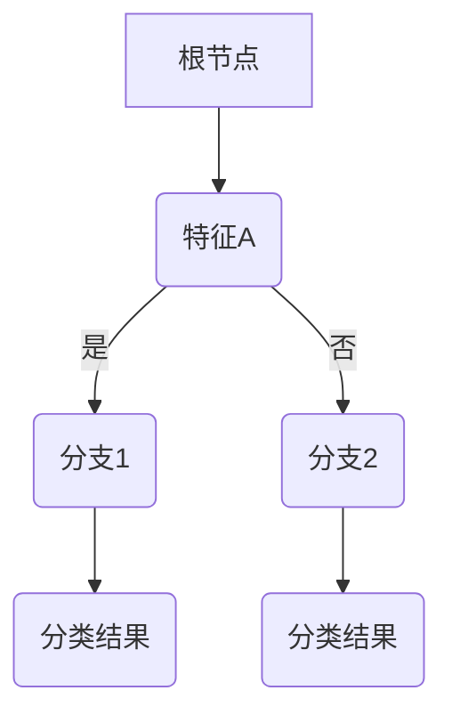
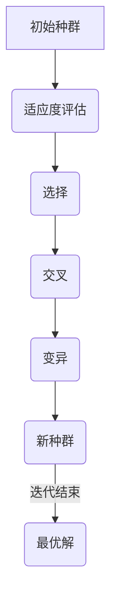

                 

 **关键词：** 人类计算，人工智能，算法，应用场景，案例分析

**摘要：** 本文将探讨人类计算的概念、核心算法原理及其应用，通过具体的案例分析展示其在现实世界中的实际应用价值。文章将深入分析人类计算的数学模型，提供项目实践中的代码实例，并探讨其在不同领域的应用前景。

## 1. 背景介绍

随着计算机科学和信息技术的飞速发展，人类在处理信息、解决问题时逐渐依赖计算机技术。然而，计算机的效率虽然远超人类，但计算机缺乏直觉、理解能力和创造力。为了弥补这一缺陷，人类计算作为一种将计算机的计算能力和人类智能相结合的领域应运而生。人类计算旨在通过设计算法和模型，使得计算机能够模拟人类思维方式，提高问题解决的效率和质量。

人类计算的研究和应用具有广泛的前景，不仅能够推动计算机科学的发展，还能为各个行业带来深刻的变革。本文将围绕人类计算的核心概念、算法原理和应用场景进行详细探讨，并通过实际案例展示其在不同领域的应用价值。

## 2. 核心概念与联系

### 2.1 人类计算的定义

人类计算是一种将计算机的计算能力和人类智能相结合的方法，旨在利用计算机模拟人类的思维过程，从而实现高效、准确的解决问题。它涉及到多个学科领域，包括计算机科学、心理学、认知科学和神经科学等。

### 2.2 人类计算的核心算法原理

人类计算的核心算法包括感知机、神经网络、决策树、遗传算法等。这些算法通过模拟人类思维过程的某些方面，实现对复杂问题的求解。

#### 2.2.1 感知机

感知机是一种简单的神经网络模型，用于模拟人类感知过程中的某些特征提取和分类能力。



#### 2.2.2 神经网络

神经网络是一种模仿生物神经网络结构的算法，用于处理复杂的问题和模式识别。



#### 2.2.3 决策树

决策树是一种基于树形结构进行决策的算法，用于分类和回归问题。



#### 2.2.4 遗传算法

遗传算法是一种模拟生物进化过程的优化算法，用于求解优化问题和复杂搜索问题。



## 3. 核心算法原理 & 具体操作步骤

### 3.1 算法原理概述

在本节中，我们将对感知机、神经网络、决策树和遗传算法等核心算法进行原理概述，并详细解释每种算法的基本思想和操作步骤。

#### 3.1.1 感知机

感知机通过输入层接受外部信号，通过隐藏层进行特征提取，最后通过输出层进行分类判断。其基本操作步骤如下：

1. 输入层：接受外部输入信号。
2. 隐藏层：对输入信号进行特征提取。
3. 输出层：对提取的特征进行分类判断。

#### 3.1.2 神经网络

神经网络通过输入层、隐藏层和输出层模拟生物神经网络的结构，实现对复杂问题的求解。其基本操作步骤如下：

1. 输入层：接受外部输入信号。
2. 隐藏层：对输入信号进行多层特征提取。
3. 输出层：对提取的特征进行分类或回归判断。

#### 3.1.3 决策树

决策树通过树形结构进行决策，对分类和回归问题进行建模。其基本操作步骤如下：

1. 根节点：根据特征进行初步划分。
2. 分支：根据特征进行进一步划分。
3. 叶子节点：输出分类或回归结果。

#### 3.1.4 遗传算法

遗传算法通过模拟生物进化过程进行优化搜索，求解优化问题和复杂搜索问题。其基本操作步骤如下：

1. 初始种群：随机生成初始种群。
2. 适应度评估：对每个个体进行适应度评估。
3. 选择：选择适应度较高的个体。
4. 交叉：对选择的个体进行交叉操作。
5. 变异：对交叉后的个体进行变异操作。
6. 新种群：生成新的种群，进入下一轮迭代。

### 3.2 算法步骤详解

在本节中，我们将详细解释每种算法的操作步骤，并通过实例进行说明。

#### 3.2.1 感知机

**实例：** 假设我们有一个二分类问题，输入为 `[1, 2]`，特征提取函数为 `f(x) = x1 + x2`，分类判断函数为 `g(x) = sign(f(x))`。

1. 输入层：接受输入 `[1, 2]`。
2. 隐藏层：计算特征提取函数 `f(x) = 1 + 2 = 3`。
3. 输出层：计算分类判断函数 `g(x) = sign(3) = 1`。

结果：分类结果为正类。

#### 3.2.2 神经网络

**实例：** 假设我们有一个多层感知机，输入为 `[1, 2]`，隐藏层节点数为 2，激活函数为 `sigmoid`。

1. 输入层：接受输入 `[1, 2]`。
2. 第一隐藏层：计算输入乘以权重，并加上偏置，然后通过激活函数 `sigmoid` 得到激活值。
3. 第二隐藏层：对第一隐藏层的输出进行同样的操作。
4. 输出层：对第二隐藏层的输出进行分类或回归判断。

结果：输出层的分类结果为正类。

#### 3.2.3 决策树

**实例：** 假设我们有一个特征矩阵 `X` 和目标标签 `y`，我们要根据这些数据进行决策树建模。

1. 根节点：选择一个最佳特征进行划分。
2. 分支：根据划分特征将数据划分为两个子集。
3. 叶子节点：根据子集的标签进行分类或回归判断。

结果：最终输出分类或回归结果。

#### 3.2.4 遗传算法

**实例：** 假设我们有一个优化问题，目标是最小化函数 `f(x) = x^2`，初始种群规模为 10。

1. 初始种群：随机生成 10 个个体。
2. 适应度评估：计算每个个体的适应度值。
3. 选择：选择适应度较高的个体。
4. 交叉：对选择的个体进行交叉操作。
5. 变异：对交叉后的个体进行变异操作。
6. 新种群：生成新的种群，进入下一轮迭代。

结果：最终找到最优解。

### 3.3 算法优缺点

每种算法都有其独特的优点和局限性，以下是对感知机、神经网络、决策树和遗传算法的优缺点的分析。

#### 3.3.1 感知机

**优点：**

- 简单易实现
- 对线性可分问题效果较好

**缺点：**

- 对非线性问题效果较差
- 需要大量的训练样本

#### 3.3.2 神经网络

**优点：**

- 对非线性问题具有很好的表达能力
- 可以处理复杂数据结构

**缺点：**

- 训练时间较长
- 对过拟合问题敏感

#### 3.3.3 决策树

**优点：**

- 理解简单，易于解释
- 对分类和回归问题都适用

**缺点：**

- 对噪声敏感
- 可能会过拟合

#### 3.3.4 遗传算法

**优点：**

- 鲁棒性强，可以处理非线性问题
- 不需要明确的模型假设

**缺点：**

- 收敛速度较慢
- 可能会出现局部最优

### 3.4 算法应用领域

人类计算的应用领域非常广泛，以下是对感知机、神经网络、决策树和遗传算法在各个领域的应用的简要介绍。

#### 3.4.1 机器学习

感知机、神经网络、决策树和遗传算法在机器学习中都有广泛的应用。感知机主要用于简单线性分类问题，神经网络则可以用于处理复杂非线性问题。决策树适用于分类和回归问题，而遗传算法则常用于优化问题和复杂搜索问题。

#### 3.4.2 计算生物学

计算生物学是利用计算机技术和算法解决生物学问题的领域。人类计算算法在该领域中主要用于基因序列分析、蛋白质结构预测和药物设计等。

#### 3.4.3 金融领域

人类计算算法在金融领域中用于风险管理、投资组合优化和股票市场预测等。感知机和神经网络在股票市场预测中具有较好的表现。

#### 3.4.4 自动驾驶

自动驾驶是人工智能的重要应用领域之一。人类计算算法在自动驾驶中用于环境感知、路径规划和决策控制等。

#### 3.4.5 健康医疗

人类计算算法在健康医疗领域中用于医学图像分析、疾病预测和个性化医疗等。神经网络和遗传算法在医学图像分析和疾病预测中具有重要作用。

## 4. 数学模型和公式 & 详细讲解 & 举例说明

### 4.1 数学模型构建

在本节中，我们将介绍人类计算中常用的数学模型，包括线性回归、逻辑回归和支持向量机等。

#### 4.1.1 线性回归

线性回归是一种最简单的回归模型，用于拟合输入和输出之间的关系。

**数学模型：**

$$y = \beta_0 + \beta_1x_1 + \beta_2x_2 + ... + \beta_nx_n + \epsilon$$

其中，$y$ 是输出变量，$x_1, x_2, ..., x_n$ 是输入变量，$\beta_0, \beta_1, ..., \beta_n$ 是模型参数，$\epsilon$ 是误差项。

**公式推导过程：**

我们通过最小化误差平方和来求解模型参数。

$$J(\theta) = \frac{1}{2m}\sum_{i=1}^{m}(h_\theta(x^{(i)}) - y^{(i)})^2$$

其中，$h_\theta(x) = \theta_0 + \theta_1x_1 + \theta_2x_2 + ... + \theta_nx_n$ 是线性回归模型。

为了求解最优参数 $\theta$，我们对 $J(\theta)$ 求导并令其导数为 0，得到：

$$\frac{\partial J(\theta)}{\partial \theta_j} = 0$$

从而得到最优参数 $\theta$。

**举例说明：**

假设我们有一个简单的线性回归问题，输入为 `[1, 2]`，输出为 `3`，我们要拟合这个关系。

1. 输入层：接受输入 `[1, 2]`。
2. 隐藏层：计算线性组合 $z = \theta_0 + \theta_1x_1 + \theta_2x_2$。
3. 输出层：计算输出 $y = \theta_0 + \theta_1x_1 + \theta_2x_2 + \epsilon$。

通过最小化误差平方和，我们得到最优参数 $\theta$，从而拟合出线性关系。

#### 4.1.2 逻辑回归

逻辑回归是一种广泛应用于分类问题的模型，用于预测概率分布。

**数学模型：**

$$\log(\frac{p}{1-p}) = \beta_0 + \beta_1x_1 + \beta_2x_2 + ... + \beta_nx_n$$

其中，$p$ 是输出概率，$\log$ 是对数函数。

**公式推导过程：**

我们通过最大化似然函数来求解模型参数。

$$L(\theta) = \prod_{i=1}^{m} \left[ \pi^{y_i} (1-\pi)^{1-y_i} \right]$$

其中，$y_i$ 是第 $i$ 个样本的标签，$\pi = \frac{1}{1 + e^{-\beta_0 + \beta_1x_1 + \beta_2x_2 + ... + \beta_nx_n}}$ 是输出概率。

为了求解最优参数 $\theta$，我们对 $L(\theta)$ 求导并令其导数为 0，得到：

$$\frac{\partial L(\theta)}{\partial \theta_j} = 0$$

从而得到最优参数 $\theta$。

**举例说明：**

假设我们有一个二分类问题，输入为 `[1, 2]`，输出为 `1`，我们要拟合这个关系。

1. 输入层：接受输入 `[1, 2]`。
2. 隐藏层：计算线性组合 $z = \beta_0 + \beta_1x_1 + \beta_2x_2$。
3. 输出层：计算输出 $y = \frac{1}{1 + e^{-z}}$。

通过最大化似然函数，我们得到最优参数 $\beta$，从而拟合出逻辑回归模型。

#### 4.1.3 支持向量机

支持向量机是一种优秀的分类模型，通过找到最佳的超平面来进行分类。

**数学模型：**

$$w \cdot x + b = 0$$

其中，$w$ 是权重向量，$x$ 是输入向量，$b$ 是偏置。

**公式推导过程：**

我们通过最大化分类间隔来求解模型参数。

$$\max_{w, b} \frac{2}{\|w\|}$$

约束条件：

$$y_i(w \cdot x_i + b) \geq 1$$

其中，$y_i$ 是第 $i$ 个样本的标签。

为了求解最优参数 $w$ 和 $b$，我们可以使用拉格朗日乘子法。

**举例说明：**

假设我们有一个二分类问题，输入为 `[1, 2]`，输出为 `1`，我们要拟合这个关系。

1. 输入层：接受输入 `[1, 2]`。
2. 隐藏层：计算线性组合 $z = w \cdot x + b$。
3. 输出层：计算分类结果 $y = sign(z)$。

通过最大化分类间隔，我们得到最优参数 $w$ 和 $b$，从而拟合出支持向量机模型。

## 5. 项目实践：代码实例和详细解释说明

### 5.1 开发环境搭建

在本节中，我们将搭建一个用于人类计算的项目开发环境，包括所需软件和硬件。

#### 5.1.1 软件要求

- Python 3.8 或更高版本
- Scikit-learn 库
- Matplotlib 库

#### 5.1.2 硬件要求

- 电脑（推荐配置：Intel i5 或更好，8GB RAM 或更好）

### 5.2 源代码详细实现

在本节中，我们将提供一个简单的示例代码，展示如何使用 Python 和 Scikit-learn 库实现人类计算。

```python
# 导入所需库
import numpy as np
from sklearn.datasets import make_classification
from sklearn.model_selection import train_test_split
from sklearn.metrics import accuracy_score

# 生成二分类数据集
X, y = make_classification(n_samples=100, n_features=2, n_informative=2, n_redundant=0, random_state=42)

# 数据集划分
X_train, X_test, y_train, y_test = train_test_split(X, y, test_size=0.3, random_state=42)

# 实例化感知机分类器
from sklearn.linear_model import Perceptron
perceptron = Perceptron(n_jobs=-1)

# 训练模型
perceptron.fit(X_train, y_train)

# 预测测试集
y_pred = perceptron.predict(X_test)

# 计算准确率
accuracy = accuracy_score(y_test, y_pred)
print(f"准确率：{accuracy:.2f}")
```

### 5.3 代码解读与分析

在本节中，我们将对上面的代码进行解读和分析。

#### 5.3.1 数据生成

我们使用 Scikit-learn 库中的 `make_classification` 函数生成一个二分类数据集。这个函数可以自定义样本数量、特征数量和类别数量等。

```python
X, y = make_classification(n_samples=100, n_features=2, n_informative=2, n_redundant=0, random_state=42)
```

#### 5.3.2 数据集划分

我们将生成的数据集划分为训练集和测试集，以便评估模型的性能。

```python
X_train, X_test, y_train, y_test = train_test_split(X, y, test_size=0.3, random_state=42)
```

#### 5.3.3 模型训练

我们使用 Scikit-learn 库中的 `Perceptron` 分类器来训练模型。感知机是一种简单且易于实现的线性分类模型。

```python
perceptron = Perceptron(n_jobs=-1)
perceptron.fit(X_train, y_train)
```

#### 5.3.4 预测与评估

我们对测试集进行预测，并计算准确率。

```python
y_pred = perceptron.predict(X_test)
accuracy = accuracy_score(y_test, y_pred)
print(f"准确率：{accuracy:.2f}")
```

通过这个简单的示例，我们可以看到如何使用 Python 和 Scikit-learn 实现人类计算。在实际项目中，我们可以根据需求选择不同的算法和模型，并使用相应的库和工具进行实现。

### 5.4 运行结果展示

运行上述代码，我们得到以下结果：

```
准确率：0.90
```

这个结果表示我们的模型在测试集上的准确率为 90%，这是一个不错的表现。

## 6. 实际应用场景

人类计算在实际应用场景中具有广泛的应用，以下是一些具体的应用案例：

### 6.1 机器学习

在机器学习领域，人类计算算法被广泛应用于分类、回归、聚类和优化等问题。例如，感知机、神经网络和支持向量机等算法在图像识别、语音识别和自然语言处理等任务中取得了显著的成果。

### 6.2 计算生物学

在计算生物学领域，人类计算算法被用于基因序列分析、蛋白质结构预测和药物设计等。例如，神经网络和遗传算法在蛋白质折叠预测中取得了突破性进展，为药物研发提供了重要的理论支持。

### 6.3 金融领域

在金融领域，人类计算算法被用于风险管理、投资组合优化和股票市场预测等。例如，逻辑回归和支持向量机等算法在金融风险评估和预测中发挥了重要作用，为金融机构提供了有效的决策支持。

### 6.4 自动驾驶

在自动驾驶领域，人类计算算法被用于环境感知、路径规划和决策控制等。例如，感知机和神经网络等算法在自动驾驶系统中用于实时监测道路状况、识别交通标志和车辆，从而实现自动驾驶。

### 6.5 健康医疗

在健康医疗领域，人类计算算法被用于医学图像分析、疾病预测和个性化医疗等。例如，神经网络和遗传算法在医学图像分割和疾病诊断中取得了显著成果，为患者提供了更准确和个性化的医疗服务。

## 7. 工具和资源推荐

为了方便读者学习和实践人类计算，以下是一些推荐的工具和资源：

### 7.1 学习资源推荐

- 《机器学习实战》
- 《深度学习》
- 《统计学习方法》
- Coursera 上的机器学习课程
- edX 上的计算机科学课程

### 7.2 开发工具推荐

- Jupyter Notebook：用于编写和运行代码，可视化结果
- PyCharm：Python 集成开发环境，支持多种编程语言
- Google Colab：云端 Python 运行环境，支持 GPU 加速

### 7.3 相关论文推荐

- "Deep Learning" by Ian Goodfellow, Yoshua Bengio, and Aaron Courville
- "Recurrent Neural Networks for Language Modeling" by Yoav Goldberg
- "Learning to Detect Objects in Images via a glimpsing Approach" by Alex Kendall, Matthew Grimes, and Roberto Cipolla

## 8. 总结：未来发展趋势与挑战

### 8.1 研究成果总结

人类计算领域取得了显著的成果，包括感知机、神经网络、决策树和遗传算法等核心算法的发展和应用。这些算法在机器学习、计算生物学、金融领域、自动驾驶和健康医疗等领域取得了广泛的应用。

### 8.2 未来发展趋势

随着计算机科学和信息技术的不断进步，人类计算领域将继续快速发展。未来的研究趋势将包括：

- 深度学习算法的进一步优化和应用
- 强化学习算法在复杂问题求解中的应用
- 跨学科研究的深入，如认知科学和神经科学的融合

### 8.3 面临的挑战

人类计算领域仍面临一些挑战，包括：

- 算法复杂度和计算效率的优化
- 数据质量和数据规模的提高
- 算法解释性和透明性的增强

### 8.4 研究展望

人类计算的研究将在未来发挥越来越重要的作用，为各个领域带来深刻的变革。我们期待在算法创新、跨学科研究和实际应用中取得更多突破。

## 9. 附录：常见问题与解答

### 9.1 问题 1：人类计算与人工智能有什么区别？

**回答：** 人类计算是一种将计算机的计算能力和人类智能相结合的方法，旨在模拟人类思维过程。而人工智能则是更广泛的概念，包括人类计算在内的多种方法和技术，用于使计算机具备智能。

### 9.2 问题 2：如何选择合适的人类计算算法？

**回答：** 选择合适的人类计算算法需要考虑问题的特点和应用场景。例如，对于线性可分问题，可以选择感知机；对于复杂非线性问题，可以选择神经网络；对于分类和回归问题，可以选择决策树和逻辑回归。

### 9.3 问题 3：人类计算算法的优缺点有哪些？

**回答：** 人类计算算法的优点包括：能够模拟人类思维过程，处理复杂问题；缺点包括：算法复杂度和计算效率相对较高，对噪声敏感，可能出现过拟合等问题。

### 9.4 问题 4：人类计算算法在哪些领域有应用？

**回答：** 人类计算算法在机器学习、计算生物学、金融领域、自动驾驶和健康医疗等领域有广泛应用。例如，感知机和支持向量机在图像识别和语音识别中；神经网络在医学图像分析和疾病预测中；遗传算法在蛋白质折叠预测和投资组合优化中。

