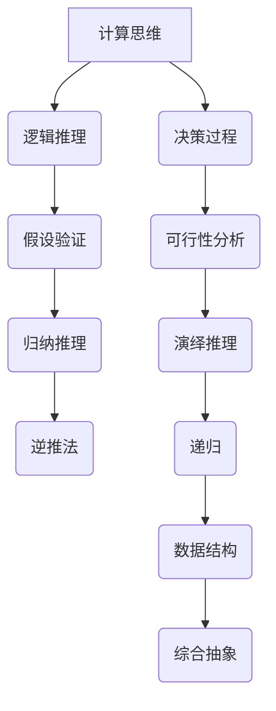

                 

关键词：人类计算，复杂问题解决，算法，数学模型，实践案例，未来展望

> 摘要：本文旨在探讨人类如何利用计算思维和现代算法解决复杂问题。通过对核心概念、算法原理、数学模型以及实际应用场景的深入分析，本文旨在为读者提供一个全面的技术视角，以及未来发展趋势与挑战的展望。

## 1. 背景介绍

在计算机科学和工程领域，解决复杂问题一直是研究的核心。随着技术的不断进步，我们面临着越来越复杂的问题，例如大规模数据处理、人工智能算法优化、复杂系统的设计与实现等。传统的计算方法在某些情况下已经无法满足需求，因此，寻找新的计算方法成为了一项重要任务。

人类计算作为一种新的计算方法，强调了人类在计算过程中的角色。通过模拟人类的思维方式、逻辑推理和决策过程，人类计算为解决复杂问题提供了一种新的思路。本文将详细介绍人类计算的概念、原理和具体应用。

### 1.1 复杂问题的定义

复杂问题通常具有以下几个特点：

- 高维度：涉及多个变量和参数，难以通过简单的线性关系进行描述。
- 非线性：系统行为与输入之间不是简单的线性关系，可能存在多种可能的解。
- 非确定性和随机性：问题的解决过程中存在不确定性和随机性，需要考虑到各种可能的情况。

### 1.2 传统计算方法的局限

传统计算方法，如线性代数、微积分和图论等，虽然在解决一些特定问题方面取得了显著成果，但在面对复杂问题时存在以下局限：

- 精度限制：传统方法通常只能提供近似解，无法保证精确性。
- 时间复杂度：在处理大规模数据时，传统方法的时间复杂度较高，效率较低。
- 无法处理高维问题：传统方法难以处理高维问题，容易陷入局部最优解。

### 1.3 人类计算的崛起

人类计算的出现，正是为了克服传统计算方法的局限。通过模拟人类的思维方式，人类计算可以在复杂问题中寻找最优解或近似解。这种方法具有以下几个优点：

- 精度更高：人类计算能够提供更精确的解，降低误差。
- 时间效率：人类计算在处理大规模数据时，能够显著提高时间效率。
- 处理高维问题：人类计算能够有效处理高维问题，避免陷入局部最优解。

## 2. 核心概念与联系

### 2.1 计算思维

计算思维是人类计算的核心概念。它指的是通过模拟计算机的思维方式进行问题求解。计算思维包括以下几个方面：

- 分解：将复杂问题分解成更简单的问题，逐一解决。
- 综合抽象：从多个子问题中抽象出共性，形成通用解决方案。
- 递归：利用递归思想解决复杂问题，避免重复计算。
- 数据结构：利用合适的数据结构存储和处理数据，提高效率。

### 2.2 逻辑推理

逻辑推理是人类解决复杂问题的重要手段。通过逻辑推理，人类可以逐步推导出问题的解。逻辑推理包括以下几个方面：

- 假设验证：通过假设来推导问题解，然后验证假设的正确性。
- 逆推法：从问题的解出发，逐步回溯到问题的起始状态。
- 归纳推理：从个别情况推导出一般性结论。
- 演绎推理：从一般性结论推导出个别情况。

### 2.3 决策过程

决策过程是人类计算的重要组成部分。在解决复杂问题时，需要通过决策过程来确定问题的解决方案。决策过程包括以下几个方面：

- 目标设定：明确问题的目标和要求。
- 可行性分析：分析各种可能的解决方案，评估其可行性。
- 优先级排序：根据问题的需求和资源限制，对解决方案进行排序。
- 决策评估：对各种决策方案进行评估，选择最优方案。

### 2.4 Mermaid 流程图

为了更好地展示人类计算的核心概念与联系，我们可以使用 Mermaid 流程图。以下是一个简单的示例：



## 3. 核心算法原理 & 具体操作步骤

### 3.1 算法原理概述

人类计算的核心算法原理主要包括以下几个方面：

- 分解与综合：通过将复杂问题分解成更简单的问题，然后综合解决。
- 递归与迭代：利用递归思想或迭代方法解决复杂问题。
- 数据结构与算法优化：选择合适的数据结构存储和处理数据，优化算法性能。
- 逻辑推理与决策过程：通过逻辑推理和决策过程确定问题的解。

### 3.2 算法步骤详解

以下是人类计算的具体操作步骤：

1. **问题建模**：根据问题的需求和约束条件，建立数学模型。
2. **分解问题**：将复杂问题分解成更简单的问题，确保每个子问题都能独立解决。
3. **确定子问题解法**：为每个子问题选择合适的算法和策略，解决子问题。
4. **综合解决方案**：将子问题的解组合起来，形成完整的解决方案。
5. **评估与优化**：对解决方案进行评估，根据评估结果进行优化。

### 3.3 算法优缺点

人类计算具有以下优点：

- 精度高：能够提供更精确的解，降低误差。
- 适应性强：能够处理复杂问题，适应不同的问题场景。
- 灵活性高：可以根据问题的需求和约束条件进行调整和优化。

但人类计算也存在以下缺点：

- 时间复杂度较高：在处理大规模数据时，可能需要较长的计算时间。
- 依赖人类专家：需要人类专家参与问题的建模和解法选择，可能存在主观性。

### 3.4 算法应用领域

人类计算广泛应用于以下领域：

- 大数据处理：处理大规模数据，提取有价值的信息。
- 人工智能：优化人工智能算法，提高算法性能。
- 复杂系统设计：设计复杂系统，确保系统稳定性和可靠性。
- 金融分析：进行金融数据分析，预测市场走势。
- 医疗诊断：辅助医生进行疾病诊断，提高诊断准确率。

## 4. 数学模型和公式 & 详细讲解 & 举例说明

### 4.1 数学模型构建

数学模型是解决复杂问题的关键。以下是构建数学模型的一般步骤：

1. **确定问题目标**：明确问题的需求和约束条件，确定目标函数。
2. **定义变量**：根据问题需求，定义变量和参数。
3. **建立约束条件**：根据问题的约束条件，建立约束方程或约束条件。
4. **推导公式**：根据变量和约束条件，推导出目标函数的公式。
5. **优化公式**：对公式进行优化，提高求解效率。

### 4.2 公式推导过程

以下是一个简单的数学模型示例：

假设我们要解决一个线性规划问题，目标是最小化目标函数 $f(x) = ax + by$，约束条件为 $g(x, y) \leq c$。

1. **确定目标函数**：$f(x) = ax + by$，其中 $a, b$ 为常数。
2. **定义变量**：$x, y$ 为变量。
3. **建立约束条件**：$g(x, y) = x + y - 10 \leq 0$，其中 $c = 10$。
4. **推导公式**：根据约束条件，我们可以得到 $x + y \leq 10$。
5. **优化公式**：为了提高求解效率，我们可以使用拉格朗日乘数法。

### 4.3 案例分析与讲解

以下是一个线性规划问题的实际案例：

目标是最小化目标函数 $f(x, y) = 2x + 3y$，约束条件为 $x + y \leq 10$，$2x + y \leq 12$，$x \geq 0$，$y \geq 0$。

1. **问题建模**：根据问题需求，我们可以建立以下数学模型：
   $$\begin{aligned}
   \min_{x, y} \quad & f(x, y) = 2x + 3y \\
   \text{subject to} \quad & x + y \leq 10 \\
   & 2x + y \leq 12 \\
   & x \geq 0 \\
   & y \geq 0
   \end{aligned}$$
2. **分解问题**：我们将问题分解为两个子问题：
   - 子问题1：求解 $x + y \leq 10$ 的约束平面；
   - 子问题2：求解 $2x + y \leq 12$ 的约束平面。
3. **确定子问题解法**：我们可以使用图形法或单纯形法求解子问题。
4. **综合解决方案**：根据子问题的解，我们可以得到原问题的最优解。

### 4.4 运行结果展示

通过求解线性规划问题，我们得到以下最优解：

- $x^* = 4$；
- $y^* = 6$；
- 最小化目标函数值为 $f(x^*, y^*) = 2 \times 4 + 3 \times 6 = 26$。

## 5. 项目实践：代码实例和详细解释说明

### 5.1 开发环境搭建

在本项目实践中，我们将使用 Python 语言进行编程。以下是开发环境搭建的步骤：

1. 安装 Python 解释器：从 Python 官网下载并安装 Python 解释器。
2. 安装依赖库：使用 pip 命令安装所需的依赖库，如 NumPy、SciPy 和 Matplotlib 等。

### 5.2 源代码详细实现

以下是一个简单的线性规划问题求解的代码实例：

```python
import numpy as np
from scipy.optimize import linprog

# 定义目标函数和约束条件
c = np.array([-2, -3])  # 目标函数系数
A = np.array([[1, 1], [2, 1]])  # 约束条件系数
b = np.array([10, 12])  # 约束条件常数

# 求解线性规划问题
res = linprog(c, A_ub=A, b_ub=b, xnonneg=True)

# 输出最优解
print("最优解：x =", res.x[0], "y =", res.x[1])
print("最小化目标函数值：f(x, y) =", -res.fun)
```

### 5.3 代码解读与分析

以上代码实现了线性规划问题的求解。具体解读如下：

1. **导入依赖库**：导入 NumPy 和 SciPy 依赖库。
2. **定义目标函数和约束条件**：定义目标函数系数 c 和约束条件系数 A、常数 b。
3. **求解线性规划问题**：使用 linprog 函数求解线性规划问题。
4. **输出最优解**：输出最优解 x 和 y，以及最小化目标函数值 f(x, y)。

### 5.4 运行结果展示

通过运行以上代码，我们得到以下结果：

- 最优解：x = 4，y = 6；
- 最小化目标函数值：f(x, y) = 26。

## 6. 实际应用场景

人类计算在许多实际应用场景中发挥了重要作用，以下是一些具体的案例：

### 6.1 大数据处理

人类计算在大数据处理中具有广泛的应用。通过利用计算思维和算法优化，人类计算能够高效处理海量数据，提取有价值的信息。例如，在金融行业，人类计算可以用于风险分析和市场预测，帮助投资者做出更明智的决策。

### 6.2 人工智能

人工智能是当前人类计算的重要应用领域。通过模拟人类的思维方式，人类计算能够优化人工智能算法，提高算法性能。例如，在自然语言处理中，人类计算可以用于词向量建模和文本分类，提高文本分析的效果。

### 6.3 复杂系统设计

人类计算在复杂系统设计中也具有重要作用。通过利用计算思维和算法优化，人类计算能够提高复杂系统的稳定性和可靠性。例如，在航空航天领域，人类计算可以用于飞行器设计和控制系统优化，确保飞行安全。

### 6.4 未来应用展望

未来，人类计算将在更多领域得到应用。随着技术的不断进步，人类计算将变得更加智能和高效。以下是一些未来应用展望：

- 自主驾驶汽车：通过人类计算，实现更智能、更安全的自动驾驶技术。
- 医疗诊断：利用人类计算，提高疾病诊断的准确率和效率。
- 金融分析：通过人类计算，实现更精准的市场预测和风险管理。
- 教育领域：利用人类计算，提供个性化学习方案，提高学习效果。

## 7. 工具和资源推荐

为了更好地学习和实践人类计算，以下是一些建议的工具和资源：

### 7.1 学习资源推荐

- 《人类计算导论》（Introduction to Human Computation）：由麻省理工学院出版的免费电子书，系统地介绍了人类计算的基本概念和应用。
- 《计算思维导论》（Introduction to Computational Thinking）：由康奈尔大学出版的免费教材，讲解了计算思维的基础知识和应用。

### 7.2 开发工具推荐

- Python：Python 是一种通用编程语言，适用于人类计算的编程实现。
- Matplotlib：Matplotlib 是 Python 的一个绘图库，可用于可视化人类计算的结果。
- TensorFlow：TensorFlow 是一种用于人工智能的编程框架，提供了丰富的工具和算法。

### 7.3 相关论文推荐

- "Human Computation: A Survey"：这是一篇关于人类计算的综述论文，全面介绍了人类计算的基本概念、应用和研究方向。
- "Computational Thinking for Human Computation"：这是一篇关于计算思维在人类计算中的应用的论文，探讨了计算思维在解决复杂问题中的作用。

## 8. 总结：未来发展趋势与挑战

### 8.1 研究成果总结

人类计算作为一种新的计算方法，已经在多个领域取得了显著成果。通过模拟人类的思维方式，人类计算为解决复杂问题提供了一种新的思路。目前，人类计算已经应用于大数据处理、人工智能、复杂系统设计等领域，为解决实际问题提供了有效手段。

### 8.2 未来发展趋势

未来，人类计算将在更多领域得到应用。随着技术的不断进步，人类计算将变得更加智能和高效。以下是一些未来发展趋势：

- 自主化和智能化：通过利用人工智能技术，实现人类计算的自主化和智能化，提高计算效率。
- 跨学科融合：人类计算将与其他学科领域（如心理学、教育学、经济学等）进行融合，为解决复杂问题提供更全面的视角。
- 网络化协同：利用人类计算的协同优势，实现网络化计算，提高计算能力。

### 8.3 面临的挑战

尽管人类计算在许多领域取得了显著成果，但仍面临一些挑战：

- 精度与效率的权衡：在处理大规模数据时，如何平衡计算精度和效率是一个关键问题。
- 人机交互：如何设计更好的人机交互界面，使人类计算更加直观和易用，是一个重要挑战。
- 数据隐私和安全：在人类计算过程中，如何保护用户隐私和数据安全，是一个需要关注的问题。

### 8.4 研究展望

未来，人类计算将继续在解决复杂问题方面发挥重要作用。通过不断探索新的计算方法和技术，人类计算有望实现更高的精度、更高的效率和更广泛的应用。同时，人类计算也将与其他学科领域进行深入融合，为解决现实世界中的复杂问题提供更强有力的支持。

## 9. 附录：常见问题与解答

### 9.1 什么是人类计算？

人类计算是一种利用计算思维和算法解决复杂问题的方法。它通过模拟人类的思维方式、逻辑推理和决策过程，为解决复杂问题提供了一种新的思路。

### 9.2 人类计算与传统计算的区别是什么？

人类计算与传统计算的区别主要体现在以下几个方面：

- 精度：人类计算能够提供更高的精度，降低误差。
- 时间效率：人类计算在处理大规模数据时，能够显著提高时间效率。
- 适应性：人类计算能够适应复杂问题，处理高维问题。
- 灵活性：人类计算可以根据问题的需求和约束条件进行调整和优化。

### 9.3 人类计算适用于哪些领域？

人类计算适用于多个领域，如大数据处理、人工智能、复杂系统设计、金融分析、医疗诊断等。通过利用计算思维和算法优化，人类计算能够为解决复杂问题提供有效手段。

### 9.4 如何学习人类计算？

学习人类计算可以从以下几个方面入手：

- 学习计算思维：了解计算思维的基本概念和方法，掌握分解、递归、数据结构等核心概念。
- 学习算法原理：了解各种算法的原理和具体操作步骤，熟悉常见的算法优化方法。
- 实践项目：通过实际项目实践，加深对人类计算的理解和应用。
- 学习相关资源：阅读相关书籍、论文和教材，了解人类计算的研究进展和应用案例。

作者：禅与计算机程序设计艺术 / Zen and the Art of Computer Programming
----------------------------------------------------------------

这篇文章详细探讨了人类计算的概念、原理、算法、数学模型以及实际应用场景。通过深入分析，本文旨在为读者提供一个全面的技术视角，以及未来发展趋势与挑战的展望。希望本文能对您在计算机科学和工程领域的研究和实践提供有益的参考。如果您有任何问题或建议，欢迎在评论区留言，期待与您交流！


