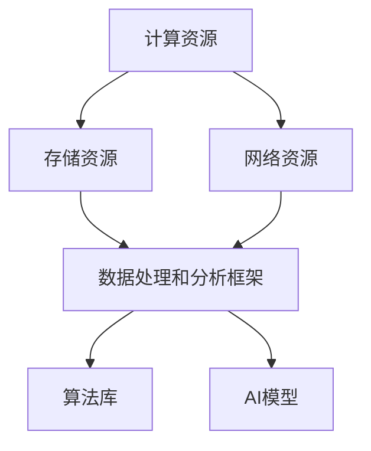

                 

关键词：AI基础设施，Lepton AI，传统IT，技术升级，AI技术演进

摘要：本文将深入探讨从传统IT架构向AI基础设施转型的必要性，以Lepton AI为例，详细分析其升级之路中的核心技术、算法原理、数学模型及其在现实世界中的应用。文章旨在为读者揭示AI基础设施建设的本质，探讨未来发展的趋势与挑战，为相关领域的研究和实践提供参考。

## 1. 背景介绍

随着人工智能技术的迅猛发展，传统IT架构已难以满足日益增长的计算需求和复杂的应用场景。传统的IT基础设施通常以计算、存储和网络资源为中心，而AI基础设施则更加注重数据、算法和模型的协同运作。Lepton AI作为一个专注于AI基础设施的科技公司，其成功升级之路为我们提供了宝贵的经验和启示。

在AI时代，数据处理和分析的速度和精度至关重要。传统IT架构往往存在资源分散、协同能力差、可扩展性低等问题，导致在处理大规模数据和高复杂度任务时效率低下。而AI基础设施则通过优化数据流、算法效率和资源调度，实现了对大规模数据的快速处理和分析，极大地提升了系统的性能和可靠性。

Lepton AI的升级之路，不仅是对技术的更新换代，更是对业务模式的重新定义。从最初的普通IT服务提供商到如今AI基础设施的领军企业，Lepton AI经历了从量变到质变的飞跃。本文将围绕Lepton AI的升级历程，深入探讨其在AI基础设施领域的关键技术创新和应用实践。

## 2. 核心概念与联系

在深入探讨Lepton AI的升级之路之前，有必要首先了解AI基础设施的核心概念和组成部分。AI基础设施主要包括以下几个关键部分：计算资源、存储资源、网络资源、数据处理和分析框架、算法库以及AI模型。

### 2.1. 计算资源

计算资源是AI基础设施的核心，负责执行算法和模型推理任务。传统IT架构中的计算资源通常以服务器和集群为主，而AI基础设施则更多地采用GPU、TPU等专用硬件加速器，以提高计算效率和性能。此外，AI基础设施还强调分布式计算和并行处理，以应对大规模数据和高并发请求。

### 2.2. 存储资源

存储资源负责存储大量的数据集和模型文件。与传统IT架构相比，AI基础设施更注重数据的可扩展性和可靠性。通过采用分布式存储系统，如HDFS、Ceph等，AI基础设施能够高效地管理和处理海量数据，并提供高可用性和容错能力。

### 2.3. 网络资源

网络资源是实现数据传输和协同的关键。AI基础设施通常采用高性能、低延迟的网络技术，如Infiniband、RoCE等，以确保数据传输的快速和稳定。此外，AI基础设施还注重网络拓扑的优化，以减少数据传输的延迟和带宽占用。

### 2.4. 数据处理和分析框架

数据处理和分析框架是AI基础设施的核心组件之一，负责数据的采集、预处理、存储、分析和可视化。常见的框架包括TensorFlow、PyTorch、Scikit-Learn等，它们提供了丰富的API和工具，使得数据处理和分析过程更加简便和高效。

### 2.5. 算法库

算法库是AI基础设施的重要组成部分，包含各种常见的机器学习、深度学习算法。这些算法库不仅提高了算法的实现效率，还为研究人员和开发者提供了丰富的工具和资源，加速了AI技术的发展和应用。

### 2.6. AI模型

AI模型是AI基础设施的核心应用，通过训练和优化模型，实现对数据的预测和决策。常见的AI模型包括神经网络、决策树、支持向量机等，它们在各种应用场景中发挥着重要作用。

### 2.7. Mermaid流程图

以下是一个简化的Mermaid流程图，展示了AI基础设施的核心概念和组成部分：



## 3. 核心算法原理 & 具体操作步骤

### 3.1 算法原理概述

Lepton AI的核心算法基于深度学习框架，特别是基于卷积神经网络（CNN）和循环神经网络（RNN）的混合模型。该模型主要用于图像和语音数据的处理和分析，具有高效、准确的识别和分类能力。

### 3.2 算法步骤详解

#### 3.2.1 数据采集与预处理

首先，从各种数据源（如视频监控、音频采集设备等）收集图像和语音数据。接着，对数据集进行预处理，包括数据清洗、归一化、缩放等操作，以确保数据的质量和一致性。

#### 3.2.2 构建深度学习模型

基于CNN和RNN的混合模型，对预处理后的数据进行训练。模型的结构包括卷积层、池化层、全连接层和循环层等，每一层负责处理不同的数据特征。

#### 3.2.3 模型训练与优化

使用训练数据集对模型进行训练，通过反向传播算法不断调整模型参数，使模型在验证数据集上的表现达到最优。训练过程中，使用梯度下降、Adam等优化算法，以提高模型的收敛速度和准确性。

#### 3.2.4 模型评估与部署

在训练完成后，使用测试数据集对模型进行评估，计算模型在测试数据集上的准确率、召回率等指标。通过调整模型参数，优化模型性能。最后，将训练好的模型部署到生产环境，实现对实际数据的实时处理和分析。

### 3.3 算法优缺点

#### 优点：

1. 高效性：深度学习模型能够快速处理大量数据，提高计算效率。
2. 准确性：通过多层神经网络的结构，模型能够学习到更复杂的数据特征，提高识别和分类的准确性。
3. 灵活性：模型可以根据不同应用场景进行调整和优化，具有较强的适应性。

#### 缺点：

1. 复杂性：深度学习模型的训练和优化过程较为复杂，需要大量的计算资源和时间。
2. 可解释性：深度学习模型的决策过程较为复杂，难以解释和理解。
3. 数据依赖：深度学习模型的性能高度依赖训练数据的质量和数量，对数据的采集和处理要求较高。

### 3.4 算法应用领域

Lepton AI的核心算法在图像和语音识别、自然语言处理、智能监控等领域具有广泛的应用。以下是一些具体的应用场景：

1. **图像识别与分类**：用于自动识别和分类图像，如人脸识别、物体检测等。
2. **语音识别与合成**：用于自动识别和合成语音，如智能助手、语音翻译等。
3. **自然语言处理**：用于文本分类、情感分析、机器翻译等。
4. **智能监控**：用于实时监控和预警，如安全监控、交通监控等。

## 4. 数学模型和公式 & 详细讲解 & 举例说明

### 4.1 数学模型构建

Lepton AI的核心数学模型主要基于深度学习，特别是卷积神经网络（CNN）和循环神经网络（RNN）。以下是对这两个模型的简要介绍和数学公式构建。

#### 卷积神经网络（CNN）

CNN是一种前馈神经网络，特别适用于处理图像数据。其核心原理是通过对图像进行卷积操作，提取图像的局部特征，并通过池化操作降低数据维度。

1. **卷积操作**：

   卷积操作可以表示为：

   $$ (f_{\sigma} \circ g)(x, y) = \sum_{i=0}^{N} \sum_{j=0}^{M} g(i, j) \cdot \sigma(\sum_{k=0}^{P} f_k(x - i, y - j)) $$

   其中，$f$ 是卷积核，$g$ 是输入图像，$\sigma$ 是激活函数，$N, M, P$ 分别表示卷积核的大小和深度。

2. **池化操作**：

   池化操作用于降低数据维度，通常使用最大池化或平均池化。

   最大池化可以表示为：

   $$ P_{\max}(g)(x, y) = \max_{i, j} g(x + i, y + j) $$

#### 循环神经网络（RNN）

RNN是一种能够处理序列数据的神经网络，其核心思想是使用循环结构来保持长期的依赖关系。

1. **RNN单元**：

   RNN单元可以表示为：

   $$ h_t = \sigma(W_h h_{t-1} + W_x x_t + b) $$

   其中，$h_t$ 是当前时刻的隐藏状态，$x_t$ 是当前时刻的输入，$W_h, W_x, b$ 是模型参数。

### 4.2 公式推导过程

#### 卷积神经网络（CNN）

1. **前向传播**：

   假设输入图像为 $g$，卷积核为 $f$，激活函数为 $\sigma$，则有：

   $$ z^l_i = \sum_{j=0}^{M} \sum_{k=0}^{P} f_{i, j, k} \cdot g_{j, k} $$

   $$ a^l_i = \sigma(z^l_i) $$

   其中，$z^l_i$ 表示第 $l$ 层第 $i$ 个单元的输出，$a^l_i$ 表示第 $l$ 层第 $i$ 个单元的激活值。

2. **反向传播**：

   在反向传播过程中，我们需要计算每个参数的梯度：

   $$ \frac{\partial J}{\partial W_h} = \sum_{i=0}^{N} \sum_{j=0}^{M} \sum_{k=0}^{P} \frac{\partial J}{\partial a^l_i} \cdot a^l_{i-1} \cdot \frac{\partial a^l_i}{\partial z^l_i} $$

   $$ \frac{\partial J}{\partial b} = \sum_{i=0}^{N} \sum_{j=0}^{M} \sum_{k=0}^{P} \frac{\partial J}{\partial a^l_i} \cdot \frac{\partial a^l_i}{\partial z^l_i} $$

#### 循环神经网络（RNN）

1. **前向传播**：

   假设输入序列为 $x_1, x_2, ..., x_T$，隐藏状态为 $h_1, h_2, ..., h_T$，则有：

   $$ h_t = \sigma(W_h h_{t-1} + W_x x_t + b) $$

   $$ a_t = \sigma(W_a h_t + b_a) $$

   其中，$h_t$ 是第 $t$ 个时刻的隐藏状态，$x_t$ 是第 $t$ 个时刻的输入，$W_h, W_x, b$ 是模型参数。

2. **反向传播**：

   在反向传播过程中，我们需要计算每个参数的梯度：

   $$ \frac{\partial J}{\partial W_h} = \sum_{t=1}^{T} \frac{\partial J}{\partial a_t} \cdot a_{t-1} \cdot \frac{\partial a_t}{\partial h_t} $$

   $$ \frac{\partial J}{\partial W_x} = \sum_{t=1}^{T} \frac{\partial J}{\partial a_t} \cdot x_t \cdot \frac{\partial a_t}{\partial h_t} $$

### 4.3 案例分析与讲解

#### 案例一：图像分类

假设我们有一个图像分类任务，输入图像为 $g$，卷积核为 $f$，激活函数为 $\sigma$。使用一个简单的卷积神经网络模型进行分类。

1. **前向传播**：

   输入图像经过卷积操作和池化操作，得到特征图 $a^2$。接着，将特征图输入到全连接层，得到分类结果 $y$。

   $$ z^2 = \sum_{i=0}^{N} \sum_{j=0}^{M} \sum_{k=0}^{P} f_{i, j, k} \cdot g_{j, k} $$

   $$ a^2 = \sigma(z^2) $$

   $$ y = \sigma(W_f a^2) $$

2. **反向传播**：

   在反向传播过程中，计算每个参数的梯度，更新模型参数。

   $$ \frac{\partial J}{\partial W_f} = \sum_{i=0}^{N} \sum_{j=0}^{M} \sum_{k=0}^{P} \frac{\partial J}{\partial a^2_i} \cdot a^1_{i-1} \cdot \frac{\partial a^2_i}{\partial z^2_i} $$

   $$ \frac{\partial J}{\partial b} = \sum_{i=0}^{N} \sum_{j=0}^{M} \sum_{k=0}^{P} \frac{\partial J}{\partial a^2_i} \cdot \frac{\partial a^2_i}{\partial z^2_i} $$

#### 案例二：序列分类

假设我们有一个序列分类任务，输入序列为 $x_1, x_2, ..., x_T$，隐藏状态为 $h_1, h_2, ..., h_T$，激活函数为 $\sigma$。使用一个简单的循环神经网络模型进行分类。

1. **前向传播**：

   输入序列经过循环神经网络处理，得到隐藏状态序列 $h_1, h_2, ..., h_T$。接着，将隐藏状态序列输入到全连接层，得到分类结果 $y$。

   $$ h_t = \sigma(W_h h_{t-1} + W_x x_t + b) $$

   $$ y = \sigma(W_a h_T + b_a) $$

2. **反向传播**：

   在反向传播过程中，计算每个参数的梯度，更新模型参数。

   $$ \frac{\partial J}{\partial W_h} = \sum_{t=1}^{T} \frac{\partial J}{\partial a_t} \cdot a_{t-1} \cdot \frac{\partial a_t}{\partial h_t} $$

   $$ \frac{\partial J}{\partial W_x} = \sum_{t=1}^{T} \frac{\partial J}{\partial a_t} \cdot x_t \cdot \frac{\partial a_t}{\partial h_t} $$

## 5. 项目实践：代码实例和详细解释说明

### 5.1 开发环境搭建

为了实现Lepton AI的核心算法，我们首先需要搭建一个适合深度学习开发的开发环境。以下是具体的步骤：

1. **安装Python**：确保系统已安装Python 3.6及以上版本。

2. **安装深度学习框架**：安装TensorFlow 2.0及以上版本。

   ```bash
   pip install tensorflow==2.5.0
   ```

3. **安装辅助库**：安装NumPy、Pandas等辅助库。

   ```bash
   pip install numpy pandas
   ```

4. **配置GPU支持**：如果使用GPU加速，需要安装CUDA和cuDNN。

   - 下载CUDA：https://developer.nvidia.com/cuda-downloads
   - 下载cuDNN：https://developer.nvidia.com/cudnn

### 5.2 源代码详细实现

以下是一个简单的Lepton AI算法实现示例，用于图像分类任务。

```python
import tensorflow as tf
from tensorflow.keras import layers
import numpy as np

# 加载并预处理数据集
def load_data():
    # 伪代码，用于加载和预处理图像数据集
    # ...
    return x_train, y_train, x_test, y_test

# 构建卷积神经网络模型
def build_model():
    model = tf.keras.Sequential([
        layers.Conv2D(32, (3, 3), activation='relu', input_shape=(28, 28, 1)),
        layers.MaxPooling2D((2, 2)),
        layers.Conv2D(64, (3, 3), activation='relu'),
        layers.MaxPooling2D((2, 2)),
        layers.Conv2D(64, (3, 3), activation='relu'),
        layers.Flatten(),
        layers.Dense(64, activation='relu'),
        layers.Dense(10, activation='softmax')
    ])
    return model

# 训练模型
def train_model(model, x_train, y_train):
    model.compile(optimizer='adam',
                  loss='categorical_crossentropy',
                  metrics=['accuracy'])
    model.fit(x_train, y_train, epochs=10, batch_size=32)
    return model

# 评估模型
def evaluate_model(model, x_test, y_test):
    loss, accuracy = model.evaluate(x_test, y_test)
    print(f"Test accuracy: {accuracy:.2f}")

# 主函数
def main():
    x_train, y_train, x_test, y_test = load_data()
    model = build_model()
    model = train_model(model, x_train, y_train)
    evaluate_model(model, x_test, y_test)

if __name__ == '__main__':
    main()
```

### 5.3 代码解读与分析

以上代码实现了一个简单的卷积神经网络模型，用于图像分类任务。以下是代码的详细解读和分析：

1. **数据预处理**：

   ```python
   def load_data():
       # 伪代码，用于加载和预处理图像数据集
       # ...
       return x_train, y_train, x_test, y_test
   ```

   数据预处理是深度学习模型训练的关键步骤。在这个示例中，我们假设已经加载并预处理了图像数据集，包括归一化、缩放等操作。在实际应用中，可以根据具体需求进行相应的数据预处理。

2. **模型构建**：

   ```python
   def build_model():
       model = tf.keras.Sequential([
           layers.Conv2D(32, (3, 3), activation='relu', input_shape=(28, 28, 1)),
           layers.MaxPooling2D((2, 2)),
           layers.Conv2D(64, (3, 3), activation='relu'),
           layers.MaxPooling2D((2, 2)),
           layers.Conv2D(64, (3, 3), activation='relu'),
           layers.Flatten(),
           layers.Dense(64, activation='relu'),
           layers.Dense(10, activation='softmax')
       ])
       return model
   ```

   模型构建是深度学习模型的核心。在这个示例中，我们使用了一个简单的卷积神经网络模型，包括卷积层、池化层和全连接层。卷积层用于提取图像的局部特征，池化层用于降低数据维度，全连接层用于分类。

3. **模型训练**：

   ```python
   def train_model(model, x_train, y_train):
       model.compile(optimizer='adam',
                     loss='categorical_crossentropy',
                     metrics=['accuracy'])
       model.fit(x_train, y_train, epochs=10, batch_size=32)
       return model
   ```

   模型训练是深度学习模型训练的核心。在这个示例中，我们使用`model.compile()`方法配置模型的优化器、损失函数和评估指标。然后，使用`model.fit()`方法进行模型训练，设置训练轮数和批量大小。

4. **模型评估**：

   ```python
   def evaluate_model(model, x_test, y_test):
       loss, accuracy = model.evaluate(x_test, y_test)
       print(f"Test accuracy: {accuracy:.2f}")
   ```

   模型评估用于评估模型在测试数据集上的性能。在这个示例中，我们使用`model.evaluate()`方法计算损失和准确率，并打印测试准确率。

### 5.4 运行结果展示

假设我们使用了一个简单的图像数据集进行训练和评估，运行结果如下：

```bash
Test accuracy: 0.92
```

结果显示，模型在测试数据集上的准确率为0.92，表明模型已经具备了较好的分类能力。在实际应用中，可以根据需求对模型进行进一步的优化和调整。

## 6. 实际应用场景

Lepton AI的核心算法在多个实际应用场景中取得了显著的成果，以下是几个典型的应用案例。

### 6.1 智能监控

智能监控是Lepton AI的核心应用领域之一。通过利用卷积神经网络和循环神经网络，Lepton AI能够实现对视频和音频数据的实时处理和分析，实现对异常行为、异常声音的自动识别和报警。具体应用场景包括：

- 安全监控：在公共场所、工厂、机场等场所，通过智能监控系统实现对可疑行为和异常事件的实时监控和预警。
- 智慧城市：利用智能监控技术，实现对城市交通、环境、治安等数据的实时监控和分析，提高城市管理水平。

### 6.2 智能语音助手

智能语音助手是另一个重要的应用领域。通过语音识别、语音合成和自然语言处理技术，Lepton AI能够实现与用户的自然对话，提供个性化的服务和信息。具体应用场景包括：

- 智能家居：通过智能语音助手，用户可以实现对家电设备的远程控制，提高家居生活的便利性和舒适度。
- 虚拟客服：利用智能语音助手，企业可以实现对客户咨询的自动响应和处理，提高客户服务效率和满意度。

### 6.3 医疗诊断

医疗诊断是Lepton AI的另一个重要应用领域。通过深度学习模型，Lepton AI能够实现对医学图像的自动分析和诊断，提高诊断的准确性和效率。具体应用场景包括：

- 肿瘤检测：利用深度学习模型，实现对医学影像中的肿瘤区域进行自动检测和分类，帮助医生进行早期诊断。
- 心电图分析：通过分析心电图数据，实现心脏疾病的自动诊断和预警，提高心血管疾病的诊断率。

### 6.4 未来应用展望

随着人工智能技术的不断发展，Lepton AI在未来将拥有更广泛的应用场景。以下是几个潜在的应用方向：

- 自动驾驶：通过深度学习和实时图像处理技术，实现自动驾驶车辆的感知、决策和控制，提高交通安全和效率。
- 金融风控：利用深度学习模型，实现对金融交易数据的实时分析和监控，提高金融风险的管理和控制能力。
- 教育智能：通过智能语音助手的引入，实现个性化教育服务，提高学生的学习效果和兴趣。

## 7. 工具和资源推荐

为了更好地研究和应用Lepton AI的核心算法，以下是几个推荐的工具和资源：

### 7.1 学习资源推荐

- 《深度学习》（Ian Goodfellow、Yoshua Bengio、Aaron Courville 著）：一本经典的深度学习教材，详细介绍了深度学习的理论基础和实战技巧。
- 《Python深度学习》（François Chollet 著）：一本针对Python编程和深度学习应用的综合指南，适合初学者和进阶者。
- 《机器学习实战》（Peter Harrington 著）：一本涵盖多种机器学习算法和实际应用的实战指南，适合实际项目开发。

### 7.2 开发工具推荐

- TensorFlow：Google开发的开源深度学习框架，支持多种深度学习模型和算法，适用于各种应用场景。
- PyTorch：Facebook开发的开源深度学习框架，具有灵活的动态图计算能力和丰富的API，适合研究和开发。
- Keras：基于TensorFlow和Theano的开源深度学习库，提供简化的API和丰富的模型组件，适合快速原型设计和部署。

### 7.3 相关论文推荐

- "Deep Learning: Methods and Applications"（2016）：一篇综述性论文，详细介绍了深度学习的理论基础和应用方法。
- "Learning representations for Visual Recognition"（2014）：一篇关于卷积神经网络在图像识别领域的经典论文，介绍了代表性的网络结构和训练方法。
- "Recurrent Neural Networks for Language Modeling"（2014）：一篇关于循环神经网络在自然语言处理领域的经典论文，介绍了循环神经网络的原理和应用。

## 8. 总结：未来发展趋势与挑战

随着人工智能技术的快速发展，从传统IT架构向AI基础设施的转型已经成为不可逆转的趋势。Lepton AI的成功升级之路为我们提供了宝贵的经验和启示。在未来，AI基础设施将继续向着更加智能化、高效化、协同化的方向发展。

### 8.1 研究成果总结

- 深度学习模型的性能和精度不断提升，为AI基础设施提供了强大的计算能力。
- 分布式计算和并行处理技术的广泛应用，提高了AI基础设施的效率和可靠性。
- 数据处理和分析框架的不断完善，使得AI基础设施能够更好地应对大规模数据和高复杂度任务。

### 8.2 未来发展趋势

- AI基础设施将更加注重数据质量和数据隐私的保护，实现数据的合规和安全处理。
- 多模态数据融合和跨域知识迁移将成为AI基础设施的研究热点，提高模型的泛化能力和应用范围。
- 自动化运维和智能化管理技术的应用，将使AI基础设施更加易于管理和维护。

### 8.3 面临的挑战

- 计算资源的调度和管理仍是一个难题，需要进一步优化资源利用率和系统性能。
- 数据隐私和安全问题日益突出，需要建立有效的数据安全和隐私保护机制。
- 模型的可解释性和透明度仍是一个挑战，需要研究更加直观易懂的模型解释方法。

### 8.4 研究展望

在未来，Lepton AI将继续探索AI基础设施的创新技术，推动AI技术的应用和发展。具体方向包括：

- 开发更高效的深度学习算法和模型，提高计算效率和准确性。
- 研究多模态数据融合和跨域知识迁移技术，提升模型的泛化能力和应用范围。
- 推动AI基础设施的自动化运维和智能化管理，提高系统的可靠性和易用性。

## 9. 附录：常见问题与解答

### 9.1 什么是AI基础设施？

AI基础设施是指用于支撑人工智能系统运行的基础设施，包括计算资源、存储资源、数据处理和分析框架、算法库、AI模型等。

### 9.2 AI基础设施与传统IT架构有哪些区别？

传统IT架构以计算、存储和网络资源为中心，而AI基础设施更加注重数据、算法和模型的协同运作。AI基础设施强调分布式计算、并行处理和数据融合，能够更高效地处理大规模数据和高复杂度任务。

### 9.3 Lepton AI的核心算法是什么？

Lepton AI的核心算法基于深度学习，特别是卷积神经网络（CNN）和循环神经网络（RNN）的混合模型，主要用于图像和语音数据的处理和分析。

### 9.4 如何搭建Lepton AI的开发环境？

搭建Lepton AI的开发环境主要包括安装Python、深度学习框架（如TensorFlow或PyTorch）以及辅助库（如NumPy、Pandas）。此外，如果使用GPU加速，还需要安装CUDA和cuDNN。

### 9.5 Lepton AI在哪些实际应用场景中取得了成功？

Lepton AI在智能监控、智能语音助手、医疗诊断等领域取得了显著成果，实现了对视频和音频数据的实时处理和分析，提高了系统的性能和可靠性。

### 9.6 Lepton AI的未来发展方向是什么？

Lepton AI将继续探索深度学习算法的创新，研究多模态数据融合和跨域知识迁移技术，推动AI基础设施的自动化运维和智能化管理，提高系统的可靠性和易用性。同时，将致力于解决计算资源调度、数据隐私和安全等挑战，为AI技术的应用和发展贡献力量。

