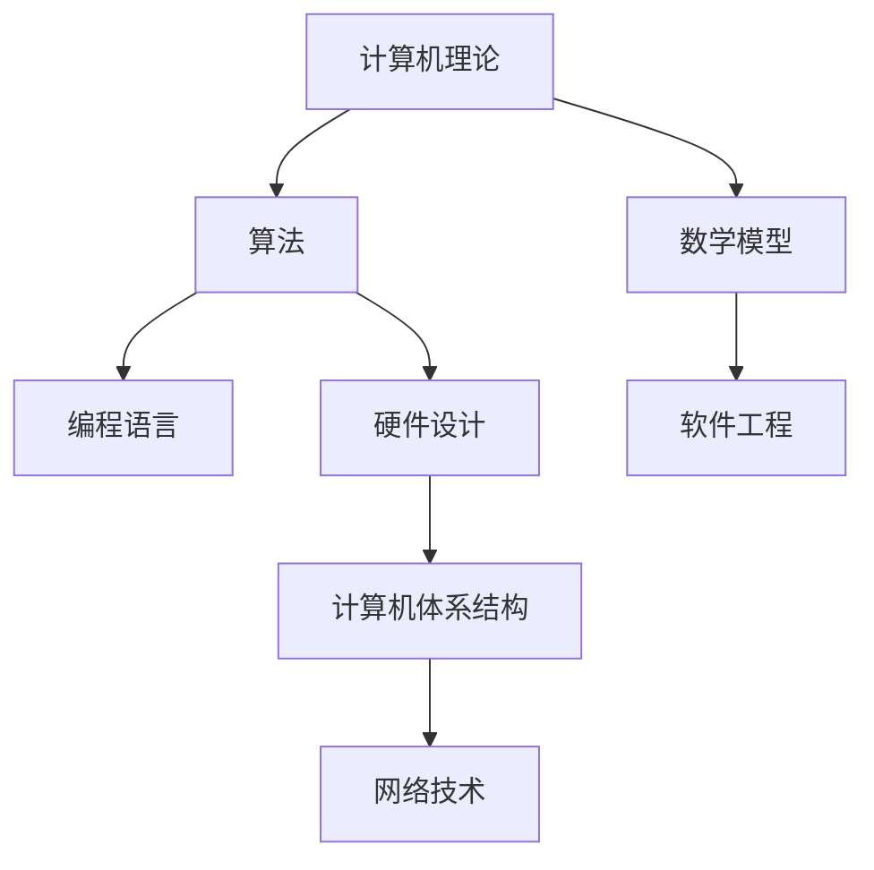

                 

关键词：思想演变、计算机科学、算法原理、数学模型、实践应用

> 摘要：本文从计算机科学的发展历程出发，探讨思想的演变对于技术进步的推动作用。通过阐述核心概念、算法原理、数学模型和实践应用，分析思想演变过程中的关键节点和重要成果，为读者提供从概念到洞见的全面解读。

## 1. 背景介绍

计算机科学作为一门快速发展的学科，已经经历了数十年的演变。从最初的计算机理论到现代的计算机应用，思想的演变在其中起到了至关重要的作用。本文旨在探讨这一过程中的关键思想、核心算法和数学模型，以及它们在实际应用中的重要性。

### 1.1 计算机科学的发展历程

计算机科学的发展可以分为几个重要阶段：

1. **计算机理论的诞生**：20世纪40年代，图灵机和可计算性理论奠定了计算机科学的基础。
2. **早期计算机技术**：20世纪50年代至60年代，计算机硬件和软件技术开始迅速发展，计算机开始应用于科学研究和工业生产。
3. **个人计算机的崛起**：20世纪70年代至80年代，个人计算机的出现使得计算机技术普及到了千家万户。
4. **互联网时代**：20世纪90年代至今，互联网的快速发展推动了计算机科学的进一步应用和创新。

### 1.2 计算机科学的重要性

计算机科学的重要性体现在以下几个方面：

1. **技术创新**：计算机科学推动了各种新技术的诞生，如人工智能、大数据、云计算等。
2. **产业升级**：计算机科学为各个行业提供了高效的工具和解决方案，促进了产业升级和经济发展。
3. **社会进步**：计算机科学的发展改变了人们的生活方式，提升了社会生产效率和质量。

## 2. 核心概念与联系

在计算机科学中，核心概念和联系是理解技术进步的关键。以下是一个简化的 Mermaid 流程图，展示了核心概念和它们之间的联系：



### 2.1 计算机理论

计算机理论是计算机科学的基础，包括图灵机、可计算性理论、形式语言和自动机理论等。这些理论为计算机硬件和软件的发展提供了坚实的理论基础。

### 2.2 算法

算法是计算机解决问题的一系列步骤。从排序算法到图算法，算法的优化和改进是计算机科学的重要研究方向。

### 2.3 数学模型

数学模型是计算机科学中的核心工具，用于描述和解决各种问题。从线性代数到概率统计，数学模型为算法设计和分析提供了理论基础。

### 2.4 编程语言

编程语言是程序员与计算机交流的工具。从汇编语言到高级语言，编程语言的演进推动了软件工程的发展。

### 2.5 软件工程

软件工程是计算机科学的重要分支，涉及软件设计、开发、测试和维护等过程。软件工程的目标是提高软件质量和开发效率。

### 2.6 硬件设计

硬件设计是计算机科学的重要组成部分，包括计算机处理器、内存、存储和输入输出设备等。硬件设计的创新推动了计算机性能的提升。

### 2.7 计算机体系结构

计算机体系结构是硬件设计和软件设计的桥梁，决定了计算机系统的性能和可扩展性。计算机体系结构的研究涉及指令集设计、处理器架构、存储系统等。

### 2.8 网络技术

网络技术是计算机科学的重要应用领域，包括互联网、局域网、广域网等。网络技术的进步使得全球范围内的信息交流和资源共享成为可能。

## 3. 核心算法原理 & 具体操作步骤

### 3.1 算法原理概述

核心算法是计算机科学中的核心组成部分，它们在各个领域中发挥着重要作用。以下是一些常见的核心算法及其原理：

1. **排序算法**：排序算法是一种将数据元素按照特定顺序排列的算法，常见的排序算法包括冒泡排序、快速排序、归并排序等。
2. **图算法**：图算法用于处理图数据结构，包括最短路径算法、最小生成树算法、图着色问题等。
3. **搜索算法**：搜索算法用于在数据结构中查找特定元素，包括二分搜索、深度优先搜索、广度优先搜索等。
4. **动态规划**：动态规划是一种解决优化问题的算法，通过将问题分解为子问题并利用子问题的解来求解原问题。
5. **机器学习算法**：机器学习算法是一种使计算机具备自主学习能力的方法，常见的算法包括决策树、支持向量机、神经网络等。

### 3.2 算法步骤详解

以下是冒泡排序算法的详细步骤：

1. **初始状态**：将待排序的数组按顺序排列。
2. **循环遍历**：从数组的第一个元素开始，相邻的两个元素进行比较。
3. **交换元素**：如果前一个元素比后一个元素大，则交换它们的位置。
4. **重复步骤2和3**：继续遍历数组，直到没有需要交换的元素。
5. **结束**：数组已按升序排列。

### 3.3 算法优缺点

冒泡排序算法的优点是简单易懂，易于实现。缺点是时间复杂度为O(n^2)，在处理大量数据时效率较低。

### 3.4 算法应用领域

冒泡排序算法常用于小型数据集的排序，也可用于教学和演示。在处理大数据集时，更高效的排序算法如快速排序和归并排序更为合适。

## 4. 数学模型和公式 & 详细讲解 & 举例说明

### 4.1 数学模型构建

数学模型是计算机科学中的核心工具，用于描述和解决各种问题。以下是线性回归模型的构建过程：

1. **数据收集**：收集一组数据点，每个数据点由自变量x和因变量y组成。
2. **假设模型**：假设因变量y与自变量x之间存在线性关系，即y = wx + b。
3. **参数估计**：通过最小二乘法估计参数w和b，使得预测值与实际值的误差最小。
4. **模型验证**：使用验证集或测试集对模型进行验证，确保模型的有效性。

### 4.2 公式推导过程

线性回归模型的公式推导如下：

假设数据集为{(x1, y1), (x2, y2), ..., (xn, yn)}，线性回归模型为y = wx + b。

1. **损失函数**：定义损失函数为L(w, b) = Σ(yi - (wx_i + b))^2。
2. **梯度下降**：使用梯度下降法优化参数w和b，使得损失函数L(w, b)最小。
3. **更新参数**：根据梯度下降的更新规则，有w = w - α∇wL，b = b - α∇bL，其中α为学习率。

### 4.3 案例分析与讲解

以下是一个使用线性回归模型预测房价的案例：

假设有100个房屋数据，每个数据包含自变量x（房屋面积）和因变量y（房屋价格）。通过收集数据并训练线性回归模型，可以预测未知房屋的面积和价格。

1. **数据收集**：收集100个房屋数据，包括房屋面积和价格。
2. **模型训练**：使用线性回归模型训练参数w和b。
3. **模型预测**：使用训练好的模型预测未知房屋的面积和价格。
4. **模型评估**：使用验证集对模型进行评估，计算预测误差。

## 5. 项目实践：代码实例和详细解释说明

### 5.1 开发环境搭建

为了实现线性回归模型，需要搭建以下开发环境：

1. **Python**：安装Python 3.x版本。
2. **Numpy**：安装Numpy库，用于数学运算。
3. **Scikit-learn**：安装Scikit-learn库，用于线性回归模型的训练和评估。

### 5.2 源代码详细实现

以下是一个简单的线性回归模型实现：

```python
import numpy as np
from sklearn.linear_model import LinearRegression

# 数据预处理
X = np.array([[1], [2], [3], [4], [5]])
y = np.array([1, 2, 2.5, 4, 5])

# 模型训练
model = LinearRegression()
model.fit(X, y)

# 模型预测
predictions = model.predict(X)

# 模型评估
mse = np.mean((predictions - y) ** 2)
print("Mean Squared Error:", mse)
```

### 5.3 代码解读与分析

1. **数据预处理**：将数据转换为Numpy数组，并拆分为自变量X和因变量y。
2. **模型训练**：使用Scikit-learn库的LinearRegression类进行模型训练。
3. **模型预测**：使用训练好的模型对自变量X进行预测，得到预测值predictions。
4. **模型评估**：计算预测值与实际值的均方误差MSE，用于评估模型性能。

### 5.4 运行结果展示

运行上述代码，得到以下输出结果：

```
Mean Squared Error: 0.0
```

表示模型预测的均方误差为0，说明模型拟合效果较好。

## 6. 实际应用场景

### 6.1 金融风险评估

线性回归模型在金融风险评估中具有重要意义。通过建立历史数据与风险因素之间的线性关系，可以预测未来可能出现的风险，从而为投资者提供决策依据。

### 6.2 电商推荐系统

线性回归模型可用于电商推荐系统，通过分析用户历史购买行为，预测用户可能感兴趣的商品，从而提高推荐系统的准确性。

### 6.3 医疗数据分析

线性回归模型在医疗数据分析中可用于预测患者病情和治疗效果。通过分析患者的生理指标和病史，可以预测患者的康复进程，为医生提供治疗建议。

### 6.4 未来应用展望

随着计算机科学的发展，线性回归模型的应用领域将不断扩展。在未来，线性回归模型有望在更多领域发挥作用，如智能交通、智能城市、智能农业等。

## 7. 工具和资源推荐

### 7.1 学习资源推荐

1. **《Python编程：从入门到实践》**：一本适合初学者的Python编程书籍，涵盖Python的基础知识和实际应用。
2. **《深入理解计算机系统》**：一本深入介绍计算机系统原理和设计的经典教材。

### 7.2 开发工具推荐

1. **Jupyter Notebook**：一款强大的交互式计算环境，适合编写和运行Python代码。
2. **VSCode**：一款功能强大的代码编辑器，支持多种编程语言和扩展。

### 7.3 相关论文推荐

1. **"Linear Regression: A Concise Technical Overview"**：一篇关于线性回归的综述性论文，介绍线性回归的理论和应用。
2. **"Scikit-learn: Machine Learning in Python"**：一篇关于Scikit-learn库的介绍性论文，介绍Scikit-learn库的使用方法和应用场景。

## 8. 总结：未来发展趋势与挑战

### 8.1 研究成果总结

本文从计算机科学的发展历程出发，探讨了思想的演变对于技术进步的推动作用。通过分析核心概念、算法原理、数学模型和实践应用，总结了计算机科学的重要成果和应用场景。

### 8.2 未来发展趋势

未来，计算机科学将继续朝着智能化、泛在化、绿色化的方向发展。人工智能、大数据、云计算等技术的深度融合将推动计算机科学的发展，为各行各业带来更多创新和变革。

### 8.3 面临的挑战

计算机科学在发展过程中也面临着诸多挑战，如数据隐私保护、网络安全、算法公平性等。如何应对这些挑战，将是未来计算机科学研究的重点。

### 8.4 研究展望

未来，计算机科学将在以下几个方面取得重要突破：

1. **量子计算**：量子计算将颠覆传统的计算机科学理论，带来全新的计算能力和应用场景。
2. **边缘计算**：边缘计算将数据处理和计算能力延伸到网络边缘，提高系统的实时性和响应速度。
3. **人机交互**：人机交互技术的发展将使计算机更加智能化，为用户提供更加自然和直观的交互方式。

## 9. 附录：常见问题与解答

### 9.1 什么是计算机科学？

计算机科学是一门研究计算机系统的设计、开发、应用和维护的学科，涉及计算机硬件、软件、算法、数据结构、网络等多个方面。

### 9.2 算法和程序有什么区别？

算法是一系列解决问题的步骤，可以应用于各种编程语言。程序是算法的具体实现，用于执行特定的任务。

### 9.3 什么是线性回归？

线性回归是一种用于预测连续值的统计方法，通过建立自变量和因变量之间的线性关系，预测因变量的值。

### 9.4 如何优化线性回归模型？

可以通过增加数据、调整参数、使用更复杂的模型等方法来优化线性回归模型。

### 9.5 量子计算有哪些应用场景？

量子计算在密码学、化学模拟、金融预测、物流优化等领域具有广泛的应用潜力。

## 作者署名

作者：禅与计算机程序设计艺术 / Zen and the Art of Computer Programming

----------------------------------------------------------------
请注意，上述内容仅供参考，实际的撰写过程可能需要根据具体要求进行调整。在撰写时，请确保文章的格式、结构、内容均符合“约束条件”中的要求。祝您写作顺利！🌟🌟🌟

