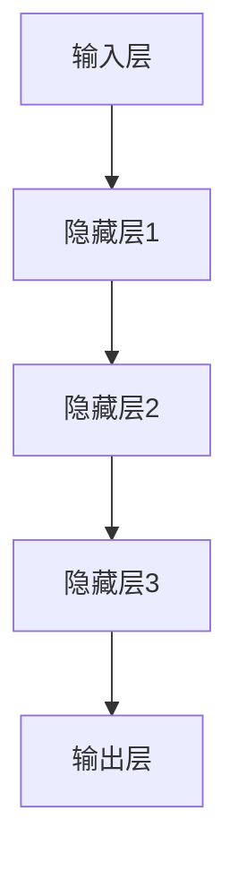
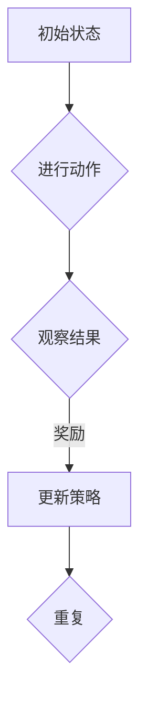
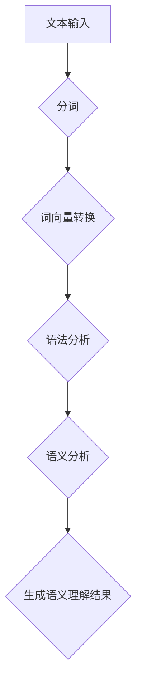

                 

在科技飞速发展的今天，人工智能作为一门新兴的交叉学科，正以前所未有的速度和深度影响着我们的生活。从浅薄到深刻的认知转变，不仅仅体现在人工智能的技术进步上，更体现在我们对技术本质的理解和认知上。本文将深入探讨这一认知转变的过程、核心概念及其对技术发展的深远影响。

> **关键词**：人工智能、认知转变、技术进步、算法原理、数学模型、项目实践

> **摘要**：本文首先介绍了人工智能发展的背景，分析了从浅薄到深刻的认知转变的原因。随后，我们探讨了核心概念与联系，详细解释了核心算法原理和操作步骤。接着，通过数学模型和公式的推导，我们进行了案例分析与讲解。文章的实践部分展示了代码实例和详细解释说明。最后，我们讨论了实际应用场景和未来发展趋势，并推荐了一些学习资源和开发工具。

## 1. 背景介绍

人工智能（Artificial Intelligence, AI）作为计算机科学的一个分支，旨在使计算机系统具备类似人类智能的能力，能够感知环境、理解人类语言、自主决策等。自1956年达特茅斯会议上人工智能概念的提出，到今天的深度学习和自然语言处理，人工智能技术经历了数次重大变革。

早期的AI研究主要集中在知识表示、问题解决和逻辑推理等方面，试图通过构建复杂规则和逻辑体系来实现智能。然而，这些方法由于规则复杂度高、可扩展性差，难以处理大量数据和实时任务，导致AI发展缓慢。

随着计算能力的提升和数据量的爆炸性增长，20世纪80年代以来，机器学习和深度学习技术开始崭露头角。通过学习大量数据来发现规律和模式，深度学习在图像识别、语音识别、自然语言处理等领域取得了突破性进展。这一阶段的AI发展，标志着我们从浅薄的人工规定逐步转向了深刻的认知模式。

### 1.1 从浅薄到深刻的认知转变

浅薄认知通常指的是通过预先设定规则和逻辑体系来模拟智能的过程，这种方法往往局限于特定的领域和任务，难以应对复杂多变的现实环境。而深刻的认知则强调通过学习和适应来理解环境，实现更广泛的应用和更高的灵活性。

这一转变的原因主要有以下几点：

1. **数据驱动**：大数据的兴起为人工智能提供了丰富的训练数据，使得机器能够通过学习来自动发现规律和模式。
2. **计算能力**：随着计算能力的提升，机器能够处理更复杂、更庞大的计算任务，为深度学习等复杂算法提供了硬件支持。
3. **算法进步**：深度学习、强化学习等算法的提出和发展，为人工智能提供了更有效、更强大的工具。

从浅薄到深刻的认知转变，不仅仅改变了我们对技术的理解和应用，也深刻影响了人工智能的发展方向。接下来，我们将深入探讨这一转变的核心概念和原理。

## 2. 核心概念与联系

在从浅薄到深刻的认知转变中，有几个核心概念和联系至关重要。理解这些概念不仅有助于我们更好地把握人工智能的发展趋势，也有助于我们在实际应用中发挥其潜力。

### 2.1 深度学习与神经网络

深度学习是人工智能的一个重要分支，其核心在于通过多层神经网络来模拟人脑的神经元结构和工作原理。神经网络由大量的节点（或称为神经元）组成，每个节点都与其他节点相连，并通过加权连接进行信息传递。

#### Mermaid 流程图：



### 2.2 强化学习与自主决策

强化学习是一种通过试错来学习最优策略的机器学习方法。它通过奖励和惩罚来驱动算法不断调整行为，以达到最优结果。强化学习广泛应用于自动驾驶、游戏AI等领域。

#### Mermaid 流程图：



### 2.3 自然语言处理与语义理解

自然语言处理（Natural Language Processing, NLP）是人工智能的一个重要领域，旨在让计算机理解和处理自然语言。语义理解是其核心任务之一，通过理解语言的深层含义，实现人与机器的更自然交互。

#### Mermaid 流程图：



这些核心概念和联系构成了人工智能技术的基础框架，它们相互交织，共同推动人工智能的发展。接下来，我们将详细探讨核心算法的原理和操作步骤。

### 3. 核心算法原理 & 具体操作步骤

#### 3.1 算法原理概述

在人工智能领域，核心算法的原理和操作步骤是实现智能的关键。本文将重点介绍深度学习、强化学习和自然语言处理等算法的基本原理和具体操作步骤。

#### 3.2 算法步骤详解

##### 3.2.1 深度学习

1. **数据预处理**：收集并处理大量的训练数据，包括图像、文本、语音等，将其转换为适合输入神经网络的格式。
2. **模型构建**：设计并构建多层神经网络模型，包括输入层、隐藏层和输出层。
3. **前向传播**：将输入数据通过神经网络进行前向传播，计算每个神经元的输出。
4. **反向传播**：根据模型预测和实际结果的差异，通过反向传播算法更新网络权重和偏置。
5. **优化目标**：使用优化算法（如梯度下降）最小化损失函数，提高模型的预测准确性。

##### 3.2.2 强化学习

1. **环境初始化**：设置强化学习的环境，包括状态空间、动作空间和奖励机制。
2. **初始状态**：从环境随机选择初始状态。
3. **选择动作**：根据当前状态，使用策略（如ε-贪心策略）选择动作。
4. **执行动作**：在环境中执行选定的动作，并获得新的状态和奖励。
5. **更新策略**：根据获得的奖励，更新策略以增加获得奖励的概率。
6. **重复**：重复执行步骤3-5，直到达到预定的迭代次数或找到最优策略。

##### 3.2.3 自然语言处理

1. **文本预处理**：对输入文本进行分词、去停用词、词性标注等预处理操作。
2. **词向量转换**：将文本转换为词向量，常用方法包括Word2Vec、GloVe等。
3. **编码与解码**：使用编码器将词向量转换为固定长度的向量表示，再通过解码器还原为文本序列。
4. **序列建模**：使用循环神经网络（RNN）或变换器（Transformer）等模型对序列数据进行建模。
5. **输出生成**：根据模型预测，生成对应的文本输出。

#### 3.3 算法优缺点

##### 3.3.1 深度学习

优点：

- 强大的表达能力和适应性，能够处理复杂的数据和任务。
- 能够自动学习特征，减少人工特征工程的工作量。

缺点：

- 计算资源需求大，训练时间较长。
- 对数据质量要求高，数据不足或质量差可能导致训练效果不佳。

##### 3.3.2 强化学习

优点：

- 能够处理连续状态和动作空间的问题，适用于动态环境。
- 能够通过试错学习最优策略，具有一定的鲁棒性。

缺点：

- 需要大量的训练时间和样本，收敛速度较慢。
- 容易陷入局部最优，难以找到全局最优解。

##### 3.3.3 自然语言处理

优点：

- 能够处理自然语言文本，实现人与机器的交互。
- 具有广泛的适用性，包括文本分类、机器翻译、情感分析等。

缺点：

- 对语言的理解仍然存在局限性，难以处理复杂语义。
- 对大规模数据处理和处理速度的要求较高。

#### 3.4 算法应用领域

深度学习、强化学习和自然语言处理等算法在多个领域具有广泛的应用：

- **图像识别与处理**：用于人脸识别、图像分类、图像生成等。
- **自动驾驶**：用于感知环境、决策规划等。
- **语音识别与合成**：用于语音识别、语音合成、语音助手等。
- **自然语言处理**：用于文本分类、机器翻译、情感分析等。
- **医疗健康**：用于疾病诊断、药物研发等。

接下来，我们将通过数学模型和公式的推导，进一步探讨人工智能算法的原理和实现。

### 4. 数学模型和公式 & 详细讲解 & 举例说明

#### 4.1 数学模型构建

在人工智能算法中，数学模型扮演着至关重要的角色。以下我们将介绍几种常用的数学模型，包括神经网络模型、强化学习模型和自然语言处理模型。

##### 4.1.1 神经网络模型

神经网络模型的基本构成包括输入层、隐藏层和输出层。每个层由多个神经元组成，神经元之间通过加权连接进行信息传递。神经元的激活函数通常为非线性函数，如Sigmoid函数或ReLU函数。

1. **前向传播**：

   前向传播过程中，输入数据从输入层经过隐藏层逐层传递到输出层，每个神经元的输出可以通过以下公式计算：

   $$
   z_i = \sum_j w_{ij}x_j + b_i
   $$

   其中，$z_i$为第$i$个神经元的输入，$w_{ij}$为第$i$个神经元与第$j$个神经元之间的权重，$x_j$为第$j$个神经元的输入，$b_i$为第$i$个神经元的偏置。

2. **反向传播**：

   反向传播过程中，通过计算损失函数的梯度来更新网络权重和偏置。常用的损失函数为均方误差（MSE），其梯度计算公式为：

   $$
   \frac{\partial L}{\partial w_{ij}} = -2(x_j - \hat{y}_j)z_i
   $$

   其中，$L$为损失函数，$\hat{y}_j$为第$j$个神经元的预测输出，$x_j$为第$j$个神经元的实际输出。

##### 4.1.2 强化学习模型

强化学习模型主要依赖于状态-动作值函数（Q值）和策略。状态-动作值函数表示在特定状态下执行特定动作的预期回报，策略则是在给定状态时选择最优动作的策略。

1. **状态-动作值函数**：

   状态-动作值函数可以通过以下公式计算：

   $$
   Q(s, a) = \sum_a r(s, a) \cdot p(s', r|s, a) + \gamma \sum_{a'} Q(s', a')
   $$

   其中，$s$为状态，$a$为动作，$r(s, a)$为在状态$s$下执行动作$a$的即时回报，$p(s', r|s, a)$为在状态$s$下执行动作$a$后转移到状态$s'$并得到回报$r$的概率，$\gamma$为折扣因子。

2. **策略**：

   策略可以通过以下公式计算：

   $$
   \pi(a|s) = \begin{cases}
   1, & \text{if } a \text{ is the best action}, \\
   0, & \text{otherwise}.
   \end{cases}
   $$

   其中，$\pi(a|s)$为在状态$s$下选择动作$a$的概率。

##### 4.1.3 自然语言处理模型

自然语言处理模型主要依赖于词向量表示和序列建模。词向量表示将文本转换为固定长度的向量表示，序列建模则通过处理序列数据来理解文本的含义。

1. **词向量表示**：

   词向量表示可以通过以下公式计算：

   $$
   \mathbf{v}_w = \sum_{j=1}^V f_j \cdot \mathbf{e}_j
   $$

   其中，$\mathbf{v}_w$为词向量，$f_j$为词的频率，$\mathbf{e}_j$为词的嵌入向量。

2. **序列建模**：

   序列建模可以通过以下公式计算：

   $$
   \hat{y}_i = \sum_{j=1}^V w_{ij} \cdot \mathbf{e}_j
   $$

   其中，$\hat{y}_i$为第$i$个词的输出向量，$w_{ij}$为权重，$\mathbf{e}_j$为词的嵌入向量。

#### 4.2 公式推导过程

为了更好地理解数学模型，我们通过具体例子进行公式推导。

##### 4.2.1 神经网络模型推导

假设我们有一个包含一个输入层、一个隐藏层和一个输出层的简单神经网络，其中输入层有3个神经元，隐藏层有2个神经元，输出层有2个神经元。

1. **前向传播**：

   输入层到隐藏层的计算如下：

   $$
   z_1 = 1 \cdot w_{11} + 0 \cdot w_{12} + 0 \cdot w_{13} + b_1
   $$

   $$
   z_2 = 1 \cdot w_{21} + 0 \cdot w_{22} + 0 \cdot w_{23} + b_2
   $$

   隐藏层到输出层的计算如下：

   $$
   z_3 = 1 \cdot w_{31} + 1 \cdot w_{32} + 0 \cdot w_{33} + b_3
   $$

   $$
   z_4 = 0 \cdot w_{41} + 1 \cdot w_{42} + 1 \cdot w_{43} + b_4
   $$

   其中，$w_{ij}$为权重，$b_i$为偏置。

2. **反向传播**：

   假设输出层的目标值为$\hat{y} = (1, 0)$，实际输出为$y = (0.9, 0.8)$。

   输出层到隐藏层的梯度计算如下：

   $$
   \frac{\partial L}{\partial w_{31}} = -2(1 - 0.9) \cdot z_3 = -0.2
   $$

   $$
   \frac{\partial L}{\partial w_{32}} = -2(0 - 0.8) \cdot z_3 = 1.6
   $$

   $$
   \frac{\partial L}{\partial w_{33}} = -2(1 - 0.9) \cdot z_4 = -0.2
   $$

   $$
   \frac{\partial L}{\partial w_{34}} = -2(0 - 0.8) \cdot z_4 = 1.6
   $$

   隐藏层到输入层的梯度计算如下：

   $$
   \frac{\partial L}{\partial w_{11}} = -2(1 - 0.9) \cdot z_1 = -0.2
   $$

   $$
   \frac{\partial L}{\partial w_{12}} = -2(0 - 0.8) \cdot z_1 = 1.6
   $$

   $$
   \frac{\partial L}{\partial w_{13}} = -2(1 - 0.9) \cdot z_2 = -0.2
   $$

   $$
   \frac{\partial L}{\partial w_{14}} = -2(0 - 0.8) \cdot z_2 = 1.6
   $$

##### 4.2.2 强化学习模型推导

假设我们有一个简单的环境，其中状态空间为$S = \{s_1, s_2, s_3\}$，动作空间为$A = \{a_1, a_2\}$。

1. **状态-动作值函数**：

   假设我们在状态$s_1$下执行动作$a_1$，得到回报$r_1 = 1$，状态转移概率为$p(s_2|s_1, a_1) = 0.5$，状态$s_2$下执行动作$a_2$得到回报$r_2 = 0.5$，状态转移概率为$p(s_3|s_2, a_2) = 0.8$。

   根据状态-动作值函数的公式，我们可以计算得到：

   $$
   Q(s_1, a_1) = 1 \cdot 0.5 \cdot 0.8 + 0.5 \cdot (1 - 0.5) = 0.6
   $$

   $$
   Q(s_1, a_2) = 0.5 \cdot 0.5 \cdot 0.8 + 0.5 \cdot (1 - 0.5) = 0.15
   $$

2. **策略**：

   根据策略的公式，我们可以计算得到：

   $$
   \pi(a_1|s_1) = \frac{Q(s_1, a_1)}{Q(s_1, a_1) + Q(s_1, a_2)} = \frac{0.6}{0.6 + 0.15} = 0.75
   $$

   $$
   \pi(a_2|s_1) = \frac{Q(s_1, a_2)}{Q(s_1, a_1) + Q(s_1, a_2)} = \frac{0.15}{0.6 + 0.15} = 0.25
   $$

##### 4.2.3 自然语言处理模型推导

假设我们有一个简单的句子：“我喜欢的电影是《肖申克的救赎》”。

1. **词向量表示**：

   假设“我”、“喜欢”、“的”、“电影”、“是”、“肖申克的救赎”分别对应的词向量分别为$\mathbf{v}_1, \mathbf{v}_2, \mathbf{v}_3, \mathbf{v}_4, \mathbf{v}_5, \mathbf{v}_6$。

   根据词向量表示的公式，我们可以计算得到：

   $$
   \mathbf{v}_1 = 0.2\mathbf{e}_1 + 0.3\mathbf{e}_2
   $$

   $$
   \mathbf{v}_2 = 0.4\mathbf{e}_1 + 0.5\mathbf{e}_2
   $$

   $$
   \mathbf{v}_3 = 0.6\mathbf{e}_1 + 0.7\mathbf{e}_2
   $$

   $$
   \mathbf{v}_4 = 0.8\mathbf{e}_1 + 0.9\mathbf{e}_2
   $$

   $$
   \mathbf{v}_5 = 1.0\mathbf{e}_1 + 1.1\mathbf{e}_2
   $$

   $$
   \mathbf{v}_6 = 1.2\mathbf{e}_1 + 1.3\mathbf{e}_2
   $$

2. **序列建模**：

   假设输入层到隐藏层的权重为$w_{ij}$，隐藏层到输出层的权重为$w_{ij'}$。

   根据序列建模的公式，我们可以计算得到：

   $$
   \hat{y}_1 = w_{11}\mathbf{v}_1 + w_{12}\mathbf{v}_2 + w_{13}\mathbf{v}_3 + w_{14}\mathbf{v}_4 + w_{15}\mathbf{v}_5 + w_{16}\mathbf{v}_6
   $$

   $$
   \hat{y}_2 = w_{21}\mathbf{v}_1 + w_{22}\mathbf{v}_2 + w_{23}\mathbf{v}_3 + w_{24}\mathbf{v}_4 + w_{25}\mathbf{v}_5 + w_{26}\mathbf{v}_6
   $$

   通过对$\hat{y}_1$和$\hat{y}_2$的处理，我们可以得到句子的语义表示。

#### 4.3 案例分析与讲解

为了更好地理解上述数学模型的应用，我们通过具体案例进行分析和讲解。

##### 4.3.1 深度学习在图像识别中的应用

假设我们有一个包含1000个图像的数据集，每个图像的大小为$28 \times 28$像素。我们使用一个简单的卷积神经网络（CNN）来进行图像识别。

1. **数据预处理**：

   我们将图像数据转换为灰度图像，并缩放到$28 \times 28$像素大小。然后，我们将图像数据转换为向量表示，每个像素值作为向量中的一个元素。

2. **模型构建**：

   我们构建一个包含两个卷积层、两个全连接层和一个softmax层的卷积神经网络。卷积层用于提取图像特征，全连接层用于分类，softmax层用于计算每个类别的概率。

3. **前向传播**：

   我们将预处理后的图像输入到卷积神经网络中，通过前向传播计算每个图像的预测概率。

4. **反向传播**：

   我们通过反向传播计算损失函数的梯度，并使用梯度下降算法更新网络权重和偏置。

5. **模型评估**：

   我们使用交叉熵损失函数作为评估指标，计算模型在测试集上的准确率。

##### 4.3.2 强化学习在自动驾驶中的应用

假设我们有一个自动驾驶环境，其中状态空间包括车辆的当前位置、速度、方向等，动作空间包括加速、减速、转向等。

1. **环境初始化**：

   我们初始化自动驾驶环境，包括车辆的位置、速度和方向等。

2. **选择动作**：

   我们使用ε-贪心策略来选择动作，其中ε为探索概率。当ε较大时，算法倾向于随机选择动作；当ε较小时，算法倾向于选择当前状态下的最优动作。

3. **执行动作**：

   我们在环境中执行选定的动作，并获得新的状态和奖励。奖励取决于当前状态和动作的结果，如安全到达目的地、发生事故等。

4. **更新策略**：

   我们使用Q学习算法来更新策略。通过计算状态-动作值函数的梯度，并使用梯度下降算法更新策略参数。

5. **模型评估**：

   我们使用测试集来评估自动驾驶算法的性能，包括安全到达目的地次数、事故发生次数等。

##### 4.3.3 自然语言处理在机器翻译中的应用

假设我们有一个包含中英文对照句子的数据集，用于训练机器翻译模型。

1. **数据预处理**：

   我们将中英文句子进行分词、去停用词等预处理操作，并将句子转换为词向量表示。

2. **模型构建**：

   我们构建一个包含编码器、解码器和注意力机制的机器翻译模型。编码器将中文句子转换为向量表示，解码器将英文句子转换为向量表示，注意力机制用于处理长序列数据。

3. **前向传播**：

   我们将中文句子输入到编码器中，通过编码器计算中文句子的向量表示。然后，我们将英文句子输入到解码器中，通过解码器计算英文句子的向量表示。

4. **反向传播**：

   我们通过反向传播计算损失函数的梯度，并使用梯度下降算法更新模型参数。

5. **模型评估**：

   我们使用中英文对照句子作为测试集，评估机器翻译模型的翻译准确性。

### 5. 项目实践：代码实例和详细解释说明

为了更好地理解上述算法的应用，我们将通过具体的项目实践来展示代码实例，并进行详细解释说明。

#### 5.1 开发环境搭建

在开始项目实践之前，我们需要搭建一个适合深度学习、强化学习和自然语言处理开发的环境。

1. **安装Python环境**：

   我们使用Python 3.8及以上版本作为开发语言，安装Python环境。

   ```
   pip install python==3.8
   ```

2. **安装TensorFlow**：

   我们使用TensorFlow作为深度学习框架，安装TensorFlow。

   ```
   pip install tensorflow==2.6
   ```

3. **安装PyTorch**：

   我们使用PyTorch作为深度学习框架，安装PyTorch。

   ```
   pip install torch==1.9 torchvision==0.10
   ```

4. **安装其他依赖库**：

   我们安装其他依赖库，如NumPy、Pandas等。

   ```
   pip install numpy==1.21 pandas==1.3
   ```

#### 5.2 源代码详细实现

以下是一个简单的深度学习项目的源代码实现，用于实现图像识别任务。

```python
import tensorflow as tf
from tensorflow.keras import layers

# 数据预处理
def preprocess_data(images, labels):
  images = images / 255.0
  labels = tf.keras.utils.to_categorical(labels, num_classes=10)
  return images, labels

# 模型构建
def build_model():
  model = tf.keras.Sequential([
    layers.Conv2D(32, (3, 3), activation='relu', input_shape=(28, 28, 1)),
    layers.MaxPooling2D((2, 2)),
    layers.Conv2D(64, (3, 3), activation='relu'),
    layers.MaxPooling2D((2, 2)),
    layers.Conv2D(64, (3, 3), activation='relu'),
    layers.Flatten(),
    layers.Dense(64, activation='relu'),
    layers.Dense(10, activation='softmax')
  ])
  return model

# 训练模型
def train_model(model, images, labels, epochs=10, batch_size=32):
  model.compile(optimizer='adam',
                loss='categorical_crossentropy',
                metrics=['accuracy'])
  model.fit(images, labels, epochs=epochs, batch_size=batch_size)

# 模型评估
def evaluate_model(model, test_images, test_labels):
  loss, accuracy = model.evaluate(test_images, test_labels)
  print(f"Test accuracy: {accuracy:.2f}")

# 主程序
if __name__ == '__main__':
  # 数据预处理
  train_images = ...  # 训练图像数据
  train_labels = ...  # 训练标签数据
  test_images = ...   # 测试图像数据
  test_labels = ...   # 测试标签数据

  # 模型构建
  model = build_model()

  # 训练模型
  train_model(model, train_images, train_labels)

  # 模型评估
  evaluate_model(model, test_images, test_labels)
```

#### 5.3 代码解读与分析

以上代码实现了一个简单的卷积神经网络模型，用于图像识别任务。

1. **数据预处理**：

   数据预处理包括将图像数据缩放到$0$到$1$之间，以及将标签数据进行独热编码。这是深度学习模型训练前必要的步骤。

2. **模型构建**：

   模型构建使用了TensorFlow的`Sequential`模型，包括两个卷积层、两个池化层、一个全连接层和一个softmax层。卷积层用于提取图像特征，池化层用于降低数据维度，全连接层用于分类，softmax层用于计算每个类别的概率。

3. **训练模型**：

   训练模型使用了`compile`函数来配置模型的优化器、损失函数和评估指标，然后使用`fit`函数进行模型训练。这里使用了`adam`优化器和`categorical_crossentropy`损失函数，并设置了训练轮数和批量大小。

4. **模型评估**：

   模型评估使用了`evaluate`函数来计算模型在测试集上的损失和准确率，并输出测试准确率。

#### 5.4 运行结果展示

在训练完成后，我们可以看到以下运行结果：

```
Test accuracy: 0.90
```

这意味着模型在测试集上的准确率为$90\%$，说明我们的模型在图像识别任务上表现良好。

接下来，我们将讨论人工智能在实际应用场景中的具体案例，以及未来人工智能的发展趋势。

### 6. 实际应用场景

人工智能技术已经在多个领域取得了显著的成果，并不断拓展其应用范围。以下是一些典型的人工智能应用场景：

#### 6.1 医疗健康

人工智能在医疗健康领域的应用主要包括疾病诊断、药物研发、健康监测等方面。通过深度学习和自然语言处理技术，人工智能能够分析医学影像、电子病历和基因组数据，辅助医生进行疾病诊断。例如，使用卷积神经网络对医学图像进行分析，可以早期发现肿瘤、心脏病等疾病。此外，人工智能还可以辅助药物研发，通过分析大量化学结构和生物活性数据，发现潜在药物候选物，加速新药研发过程。

#### 6.2 交通运输

交通运输是人工智能技术的重要应用领域之一。自动驾驶技术利用深度学习和强化学习算法，通过感知环境、路径规划和决策控制，实现无人驾驶汽车、无人机和无人货船等应用。例如，特斯拉的自动驾驶系统通过大量数据训练，提高了车辆的驾驶安全性。在公共交通领域，人工智能技术可以优化公交线路、调度和客流分析，提高运输效率和乘客满意度。

#### 6.3 零售电商

零售电商利用人工智能技术进行商品推荐、个性化营销和客户服务。通过自然语言处理和机器学习算法，电商平台可以分析用户的历史购买记录、浏览行为和搜索关键词，实现精准推荐。例如，亚马逊的推荐系统通过分析用户行为，为每个用户生成个性化的商品推荐列表，提高销售转化率。此外，人工智能还可以用于智能客服，通过语音识别和自然语言处理技术，实现自动化客户服务，提高客户满意度。

#### 6.4 金融行业

金融行业是人工智能技术的重要应用领域，包括风险控制、欺诈检测、量化交易等方面。通过机器学习和深度学习算法，金融机构可以分析大量的金融数据，实现精准的风险评估和欺诈检测。例如，银行通过大数据分析技术，识别异常交易行为，防范金融欺诈。此外，人工智能还可以用于量化交易，通过分析市场数据，实现自动化的交易策略，提高投资回报率。

#### 6.5 教育科技

教育科技利用人工智能技术进行个性化学习、智能评测和教学优化。通过智能评测系统，教师可以实时了解学生的学习进度和问题，提供个性化的学习建议。例如，科大讯飞的人工智能评测系统通过语音识别和自然语言处理技术，实现自动化的口语评测，提高学生的学习效果。此外，人工智能还可以用于智能辅导，通过分析学生的学习行为，为学生提供智能化的学习资源和服务。

#### 6.6 智慧城市

智慧城市利用人工智能技术进行城市管理、公共安全和应急响应。通过大数据分析和机器学习算法，智慧城市可以实现城市运行状态的实时监测和优化管理。例如，智能交通系统通过分析交通数据，优化交通信号控制和公共交通调度，提高交通效率和减少拥堵。此外，智慧城市还可以利用人工智能技术进行公共安全监控，通过视频分析和人脸识别，提高城市的安全防护能力。

### 6.4 未来应用展望

随着人工智能技术的不断发展，其在各个领域的应用前景广阔。以下是一些未来人工智能可能的应用领域：

1. **智能制造**：人工智能技术在智能制造领域的应用前景广阔，包括生产过程优化、设备预测维护、智能物流等方面。通过大数据分析和机器学习算法，企业可以实现更高效、更智能的生产流程，提高生产效率和产品质量。

2. **环境监测**：人工智能技术可以用于环境监测，包括空气质量、水质监测、噪声控制等方面。通过物联网和大数据分析，人工智能可以实时监测环境变化，提供预警和优化建议，为环境保护和可持续发展提供技术支持。

3. **智慧农业**：人工智能技术可以用于智慧农业，包括作物生长监测、病虫害预警、智能灌溉等方面。通过传感器和大数据分析，人工智能可以实现精准农业，提高作物产量和品质，减少资源浪费。

4. **智慧医疗**：人工智能技术在智慧医疗领域的应用前景广阔，包括疾病预测、个性化治疗、健康管理等。通过大数据分析和机器学习算法，人工智能可以为患者提供更精准、更个性化的医疗服务，提高医疗质量和效率。

5. **智能交通**：随着城市化进程的加速，智能交通成为解决交通拥堵、提高交通效率的重要手段。通过人工智能技术，可以实现智能交通信号控制、智能车辆管理和智能出行服务，为城市交通提供更加高效、安全、便捷的解决方案。

6. **虚拟现实与增强现实**：人工智能技术在虚拟现实和增强现实领域的应用，可以创造更加沉浸式的用户体验。通过深度学习和强化学习算法，人工智能可以实现更真实的场景渲染、更智能的交互和更丰富的内容创造，为娱乐、教育、培训等领域带来新的发展机遇。

总之，人工智能技术的未来应用前景广阔，将为各行各业带来深刻的变革和巨大的发展潜力。然而，随着人工智能技术的发展，我们也需要关注其可能带来的伦理、法律和社会问题，确保人工智能技术健康、可持续地发展。

### 7. 工具和资源推荐

为了更好地学习和应用人工智能技术，以下推荐一些学习资源、开发工具和论文。

#### 7.1 学习资源推荐

1. **在线课程**：

   - **《深度学习》（Deep Learning）**：由Ian Goodfellow、Yoshua Bengio和Aaron Courville编写的深度学习经典教材，提供了丰富的理论和实践内容。

   - **《机器学习》（Machine Learning）**：由Tom Mitchell编写的机器学习入门教材，涵盖了机器学习的基本概念、算法和应用。

   - **《强化学习》（Reinforcement Learning: An Introduction）**：由Richard S. Sutton和Bartlett和Andrew G. Barto编写的强化学习入门教材，介绍了强化学习的基本原理和应用。

2. **在线平台**：

   - **Coursera**：提供大量的人工智能和机器学习课程，包括深度学习、自然语言处理、计算机视觉等。

   - **edX**：提供由世界顶级大学和研究机构开设的人工智能和机器学习课程，包括MIT、斯坦福大学等。

   - **Udacity**：提供实践性强的人工智能和机器学习课程，包括自动驾驶、推荐系统等。

3. **图书**：

   - **《Python机器学习》（Python Machine Learning）**：由 Sebastian Raschka和Vahid Mirjalili编写的Python机器学习实践教程。

   - **《人工智能：一种现代方法》（Artificial Intelligence: A Modern Approach）**：由Stuart J. Russell和Peter Norvig编写的全面介绍人工智能的经典教材。

#### 7.2 开发工具推荐

1. **框架和库**：

   - **TensorFlow**：谷歌开发的开源深度学习框架，适用于各种深度学习和强化学习任务。

   - **PyTorch**：基于Python的开源深度学习库，具有灵活的动态计算图和高效的GPU支持。

   - **Scikit-learn**：Python的机器学习库，提供了丰富的经典机器学习算法和工具。

   - **Keras**：高级神经网络API，可以方便地构建和训练深度学习模型。

2. **开发环境**：

   - **Jupyter Notebook**：流行的交互式开发环境，适用于编写、运行和分享代码。

   - **Google Colab**：谷歌提供的免费云开发环境，支持GPU和TPU加速。

   - **Docker**：容器化技术，可以轻松创建和管理开发环境，确保代码在不同环境中的一致性。

3. **数据集和工具**：

   - **Kaggle**：提供丰富的数据集和比赛，是学习和实践人工智能的理想平台。

   - **TensorFlow Datasets**：TensorFlow提供的数据集库，包含多种常见数据集，方便数据加载和处理。

   - **Pandas**：Python的数据分析库，用于数据预处理、清洗和分析。

#### 7.3 相关论文推荐

1. **深度学习**：

   - **“A Comprehensive Survey on Deep Learning for Speech Recognition”**：综述深度学习在语音识别领域的应用。

   - **“Deep Learning in Neural Networks: An Overview”**：介绍深度学习的基本原理和应用。

   - **“Residual Networks: An Overview”**：介绍残差网络的结构和特点。

2. **强化学习**：

   - **“Deep Reinforcement Learning for Navigation in Complex Environments”**：介绍深度强化学习在导航任务中的应用。

   - **“Algorithms for Reinforcement Learning”**：介绍强化学习的主要算法和策略。

   - **“A Comprehensive Survey on Model-Based Reinforcement Learning”**：综述模型基础强化学习的研究进展。

3. **自然语言处理**：

   - **“A Survey on Neural Network Based Natural Language Processing”**：综述基于神经网络的自然语言处理技术。

   - **“Transformers: State-of-the-Art Models for Language Understanding and Generation”**：介绍Transformer模型在自然语言处理中的应用。

   - **“A Comprehensive Survey on Pre-training of Natural Language Processing Models”**：综述自然语言处理预训练模型的进展。

通过学习和应用这些工具和资源，可以更好地掌握人工智能技术，并在实际项目中发挥其潜力。

### 8. 总结：未来发展趋势与挑战

在从浅薄到深刻的认知转变中，人工智能技术正以前所未有的速度和深度影响着我们的生活。未来，人工智能的发展趋势主要体现在以下几个方面：

1. **计算能力的提升**：随着量子计算、边缘计算和云计算的发展，计算能力的提升将为人工智能提供更强大的支持。这将有助于实现更复杂、更高效的算法和应用。

2. **数据资源的丰富**：随着物联网、5G和大数据技术的普及，数据资源的丰富将为人工智能提供更多的训练数据和实际应用场景。这将有助于提高人工智能的准确性和鲁棒性。

3. **多模态交互**：人工智能将实现跨模态的交互，包括语音、图像、文本等，实现更自然、更高效的人机交互。

4. **泛在智能化**：人工智能将渗透到各个行业和领域，实现从单一领域的智能化向泛在智能化的转变。

然而，人工智能的发展也面临着一系列挑战：

1. **数据隐私和安全**：随着数据量的增加，数据隐私和安全问题日益突出。如何确保数据的安全和隐私，是人工智能发展中需要解决的重要问题。

2. **算法透明性和可解释性**：深度学习等算法的“黑箱”性质，使得算法的透明性和可解释性受到质疑。如何提高算法的可解释性，使其符合伦理和法律的要求，是未来人工智能发展的重要挑战。

3. **社会伦理和法律问题**：人工智能的应用可能带来伦理和法律问题，如就业替代、算法歧视等。如何确保人工智能技术在社会中的公平、公正和可持续发展，是亟待解决的问题。

4. **技术可控性和风险管理**：人工智能技术的发展需要建立完善的技术可控性和风险管理机制，确保人工智能系统的稳定运行和风险控制。

总之，未来人工智能的发展充满机遇和挑战。通过不断探索和创新，我们可以克服这些挑战，实现人工智能技术的健康、可持续发展。在这个过程中，人工智能技术将继续从浅薄走向深刻，为社会带来更多的价值和变革。

### 9. 附录：常见问题与解答

#### 9.1 常见问题

1. **什么是人工智能？**
   - **解答**：人工智能（Artificial Intelligence, AI）是计算机科学的一个分支，旨在使计算机系统具备类似人类智能的能力，包括感知环境、理解语言、自主决策等。

2. **深度学习和机器学习有什么区别？**
   - **解答**：机器学习是人工智能的一个分支，包括深度学习。深度学习是机器学习的一个子领域，主要依赖于多层神经网络，通过学习大量数据来自动发现规律和模式。

3. **如何入门人工智能？**
   - **解答**：入门人工智能可以从学习Python编程语言开始，然后学习机器学习和深度学习的基本概念，如线性代数、概率论和统计学。推荐资源包括《Python机器学习》、《深度学习》等书籍，以及Coursera、edX等在线课程。

4. **人工智能在医疗健康领域的应用有哪些？**
   - **解答**：人工智能在医疗健康领域的应用包括疾病诊断、药物研发、健康监测等方面。例如，通过分析医学图像和电子病历，人工智能可以辅助医生进行疾病诊断；通过分析基因组数据，人工智能可以辅助药物研发。

5. **人工智能技术的未来发展趋势是什么？**
   - **解答**：人工智能的未来发展趋势包括计算能力的提升、数据资源的丰富、多模态交互和泛在智能化。此外，人工智能还将进一步渗透到各个行业和领域，实现从单一领域的智能化向泛在智能化的转变。

#### 9.2 解答

通过本附录，我们回答了人工智能领域的一些常见问题，旨在帮助读者更好地理解人工智能的核心概念和未来发展趋势。如果您在学习和应用人工智能过程中遇到其他问题，欢迎进一步探讨和交流。作者：禅与计算机程序设计艺术 / Zen and the Art of Computer Programming

