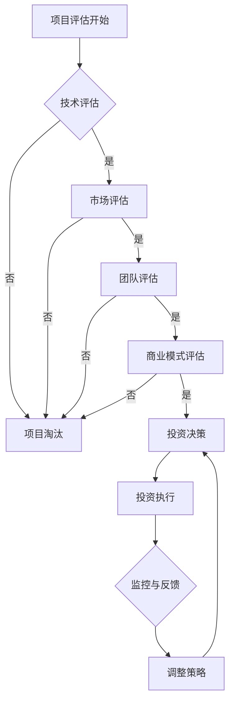

                 

关键词：程序员，天使投资人，技能转变，创业投资，技术洞察，投资策略，项目评估。

> 摘要：本文将探讨程序员如何成功转型为天使投资人，探讨这一过程中所需的技术知识和技能转变，以及如何利用技术背景进行有效的创业投资和项目评估。

## 1. 背景介绍

在当今技术驱动的时代，程序员作为信息时代的先锋，扮演着至关重要的角色。然而，随着经验的积累和视野的开阔，许多程序员开始寻求新的职业发展路径，其中之一便是转型成为天使投资人。这一转变不仅能够帮助程序员实现个人职业价值最大化，还能够充分利用他们的技术专长，为初创企业的发展提供支持。

本文将围绕以下几个核心问题展开讨论：

- 程序员转型为天使投资人需要具备哪些核心技能和知识？
- 技术背景如何影响投资决策和项目评估？
- 天使投资人如何利用技术洞察力发掘和培育有潜力的创业项目？
- 程序员在创业投资过程中可能面临哪些挑战，以及如何应对？

通过深入探讨这些问题，本文旨在为有志于转型成为天使投资人的程序员提供实用的指导和策略。

## 2. 核心概念与联系

### 2.1 技术背景的重要性

作为一名程序员，技术背景是转型为天使投资人的重要资产。技术背景不仅帮助投资人理解创业项目的核心技术，还能使他们更好地评估项目的技术风险和潜在的市场机会。以下是技术背景在投资决策中发挥的关键作用：

- **理解技术实现**：技术背景使得投资者能够深入了解创业项目的具体实现方式，识别其中的创新点和局限性。
- **评估技术风险**：技术风险是影响创业项目成功的关键因素。拥有技术背景的投资者能够更准确地评估项目的可行性，预测技术问题可能带来的风险。
- **洞察市场趋势**：技术背景帮助投资者洞察行业趋势，识别潜在的市场机会，从而做出更有前瞻性的投资决策。

### 2.2 投资策略与创业投资

天使投资作为一种风险投资，其核心在于为初创企业提供资金支持和专业指导。投资策略的制定对于成功投资至关重要。以下是程序员转型为天使投资人时需要考虑的核心策略：

- **目标市场**：明确投资目标，选择具有潜力的细分市场，以便更好地聚焦资源。
- **评估标准**：建立一套明确的评估标准，包括技术可行性、市场潜力、团队背景等。
- **投资额度**：根据自身的财务状况和风险承受能力，合理确定每笔投资的额度，避免过度集中风险。
- **投资周期**：考虑投资周期和回报期望，确保资金能够有效地支持创业项目的成长。

### 2.3 项目评估与风险控制

项目评估是天使投资过程中的关键环节。投资者需要通过多维度的分析，全面评估创业项目的潜在价值。以下是项目评估过程中需要考虑的关键要素：

- **团队背景**：评估创业团队的背景和经验，判断其是否具备成功实施项目的潜力。
- **市场研究**：进行市场调研，分析目标市场的现状和未来趋势，预测项目的市场前景。
- **产品原型**：评估产品的原型和功能，了解项目的核心竞争力。
- **商业模式**：分析项目的商业模式，判断其是否可持续并具备盈利能力。

### 2.4 Mermaid 流程图

以下是项目评估的 Mermaid 流程图，展示了从初始评估到最终决策的各个步骤。



## 3. 核心算法原理 & 具体操作步骤

### 3.1 算法原理概述

作为天使投资人，程序员需要掌握一系列核心算法原理，以帮助他们在投资决策过程中进行更精准的评估。以下是几个关键算法原理：

- **风险评估算法**：用于评估项目的潜在风险，包括技术风险、市场风险和财务风险。
- **盈利能力评估算法**：用于预测项目的盈利能力，包括收入预测和成本分析。
- **市场趋势预测算法**：用于分析市场趋势，预测未来市场机会。
- **团队评估算法**：用于评估创业团队的背景和经验，判断其是否具备成功实施项目的潜力。

### 3.2 算法步骤详解

以下是风险评估算法的具体步骤：

1. **收集数据**：收集与项目相关的数据，包括技术实现、市场状况、团队背景等。
2. **预处理数据**：对收集到的数据进行清洗和预处理，使其适合进行算法分析。
3. **建立模型**：根据收集到的数据，建立风险评估模型。
4. **模型训练**：使用历史数据对模型进行训练，使其能够准确预测项目的潜在风险。
5. **风险评估**：使用训练好的模型对当前项目进行风险评估，预测其潜在风险。

### 3.3 算法优缺点

风险评估算法的优点在于能够提供定量化的风险预测，帮助投资者更准确地评估项目。然而，其缺点在于对历史数据的依赖较大，且模型可能无法完全捕捉到所有潜在的风险。

### 3.4 算法应用领域

风险评估算法主要应用于天使投资过程中的项目评估阶段，帮助投资者识别和评估项目的潜在风险，从而做出更明智的投资决策。

## 4. 数学模型和公式 & 详细讲解 & 举例说明

### 4.1 数学模型构建

在天使投资中，数学模型被广泛用于评估项目的盈利能力和市场潜力。以下是一个简化的盈利能力评估模型：

\[ \text{盈利能力} = \text{收入} - \text{成本} \]

其中，收入和成本分别由以下公式表示：

\[ \text{收入} = \text{单价} \times \text{销量} \]
\[ \text{成本} = \text{固定成本} + (\text{单位变动成本} \times \text{销量}) \]

### 4.2 公式推导过程

盈利能力的公式推导过程如下：

1. **收入**：收入由单价和销量决定，即收入等于单价乘以销量。
2. **成本**：成本包括固定成本和变动成本。固定成本是不随销量变化的成本，如租金和员工工资。变动成本是随销量变化的成本，如原材料和物流费用。因此，总成本等于固定成本加上单位变动成本乘以销量。

### 4.3 案例分析与讲解

假设一个初创企业的单价为100美元，销量为1000件；固定成本为5000美元，单位变动成本为20美元。我们可以使用上述公式计算其盈利能力：

\[ \text{收入} = 100 \times 1000 = 100000 \text{美元} \]
\[ \text{成本} = 5000 + (20 \times 1000) = 5000 + 20000 = 25000 \text{美元} \]
\[ \text{盈利能力} = 100000 - 25000 = 75000 \text{美元} \]

通过这个简单的案例，我们可以看到如何使用数学模型计算一个企业的盈利能力。在实际投资中，投资者需要考虑更多的变量和复杂因素，但基本的原理是类似的。

## 5. 项目实践：代码实例和详细解释说明

### 5.1 开发环境搭建

在进行项目实践之前，我们需要搭建一个合适的开发环境。以下是搭建开发环境的基本步骤：

1. **安装编程语言**：选择一种适合的编程语言，如Python或Java，并安装到本地机器。
2. **安装依赖库**：根据项目需求，安装必要的依赖库，如NumPy和Pandas用于数据处理。
3. **配置IDE**：配置集成开发环境（IDE），如PyCharm或Eclipse，以便进行代码编写和调试。

### 5.2 源代码详细实现

以下是一个使用Python编写的简单盈利能力评估程序的示例代码：

```python
import numpy as np

def calculate_profitability(price, quantity, fixed_cost, variable_cost):
    revenue = price * quantity
    total_cost = fixed_cost + (variable_cost * quantity)
    profitability = revenue - total_cost
    return profitability

# 输入参数
price = 100
quantity = 1000
fixed_cost = 5000
variable_cost = 20

# 计算盈利能力
profit = calculate_profitability(price, quantity, fixed_cost, variable_cost)
print(f"盈利能力：{profit}美元")
```

### 5.3 代码解读与分析

上述代码实现了一个简单的盈利能力评估函数 `calculate_profitability`，该函数接受四个输入参数：单价（`price`）、销量（`quantity`）、固定成本（`fixed_cost`）和单位变动成本（`variable_cost`）。函数通过计算收入和成本，返回项目的盈利能力。

在代码中，我们首先导入了NumPy库，用于数据处理。然后定义了 `calculate_profitability` 函数，该函数根据输入参数计算收入和成本，并返回盈利能力。最后，我们使用示例输入参数调用了该函数，并打印了计算结果。

### 5.4 运行结果展示

假设我们使用上述代码计算盈利能力，输入参数为单价100美元，销量1000件；固定成本5000美元，单位变动成本20美元。运行结果将显示项目的盈利能力为75000美元。

```shell
盈利能力：75000.0美元
```

这个简单的例子展示了如何使用Python进行盈利能力评估，并为实际投资决策提供数据支持。

## 6. 实际应用场景

天使投资在创业生态系统中的实际应用场景非常广泛。以下是一些典型的应用场景：

- **技术创新项目**：技术驱动的初创企业往往需要大量的资金投入进行研发，天使投资可以提供初期资金支持，帮助企业实现技术突破。
- **市场探索项目**：初创企业在市场探索阶段通常需要试错，天使投资可以帮助企业快速验证市场假设，降低市场风险。
- **团队组建**：初创企业成立初期，团队建设是关键。天使投资可以吸引优秀人才加入，提升团队整体实力。
- **品牌建设**：天使投资不仅提供资金，还可以利用投资者的人脉和资源，帮助初创企业建立品牌知名度。

### 6.1 投资策略

天使投资需要灵活的策略，以应对初创企业的不确定性和复杂性。以下是几种常见的投资策略：

- **阶段投资**：根据创业企业的不同发展阶段进行分阶段投资，例如种子轮、天使轮和A轮等。
- **风险分散**：避免将全部资金投资在一个项目上，通过投资多个项目分散风险。
- **持续关注**：天使投资人需要持续关注被投资企业的进展，提供必要的资源和支持，帮助其克服发展中的困难。
- **退出策略**：设定明确的退出策略，确保投资能够获得合理的回报。

### 6.2 成功案例

许多著名的科技公司最初都是通过天使投资获得启动资金的。以下是一些成功的天使投资案例：

- **Facebook**：马克·扎克伯格在2004年创立Facebook时，最初得到了天使投资人唐·霍洛维茨的资金支持。
- **LinkedIn**：里德·霍夫曼是LinkedIn的创始人和天使投资人之一，他的投资帮助LinkedIn成长为全球最大的职业社交网络。
- **Zappos**：尼拉·奥哈根是Zappos的创始人，他在创业初期得到了天使投资的支持，最终将Zappos发展成为领先的在线鞋类零售商。

### 6.3 未来应用展望

随着技术的不断进步和市场环境的变迁，天使投资的应用前景也越来越广阔。以下是未来天使投资可能面临的一些趋势：

- **人工智能与机器学习**：人工智能和机器学习技术的应用将使天使投资更加精准，帮助投资者更好地评估项目前景。
- **区块链技术**：区块链技术的普及将带来新的投资机会，例如加密货币项目和去中心化金融（DeFi）项目。
- **可持续发展**：随着社会对可持续发展的关注日益增加，天使投资将更多关注环保技术和可再生能源项目。

## 7. 工具和资源推荐

### 7.1 学习资源推荐

- **书籍**：
  - 《创业投资入门指南》
  - 《天使投资实战手册》
  - 《风险投资与创业》
- **在线课程**：
  - Coursera上的“创业管理”
  - Udemy上的“天使投资与创业融资”
  - edX上的“商业分析”

### 7.2 开发工具推荐

- **编程语言**：
  - Python：适用于数据分析、机器学习等。
  - Java：适用于企业级应用和Android开发。
- **开发环境**：
  - PyCharm：Python开发环境。
  - Eclipse：Java开发环境。
- **数据处理库**：
  - NumPy：Python的科学计算库。
  - Pandas：Python的数据分析库。

### 7.3 相关论文推荐

- **风险投资与创业**：探讨风险投资在初创企业中的作用。
- **人工智能在天使投资中的应用**：分析人工智能技术如何提高天使投资决策的准确性。
- **区块链技术在创业投资中的应用**：探讨区块链技术在创业投资领域的潜在应用。

## 8. 总结：未来发展趋势与挑战

### 8.1 研究成果总结

本文从程序员到天使投资人的转型角度，探讨了技术背景在投资决策和项目评估中的重要性，提出了核心技能和知识体系，并详细介绍了风险评估算法和盈利能力评估模型的构建与应用。同时，通过实际案例和数学模型的推导，展示了天使投资在实际操作中的具体应用。

### 8.2 未来发展趋势

随着技术的不断进步，天使投资将变得更加智能化和专业化。人工智能、大数据分析和区块链等新兴技术的应用，将提升投资决策的精准度和效率。此外，可持续发展将成为未来投资的重要方向，为社会和环境带来积极影响。

### 8.3 面临的挑战

尽管天使投资前景广阔，但投资者仍然面临诸多挑战。技术风险和市场不确定性是主要障碍。此外，天使投资需要投入大量时间和精力，投资者需要平衡好投资与个人职业发展。

### 8.4 研究展望

未来研究应重点关注如何利用技术手段提升天使投资决策的效率和准确性，以及如何更好地应对技术风险和市场变化。同时，探索天使投资在社会创新和可持续发展中的角色，为初创企业和投资者提供更广阔的发展空间。

## 9. 附录：常见问题与解答

### 问题1：程序员转型为天使投资人需要具备哪些技能？

**回答**：程序员转型为天使投资人需要具备以下技能：

- **技术知识**：深入了解计算机科学和技术，能够评估创业项目的技术实现。
- **投资知识**：掌握基本的财务知识，了解投资策略和风险评估方法。
- **市场洞察**：具备市场分析能力，能够识别潜在的市场机会。
- **人际交往**：良好的沟通和人际交往能力，能够与创业者和其他投资者建立合作关系。

### 问题2：如何评估创业项目的潜在风险？

**回答**：评估创业项目的潜在风险可以从以下几个方面入手：

- **技术风险**：评估项目的技术实现是否成熟，是否有技术难题需要克服。
- **市场风险**：分析市场趋势，预测项目的市场前景，评估市场竞争状况。
- **财务风险**：分析项目的盈利能力，评估项目的资金需求和资金链稳定性。
- **团队风险**：评估创业团队的背景和经验，判断其是否具备成功实施项目的潜力。

### 问题3：如何利用技术洞察力发掘有潜力的创业项目？

**回答**：利用技术洞察力发掘有潜力的创业项目可以通过以下几种方式：

- **关注技术创新**：关注最新的技术趋势，识别那些能够引领行业变革的创新项目。
- **参与技术社区**：积极参与技术社区，了解行业动态和前沿技术，发掘潜在的投资机会。
- **与创业者交流**：与创业者交流，了解他们的技术背景和项目详情，评估项目的可行性。

### 问题4：如何平衡天使投资与个人职业发展？

**回答**：平衡天使投资与个人职业发展可以通过以下几种方法：

- **合理规划时间**：合理安排时间和精力，确保投资活动不会影响到个人职业发展。
- **分散投资**：避免将全部资金投资在一个项目上，通过分散投资降低风险。
- **专业团队**：组建专业的投资团队，分担投资工作，提高投资效率。

### 问题5：天使投资需要哪些法律知识？

**回答**：天使投资需要掌握以下法律知识：

- **公司法**：了解公司设立、运营和治理的基本法律规定。
- **合同法**：熟悉合同签订、履行和违约的处理。
- **知识产权法**：了解知识产权的获取和保护方法。
- **证券法**：掌握证券发行、交易和监管的基本规定。

## 作者署名

> 作者：禅与计算机程序设计艺术 / Zen and the Art of Computer Programming

