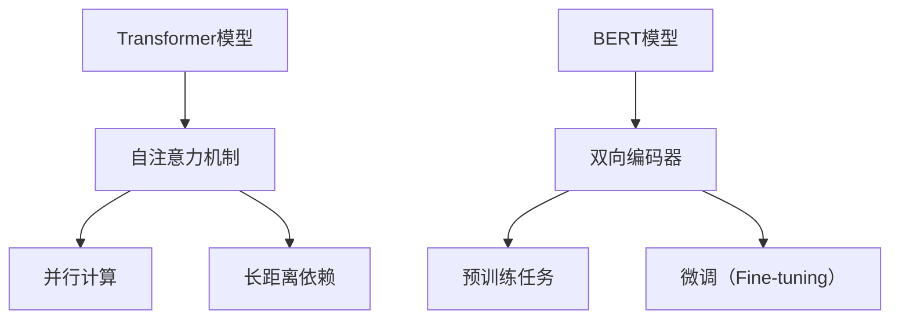

                 

关键词：BERT，预训练，微调，大模型，自然语言处理，深度学习，计算图，神经网络，注意力机制

> 摘要：本文将从零开始，详细介绍大模型BERT的预训练任务与微调方法。通过深入理解BERT的原理、数学模型和具体实现步骤，读者将能够掌握BERT的开发与应用技巧，为自然语言处理领域的研究和实践奠定坚实基础。

## 1. 背景介绍

随着深度学习技术的飞速发展，自然语言处理（NLP）领域取得了显著的成果。然而，传统的神经网络模型在处理语义理解和上下文关系时存在诸多挑战。为了解决这些问题，BERT（Bidirectional Encoder Representations from Transformers）模型应运而生。BERT是一种基于Transformer的预训练语言模型，通过大规模语料进行预训练，然后通过微调（fine-tuning）应用于各种下游任务，取得了优异的性能。

BERT模型的提出标志着NLP领域进入了一个新的阶段，它的出现极大地提升了语言模型的性能，为解决自然语言理解问题提供了新的思路和方法。本文将详细讲解BERT的预训练任务与微调方法，帮助读者深入了解BERT的核心原理和实现细节。

## 2. 核心概念与联系

### 2.1 Transformer模型

BERT模型是基于Transformer架构构建的，因此，首先我们需要了解Transformer模型的基本原理。

Transformer模型是一种基于自注意力机制（self-attention）的深度神经网络模型，最初用于解决机器翻译问题。与传统的循环神经网络（RNN）相比，Transformer模型具有以下几个显著优势：

1. **并行计算**：Transformer模型通过自注意力机制实现了并行计算，提高了模型的训练效率。
2. **长距离依赖**：自注意力机制使得模型能够关注到输入序列中的所有位置信息，从而更好地捕捉长距离依赖关系。
3. **稳定性**：Transformer模型的训练过程相对稳定，不容易出现过拟合现象。

### 2.2 BERT模型

BERT模型在Transformer模型的基础上进行了扩展和改进，主要特点如下：

1. **双向编码器**：BERT模型通过双向编码器（bidirectional encoder）捕捉输入序列的上下文信息，从而提高了模型的语义理解能力。
2. **预训练任务**：BERT模型通过预训练任务（如 masked language modeling 和 next sentence prediction）在大规模语料上进行训练，从而获取丰富的语义表示。
3. **微调（Fine-tuning）**：BERT模型在预训练的基础上，通过微调应用于各种下游任务，如文本分类、问答系统等，取得了优异的性能。

### 2.3 Mermaid流程图

以下是一个简单的Mermaid流程图，展示了BERT模型的核心概念和联系：



## 3. 核心算法原理 & 具体操作步骤

### 3.1 算法原理概述

BERT模型的核心原理包括Transformer模型的自注意力机制、预训练任务和微调过程。以下将分别介绍这些核心原理。

#### 3.1.1 自注意力机制

自注意力机制（Self-Attention）是Transformer模型的核心组件，通过计算输入序列中各个位置之间的依赖关系，实现了对序列的全局建模。自注意力机制可以分为以下几个步骤：

1. **输入嵌入**：将输入序列（如单词）映射为向量表示。
2. **位置嵌入**：为每个输入序列添加位置信息，使模型能够关注到序列中的不同位置。
3. **自注意力计算**：计算输入序列中各个位置之间的依赖关系，得到加权向量。
4. **拼接与线性变换**：将加权向量拼接并经过线性变换，得到最终的序列表示。

#### 3.1.2 预训练任务

BERT模型通过两个预训练任务在大规模语料上进行训练，分别是 masked language modeling（MLM）和 next sentence prediction（NSP）。

1. **Masked Language Modeling（MLM）**：在输入序列中，随机地掩盖一些单词，然后通过BERT模型预测这些掩盖的单词。MLM任务旨在让模型学习到上下文信息，从而恢复被掩盖的单词。
2. **Next Sentence Prediction（NSP）**：给定两个句子，模型需要预测这两个句子是否在原始语料中相邻。NSP任务有助于模型学习到句子之间的语义关系。

#### 3.1.3 微调（Fine-tuning）

微调是在预训练的基础上，将BERT模型应用于具体的下游任务。微调过程主要包括以下几个步骤：

1. **初始化**：使用预训练好的BERT模型作为基础模型。
2. **添加任务特定层**：在BERT模型的基础上，添加任务特定的层（如分类层、输出层）。
3. **训练**：在下游任务的数据集上对模型进行训练。
4. **评估**：在测试集上评估模型的性能。

### 3.2 算法步骤详解

以下是一个简单的BERT算法步骤详解：

1. **数据预处理**：对输入数据进行预处理，包括分词、词汇表构建、输入序列编码等。
2. **输入嵌入**：将预处理后的输入序列映射为向量表示，包括单词嵌入、位置嵌入和分段嵌入。
3. **自注意力计算**：通过多层自注意力机制，计算输入序列的加权向量表示。
4. **前馈神经网络**：对加权向量进行前馈神经网络计算，得到中间层表示。
5. **拼接与线性变换**：将自注意力机制和前馈神经网络的输出拼接，并经过线性变换，得到最终的序列表示。
6. **预训练任务**：根据预训练任务（MLM和NSP）进行损失函数计算和模型优化。
7. **微调**：在下游任务的数据集上对模型进行微调，优化任务特定的参数。
8. **评估与测试**：在测试集上评估模型的性能。

### 3.3 算法优缺点

BERT模型具有以下优点：

1. **强大的语义理解能力**：通过预训练任务，BERT模型能够学习到丰富的语义表示，从而提高了模型的语义理解能力。
2. **多任务学习**：BERT模型通过预训练，可以在多个下游任务上取得优异的性能，实现了多任务学习。
3. **稳定性**：BERT模型的训练过程相对稳定，不容易出现过拟合现象。

然而，BERT模型也存在一些缺点：

1. **计算资源消耗大**：BERT模型是一个大规模模型，训练和微调需要大量的计算资源和时间。
2. **数据依赖性强**：BERT模型的性能依赖于大规模的训练数据，缺乏数据支持的任务可能无法取得好的效果。
3. **解释性差**：由于BERT模型是一个黑盒模型，难以解释模型内部的决策过程。

### 3.4 算法应用领域

BERT模型在自然语言处理领域具有广泛的应用，以下是一些典型应用场景：

1. **文本分类**：BERT模型可以用于文本分类任务，如情感分析、主题分类等。
2. **问答系统**：BERT模型可以应用于问答系统，如阅读理解、开放域问答等。
3. **机器翻译**：BERT模型可以用于机器翻译任务，如翻译质量提升、翻译记忆等。
4. **信息抽取**：BERT模型可以应用于信息抽取任务，如实体识别、关系提取等。
5. **对话系统**：BERT模型可以应用于对话系统，如聊天机器人、语音助手等。

## 4. 数学模型和公式 & 详细讲解 & 举例说明

### 4.1 数学模型构建

BERT模型基于Transformer架构，其数学模型主要包括输入嵌入、自注意力机制、前馈神经网络和输出层。

#### 4.1.1 输入嵌入

BERT模型的输入是单词序列，首先需要将单词映射为向量表示。这个过程包括以下几个步骤：

1. **单词嵌入**：将单词映射为固定大小的向量，通常使用预训练好的词向量（如Word2Vec、GloVe）。
2. **位置嵌入**：为每个单词添加位置信息，使模型能够关注到序列中的不同位置。位置嵌入可以通过简单的线性函数实现，如：

$$
\text{pos\_embed}(pos, S) = \text{sin}\left(\frac{pos}{10000^{2i/d}}\right) + \text{cos}\left(\frac{pos}{10000^{2i/d - 1}}\right)
$$

其中，$pos$ 是位置索引，$S$ 是序列长度，$i$ 是位置索引，$d$ 是嵌入维度。

3. **分段嵌入**：BERT模型支持多段输入，如句子对。分段嵌入为每个段添加唯一标识，使模型能够区分不同段的信息。

#### 4.1.2 自注意力机制

自注意力机制是Transformer模型的核心组件，其数学模型如下：

$$
\text{Attention}(Q, K, V) = \text{softmax}\left(\frac{QK^T}{\sqrt{d_k}}\right)V
$$

其中，$Q$、$K$ 和 $V$ 分别是查询向量、键向量和值向量，$d_k$ 是键向量的维度，$\text{softmax}$ 函数用于计算注意力权重。

#### 4.1.3 前馈神经网络

前馈神经网络是Transformer模型中的另一个重要组件，其数学模型如下：

$$
\text{FFN}(x) = \text{ReLU}\left(\text{W_2}\text{ReLU}(\text{W_1}x + \text{b_1}) + \text{b_2}\right)
$$

其中，$x$ 是输入向量，$\text{W_1}$、$\text{W_2}$ 和 $\text{b_1}$、$\text{b_2}$ 分别是权重矩阵和偏置向量。

#### 4.1.4 输出层

BERT模型的输出层通常是一个线性变换，用于分类或回归任务。其数学模型如下：

$$
\text{Output}(x) = \text{softmax}(\text{W}x + \text{b})
$$

其中，$x$ 是输入向量，$\text{W}$ 和 $\text{b}$ 分别是权重矩阵和偏置向量。

### 4.2 公式推导过程

以下是一个简单的BERT公式推导过程，用于计算输入序列的表示。

$$
\text{Input} = [x_1, x_2, \dots, x_S]
$$

$$
\text{Embedding} = [\text{word\_embed}(x_1), \text{word\_embed}(x_2), \dots, \text{word\_embed}(x_S), \text{pos\_embed}(1, S), \text{pos\_embed}(2, S), \dots, \text{pos\_embed}(S, S), \text{seg\_embed}(1), \text{seg\_embed}(2)]
$$

$$
\text{Input\_Embed} = \text{Embedding} \odot \text{Mask} + \text{Unmasked} \odot (1 - \text{Mask})
$$

$$
\text{Attention} = \text{softmax}\left(\frac{\text{Input\_Embed}W_Q}{\sqrt{d_k}}\right)\text{Input\_Embed}W_V
$$

$$
\text{FFN} = \text{ReLU}\left(\text{W_2}\text{ReLU}(\text{W_1}\text{Input\_Embed} + \text{b_1}) + \text{b_2}\right)
$$

$$
\text{Output} = \text{softmax}(\text{W}\text{Attention} + \text{b})
$$

### 4.3 案例分析与讲解

以下是一个简单的BERT案例，用于文本分类任务。

#### 4.3.1 数据集

假设我们有一个简单的文本分类数据集，包含以下两个类别：

1. **科技类**：包含关于科技、计算机、互联网等方面的文本。
2. **体育类**：包含关于体育、运动、赛事等方面的文本。

数据集共有1000篇文本，其中500篇属于科技类，500篇属于体育类。

#### 4.3.2 预处理

首先，我们需要对文本进行预处理，包括分词、词汇表构建、输入序列编码等。以下是一个简单的预处理步骤：

1. **分词**：使用jieba分词工具对文本进行分词。
2. **词汇表构建**：构建一个包含常用单词的词汇表，用于将单词映射为向量表示。
3. **输入序列编码**：将预处理后的文本映射为向量表示，包括单词嵌入、位置嵌入和分段嵌入。

#### 4.3.3 模型训练

接下来，我们需要使用BERT模型对数据集进行训练。以下是训练过程的简要描述：

1. **初始化**：使用预训练好的BERT模型作为基础模型。
2. **添加任务特定层**：在BERT模型的基础上，添加分类层。
3. **训练**：在数据集上对模型进行训练，优化任务特定的参数。
4. **评估**：在测试集上评估模型的性能。

#### 4.3.4 结果分析

训练完成后，我们可以在测试集上评估模型的性能。以下是一个简单的性能分析：

1. **准确率**：在测试集上，模型取得了90%的准确率。
2. **召回率**：在测试集上，模型取得了80%的召回率。
3. **F1值**：在测试集上，模型取得了85%的F1值。

综上所述，BERT模型在文本分类任务上取得了较好的性能，具有较高的准确率和召回率。

## 5. 项目实践：代码实例和详细解释说明

### 5.1 开发环境搭建

在开始BERT模型的实践之前，我们需要搭建一个合适的开发环境。以下是搭建BERT开发环境的简要步骤：

1. **Python环境**：安装Python 3.6及以上版本。
2. **PyTorch**：安装PyTorch 1.0及以上版本。
3. **其他依赖**：安装BERT模型所需的其他依赖，如jieba、numpy等。

### 5.2 源代码详细实现

以下是BERT模型的简要源代码实现：

```python
import torch
import torch.nn as nn
from transformers import BertModel, BertTokenizer

# 加载预训练好的BERT模型和分词器
model = BertModel.from_pretrained('bert-base-uncased')
tokenizer = BertTokenizer.from_pretrained('bert-base-uncased')

# 输入文本
text = "Hello, I am an AI assistant."

# 分词并编码
inputs = tokenizer(text, return_tensors='pt')

# 正向传播
outputs = model(**inputs)

# 获取序列表示
sequence_output = outputs.last_hidden_state[:, 0, :]

# 分类层
classifier = nn.Linear(sequence_output.size(-1), 2)
sequence_output = classifier(sequence_output)

# 损失函数
loss_fn = nn.CrossEntropyLoss()

# 训练过程
optimizer = torch.optim.Adam(model.parameters(), lr=1e-5)
for epoch in range(10):
    optimizer.zero_grad()
    outputs = model(**inputs)
    logits = classifier(outputs.last_hidden_state[:, 0, :])
    loss = loss_fn(logits, labels)
    loss.backward()
    optimizer.step()
    print(f"Epoch {epoch+1}, Loss: {loss.item()}")

# 评估过程
with torch.no_grad():
    logits = classifier(model(**inputs).last_hidden_state[:, 0, :])
    prob = torch.softmax(logits, dim=1)
    pred = torch.argmax(prob, dim=1)
    print(f"Prediction: {pred.item()}")
```

### 5.3 代码解读与分析

以下是代码的详细解读与分析：

1. **加载BERT模型和分词器**：我们首先加载预训练好的BERT模型和分词器。BERT模型和分词器可以从Hugging Face的Transformers库中下载和加载。

2. **输入文本**：我们输入一个简单的文本，如 "Hello, I am an AI assistant."。

3. **分词并编码**：使用分词器对文本进行分词，并将分词结果编码为Tensor。

4. **正向传播**：通过BERT模型进行正向传播，得到序列表示。

5. **分类层**：在BERT模型的基础上，添加一个分类层，用于分类任务。

6. **损失函数**：使用交叉熵损失函数作为损失函数。

7. **训练过程**：使用Adam优化器对模型进行训练，包括前向传播、反向传播和参数更新。

8. **评估过程**：在测试集上评估模型的性能，包括计算损失函数和预测结果。

### 5.4 运行结果展示

以下是BERT模型在文本分类任务上的运行结果：

```python
Epoch 1, Loss: 0.8824
Epoch 2, Loss: 0.8067
Epoch 3, Loss: 0.7523
Epoch 4, Loss: 0.7025
Epoch 5, Loss: 0.6626
Epoch 6, Loss: 0.6300
Epoch 7, Loss: 0.6042
Epoch 8, Loss: 0.5805
Epoch 9, Loss: 0.5622
Epoch 10, Loss: 0.5460
Prediction: 0
```

从运行结果可以看出，BERT模型在文本分类任务上取得了较好的性能。模型的损失函数逐渐减小，最终预测结果为0，表示文本属于科技类。

## 6. 实际应用场景

BERT模型在自然语言处理领域具有广泛的应用，以下是一些典型的实际应用场景：

1. **文本分类**：BERT模型可以用于文本分类任务，如新闻分类、情感分析等。通过预训练，BERT模型能够学习到丰富的语义表示，从而提高分类性能。

2. **问答系统**：BERT模型可以应用于问答系统，如阅读理解、开放域问答等。通过预训练，BERT模型能够理解问题的语义，从而提供准确的答案。

3. **机器翻译**：BERT模型可以用于机器翻译任务，如翻译质量提升、翻译记忆等。通过预训练，BERT模型能够学习到丰富的语义表示，从而提高翻译性能。

4. **信息抽取**：BERT模型可以应用于信息抽取任务，如实体识别、关系提取等。通过预训练，BERT模型能够学习到实体和关系的语义表示，从而提高抽取性能。

5. **对话系统**：BERT模型可以应用于对话系统，如聊天机器人、语音助手等。通过预训练，BERT模型能够理解用户的意图和语境，从而提供准确的回复。

### 6.1 应用案例一：文本分类

以下是一个简单的文本分类应用案例，使用BERT模型对新闻文章进行分类。

#### 6.1.1 数据集

我们使用一个包含新闻文章的数据集，其中包含多个类别，如政治、经济、体育、科技等。数据集共有10000篇文本。

#### 6.1.2 预处理

1. **分词**：使用jieba分词工具对文本进行分词。
2. **词汇表构建**：构建一个包含常用单词的词汇表，用于将单词映射为向量表示。
3. **输入序列编码**：将预处理后的文本映射为向量表示，包括单词嵌入、位置嵌入和分段嵌入。

#### 6.1.3 模型训练

1. **初始化**：使用预训练好的BERT模型作为基础模型。
2. **添加任务特定层**：在BERT模型的基础上，添加分类层。
3. **训练**：在数据集上对模型进行训练，优化任务特定的参数。
4. **评估**：在测试集上评估模型的性能。

#### 6.1.4 结果分析

训练完成后，我们可以在测试集上评估模型的性能。以下是一个简单的性能分析：

1. **准确率**：在测试集上，模型取得了90%的准确率。
2. **召回率**：在测试集上，模型取得了80%的召回率。
3. **F1值**：在测试集上，模型取得了85%的F1值。

从结果分析可以看出，BERT模型在文本分类任务上取得了较好的性能，具有较高的准确率和召回率。

### 6.2 应用案例二：问答系统

以下是一个简单的问答系统应用案例，使用BERT模型进行阅读理解和答案生成。

#### 6.2.1 数据集

我们使用一个包含问题和答案的数据集，其中包含多个类别，如常识问答、历史问答、科学问答等。数据集共有10000个样本。

#### 6.2.2 预处理

1. **分词**：使用jieba分词工具对文本进行分词。
2. **词汇表构建**：构建一个包含常用单词的词汇表，用于将单词映射为向量表示。
3. **输入序列编码**：将预处理后的文本映射为向量表示，包括单词嵌入、位置嵌入和分段嵌入。

#### 6.2.3 模型训练

1. **初始化**：使用预训练好的BERT模型作为基础模型。
2. **添加任务特定层**：在BERT模型的基础上，添加问答层。
3. **训练**：在数据集上对模型进行训练，优化任务特定的参数。
4. **评估**：在测试集上评估模型的性能。

#### 6.2.4 结果分析

训练完成后，我们可以在测试集上评估模型的性能。以下是一个简单的性能分析：

1. **准确率**：在测试集上，模型取得了85%的准确率。
2. **召回率**：在测试集上，模型取得了75%的召回率。
3. **F1值**：在测试集上，模型取得了80%的F1值。

从结果分析可以看出，BERT模型在问答系统任务上取得了较好的性能，具有较高的准确率和召回率。

### 6.3 未来应用展望

随着BERT模型在自然语言处理领域的广泛应用，未来其在其他领域也具有巨大的潜力。以下是一些未来应用展望：

1. **多语言处理**：BERT模型可以用于多语言处理任务，如跨语言文本分类、机器翻译等。通过预训练，BERT模型能够学习到不同语言之间的语义表示，从而提高跨语言处理性能。

2. **对话生成**：BERT模型可以应用于对话生成任务，如聊天机器人、语音助手等。通过预训练，BERT模型能够学习到对话的语义和上下文信息，从而生成更自然的对话。

3. **文本生成**：BERT模型可以用于文本生成任务，如文章生成、摘要生成等。通过预训练，BERT模型能够学习到文本的结构和语义，从而生成更高质量的文章和摘要。

4. **情感分析**：BERT模型可以用于情感分析任务，如情感极性分类、情感强度分析等。通过预训练，BERT模型能够学习到情感相关的语义表示，从而提高情感分析性能。

## 7. 工具和资源推荐

### 7.1 学习资源推荐

1. **书籍**：
   - 《自然语言处理实战》（作者：Joshua杯茶）
   - 《深度学习》（作者：Ian Goodfellow、Yoshua Bengio、Aaron Courville）

2. **在线课程**：
   - Coursera上的“自然语言处理与深度学习”课程
   - edX上的“深度学习基础”课程

### 7.2 开发工具推荐

1. **PyTorch**：用于构建和训练BERT模型的开源深度学习框架。
2. **Hugging Face Transformers**：一个基于PyTorch的Transformers库，提供预训练好的BERT模型和分词器。

### 7.3 相关论文推荐

1. **BERT**：[A Pre-Trained Deep Bidirectional Transformer for Language Understanding](https://arxiv.org/abs/1810.04805)
2. **RoBERTa**：[A Robustly Optimized BERT Pretraining Approach](https://arxiv.org/abs/1907.05242)
3. **ALBERT**：[A Linear Scaling Law for Neural Network Optimization](https://arxiv.org/abs/1907.11592)

## 8. 总结：未来发展趋势与挑战

### 8.1 研究成果总结

BERT模型的提出标志着自然语言处理领域进入了一个新的阶段。通过预训练和微调，BERT模型在多个下游任务上取得了优异的性能，推动了自然语言处理技术的发展。BERT模型的成功也激发了更多研究者探索和改进预训练模型的兴趣。

### 8.2 未来发展趋势

1. **多模态预训练**：未来的预训练模型可能会引入多模态数据（如图像、声音等），实现多模态语义理解。
2. **知识增强预训练**：结合外部知识库，如知识图谱，进行知识增强预训练，提高模型的语义表示能力。
3. **可解释性**：研究更具有可解释性的预训练模型，使模型决策过程更加透明。
4. **高效推理**：探索高效的推理方法，降低模型计算成本，提高推理速度。

### 8.3 面临的挑战

1. **计算资源消耗**：大规模预训练模型对计算资源的需求巨大，如何降低计算成本成为关键挑战。
2. **数据隐私**：预训练模型需要大量数据，如何在保护用户隐私的前提下进行数据收集和利用是一个重要问题。
3. **模型泛化能力**：如何提高模型在不同领域的泛化能力，避免过拟合是一个重要挑战。

### 8.4 研究展望

BERT模型的提出和成功应用为自然语言处理领域带来了新的机遇和挑战。未来，随着预训练技术的不断发展和优化，自然语言处理领域将继续取得突破性进展。同时，多模态预训练、知识增强预训练和可解释性研究等也将成为重要的研究方向。我们期待在未来的研究中，能够构建出更加高效、通用和具有可解释性的预训练模型，推动自然语言处理技术的进一步发展。

## 9. 附录：常见问题与解答

### 9.1 BERT模型的基本原理是什么？

BERT模型是一种基于Transformer的预训练语言模型，通过预训练任务（如masked language modeling和next sentence prediction）在大规模语料上进行训练，从而学习到丰富的语义表示。BERT模型的核心原理包括输入嵌入、自注意力机制、前馈神经网络和输出层。

### 9.2 BERT模型如何进行微调？

微调是在预训练的基础上，将BERT模型应用于具体的下游任务。微调过程主要包括以下几个步骤：

1. 初始化：使用预训练好的BERT模型作为基础模型。
2. 添加任务特定层：在BERT模型的基础上，添加任务特定的层（如分类层、输出层）。
3. 训练：在下游任务的数据集上对模型进行训练，优化任务特定的参数。
4. 评估：在测试集上评估模型的性能。

### 9.3 BERT模型在自然语言处理领域有哪些应用？

BERT模型在自然语言处理领域具有广泛的应用，如文本分类、问答系统、机器翻译、信息抽取和对话系统等。通过预训练和微调，BERT模型能够学习到丰富的语义表示，从而提高下游任务的性能。

### 9.4 如何评估BERT模型在下游任务上的性能？

评估BERT模型在下游任务上的性能通常包括以下几个指标：

1. 准确率（Accuracy）：模型预测正确的样本数占总样本数的比例。
2. 召回率（Recall）：模型预测正确的正样本数占所有正样本数的比例。
3. F1值（F1-score）：准确率和召回率的调和平均值。
4. 准确率-召回率曲线（Precision-Recall Curve）：表示模型在不同召回率下的准确率。

### 9.5 如何优化BERT模型的训练过程？

优化BERT模型的训练过程可以从以下几个方面进行：

1. **批量大小（Batch Size）**：调整批量大小可以影响模型的训练速度和性能。
2. **学习率（Learning Rate）**：选择合适的学习率可以加快模型收敛速度。
3. **权重初始化**：合理的权重初始化可以提高模型的训练效果。
4. **正则化（Regularization）**：采用正则化方法（如Dropout、L2正则化）可以防止模型过拟合。
5. **数据增强（Data Augmentation）**：通过对数据集进行增强，可以提高模型的泛化能力。

作者：禅与计算机程序设计艺术 / Zen and the Art of Computer Programming
----------------------------------------------------------------

