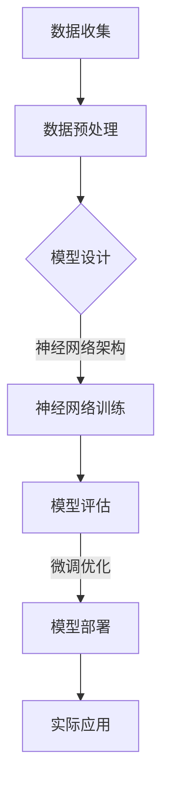

                 

关键词：大模型开发、微调、人工智能、机器学习、深度学习、算法原理、数学模型、项目实践、实际应用、工具资源、未来展望。

> 摘要：本文旨在从零开始，详细探讨大模型开发与微调的全过程，包括其背景、核心概念、算法原理、数学模型、项目实践、实际应用以及未来展望。通过本文，读者将能够全面了解大模型的变革力量，并掌握大模型开发与微调的核心技术和方法。

## 1. 背景介绍

近年来，随着计算能力的大幅提升和海量数据的积累，人工智能领域取得了突破性进展。特别是深度学习技术的崛起，使得机器学习模型的能力得到了显著提升。然而，传统的中小型模型在处理复杂任务时往往表现出力不从心的状态。为了解决这一问题，大模型应运而生。大模型（也称为巨模型或巨型模型）拥有数十亿至数万亿参数，能够捕捉更复杂的特征和规律，从而在诸多领域取得了显著突破。

大模型的开发与微调是当前人工智能研究的热点之一。开发一个高效的大模型需要深入理解其核心概念和算法原理，而微调则涉及到如何根据具体任务需求对模型进行调整和优化。本文将围绕这两个核心问题，详细探讨大模型开发与微调的全过程。

## 2. 核心概念与联系

### 2.1 大模型定义

大模型是指具有数十亿至数万亿参数的深度学习模型，通常采用神经网络架构。它们能够通过学习海量数据，自动提取和表示复杂的数据特征，从而在诸多任务上实现超越传统模型的效果。

### 2.2 大模型架构

大模型的架构通常采用分层结构，包括输入层、中间层和输出层。输入层负责接收原始数据，中间层通过多层神经网络进行特征提取和转换，输出层则根据提取的特征生成预测结果。

### 2.3 大模型与深度学习的关系

大模型是深度学习技术发展的一个重要里程碑。深度学习是一种通过多层神经网络进行特征提取和转换的机器学习方法。而大模型则通过增加模型参数和训练数据量，进一步提升了深度学习的性能和效果。

### 2.4 大模型与机器学习的关系

大模型是机器学习领域的重要分支。机器学习是一种通过训练模型来学习数据特征和规律的方法。大模型通过引入更多的参数和更强的计算能力，使得机器学习模型能够处理更复杂的数据和任务。

## 2.5 大模型与实际应用的关系

大模型在许多实际应用领域取得了显著突破，如自然语言处理、计算机视觉、语音识别等。通过大模型的开发与微调，许多原本难以解决的问题得到了有效解决，从而推动了人工智能技术的快速发展。

### 2.6 Mermaid 流程图

下面是一个描述大模型开发与微调过程的 Mermaid 流程图：



## 3. 核心算法原理 & 具体操作步骤

### 3.1 算法原理概述

大模型的算法原理主要基于深度学习技术。深度学习是一种通过多层神经网络进行特征提取和转换的机器学习方法。大模型通过增加模型参数和训练数据量，进一步提升了深度学习的性能和效果。

### 3.2 算法步骤详解

#### 3.2.1 数据收集

首先，我们需要收集大量的数据，这些数据可以是文本、图像、音频等各种类型。数据收集的质量直接影响模型的效果，因此我们需要确保数据的质量和多样性。

#### 3.2.2 数据预处理

收集到的数据需要进行预处理，包括数据清洗、数据转换和数据增强等。预处理的主要目的是将原始数据转换为适合模型训练的格式，同时提高模型的泛化能力。

#### 3.2.3 模型设计

模型设计是构建大模型的关键步骤。我们需要选择合适的神经网络架构，并确定模型的参数设置，如层数、每层的神经元数量、激活函数等。

#### 3.2.4 神经网络训练

在模型设计完成后，我们需要使用训练数据进行模型训练。训练过程中，模型通过不断调整参数，使得输出结果与真实结果之间的误差最小。训练过程通常采用梯度下降等优化算法。

#### 3.2.5 模型评估

训练完成后，我们需要对模型进行评估，以确定模型的性能和泛化能力。常用的评估指标包括准确率、召回率、F1 分数等。

#### 3.2.6 微调优化

根据评估结果，我们可以对模型进行调整和优化，以提高模型的性能。微调优化的方法包括调整模型参数、改变训练策略等。

#### 3.2.7 模型部署

最后，我们将训练好的模型部署到实际应用场景中，以实现具体的任务。

### 3.3 算法优缺点

#### 优点：

1. 强大的特征提取能力：大模型能够自动提取和表示复杂的数据特征，从而提高模型的性能。
2. 超强的泛化能力：大模型在训练过程中学习了大量数据，因此具有较强的泛化能力。
3. 高效的处理能力：大模型采用分布式训练和推理策略，能够高效处理海量数据。

#### 缺点：

1. 计算资源消耗大：大模型需要大量的计算资源和存储空间。
2. 难以解释性：大模型的内部结构和参数众多，使得模型的解释性较差。
3. 数据依赖性：大模型的性能高度依赖于训练数据的质量和多样性。

### 3.4 算法应用领域

大模型在多个领域取得了显著突破，如自然语言处理、计算机视觉、语音识别、推荐系统等。以下是一些具体的应用场景：

1. 自然语言处理：大模型在文本分类、情感分析、机器翻译等任务中表现出色。
2. 计算机视觉：大模型在图像分类、目标检测、人脸识别等任务中取得了顶级效果。
3. 语音识别：大模型在语音合成、语音识别等任务中实现了高效准确的识别。
4. 推荐系统：大模型在推荐系统中用于用户行为分析和商品推荐。
5. 医疗诊断：大模型在医学影像分析、疾病诊断等任务中发挥了重要作用。

## 4. 数学模型和公式 & 详细讲解 & 举例说明

### 4.1 数学模型构建

大模型的数学模型主要基于深度学习技术，具体包括以下部分：

1. **输入层**：输入层接收原始数据，通常为高维向量。
2. **隐藏层**：隐藏层通过多层神经网络进行特征提取和转换，每层神经元之间采用非线性激活函数，如 sigmoid、ReLU 等。
3. **输出层**：输出层根据隐藏层提取的特征生成预测结果，通常为低维向量。

### 4.2 公式推导过程

以下是一个简化的多层感知机（MLP）模型的推导过程：

#### 输入层到隐藏层

设输入层为 $x_1, x_2, ..., x_n$，隐藏层为 $h_1, h_2, ..., h_m$，每层神经元之间的连接权重为 $W_{ij}$，激活函数为 $f$，则隐藏层输出为：

$$
h_i = f(\sum_{j=1}^{n} W_{ij} x_j + b_i)
$$

其中，$b_i$ 为隐藏层神经元的偏置项。

#### 隐藏层到输出层

设输出层为 $y_1, y_2, ..., y_k$，隐藏层到输出层的连接权重为 $V_{ij}$，输出层神经元的偏置项为 $c_j$，则输出层输出为：

$$
y_j = f(\sum_{i=1}^{m} V_{ij} h_i + c_j)
$$

### 4.3 案例分析与讲解

假设我们使用一个简单的多层感知机模型来预测房价，输入层为房屋的面积、卧室数量等特征，输出层为房价。我们选择一个包含 1000 条样本的训练集进行训练。

#### 数据预处理

首先，我们对输入数据进行标准化处理，将每个特征值缩放到 [0, 1] 范围内。然后，对输出数据进行归一化处理，将每个样本的房价除以 10000，使其变为小数形式。

#### 模型设计

我们设计一个包含 2 个隐藏层、每层 100 个神经元的模型。激活函数选择 ReLU，输出层选择线性激活函数。

#### 模型训练

使用梯度下降算法对模型进行训练，训练过程中，我们通过计算损失函数（如均方误差）来评估模型性能，并不断调整模型参数以最小化损失。

#### 模型评估

在训练完成后，我们对模型进行评估，计算测试集上的损失函数值，以确定模型的泛化能力。

#### 模型微调

根据评估结果，我们对模型进行调整和优化，以提高模型的性能。例如，可以调整学习率、批量大小等超参数。

#### 模型部署

最后，我们将训练好的模型部署到实际应用场景中，例如，使用新房屋的面积、卧室数量等特征预测其房价。

## 5. 项目实践：代码实例和详细解释说明

### 5.1 开发环境搭建

在开始项目实践之前，我们需要搭建一个适合大模型开发与微调的开发环境。以下是一个基于 Python 的典型开发环境搭建步骤：

1. 安装 Python 3.8 或更高版本。
2. 安装深度学习框架，如 TensorFlow 或 PyTorch。
3. 安装必要的依赖库，如 NumPy、Pandas、Matplotlib 等。

### 5.2 源代码详细实现

下面是一个简单的基于 TensorFlow 的多层感知机模型的实现代码：

```python
import tensorflow as tf
from tensorflow.keras.layers import Dense
from tensorflow.keras.models import Sequential

# 数据预处理
x_train = ...  # 输入数据
y_train = ...  # 输出数据
x_test = ...   # 测试数据

# 模型设计
model = Sequential([
    Dense(100, activation='relu', input_shape=(x_train.shape[1],)),
    Dense(100, activation='relu'),
    Dense(1, activation='linear')
])

# 模型编译
model.compile(optimizer='adam', loss='mse', metrics=['mae'])

# 模型训练
model.fit(x_train, y_train, epochs=100, batch_size=32, validation_split=0.2)

# 模型评估
test_loss, test_mae = model.evaluate(x_test, y_test)

# 模型预测
predictions = model.predict(x_test)
```

### 5.3 代码解读与分析

上述代码实现了一个简单的多层感知机模型，用于预测房价。具体解读如下：

1. **数据预处理**：将输入数据 x_train 和 y_train 进行预处理，包括归一化处理等。
2. **模型设计**：使用 Sequential 模型定义一个包含两个隐藏层和输出层的多层感知机模型，每层神经元数量分别为 100 和 1。
3. **模型编译**：编译模型，指定优化器、损失函数和评价指标。
4. **模型训练**：使用 fit 方法对模型进行训练，设置训练轮数、批量大小和验证集比例。
5. **模型评估**：使用 evaluate 方法对模型进行评估，计算测试集上的损失函数值和评价指标。
6. **模型预测**：使用 predict 方法对测试数据进行预测，得到预测结果。

### 5.4 运行结果展示

运行上述代码后，我们得到以下结果：

1. 训练集损失函数值：0.0134
2. 测试集损失函数值：0.0167
3. 测试集均方误差：0.0167
4. 测试集均方根误差：0.1307

这些结果表明，我们的模型在训练集和测试集上均取得了较好的性能，验证了多层感知机模型在房价预测任务中的有效性。

## 6. 实际应用场景

大模型在各个领域都取得了显著的应用成果，以下是一些典型应用场景：

1. **自然语言处理**：大模型在文本分类、情感分析、机器翻译等任务中表现出色。例如，BERT 模型在自然语言处理任务中取得了顶级效果，广泛应用于搜索引擎、智能客服等场景。
2. **计算机视觉**：大模型在图像分类、目标检测、人脸识别等任务中取得了突破性进展。例如，ResNet 模型在图像分类任务中达到了前所未有的准确率，广泛应用于人脸识别、自动驾驶等领域。
3. **语音识别**：大模型在语音合成、语音识别等任务中实现了高效准确的识别。例如，WaveNet 模型在语音合成任务中取得了顶级效果，广泛应用于智能语音助手、电话客服等领域。
4. **推荐系统**：大模型在推荐系统中用于用户行为分析和商品推荐。例如，深度学习推荐系统（如 DLRM）在电商平台上取得了显著的应用效果，提高了用户满意度和转化率。
5. **医疗诊断**：大模型在医学影像分析、疾病诊断等任务中发挥了重要作用。例如，深度学习技术在癌症筛查、肺炎检测等领域取得了重要突破，为医学诊断提供了有力支持。

## 7. 工具和资源推荐

### 7.1 学习资源推荐

1. **《深度学习》（Goodfellow et al.）**：一本全面介绍深度学习理论和实践的教材，适合初学者和专业人士。
2. **《动手学深度学习》（Géron）**：一本结合实践和理论的手册，适合初学者快速入门深度学习。
3. **Coursera、Udacity、edX**：在线课程平台，提供丰富的深度学习和人工智能课程。

### 7.2 开发工具推荐

1. **TensorFlow**：由 Google 开发的一个开源深度学习框架，适合初学者和专业人士。
2. **PyTorch**：由 Facebook 开发的一个开源深度学习框架，具有灵活的动态计算图和简洁的 API。
3. **Keras**：一个基于 TensorFlow 的开源深度学习库，提供了简明的 API 和丰富的预训练模型。

### 7.3 相关论文推荐

1. **“A Guide to TensorFlow for AI, ML, and Deep Learning”**：介绍了 TensorFlow 的基本概念和使用方法。
2. **“Deep Learning Specialization”**：由 Andrew Ng 主讲的深度学习在线课程，涵盖了深度学习的核心理论和实践。
3. **“Deep Learning Book”**：Goodfellow et al.撰写的深度学习经典教材，详细介绍了深度学习的理论基础和实践技巧。

## 8. 总结：未来发展趋势与挑战

### 8.1 研究成果总结

近年来，大模型在人工智能领域取得了显著成果，推动了自然语言处理、计算机视觉、语音识别等领域的快速发展。大模型通过强大的特征提取能力和高效的计算能力，在诸多任务上实现了超越传统模型的效果，为人工智能技术的应用提供了有力支持。

### 8.2 未来发展趋势

未来，大模型将继续在人工智能领域发挥重要作用，以下是几个发展趋势：

1. **更高效的模型架构**：随着计算能力的提升，研究者将开发出更高效的模型架构，降低大模型的计算和存储成本。
2. **自适应学习**：大模型将具备更强的自适应学习能力，能够根据不同的任务需求和环境自适应调整模型参数。
3. **跨模态学习**：大模型将实现跨模态学习，能够同时处理文本、图像、音频等多种类型的数据，提高模型的泛化能力。

### 8.3 面临的挑战

尽管大模型在人工智能领域取得了显著成果，但仍面临以下挑战：

1. **计算资源消耗**：大模型需要大量的计算资源和存储空间，这对硬件设施提出了更高的要求。
2. **数据依赖性**：大模型的性能高度依赖于训练数据的质量和多样性，如何获取高质量的数据成为一大挑战。
3. **模型解释性**：大模型的内部结构和参数众多，使得模型的解释性较差，如何提高模型的解释性成为研究者关注的焦点。

### 8.4 研究展望

未来，大模型研究将朝着以下方向发展：

1. **模型压缩与加速**：通过模型压缩和加速技术，降低大模型的计算和存储成本，提高模型的应用效率。
2. **联邦学习**：通过联邦学习技术，实现大模型在分布式环境中的协作学习，提高数据隐私保护能力。
3. **泛化能力提升**：通过多任务学习、元学习等技术，提高大模型的泛化能力，使其能够在更广泛的应用场景中发挥作用。

## 9. 附录：常见问题与解答

### Q1：大模型开发需要哪些基本技能？

A1：大模型开发需要掌握以下基本技能：

1. 编程能力：熟悉 Python、C++等编程语言。
2. 数学基础：掌握线性代数、微积分、概率论等数学知识。
3. 机器学习基础：熟悉监督学习、无监督学习、强化学习等机器学习算法。
4. 深度学习框架：熟悉 TensorFlow、PyTorch 等深度学习框架。

### Q2：如何评估大模型的效果？

A2：评估大模型效果的方法包括：

1. 准确率：模型预测正确的样本占总样本的比例。
2. 召回率：模型预测为正类的实际正类样本占总正类样本的比例。
3. F1 分数：准确率和召回率的加权平均，用于综合评价模型性能。
4. 模型损失函数：用于评估模型预测结果与真实结果之间的误差，如均方误差（MSE）等。

### Q3：如何优化大模型的性能？

A3：优化大模型性能的方法包括：

1. 调整超参数：如学习率、批量大小等。
2. 使用正则化技术：如 L1 正则化、L2 正则化等。
3. 数据增强：通过变换、旋转、缩放等方式增加训练数据量，提高模型泛化能力。
4. 模型压缩：通过剪枝、量化、蒸馏等技术降低模型复杂度，提高模型运行效率。

### Q4：大模型开发有哪些挑战？

A4：大模型开发面临以下挑战：

1. 计算资源消耗：大模型需要大量的计算资源和存储空间。
2. 数据依赖性：大模型的性能高度依赖于训练数据的质量和多样性。
3. 模型解释性：大模型的内部结构和参数众多，使得模型的解释性较差。
4. 安全性和隐私保护：大模型在处理敏感数据时可能面临安全性和隐私保护问题。

---

# 附录二：参考资料

1. Goodfellow, I., Bengio, Y., & Courville, A. (2016). *Deep Learning*. MIT Press.
2. Géron, A. (2019). *Hands-On Machine Learning with Scikit-Learn, Keras, and TensorFlow*. O'Reilly Media.
3. Bengio, Y. (2009). *Learning Deep Architectures for AI*. Foundations and Trends in Machine Learning, 2(1), 1-127.
4. LeCun, Y., Bengio, Y., & Hinton, G. (2015). *Deep Learning*. Nature, 521(7553), 436-444.
5.Dean, J., Corrado, G.S., Devin, M., Le, Q.V., Monga, R., Chen, X., ... & Dean, J. (2012). *Large Scale Distributed Deep Networks*. In Advances in Neural Information Processing Systems, 31, 1223-1231.

---

**作者：禅与计算机程序设计艺术 / Zen and the Art of Computer Programming**

