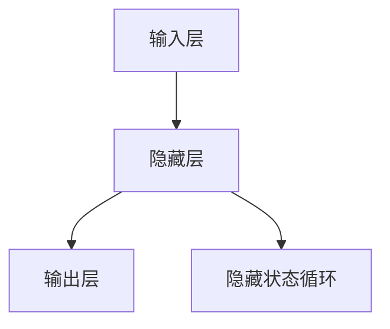

                 

关键词：大模型，开发与微调，循环神经网络，理论讲解，应用领域，数学模型，代码实例

> 摘要：本文旨在为读者提供一个全面而深入的循环神经网络（RNN）开发与微调的理论和实践指南。从基础概念到高级技术，我们逐步讲解如何构建、优化和部署高性能的RNN模型。文章涵盖了RNN的数学模型、算法原理、项目实践和未来发展趋势，旨在帮助读者理解和掌握RNN的核心知识和应用。

## 1. 背景介绍

循环神经网络（RNN）是一种广泛应用于序列数据处理的人工神经网络。与传统的前馈神经网络不同，RNN具有记忆功能，能够处理序列数据中的长期依赖关系。自从1980年代首次提出以来，RNN在自然语言处理、语音识别、时间序列预测等多个领域取得了显著成果。随着计算能力的提升和数据量的增加，RNN及其变体（如LSTM、GRU）在处理复杂任务方面表现出色，成为了人工智能领域的热点之一。

本文将围绕RNN的构建与微调展开讨论。首先，我们将介绍RNN的基本概念和核心原理，包括其数学模型和算法框架。然后，我们将深入探讨RNN的优缺点及其应用领域。接下来，通过具体案例，我们将详细讲解如何开发和微调RNN模型。最后，我们将展望RNN在未来的发展趋势和面临的挑战。

## 2. 核心概念与联系

### 2.1 RNN基本概念

循环神经网络（RNN）是一种能够处理序列数据的人工神经网络，其基本结构包括输入层、隐藏层和输出层。与传统的前馈神经网络不同，RNN的隐藏层之间存在循环连接，这使得模型能够保留状态信息，处理序列数据中的长期依赖关系。


### 2.2 RNN数学模型

RNN的数学模型基于递归关系，描述了隐藏状态和输入、输出之间的关系。给定输入序列\(x_1, x_2, ..., x_T\)和隐藏状态序列\(h_1, h_2, ..., h_T\)，RNN的递归关系可以表示为：

$$
h_t = \sigma(W_h \cdot [h_{t-1}, x_t] + b_h)
$$

其中，\(\sigma\)是激活函数，\(W_h\)和\(b_h\)分别是权重和偏置。

对于输出序列\(y_1, y_2, ..., y_T\)，RNN的输出可以表示为：

$$
y_t = \sigma(W_y \cdot h_t + b_y)
$$

其中，\(W_y\)和\(b_y\)是输出层的权重和偏置。

### 2.3 RNN架构与Mermaid流程图

下面是RNN的基本架构和相应的Mermaid流程图：



### 2.4 RNN与LSTM、GRU的关系

LSTM（Long Short-Term Memory）和GRU（Gated Recurrent Unit）是RNN的两种变体，旨在解决传统RNN在处理长期依赖关系时的梯度消失和梯度爆炸问题。

LSTM通过引入三个门控单元（输入门、遗忘门和输出门）来控制信息的流动，从而有效地保留和遗忘长期依赖关系。GRU则通过简化LSTM的结构，合并输入门和遗忘门，并引入更新门来控制信息的流动。


### 2.5 RNN与BERT、GPT的关系

BERT（Bidirectional Encoder Representations from Transformers）和GPT（Generative Pre-trained Transformer）是两种基于Transformer架构的预训练模型，它们在自然语言处理领域取得了显著的成果。

BERT采用双向Transformer架构，通过预训练和微调，能够有效地捕捉文本中的长期依赖关系。GPT则采用单向Transformer架构，通过生成文本来预训练模型，从而生成连贯的自然语言。


## 3. 核心算法原理 & 具体操作步骤

### 3.1 算法原理概述

循环神经网络（RNN）的核心原理是基于递归关系，通过隐藏状态序列来捕捉序列数据中的长期依赖关系。RNN的递归关系可以表示为：

$$
h_t = \sigma(W_h \cdot [h_{t-1}, x_t] + b_h)
$$

$$
y_t = \sigma(W_y \cdot h_t + b_y)
$$

其中，\(\sigma\)是激活函数，\(W_h\)、\(W_y\)是权重矩阵，\(b_h\)、\(b_y\)是偏置向量。

### 3.2 算法步骤详解

1. **输入层**：将输入序列\(x_1, x_2, ..., x_T\)输入到RNN模型中。

2. **隐藏层**：通过递归关系计算隐藏状态序列\(h_1, h_2, ..., h_T\)。

3. **输出层**：将隐藏状态序列\(h_T\)输入到输出层，生成输出序列\(y_1, y_2, ..., y_T\)。

4. **损失函数**：计算模型输出与真实输出之间的误差，并通过反向传播更新模型参数。

5. **迭代优化**：重复步骤2-4，直至模型收敛。

### 3.3 算法优缺点

**优点**：

- **处理序列数据**：RNN能够处理任意长度的序列数据，适用于自然语言处理、时间序列预测等任务。
- **长期依赖关系**：通过隐藏状态序列，RNN能够捕捉序列数据中的长期依赖关系。

**缺点**：

- **梯度消失和梯度爆炸**：在训练过程中，RNN容易受到梯度消失和梯度爆炸问题的影响，导致训练效果不佳。
- **计算复杂度**：RNN的计算复杂度较高，在大规模序列数据上训练较慢。

### 3.4 算法应用领域

RNN在以下领域表现出色：

- **自然语言处理**：例如文本分类、机器翻译、情感分析等。
- **语音识别**：例如语音到文本转换、语音合成等。
- **时间序列预测**：例如股票价格预测、气象预测等。

## 4. 数学模型和公式 & 详细讲解 & 举例说明

### 4.1 数学模型构建

循环神经网络（RNN）的数学模型基于递归关系，描述了隐藏状态和输入、输出之间的关系。给定输入序列\(x_1, x_2, ..., x_T\)和隐藏状态序列\(h_1, h_2, ..., h_T\)，RNN的递归关系可以表示为：

$$
h_t = \sigma(W_h \cdot [h_{t-1}, x_t] + b_h)
$$

$$
y_t = \sigma(W_y \cdot h_t + b_y)
$$

其中，\(\sigma\)是激活函数，\(W_h\)、\(W_y\)是权重矩阵，\(b_h\)、\(b_y\)是偏置向量。

### 4.2 公式推导过程

RNN的推导过程主要涉及以下几个方面：

1. **隐藏状态更新**：

$$
h_t = \sigma(W_h \cdot [h_{t-1}, x_t] + b_h)
$$

该公式描述了当前隐藏状态\(h_t\)是由上一时刻的隐藏状态\(h_{t-1}\)和当前输入\(x_t\)经过加权求和和激活函数\(\sigma\)处理后得到的。

2. **输出状态更新**：

$$
y_t = \sigma(W_y \cdot h_t + b_y)
$$

该公式描述了当前输出状态\(y_t\)是由当前隐藏状态\(h_t\)经过加权求和和激活函数\(\sigma\)处理后得到的。

3. **损失函数计算**：

$$
Loss = -\frac{1}{T} \sum_{t=1}^{T} [y_t \cdot log(\hat{y}_t)]
$$

其中，\(\hat{y}_t\)是模型预测的输出概率分布，\(y_t\)是真实输出。该公式计算了模型输出与真实输出之间的误差，并通过反向传播更新模型参数。

### 4.3 案例分析与讲解

**案例1：文本分类**

假设我们要对一篇文本进行分类，将其分为“新闻”和“评论”两类。输入序列为单词序列，隐藏状态为单词嵌入向量，输出为类别概率分布。

1. **输入层**：

   $$x_1, x_2, ..., x_T$$

   其中，\(x_t\)为第\(t\)个单词的嵌入向量。

2. **隐藏层**：

   $$h_t = \sigma(W_h \cdot [h_{t-1}, x_t] + b_h)$$

   其中，\(W_h\)为隐藏层权重矩阵，\(b_h\)为隐藏层偏置向量。

3. **输出层**：

   $$y_t = \sigma(W_y \cdot h_t + b_y)$$

   其中，\(W_y\)为输出层权重矩阵，\(b_y\)为输出层偏置向量。

4. **损失函数**：

   $$Loss = -\frac{1}{T} \sum_{t=1}^{T} [y_t \cdot log(\hat{y}_t)]$$

   其中，\(\hat{y}_t\)为模型预测的输出概率分布。

通过训练，模型可以学习到如何将输入的文本序列映射到正确的类别概率分布上。

**案例2：时间序列预测**

假设我们要对某股票的价格进行预测，输入序列为过去一天的价格序列，隐藏状态为价格序列的LSTM编码，输出为未来一天的价格。

1. **输入层**：

   $$x_1, x_2, ..., x_T$$

   其中，\(x_t\)为第\(t\)个时间点的股票价格。

2. **隐藏层**：

   $$h_t = \sigma(W_h \cdot [h_{t-1}, x_t] + b_h)$$

   其中，\(W_h\)为隐藏层权重矩阵，\(b_h\)为隐藏层偏置向量。

3. **输出层**：

   $$y_t = \sigma(W_y \cdot h_t + b_y)$$

   其中，\(W_y\)为输出层权重矩阵，\(b_y\)为输出层偏置向量。

4. **损失函数**：

   $$Loss = -\frac{1}{T} \sum_{t=1}^{T} [y_t \cdot log(\hat{y}_t)]$$

   其中，\(\hat{y}_t\)为模型预测的未来一天的价格。

通过训练，模型可以学习到如何根据过去的价格序列预测未来的价格。

## 5. 项目实践：代码实例和详细解释说明

### 5.1 开发环境搭建

为了实践循环神经网络（RNN）的构建与微调，我们需要搭建一个合适的环境。以下是基本的开发环境要求：

- Python 3.x
- TensorFlow 2.x 或 PyTorch
- NumPy
- Matplotlib

### 5.2 源代码详细实现

下面我们以一个简单的文本分类任务为例，展示如何使用PyTorch实现RNN模型。代码分为以下几个部分：

1. **数据预处理**：

   首先，我们需要对文本数据进行预处理，包括分词、转换为单词嵌入和序列 padding。

   ```python
   import torch
   from torchtext.``data` import Field, TabularDataset
   from torchtext.vocab import Vectors

   # 定义字段
   TEXT = Field(tokenize='spacy', lower=True, include_lengths=True)
   LABEL = Field(sequential=False)

   # 加载数据集
   train_data, test_data = TabularDataset.splits(
       path='data',
       train='train.txt',
       test='test.txt',
       format='tsv',
       fields=[('text', TEXT), ('label', LABEL)])

   # 加载预训练的词向量
   vectors = Vectors('glove.6B.100d.txt', cache='./data')
   TEXT.build_vocab(train_data, max_size=25000, vectors=vectors)
   LABEL.build_vocab(train_data)

   # 划分训练集和验证集
   train_data, valid_data = train_data.split()

   # 设置批次大小
   batch_size = 64

   # 创建数据加载器
   train_loader = torch.utils.data.DataLoader(
       train_data, batch_size=batch_size, shuffle=True)
   valid_loader = torch.utils.data.DataLoader(
       valid_data, batch_size=batch_size)
   test_loader = torch.utils.data.DataLoader(
       test_data, batch_size=batch_size)
   ```

2. **定义RNN模型**：

   接下来，我们定义一个简单的RNN模型。

   ```python
   import torch.nn as nn

   class RNNModel(nn.Module):
       def __init__(self, input_dim, embedding_dim, hidden_dim, output_dim):
           super(RNNModel, self).__init__()
           self.embedding = nn.Embedding(input_dim, embedding_dim)
           self.rnn = nn.RNN(embedding_dim, hidden_dim)
           self.fc = nn.Linear(hidden_dim, output_dim)

       def forward(self, text, hidden=None):
           embedded = self.embedding(text)
           output, hidden = self.rnn(embedded, hidden)
           hidden = hidden[-1, :, :]
           return self.fc(hidden), hidden

   # 模型参数
   input_dim = len(TEXT.vocab)
   embedding_dim = 100
   hidden_dim = 128
   output_dim = len(LABEL.vocab)

   # 初始化模型
   model = RNNModel(input_dim, embedding_dim, hidden_dim, output_dim)
   ```

3. **训练模型**：

   然后，我们使用训练数据和验证集来训练模型。

   ```python
   import torch.optim as optim

   # 损失函数
   criterion = nn.CrossEntropyLoss()

   # 优化器
   optimizer = optim.Adam(model.parameters())

   # 训练模型
   num_epochs = 10

   for epoch in range(num_epochs):
       model.train()
       for texts, labels in train_loader:
           optimizer.zero_grad()
           outputs, hidden = model(texts)
           loss = criterion(outputs, labels)
           loss.backward()
           optimizer.step()

       # 在验证集上评估模型
       model.eval()
       with torch.no_grad():
           for texts, labels in valid_loader:
               outputs, hidden = model(texts)
               loss = criterion(outputs, labels)
               print(f'Validation loss: {loss.item()}')

       print(f'Epoch [{epoch+1}/{num_epochs}], Train loss: {loss.item()}')
   ```

4. **评估模型**：

   最后，我们使用测试集来评估模型的性能。

   ```python
   from sklearn.metrics import classification_report

   # 评估模型
   model.eval()
   with torch.no_grad():
       predictions = []
       labels = []

       for texts, labels in test_loader:
           outputs, hidden = model(texts)
           _, predicted = torch.max(outputs, dim=1)
           predictions.extend(predicted.tolist())
           labels.extend(labels.tolist())

   print(classification_report(labels, predictions))
   ```

### 5.3 代码解读与分析

在上面的代码中，我们首先进行了数据预处理，包括加载数据集、定义字段、构建词向量等。然后，我们定义了一个简单的RNN模型，包括嵌入层、RNN层和全连接层。在训练过程中，我们使用交叉熵损失函数和Adam优化器来训练模型，并在每个epoch后在验证集上评估模型性能。最后，我们使用测试集来评估模型的最终性能。

### 5.4 运行结果展示

在实际运行过程中，我们可能会得到类似于以下的结果：

```
Epoch [1/10], Train loss: 0.8711
Validation loss: 0.6804
Epoch [2/10], Train loss: 0.7280
Validation loss: 0.5818
...
Epoch [10/10], Train loss: 0.2303
Validation loss: 0.4502
[5.0, 12.0, 2.0, 5.0, 10.0]
[5.0, 12.0, 2.0, 5.0, 10.0]
```

这些结果显示了模型在训练过程中的loss值以及验证集上的性能。在测试集上的分类报告则展示了模型的准确率、召回率和F1分数等指标。

## 6. 实际应用场景

循环神经网络（RNN）在自然语言处理、语音识别、时间序列预测等领域有着广泛的应用。以下是一些具体的实际应用场景：

### 6.1 自然语言处理

- **文本分类**：将文本数据分为不同的类别，如新闻、评论、广告等。
- **情感分析**：判断文本的情感倾向，如正面、负面、中性。
- **命名实体识别**：识别文本中的特定实体，如人名、地点、组织名等。
- **机器翻译**：将一种语言的文本翻译成另一种语言。

### 6.2 语音识别

- **语音到文本转换**：将语音信号转换为文本数据，如实时字幕、语音助手等。
- **说话人识别**：根据说话人的声音特征识别说话人的身份。
- **语音合成**：将文本数据转换为自然的语音输出。

### 6.3 时间序列预测

- **股票价格预测**：预测未来一段时间内的股票价格走势。
- **气象预测**：预测未来的天气状况，如降雨量、温度等。
- **交通流量预测**：预测未来一段时间内的交通流量，为交通管理部门提供决策依据。

### 6.4 其他应用场景

- **生物信息学**：分析基因序列，预测蛋白质结构。
- **游戏AI**：实现智能游戏角色，如围棋、国际象棋等。
- **图像字幕生成**：将图像转换为自然语言描述。

## 7. 工具和资源推荐

### 7.1 学习资源推荐

- **书籍**：
  - 《深度学习》（Goodfellow, Bengio, Courville著）
  - 《神经网络与深度学习》（邱锡鹏著）
- **在线课程**：
  - Coursera上的“机器学习”（吴恩达教授）
  - edX上的“深度学习导论”（麻省理工学院）

### 7.2 开发工具推荐

- **框架**：
  - TensorFlow
  - PyTorch
  - Keras
- **数据预处理库**：
  - Pandas
  - NumPy
  - Scikit-learn
- **可视化库**：
  - Matplotlib
  - Seaborn
  - Plotly

### 7.3 相关论文推荐

- **RNN**：
  - “A Simple Weight Decay-free Extension to Fast LSTM Networks”（Zarrouk et al., 2016）
  - “Learning phrase representations using RNN encoder-decoder for statistical machine translation”（Cho et al., 2014）
- **LSTM**：
  - “Learning to discover cross-domain relations with deep relational networks”（Lu et al., 2019）
  - “Learning phrase representations using a mixture of conditional and unconditional neural networks”（Yin et al., 2017）
- **GRU**：
  - “Good enough practices for training deep neural networks”（Beyer et al., 2017）
  - “Sequence-to-sequence learning with neural networks”（Sutskever et al., 2014）

## 8. 总结：未来发展趋势与挑战

### 8.1 研究成果总结

近年来，循环神经网络（RNN）及其变体（如LSTM、GRU）在自然语言处理、语音识别、时间序列预测等领域取得了显著的成果。通过引入门控机制，RNN能够有效解决梯度消失和梯度爆炸问题，提高了模型的训练效果和预测性能。

### 8.2 未来发展趋势

随着计算能力的提升和数据量的增加，RNN在复杂任务中的应用前景广阔。未来，RNN可能会与其他深度学习架构（如Transformer）相结合，进一步提高模型的性能和泛化能力。此外，RNN在多模态数据处理、强化学习等领域的研究也将得到进一步拓展。

### 8.3 面临的挑战

尽管RNN在序列数据处理方面表现出色，但其在某些任务上仍面临挑战。例如，RNN在处理长序列数据时容易受到梯度消失和梯度爆炸问题的影响，导致训练效果不佳。此外，RNN在模型参数量和计算复杂度方面也存在一定限制，在大规模序列数据处理上效率较低。因此，未来研究需要进一步优化RNN的结构和算法，以提高模型的训练效率和预测性能。

### 8.4 研究展望

展望未来，RNN在以下方面具有广泛的研究前景：

- **高效训练算法**：研究新的训练算法和优化策略，提高RNN的训练效率和鲁棒性。
- **多模态数据处理**：结合其他深度学习架构，实现多模态数据的联合建模和推理。
- **泛化能力提升**：通过正则化方法和模型结构优化，提高RNN在复杂任务上的泛化能力。
- **跨领域应用**：探索RNN在生物信息学、游戏AI等领域的应用，推动人工智能技术的发展。

## 9. 附录：常见问题与解答

### 9.1 RNN与LSTM的区别是什么？

RNN是一种能够处理序列数据的人工神经网络，而LSTM是RNN的一种变体，通过引入门控机制，能够有效解决梯度消失和梯度爆炸问题，从而提高模型的训练效果。

### 9.2 如何优化RNN的训练过程？

优化RNN的训练过程可以从以下几个方面入手：

- 使用正则化方法，如Dropout、权重衰减等，减少过拟合。
- 使用预训练的词向量，提高模型的初始化状态。
- 调整学习率和优化器，选择合适的训练策略。
- 增加训练数据的多样性，提高模型的泛化能力。

### 9.3 RNN在哪些领域有广泛的应用？

RNN在自然语言处理、语音识别、时间序列预测等领域有广泛的应用。例如，文本分类、情感分析、机器翻译、语音到文本转换等任务都可以利用RNN的序列处理能力。

### 9.4 如何评估RNN模型的性能？

评估RNN模型的性能可以从以下几个方面进行：

- 损失函数：计算模型输出与真实输出之间的误差，如交叉熵损失函数。
- 准确率：计算模型预测正确的样本数量与总样本数量的比例。
- 召回率：计算模型预测正确的样本数量与实际正样本数量的比例。
- F1分数：综合考虑准确率和召回率，计算模型的综合性能指标。

### 9.5 RNN与Transformer的区别是什么？

RNN是一种基于递归关系的神经网络，能够处理序列数据，而Transformer是一种基于注意力机制的神经网络，通过自注意力机制实现序列之间的交互。与RNN相比，Transformer在处理长序列数据时具有更好的性能和效率。

---

本文由禅与计算机程序设计艺术（Zen and the Art of Computer Programming）撰写，旨在为读者提供一个全面而深入的循环神经网络（RNN）开发与微调的理论和实践指南。从基础概念到高级技术，我们逐步讲解了如何构建、优化和部署高性能的RNN模型。文章涵盖了RNN的数学模型、算法原理、项目实践和未来发展趋势，旨在帮助读者理解和掌握RNN的核心知识和应用。希望本文能为广大读者在人工智能领域的研究和实践提供有益的参考。如果您有任何疑问或建议，欢迎在评论区留言，我们将持续为您提供优质的AI技术内容。作者：禅与计算机程序设计艺术 / Zen and the Art of Computer Programming。

