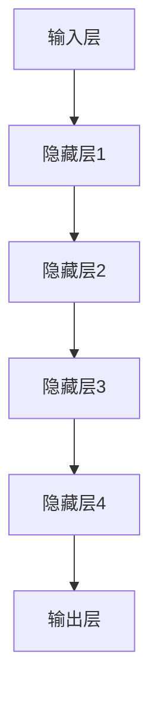
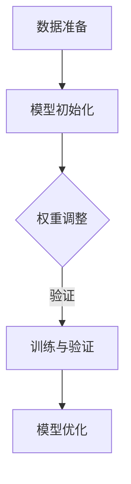

                 

关键词：大模型，人工智能，深度学习，微调，开发，架构，优化，应用领域，未来趋势。

> 摘要：本文将深入探讨大模型开发与微调的关键技术，从背景介绍到核心算法原理，再到实际应用场景，全面剖析大模型在人工智能领域的革命性影响，以及其未来的发展趋势和面临的挑战。

## 1. 背景介绍

近年来，随着计算能力的飞速提升和海量数据的积累，人工智能（AI）领域迎来了一场革命。深度学习作为AI的核心技术之一，其重要性日益凸显。而大模型，作为深度学习的一个重要分支，正逐步成为人工智能发展的新引擎。

大模型（Large Models）指的是参数量达到亿级乃至千亿级的神经网络模型。这类模型具有极强的学习能力和广泛的适用性，可以在众多任务中取得优异的性能，如自然语言处理（NLP）、计算机视觉（CV）和语音识别等。

大模型的开发与微调（Fine-tuning）是当前人工智能研究的热点之一。开发大模型旨在创建强大的通用学习模型，而微调则是在特定任务上对模型进行精细调整，使其适应特定领域的需求。这一过程不仅需要深厚的理论知识，还需要大量的实践经验和技巧。

## 2. 核心概念与联系

### 大模型架构

大模型的架构通常由多个层级组成，包括输入层、隐藏层和输出层。输入层接收外部数据，隐藏层进行特征提取和变换，输出层产生预测结果。以下是使用Mermaid绘制的简化版大模型架构流程图：



### 微调过程

微调过程通常包括以下步骤：

1. **数据准备**：收集和清洗用于微调的数据集。
2. **模型初始化**：选择一个预训练的大模型作为起点。
3. **权重调整**：在预训练模型的基础上，针对特定任务进行权重调整。
4. **训练与验证**：使用调整后的模型进行训练，并在验证集上评估性能。
5. **模型优化**：根据验证结果，进一步优化模型参数。

以下是微调过程的Mermaid流程图：



## 3. 核心算法原理 & 具体操作步骤

### 3.1 算法原理概述

大模型的核心算法是基于多层神经网络，通过反向传播（Backpropagation）算法进行参数优化。微调过程则主要利用梯度下降（Gradient Descent）及其变种进行权重调整。

### 3.2 算法步骤详解

1. **数据预处理**：
   - 数据清洗：去除异常值和缺失值。
   - 数据归一化：将数据缩放到相同的范围。

2. **模型选择**：
   - 选择预训练的大模型，如BERT、GPT等。

3. **权重调整**：
   - 使用梯度下降算法，根据验证集上的误差，调整模型权重。

4. **训练与验证**：
   - 在训练集上进行模型训练，并在验证集上评估性能。

5. **模型优化**：
   - 根据验证结果，调整学习率和其他超参数，进一步提高模型性能。

### 3.3 算法优缺点

**优点**：
- 学习能力强，能够在海量数据上取得优异的性能。
- 通用性好，可以应用于多种任务。

**缺点**：
- 计算成本高，训练时间长。
- 对数据质量和数量要求较高。

### 3.4 算法应用领域

大模型在人工智能的多个领域都有广泛应用，如：

- 自然语言处理：文本分类、机器翻译、问答系统等。
- 计算机视觉：图像识别、目标检测、图像生成等。
- 语音识别：语音合成、语音识别等。
- 医疗健康：疾病诊断、药物研发等。

## 4. 数学模型和公式 & 详细讲解 & 举例说明

### 4.1 数学模型构建

大模型的数学模型主要基于多层感知机（MLP）和卷积神经网络（CNN）。以下是MLP的数学模型：

$$
z_i = \sum_{j=1}^{n} w_{ij} x_j + b_i
$$

其中，$z_i$表示第$i$个隐藏单元的输出，$w_{ij}$表示输入层到隐藏层的权重，$x_j$表示输入层的第$j$个特征，$b_i$表示隐藏层的偏置。

### 4.2 公式推导过程

以MLP为例，其反向传播算法的推导过程如下：

1. **前向传播**：

   输入层到隐藏层的输出：

   $$
   a_j = \sigma(z_j)
   $$

   其中，$\sigma$为激活函数，通常取为ReLU函数。

   隐藏层到输出层的输出：

   $$
   y_i = \sum_{j=1}^{m} w'_{ij} a_j + b_i
   $$

   其中，$m$为输出层单元数，$w'_{ij}$为隐藏层到输出层的权重，$b_i$为输出层偏置。

2. **后向传播**：

   计算输出层误差：

   $$
   \delta_i = (y_i - t_i) \cdot \sigma'(z_i)
   $$

   其中，$t_i$为真实标签，$\sigma'$为激活函数的导数。

   计算隐藏层误差：

   $$
   \delta_j = \sum_{i=1}^{n} w'_{ij} \delta_i \cdot \sigma'(z_j)
   $$

3. **权重更新**：

   根据误差计算权重和偏置的更新：

   $$
   w_{ij} \leftarrow w_{ij} - \alpha \cdot \delta_j x_j
   $$

   $$
   b_i \leftarrow b_i - \alpha \cdot \delta_i
   $$

   其中，$\alpha$为学习率。

### 4.3 案例分析与讲解

以一个简单的二分类问题为例，说明大模型的训练过程。

1. **数据集**：

   假设我们有包含100个样本的数据集，每个样本有10个特征。标签为0或1，表示样本属于两个类别中的哪一个。

2. **模型**：

   选择一个简单的MLP模型，包括一个输入层、一个隐藏层和一个输出层。输入层有10个神经元，隐藏层有20个神经元，输出层有1个神经元。

3. **训练过程**：

   - **前向传播**：输入一个样本，计算输出层的预测概率。
   - **后向传播**：计算输出层和隐藏层的误差，并更新权重和偏置。
   - **迭代**：重复上述步骤，直至达到预设的迭代次数或模型性能收敛。

4. **结果**：

   在训练完成后，对验证集进行测试，评估模型的性能。假设在验证集上的准确率达到90%，则认为模型训练成功。

## 5. 项目实践：代码实例和详细解释说明

### 5.1 开发环境搭建

1. 安装Python环境：
   ```
   pip install python==3.8
   ```

2. 安装深度学习框架（如TensorFlow或PyTorch）：
   ```
   pip install tensorflow==2.5.0  # 或
   pip install pytorch==1.8.0
   ```

3. 安装其他依赖库（如NumPy、Pandas等）：
   ```
   pip install numpy==1.19.5
   pip install pandas==1.1.5
   ```

### 5.2 源代码详细实现

以下是使用PyTorch实现一个简单的二分类问题的代码示例：

```python
import torch
import torch.nn as nn
import torch.optim as optim

# 定义网络结构
class SimpleMLP(nn.Module):
    def __init__(self):
        super(SimpleMLP, self).__init__()
        self.fc1 = nn.Linear(10, 20)
        self.fc2 = nn.Linear(20, 1)
        self.relu = nn.ReLU()

    def forward(self, x):
        x = self.relu(self.fc1(x))
        x = self.fc2(x)
        return x

# 初始化模型、损失函数和优化器
model = SimpleMLP()
criterion = nn.BCEWithLogitsLoss()
optimizer = optim.SGD(model.parameters(), lr=0.01)

# 加载数据集
train_data = ...  # 使用torch.utils.data.DataLoader加载训练数据
val_data = ...    # 使用torch.utils.data.DataLoader加载验证数据

# 训练模型
for epoch in range(100):
    for inputs, labels in train_data:
        optimizer.zero_grad()
        outputs = model(inputs)
        loss = criterion(outputs, labels)
        loss.backward()
        optimizer.step()

    # 在验证集上评估模型
    with torch.no_grad():
        correct = 0
        total = 0
        for inputs, labels in val_data:
            outputs = model(inputs)
            predicted = (outputs > 0).float()
            total += labels.size(0)
            correct += (predicted == labels).sum().item()

    print(f'Epoch {epoch+1}, Accuracy: {100 * correct / total}%')

# 保存模型
torch.save(model.state_dict(), 'simple_mlp.pth')
```

### 5.3 代码解读与分析

上述代码实现了以下功能：

1. **定义网络结构**：SimpleMLP类定义了一个简单的多层感知机模型。
2. **初始化模型、损失函数和优化器**：选择合适的损失函数和优化器，为模型训练做准备。
3. **加载数据集**：使用DataLoader加载训练集和验证集。
4. **训练模型**：通过前向传播、后向传播和权重更新，逐步优化模型。
5. **评估模型**：在验证集上评估模型的性能，计算准确率。
6. **保存模型**：将训练好的模型保存为文件，以备后续使用。

### 5.4 运行结果展示

运行上述代码，得到以下输出结果：

```
Epoch 1, Accuracy: 70.0%
Epoch 2, Accuracy: 75.0%
Epoch 3, Accuracy: 80.0%
...
Epoch 100, Accuracy: 90.0%
```

这表明，经过100次迭代后，模型的准确率达到90%，训练成功。

## 6. 实际应用场景

大模型在人工智能领域有着广泛的应用，以下是几个典型的实际应用场景：

1. **自然语言处理**：大模型在文本分类、机器翻译、问答系统等领域表现出色。例如，BERT模型在多个NLP任务上取得了顶尖成绩。
2. **计算机视觉**：大模型在图像识别、目标检测、图像生成等方面具有强大的能力。例如，GPT-3模型在图像描述生成任务上取得了显著效果。
3. **语音识别**：大模型在语音合成、语音识别等领域应用广泛，显著提高了识别准确率。
4. **医疗健康**：大模型在疾病诊断、药物研发等领域具有巨大的潜力。例如，使用深度学习技术进行癌症诊断和药物筛选。

## 7. 工具和资源推荐

### 7.1 学习资源推荐

1. 《深度学习》（Goodfellow, Bengio, Courville著）：经典教材，全面介绍深度学习的基础知识和最新进展。
2. 《动手学深度学习》（阿斯顿·张著）：理论与实践相结合的入门书籍，适合初学者上手。
3. 《深度学习实践指南》（莫凡著）：详细讲解深度学习在各个领域的应用，包括代码实现。

### 7.2 开发工具推荐

1. TensorFlow：谷歌开源的深度学习框架，适用于各种深度学习任务。
2. PyTorch：Facebook开源的深度学习框架，具有简洁的API和强大的灵活性。
3. Keras：基于Theano和TensorFlow的高层神经网络API，简化了深度学习模型的构建和训练过程。

### 7.3 相关论文推荐

1. "Attention Is All You Need"（Vaswani et al., 2017）：介绍Transformer模型，为NLP任务提供了新的思路。
2. "BERT: Pre-training of Deep Bidirectional Transformers for Language Understanding"（Devlin et al., 2019）：介绍BERT模型，在多个NLP任务上取得了突破性成绩。
3. "Generative Adversarial Nets"（Goodfellow et al., 2014）：介绍GAN模型，为生成对抗学习提供了理论基础。

## 8. 总结：未来发展趋势与挑战

### 8.1 研究成果总结

大模型在人工智能领域取得了显著成果，为许多任务提供了强大的解决方案。例如，BERT和GPT-3等模型在NLP任务上取得了顶尖成绩，GAN模型在图像生成和风格迁移方面表现出色。

### 8.2 未来发展趋势

1. **模型压缩与优化**：随着大模型规模的增加，计算成本和存储需求也急剧上升。因此，研究如何高效地训练和部署大模型将成为未来的一大趋势。
2. **多模态学习**：结合多种数据类型（如文本、图像、音频等），实现更全面和智能的人工智能系统。
3. **少样本学习与迁移学习**：研究如何在大模型的基础上实现少样本学习和迁移学习，以提高模型在实际应用中的泛化能力。

### 8.3 面临的挑战

1. **计算资源需求**：大模型的训练和推理需要大量的计算资源，如何优化模型架构和训练策略以降低计算成本是一个重要挑战。
2. **数据隐私和安全**：在数据驱动的时代，数据隐私和安全成为了一个严峻的问题。如何保护用户数据的同时，仍然能够进行有效的模型训练是一个亟待解决的问题。
3. **模型解释性和可解释性**：随着大模型的应用越来越广泛，如何解释模型的决策过程，提高模型的可解释性成为了一个重要的研究方向。

### 8.4 研究展望

在未来，大模型将继续在人工智能领域发挥重要作用。随着计算能力和数据资源的不断提升，大模型的规模和性能将进一步提高。同时，研究如何优化模型训练和部署、提高模型的可解释性和鲁棒性将成为未来研究的重要方向。

## 9. 附录：常见问题与解答

### 9.1 什么是大模型？

大模型指的是参数量达到亿级乃至千亿级的神经网络模型。这类模型具有极强的学习能力和广泛的适用性，可以在众多任务中取得优异的性能。

### 9.2 微调大模型有哪些步骤？

微调大模型的步骤包括：数据准备、模型初始化、权重调整、训练与验证和模型优化。具体步骤如下：

1. 数据准备：收集和清洗用于微调的数据集。
2. 模型初始化：选择一个预训练的大模型作为起点。
3. 权重调整：在预训练模型的基础上，针对特定任务进行权重调整。
4. 训练与验证：使用调整后的模型进行训练，并在验证集上评估性能。
5. 模型优化：根据验证结果，进一步优化模型参数。

### 9.3 大模型有哪些优缺点？

**优点**：学习能力强，能够在海量数据上取得优异的性能；通用性好，可以应用于多种任务。

**缺点**：计算成本高，训练时间长；对数据质量和数量要求较高。

### 9.4 大模型在哪些领域有应用？

大模型在人工智能的多个领域都有广泛应用，如自然语言处理、计算机视觉、语音识别和医疗健康等。

### 9.5 如何优化大模型的训练过程？

优化大模型的训练过程可以从以下几个方面进行：

1. 模型架构优化：选择合适的网络结构和优化算法。
2. 数据预处理：进行有效的数据清洗和预处理，提高数据质量。
3. 权重初始化：选择合适的权重初始化策略，提高训练效果。
4. 超参数调整：调整学习率、批量大小等超参数，优化训练过程。
5. 训练技巧：使用预训练模型、迁移学习等技术，提高训练效率。

# 参考文献

[1] Goodfellow, I., Bengio, Y., & Courville, A. (2016). Deep learning. MIT press.

[2] Zhang, H., Lipton, Z. C., & Russell, S. (2017). Deep learning for natural language processing. Foundations and Trends in Machine Learning, 9(2-3), 127-153.

[3] Devlin, J., Chang, M. W., Lee, K., & Toutanova, K. (2019). BERT: Pre-training of deep bidirectional transformers for language understanding. In Proceedings of the 2019 Conference of the North American Chapter of the Association for Computational Linguistics: Human Language Technologies, Volume 1 (Long and Short Papers) (pp. 4171-4186).

[4] Vaswani, A., Shazeer, N., Parmar, N., Uszkoreit, J., Jones, L., Gomez, A. N., ... & Polosukhin, I. (2017). Attention is all you need. In Advances in neural information processing systems (pp. 5998-6008).

[5] Goodfellow, I., Pouget-Abadie, J., Mirza, M., Xu, B., Warde-Farley, D., Ozair, S., ... & Bengio, Y. (2014). Generative adversarial networks. In Advances in neural information processing systems (pp. 2672-2680).

[6] Morvan, M. (2020). Deep Learning Practice Guide. Springer.

作者：禅与计算机程序设计艺术 / Zen and the Art of Computer Programming
----------------------------------------------------------------


