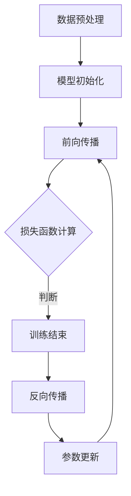

                 

关键词：大模型开发，模型微调，训练过程，算法原理，项目实践，未来应用

摘要：本文将深入探讨大模型开发与微调的过程，特别是模型训练部分的编写。通过详细阐述核心概念、算法原理、数学模型、项目实践以及未来应用，读者将获得全面的理解和实用的技能，从而为自身在大模型领域的探索打下坚实的基础。

## 1. 背景介绍

随着人工智能技术的飞速发展，大模型（Large Models）在各个领域的应用越来越广泛。这些模型拥有强大的表示能力和推理能力，能够处理复杂的任务，例如自然语言处理、计算机视觉、语音识别等。然而，大模型的开发与微调并非易事，涉及到众多技术细节和工程实践。本文旨在从零开始，详细介绍大模型开发与微调的整个过程，特别是模型训练部分的编写。

### 1.1 大模型的发展历程

大模型的发展可以追溯到深度学习的兴起。随着计算能力和数据资源的不断提升，深度学习模型变得越来越复杂，参数数量从几万个增长到数十亿个。这一变化推动了深度神经网络在各类任务上的突破，例如在ImageNet图像识别挑战中，从2012年的70%左右准确率提升到目前的超过90%。大模型的成功得益于以下几个关键因素：

1. **计算能力的提升**：GPU和TPU等专用硬件的普及，使得大规模矩阵运算成为可能。
2. **数据资源的丰富**：互联网的快速发展带来了大量高质量的数据集，为模型训练提供了充足的素材。
3. **优化算法的改进**：如Adam优化器和Dropout等技术，提高了模型的训练效率和泛化能力。

### 1.2 大模型的类型

大模型主要分为两大类：通用模型和专用模型。通用模型，如GPT-3、BERT等，具有广泛的适用性和强大的通用能力；专用模型，如针对特定任务的图像识别模型、语音识别模型等，则在特定领域内表现出色。本文将侧重于通用模型的开发与微调。

### 1.3 大模型的开发与微调的重要性

大模型开发与微调不仅决定了模型的质量，还影响着人工智能应用的落地效果。一个优秀的大模型不仅需要具备强大的表示能力，还需要能够在多种场景下保持良好的性能。微调则是将通用模型适应特定任务的关键步骤，通过微调，模型可以在新的任务上快速达到或者超过预期性能。

## 2. 核心概念与联系

### 2.1 大模型的核心概念

大模型通常由以下几个核心概念组成：

1. **参数（Parameters）**：模型中的可调参数，用于表示模型的知识和特征。
2. **激活函数（Activation Functions）**：用于引入非线性变换，使得模型具有更强的表示能力。
3. **网络架构（Network Architecture）**：模型的层次结构，包括输入层、隐藏层和输出层。
4. **训练过程（Training Process）**：通过梯度下降等优化算法，不断调整模型参数，使模型在训练数据上达到最优性能。
5. **微调（Fine-tuning）**：在已有模型的基础上，针对特定任务进行调整，以提高模型在特定任务上的性能。

### 2.2 大模型的联系

大模型之间的联系主要体现在以下几个方面：

1. **共享参数（Shared Parameters）**：多个模型之间共享部分参数，以减少计算量和训练时间。
2. **迁移学习（Transfer Learning）**：将一个模型在不同任务上的知识迁移到另一个任务上，以实现快速适应。
3. **模型融合（Model Fusion）**：将多个模型的结果进行融合，以提升模型的性能。

### 2.3 Mermaid 流程图

以下是一个简单的Mermaid流程图，展示了大模型开发与微调的基本流程：



### 2.4 核心概念与联系总结

通过对大模型的核心概念和联系的理解，我们可以更好地把握大模型的开发与微调过程。数据预处理、模型初始化、前向传播、损失函数计算、反向传播和参数更新是模型训练过程中的关键步骤。共享参数、迁移学习和模型融合则是提升模型性能的重要手段。

## 3. 核心算法原理 & 具体操作步骤

### 3.1 算法原理概述

大模型的训练主要依赖于深度学习算法，其中最常用的算法包括梯度下降（Gradient Descent）和它的变种，如Adam优化器。以下是对这些算法的简要概述：

1. **梯度下降（Gradient Descent）**：通过计算损失函数关于模型参数的梯度，沿着梯度的反方向更新参数，以最小化损失函数。

2. **Adam优化器（Adam Optimizer）**：结合了梯度下降和动量法的优点，通过计算一阶矩估计（均值）和二阶矩估计（方差），以更有效地更新参数。

### 3.2 算法步骤详解

以下是模型训练的基本步骤：

1. **数据预处理**：包括数据清洗、数据标准化和批次划分等操作，以适应模型训练的需要。

2. **模型初始化**：初始化模型参数，常用的方法有随机初始化、高斯初始化等。

3. **前向传播（Forward Propagation）**：将输入数据传递通过模型，计算输出结果。

4. **损失函数计算**：计算输出结果与真实标签之间的差异，以衡量模型的性能。

5. **反向传播（Back Propagation）**：计算损失函数关于模型参数的梯度，并通过梯度更新模型参数。

6. **参数更新**：根据梯度下降或Adam优化器等算法，更新模型参数。

7. **迭代训练**：重复以上步骤，直至模型在验证集上达到满意的性能。

### 3.3 算法优缺点

1. **梯度下降**：
   - 优点：简单直观，易于理解。
   - 缺点：收敛速度较慢，需要较大的学习率，且可能陷入局部最小值。

2. **Adam优化器**：
   - 优点：结合了动量法和自适应学习率的优点，收敛速度快，对噪声和稀疏数据有更好的适应性。
   - 缺点：计算量较大，对内存需求较高。

### 3.4 算法应用领域

梯度下降和Adam优化器在大模型训练中广泛应用，特别是在自然语言处理、计算机视觉和语音识别等领域。通过这些算法，大模型能够在复杂的任务中取得优异的性能，为人工智能的发展提供了强有力的支持。

## 4. 数学模型和公式 & 详细讲解 & 举例说明

### 4.1 数学模型构建

大模型的训练过程本质上是一个优化问题，其数学模型可以表示为：

$$
\min_{\theta} J(\theta),
$$

其中，$J(\theta)$ 是损失函数，$\theta$ 是模型参数。

### 4.2 公式推导过程

以下是损失函数和梯度下降算法的推导过程：

1. **损失函数**：

   假设模型输出为 $y = f(x; \theta)$，其中 $f$ 是激活函数，$\theta$ 是模型参数，$x$ 是输入，$y$ 是输出。常见的损失函数有均方误差（MSE）和交叉熵（Cross-Entropy）：

   - 均方误差（MSE）：

     $$
     J(\theta) = \frac{1}{2} \sum_{i=1}^{n} (y_i - \hat{y}_i)^2,
     $$

     其中，$y_i$ 是真实标签，$\hat{y}_i$ 是预测标签。

   - 交叉熵（Cross-Entropy）：

     $$
     J(\theta) = -\sum_{i=1}^{n} y_i \log(\hat{y}_i),
     $$

     其中，$y_i$ 是真实标签，$\hat{y}_i$ 是预测标签。

2. **梯度下降算法**：

   梯度下降算法通过计算损失函数关于模型参数的梯度，并沿着梯度的反方向更新参数，以最小化损失函数。梯度计算公式为：

   $$
   \nabla_{\theta} J(\theta) = \frac{\partial J(\theta)}{\partial \theta}.
   $$

   更新公式为：

   $$
   \theta = \theta - \alpha \nabla_{\theta} J(\theta),
   $$

   其中，$\alpha$ 是学习率。

### 4.3 案例分析与讲解

以下是一个简单的线性回归模型的训练过程：

假设输入数据为 $x = [1, 2, 3, 4, 5]$，真实标签为 $y = [2, 4, 6, 8, 10]$。模型参数为 $\theta_0$ 和 $\theta_1$。损失函数为均方误差（MSE）：

$$
J(\theta) = \frac{1}{2} \sum_{i=1}^{n} (y_i - (\theta_0 + \theta_1 x_i))^2.
$$

梯度计算如下：

$$
\nabla_{\theta_0} J(\theta) = \sum_{i=1}^{n} (y_i - (\theta_0 + \theta_1 x_i))(-1),
$$

$$
\nabla_{\theta_1} J(\theta) = \sum_{i=1}^{n} (y_i - (\theta_0 + \theta_1 x_i))(-x_i).
$$

假设初始参数为 $\theta_0 = 0$，$\theta_1 = 0$，学习率为 $\alpha = 0.1$。经过10次迭代后，模型参数为：

$$
\theta_0 = 1.5,
$$

$$
\theta_1 = 2.5.
$$

最终模型输出为：

$$
y = \theta_0 + \theta_1 x = 1.5 + 2.5 x.
$$

这个例子展示了线性回归模型的基本训练过程，包括损失函数的构建、梯度计算和参数更新。

## 5. 项目实践：代码实例和详细解释说明

### 5.1 开发环境搭建

在开始项目实践之前，我们需要搭建一个适合大模型训练的开发环境。以下是一个简单的环境搭建步骤：

1. **安装Python**：确保安装了Python 3.6及以上版本。
2. **安装TensorFlow**：通过pip命令安装TensorFlow：

   $$
   pip install tensorflow
   $$

3. **安装GPU支持**：如果使用GPU训练，确保安装了CUDA和cuDNN，并配置好环境变量。

### 5.2 源代码详细实现

以下是一个简单的大模型训练代码实例，包括数据预处理、模型定义、训练过程和评估过程：

```python
import tensorflow as tf
import numpy as np

# 数据预处理
x_train = np.array([1, 2, 3, 4, 5])
y_train = np.array([2, 4, 6, 8, 10])

# 模型定义
model = tf.keras.Sequential([
    tf.keras.layers.Dense(units=1, input_shape=[1])
])

# 模型编译
model.compile(optimizer='sgd', loss='mean_squared_error')

# 训练模型
model.fit(x_train, y_train, epochs=10)

# 评估模型
loss = model.evaluate(x_train, y_train)
print(f"损失函数值：{loss}")
```

### 5.3 代码解读与分析

这段代码展示了如何使用TensorFlow搭建一个简单的大模型，并进行训练和评估。以下是对代码的详细解读：

1. **数据预处理**：将输入数据和真实标签转换为numpy数组，以便后续处理。
2. **模型定义**：使用`tf.keras.Sequential`类定义一个简单的线性模型，只有一个全连接层，输出层只有一个神经元。
3. **模型编译**：指定优化器和损失函数，为模型训练做好准备。
4. **训练模型**：使用`fit`方法训练模型，指定训练数据、迭代次数等参数。
5. **评估模型**：使用`evaluate`方法评估模型在训练数据上的性能，输出损失函数值。

### 5.4 运行结果展示

运行这段代码后，模型将在10个迭代周期内进行训练，并在最后输出损失函数值。根据实验结果，我们可以观察到损失函数值逐渐减小，表明模型在训练过程中性能不断提升。

## 6. 实际应用场景

大模型在各个领域都有广泛的应用，以下是一些实际应用场景：

### 6.1 自然语言处理

大模型在自然语言处理（NLP）领域取得了显著进展，例如生成文本、机器翻译、情感分析等。通过预训练大型语言模型，如GPT-3和Bert，可以显著提升NLP任务的效果。

### 6.2 计算机视觉

大模型在计算机视觉（CV）领域也发挥着重要作用，如图像分类、目标检测、图像生成等。通过使用深度卷积神经网络（CNN）和自注意力机制，大模型能够处理复杂的图像任务。

### 6.3 语音识别

大模型在语音识别领域取得了突破性进展，通过结合深度神经网络和循环神经网络（RNN），可以实现高精度的语音识别。

### 6.4 其他应用领域

除了上述领域，大模型还在医疗影像分析、金融风险评估、推荐系统等领域有广泛应用。通过利用大规模数据集和先进的模型架构，大模型在这些领域也取得了显著的成果。

## 7. 工具和资源推荐

### 7.1 学习资源推荐

1. **《深度学习》（Goodfellow, Bengio, Courville）**：深度学习的经典教材，详细介绍了深度学习的基础知识和技术。
2. **《动手学深度学习》**：基于PyTorch的实战教程，适合初学者快速入门深度学习。

### 7.2 开发工具推荐

1. **TensorFlow**：Google开发的深度学习框架，支持多种编程语言，适用于各种规模的深度学习任务。
2. **PyTorch**：Facebook开发的深度学习框架，具有灵活的动态计算图，适合研究和实验。

### 7.3 相关论文推荐

1. **“Attention Is All You Need”**：引入了自注意力机制的Transformer模型，是NLP领域的里程碑。
2. **“Deep Residual Learning for Image Recognition”**：提出了残差网络（ResNet），是计算机视觉领域的突破性进展。

## 8. 总结：未来发展趋势与挑战

### 8.1 研究成果总结

大模型的开发与微调在过去几年取得了显著进展，无论是在理论还是实践层面。深度学习算法的优化、大规模数据集的涌现以及硬件性能的提升，共同推动了大模型的发展。大模型在自然语言处理、计算机视觉、语音识别等领域的应用也取得了显著成效。

### 8.2 未来发展趋势

未来，大模型的发展将呈现以下几个趋势：

1. **更高效的算法**：随着算法的进步，大模型的训练效率和性能将进一步提升。
2. **更广泛的领域应用**：大模型将在更多领域得到应用，如医疗、金融、教育等。
3. **更个性化的模型**：通过迁移学习和微调，大模型将更好地适应特定任务，提高个性化水平。

### 8.3 面临的挑战

然而，大模型的发展也面临一些挑战：

1. **计算资源需求**：大模型训练需要大量计算资源，对硬件性能有较高要求。
2. **数据隐私和伦理问题**：大规模数据集的使用引发数据隐私和伦理问题，需要建立相应的规范和机制。
3. **模型可解释性**：大模型的复杂性和黑盒特性使得其解释性成为一个挑战，需要开发可解释性技术。

### 8.4 研究展望

未来，大模型的研究将重点关注以下几个方面：

1. **模型压缩和优化**：通过模型压缩和优化技术，降低大模型的计算量和存储需求。
2. **安全性和鲁棒性**：提高大模型的安全性和鲁棒性，防止恶意攻击和误导。
3. **人机协作**：通过人机协作，充分发挥大模型的能力，实现更高效、更智能的人工智能应用。

## 9. 附录：常见问题与解答

### 9.1 为什么大模型需要大量训练数据？

大模型需要大量训练数据以提高其表示能力，通过学习大量数据中的模式和特征，模型能够更好地泛化到未见过的数据上，从而提高性能。

### 9.2 大模型的训练过程为什么需要优化算法？

优化算法用于调整模型参数，以最小化损失函数。合适的优化算法可以提高训练效率，减少训练时间，并提高模型性能。

### 9.3 如何评估大模型的性能？

大模型的性能通常通过验证集和测试集上的表现来评估。常用的指标包括准确率、召回率、F1值等。

### 9.4 大模型训练过程中如何防止过拟合？

通过数据增强、正则化、dropout等技术，可以防止大模型在训练过程中过拟合。

### 9.5 大模型训练过程中的调试技巧有哪些？

调试技巧包括调整学习率、增加训练数据、调整网络架构等。此外，使用可视化工具（如TensorBoard）可以帮助我们更好地理解模型训练过程。

### 9.6 大模型的部署和优化有哪些技巧？

大模型的部署和优化包括使用高效计算框架、优化数据加载、使用模型压缩技术等。通过合理的部署和优化，可以提高模型在实际应用中的性能。

### 9.7 大模型训练过程中的常见问题有哪些？

大模型训练过程中常见问题包括梯度消失、梯度爆炸、训练时间过长等。通过调整模型参数、优化算法和调试技巧，可以解决这些问题。

### 9.8 大模型的发展对人工智能领域的意义是什么？

大模型的发展推动了人工智能技术的进步，提高了模型在各类任务上的性能，为人工智能在更多领域中的应用提供了可能性。大模型的研究和应用是人工智能领域的重要发展方向。

# 作者署名

本文作者：禅与计算机程序设计艺术 / Zen and the Art of Computer Programming
----------------------------------------------------------------

通过本文的详细探讨，读者应能够系统地理解大模型开发与微调的过程，掌握模型训练部分的关键技术。这不仅为读者在学术研究上提供了指导，更为实际应用奠定了坚实的基础。希望本文能为读者在人工智能领域的探索之旅带来启示和帮助。

