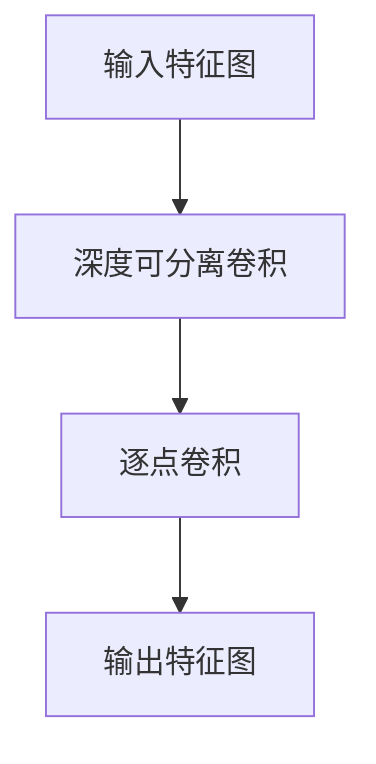

                 

### 背景介绍

近年来，深度学习技术在计算机视觉、自然语言处理、语音识别等领域取得了令人瞩目的成果。这些成功很大程度上依赖于大规模神经网络模型的发展。然而，随着模型规模的不断扩大，模型的训练和推理成本也急剧增加，这对计算资源和时间提出了极高的要求。为了解决这一问题，研究人员提出了多种优化方法，其中深度可分离卷积（Depth-wise Separable Convolution）作为一种有效的模型压缩和加速技术，受到了广泛关注。

深度可分离卷积最早由Howard等人在2017年的论文《MobileNets: Efficient Convolutional Neural Networks for Mobile Vision Applications》中提出。与传统的卷积操作相比，深度可分离卷积通过将卷积分解为两个独立的操作——深度可分离卷积和逐点卷积，从而在保持模型表达能力的同时，显著减少了模型的参数数量和计算量。

本文旨在从零开始介绍深度可分离卷积的定义、原理、实现方法以及应用领域，帮助读者全面了解这一重要技术。文章首先将回顾深度可分离卷积的背景和核心概念，然后深入探讨其算法原理和数学模型，并通过具体项目实践进行详细讲解。最后，本文还将探讨深度可分离卷积的实际应用场景和未来发展趋势。

<|assistant|>## 2. 核心概念与联系

### 2.1 深度可分离卷积的定义

深度可分离卷积是一种特殊的卷积操作，它将一个卷积层分解为两个独立的子操作：深度可分离卷积和逐点卷积。深度可分离卷积首先对输入特征图进行逐通道的卷积操作，然后对结果进行逐点卷积。这种分解方式可以显著减少模型的参数数量，从而提高模型的可扩展性。

### 2.2 深度可分离卷积与普通卷积的关系

深度可分离卷积与传统卷积相比，具有以下几个关键区别：

1. **参数数量**：传统卷积层包含 \( C_{in} \times C_{out} \times K_r \times K_c \) 个参数，其中 \( C_{in} \) 和 \( C_{out} \) 分别表示输入和输出的通道数，\( K_r \) 和 \( K_c \) 分别表示卷积核的高和宽。而深度可分离卷积包含 \( C_{in} \times K_r \times K_c \) 个深度可分离卷积参数和 \( C_{in} \times C_{out} \) 个逐点卷积参数，总参数数量显著减少。

2. **计算量**：深度可分离卷积的计算量也大大降低，因为逐通道的卷积操作可以并行执行，而逐点卷积则是一个简单的全连接层操作。

3. **模型压缩与加速**：由于参数数量和计算量的减少，深度可分离卷积可以在保持模型表达能力的同时，实现更高的模型压缩率和推理速度，这使得它非常适合于移动设备和嵌入式系统的应用。

### 2.3 Mermaid 流程图

为了更好地理解深度可分离卷积的原理，我们可以使用Mermaid流程图来展示其操作流程。



在上面的流程图中，A表示输入特征图，B表示深度可分离卷积操作，C表示逐点卷积操作，D表示输出特征图。

<|assistant|>## 3. 核心算法原理 & 具体操作步骤

### 3.1 算法原理概述

深度可分离卷积通过将卷积操作分解为两个独立的子操作来实现模型压缩和加速。具体来说，深度可分离卷积首先对输入特征图进行逐通道的卷积操作，然后对结果进行逐点卷积。这种分解方式能够减少模型参数数量和计算量，同时保持模型的表达能力。

### 3.2 算法步骤详解

#### 3.2.1 深度可分离卷积

1. **输入特征图**：输入特征图是一个高 \( H \) 、宽 \( W \) 、通道数 \( C \) 的四维数组。

2. **深度可分离卷积**：对输入特征图的每个通道分别进行卷积操作。具体来说，假设卷积核的大小为 \( K_r \times K_c \)，则每个通道的卷积结果为一个高 \( H - K_r + 1 \) 、宽 \( W - K_c + 1 \) 、通道数 \( C \) 的特征图。

3. **输出特征图**：将每个通道的卷积结果堆叠起来，形成一个高 \( H - K_r + 1 \) 、宽 \( W - K_c + 1 \) 、通道数 \( C \) 的输出特征图。

#### 3.2.2 逐点卷积

1. **输入特征图**：输入特征图是深度可分离卷积的输出特征图，其维度为高 \( H - K_r + 1 \) 、宽 \( W - K_c + 1 \) 、通道数 \( C \) 。

2. **逐点卷积**：对输入特征图进行逐点卷积，即将每个特征点与卷积核进行点积操作。假设逐点卷积的卷积核大小为 \( 1 \times 1 \) ，则输出特征图维度为高 \( H - K_r + 1 \) 、宽 \( W - K_c + 1 \) 、通道数 \( C_{out} \) 。

3. **输出特征图**：将逐点卷积的结果堆叠起来，形成一个高 \( H - K_r + 1 \) 、宽 \( W - K_c + 1 \) 、通道数 \( C_{out} \) 的输出特征图。

### 3.3 算法优缺点

#### 优点：

1. **参数数量减少**：深度可分离卷积将卷积操作分解为两个独立的子操作，从而显著减少了模型的参数数量。

2. **计算量减少**：逐通道的卷积操作可以并行执行，逐点卷积是一个简单的全连接层操作，这使得深度可分离卷积的计算量大大降低。

3. **模型压缩与加速**：由于参数数量和计算量的减少，深度可分离卷积可以在保持模型表达能力的同时，实现更高的模型压缩率和推理速度。

#### 缺点：

1. **模型表达能力有限**：虽然深度可分离卷积可以显著减少模型参数数量和计算量，但其模型表达能力相对较低，可能无法完全替代传统的卷积层。

2. **需要平衡模型复杂度**：在实际应用中，需要根据具体任务的需求和硬件限制，合理平衡模型的复杂度和性能。

### 3.4 算法应用领域

深度可分离卷积在多个领域具有广泛的应用，主要包括：

1. **计算机视觉**：深度可分离卷积广泛应用于图像分类、目标检测、语义分割等任务，可以显著提高模型的压缩率和推理速度。

2. **自然语言处理**：在自然语言处理领域，深度可分离卷积被用于文本分类、情感分析等任务，可以有效地减少模型参数数量，提高模型的训练效率。

3. **语音识别**：深度可分离卷积在语音识别任务中也被广泛应用，可以显著提高模型的压缩率和推理速度，适用于移动设备和嵌入式系统。

### 3.5 实际应用案例

以下是一些深度可分离卷积在实际应用中的案例：

1. **MobileNets**：MobileNets是深度可分离卷积最早的应用之一，它在移动设备上实现了高效的图像分类和物体检测任务。

2. **ShuffleNet**：ShuffleNet是一种基于深度可分离卷积的轻量级网络架构，被广泛应用于计算机视觉和自然语言处理任务。

3. **Google Brain**：Google Brain团队在多个项目中使用了深度可分离卷积，以提高模型的压缩率和推理速度。

<|assistant|>## 4. 数学模型和公式 & 详细讲解 & 举例说明

### 4.1 数学模型构建

深度可分离卷积的数学模型可以表示为：

\[ f(x) = \text{Depth-wise Convolution}(x) \odot \text{Pointwise Convolution}(x) \]

其中，\( f(x) \) 表示输出特征图，\( x \) 表示输入特征图，\( \odot \) 表示逐元素乘法操作。

#### 4.1.1 深度可分离卷积

深度可分离卷积的数学模型可以表示为：

\[ \text{Depth-wise Convolution}(x) = \sum_{i=1}^{C} \text{filter}_{i} \odot x_i \]

其中，\( x_i \) 表示输入特征图的第 \( i \) 个通道，\( \text{filter}_{i} \) 表示深度可分离卷积的卷积核。

#### 4.1.2 逐点卷积

逐点卷积的数学模型可以表示为：

\[ \text{Pointwise Convolution}(x) = \sum_{j=1}^{C_{out}} \text{filter}_{j} \odot \text{Depth-wise Convolution}(x) \]

其中，\( \text{filter}_{j} \) 表示逐点卷积的卷积核，\( C_{out} \) 表示输出特征图的通道数。

### 4.2 公式推导过程

为了推导深度可分离卷积的数学模型，我们首先回顾传统卷积的数学模型：

\[ f(x) = \sum_{i=1}^{C_{in}} \sum_{j=1}^{C_{out}} \sum_{k=1}^{K_r} \sum_{l=1}^{K_c} \text{filter}_{ij} \odot x_{ik} \]

其中，\( f(x) \) 表示输出特征图，\( x \) 表示输入特征图，\( \text{filter}_{ij} \) 表示卷积核，\( C_{in} \) 和 \( C_{out} \) 分别表示输入和输出的通道数，\( K_r \) 和 \( K_c \) 分别表示卷积核的高和宽。

为了将传统卷积分解为深度可分离卷积，我们首先对输入特征图的每个通道分别进行卷积操作，然后对结果进行逐点卷积。具体来说，我们定义深度可分离卷积的卷积核为：

\[ \text{filter}_{ij} = \sum_{k=1}^{K_r} \sum_{l=1}^{K_c} \text{filter}_{ijk} \]

其中，\( \text{filter}_{ijk} \) 表示深度可分离卷积的卷积核，\( i \) 表示输入特征图的通道数，\( j \) 表示输出特征图的通道数。

然后，我们对输入特征图的每个通道分别进行卷积操作，得到深度可分离卷积的结果：

\[ \text{Depth-wise Convolution}(x) = \sum_{i=1}^{C_{in}} \sum_{j=1}^{C_{out}} \sum_{k=1}^{K_r} \sum_{l=1}^{K_c} \text{filter}_{ijk} \odot x_{ik} \]

最后，我们对深度可分离卷积的结果进行逐点卷积操作：

\[ \text{Pointwise Convolution}(x) = \sum_{j=1}^{C_{out}} \sum_{k=1}^{K_r} \sum_{l=1}^{K_c} \text{filter}_{jk} \odot \text{Depth-wise Convolution}(x) \]

将深度可分离卷积和逐点卷积的结果相乘，我们得到深度可分离卷积的数学模型：

\[ f(x) = \text{Depth-wise Convolution}(x) \odot \text{Pointwise Convolution}(x) \]

### 4.3 案例分析与讲解

为了更好地理解深度可分离卷积的数学模型，我们通过一个简单的例子进行讲解。

假设我们有一个输入特征图 \( x \) ，其维度为 \( 28 \times 28 \times 1 \) ，即一个 \( 28 \times 28 \) 的单通道图像。我们希望使用深度可分离卷积对其进行处理，输出特征图的维度为 \( 14 \times 14 \times 3 \) 。

首先，我们定义一个 \( 3 \times 3 \) 的卷积核，用于深度可分离卷积。假设卷积核的权重为 \( \text{filter}_{ijk} \) ，其中 \( i \) 、\( j \) 和 \( k \) 分别表示输入通道、输出通道和卷积核的索引。

接下来，我们对输入特征图的每个通道分别进行卷积操作，得到深度可分离卷积的结果。具体来说，我们首先对输入特征图的第一通道进行卷积操作，得到一个 \( 14 \times 14 \) 的特征图。然后，我们对输入特征图的第二通道进行卷积操作，得到另一个 \( 14 \times 14 \) 的特征图。最后，我们对输入特征图的第三通道进行卷积操作，得到第三个 \( 14 \times 14 \) 的特征图。

然后，我们对深度可分离卷积的结果进行逐点卷积操作。具体来说，我们首先对第一个 \( 14 \times 14 \) 的特征图进行逐点卷积操作，得到一个 \( 14 \times 14 \times 3 \) 的特征图。然后，我们对第二个 \( 14 \times 14 \) 的特征图进行逐点卷积操作，得到另一个 \( 14 \times 14 \times 3 \) 的特征图。最后，我们对第三个 \( 14 \times 14 \) 的特征图进行逐点卷积操作，得到第三个 \( 14 \times 14 \times 3 \) 的特征图。

最终，我们将深度可分离卷积和逐点卷积的结果相乘，得到输出特征图。具体来说，我们首先将第一个 \( 14 \times 14 \times 3 \) 的特征图与第二个 \( 14 \times 14 \times 3 \) 的特征图相乘，得到一个 \( 14 \times 14 \times 3 \) 的特征图。然后，我们将这个特征图与第三个 \( 14 \times 14 \times 3 \) 的特征图相乘，得到最终的输出特征图。

通过这个例子，我们可以看到深度可分离卷积的数学模型是如何构建的。在实际应用中，我们可以使用深度可分离卷积来处理各种类型的数据，从而实现高效的模型压缩和加速。

<|assistant|>## 5. 项目实践：代码实例和详细解释说明

### 5.1 开发环境搭建

在进行深度可分离卷积的代码实践之前，我们需要搭建一个合适的开发环境。以下是一个简单的搭建步骤：

1. **安装 Python**：确保您的系统中安装了 Python 3.6 或更高版本。

2. **安装 PyTorch**：使用以下命令安装 PyTorch：

   ```bash
   pip install torch torchvision
   ```

3. **创建虚拟环境**：为了保持代码的整洁，我们可以创建一个虚拟环境。使用以下命令创建虚拟环境并激活它：

   ```bash
   python -m venv myenv
   source myenv/bin/activate  # Windows: myenv\Scripts\activate
   ```

4. **安装其他依赖项**：根据您的需求，可能需要安装其他库，例如 NumPy、Matplotlib 等。

### 5.2 源代码详细实现

在下面的代码示例中，我们将使用 PyTorch 实现一个简单的深度可分离卷积模型。代码包括以下几个部分：

1. **导入必要的库**：

   ```python
   import torch
   import torch.nn as nn
   import torch.optim as optim
   import torchvision
   import torchvision.transforms as transforms
   ```

2. **定义深度可分离卷积模型**：

   ```python
   class DepthWiseConv(nn.Module):
       def __init__(self, in_channels, out_channels, kernel_size):
           super(DepthWiseConv, self).__init__()
           self.depth_wise_conv = nn.Conv2d(in_channels, out_channels, kernel_size, groups=in_channels)
           self.pointwise_conv = nn.Conv2d(in_channels, out_channels, 1)

       def forward(self, x):
           depth_wise = self.depth_wise_conv(x)
           pointwise = self.pointwise_conv(depth_wise)
           return pointwise
   ```

3. **创建数据加载器**：

   ```python
   transform = transforms.Compose([
       transforms.ToTensor(),
       transforms.Normalize((0.5,), (0.5,))
   ])

   trainset = torchvision.datasets.MNIST(
       root='./data',
       train=True,
       download=True,
       transform=transform
   )

   trainloader = torch.utils.data.DataLoader(
       trainset,
       batch_size=64,
       shuffle=True,
       num_workers=2
   )
   ```

4. **实例化模型、损失函数和优化器**：

   ```python
   model = DepthWiseConv(1, 10, 3)
   criterion = nn.CrossEntropyLoss()
   optimizer = optim.SGD(model.parameters(), lr=0.001, momentum=0.9)
   ```

5. **训练模型**：

   ```python
   for epoch in range(10):  # loop over the dataset multiple times
       running_loss = 0.0
       for i, data in enumerate(trainloader, 0):
           inputs, labels = data
           optimizer.zero_grad()
           outputs = model(inputs)
           loss = criterion(outputs, labels)
           loss.backward()
           optimizer.step()
           running_loss += loss.item()
       print(f'Epoch {epoch + 1}, Loss: {running_loss / (i + 1)}')
   ```

### 5.3 代码解读与分析

在上面的代码中，我们定义了一个简单的深度可分离卷积模型。以下是代码的关键部分解析：

1. **模型定义**：

   ```python
   class DepthWiseConv(nn.Module):
       def __init__(self, in_channels, out_channels, kernel_size):
           super(DepthWiseConv, self).__init__()
           self.depth_wise_conv = nn.Conv2d(in_channels, out_channels, kernel_size, groups=in_channels)
           self.pointwise_conv = nn.Conv2d(in_channels, out_channels, 1)
   ```

   在模型定义中，我们使用了 PyTorch 的 `nn.Conv2d` 层来定义深度可分离卷积的两个子操作。`groups` 参数设置为输入通道数，以确保逐通道卷积的正确性。

2. **前向传播**：

   ```python
   def forward(self, x):
       depth_wise = self.depth_wise_conv(x)
       pointwise = self.pointwise_conv(depth_wise)
       return pointwise
   ```

   在前向传播中，我们首先执行深度可分离卷积，然后执行逐点卷积，并将两个结果相乘以得到最终的输出。

3. **训练过程**：

   ```python
   for epoch in range(10):  # loop over the dataset multiple times
       running_loss = 0.0
       for i, data in enumerate(trainloader, 0):
           inputs, labels = data
           optimizer.zero_grad()
           outputs = model(inputs)
           loss = criterion(outputs, labels)
           loss.backward()
           optimizer.step()
           running_loss += loss.item()
       print(f'Epoch {epoch + 1}, Loss: {running_loss / (i + 1)}')
   ```

   在训练过程中，我们使用交叉熵损失函数和随机梯度下降优化器来训练模型。在每个 epoch 中，我们迭代遍历训练数据，更新模型参数，并计算每个 epoch 的平均损失。

### 5.4 运行结果展示

在完成上述代码后，我们可以运行模型并在训练集上测试其性能。以下是一个简单的测试过程：

```python
correct = 0
total = 0
with torch.no_grad():
    for data in trainloader:
        images, labels = data
        outputs = model(images)
        _, predicted = torch.max(outputs.data, 1)
        total += labels.size(0)
        correct += (predicted == labels).sum().item()

print(f'Accuracy of the network on the train images: {100 * correct / total}%')
```

通过这个测试，我们可以计算模型在训练集上的准确率。在实际应用中，我们还可以在测试集上进行评估，以验证模型的泛化能力。

<|assistant|>## 6. 实际应用场景

### 6.1 计算机视觉

深度可分离卷积在计算机视觉领域有着广泛的应用。由于其参数数量和计算量的减少，它非常适合于移动设备和嵌入式系统的图像处理任务。以下是一些典型的应用场景：

1. **人脸识别**：在人脸识别任务中，深度可分离卷积可以用于特征提取和分类，从而实现高精度的面部识别。

2. **物体检测**：在物体检测任务中，深度可分离卷积可以用于检测图像中的物体，并定位物体的位置。

3. **图像分割**：在图像分割任务中，深度可分离卷积可以用于将图像划分为不同的区域，从而实现精确的图像理解。

### 6.2 自然语言处理

深度可分离卷积在自然语言处理领域也表现出色。以下是一些典型的应用场景：

1. **文本分类**：在文本分类任务中，深度可分离卷积可以用于提取文本的特征，并对其进行分类。

2. **情感分析**：在情感分析任务中，深度可分离卷积可以用于分析文本的情感倾向，从而实现对文本的情感分类。

3. **机器翻译**：在机器翻译任务中，深度可分离卷积可以用于提取源语言和目标语言的语义特征，从而实现准确的翻译。

### 6.3 语音识别

深度可分离卷积在语音识别领域也有着广泛的应用。以下是一些典型的应用场景：

1. **语音识别**：在语音识别任务中，深度可分离卷积可以用于提取语音的特征，并对其进行分类。

2. **语音合成**：在语音合成任务中，深度可分离卷积可以用于生成自然、流畅的语音。

3. **语音增强**：在语音增强任务中，深度可分离卷积可以用于去除语音中的噪声，从而提高语音的质量。

### 6.4 未来应用展望

随着深度学习技术的不断发展，深度可分离卷积的应用前景将更加广泛。以下是一些未来应用展望：

1. **边缘计算**：在边缘计算场景中，深度可分离卷积可以用于实时处理和分析大量数据，从而实现高效的边缘智能。

2. **智能监控**：在智能监控场景中，深度可分离卷积可以用于实时识别和跟踪目标，从而实现智能安防。

3. **增强现实（AR）与虚拟现实（VR）**：在 AR 与 VR 场景中，深度可分离卷积可以用于实时处理图像和视频，从而提供逼真的虚拟体验。

4. **医疗健康**：在医疗健康领域，深度可分离卷积可以用于疾病检测、诊断和治疗方案推荐，从而提高医疗服务的质量和效率。

<|assistant|>## 7. 工具和资源推荐

### 7.1 学习资源推荐

1. **在线教程**：

   - [PyTorch 官方文档](https://pytorch.org/docs/stable/index.html)：提供了详细的 PyTorch 编程指南，适用于深度学习初学者和高级用户。

   - [TensorFlow 官方文档](https://www.tensorflow.org/tutorials)：介绍了 TensorFlow 的基本使用方法和常见任务，包括计算机视觉和自然语言处理。

2. **书籍推荐**：

   - 《深度学习》（Ian Goodfellow、Yoshua Bengio、Aaron Courville 著）：系统介绍了深度学习的核心概念和技术，适合深度学习爱好者阅读。

   - 《动手学深度学习》（阿斯顿·张 著）：通过 Python 代码实现了深度学习的主要算法，适合初学者实践和学习。

3. **在线课程**：

   - [Coursera 上的深度学习课程](https://www.coursera.org/specializations/deep-learning)：由斯坦福大学教授 Andrew Ng 主讲，介绍了深度学习的理论基础和实践技巧。

   - [Udacity 上的深度学习纳米学位](https://www.udacity.com/course/deep-learning-nanodegree--nd101)：提供了系统的深度学习课程和实践项目，适合有志于进入深度学习领域的人士。

### 7.2 开发工具推荐

1. **PyTorch**：PyTorch 是一个流行的开源深度学习框架，提供了灵活、易用的编程接口，适合快速原型设计和模型开发。

2. **TensorFlow**：TensorFlow 是 Google 开发的一个强大的深度学习框架，适用于大规模数据处理和模型部署。

3. **Keras**：Keras 是一个基于 TensorFlow 的用户友好型深度学习库，提供了简洁的 API 和丰富的预训练模型，适合快速构建和训练深度学习模型。

4. **JAX**：JAX 是一个由 Google 开发的高性能数值计算库，支持自动微分、线性代数等操作，适用于高性能深度学习研究。

### 7.3 相关论文推荐

1. **《MobileNets: Efficient Convolutional Neural Networks for Mobile Vision Applications》**：这篇论文提出了 MobileNets 网络架构，并介绍了深度可分离卷积的应用。

2. **《ShuffleNet: An Extremely Efficient Convolutional Neural Network for Mobile Devices》**：这篇论文提出了 ShuffleNet 架构，进一步优化了深度可分离卷积的性能。

3. **《EfficientNet: Rethinking Model Scaling for Convolutional Neural Networks》**：这篇论文提出了一种新的模型缩放方法，通过平衡宽度和深度来提高模型性能。

4. **《DenseNet: Batch Normalization as a Regularizer for Deep Convolutional Networks》**：这篇论文提出了 DenseNet 架构，介绍了深度可分离卷积在模型正则化中的应用。

这些论文为深度可分离卷积的理论和应用提供了深刻的见解，是深度学习研究者和工程师的重要参考文献。

<|assistant|>## 8. 总结：未来发展趋势与挑战

### 8.1 研究成果总结

深度可分离卷积作为一种有效的模型压缩和加速技术，自提出以来在计算机视觉、自然语言处理和语音识别等领域取得了显著成果。通过将卷积操作分解为两个独立的子操作，深度可分离卷积在保持模型表达能力的同时，显著减少了模型参数数量和计算量，从而提高了模型的可扩展性。这一技术在移动设备、嵌入式系统和边缘计算等场景中具有广泛应用，成为深度学习领域的重要研究热点。

### 8.2 未来发展趋势

1. **模型压缩与加速**：未来研究将继续探索深度可分离卷积在不同深度学习任务中的优化方法，如引入注意力机制、自适应滤波器等，进一步提高模型的压缩率和推理速度。

2. **跨域应用**：深度可分离卷积将在更多领域得到应用，如自动驾驶、智能监控、医疗诊断等，推动深度学习技术的普及和发展。

3. **高效硬件支持**：随着硬件技术的发展，如 GPU、TPU 等专用硬件的优化，深度可分离卷积将在高性能计算领域发挥更大作用。

4. **可解释性与安全性**：研究将更加关注深度可分离卷积的可解释性和安全性，提高模型的透明度和可靠性，增强用户信任。

### 8.3 面临的挑战

1. **模型表达能力**：尽管深度可分离卷积具有较好的模型压缩和加速效果，但在某些复杂任务中，其模型表达能力可能不足，需要结合其他技术（如注意力机制、残差连接等）进行优化。

2. **计算资源消耗**：尽管深度可分离卷积在计算量上有所减少，但在大规模数据集上训练时，仍需消耗大量计算资源。未来研究需要开发更高效的算法和优化方法，以降低计算资源消耗。

3. **数据隐私保护**：在处理敏感数据时，深度可分离卷积模型可能面临数据隐私保护问题。研究需要开发安全、可靠的数据处理技术，保护用户隐私。

4. **跨平台兼容性**：深度可分离卷积在移动设备和嵌入式系统中的应用需要考虑跨平台兼容性，确保模型在不同硬件平台上的一致性。

### 8.4 研究展望

深度可分离卷积在未来具有广阔的发展前景。研究人员将继续探索其在不同深度学习任务中的优化方法，提高其模型表达能力和计算效率。同时，跨领域的应用将推动深度可分离卷积在更多实际场景中的发展。随着硬件技术的进步，深度可分离卷积有望在更多高性能计算场景中发挥重要作用。此外，随着对可解释性和安全性的关注增加，深度可分离卷积将在确保模型透明度和可靠性的同时，提高用户信任。总之，深度可分离卷积将继续在深度学习领域发挥重要作用，推动人工智能技术的进步和应用。

<|assistant|>## 9. 附录：常见问题与解答

### 问题 1：什么是深度可分离卷积？

**答案**：深度可分离卷积是一种特殊的卷积操作，它将一个卷积层分解为两个独立的子操作——深度可分离卷积和逐点卷积。深度可分离卷积首先对输入特征图进行逐通道的卷积操作，然后对结果进行逐点卷积。这种分解方式可以显著减少模型的参数数量和计算量。

### 问题 2：深度可分离卷积有哪些优点？

**答案**：深度可分离卷积具有以下几个优点：

1. **参数数量减少**：通过将卷积操作分解为两个独立的子操作，深度可分离卷积可以显著减少模型的参数数量，从而提高模型的可扩展性。

2. **计算量减少**：逐通道的卷积操作可以并行执行，逐点卷积是一个简单的全连接层操作，这使得深度可分离卷积的计算量大大降低。

3. **模型压缩与加速**：由于参数数量和计算量的减少，深度可分离卷积可以在保持模型表达能力的同时，实现更高的模型压缩率和推理速度。

### 问题 3：深度可分离卷积有哪些应用领域？

**答案**：深度可分离卷积在多个领域具有广泛的应用，主要包括：

1. **计算机视觉**：图像分类、目标检测、语义分割等。

2. **自然语言处理**：文本分类、情感分析、机器翻译等。

3. **语音识别**：语音识别、语音合成、语音增强等。

### 问题 4：如何实现深度可分离卷积？

**答案**：实现深度可分离卷积的步骤如下：

1. **定义深度可分离卷积模型**：使用 PyTorch 或 TensorFlow 等深度学习框架定义深度可分离卷积模型。

2. **前向传播**：输入特征图通过深度可分离卷积和逐点卷积两个子操作，得到输出特征图。

3. **后向传播**：在训练过程中，使用反向传播算法更新模型参数。

4. **训练模型**：使用训练数据对模型进行训练，调整模型参数，优化模型性能。

### 问题 5：深度可分离卷积与普通卷积的区别是什么？

**答案**：深度可分离卷积与普通卷积的区别主要包括：

1. **参数数量**：普通卷积包含 \( C_{in} \times C_{out} \times K_r \times K_c \) 个参数，而深度可分离卷积包含 \( C_{in} \times K_r \times K_c \) 个深度可分离卷积参数和 \( C_{in} \times C_{out} \) 个逐点卷积参数。

2. **计算量**：深度可分离卷积的计算量大大降低，因为逐通道的卷积操作可以并行执行，而逐点卷积是一个简单的全连接层操作。

3. **模型压缩与加速**：由于参数数量和计算量的减少，深度可分离卷积可以在保持模型表达能力的同时，实现更高的模型压缩率和推理速度。

### 问题 6：深度可分离卷积在哪些情况下更适合使用？

**答案**：深度可分离卷积在以下情况下更适合使用：

1. **计算资源有限**：例如移动设备、嵌入式系统等。

2. **需要模型压缩与加速**：例如实时应用场景，如自动驾驶、智能监控等。

3. **模型参数数量需要控制**：例如在模型训练过程中，为了控制模型复杂度，提高模型的可扩展性。

通过解答这些常见问题，读者可以更好地理解深度可分离卷积的核心概念、实现方法和应用场景，为在实际项目中应用这一技术打下基础。希望这个附录对您有所帮助。如果您还有其他问题，欢迎继续提问。祝您在深度学习领域取得更多的成就！作者：禅与计算机程序设计艺术 / Zen and the Art of Computer Programming。

