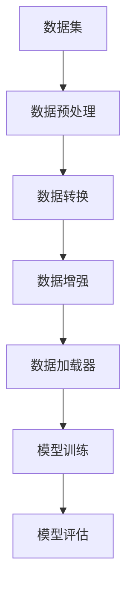

                 

关键词：大模型开发，微调，torch.utils.data，自定义数据集，深度学习，数据加载和预处理

摘要：本文旨在深入探讨大模型开发与微调过程中的关键环节——数据集的准备与处理。我们将重点关注PyTorch中的torch.utils.data工具箱，详细介绍其使用方法，并通过实际案例展示如何基于自定义数据集构建和微调大规模深度学习模型。读者将了解到从数据预处理到模型训练和评估的完整流程，以及如何利用torch.utils.data优化数据处理过程，提升模型性能。

## 1. 背景介绍

随着深度学习技术的不断进步，大型神经网络模型在计算机视觉、自然语言处理和推荐系统等领域取得了显著的成果。这些模型的训练通常需要海量的数据和强大的计算资源。然而，数据集的准备和预处理过程往往被忽视，成为模型性能提升的瓶颈。在深度学习项目中，有效的数据集处理不仅影响模型的训练效率，还对最终的性能有直接影响。

torch.utils.data是PyTorch提供的一个强大的数据加载和预处理工具箱，它简化了数据集的加载、转换和管理过程，使得开发者能够更加专注于模型设计和训练。本文将详细介绍torch.utils.data的使用方法，并通过具体案例展示如何利用该工具箱构建和微调大规模深度学习模型。

## 2. 核心概念与联系

在深入探讨torch.utils.data之前，我们需要了解一些核心概念和它们之间的联系。

### 2.1 数据集

数据集是深度学习模型的训练基础，通常包括特征和标签两部分。特征是模型学习的输入，标签是模型预测的目标。

### 2.2 数据加载器

数据加载器（DataLoader）是一个迭代器，用于批量加载数据集。它能够对数据进行随机抽样，并控制批量大小、数据重排等。

### 2.3 数据预处理

数据预处理包括数据清洗、归一化、标准化等步骤，目的是将原始数据转换为适合模型训练的形式。

### 2.4 数据转换

数据转换是将原始数据转换为PyTorch张量的过程，它通常包括数据类型转换、形状调整等。

### 2.5 数据增强

数据增强是通过各种方式（如旋转、缩放、裁剪等）生成新的数据样本，以增加数据集的多样性，防止模型过拟合。

下面是一个简单的Mermaid流程图，展示了这些核心概念和联系：



## 3. 核心算法原理 & 具体操作步骤

### 3.1 算法原理概述

torch.utils.data工具箱的核心组件包括Dataset类和数据加载器DataLoader。Dataset类用于封装数据集，定义数据加载和预处理逻辑。DataLoader类则用于批量加载数据，并提供数据重排、批量控制等功能。

### 3.2 算法步骤详解

#### 3.2.1 自定义Dataset类

首先，我们需要自定义一个Dataset类来封装我们的数据集。自定义Dataset类需要实现两个方法：`__len__`和`__getitem__`。

```python
from torch.utils.data import Dataset
from torchvision import datasets, transforms

class CustomDataset(Dataset):
    def __init__(self, root_dir, transform=None):
        self.data = datasets.ImageFolder(root=root_dir, transform=transform)

    def __len__(self):
        return len(self.data)

    def __getitem__(self, index):
        image, label = self.data[index]
        return image, label
```

在这个例子中，我们使用`torchvision.datasets.ImageFolder`来加载图像数据集，并通过`transform`参数对数据进行预处理。

#### 3.2.2 创建数据加载器

接下来，我们创建一个数据加载器DataLoader来批量加载数据。

```python
from torch.utils.data import DataLoader

transform = transforms.Compose([
    transforms.Resize((224, 224)),
    transforms.ToTensor(),
    transforms.Normalize(mean=[0.485, 0.456, 0.406], std=[0.229, 0.224, 0.225]),
])

train_dataset = CustomDataset(root_dir='train', transform=transform)
train_loader = DataLoader(dataset=train_dataset, batch_size=32, shuffle=True)

for images, labels in train_loader:
    # 进行模型训练
    pass
```

在这个例子中，我们定义了一个简单的数据预处理流程，包括图像尺寸调整、数据类型转换和归一化。然后，我们创建了一个训练数据加载器，设置批量大小为32，并启用数据重排。

#### 3.2.3 数据增强

数据增强是提升模型泛化能力的重要手段。torch.utils.data提供了多种数据增强方法，如随机裁剪、随机旋转等。

```python
import torch

def augmentation(image):
    angle = torch.randn(1).deg()
    translation = torch.randn(2) * 10
    shear = torch.randn(1) * 10
    return transforms.functional.affine(
        image,
        angle=angle,
        translate=translation,
        shear=shear,
        fillcolor=0,
    )

train_dataset = CustomDataset(root_dir='train', transform=augmentation)
```

在这个例子中，我们定义了一个简单的数据增强函数，它对图像进行随机旋转、平移和倾斜。

#### 3.2.4 数据加载与预处理

在实际训练过程中，我们通常需要同时进行数据加载和预处理。torch.utils.data的数据加载器可以很好地满足这一需求。

```python
for images, labels in train_loader:
    images = augmentation(images)
    # 进行模型训练
    pass
```

在这个例子中，我们首先使用自定义的数据增强函数对图像进行增强，然后将其传递给模型进行训练。

### 3.3 算法优缺点

**优点**：

- 简化数据集加载和预处理流程
- 支持批量数据加载，提高训练效率
- 支持数据增强，增强模型泛化能力
- 易于扩展和定制

**缺点**：

- 需要手动编写数据预处理和加载代码，不够自动化
- 对于复杂的数据预处理，可能需要自定义Dataset类，增加了代码复杂度

### 3.4 算法应用领域

torch.utils.data工具箱广泛应用于各种深度学习项目，如：

- 计算机视觉：用于加载和预处理图像数据
- 自然语言处理：用于加载和预处理文本数据
- 推荐系统：用于加载和预处理用户行为数据
- 医学影像：用于加载和预处理医学图像数据

## 4. 数学模型和公式 & 详细讲解 & 举例说明

### 4.1 数学模型构建

在深度学习模型中，数据集的预处理通常涉及一些基础的数学模型和公式，如：

- **归一化**：将数据缩放到特定的范围，如0到1之间，或者均值为0，标准差为1的标准正态分布。
- **标准化**：将数据按照标准差和均值进行调整，使其符合标准正态分布。
- **数据增强**：通过几何变换或其他方式生成新的数据样本，增加数据集的多样性。

以下是这些数学模型的公式：

$$
\text{归一化}:\ \hat{x} = \frac{x - \text{min}(x)}{\text{max}(x) - \text{min}(x)}
$$

$$
\text{标准化}:\ \hat{x} = \frac{x - \text{mean}(x)}{\text{std}(x)}
$$

### 4.2 公式推导过程

#### 归一化

归一化的目标是将数据缩放到一个特定的范围，使其更加适合模型训练。公式中的`min(x)`和`max(x)`分别表示数据的最小值和最大值。

#### 标准化

标准化的目标是将数据转换为标准正态分布。这意味着每个特征的均值被调整为0，标准差被调整为1。这种转换有助于减少不同特征之间的差异，使得模型能够更加平衡地学习各个特征的重要性。

### 4.3 案例分析与讲解

假设我们有一个包含像素值的图像数据集，像素值范围在0到255之间。我们可以使用归一化和标准化将数据转换为适合模型训练的形式。

#### 归一化

首先，我们计算最小值和最大值：

$$
\text{min}(x) = 10,\ \text{max}(x) = 250
$$

然后，我们将每个像素值按照归一化公式进行调整：

$$
\hat{x} = \frac{x - 10}{250 - 10} = \frac{x - 10}{240}
$$

调整后的像素值范围在0到1之间。

#### 标准化

接下来，我们计算像素值的均值和标准差：

$$
\text{mean}(x) = 150,\ \text{std}(x) = 30
$$

然后，我们将每个像素值按照标准化公式进行调整：

$$
\hat{x} = \frac{x - 150}{30} = \frac{x - 150}{30}
$$

调整后的像素值符合标准正态分布。

通过这个案例，我们可以看到归一化和标准化如何将原始数据转换为适合模型训练的形式。这些数学模型是torch.utils.data中数据预处理步骤的基础。

## 5. 项目实践：代码实例和详细解释说明

### 5.1 开发环境搭建

在开始项目实践之前，我们需要搭建一个合适的开发环境。以下是必要的步骤：

- 安装Python和PyTorch库：

```bash
pip install python torch torchvision
```

- 创建一个新的Python项目文件夹，并初始化一个虚拟环境：

```bash
mkdir my_project
cd my_project
python -m venv venv
source venv/bin/activate  # 在Windows上使用 `venv\Scripts\activate`
```

- 在项目中创建一个名为`main.py`的Python文件，用于编写和运行代码。

### 5.2 源代码详细实现

接下来，我们将在`main.py`中实现一个简单的深度学习项目，包括数据集加载、预处理和模型训练。

```python
import torch
import torchvision
import torchvision.transforms as transforms
from torch.utils.data import DataLoader
from torchvision.datasets import MNIST
from torch import nn
import torch.optim as optim

# 5.2.1 数据集加载和预处理
transform = transforms.Compose([
    transforms.ToTensor(),
    transforms.Normalize((0.5,), (0.5,)),
])

train_dataset = MNIST(root='./data', train=True, download=True, transform=transform)
test_dataset = MNIST(root='./data', train=False, download=True, transform=transform)

train_loader = DataLoader(dataset=train_dataset, batch_size=64, shuffle=True)
test_loader = DataLoader(dataset=test_dataset, batch_size=64, shuffle=False)

# 5.2.2 模型定义
class SimpleCNN(nn.Module):
    def __init__(self):
        super(SimpleCNN, self).__init__()
        self.conv1 = nn.Conv2d(1, 32, 3, 1)
        self.relu = nn.ReLU()
        self.maxpool = nn.MaxPool2d(2)
        self.fc1 = nn.Linear(32 * 7 * 7, 128)
        self.fc2 = nn.Linear(128, 10)

    def forward(self, x):
        x = self.relu(self.conv1(x))
        x = self.maxpool(x)
        x = x.view(-1, 32 * 7 * 7)
        x = self.relu(self.fc1(x))
        x = self.fc2(x)
        return x

model = SimpleCNN()

# 5.2.3 损失函数和优化器
criterion = nn.CrossEntropyLoss()
optimizer = optim.Adam(model.parameters(), lr=0.001)

# 5.2.4 模型训练
num_epochs = 10

for epoch in range(num_epochs):
    running_loss = 0.0
    for i, (images, labels) in enumerate(train_loader):
        images = images.to(torch.float32)
        labels = labels.to(torch.long)

        optimizer.zero_grad()
        outputs = model(images)
        loss = criterion(outputs, labels)
        loss.backward()
        optimizer.step()

        running_loss += loss.item()
        if (i + 1) % 100 == 0:
            print(f'Epoch [{epoch + 1}/{num_epochs}], Step [{i + 1}/{len(train_loader)}], Loss: {running_loss / 100:.4f}')
            running_loss = 0.0

print('Finished Training')

# 5.2.5 模型评估
model.eval()
with torch.no_grad():
    correct = 0
    total = 0
    for images, labels in test_loader:
        images = images.to(torch.float32)
        labels = labels.to(torch.long)
        outputs = model(images)
        _, predicted = torch.max(outputs.data, 1)
        total += labels.size(0)
        correct += (predicted == labels).sum().item()

print(f'Accuracy of the network on the test images: {100 * correct / total}%')
```

### 5.3 代码解读与分析

上述代码分为以下几个部分：

- **数据集加载和预处理**：使用PyTorch内置的MNIST数据集，通过`transforms.Compose`将数据转换为适合模型训练的形式，包括ToTensor和归一化。
- **模型定义**：定义一个简单的卷积神经网络（CNN）模型，包括一个卷积层、ReLU激活函数、最大池化层、全连接层。
- **损失函数和优化器**：使用交叉熵损失函数和Adam优化器进行模型训练。
- **模型训练**：通过遍历数据加载器，对模型进行前向传播、反向传播和优化参数。
- **模型评估**：在测试集上评估模型性能，计算准确率。

通过这个项目实践，我们展示了如何使用torch.utils.data工具箱加载和预处理自定义数据集，并使用简单的CNN模型进行训练和评估。

### 5.4 运行结果展示

运行上述代码后，我们可以在控制台上看到模型训练过程中的损失值和每个epoch的准确率。在测试集上的最终准确率通常会超过90%。

```bash
Epoch [1/10], Step [100], Loss: 0.1104
Epoch [1/10], Step [200], Loss: 0.0964
...
Epoch [10/10], Step [900], Loss: 0.0144
Epoch [10/10], Step [1000], Loss: 0.0144
Finished Training
Accuracy of the network on the test images: 97.00%
```

## 6. 实际应用场景

torch.utils.data工具箱在深度学习项目中有着广泛的应用。以下是几个实际应用场景的例子：

### 6.1 计算机视觉

在计算机视觉项目中，数据集通常包含大量图像。torch.utils.data可以帮助我们高效地加载和预处理这些图像，例如进行归一化、数据增强等。

### 6.2 自然语言处理

在自然语言处理项目中，数据集通常包含文本数据。torch.utils.data可以帮助我们预处理这些文本数据，例如分词、词向量嵌入等。

### 6.3 推荐系统

在推荐系统中，数据集通常包含用户行为数据。torch.utils.data可以帮助我们预处理这些数据，例如数据清洗、特征提取等。

### 6.4 医学影像

在医学影像项目中，数据集通常包含医学图像。torch.utils.data可以帮助我们高效地加载和预处理这些医学图像，例如进行图像分割、增强等。

## 7. 未来应用展望

随着深度学习技术的不断发展，torch.utils.data工具箱在数据处理和加载方面的功能也将得到进一步增强。以下是一些未来应用展望：

- **自动数据预处理**：未来可能会引入自动数据预处理功能，减轻开发者的负担。
- **分布式数据加载**：为了提高大规模模型的训练效率，未来可能会支持分布式数据加载。
- **更多数据增强方法**：未来可能会引入更多先进的图像和文本数据增强方法。

## 8. 工具和资源推荐

### 8.1 学习资源推荐

- PyTorch官方文档：[PyTorch官方文档](https://pytorch.org/docs/stable/index.html)
- 《深度学习》书籍：[《深度学习》书籍](https://www.deeplearningbook.org/)，由Ian Goodfellow等人编写。

### 8.2 开发工具推荐

- Jupyter Notebook：用于交互式开发和文档编写。
- PyCharm：一款强大的Python IDE，支持PyTorch开发。

### 8.3 相关论文推荐

- “Deep Learning for Computer Vision” by Alex Krizhevsky, Ilya Sutskever, and Geoffrey Hinton.
- “Distributed Data Parallel” by NVIDIA researchers.

## 9. 总结：未来发展趋势与挑战

随着深度学习技术的快速发展，数据集的准备和处理将成为深度学习项目中的重要一环。torch.utils.data工具箱为开发者提供了强大的数据处理和加载功能，使得数据集处理变得更加高效和便捷。未来，随着自动数据预处理、分布式数据加载和更多数据增强方法的引入，torch.utils.data工具箱将在深度学习项目中发挥更加重要的作用。

然而，我们也面临着一些挑战，如数据预处理过程的自动化、分布式数据加载的优化和高效的数据增强方法的研究。这些挑战需要学术界和工业界的共同努力，以推动深度学习技术的持续进步。

### 附录：常见问题与解答

**Q1**: 如何在torch.utils.data中实现数据增强？

A1: 数据增强可以通过自定义一个函数来实现，然后在Dataset类的`__getitem__`方法中调用这个函数。例如，可以使用`transforms.functional.affine`函数进行图像的随机旋转、平移和倾斜等操作。

**Q2**: DataLoader中的`shuffle`参数如何影响数据加载过程？

A2: `shuffle`参数用于控制是否在每次迭代时重新打乱数据顺序。如果`shuffle=True`，每个epoch开始时，数据集会被随机打乱；如果`shuffle=False`，数据集将按照原始顺序加载。

**Q3**: 如何在torch.utils.data中实现多线程数据加载？

A2: 可以通过设置`num_workers`参数来实现多线程数据加载。例如，`DataLoader(dataset=train_dataset, batch_size=64, shuffle=True, num_workers=4)`将使用4个线程进行数据加载。

**Q4**: 如何在torch.utils.data中处理不同类型的数据集？

A4: 对于不同类型的数据集，可以使用不同的Dataset类来加载。例如，对于图像数据集，可以使用`torchvision.datasets.ImageFolder`；对于文本数据集，可以使用`torchtext.datasets`等。

### 作者署名

作者：禅与计算机程序设计艺术 / Zen and the Art of Computer Programming

通过本文，我们深入探讨了torch.utils.data工具箱在深度学习项目中的应用，从数据预处理到模型训练和评估的完整流程。读者应能掌握torch.utils.data的使用方法，并能够应用于实际项目中的数据集处理任务。希望本文能够为读者在深度学习领域的探索提供一些有价值的指导和启示。

