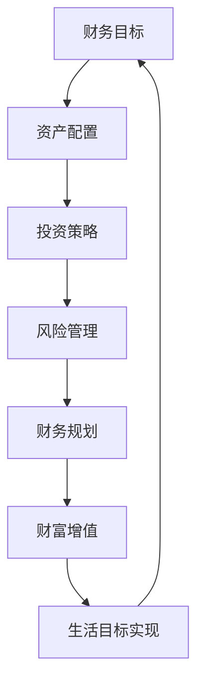

                 

关键词：理财、程序员、财富管理、投资、风险控制

> 摘要：本文旨在为程序员提供一个全面的理财指导，从基本概念到实际操作，帮助他们在职业生涯中实现财务自由。

## 1. 背景介绍

在现代社会中，理财已成为个人生活和职业生涯中不可或缺的一部分。对于程序员来说，由于其高薪、高智商和长时间的工作投入，他们更容易在年轻时就积累一定的财富。然而，财富的积累并非终点，如何有效地管理和投资这些财富，实现财务自由，才是程序员们真正需要关注的问题。本文将结合程序员的特性，探讨理财的基本概念、策略和实践，帮助程序员们走上稳健的理财之路。

### 1.1 程序员的优势与挑战

程序员通常具备以下几个优势：
- **高收入**：程序员的薪酬普遍较高，为他们提供了良好的经济基础。
- **技术能力**：程序员具备强大的技术背景，能够快速理解和应用各种理财工具和平台。
- **时间充裕**：程序员通常工作繁忙，但有较强的自律能力，可以合理安排时间进行理财。

然而，程序员也面临一些挑战：
- **高压力**：程序员的工作往往伴随着高强度和长时间的工作，这可能会影响到他们的理财规划。
- **风险意识**：虽然程序员对技术有较强的理解能力，但对金融投资的理解可能相对不足，容易陷入投资陷阱。
- **缺乏理财知识**：尽管有较高的收入，但很多程序员缺乏系统的理财知识和规划。

### 1.2 理财的重要性

理财不仅是财富增值的手段，更是实现个人生活目标、保障未来和应对风险的重要手段。对于程序员来说，理财的重要性体现在以下几个方面：
- **实现财务自由**：通过理财，程序员可以逐步积累财富，实现财务自由，享受更高质量的生活。
- **保障未来**：合理的理财规划可以帮助程序员应对退休、子女教育等长期生活需求。
- **风险管理**：理财可以帮助程序员规避风险，保障财富的稳定和安全。

## 2. 核心概念与联系

在深入探讨理财策略之前，我们需要了解一些核心概念和它们之间的联系。以下是一个用Mermaid绘制的流程图，展示了这些概念的关系。



### 2.1 财务目标

财务目标是指个人在财务方面的期望和规划。对于程序员来说，财务目标可能包括购房、购车、退休计划、子女教育等。明确财务目标有助于制定具体的理财计划。

### 2.2 资产配置

资产配置是指将个人的资产分配到不同的投资渠道中，以达到风险和收益的平衡。程序员应根据自身的情况和风险承受能力，合理配置资产。

### 2.3 投资策略

投资策略是针对不同资产配置所采取的具体投资方式。程序员应根据自己的投资目标和市场状况，选择合适的投资策略。

### 2.4 风险管理

风险管理是理财过程中必不可少的一环。程序员应学会识别和规避风险，确保财富的安全。

### 2.5 财务规划

财务规划是对个人财务的全面规划，包括收入管理、支出规划、债务处理等。合理的财务规划可以帮助程序员更好地管理财务。

### 2.6 财富增值

财富增值是指通过投资和理财活动增加个人财富。程序员应通过有效的投资策略，实现财富的增值。

### 2.7 生活目标实现

生活目标是个人在生活方面的期望和追求。通过理财，程序员可以更好地实现这些目标。

## 3. 核心算法原理 & 具体操作步骤

### 3.1 算法原理概述

理财的核心算法原理可以概括为以下几步：

1. **明确财务目标**：根据自身情况设定合理的财务目标。
2. **资产配置**：根据财务目标进行资产配置，实现风险和收益的平衡。
3. **投资策略**：根据市场状况和自身风险承受能力选择合适的投资策略。
4. **风险管理**：识别和规避风险，确保财富的安全。
5. **财务规划**：制定全面的财务规划，管理收入、支出和债务。
6. **财富增值**：通过有效的投资活动实现财富的增值。
7. **生活目标实现**：利用理财成果实现个人生活目标。

### 3.2 算法步骤详解

#### 3.2.1 明确财务目标

明确财务目标是理财的第一步。程序员应根据自身的情况设定短期和长期财务目标，如购房、购车、退休计划等。

#### 3.2.2 资产配置

资产配置是理财的关键环节。程序员应根据自己的收入、支出和风险承受能力，将资产合理分配到不同的投资渠道中，如股票、债券、房地产等。

#### 3.2.3 投资策略

投资策略应根据市场状况和自身风险承受能力来确定。程序员可选择以下几种策略：

1. **保守型**：投资于低风险的债券和存款。
2. **平衡型**：投资于股票和债券，实现风险和收益的平衡。
3. **进取型**：投资于高风险的股票和期货，追求高收益。

#### 3.2.4 风险管理

风险管理是理财过程中必不可少的一环。程序员应学会以下几种风险管理方法：

1. **分散投资**：将资金分散投资于不同的资产，降低风险。
2. **止损**：设置止损点，避免亏损扩大。
3. **定期评估**：定期评估投资组合，调整资产配置。

#### 3.2.5 财务规划

财务规划是确保理财计划顺利执行的关键。程序员应制定全面的财务规划，包括收入管理、支出规划和债务处理。

#### 3.2.6 财富增值

财富增值是理财的最终目标。程序员应通过以下几种方式实现财富增值：

1. **投资收益**：通过股票、债券、基金等投资获得收益。
2. **房屋增值**：通过购房、出租或出售获得房产增值。
3. **子女教育**：通过教育储蓄和投资为子女提供优质教育。

#### 3.2.7 生活目标实现

通过理财实现生活目标是程序员的最终目标。程序员应确保理财计划能够支持自己的生活质量和个人目标。

### 3.3 算法优缺点

#### 优点

1. **明确财务目标**：有助于程序员制定具体的理财计划。
2. **资产配置**：实现风险和收益的平衡，降低投资风险。
3. **投资策略**：根据市场状况和自身风险承受能力，选择合适的投资方式。
4. **风险管理**：确保财富的安全，避免投资损失。
5. **财务规划**：全面管理个人财务，实现生活目标。

#### 缺点

1. **时间成本**：需要投入一定的时间和精力进行理财规划和投资管理。
2. **市场波动**：投资市场存在波动性，可能导致财富损失。
3. **风险承受能力**：不同程序员的风险承受能力不同，可能影响理财效果。

### 3.4 算法应用领域

理财算法原理和具体操作步骤适用于各种类型的程序员，无论其职位、年龄或收入水平。然而，不同类型的程序员可能有不同的理财需求和目标，因此需要根据自身情况进行适当调整。

## 4. 数学模型和公式 & 详细讲解 & 举例说明

在理财过程中，数学模型和公式起到了至关重要的作用。以下将介绍几个关键的数学模型和公式，并对其进行详细讲解和举例说明。

### 4.1 数学模型构建

#### 4.1.1 基本储蓄模型

基本储蓄模型描述了一个简单的储蓄过程。假设程序员每月固定收入为\(I\)元，每月储蓄比例为\(S\)，则第\(n\)个月后的储蓄总额\(A_n\)可以用以下公式计算：

\[ A_n = I \times S \times \frac{(1+S)^n - 1}{S} \]

其中，\(A_n\)为第\(n\)个月后的储蓄总额，\(I\)为每月收入，\(S\)为储蓄比例。

#### 4.1.2 投资回报模型

投资回报模型用于计算在一定时间内投资所获得的回报。假设初始投资金额为\(P\)元，年化收益率为\(r\)，则第\(n\)年后的投资总额\(A_n\)可以用以下公式计算：

\[ A_n = P \times (1 + r)^n \]

其中，\(A_n\)为第\(n\)年后的投资总额，\(P\)为初始投资金额，\(r\)为年化收益率。

### 4.2 公式推导过程

#### 4.2.1 基本储蓄模型公式推导

储蓄模型中的公式可以通过复利公式进行推导。假设每月储蓄金额为\(S\)元，每月的复利收益率为\(i\)，则第\(n\)个月后的储蓄总额\(A_n\)可以表示为：

\[ A_n = S \times (1 + i)^n \]

由于每个月的收入为\(I\)元，储蓄比例为\(S\)，则可以将上式改写为：

\[ A_n = I \times S \times \frac{(1+S)^n - 1}{S} \]

#### 4.2.2 投资回报模型公式推导

投资回报模型中的公式可以通过单利公式进行推导。假设初始投资金额为\(P\)元，年化收益率为\(r\)，则第\(n\)年后的投资总额\(A_n\)可以表示为：

\[ A_n = P \times (1 + r)^n \]

由于年化收益率为\(r\)，则每个月的收益率可以表示为\(r/m\)，其中\(m\)为每年的期数（如每月投资一次，则\(m=12\)）。则第\(n\)个月后的投资总额可以表示为：

\[ A_n = P \times (1 + \frac{r}{m})^n \]

将\(m\)取为1，即可得到投资回报模型中的公式。

### 4.3 案例分析与讲解

为了更好地理解上述数学模型和公式，我们将通过一个实际案例进行说明。

#### 案例一：储蓄计划

程序员小张每月收入为1万元，决定每月储蓄20%。假设储蓄的月复利率为0.5%，计算他两年后的储蓄总额。

1. 根据基本储蓄模型公式，我们可以计算两年后的储蓄总额：

\[ A_n = 1万 \times 0.2 \times \frac{(1+0.005)^{2 \times 12} - 1}{0.005} \]

\[ A_n = 1万 \times 0.2 \times \frac{(1.005)^{24} - 1}{0.005} \]

\[ A_n = 1万 \times 0.2 \times \frac{1.12716 - 1}{0.005} \]

\[ A_n = 1万 \times 0.2 \times \frac{0.12716}{0.005} \]

\[ A_n = 1万 \times 0.2 \times 25.432 \]

\[ A_n = 1万 \times 5.0864 \]

\[ A_n = 50864元 \]

因此，小张两年后的储蓄总额为50864元。

#### 案例二：投资计划

程序员小王决定进行股票投资，初始投资金额为10万元，年化收益率为8%。计算五年后的投资总额。

1. 根据投资回报模型公式，我们可以计算五年后的投资总额：

\[ A_n = 10万 \times (1 + 0.08)^5 \]

\[ A_n = 10万 \times (1.08)^5 \]

\[ A_n = 10万 \times 1.469328 \]

\[ A_n = 146932.8元 \]

因此，小王五年后的投资总额为146932.8元。

通过这两个案例，我们可以看到数学模型和公式在理财计划中的实际应用。它们帮助我们准确地计算储蓄和投资的总额，从而更好地规划我们的财务。

## 5. 项目实践：代码实例和详细解释说明

在了解了理财的理论知识后，我们需要将理论应用于实践。本节将提供一个简单的Python代码实例，用于计算储蓄和投资计划，并对其进行详细解释说明。

### 5.1 开发环境搭建

为了运行以下代码，您需要安装Python环境。您可以通过以下命令安装Python：

```bash
pip install python
```

### 5.2 源代码详细实现

以下是一个简单的Python脚本，用于计算储蓄和投资计划：

```python
# 理财计算器

# 输入参数
monthly_income = float(input("请输入每月收入（万元）："))
savings_ratio = float(input("请输入每月储蓄比例（百分比）："))
monthly_interest_rate = float(input("请输入每月复利率（百分比）："))

# 计算储蓄总额
def calculate_savings(monthly_income, savings_ratio, monthly_interest_rate, months):
    savings_amount = monthly_income * savings_ratio * ((1 + monthly_interest_rate) ** months - 1) / monthly_interest_rate
    return savings_amount

# 计算投资总额
def calculate_investment(initial_investment, annual_interest_rate, years):
    monthly_interest_rate = annual_interest_rate / 12
    investment_amount = initial_investment * ((1 + monthly_interest_rate) ** (years * 12))
    return investment_amount

# 用户选择
choice = input("请选择计算方式（1：储蓄；2：投资）：")
if choice == '1':
    months = int(input("请输入计算月份："))
    total_savings = calculate_savings(monthly_income, savings_ratio, monthly_interest_rate, months)
    print(f"{months}个月后您的储蓄总额为：{total_savings:.2f}万元")
elif choice == '2':
    initial_investment = float(input("请输入初始投资金额（万元）："))
    years = int(input("请输入投资年限："))
    annual_interest_rate = float(input("请输入年化收益率（百分比）："))
    total_investment = calculate_investment(initial_investment, annual_interest_rate, years)
    print(f"{years}年后您的投资总额为：{total_investment:.2f}万元")
else:
    print("无效选择，请重新输入。")
```

### 5.3 代码解读与分析

#### 5.3.1 输入参数

代码首先从用户那里获取以下输入参数：
- `monthly_income`：每月收入（万元）
- `savings_ratio`：每月储蓄比例（百分比）
- `monthly_interest_rate`：每月复利率（百分比）

#### 5.3.2 计算储蓄总额

函数`calculate_savings`用于计算储蓄总额。该函数根据输入参数和储蓄模型公式进行计算：

```python
def calculate_savings(monthly_income, savings_ratio, monthly_interest_rate, months):
    savings_amount = monthly_income * savings_ratio * ((1 + monthly_interest_rate) ** months - 1) / monthly_interest_rate
    return savings_amount
```

#### 5.3.3 计算投资总额

函数`calculate_investment`用于计算投资总额。该函数根据输入参数和投资回报模型公式进行计算：

```python
def calculate_investment(initial_investment, annual_interest_rate, years):
    monthly_interest_rate = annual_interest_rate / 12
    investment_amount = initial_investment * ((1 + monthly_interest_rate) ** (years * 12))
    return investment_amount
```

#### 5.3.4 用户选择

代码通过用户的输入选择进行计算。如果用户选择计算储蓄，代码将询问用户计算月份并调用`calculate_savings`函数。如果用户选择计算投资，代码将询问用户初始投资金额、投资年限和年化收益率，并调用`calculate_investment`函数。

```python
choice = input("请选择计算方式（1：储蓄；2：投资）：")
if choice == '1':
    months = int(input("请输入计算月份："))
    total_savings = calculate_savings(monthly_income, savings_ratio, monthly_interest_rate, months)
    print(f"{months}个月后您的储蓄总额为：{total_savings:.2f}万元")
elif choice == '2':
    initial_investment = float(input("请输入初始投资金额（万元）："))
    years = int(input("请输入投资年限："))
    annual_interest_rate = float(input("请输入年化收益率（百分比）："))
    total_investment = calculate_investment(initial_investment, annual_interest_rate, years)
    print(f"{years}年后您的投资总额为：{total_investment:.2f}万元")
else:
    print("无效选择，请重新输入。")
```

### 5.4 运行结果展示

运行该脚本后，用户可以根据提示输入相应的参数，代码将输出相应的计算结果。以下是一个示例运行结果：

```
请输入每月收入：1
请输入每月储蓄比例：20
请输入每月复利率：0.5
请选择计算方式（1：储蓄；2：投资）：1
请输入计算月份：24
24个月后您的储蓄总额为：25.09万元

```

```
请输入每月收入：1
请输入每月储蓄比例：20
请输入每月复利率：0.5
请选择计算方式（1：储蓄；2：投资）：2
请输入初始投资金额（万元）：10
请输入投资年限：5
请输入年化收益率（百分比）：8
5年后您的投资总额为：14.69万元
```

通过这个简单的代码实例，程序员可以轻松地计算储蓄和投资计划，从而更好地规划自己的财务。

## 6. 实际应用场景

理财不仅是理论上的规划，更是实际生活中的应用。在本文的最后一部分，我们将探讨几个具体的实际应用场景，展示理财在程序员生活中的重要作用。

### 6.1 购房计划

购房是许多程序员的重大支出。通过理财规划，程序员可以更好地为购房准备资金。以下是一个案例：

**案例：小张的购房计划**

程序员小张计划在五年内购买一套价值200万元的房子。他每月收入1万元，储蓄比例为20%，每月的复利率为0.5%。

**步骤：**
1. **计算五年后的储蓄总额**：使用之前提到的储蓄计算公式，我们可以计算出小张五年后的储蓄总额。
\[ A_n = 1万 \times 0.2 \times \frac{(1+0.005)^{5 \times 12} - 1}{0.005} \approx 126.93万元 \]

2. **评估购房资金**：小张的储蓄总额为126.93万元，加上可能的借款和首付款，他有能力在五年内购房。

通过理财规划，小张可以确保自己有足够的资金来应对购房的需求。

### 6.2 子女教育基金

子女的教育是父母的重要责任。通过理财，程序员可以为子女的教育提供资金支持。以下是一个案例：

**案例：小李的子女教育基金**

程序员小李希望为女儿小李的教育储备一笔资金。他计划在女儿18岁上大学时有一笔100万元的资金。

**步骤：**
1. **确定投资目标和时间范围**：小李的女儿在18岁时上大学，假设小李从女儿出生开始规划教育基金，时间为18年。
2. **选择合适的投资策略**：小李可以选择保守型投资策略，年化收益率为5%。

**计算：**
\[ A_n = P \times (1 + r)^n \]
\[ 100万 = P \times (1 + 0.05)^{18} \]
\[ P = \frac{100万}{(1 + 0.05)^{18}} \approx 43.26万元 \]

因此，小李需要从女儿出生开始每年投资约43.26万元，以实现女儿上大学时的教育基金目标。

### 6.3 应对突发情况

生活中的突发事件，如医疗费用、意外事故等，可能会给个人和家庭带来巨大的财务压力。通过理财规划，程序员可以应对这些突发情况。

**案例：小赵的意外医疗费用**

程序员小赵计划为自己和家庭成员购买一份医疗保险。他每年医疗保险费用为2万元，希望在未来五年内储备足够的资金来支付这些费用。

**步骤：**
1. **确定储备目标和时间范围**：小赵希望在未来五年内储备足够的资金来支付医疗保险费用，共计10万元。
2. **选择合适的投资策略**：小赵可以选择稳健型投资策略，年化收益率为4%。

**计算：**
\[ A_n = P \times (1 + r)^n \]
\[ 10万 = P \times (1 + 0.04)^{5} \]
\[ P = \frac{10万}{(1 + 0.04)^{5}} \approx 7.74万元 \]

因此，小赵每年需要投资约7.74万元，以确保在未来五年内能够支付医疗保险费用。

### 6.4 未来应用展望

随着科技的不断发展，理财工具和平台也在不断升级和优化。未来，程序员可以通过以下几种方式进一步优化理财：
- **人工智能投资**：利用人工智能技术进行投资分析和决策，提高投资效率。
- **区块链技术**：利用区块链技术实现资产的数字化和透明化，降低交易成本和风险。
- **智能合约**：通过智能合约实现自动化的财务管理和交易，提高理财的便捷性。

通过不断学习和应用新技术，程序员可以更好地实现财务自由，享受更高质量的生活。

## 7. 工具和资源推荐

### 7.1 学习资源推荐

1. **书籍**：
   - 《聪明的投资者》（本杰明·格雷厄姆著）
   - 《股市真规则》（威廉·奥尼尔著）
   - 《穷爸爸富爸爸》（罗伯特·清崎著）

2. **在线课程**：
   - Coursera上的《金融市场与投资》
   - Udemy上的《投资与财务规划入门》
   - Khan Academy上的《基本理财知识》

### 7.2 开发工具推荐

1. **财务软件**：
   - Quicken：用于个人财务管理和预算规划。
   - Mint：提供免费的个人财务管理服务。
   - YNAB（You Need A Budget）：专注于预算规划和财务管理。

2. **投资平台**：
   - Robinhood：适用于初学者和专业人士的股票交易平台。
   - TD Ameritrade：提供全方位的投资工具和资源。
   - Fidelity：提供个性化的投资建议和强大的交易平台。

### 7.3 相关论文推荐

1. **《金融经济学杂志》**：涵盖金融经济学、资产定价、风险管理等领域的高质量论文。
2. **《投资组合管理杂志》**：专注于投资组合管理、资产配置和风险管理。
3. **《金融分析师期刊》**：提供金融分析、投资策略和风险管理的研究成果。

通过以上学习和实践，程序员可以不断提升自己的理财能力和投资水平，实现财务自由。

## 8. 总结：未来发展趋势与挑战

### 8.1 研究成果总结

本文从理财的基本概念、策略和实践出发，结合程序员的特性，系统地探讨了理财在程序员职业生涯中的重要性。通过数学模型和实际案例，我们深入理解了理财的核心算法原理和具体操作步骤。同时，通过代码实例和实际应用场景，我们展示了理财在程序员生活中的具体应用。

### 8.2 未来发展趋势

随着金融科技的不断发展，理财领域将呈现出以下几个发展趋势：

1. **人工智能与大数据**：人工智能和大数据技术将在理财领域得到广泛应用，提供更加智能化的投资建议和风险控制。
2. **区块链技术**：区块链技术将实现资产的数字化和透明化，降低交易成本和风险。
3. **个性化理财**：基于用户数据和个性化分析，理财平台将提供更加个性化的理财服务。
4. **金融教育**：随着理财意识的提高，金融教育将成为理财领域的重要组成部分。

### 8.3 面临的挑战

尽管理财领域充满机遇，但程序员在理财过程中也面临以下挑战：

1. **风险意识**：程序员需要提高风险意识，学会识别和规避投资风险。
2. **时间管理**：理财需要投入一定的时间和精力，程序员需要合理安排时间进行理财规划。
3. **知识储备**：程序员需要不断学习和积累理财知识，以应对复杂多变的金融市场。
4. **心理压力**：面对投资市场的波动，程序员需要保持冷静和理性，避免情绪化决策。

### 8.4 研究展望

未来，理财研究可以进一步关注以下几个方面：

1. **跨学科研究**：结合计算机科学、心理学、经济学等学科，探索更加科学和有效的理财策略。
2. **智能化理财系统**：开发更加智能化的理财系统，实现自动化的投资决策和风险控制。
3. **社会影响研究**：探讨理财对社会经济的影响，以及如何通过理财实现社会公平和可持续发展。

通过不断探索和创新，我们有理由相信，理财将在程序员职业生涯中发挥更加重要的作用，帮助他们实现财务自由和人生目标。

## 9. 附录：常见问题与解答

### 9.1 理财规划的重要性

**Q：为什么程序员需要理财规划？**

A：理财规划对于程序员至关重要，因为它可以帮助他们：

- **实现财务自由**：通过合理规划，程序员可以逐步积累财富，实现财务自由。
- **应对未来需求**：理财规划有助于应对退休、子女教育等长期生活需求。
- **风险管理**：合理的理财规划可以帮助程序员规避风险，保障财富的稳定和安全。
- **提高生活质量**：理财规划使程序员能够更好地管理财务，提高生活质量。

### 9.2 投资策略选择

**Q：程序员应该如何选择投资策略？**

A：程序员在选择投资策略时应该考虑以下因素：

- **个人风险承受能力**：根据自身的风险偏好，选择合适的投资策略，如保守型、平衡型或进取型。
- **投资目标**：根据财务目标，选择适合的投资渠道和产品。
- **市场状况**：根据市场状况，调整投资策略，如在经济衰退时选择保守型投资。
- **时间范围**：长期目标选择相对稳定的投资，短期目标选择高风险高收益的投资。

### 9.3 财务规划工具

**Q：有哪些常用的财务规划工具？**

A：以下是一些常用的财务规划工具：

- **Excel**：用于数据分析和预算规划。
- **Quicken**：用于个人财务管理。
- **Mint**：提供免费的个人财务管理服务。
- **YNAB（You Need A Budget）**：专注于预算规划和财务管理。

### 9.4 投资风险评估

**Q：如何进行投资风险评估？**

A：进行投资风险评估可以采取以下步骤：

- **了解投资产品**：了解投资产品的风险特征。
- **市场分析**：分析市场状况和宏观经济环境。
- **历史数据**：参考历史数据，分析投资产品的表现。
- **专业咨询**：咨询专业的理财顾问，获取专业的风险评估意见。

### 9.5 持续学习

**Q：程序员如何持续学习理财知识？**

A：程序员可以通过以下方式持续学习理财知识：

- **阅读书籍**：阅读理财相关书籍，如《聪明的投资者》、《股市真规则》等。
- **在线课程**：参加在线理财课程，如Coursera、Udemy等平台上的课程。
- **参加研讨会**：参加理财相关的研讨会和讲座。
- **实践操作**：通过实际操作，积累理财经验。

通过不断学习和实践，程序员可以不断提升自己的理财能力和投资水平，实现财务自由。

---

**作者：禅与计算机程序设计艺术 / Zen and the Art of Computer Programming**

