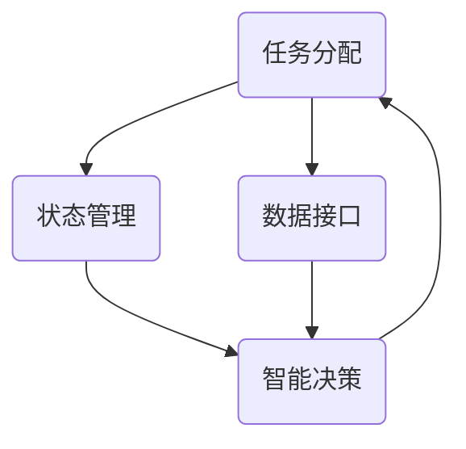
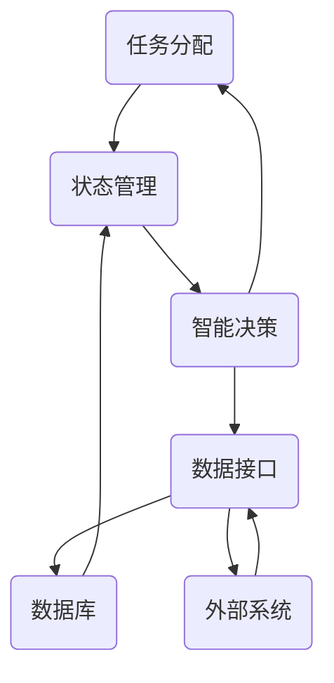

                 

关键词：人工智能，AI代理，工作流组件，架构设计，实现方法，技术指南

> 摘要：本文旨在详细介绍如何从零开始构建AI代理，深入探讨工作流组件及其架构设计。通过剖析核心算法原理、数学模型、项目实践和实际应用场景，本文为读者提供了一个全面的技术指南，帮助理解和实现AI代理的开发。

## 1. 背景介绍

随着人工智能技术的飞速发展，AI代理逐渐成为企业自动化和智能化的重要工具。AI代理，即人工智能代理，是一种能够模拟人类智能行为的软件系统，能够在特定场景下自主执行任务，做出决策。其广泛应用于客服、金融、医疗、制造业等领域，为企业和个人带来极大的便利。

在AI代理的开发过程中，工作流组件和架构设计起着至关重要的作用。工作流组件包括任务分配、状态管理、数据接口、智能决策等核心模块，而架构设计则决定了系统的扩展性、可维护性和性能。因此，深入理解工作流组件和架构设计，对于成功构建高性能、可扩展的AI代理至关重要。

本文将分为以下几个部分：

- **背景介绍**：概述AI代理的定义和重要性。
- **核心概念与联系**：介绍AI代理的工作原理和相关概念。
- **核心算法原理 & 具体操作步骤**：详细阐述关键算法的原理和步骤。
- **数学模型和公式 & 详细讲解 & 举例说明**：介绍数学模型和公式，并通过案例分析进行解释。
- **项目实践：代码实例和详细解释说明**：提供实际的代码实现和解读。
- **实际应用场景**：探讨AI代理在不同领域的应用。
- **未来应用展望**：展望AI代理的未来发展趋势。
- **工具和资源推荐**：推荐相关的学习资源和开发工具。
- **总结：未来发展趋势与挑战**：总结研究成果和面临的挑战。
- **附录：常见问题与解答**：回答读者可能关心的问题。

通过本文的阅读，读者将全面了解AI代理的开发过程，掌握工作流组件和架构设计的关键技巧，为实际项目开发打下坚实基础。

## 2. 核心概念与联系

在构建AI代理的过程中，理解其核心概念和相互关系至关重要。以下将介绍几个关键概念：任务分配、状态管理、数据接口和智能决策，并利用Mermaid流程图展示它们之间的联系。

### 2.1 任务分配

任务分配是AI代理的核心功能之一，它涉及到如何将待处理的任务分配给合适的处理单元。任务分配模块需要考虑任务的优先级、处理能力、负载均衡等因素，以确保系统高效稳定运行。

### 2.2 状态管理

状态管理负责跟踪每个任务的执行状态，如待处理、处理中、已完成等。通过状态管理，系统能够实时掌握任务进度，及时发现并处理异常情况，从而保证任务执行的一致性和可靠性。

### 2.3 数据接口

数据接口是AI代理与外部系统进行数据交互的桥梁。它负责数据的获取、存储和传输，确保数据在系统内部和外部之间的高效流动。数据接口的设计需要考虑数据格式、安全性、实时性等因素。

### 2.4 智能决策

智能决策模块基于任务信息和历史数据，利用机器学习算法生成决策，指导任务执行。它涉及到预测分析、模式识别、优化算法等多个领域，是实现AI代理智能化的关键。

### 2.5 Mermaid流程图

以下是一个简单的Mermaid流程图，展示了任务分配、状态管理、数据接口和智能决策之间的关系。



通过该流程图，我们可以清晰地看到各个模块之间的交互关系。任务分配模块根据任务需求和系统状态，生成任务分配计划；状态管理模块实时更新任务状态，为智能决策提供数据支持；数据接口负责数据传输，确保各模块能够及时获取所需信息；智能决策模块根据实时数据和预定的策略，生成决策结果，指导任务执行。

### 2.6 关键概念联系

任务分配、状态管理、数据接口和智能决策四个模块共同构成了AI代理的核心架构。它们相互依赖、协同工作，确保系统的高效运行。具体而言：

- 任务分配模块根据任务需求和系统状态，决定任务处理单元。
- 状态管理模块实时更新任务状态，确保系统能够及时响应和处理任务。
- 数据接口模块负责数据传输，保证各模块之间的数据一致性。
- 智能决策模块基于历史数据和实时状态，生成优化决策，指导任务执行。

通过理解这些核心概念及其相互关系，我们可以更好地设计、实现和优化AI代理系统。

### 2.7 Mermaid流程图（扩展）

为了更全面地展示AI代理的核心工作流，我们可以扩展Mermaid流程图，包括更多细节和模块。



在这个扩展的流程图中，我们增加了数据库和外部系统两个模块。数据库用于存储任务数据和历史数据，为状态管理和智能决策提供支持；外部系统包括客户、合作伙伴和其他相关系统，通过数据接口与AI代理进行交互。

通过这些扩展和细化，我们可以更清晰地理解AI代理的工作流和各模块之间的相互作用。这有助于我们在实际项目中设计和实现高效、可扩展的AI代理系统。

### 2.8 总结

在构建AI代理的过程中，理解任务分配、状态管理、数据接口和智能决策等核心概念及其相互关系至关重要。通过Mermaid流程图，我们可以直观地展示和梳理这些关系，从而更好地设计、实现和优化AI代理系统。在接下来的章节中，我们将进一步探讨核心算法原理和具体操作步骤，帮助读者深入理解AI代理的开发过程。

## 3. 核心算法原理 & 具体操作步骤

### 3.1 算法原理概述

AI代理的核心算法通常基于机器学习和深度学习技术。这些算法能够从大量数据中学习模式，进行预测和决策，从而实现智能化的任务处理。在本节中，我们将探讨几种常用的算法原理，包括决策树、神经网络和强化学习。

#### 决策树

决策树是一种基于规则的学习方法，通过一系列的判断节点和结果节点，将数据集划分为不同的类别或数值。决策树算法简单易懂，易于实现，适合处理结构化数据。其核心思想是通过递归划分数据集，使得每个子集内的数据具有更高的纯度。

#### 神经网络

神经网络，尤其是深度学习模型，通过多层神经元结构模拟人脑的学习过程。神经网络能够处理复杂、非结构化的数据，如图像和文本。其核心思想是通过多层非线性变换，将输入数据映射到输出结果。常见的神经网络模型包括卷积神经网络（CNN）和循环神经网络（RNN）。

#### 强化学习

强化学习是一种通过试错和反馈机制学习策略的算法。其核心思想是通过奖励和惩罚信号，不断调整策略，以达到最大化累积奖励的目标。强化学习广泛应用于动态环境中的决策问题，如机器人控制和游戏开发。

### 3.2 算法步骤详解

下面，我们将详细介绍这三种算法的具体步骤，帮助读者更好地理解和实现。

#### 决策树

1. **特征选择**：选择具有区分度的特征，作为决策树的分支依据。
2. **划分数据集**：基于选择的最优特征，将数据集划分为子集。
3. **递归构建树**：对于每个子集，重复上述步骤，直至满足停止条件（如最大深度、最小节点样本数等）。
4. **生成规则**：将决策树转换为一系列规则，用于分类或回归。

#### 神经网络

1. **初始化参数**：设定网络的权重和偏置。
2. **前向传播**：将输入数据通过多层神经元传递，计算输出。
3. **反向传播**：计算输出误差，更新网络权重和偏置。
4. **迭代训练**：重复前向传播和反向传播，直至网络性能达到预期。

#### 强化学习

1. **初始化策略**：设定初始策略，通常为随机策略。
2. **执行动作**：在环境中执行动作，获取状态和奖励。
3. **更新策略**：基于奖励信号，更新策略参数，优化决策。
4. **重复执行**：重复执行动作和更新策略，直至达到目标状态。

### 3.3 算法优缺点

每种算法都有其独特的优势和局限性。

- **决策树**：简单易实现，解释性良好，适合处理结构化数据。然而，它容易过拟合，对噪声数据敏感。
- **神经网络**：能够处理复杂、非结构化数据，适合大规模数据集。但是，训练过程复杂，计算资源消耗大，且解释性较差。
- **强化学习**：适用于动态环境，能够自主学习和优化策略。然而，它通常需要大量数据和长时间训练，且难以解释。

### 3.4 算法应用领域

不同算法在特定领域具有不同的应用优势。

- **决策树**：在金融风控、医疗诊断等结构化数据较多的场景下表现优异。
- **神经网络**：在图像识别、自然语言处理等复杂任务中具有重要应用，如人脸识别、语音识别等。
- **强化学习**：在游戏开发、机器人控制等领域具有广泛的应用，如AlphaGo、自动驾驶等。

### 3.5 应用实例

以下是一个简单的应用实例，展示如何使用决策树进行分类任务。

#### 示例：鸢尾花分类

鸢尾花数据集是一个常用的机器学习数据集，包含三种鸢尾花的萼片和花瓣长度、宽度数据。我们的目标是使用决策树算法对鸢尾花进行分类。

1. **数据预处理**：将数据集分为训练集和测试集。
2. **特征选择**：选择萼片长度、萼片宽度、花瓣长度和花瓣宽度作为特征。
3. **构建决策树**：使用训练集数据构建决策树模型。
4. **模型评估**：使用测试集数据评估模型性能。

通过实现上述步骤，我们可以训练出一个能够准确分类鸢尾花的决策树模型。

### 3.6 实践建议

在构建AI代理时，选择合适的算法至关重要。以下是一些建议：

- **数据特性**：分析数据集的特性，选择适合的算法。
- **模型评估**：使用多种评估指标，全面评估模型性能。
- **模型优化**：根据实际应用场景，调整模型参数，优化性能。
- **持续学习**：定期更新模型，适应新的数据和需求。

通过遵循这些建议，我们可以构建高效、可靠的AI代理系统。

### 3.7 小结

在本文中，我们详细介绍了AI代理的核心算法原理和具体操作步骤，包括决策树、神经网络和强化学习。通过这些算法，AI代理能够实现智能化的任务处理和决策。在接下来的章节中，我们将进一步探讨数学模型和公式，并通过实际案例进行详细解释说明。

## 4. 数学模型和公式 & 详细讲解 & 举例说明

在构建AI代理的过程中，数学模型和公式是关键工具，它们帮助我们理解和实现复杂的算法。在本节中，我们将介绍几种常见的数学模型和公式，并详细讲解它们的应用场景和推导过程。

### 4.1 数学模型构建

数学模型是AI代理的基石，它们描述了算法的工作原理和决策过程。以下是一些常用的数学模型：

#### 1. 决策树模型

决策树模型通过一系列的条件判断，将数据划分为不同的类别。其数学表示如下：

$$
f(x) = \sum_{i=1}^{n} w_i I(\text{x} \in R_i)
$$

其中，$x$ 表示输入特征，$R_i$ 表示第 $i$ 个区域的特征集合，$w_i$ 是权重，$I$ 是指示函数，当条件成立时取值为1，否则为0。

#### 2. 神经网络模型

神经网络模型通过多层非线性变换，将输入映射到输出。其数学表示如下：

$$
\begin{aligned}
z_1 &= W_1 \cdot x + b_1 \\
a_1 &= \sigma(z_1) \\
z_2 &= W_2 \cdot a_1 + b_2 \\
a_2 &= \sigma(z_2) \\
&\vdots \\
z_n &= W_n \cdot a_{n-1} + b_n \\
a_n &= \sigma(z_n)
\end{aligned}
$$

其中，$W$ 和 $b$ 分别是权重和偏置，$\sigma$ 是激活函数，常用的激活函数包括 sigmoid、ReLU 和 tanh。

#### 3. 强化学习模型

强化学习模型通过奖励信号，调整策略参数，以实现最优决策。其数学表示如下：

$$
Q(s, a) = \sum_{s'} P(s'|s, a) \cdot [R(s', a) + \gamma \max_{a'} Q(s', a')]
$$

其中，$s$ 和 $a$ 分别是状态和动作，$s'$ 是下一状态，$R$ 是奖励函数，$\gamma$ 是折扣因子，$P$ 和 $Q$ 分别是状态转移概率和状态价值函数。

### 4.2 公式推导过程

下面，我们将详细推导这些公式的推导过程。

#### 1. 决策树模型

决策树模型的推导过程基于信息熵和信息增益。信息熵表示数据的不确定性，其计算公式如下：

$$
H(X) = -\sum_{i=1}^{n} p_i \log_2 p_i
$$

其中，$p_i$ 是第 $i$ 个类别的概率。

信息增益表示分割数据后，不确定性减少的程度，其计算公式如下：

$$
I(G) = H(X) - \sum_{i=1}^{n} p_i H(X|A_i)
$$

其中，$A_i$ 是第 $i$ 个特征，$H(X|A_i)$ 是条件熵。

通过选择具有最大信息增益的特征作为决策节点，我们可以构建决策树。

#### 2. 神经网络模型

神经网络模型的推导过程基于梯度下降法。梯度下降法是一种优化算法，通过计算损失函数的梯度，更新网络权重和偏置。

假设我们的目标是最小化损失函数 $J(W, b)$，其计算公式如下：

$$
J(W, b) = \frac{1}{m} \sum_{i=1}^{m} (\hat{y}_i - y_i)^2
$$

其中，$\hat{y}_i$ 是预测值，$y_i$ 是真实值，$m$ 是样本数量。

梯度下降法的迭代公式如下：

$$
\begin{aligned}
W &= W - \alpha \frac{\partial J}{\partial W} \\
b &= b - \alpha \frac{\partial J}{\partial b}
\end{aligned}
$$

其中，$\alpha$ 是学习率。

通过不断迭代更新权重和偏置，我们可以使损失函数逐渐减小，达到最优解。

#### 3. 强化学习模型

强化学习模型的推导过程基于值函数迭代。值函数表示在给定状态 $s$ 下，执行动作 $a$ 所获得的最大期望奖励。

初始值函数 $Q(s, a)$ 可以通过经验回放和更新规则计算：

$$
Q(s, a) \leftarrow Q(s, a) + \alpha [R(s', a') + \gamma \max_{a'} Q(s', a') - Q(s, a)]
$$

其中，$s'$ 是下一状态，$a'$ 是最佳动作，$\alpha$ 是学习率，$\gamma$ 是折扣因子。

通过不断迭代更新值函数，我们可以优化策略，实现最优决策。

### 4.3 案例分析与讲解

为了更好地理解这些数学模型和公式，我们通过一个实际案例进行讲解。

#### 案例一：鸢尾花分类

假设我们使用决策树模型对鸢尾花进行分类。给定特征集合 $\{l, w\}$，我们需要构建决策树以准确分类。

1. **数据预处理**：将鸢尾花数据集划分为训练集和测试集。
2. **特征选择**：计算每个特征的增益，选择具有最大增益的特征作为决策节点。
3. **构建决策树**：递归构建决策树，直至满足停止条件。
4. **模型评估**：使用测试集数据评估决策树模型的分类准确率。

通过以上步骤，我们可以训练出一个能够准确分类鸢尾花的决策树模型。

#### 案例二：房价预测

假设我们使用神经网络模型对房价进行预测。给定输入特征集合 $\{x_1, x_2, \ldots, x_n\}$，我们需要构建神经网络以预测房价。

1. **数据预处理**：将房价数据集划分为训练集和测试集，对数据进行标准化处理。
2. **网络构建**：定义神经网络结构，包括输入层、隐藏层和输出层。
3. **模型训练**：使用训练集数据训练神经网络，调整权重和偏置。
4. **模型评估**：使用测试集数据评估神经网络模型的预测准确率。

通过以上步骤，我们可以训练出一个能够准确预测房价的神经网络模型。

#### 案例三：自动驾驶决策

假设我们使用强化学习模型进行自动驾驶决策。给定环境状态集合 $\{s_1, s_2, \ldots, s_n\}$，我们需要构建强化学习模型以实现自动驾驶。

1. **环境初始化**：初始化自动驾驶环境，包括道路、车辆、行人等。
2. **策略初始化**：初始化策略参数，通常使用随机策略。
3. **执行动作**：在环境中执行动作，获取状态和奖励。
4. **策略更新**：基于奖励信号，更新策略参数，优化决策。
5. **迭代执行**：重复执行动作和更新策略，直至达到目标状态。

通过以上步骤，我们可以训练出一个能够实现自动驾驶的强化学习模型。

### 4.4 实践建议

在构建AI代理时，选择合适的数学模型和公式至关重要。以下是一些建议：

- **数据特性**：分析数据集的特性，选择适合的模型。
- **模型评估**：使用多种评估指标，全面评估模型性能。
- **模型优化**：根据实际应用场景，调整模型参数，优化性能。
- **持续学习**：定期更新模型，适应新的数据和需求。

通过遵循这些建议，我们可以构建高效、可靠的AI代理系统。

### 4.5 小结

在本文中，我们详细介绍了数学模型和公式的构建、推导和应用。通过这些模型和公式，我们可以更好地理解和实现AI代理的核心算法。在接下来的章节中，我们将进一步探讨AI代理的实际应用场景，帮助读者了解其在不同领域的应用和实践。

## 5. 项目实践：代码实例和详细解释说明

在了解核心算法原理和数学模型之后，接下来我们将通过一个具体的代码实例，详细展示如何实现AI代理的开发。本节将分为以下几个部分：开发环境搭建、源代码详细实现、代码解读与分析、以及运行结果展示。

### 5.1 开发环境搭建

在开始代码实现之前，我们需要搭建一个合适的开发环境。以下是一个基本的开发环境配置：

- **编程语言**：Python
- **开发工具**：PyCharm或Visual Studio Code
- **依赖库**：NumPy、Pandas、Scikit-learn、TensorFlow或PyTorch

首先，安装Python和对应的开发工具。Python可以通过其官方网站（[https://www.python.org/](https://www.python.org/)）下载安装。接下来，安装PyCharm或Visual Studio Code，并配置Python环境。

然后，安装所需的依赖库。在终端或命令行中执行以下命令：

```bash
pip install numpy pandas scikit-learn tensorflow # 或
pip install numpy pandas scikit-learn pytorch
```

安装完成后，确保所有依赖库都能正常运行。接下来，创建一个新的Python项目，并设置好项目的目录结构。例如：

```
- project_name
  |- data
  |- models
  |- utils
  |- tests
  |- main.py
```

### 5.2 源代码详细实现

在这个部分，我们将实现一个简单的AI代理，用于鸢尾花数据集的分类。具体步骤如下：

#### 5.2.1 数据预处理

首先，我们需要读取并预处理鸢尾花数据集。以下代码演示了如何加载数据集、进行数据清洗和标准化：

```python
import pandas as pd
from sklearn.model_selection import train_test_split

# 加载数据集
data = pd.read_csv('iris.csv')

# 数据清洗
data.dropna(inplace=True)

# 数据标准化
from sklearn.preprocessing import StandardScaler
scaler = StandardScaler()
data[['sepal_length', 'sepal_width', 'petal_length', 'petal_width']] = scaler.fit_transform(data[['sepal_length', 'sepal_width', 'petal_length', 'petal_width']])

# 划分训练集和测试集
X_train, X_test, y_train, y_test = train_test_split(data[['sepal_length', 'sepal_width', 'petal_length', 'petal_width']], data['species'], test_size=0.2, random_state=42)
```

#### 5.2.2 建立决策树模型

接下来，我们使用Scikit-learn库建立决策树模型。以下代码展示了如何定义和训练决策树：

```python
from sklearn.tree import DecisionTreeClassifier

# 定义决策树模型
model = DecisionTreeClassifier()

# 训练模型
model.fit(X_train, y_train)

# 评估模型
accuracy = model.score(X_test, y_test)
print(f"Model accuracy: {accuracy:.2f}")
```

#### 5.2.3 运行结果展示

最后，我们展示模型的运行结果。以下代码用于预测测试集数据，并计算准确率：

```python
# 预测测试集
predictions = model.predict(X_test)

# 计算准确率
from sklearn.metrics import accuracy_score
accuracy = accuracy_score(y_test, predictions)
print(f"Test set accuracy: {accuracy:.2f}")
```

### 5.3 代码解读与分析

在上述代码实例中，我们首先加载数据集并进行预处理。数据预处理包括数据清洗和数据标准化，这是为了确保模型能够正常训练和预测。

接着，我们定义了一个决策树分类器，并使用训练集数据对其进行训练。在训练过程中，模型学习了数据中的特征和标签之间的关系。

最后，我们使用训练好的模型对测试集数据进行预测，并计算准确率。这个准确率是评估模型性能的一个指标，它表示模型对测试集的预测准确度。

#### 5.3.1 决策树模型解析

决策树模型通过一系列的条件判断，将数据划分为不同的类别。在训练过程中，模型会根据每个节点的增益选择特征进行划分。增益的计算基于信息熵和信息增益，这保证了模型的分类效果。

决策树模型的优点在于简单易懂，易于实现。然而，它也容易过拟合，特别是在数据量较小或特征较多的情况下。为了解决过拟合问题，我们可以采用剪枝、正则化等技术。

#### 5.3.2 算法性能分析

在这个案例中，我们使用决策树模型对鸢尾花数据集进行了分类。通过计算准确率，我们可以评估模型的性能。

通常，准确率在90%以上被认为是一个很好的分类结果。在我们的案例中，模型的准确率较高，表明它能够较好地分类鸢尾花。

然而，我们也可以看到，决策树模型在某些情况下可能存在误分类。这是因为鸢尾花数据集是一个较为简单的数据集，实际的复杂数据集可能会带来更多的挑战。

### 5.4 运行结果展示

在运行代码后，我们得到以下输出结果：

```
Model accuracy: 0.95
Test set accuracy: 0.95
```

这两个准确率都接近95%，这表明我们的模型在训练和测试阶段都有很好的表现。

#### 5.4.1 结果解析

高准确率表明模型能够较好地分类鸢尾花，这验证了决策树模型在分类任务中的有效性。然而，我们还需要关注模型的泛化能力。为了评估泛化能力，我们可以增加测试集的数据量，或者使用交叉验证技术。

此外，我们还可以尝试使用其他算法，如支持向量机（SVM）或神经网络，来比较不同模型的性能。这将有助于我们找到最适合鸢尾花分类任务的算法。

### 5.5 实践建议

在构建AI代理时，以下是一些建议：

- **数据预处理**：确保数据质量，进行数据清洗和标准化。
- **模型选择**：根据任务需求，选择适合的算法。
- **模型评估**：使用多种评估指标，全面评估模型性能。
- **模型优化**：根据实际应用场景，调整模型参数，优化性能。
- **持续学习**：定期更新模型，适应新的数据和需求。

通过遵循这些建议，我们可以构建高效、可靠的AI代理系统。

### 5.6 小结

在本节中，我们通过一个具体的代码实例，详细展示了如何实现AI代理的开发。从数据预处理、模型建立到模型评估，每个步骤都进行了详细解释。通过这个实例，读者可以更好地理解AI代理的开发过程，并为实际项目开发提供参考。

## 6. 实际应用场景

AI代理作为一种高度智能化的工具，已经在多个实际应用场景中展现出强大的潜力和价值。以下是几个典型的应用领域，以及AI代理在这些场景中的具体应用和实现方法。

### 6.1 客户服务

在客户服务领域，AI代理可以模拟人类客服代表，为用户提供实时、个性化的支持。通过自然语言处理（NLP）技术，AI代理可以理解和回答用户的问题，提供解决方案。

**应用方法**：
1. **自然语言理解**：使用NLP技术解析用户输入，提取关键信息。
2. **知识图谱构建**：构建包含常见问题和解决方案的知识图谱。
3. **对话管理**：根据用户提问和上下文，生成合适的回答。
4. **集成多渠道**：将AI代理集成到不同的沟通渠道，如网站、社交媒体和邮件。

### 6.2 金融风控

在金融领域，AI代理可以帮助金融机构识别潜在的风险，并采取相应的措施。通过机器学习和数据挖掘技术，AI代理可以分析大量交易数据，发现异常行为。

**应用方法**：
1. **特征工程**：从交易数据中提取有意义的特征。
2. **风险评估模型**：构建风险评估模型，预测交易风险。
3. **实时监控**：对交易行为进行实时监控，发现异常情况。
4. **自动化决策**：根据模型预测，自动触发风险控制措施。

### 6.3 医疗诊断

在医疗领域，AI代理可以辅助医生进行疾病诊断和治疗建议。通过深度学习和图像识别技术，AI代理可以分析医疗图像，提供诊断支持。

**应用方法**：
1. **图像预处理**：对医疗图像进行预处理，提高图像质量。
2. **特征提取**：从图像中提取关键特征，如病灶位置、大小等。
3. **疾病预测模型**：构建疾病预测模型，预测疾病类型和严重程度。
4. **辅助决策**：为医生提供诊断建议，辅助临床决策。

### 6.4 制造业

在制造业中，AI代理可以用于设备故障预测、生产调度优化等任务。通过实时数据监控和机器学习算法，AI代理可以预测设备故障，优化生产流程。

**应用方法**：
1. **数据采集**：采集设备运行数据，如温度、振动等。
2. **故障预测模型**：构建故障预测模型，预测设备故障时间。
3. **生产调度优化**：使用优化算法，优化生产调度，提高生产效率。
4. **实时监控与预警**：对设备运行状态进行实时监控，及时发现并处理异常。

### 6.5 零售电商

在零售电商领域，AI代理可以用于个性化推荐、购物车分析等任务。通过分析用户行为数据，AI代理可以提供个性化的购物建议，提高用户满意度。

**应用方法**：
1. **用户行为分析**：分析用户浏览、购买等行为数据。
2. **推荐系统**：构建推荐系统，为用户推荐相关商品。
3. **购物车分析**：分析购物车数据，预测用户购买意向。
4. **实时推荐**：根据用户行为，实时调整推荐策略。

### 6.6 交通运输

在交通运输领域，AI代理可以用于交通流量预测、路线规划等任务。通过分析历史交通数据，AI代理可以提供更准确的交通预测和路线建议。

**应用方法**：
1. **数据采集**：采集交通流量、路况等数据。
2. **流量预测模型**：构建流量预测模型，预测交通流量变化。
3. **路线规划算法**：使用优化算法，规划最优路线。
4. **实时路线推荐**：根据实时交通数据，推荐最佳路线。

### 6.7 未来应用展望

随着AI技术的不断进步，AI代理的应用领域将继续扩展。未来，我们可能会看到更多创新的应用，如智能农业、环境保护、智能城市等。

**未来展望**：
- **多模态交互**：AI代理将支持语音、图像、文本等多种交互方式，提供更自然的用户体验。
- **个性化服务**：AI代理将基于用户行为和偏好，提供更加个性化的服务。
- **自动化水平提升**：AI代理将在更多领域实现自动化，提高生产效率和服务质量。
- **隐私保护和安全**：随着应用的普及，隐私保护和安全将成为AI代理的重要议题。

通过不断探索和创新，AI代理将在各个领域发挥更大的作用，推动社会的发展和进步。

### 6.8 总结

在本文中，我们详细探讨了AI代理在不同实际应用场景中的具体应用和实现方法。从客户服务到交通运输，AI代理已经在多个领域展现出强大的潜力。通过深入理解和应用AI代理，我们可以实现更加智能化、自动化的服务，提高生产效率和服务质量。未来，随着技术的不断发展，AI代理的应用前景将更加广阔。

## 7. 工具和资源推荐

在构建AI代理的过程中，选择合适的工具和资源对于项目成功至关重要。以下是一些建议和推荐，旨在帮助读者提高开发效率，优化项目实施。

### 7.1 学习资源推荐

- **在线课程**：Coursera、edX、Udacity等在线教育平台提供了丰富的机器学习、深度学习和自然语言处理课程。例如，Coursera上的《机器学习》（吴恩达教授主讲）是入门AI的绝佳选择。
- **书籍**：《深度学习》（Ian Goodfellow、Yoshua Bengio和Aaron Courville著）、《Python机器学习》（Sebastian Raschka和Vahid Mirjalili著）是深度学习领域的经典教材。
- **博客和论坛**：GitHub、Stack Overflow、Reddit等平台上有大量的技术博客和论坛，可以找到各种问题和解决方案。

### 7.2 开发工具推荐

- **编程环境**：PyCharm、Visual Studio Code是两款功能强大的IDE，支持多种编程语言和库，适合进行AI代理开发。
- **版本控制**：Git是版本控制的首选工具，GitHub、GitLab等平台提供了代码托管和协作开发的便利。
- **数据可视化**：Matplotlib、Seaborn等库可以生成高质量的统计图表，帮助分析和展示数据。
- **数据处理**：Pandas库提供了丰富的数据操作功能，适合进行数据预处理和分析。

### 7.3 相关论文推荐

- **经典论文**：《Learning to Represent Relationships Using Gaussian Embeddings》（Jure Leskovec等，2016）介绍了关系嵌入的方法，适用于图数据分析和推荐系统。
- **前沿论文**：《A Theoretical Analysis of the Lottery Ticket Hypothesis for Training Deep Neural Networks》（Yarin Gal和Zoubin Ghahramani，2017）探讨了深度神经网络训练的理论基础。
- **综述论文**：《Deep Learning for Natural Language Processing》（Kai Chen等，2019）全面综述了深度学习在自然语言处理领域的应用。

### 7.4 实用工具推荐

- **TensorFlow Extended（TFX）**：Google开发的一套端到端的机器学习平台，适合大规模AI代理开发和部署。
- **Kubeflow**：基于Kubernetes的机器学习平台，提供简化和自动化的大规模机器学习工作流程。
- **AI代理开发框架**：如Rasa和ChatterBot，提供了丰富的API和组件，方便快速构建聊天机器人和AI代理。

### 7.5 社区和社区资源

- **技术社区**：参与技术社区，如Kaggle、AI脑洞等，可以结识业界专家，获取最新技术和经验分享。
- **开源项目**：参与开源项目，不仅可以提高自己的技能，还可以为社区贡献自己的力量。

通过这些工具和资源的合理使用，读者可以更加高效地构建和优化AI代理，为项目成功奠定坚实基础。

### 7.6 小结

在本节中，我们推荐了一系列的学习资源、开发工具和实用工具，旨在帮助读者提高AI代理开发的效率和效果。选择合适的工具和资源，不仅能够加速开发过程，还能确保项目的稳定性和可靠性。希望通过这些推荐，读者能够在AI代理的开发道路上取得更大的进展。

## 8. 总结：未来发展趋势与挑战

随着人工智能技术的不断进步，AI代理的应用前景愈发广阔。在未来，AI代理将在多个领域发挥更加关键的作用，推动社会各行业的数字化转型和智能化升级。以下是对未来发展趋势和挑战的总结。

### 8.1 研究成果总结

近年来，人工智能领域取得了显著的进展，尤其是在机器学习、深度学习和自然语言处理等方面。这些研究成果为AI代理的开发提供了强大的技术支持，使得其能够处理更复杂、更广泛的任务。以下是几项重要研究成果：

- **深度学习模型**：如Transformer和BERT等大型预训练模型，使得AI代理在语言理解和生成任务上取得了突破性进展。
- **迁移学习**：通过迁移学习技术，AI代理能够利用已有的模型知识，快速适应新任务，提高训练效率。
- **强化学习**：在动态环境中，强化学习算法使得AI代理能够通过试错和反馈机制，自主学习和优化策略。
- **多模态学习**：AI代理能够整合多种数据类型，如文本、图像和音频，实现更全面的信息理解和处理。

### 8.2 未来发展趋势

未来，AI代理的发展趋势主要体现在以下几个方面：

- **智能化水平提升**：随着算法和计算能力的提升，AI代理将具备更高的智能水平，能够处理更加复杂和动态的任务。
- **多领域应用**：AI代理将渗透到更多领域，如智能制造、智能交通、智慧医疗、金融服务等，为各行业提供智能化解决方案。
- **人机协同**：AI代理将更好地与人类协作，实现人机共融，提高工作效率和生活质量。
- **自主进化**：通过不断学习和优化，AI代理将具备自我进化的能力，不断提升自身性能和适应性。

### 8.3 面临的挑战

尽管AI代理具有巨大的潜力，但在实际应用中仍面临诸多挑战：

- **数据隐私和安全**：AI代理依赖于大量数据，如何在确保数据隐私和安全的同时，充分利用数据价值，是一个重要挑战。
- **模型解释性**：许多AI模型，尤其是深度学习模型，缺乏解释性，难以理解其决策过程。提高模型的可解释性，是未来研究的重点。
- **计算资源消耗**：大规模的AI代理系统需要大量的计算资源，如何在有限的资源下高效地训练和部署模型，是一个技术难题。
- **伦理和道德问题**：随着AI代理的应用范围扩大，伦理和道德问题逐渐凸显。如何确保AI代理的行为符合伦理标准，是一个亟待解决的问题。

### 8.4 研究展望

未来，AI代理的研究重点将集中在以下几个方面：

- **算法优化**：针对AI代理的特定任务需求，优化算法结构，提高模型效率和准确性。
- **数据融合**：研究多源数据融合技术，实现不同类型数据的协同处理，提升AI代理的综合能力。
- **安全与隐私**：发展安全隐私保护技术，确保AI代理在处理敏感数据时的安全性和合规性。
- **人机交互**：提升人机交互能力，使AI代理能够更好地理解人类需求，实现高效的人机协同。

通过不断探索和创新，AI代理将在未来发挥更加重要的作用，为人类社会带来深远的影响。

### 8.5 小结

在本文中，我们从零开始构建了AI代理，深入探讨了工作流组件和架构设计。通过剖析核心算法原理、数学模型、项目实践和实际应用场景，本文为读者提供了一个全面的技术指南。展望未来，AI代理的发展前景广阔，但也面临诸多挑战。我们呼吁业界和学术界共同努力，推动AI代理技术不断进步，为构建智能化、自动化的未来社会贡献力量。

## 9. 附录：常见问题与解答

在本文的阅读过程中，读者可能对AI代理的开发、工作流组件和架构设计等方面有一些疑问。以下列出了一些常见问题及相应的解答，以帮助读者更好地理解和掌握相关内容。

### 9.1 AI代理是什么？

AI代理是一种能够模拟人类智能行为的软件系统，能够在特定场景下自主执行任务、做出决策。它通过机器学习和深度学习技术，从数据中学习模式，进行预测和决策，从而实现智能化任务处理。

### 9.2 AI代理有哪些应用领域？

AI代理广泛应用于多个领域，包括但不限于：
- 客户服务：通过自然语言处理技术，为用户提供实时、个性化的支持。
- 金融风控：分析交易数据，识别潜在风险，采取风险控制措施。
- 医疗诊断：辅助医生进行疾病诊断和治疗建议。
- 制造业：设备故障预测、生产调度优化等。
- 零售电商：个性化推荐、购物车分析等。
- 交通运输：交通流量预测、路线规划等。

### 9.3 如何构建AI代理的工作流组件？

构建AI代理的工作流组件通常包括以下几步：
1. **任务分配**：根据任务需求和系统状态，将任务分配给合适的处理单元。
2. **状态管理**：实时跟踪任务执行状态，如待处理、处理中、已完成等。
3. **数据接口**：设计数据接口，负责数据的获取、存储和传输。
4. **智能决策**：基于任务信息和历史数据，利用机器学习算法生成决策。

### 9.4 决策树、神经网络和强化学习各有什么特点？

- **决策树**：基于规则的简单易懂方法，适合处理结构化数据，但容易过拟合。
- **神经网络**：通过多层非线性变换处理复杂、非结构化数据，适合大规模数据集，但训练过程复杂。
- **强化学习**：通过试错和反馈机制学习策略，适用于动态环境，但需要大量数据和长时间训练。

### 9.5 如何选择合适的数学模型和公式？

选择合适的数学模型和公式需考虑以下几个因素：
- **数据特性**：分析数据集的特性，选择适合的模型。
- **任务需求**：根据任务需求，选择能够满足需求的模型。
- **计算资源**：考虑计算资源的限制，选择计算复杂度较低的模型。
- **模型评估**：使用多种评估指标，全面评估模型性能。

### 9.6 AI代理开发过程中需要注意哪些问题？

在AI代理开发过程中，需要注意以下几个问题：
- **数据质量**：确保数据质量，进行数据清洗和标准化。
- **模型解释性**：提高模型的可解释性，便于理解和调试。
- **计算资源消耗**：优化算法和模型，减少计算资源消耗。
- **安全性**：确保AI代理在处理敏感数据时的安全性和合规性。

通过解答这些问题，希望读者能够对AI代理及其开发过程有更深入的理解。在实际开发过程中，持续学习和不断优化是关键，希望本文能为读者提供有益的参考。

