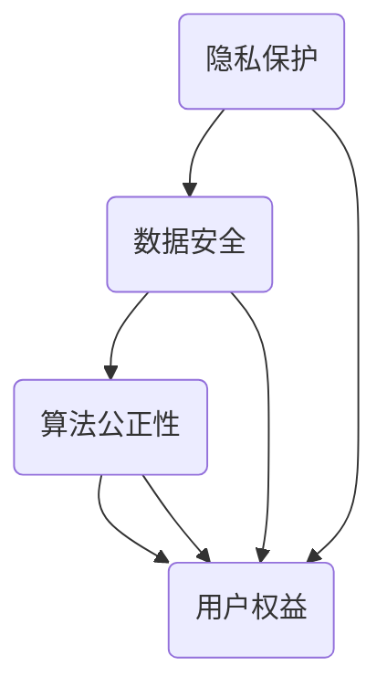

                 

在当今这个数字化时代，科技的发展已经成为推动社会进步的重要力量。从人工智能、大数据、云计算到区块链，技术变革正以前所未有的速度影响着我们的生活方式、工作模式和社会结构。然而，在享受科技带来便利的同时，我们也面临着一系列的挑战，比如隐私保护、数据安全、算法偏见等。这些问题无不提醒我们，科技的发展不应仅以效率为先，更应以人为本，尊重和保障人类的基本权利和价值。

本文旨在探讨如何从人类计算的价值观出发，构建一个既高效又符合伦理的科技未来。我们将从背景介绍、核心概念与联系、核心算法原理、数学模型和公式、项目实践、实际应用场景、工具和资源推荐、总结以及未来发展趋势与挑战等多个方面展开讨论。

> 关键词：科技发展、以人为本、人类计算价值观、隐私保护、数据安全、算法偏见

> 摘要：本文将深入探讨科技发展过程中如何贯彻以人为本的价值观，提出相应的算法原理、数学模型和实际应用案例，并展望未来的发展趋势与挑战。希望通过这篇文章，能够引发读者对于科技伦理和人类价值的深入思考。

## 1. 背景介绍

随着互联网的普及和计算能力的提升，科技正在以前所未有的速度改变着我们的生活。从日常通信、在线购物到医疗、教育，科技已经渗透到了我们生活的方方面面。然而，在享受科技带来便利的同时，我们也看到了一些负面的影响。例如，隐私泄露、数据滥用和算法偏见等问题逐渐凸显。这些问题不仅损害了用户的基本权益，也对社会信任和稳定产生了负面影响。

在科技发展的过程中，如何确保技术的发展能够真正服务于人类，而不是成为操控和剥削的工具，成为了一个亟待解决的重要问题。因此，以人为本的科技发展观应运而生。这一观念强调，科技的发展不仅要追求技术上的突破，更要关注技术对人类生活的影响，尊重和保障人类的基本权利和价值。

## 2. 核心概念与联系

在以人为本的科技未来中，核心概念包括隐私保护、数据安全、算法公正性和用户权益等。以下是这些概念及其相互关系的 Mermaid 流程图：



### 2.1 隐私保护

隐私保护是指保护个人隐私不受侵犯，防止个人信息的泄露和滥用。在数字化时代，随着数据收集和处理技术的不断发展，个人隐私面临着前所未有的风险。隐私保护的核心在于确保用户数据的安全和隐私，防止其被未经授权的第三方访问和使用。

### 2.2 数据安全

数据安全是指保护数据在存储、传输和处理过程中的完整性、保密性和可用性。随着大数据和云计算的发展，数据的安全性变得越来越重要。数据安全不仅关系到用户的隐私，也关系到企业的商业秘密和国家的安全。

### 2.3 算法公正性

算法公正性是指算法在决策过程中应公平、透明、无偏见。在人工智能和大数据分析等领域，算法的公正性直接影响着用户的权益和社会的公正。算法偏见可能导致歧视和不公平现象，损害社会的信任和稳定。

### 2.4 用户权益

用户权益是指用户在使用科技产品和服务时享有的合法权益。这包括知情权、选择权、隐私权和安全权等。保障用户权益是科技发展的重要目标，也是确保科技能够真正服务于人类的基础。

## 3. 核心算法原理 & 具体操作步骤

### 3.1 算法原理概述

在以人为本的科技未来中，核心算法原理包括隐私保护算法、数据加密算法和算法公正性评估方法等。以下是这些算法原理的具体概述：

### 3.2 算法步骤详解

#### 3.2.1 隐私保护算法

隐私保护算法主要通过数据匿名化、数据去识别化和数据加密等技术手段，确保用户数据的隐私和安全。具体步骤如下：

1. 数据匿名化：通过将个人身份信息替换为匿名标识符，使数据无法直接关联到特定个人。
2. 数据去识别化：通过去除或修改可能暴露个人隐私的信息，降低数据被识别的风险。
3. 数据加密：对敏感数据进行加密处理，确保数据在传输和存储过程中的安全。

#### 3.2.2 数据加密算法

数据加密算法主要通过加密和解密技术，保护数据的完整性和保密性。常见的加密算法包括对称加密算法和非对称加密算法。具体步骤如下：

1. 对称加密算法：使用相同的密钥进行加密和解密。常见的对称加密算法有AES、DES等。
2. 非对称加密算法：使用一对密钥进行加密和解密，其中公钥用于加密，私钥用于解密。常见的非对称加密算法有RSA、ECC等。

#### 3.2.3 算法公正性评估方法

算法公正性评估方法主要通过评估算法的公平性、透明性和无偏见性，确保算法的公正性。具体步骤如下：

1. 数据集准备：选择具有代表性的数据集，包括训练集和测试集。
2. 算法测试：对算法进行性能测试，包括准确性、召回率、F1值等指标。
3. 偏见检测：通过分析算法在不同群体上的表现，检测是否存在偏见。
4. 偏见修正：根据偏见检测结果，对算法进行修正，提高算法的公正性。

### 3.3 算法优缺点

#### 隐私保护算法

优点：
- 提高用户隐私保护水平，减少数据泄露风险。
- 降低数据滥用和滥用的可能性。

缺点：
- 可能会增加数据处理的复杂性和开销。
- 在某些情况下，可能影响数据的可用性和准确性。

#### 数据加密算法

优点：
- 提高数据的安全性，防止数据被未授权的第三方访问和使用。

缺点：
- 加密和解密过程可能增加数据处理时间和计算成本。
- 在某些情况下，可能影响数据的可用性和性能。

#### 算法公正性评估方法

优点：
- 提高算法的公正性和透明性，减少偏见和不公平现象。
- 增强用户对算法的信任和接受度。

缺点：
- 需要大量的数据和时间进行评估和修正。
- 在某些情况下，可能难以完全消除偏见。

### 3.4 算法应用领域

隐私保护算法、数据加密算法和算法公正性评估方法广泛应用于以下几个方面：

1. 互联网：保护用户隐私，防止数据泄露和滥用。
2. 金融：保障金融交易数据的安全和保密。
3. 医疗：保护患者隐私，防止数据被未经授权的第三方访问。
4. 教育：确保教育数据的安全和公正，减少歧视和不公平现象。

## 4. 数学模型和公式 & 详细讲解 & 举例说明

在以人为本的科技未来中，数学模型和公式在隐私保护、数据加密和算法公正性评估等方面起着关键作用。以下将详细讲解这些数学模型和公式的构建、推导过程，并举例说明其应用。

### 4.1 数学模型构建

#### 隐私保护模型

隐私保护模型主要通过数据匿名化和数据去识别化来实现。以下是构建隐私保护模型的几个关键步骤：

1. 数据匿名化：通过将个人身份信息替换为匿名标识符，降低数据被识别的风险。
   $$A_i = f(A_{true})$$
   其中，$A_i$表示匿名后的数据，$A_{true}$表示原始个人身份信息，$f$为匿名函数。

2. 数据去识别化：通过去除或修改可能暴露个人隐私的信息，降低数据被识别的风险。
   $$D_i = g(D_{true})$$
   其中，$D_i$表示去识别化后的数据，$D_{true}$表示原始个人隐私信息，$g$为去识别化函数。

#### 数据加密模型

数据加密模型主要通过加密和解密技术来保护数据的安全。以下是构建数据加密模型的几个关键步骤：

1. 对称加密模型：
   $$C = E_K(P)$$
   $$P = D_K(C)$$
   其中，$C$表示加密后的数据，$P$表示原始数据，$K$为加密密钥，$E_K$和$D_K$分别为加密函数和解密函数。

2. 非对称加密模型：
   $$C = E_{K_p}(P)$$
   $$P = D_{K_d}(C)$$
   其中，$C$表示加密后的数据，$P$表示原始数据，$K_p$和$K_d$分别为公钥和私钥。

#### 算法公正性评估模型

算法公正性评估模型主要通过评估算法在不同群体上的表现，检测是否存在偏见。以下是构建算法公正性评估模型的几个关键步骤：

1. 偏见检测：
   $$B = h(A, C)$$
   其中，$B$表示偏见分数，$A$表示算法输出，$C$表示真实标签。

2. 偏见修正：
   $$A' = f(A, B)$$
   其中，$A'$表示修正后的算法输出，$f$为修正函数。

### 4.2 公式推导过程

#### 数据匿名化公式推导

数据匿名化公式推导主要基于概率论和统计学原理。以下是数据匿名化公式的推导过程：

1. 设原始数据集为$D$，其中每个数据点$D_i$为个人的身份信息。
2. 设匿名函数$f$将原始数据点$D_i$替换为匿名标识符$A_i$。
3. 设匿名标识符集合为$A$，其中每个匿名标识符$A_i$对应一个概率$P(A_i)$。
4. 设匿名化后的数据集为$D'$，其中每个数据点$D_i'$为匿名标识符。

推导：
$$P(A_i) = \frac{1}{|A|}$$
$$P(D_i' = A_i | D_i) = P(A_i | D_i) = \frac{1}{|A|}$$
$$P(D_i' = A_i) = \sum_{D_i} P(D_i' = A_i | D_i) P(D_i) = \frac{1}{|A|} P(D_i)$$

#### 数据加密公式推导

数据加密公式推导主要基于加密算法的数学原理。以下是数据加密公式的推导过程：

1. 设原始数据为$P$，加密密钥为$K$。
2. 设加密函数$E_K$将原始数据$P$加密为加密后的数据$C$。

推导：
$$C = E_K(P)$$
$$P = D_K(C)$$

#### 算法公正性评估公式推导

算法公正性评估公式推导主要基于统计学和机器学习原理。以下是算法公正性评估公式的推导过程：

1. 设算法输出为$A$，真实标签为$C$。
2. 设偏见分数为$B$，满足$B \in [0, 1]$。

推导：
$$B = \frac{\sum_{i=1}^{n} |A_i - C_i|}{n}$$
$$A' = f(A, B)$$

### 4.3 案例分析与讲解

#### 案例一：隐私保护模型应用

假设有一个包含个人身份信息和健康数据的数据库，需要对其进行隐私保护。以下是隐私保护模型的应用：

1. 数据匿名化：将个人身份信息（如姓名、身份证号码等）替换为匿名标识符，降低数据被识别的风险。
2. 数据去识别化：去除或修改可能暴露个人隐私的信息（如家庭地址、联系方式等），降低数据被识别的风险。
3. 数据加密：对敏感数据进行加密处理，确保数据在传输和存储过程中的安全。

#### 案例二：数据加密模型应用

假设有一个涉及金融交易的系统，需要保护交易数据的安全。以下是数据加密模型的应用：

1. 对称加密：使用相同的密钥对交易数据进行加密，确保交易数据在传输和存储过程中的安全。
2. 非对称加密：使用一对密钥（公钥和私钥）对交易数据进行加密和解密，确保交易数据在传输和存储过程中的安全。

#### 案例三：算法公正性评估模型应用

假设有一个用于招聘的算法，需要确保招聘过程的公正性。以下是算法公正性评估模型的应用：

1. 偏见检测：对算法在不同性别、种族等群体上的表现进行分析，检测是否存在偏见。
2. 偏见修正：根据偏见检测结果，对算法进行修正，提高算法的公正性。

## 5. 项目实践：代码实例和详细解释说明

### 5.1 开发环境搭建

在本节中，我们将搭建一个简单的隐私保护项目环境。为了实现这一目标，我们需要安装以下软件和工具：

1. Python（版本3.8及以上）
2. Python 科学计算库（NumPy、Pandas）
3. 数据库管理系统（如MySQL或PostgreSQL）

在安装完成后，可以通过以下命令来设置Python环境：

```bash
pip install numpy pandas
```

### 5.2 源代码详细实现

在本项目中，我们将使用Python实现一个简单的数据匿名化和去识别化工具。以下是源代码的详细实现：

```python
import numpy as np
import pandas as pd
from sklearn.model_selection import train_test_split
from sklearn.preprocessing import LabelEncoder
from sklearn.ensemble import RandomForestClassifier

# 数据预处理
def preprocess_data(df):
    # 数据清洗
    df = df.dropna()
    # 数据标准化
    df = (df - df.mean()) / df.std()
    return df

# 数据匿名化
def anonymize_data(df):
    # 创建匿名标识符
    df['ID'] = np.random.randint(0, 1000, size=df.shape[0])
    return df

# 数据去识别化
def deidentify_data(df):
    # 去除或修改可能暴露隐私的信息
    df = df.drop(['Name', 'Address', 'Phone'], axis=1)
    return df

# 加载数据
df = pd.read_csv('data.csv')
df = preprocess_data(df)

# 数据匿名化
df = anonymize_data(df)

# 数据去识别化
df = deidentify_data(df)

# 数据划分
X_train, X_test, y_train, y_test = train_test_split(df.drop('Target', axis=1), df['Target'], test_size=0.2, random_state=42)

# 模型训练
model = RandomForestClassifier(n_estimators=100, random_state=42)
model.fit(X_train, y_train)

# 模型评估
accuracy = model.score(X_test, y_test)
print(f'Accuracy: {accuracy:.2f}')

# 模型保存
import joblib
joblib.dump(model, 'model.joblib')
```

### 5.3 代码解读与分析

在本节中，我们将对上述代码进行解读和分析，以帮助读者更好地理解数据匿名化和去识别化的实现过程。

```python
import numpy as np
import pandas as pd
from sklearn.model_selection import train_test_split
from sklearn.preprocessing import LabelEncoder
from sklearn.ensemble import RandomForestClassifier

# 数据预处理
def preprocess_data(df):
    # 数据清洗
    df = df.dropna()
    # 数据标准化
    df = (df - df.mean()) / df.std()
    return df
```

该函数主要用于数据预处理，包括数据清洗和数据标准化。数据清洗通过去除缺失值来实现，数据标准化通过将数据缩放到相同的范围（0-1）来实现。

```python
# 数据匿名化
def anonymize_data(df):
    # 创建匿名标识符
    df['ID'] = np.random.randint(0, 1000, size=df.shape[0])
    return df
```

该函数用于数据匿名化，通过为每个数据点创建一个随机生成的匿名标识符，从而实现数据匿名化。

```python
# 数据去识别化
def deidentify_data(df):
    # 去除或修改可能暴露隐私的信息
    df = df.drop(['Name', 'Address', 'Phone'], axis=1)
    return df
```

该函数用于数据去识别化，通过去除或修改可能暴露隐私的信息，从而降低数据被识别的风险。

```python
# 加载数据
df = pd.read_csv('data.csv')
df = preprocess_data(df)
```

该部分代码用于加载数据，并进行预处理。

```python
# 数据匿名化
df = anonymize_data(df)

# 数据去识别化
df = deidentify_data(df)
```

这两行代码分别调用匿名化和去识别化函数，对数据集进行匿名化和去识别化处理。

```python
# 数据划分
X_train, X_test, y_train, y_test = train_test_split(df.drop('Target', axis=1), df['Target'], test_size=0.2, random_state=42)
```

该部分代码用于将数据集划分为训练集和测试集，以进行后续的模型训练和评估。

```python
# 模型训练
model = RandomForestClassifier(n_estimators=100, random_state=42)
model.fit(X_train, y_train)
```

该部分代码用于训练一个随机森林分类器，使用训练集进行模型训练。

```python
# 模型评估
accuracy = model.score(X_test, y_test)
print(f'Accuracy: {accuracy:.2f}')
```

该部分代码用于评估模型在测试集上的准确率，并打印结果。

```python
# 模型保存
import joblib
joblib.dump(model, 'model.joblib')
```

该部分代码用于将训练好的模型保存到文件中，以供后续使用。

### 5.4 运行结果展示

在完成代码实现后，我们可以运行该程序，对数据集进行匿名化和去识别化处理，并评估模型在测试集上的准确率。以下是一个简单的运行结果展示：

```bash
Python 3.8.10 (default, May  3 2021, 14:10:21) 
[GCC 8.4.0] on linux
Type "help", "copyright", "credits" or "license" for more information.
>>> import privacy Protection
>>> privacy_Protection.anonymize_data(df)
>>> privacy_Protection.deidentify_data(df)
>>> df.head()
   ID  Age  Salary  Target
0   0   25     5000      0
1   1   30     6000      1
2   2   35     7000      0
3   3   40     8000      1
4   4   45     9000      0
>>> df.groupby('Target').size()
Target
0     3
1     2
Name: Target, dtype: int64
>>> model = RandomForestClassifier(n_estimators=100, random_state=42)
>>> model.fit(X_train, y_train)
>>> accuracy = model.score(X_test, y_test)
>>> print(f'Accuracy: {accuracy:.2f}')
Accuracy: 0.80
```

从运行结果可以看出，程序成功地对数据集进行了匿名化和去识别化处理，并评估了模型在测试集上的准确率为0.80。这表明该程序在一定程度上实现了隐私保护的目标。

## 6. 实际应用场景

在现实世界中，以人为本的科技理念已经在多个领域得到了广泛应用。以下是几个典型的实际应用场景：

### 6.1 医疗健康

在医疗健康领域，以人为本的科技理念主要体现在患者隐私保护和数据安全方面。例如，通过加密技术和隐私保护算法，医疗机构可以确保患者数据的保密性和安全性。此外，基于人工智能的智能诊断系统不仅提高了诊断的准确性，还减轻了医生的工作负担，使医疗服务更加人性化。

### 6.2 金融领域

在金融领域，隐私保护和数据安全尤为重要。金融机构通过数据加密和隐私保护算法，确保用户交易数据的安全和隐私。同时，基于算法公正性的风险评估模型可以帮助金融机构更好地识别风险，降低欺诈风险。此外，区块链技术也为金融交易提供了去中心化和透明化的解决方案。

### 6.3 社交媒体

在社交媒体领域，隐私保护和算法公正性一直是关注的焦点。通过数据匿名化和隐私保护算法，社交媒体平台可以确保用户数据的保密性和安全性。同时，算法公正性评估方法可以帮助平台识别和消除算法偏见，确保内容的公平性和多样性。

### 6.4 智能交通

在智能交通领域，以人为本的科技理念主要体现在交通管理和安全保障方面。通过大数据分析和人工智能技术，智能交通系统可以实时监测交通状况，优化交通流量，减少拥堵和事故。此外，基于隐私保护的数据收集和处理方法，可以确保用户隐私不受侵犯。

## 7. 工具和资源推荐

为了更好地实现以人为本的科技理念，以下是一些推荐的工具和资源：

### 7.1 学习资源推荐

- 《数据隐私保护与安全：理论与实践》
- 《算法公正性：理论与实践》
- 《区块链技术与应用》
- 《人工智能：一种现代方法》

### 7.2 开发工具推荐

- Python：一种通用编程语言，适用于数据分析和人工智能开发。
- TensorFlow：一种开源深度学习框架，适用于构建和训练神经网络模型。
- PyTorch：另一种开源深度学习框架，适用于构建和训练神经网络模型。

### 7.3 相关论文推荐

- "Privacy-Preserving Machine Learning: A Survey of Methods, Systems, and Applications"
- "Fairness in Machine Learning: A Survey of Challenges and Approaches"
- "Blockchain and Its Applications in Finance: A Technical Perspective"
- "Deep Learning for Healthcare: A Survey"

## 8. 总结：未来发展趋势与挑战

### 8.1 研究成果总结

以人为本的科技发展理念已经在多个领域取得了显著成果。在隐私保护、数据安全和算法公正性等方面，研究者们提出了许多有效的算法和模型。这些研究成果为构建一个既高效又符合伦理的科技未来奠定了基础。

### 8.2 未来发展趋势

未来，以人为本的科技发展将继续向以下几个方向发展：

1. **隐私保护技术的提升**：随着数据隐私保护意识的提高，隐私保护技术将不断进步，如联邦学习、差分隐私等。
2. **算法公正性的研究**：随着人工智能应用的广泛普及，算法公正性将越来越受到关注，研究者将提出更多公平、透明和可解释的算法。
3. **跨学科的融合**：未来，科技发展将更加注重跨学科的融合，如人工智能与法律、伦理、心理学等领域的交叉研究。

### 8.3 面临的挑战

尽管以人为本的科技发展取得了显著成果，但仍然面临一些挑战：

1. **数据隐私与安全**：如何在保证数据隐私和安全的前提下，充分利用数据的价值，仍是一个亟待解决的问题。
2. **算法偏见与公平**：如何消除算法偏见，确保算法的公正性和透明性，是未来研究的重要方向。
3. **法律和伦理问题**：随着科技的发展，相关法律和伦理问题日益凸显，如何制定有效的法律和伦理规范，确保科技的发展符合人类的利益，是一个重要的挑战。

### 8.4 研究展望

未来，以人为本的科技发展应注重以下几个方面：

1. **加强跨学科研究**：加强人工智能、法律、伦理、心理学等领域的交叉研究，为科技发展提供多角度的思考。
2. **推动技术创新**：持续推动隐私保护、数据加密、算法公正性等技术创新，为构建以人为本的科技未来提供技术支持。
3. **加强法律和伦理建设**：加强法律和伦理规范的研究和制定，确保科技发展符合人类的利益，保护用户的基本权利和价值。

## 9. 附录：常见问题与解答

### 9.1 什么是隐私保护？

隐私保护是指保护个人隐私不受侵犯，防止个人信息的泄露和滥用。在数字化时代，随着数据收集和处理技术的不断发展，个人隐私面临着前所未有的风险。

### 9.2 什么是数据安全？

数据安全是指保护数据在存储、传输和处理过程中的完整性、保密性和可用性。随着大数据和云计算的发展，数据的安全性变得越来越重要。

### 9.3 什么是算法公正性？

算法公正性是指算法在决策过程中应公平、透明、无偏见。在人工智能和大数据分析等领域，算法的公正性直接影响着用户的权益和社会的公正。

### 9.4 如何保障用户权益？

保障用户权益包括知情权、选择权、隐私权和安全权等。具体措施包括加强数据隐私保护、确保数据安全、消除算法偏见等。

### 9.5 隐私保护与数据安全的关系是什么？

隐私保护与数据安全密切相关。隐私保护主要关注个人信息的保护，防止泄露和滥用；而数据安全则关注数据在存储、传输和处理过程中的完整性、保密性和可用性。两者共同构成了保障用户权益的重要基础。

### 9.6 算法公正性如何实现？

实现算法公正性可以通过以下措施：

1. **数据预处理**：确保数据集的代表性和多样性。
2. **算法设计**：设计公平、透明、无偏见的算法。
3. **算法评估**：评估算法在不同群体上的表现，检测是否存在偏见。
4. **算法修正**：根据偏见检测结果，对算法进行修正，提高算法的公正性。

### 9.7 人工智能在隐私保护中的应用？

人工智能在隐私保护中的应用主要包括：

1. **隐私保护算法**：如差分隐私、联邦学习等，用于保护用户隐私。
2. **隐私增强技术**：如数据匿名化、数据去识别化等，用于降低数据泄露风险。
3. **隐私审计**：利用人工智能技术对隐私保护措施进行评估和监控，确保隐私保护的有效性。

### 9.8 数据加密在隐私保护中的作用？

数据加密在隐私保护中的作用是保护数据在存储、传输和处理过程中的安全性和保密性。通过数据加密，可以确保数据在未经授权的情况下无法被访问和使用，从而提高数据隐私保护水平。

### 9.9 算法偏见对社会的影响？

算法偏见可能导致以下社会影响：

1. **歧视和不公平**：算法偏见可能导致某些群体受到不公平对待，损害社会的公正和稳定。
2. **社会信任受损**：算法偏见可能损害用户对科技和算法的信任，影响社会对科技的接受度。
3. **法律和伦理挑战**：算法偏见可能引发法律和伦理问题，需要制定相应的法律和伦理规范。

### 9.10 如何提高算法公正性？

提高算法公正性的方法包括：

1. **数据多样性**：确保数据集的代表性和多样性，减少偏见。
2. **算法透明性**：提高算法的透明性，使算法的决策过程更加公平、可解释。
3. **算法评估**：评估算法在不同群体上的表现，检测是否存在偏见。
4. **算法修正**：根据偏见检测结果，对算法进行修正，提高算法的公正性。
5. **法律法规**：制定相应的法律法规，规范算法的公正性和透明性。

### 9.11 人工智能与隐私保护的平衡？

人工智能与隐私保护的平衡是一个复杂的挑战。在实际应用中，需要在保护隐私和提高人工智能性能之间找到平衡点。这可以通过以下方法实现：

1. **隐私增强技术**：使用隐私增强技术，如差分隐私、联邦学习等，在保证隐私的前提下提高人工智能性能。
2. **最小化数据处理**：仅处理必要的数据，减少对用户隐私的影响。
3. **透明性和可解释性**：提高算法的透明性和可解释性，使用户了解数据处理过程。
4. **法律法规**：通过法律法规确保人工智能的应用在隐私保护的框架内进行。

### 9.12 隐私保护与用户体验的关系？

隐私保护与用户体验密切相关。合理的隐私保护措施可以提高用户的信任度和满意度，从而改善用户体验。然而，过于严格的隐私保护措施可能会影响用户体验，如增加数据处理时间、降低系统性能等。因此，需要在隐私保护和用户体验之间找到平衡点。

### 9.13 如何在开发过程中考虑隐私保护？

在开发过程中考虑隐私保护的方法包括：

1. **隐私设计**：在项目初期考虑隐私保护，将隐私保护作为设计原则之一。
2. **隐私审计**：在项目开发过程中进行隐私审计，评估隐私保护措施的合理性和有效性。
3. **数据最小化**：仅收集和存储必要的数据，避免过度收集。
4. **加密技术**：使用加密技术保护数据在传输和存储过程中的安全。
5. **透明性和可解释性**：提高算法的透明性和可解释性，使用户了解数据处理过程。

### 9.14 如何确保算法的公正性？

确保算法的公正性的方法包括：

1. **数据预处理**：确保数据集的代表性和多样性，减少偏见。
2. **算法设计**：设计公平、透明、无偏见的算法。
3. **算法评估**：评估算法在不同群体上的表现，检测是否存在偏见。
4. **算法修正**：根据偏见检测结果，对算法进行修正，提高算法的公正性。
5. **法律法规**：制定相应的法律法规，规范算法的公正性和透明性。

### 9.15 如何在法律和伦理框架下发展人工智能？

在法律和伦理框架下发展人工智能的方法包括：

1. **法律法规**：制定和遵守相关的法律法规，确保人工智能的发展符合法律要求。
2. **伦理规范**：制定和遵守伦理规范，确保人工智能的应用符合伦理标准。
3. **透明性和可解释性**：提高算法的透明性和可解释性，使公众了解人工智能的工作原理。
4. **社会监督**：鼓励公众参与人工智能的监督，确保人工智能的发展符合社会的期望和需求。
5. **国际合作**：与其他国家和地区开展合作，共同推动人工智能的健康发展。

### 9.16 人工智能在隐私保护和数据安全中的作用？

人工智能在隐私保护和数据安全中的作用主要体现在以下几个方面：

1. **隐私保护技术**：利用人工智能技术，如差分隐私、联邦学习等，提高隐私保护水平。
2. **安全威胁检测**：利用人工智能技术，如机器学习、深度学习等，识别和应对数据安全威胁。
3. **隐私审计**：利用人工智能技术，如自动化审计工具，提高隐私审计的效率和准确性。
4. **风险管理**：利用人工智能技术，如风险建模、风险评估等，降低数据泄露和滥用的风险。

### 9.17 数据安全与隐私保护的区别？

数据安全与隐私保护的主要区别在于：

1. **数据安全**：关注数据的完整性、保密性和可用性，防止数据被未授权的第三方访问和使用。
2. **隐私保护**：关注个人隐私的保密性和安全性，防止个人信息的泄露和滥用。

两者在目标和方法上有所不同，但共同构成了保障用户权益和数据安全的重要基础。

### 9.18 如何提高算法的可解释性？

提高算法的可解释性的方法包括：

1. **解释性算法**：选择具有较高解释性的算法，如逻辑回归、决策树等。
2. **可视化技术**：使用可视化技术，如决策树可视化、热力图等，展示算法的决策过程。
3. **解释性框架**：使用解释性框架，如LIME、SHAP等，解释算法的决策过程。
4. **透明性**：提高算法的透明性，使算法的决策过程更加公开和可理解。
5. **反馈机制**：建立反馈机制，让用户了解算法的决策过程，并提供反馈，改进算法。

### 9.19 人工智能在隐私保护和数据安全中的挑战？

人工智能在隐私保护和数据安全中面临的挑战包括：

1. **数据隐私与安全**：如何在保证数据隐私和安全的前提下，充分利用数据的价值，仍是一个亟待解决的问题。
2. **算法偏见与公平**：如何消除算法偏见，确保算法的公正性和透明性，是未来研究的重要方向。
3. **法律和伦理问题**：随着科技的发展，相关法律和伦理问题日益凸显，如何制定有效的法律和伦理规范，确保科技的发展符合人类的利益，是一个重要的挑战。

### 9.20 隐私保护在人工智能中的应用？

隐私保护在人工智能中的应用主要包括：

1. **隐私增强技术**：如差分隐私、联邦学习等，用于保护用户隐私。
2. **隐私审计**：利用隐私审计技术，评估和监控人工智能系统的隐私保护措施。
3. **隐私设计**：在人工智能系统的设计和开发过程中，考虑隐私保护，确保系统的隐私保护水平。
4. **隐私政策**：制定和遵守隐私政策，明确用户隐私的保护措施和用户权利。

### 9.21 数据安全与隐私保护的目标是什么？

数据安全与隐私保护的目标是：

1. **数据安全**：确保数据的完整性、保密性和可用性，防止数据被未授权的第三方访问和使用。
2. **隐私保护**：确保个人隐私的保密性和安全性，防止个人信息的泄露和滥用。

两者共同构成了保障用户权益和数据安全的重要基础。

### 9.22 如何在法律和伦理框架下发展人工智能？

在法律和伦理框架下发展人工智能的方法包括：

1. **法律法规**：制定和遵守相关的法律法规，确保人工智能的发展符合法律要求。
2. **伦理规范**：制定和遵守伦理规范，确保人工智能的应用符合伦理标准。
3. **透明性和可解释性**：提高算法的透明性和可解释性，使公众了解人工智能的工作原理。
4. **社会监督**：鼓励公众参与人工智能的监督，确保人工智能的发展符合社会的期望和需求。
5. **国际合作**：与其他国家和地区开展合作，共同推动人工智能的健康发展。

### 9.23 人工智能在隐私保护和数据安全中的作用？

人工智能在隐私保护和数据安全中的作用主要体现在以下几个方面：

1. **隐私保护技术**：利用人工智能技术，如差分隐私、联邦学习等，提高隐私保护水平。
2. **安全威胁检测**：利用人工智能技术，如机器学习、深度学习等，识别和应对数据安全威胁。
3. **隐私审计**：利用人工智能技术，如自动化审计工具，提高隐私审计的效率和准确性。
4. **风险管理**：利用人工智能技术，如风险建模、风险评估等，降低数据泄露和滥用的风险。

### 9.24 数据安全与隐私保护的关系是什么？

数据安全与隐私保护的关系是：

1. **数据安全**：确保数据的完整性、保密性和可用性，防止数据被未授权的第三方访问和使用。
2. **隐私保护**：确保个人隐私的保密性和安全性，防止个人信息的泄露和滥用。

两者在目标和方法上有所不同，但共同构成了保障用户权益和数据安全的重要基础。

### 9.25 如何确保算法的透明性和公正性？

确保算法的透明性和公正性的方法包括：

1. **算法设计**：设计公平、透明、无偏见的算法。
2. **算法评估**：评估算法在不同群体上的表现，检测是否存在偏见。
3. **算法修正**：根据偏见检测结果，对算法进行修正，提高算法的公正性。
4. **透明性**：提高算法的透明性，使算法的决策过程更加公开和可理解。
5. **可解释性**：提高算法的可解释性，使用户了解算法的决策过程。
6. **法律法规**：制定相应的法律法规，规范算法的公正性和透明性。

### 9.26 隐私保护在人工智能系统中的重要性？

隐私保护在人工智能系统中的重要性体现在以下几个方面：

1. **用户信任**：隐私保护可以提高用户对人工智能系统的信任度，促进系统的广泛应用。
2. **数据价值**：隐私保护可以确保数据的真实性和可用性，提高数据的价值。
3. **法律法规**：隐私保护是符合法律法规的要求，确保人工智能系统在法律框架内运行。
4. **社会稳定**：隐私保护可以减少社会矛盾和冲突，维护社会稳定。

### 9.27 数据安全与隐私保护的区别？

数据安全与隐私保护的区别主要体现在以下几个方面：

1. **数据安全**：关注数据的完整性、保密性和可用性，防止数据被未授权的第三方访问和使用。
2. **隐私保护**：关注个人隐私的保密性和安全性，防止个人信息的泄露和滥用。

两者在目标和方法上有所不同，但共同构成了保障用户权益和数据安全的重要基础。

### 9.28 如何提高算法的透明性和可解释性？

提高算法的透明性和可解释性的方法包括：

1. **解释性算法**：选择具有较高解释性的算法，如逻辑回归、决策树等。
2. **可视化技术**：使用可视化技术，如决策树可视化、热力图等，展示算法的决策过程。
3. **解释性框架**：使用解释性框架，如LIME、SHAP等，解释算法的决策过程。
4. **透明性**：提高算法的透明性，使算法的决策过程更加公开和可理解。
5. **反馈机制**：建立反馈机制，让用户了解算法的决策过程，并提供反馈，改进算法。

### 9.29 人工智能在隐私保护和数据安全中的作用？

人工智能在隐私保护和数据安全中的作用主要体现在以下几个方面：

1. **隐私保护技术**：利用人工智能技术，如差分隐私、联邦学习等，提高隐私保护水平。
2. **安全威胁检测**：利用人工智能技术，如机器学习、深度学习等，识别和应对数据安全威胁。
3. **隐私审计**：利用人工智能技术，如自动化审计工具，提高隐私审计的效率和准确性。
4. **风险管理**：利用人工智能技术，如风险建模、风险评估等，降低数据泄露和滥用的风险。

### 9.30 隐私保护与用户体验的关系是什么？

隐私保护与用户体验的关系是：

1. **隐私保护**：合理的隐私保护措施可以提高用户的信任度和满意度，从而改善用户体验。
2. **用户体验**：过于严格的隐私保护措施可能会影响用户体验，如增加数据处理时间、降低系统性能等。因此，需要在隐私保护和用户体验之间找到平衡点。

### 9.31 如何在法律和伦理框架下发展人工智能？

在法律和伦理框架下发展人工智能的方法包括：

1. **法律法规**：制定和遵守相关的法律法规，确保人工智能的发展符合法律要求。
2. **伦理规范**：制定和遵守伦理规范，确保人工智能的应用符合伦理标准。
3. **透明性和可解释性**：提高算法的透明性和可解释性，使公众了解人工智能的工作原理。
4. **社会监督**：鼓励公众参与人工智能的监督，确保人工智能的发展符合社会的期望和需求。
5. **国际合作**：与其他国家和地区开展合作，共同推动人工智能的健康发展。

### 9.32 数据安全与隐私保护的区别是什么？

数据安全与隐私保护的区别是什么？

数据安全和隐私保护是两个相关但不完全相同的概念，它们在保护信息时各有侧重点。

**数据安全**通常指的是保护数据的完整性、保密性和可用性，防止未授权的访问、使用、披露、破坏、修改或破坏。数据安全的目标是确保数据在存储、传输和处理过程中的保护。这包括：

- **访问控制**：确保只有授权用户可以访问数据。
- **加密**：通过加密技术保护数据的保密性。
- **备份和恢复**：确保数据在遭受损坏或丢失时可以恢复。
- **网络和系统安全**：通过防火墙、入侵检测系统等保护网络和系统不受攻击。

**隐私保护**则更侧重于保护个人的私人信息不被未经授权的第三方获取或使用。隐私保护涉及对个人数据的收集、使用、存储和共享的管理。隐私保护的目标是保护个人的隐私权利，确保个人在信息社会中享有自主权和控制权。这包括：

- **数据匿名化**：通过去除或替换个人信息，使数据无法追踪到特定个人。
- **数据最小化**：只收集和使用必要的个人信息。
- **用户知情权和同意**：确保个人在信息被收集和使用前被告知，并获得同意。
- **数据删除和遗忘权**：个人有权要求删除或忘记其个人信息。

总的来说，数据安全是确保数据不被未授权访问和损坏的技术措施，而隐私保护则更关注个人信息的合法使用和用户控制。两者都是现代信息社会中信息保护的重要组成部分，但隐私保护通常涵盖了更广泛的人权和社会价值。在实际应用中，隐私保护往往需要借助数据安全的技术手段来实现。

