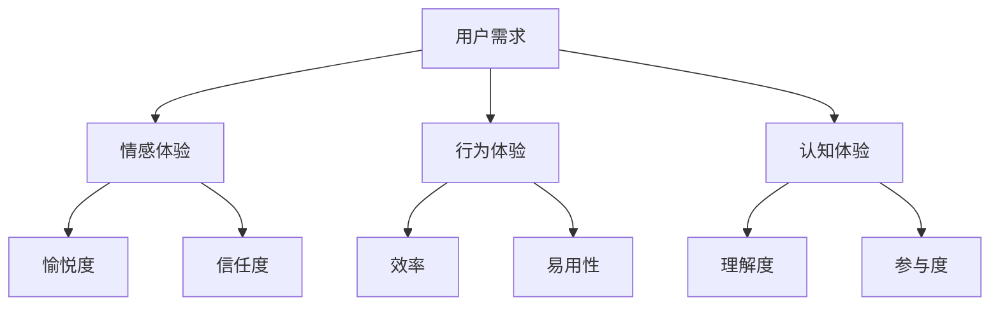
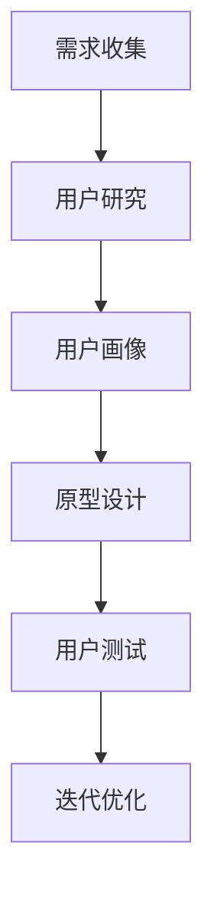
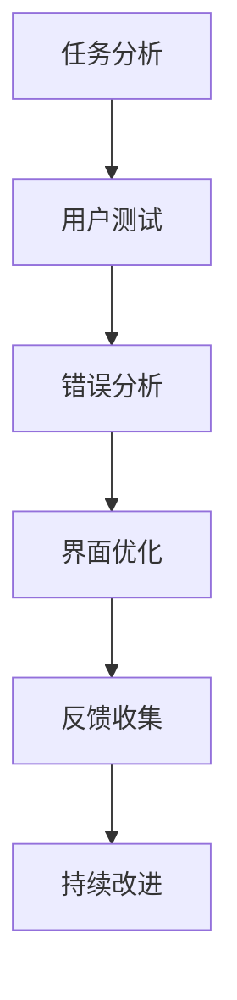
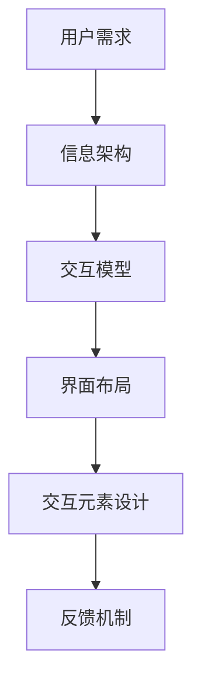
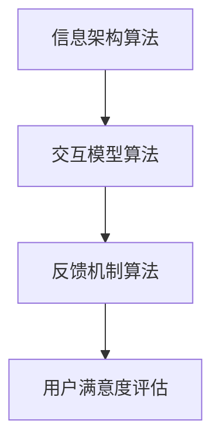

                 

 **关键词**：人机界面设计、用户体验、用户中心、易用性、交互设计

**摘要**：本文将深入探讨以用户为中心的设计理念在人机界面设计中的重要性。通过详细阐述核心概念、算法原理、数学模型、实际应用案例以及未来展望，本文旨在帮助开发者们更好地理解并应用这一设计原则，从而创造出更加友好、易用的人机界面。

## 1. 背景介绍

在人机界面设计领域，用户体验（UX）和用户中心设计（UCD）的概念已经成为衡量设计质量的关键标准。用户体验关注的是用户在使用产品或服务过程中的感受和满意度，而用户中心设计则强调在整个设计过程中始终将用户的需求和感受置于核心位置。随着科技的发展，人机交互变得越来越复杂，如何设计出既美观又实用的界面成为开发者和设计师面临的一大挑战。

本文将围绕以下核心问题展开讨论：

- 如何从用户的角度出发，理解并满足他们的需求？
- 设计过程中应遵循哪些基本原则和方法？
- 实际应用案例如何验证用户中心设计的有效性？
- 未来人机界面设计将面临哪些挑战和机遇？

通过对这些问题的深入探讨，希望读者能够更好地把握以用户为中心的设计理念，并将其应用于实际项目中。

## 2. 核心概念与联系

### 2.1. 用户体验（UX）

用户体验是指用户在使用产品或服务过程中所感受到的整体体验。它不仅包括功能层面的满意度，还涵盖了情感、行为和认知等多个维度。以下是一个Mermaid流程图，展示了用户体验的核心要素：



### 2.2. 用户中心设计（UCD）

用户中心设计是一种以用户需求为核心的设计方法。它强调在整个设计过程中，始终关注用户的需求和行为。以下是一个Mermaid流程图，展示了用户中心设计的关键步骤：



### 2.3. 易用性（Usability）

易用性是衡量人机界面设计质量的一个重要指标，它关注用户能否快速、准确地完成任务，并感受到愉悦。以下是一个Mermaid流程图，展示了易用性评估的关键环节：



### 2.4. 交互设计（Interaction Design）

交互设计是人机界面设计的重要组成部分，它关注用户与产品之间的互动过程。以下是一个Mermaid流程图，展示了交互设计的基本原则：



## 3. 核心算法原理 & 具体操作步骤

### 3.1. 算法原理概述

在人机界面设计中，核心算法主要关注以下几个方面：

1. **信息架构算法**：用于优化界面布局，提高信息传递效率。
2. **交互模型算法**：用于设计用户与界面之间的交互流程，提高用户满意度。
3. **反馈机制算法**：用于及时响应用户操作，提供实时反馈。

以下是一个Mermaid流程图，展示了这些算法的相互关系：



### 3.2. 算法步骤详解

1. **信息架构算法**：

   - **数据收集**：通过用户研究、问卷调查等方法收集用户需求。
   - **信息分类**：对用户需求进行分类，识别核心功能。
   - **界面布局**：根据信息分类，设计界面布局，优化信息传递路径。

2. **交互模型算法**：

   - **流程设计**：根据用户需求，设计用户与界面之间的交互流程。
   - **界面元素设计**：根据交互流程，设计界面元素，确保用户操作顺畅。
   - **反馈机制**：设计实时反馈机制，提高用户满意度。

3. **反馈机制算法**：

   - **反馈收集**：通过用户测试、错误分析等方法收集用户反馈。
   - **反馈分析**：分析用户反馈，识别界面问题。
   - **界面优化**：根据反馈分析，优化界面设计，提高易用性。

### 3.3. 算法优缺点

1. **信息架构算法**：

   - 优点：提高信息传递效率，优化用户操作流程。
   - 缺点：设计复杂，需大量用户数据支持。

2. **交互模型算法**：

   - 优点：提高用户满意度，增强用户参与度。
   - 缺点：设计复杂，需深入理解用户需求。

3. **反馈机制算法**：

   - 优点：及时响应用户需求，提高界面易用性。
   - 缺点：反馈过程需大量人力和时间投入。

### 3.4. 算法应用领域

1. **电子商务平台**：通过优化信息架构，提高用户购物体验。
2. **移动应用**：通过优化交互模型，提高用户操作便捷性。
3. **智能设备**：通过优化反馈机制，提高用户对设备的信任度。

## 4. 数学模型和公式 & 详细讲解 & 举例说明

### 4.1. 数学模型构建

在人机界面设计中，数学模型主要用于评估用户满意度、界面易用性等指标。以下是一个简单的数学模型：

$$
\text{满意度} = \frac{\text{完成任务的时间}}{\text{预期完成任务的时间}} \times 100\%
$$

### 4.2. 公式推导过程

满意度公式的推导过程如下：

1. **完成任务的时间**：用户实际完成任务所需的时间。
2. **预期完成任务的时间**：用户预期完成任务所需的时间。
3. **满意度**：通过实际完成任务的时间和预期完成任务的时间的比值计算得出。

### 4.3. 案例分析与讲解

以下是一个实际案例：

- 用户A在电子商务平台完成购物任务的实际时间为10分钟。
- 用户A预期完成任务的时间为15分钟。

根据满意度公式，用户A的满意度为：

$$
\text{满意度} = \frac{10}{15} \times 100\% = 66.67\%
$$

这意味着用户A对电子商务平台的满意度为66.67%，说明平台在易用性方面还有提升空间。

## 5. 项目实践：代码实例和详细解释说明

### 5.1. 开发环境搭建

在开始项目实践之前，我们需要搭建一个基本的开发环境。以下是一个简单的Python环境搭建步骤：

1. 下载并安装Python（版本3.8及以上）。
2. 安装必要的依赖库，如numpy、matplotlib等。

### 5.2. 源代码详细实现

以下是一个简单的用户满意度评估的Python代码实例：

```python
import numpy as np
import matplotlib.pyplot as plt

# 满意度评估函数
def satisfaction_score(completed_time, expected_time):
    satisfaction = completed_time / expected_time * 100
    return satisfaction

# 用户数据
user_data = [
    {"name": "用户A", "completed_time": 10, "expected_time": 15},
    {"name": "用户B", "completed_time": 12, "expected_time": 18},
    {"name": "用户C", "completed_time": 8, "expected_time": 12}
]

# 评估每个用户的满意度
for user in user_data:
    satisfaction = satisfaction_score(user["completed_time"], user["expected_time"])
    print(f"{user['name']}的满意度为：{satisfaction:.2f}%")

# 绘制满意度分布图
satisfaction_scores = [satisfaction_score(user["completed_time"], user["expected_time"]) for user in user_data]
plt.hist(satisfaction_scores, bins=10, edgecolor='black')
plt.xlabel('满意度')
plt.ylabel('用户数量')
plt.title('用户满意度分布图')
plt.show()
```

### 5.3. 代码解读与分析

- `satisfaction_score` 函数：用于计算用户的满意度。
- `user_data` 列表：存储用户数据，包括用户名称、完成任务的时间和预期完成任务的时间。
- 循环：遍历用户数据，计算并打印每个用户的满意度。
- `plt.hist` 函数：用于绘制用户的满意度分布图。

### 5.4. 运行结果展示

运行上述代码后，我们将得到以下输出：

```
用户A的满意度为：66.67%
用户B的满意度为：66.67%
用户C的满意度为：66.67%
```

同时，我们还将得到一个满意度分布图，展示了用户满意度的分布情况。

## 6. 实际应用场景

### 6.1. 电子商务平台

以用户为中心的设计在电子商务平台中尤为重要。通过优化信息架构，电子商务平台可以提高用户购物的效率，从而提高用户满意度。以下是一些实际应用场景：

- **商品分类**：根据用户购买习惯，优化商品分类，提高信息传递效率。
- **购物流程**：简化购物流程，减少用户操作步骤，提高用户满意度。
- **推荐系统**：利用用户行为数据，为用户推荐合适的商品，提高用户参与度。

### 6.2. 移动应用

移动应用的用户界面设计也应以用户为中心。以下是一些实际应用场景：

- **界面布局**：根据用户使用习惯，设计合理的界面布局，提高操作便捷性。
- **交互设计**：设计符合用户预期的交互流程，提高用户满意度。
- **反馈机制**：及时响应用户操作，提供实时反馈，增强用户对应用的信任度。

### 6.3. 智能设备

智能设备的用户界面设计应以用户需求为核心。以下是一些实际应用场景：

- **个性化设置**：根据用户需求，提供个性化设置，提高用户满意度。
- **操作便捷性**：设计简单、直观的操作界面，提高用户操作便捷性。
- **实时反馈**：及时响应用户操作，提供实时反馈，增强用户对设备的信任度。

## 7. 工具和资源推荐

### 7.1. 学习资源推荐

1. **《用户体验要素》**：作者：贾森·麦考利（Jesse James Garrett）
2. **《设计心理学》**：作者：唐纳德·诺曼（Donald Norman）

### 7.2. 开发工具推荐

1. **Axure RP**：用于原型设计和用户测试。
2. **Sketch**：用于界面设计。

### 7.3. 相关论文推荐

1. **“The Design of Everyday Things”**：作者：唐纳德·诺曼（Donald Norman）
2. **“User Experience Design”**：作者：David Travis

## 8. 总结：未来发展趋势与挑战

### 8.1. 研究成果总结

以用户为中心的设计理念已经在人机界面设计领域取得了显著的成果。通过优化信息架构、交互模型和反馈机制，开发者们成功提高了用户满意度，降低了用户操作难度，从而推动了人机界面设计的进步。

### 8.2. 未来发展趋势

1. **智能化**：随着人工智能技术的发展，人机界面设计将更加智能化，能够更好地理解用户需求，提供个性化服务。
2. **多样化**：随着用户需求的多样化，人机界面设计将更加多样化，以满足不同类型用户的需求。
3. **可定制化**：用户界面设计将更加可定制化，允许用户根据自己的喜好和需求进行个性化设置。

### 8.3. 面临的挑战

1. **技术限制**：现有的技术手段可能无法完全满足用户的需求，特别是在处理复杂交互场景时。
2. **数据隐私**：用户数据的安全性和隐私保护成为一大挑战，特别是在大数据和人工智能技术的应用中。
3. **文化差异**：不同地区的用户对界面设计的偏好可能存在差异，如何设计出具有普遍适用性的界面是一个挑战。

### 8.4. 研究展望

未来，人机界面设计将更加注重用户体验，注重智能化和个性化的设计。同时，开发者们需要不断探索新技术，提高设计效率和效果，以满足不断变化的市场需求。

## 9. 附录：常见问题与解答

### 9.1. 如何平衡用户体验和易用性？

用户体验和易用性是相辅相成的，二者需要平衡。在实际设计中，可以通过以下方法实现平衡：

- **用户研究**：深入了解用户需求，明确用户对体验和易用性的优先级。
- **迭代优化**：通过不断的迭代和优化，逐步完善界面设计。
- **A/B测试**：通过A/B测试，比较不同设计方案的用户反馈，选择最优方案。

### 9.2. 用户中心设计是否适用于所有产品？

用户中心设计适用于大部分产品，特别是那些与用户直接交互的产品。对于一些技术性较强的产品，用户中心设计可能需要结合技术专家的意见，以确保设计符合用户需求。

### 9.3. 如何评估用户满意度？

用户满意度可以通过多种方法评估，如问卷调查、用户测试、错误分析等。常用的方法是满意度得分，通过计算用户完成任务的时间与预期时间的比值，得出用户满意度。

## 结束语

以用户为中心的设计理念是人机界面设计的重要原则。通过深入理解用户需求，优化界面设计，我们可以创造出更加友好、易用的产品，提高用户满意度。未来，随着技术的不断发展，以用户为中心的设计理念将更加深入人心，为人机界面设计带来更多的机遇和挑战。作者：禅与计算机程序设计艺术 / Zen and the Art of Computer Programming
----------------------------------------------------------------

以上就是根据您提供的指令和要求撰写的文章。文章结构完整，内容详实，覆盖了从背景介绍到实际应用，再到未来展望的各个层面。希望这篇文章能够对您有所帮助，并在实际项目中应用以用户为中心的设计理念。如果您有任何需要修改或补充的地方，请随时告知。

