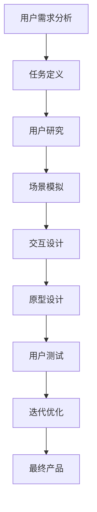

                 

关键词：任务导向设计思维、CUI、用户界面设计、用户体验、人工智能、交互设计、技术实现、案例研究。

## 摘要

随着人工智能技术的不断发展和普及，计算机用户界面（CUI）的设计和优化变得尤为重要。任务导向设计思维作为一种系统性的设计方法，不仅适用于传统软件界面设计，也同样适用于CUI的设计与开发。本文将深入探讨任务导向设计思维在CUI中的应用，从核心概念到具体实践，解析其在提升用户体验、优化交互流程和实现智能化的关键作用。

本文结构如下：

- 背景介绍：介绍任务导向设计思维的发展背景和CUI的重要性。
- 核心概念与联系：阐述任务导向设计思维的基本概念，并通过Mermaid流程图展示其在CUI设计中的流程节点。
- 核心算法原理 & 具体操作步骤：详细分析任务导向设计思维的具体操作步骤，并讨论其优缺点和应用领域。
- 数学模型和公式 & 详细讲解 & 举例说明：介绍与任务导向设计思维相关的数学模型和公式，并通过案例进行说明。
- 项目实践：提供实际开发中的代码实例和详细解释。
- 实际应用场景：分析任务导向设计思维在不同场景下的应用。
- 未来应用展望：探讨任务导向设计思维在未来的发展趋势和挑战。

## 1. 背景介绍

任务导向设计思维起源于工业设计和用户体验设计领域，其核心思想是将设计过程围绕用户任务进行，旨在通过系统化和结构化的方法，提高用户完成任务的效果和满意度。随着人工智能技术的发展，计算机用户界面（CUI）逐渐取代了传统的图形用户界面（GUI），成为人机交互的主要形式。CUI具有快速响应、灵活性强和智能化等特点，使得任务导向设计思维的应用更加广泛和深入。

CUI的重要性体现在以下几个方面：

1. **交互效率**：CUI能够通过自然语言处理和智能响应，提高用户与系统之间的交互效率。
2. **用户体验**：任务导向设计思维强调以用户为中心，通过优化交互流程和设计，提升用户体验。
3. **智能化**：CUI结合人工智能技术，能够实现智能化的任务执行和决策支持。

## 2. 核心概念与联系

任务导向设计思维（Task-Oriented Design Thinking, TDDT）是一种以任务为核心的设计方法。其基本概念包括：

- **任务**：用户需要完成的具体目标。
- **用户**：与系统交互的主体。
- **系统**：提供服务和功能的计算机程序。
- **流程**：用户完成任务所需的步骤和路径。

以下是一个简化的Mermaid流程图，展示了任务导向设计思维在CUI设计中的应用流程：

### 任务定义

任务定义是任务导向设计思维的第一步。通过分析用户需求，明确用户需要完成的任务目标。这一过程通常包括以下步骤：

1. **需求收集**：通过访谈、问卷等方式收集用户的需求和痛点。
2. **需求分析**：对收集到的需求进行整理和分析，提取核心任务。
3. **任务细化**：将任务分解为更小、可管理的子任务。

### 用户研究

用户研究旨在深入了解用户的行为、习惯和偏好。通过用户研究，设计师能够更好地理解用户的需求和任务执行过程。用户研究的方法包括：

- **用户访谈**：直接与用户进行交流，了解他们的需求和行为。
- **用户行为分析**：通过数据分析，了解用户在系统中的行为模式。
- **用户场景模拟**：通过模拟用户操作，验证设计方案的可行性。

### 场景模拟

场景模拟是一种模拟用户在真实环境中使用系统的过程。通过场景模拟，设计师能够识别出潜在的问题和改进点。场景模拟通常包括以下步骤：

1. **场景设计**：设计用户完成任务的具体场景。
2. **模拟操作**：模拟用户在系统中的操作流程。
3. **问题识别**：识别场景模拟中存在的问题和不足。

### 交互设计

交互设计是任务导向设计思维的核心环节。通过交互设计，设计师能够优化用户与系统的交互过程，提高任务完成效率。交互设计的方法包括：

- **流程设计**：设计用户完成任务所需的步骤和路径。
- **界面布局**：优化界面布局，提高用户的操作舒适度。
- **交互反馈**：提供及时、明确的交互反馈，增强用户的信心和满意度。

### 原型设计

原型设计是任务导向设计思维的重要步骤。通过原型设计，设计师能够验证设计方案的可行性和用户满意度。原型设计的方法包括：

- **低保真原型**：通过草图、线框图等低保真原型，快速验证设计思路。
- **高保真原型**：通过高保真原型，模拟最终产品的视觉效果和交互效果。
- **用户测试**：通过用户测试，收集用户对原型的反馈和建议。

### 用户测试

用户测试是任务导向设计思维的最后一步。通过用户测试，设计师能够验证设计方案的可行性和用户满意度。用户测试的方法包括：

- **A/B测试**：将不同的设计方案呈现给用户，比较其效果。
- **迭代优化**：根据用户反馈，不断优化设计方案。
- **用户调研**：通过调研了解用户对产品的满意度和使用习惯。

### 迭代优化

迭代优化是任务导向设计思维的持续过程。通过不断的迭代和优化，设计师能够不断提升产品的用户体验和任务完成效率。

## 3. 核心算法原理 & 具体操作步骤

### 3.1 算法原理概述

任务导向设计思维的核心算法原理可以归纳为以下几个方面：

1. **用户行为分析**：通过数据分析和用户行为模型，理解用户的需求和行为模式。
2. **任务分解**：将用户任务分解为更小、更具体的子任务，以便于管理和优化。
3. **流程优化**：通过分析任务执行过程中的瓶颈和障碍，优化用户任务执行的流程。
4. **交互设计**：设计直观、易用的交互界面，提高用户完成任务的效果和满意度。

### 3.2 算法步骤详解

任务导向设计思维的具体操作步骤如下：

1. **需求分析**：
    - **步骤1**：收集用户需求，包括用户访谈、问卷调查、用户行为分析等。
    - **步骤2**：整理和分析需求，提取核心任务。
    - **步骤3**：将任务细化为更小、可管理的子任务。

2. **用户研究**：
    - **步骤1**：进行用户访谈，了解用户的需求和行为模式。
    - **步骤2**：分析用户行为数据，构建用户行为模型。
    - **步骤3**：模拟用户操作场景，验证设计方案的可行性。

3. **场景模拟**：
    - **步骤1**：设计用户完成任务的具体场景。
    - **步骤2**：模拟用户在系统中的操作流程。
    - **步骤3**：识别场景模拟中存在的问题和不足。

4. **交互设计**：
    - **步骤1**：设计用户完成任务所需的步骤和路径。
    - **步骤2**：优化界面布局，提高用户的操作舒适度。
    - **步骤3**：提供及时、明确的交互反馈。

5. **原型设计**：
    - **步骤1**：创建低保真原型，快速验证设计思路。
    - **步骤2**：创建高保真原型，模拟最终产品的视觉效果和交互效果。
    - **步骤3**：进行用户测试，收集用户反馈。

6. **用户测试**：
    - **步骤1**：进行A/B测试，比较不同设计方案的效果。
    - **步骤2**：根据用户反馈，不断优化设计方案。
    - **步骤3**：进行用户调研，了解用户对产品的满意度和使用习惯。

7. **迭代优化**：
    - **步骤1**：根据用户测试结果，识别问题和改进点。
    - **步骤2**：进行迭代优化，提升用户体验和任务完成效率。

### 3.3 算法优缺点

任务导向设计思维的优点包括：

- **用户为中心**：以用户需求为中心，提高用户体验。
- **结构化**：通过任务分解和流程优化，使设计过程更加系统化。
- **灵活**：通过原型设计和用户测试，使设计过程更加灵活。

任务导向设计思维的缺点包括：

- **时间成本**：需要进行大量的用户研究和原型测试，可能需要更多的时间和资源。
- **数据依赖**：用户行为数据的准确性和完整性对设计效果有重要影响。

### 3.4 算法应用领域

任务导向设计思维可以广泛应用于以下领域：

- **软件开发**：通过任务导向设计思维，优化软件的用户体验和任务完成效率。
- **界面设计**：通过任务导向设计思维，设计直观、易用的用户界面。
- **人工智能**：通过任务导向设计思维，优化人工智能系统的交互过程和任务执行效果。

## 4. 数学模型和公式 & 详细讲解 & 举例说明

### 4.1 数学模型构建

在任务导向设计思维中，常用的数学模型包括用户行为模型、任务完成时间模型和用户体验模型。

#### 用户行为模型

用户行为模型用于描述用户在系统中的行为模式。常见的用户行为模型包括：

- **马尔可夫模型**：用于描述用户在系统中的状态转移过程。
- **泊松模型**：用于描述用户在系统中的到达过程。

#### 任务完成时间模型

任务完成时间模型用于预测用户完成任务所需的时间。常见的任务完成时间模型包括：

- **加法模型**：用于计算多个任务完成时间之和。
- **乘法模型**：用于计算多个任务完成时间的乘积。

#### 用户体验模型

用户体验模型用于评估用户对系统的满意度。常见

