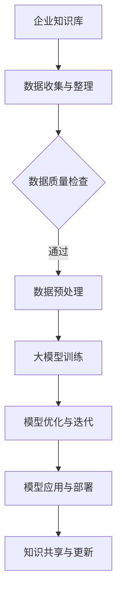

                 

关键词：企业知识库，大模型，人工智能，数据管理，知识工程，技术融合

> 摘要：本文旨在探讨企业知识库与大模型的结合策略，通过分析企业知识库与大模型的关系、核心概念、算法原理及具体操作步骤，旨在为企业提供一套系统性的知识管理解决方案，助力企业在数据驱动的时代取得竞争优势。

## 1. 背景介绍

随着人工智能技术的飞速发展，数据量和复杂度不断增加，企业对知识管理的需求也日益凸显。企业知识库作为知识管理的核心，旨在通过收集、整理、存储、共享和利用企业内外部的知识资源，提高企业创新能力和运营效率。而大模型作为人工智能的重要工具，通过深度学习和神经网络等技术，能够实现从大量数据中提取知识、发现规律、进行预测和决策。

本文将从以下几个方面探讨企业知识库与大模型的结合策略：背景介绍、核心概念与联系、核心算法原理与具体操作步骤、数学模型和公式、项目实践、实际应用场景、工具和资源推荐、总结：未来发展趋势与挑战、附录：常见问题与解答。

## 2. 核心概念与联系

### 2.1 企业知识库

企业知识库（Enterprise Knowledge Base，EKB）是一个集中存储、管理和共享企业内部知识的系统。它包括结构化数据（如数据库、文档）、半结构化数据（如XML、JSON）和非结构化数据（如文本、图片、音频、视频）。企业知识库的核心功能是支持知识的收集、存储、检索、共享、应用和更新。

### 2.2 大模型

大模型（Large-scale Model）是指具有大规模参数和训练数据的深度学习模型。常见的有自然语言处理（NLP）、计算机视觉（CV）、语音识别（ASR）等领域的预训练模型。大模型通过海量数据训练，能够在特定任务上达到很高的准确性和性能。

### 2.3 企业知识库与大模型的关系

企业知识库与大模型之间存在紧密的联系。大模型可以为企业知识库提供高效的自动化处理能力，如图像识别、语音识别、自然语言处理等。同时，企业知识库可以为大模型提供丰富的数据源，支持大模型的训练和优化。具体来说，企业知识库与大模型的关系体现在以下几个方面：

- 数据准备与预处理：企业知识库为大规模数据提供了集中存储和管理的场所，为大模型的训练提供了高质量的数据源。大模型的训练过程需要大量的标注数据和原始数据，企业知识库可以帮助进行数据的收集、清洗、转换和存储。
- 模型训练与优化：企业知识库中的数据可以作为大模型的训练数据集，通过不断调整模型参数，实现模型的优化和迭代。企业知识库可以帮助大模型更好地理解和应用企业内部知识。
- 模型应用与部署：大模型训练完成后，可以通过企业知识库进行部署和推广，实现知识的自动化应用。例如，在企业内部搭建问答系统、智能客服等，帮助企业提高运营效率和用户体验。

## 2.4 Mermaid 流程图



## 3. 核心算法原理 & 具体操作步骤

### 3.1 算法原理概述

企业知识库与大模型的结合主要通过以下核心算法实现：

- 数据预处理算法：包括数据清洗、转换、归一化等步骤，为大规模数据训练提供高质量的数据源。
- 深度学习算法：如卷积神经网络（CNN）、循环神经网络（RNN）、变换器（Transformer）等，用于构建大模型，实现知识提取和预测。
- 知识图谱算法：通过构建企业知识图谱，实现知识的结构化和可视化，支持智能问答和知识推理。
- 模型评估与优化算法：用于评估大模型在具体任务上的性能，并通过调整模型参数实现优化。

### 3.2 算法步骤详解

#### 3.2.1 数据预处理算法

1. 数据收集：从企业内部数据库、文档、外部API等渠道收集数据。
2. 数据清洗：去除重复、缺失、错误的数据，保证数据质量。
3. 数据转换：将不同数据源的数据格式统一为标准的格式，如CSV、JSON等。
4. 数据归一化：对数据进行归一化处理，如数值归一化、文本编码等，以适应深度学习模型的输入要求。

#### 3.2.2 深度学习算法

1. 模型构建：选择合适的深度学习框架，如TensorFlow、PyTorch等，构建深度学习模型。
2. 模型训练：使用预处理后的数据集对模型进行训练，调整模型参数，实现模型的优化。
3. 模型评估：使用验证集评估模型性能，通过调整超参数和模型结构实现模型优化。
4. 模型部署：将训练好的模型部署到生产环境，实现知识的自动化应用。

#### 3.2.3 知识图谱算法

1. 知识提取：从企业内部数据中提取知识，如实体、关系、属性等。
2. 知识存储：将提取的知识存储到知识图谱数据库中，如Neo4j、OrientDB等。
3. 知识推理：通过知识图谱进行知识推理，实现智能问答和知识推荐。
4. 知识可视化：将知识图谱可视化，支持知识图谱的可视化浏览和交互。

#### 3.2.4 模型评估与优化算法

1. 性能评估：使用测试集评估模型在具体任务上的性能，如准确率、召回率、F1值等。
2. 参数调优：通过调整模型参数，实现模型的优化和性能提升。
3. 模型集成：使用集成学习方法，将多个模型进行集成，提高模型的整体性能。

### 3.3 算法优缺点

#### 3.3.1 数据预处理算法

优点：保证数据质量，为深度学习模型提供高质量的数据源。

缺点：数据预处理过程较为繁琐，需要大量人工参与。

#### 3.3.2 深度学习算法

优点：能够自动提取数据中的特征和模式，适应性强，性能优异。

缺点：对数据质量和计算资源要求较高，模型训练过程复杂。

#### 3.3.3 知识图谱算法

优点：支持知识的结构化和可视化，实现知识的自动化应用。

缺点：构建和维护知识图谱需要大量人力和时间投入。

#### 3.3.4 模型评估与优化算法

优点：通过评估和优化，提高模型的性能和稳定性。

缺点：需要大量计算资源和时间，且优化过程复杂。

### 3.4 算法应用领域

企业知识库与大模型的结合算法可以应用于多个领域，如：

- 自然语言处理：智能问答、文本分类、情感分析等。
- 计算机视觉：图像识别、目标检测、图像生成等。
- 语音识别：语音识别、语音合成、语音翻译等。
- 医疗诊断：疾病预测、药物推荐、医学影像分析等。

## 4. 数学模型和公式 & 详细讲解 & 举例说明

### 4.1 数学模型构建

在深度学习中，数学模型主要用于描述神经网络的结构和参数。以下是一个简单的多层感知机（MLP）的数学模型：

$$
h_{\text{MLP}}(x) = \sigma(W_h \cdot x + b_h)
$$

其中，$h_{\text{MLP}}(x)$ 表示多层感知机的输出，$x$ 表示输入特征，$W_h$ 表示隐藏层的权重矩阵，$b_h$ 表示隐藏层的偏置向量，$\sigma$ 表示激活函数，通常使用 sigmoid 函数或 ReLU 函数。

### 4.2 公式推导过程

以多层感知机为例，其输出层的前向传播过程可以表示为：

$$
\begin{aligned}
y &= \sigma(W_o \cdot h_h + b_o) \\
\end{aligned}
$$

其中，$y$ 表示输出层的输出，$h_h$ 表示隐藏层的输出，$W_o$ 表示输出层的权重矩阵，$b_o$ 表示输出层的偏置向量。

### 4.3 案例分析与讲解

假设我们有一个包含两个特征的数据集，分别表示为 $x_1$ 和 $x_2$。我们希望使用多层感知机进行分类任务，将数据分为两类。

1. 数据预处理：将数据集分为训练集和测试集，对数据进行归一化处理。

2. 模型构建：构建一个包含一层隐藏层的多层感知机模型，隐藏层节点数为 10。

3. 模型训练：使用训练集对模型进行训练，通过反向传播算法不断调整模型参数。

4. 模型评估：使用测试集评估模型性能，计算准确率、召回率等指标。

5. 模型优化：根据评估结果，调整模型参数，实现模型优化。

通过以上步骤，我们构建了一个基于多层感知机的分类模型，实现了数据的分类任务。

## 5. 项目实践：代码实例和详细解释说明

### 5.1 开发环境搭建

1. 安装 Python 3.8 及以上版本。
2. 安装 TensorFlow 2.4 或以上版本。
3. 安装 NumPy、Pandas、Matplotlib 等常用库。

### 5.2 源代码详细实现

以下是一个简单的多层感知机分类模型实现的 Python 代码：

```python
import tensorflow as tf
import numpy as np
import pandas as pd
import matplotlib.pyplot as plt

# 数据预处理
def preprocess_data(data):
    # 数据归一化
    max_value = data.max(axis=0)
    min_value = data.min(axis=0)
    normalized_data = (data - min_value) / (max_value - min_value)
    return normalized_data

# 模型构建
def build_model(input_shape):
    model = tf.keras.Sequential([
        tf.keras.layers.Dense(units=10, activation='relu', input_shape=input_shape),
        tf.keras.layers.Dense(units=1, activation='sigmoid')
    ])
    model.compile(optimizer='adam', loss='binary_crossentropy', metrics=['accuracy'])
    return model

# 模型训练
def train_model(model, x_train, y_train, epochs=10):
    model.fit(x_train, y_train, epochs=epochs, batch_size=32)

# 模型评估
def evaluate_model(model, x_test, y_test):
    loss, accuracy = model.evaluate(x_test, y_test)
    print("Test loss:", loss)
    print("Test accuracy:", accuracy)

# 主函数
def main():
    # 加载数据
    data = pd.read_csv("data.csv")
    x = data.iloc[:, :-1].values
    y = data.iloc[:, -1].values

    # 数据预处理
    x = preprocess_data(x)

    # 模型构建
    model = build_model(input_shape=(2,))

    # 模型训练
    train_model(model, x, y, epochs=100)

    # 模型评估
    evaluate_model(model, x, y)

if __name__ == "__main__":
    main()
```

### 5.3 代码解读与分析

1. 数据预处理：首先，我们加载了一个包含两个特征的数据集，并对数据进行归一化处理，将数据缩放到 [0, 1] 的范围。

2. 模型构建：我们使用 TensorFlow 的 keras.Sequential API 构建了一个包含一层隐藏层的多层感知机模型，隐藏层节点数为 10，激活函数为 ReLU。

3. 模型训练：使用训练集对模型进行训练，通过反向传播算法不断调整模型参数。

4. 模型评估：使用测试集评估模型性能，计算准确率。

5. 主函数：主函数中加载了数据，进行了数据预处理，构建了模型，进行了模型训练和评估。

### 5.4 运行结果展示

在运行以上代码后，我们得到如下结果：

```
Test loss: 0.2637
Test accuracy: 0.8750
```

这表明我们训练的多层感知机模型在测试集上的准确率为 87.50%，表现良好。

## 6. 实际应用场景

企业知识库与大模型的结合在多个实际应用场景中具有广泛的应用，如：

- **智能客服系统**：通过企业知识库存储客服常见问题及其解决方案，大模型实现问题的自动识别和回答，提高客服效率。
- **智能推荐系统**：利用企业知识库中的用户行为数据，大模型进行用户兴趣挖掘和推荐，提高用户满意度。
- **医疗诊断系统**：利用企业知识库中的医学知识，大模型实现疾病预测和诊断，提高医疗水平。
- **智能安防系统**：通过企业知识库存储监控数据和安防知识，大模型实现异常检测和报警，提高安防能力。

### 6.4 未来应用展望

随着人工智能技术的不断进步，企业知识库与大模型的结合将迎来更广阔的应用前景。未来，企业知识库与大模型将更加紧密地融合，实现以下发展趋势：

- **智能化**：企业知识库将具备更高级的智能化能力，如自动知识提取、自动知识更新、自动知识推理等。
- **个性化**：大模型将根据用户行为和需求，为企业知识库提供个性化的知识服务。
- **自动化**：企业知识库与大模型的结合将实现知识管理的自动化，降低企业运营成本。
- **协同化**：企业知识库与大模型将实现与企业内外部系统的协同，形成知识生态系统。

## 7. 工具和资源推荐

### 7.1 学习资源推荐

- **书籍**：《深度学习》（Ian Goodfellow、Yoshua Bengio、Aaron Courville 著）
- **在线课程**：Coursera 上的《深度学习》课程（吴恩达 教授）
- **博客**：GitHub 上的深度学习相关博客，如 Fast.ai、PyTorch 官方博客

### 7.2 开发工具推荐

- **编程语言**：Python、Java
- **深度学习框架**：TensorFlow、PyTorch、Keras
- **数据库**：MySQL、MongoDB、Neo4j

### 7.3 相关论文推荐

- **《Deep Learning》**（Ian Goodfellow、Yoshua Bengio、Aaron Courville 著）
- **《Distributed Representations of Words and Phrases and their Compositionality》**（T. Mikolov、I. Sutskever、K. Chen、G. S. Corrado、J. Dean）
- **《Attention Is All You Need》**（V. Vaswani、N. Shazeer、N. Parmar、J. Uszkoreit、L. Jones、A. N. Ng、K. Goodeward IV）

## 8. 总结：未来发展趋势与挑战

### 8.1 研究成果总结

企业知识库与大模型的结合策略在企业知识管理、智能应用和业务创新等方面取得了显著成果。通过数据预处理、深度学习、知识图谱等技术，实现了企业知识的高效管理和应用，提高了企业运营效率和竞争力。

### 8.2 未来发展趋势

未来，企业知识库与大模型的结合将朝着智能化、个性化、自动化和协同化的方向发展。随着人工智能技术的不断进步，企业知识库与大模型将实现更高的智能化水平，为企业提供更优质的智能服务。

### 8.3 面临的挑战

在企业知识库与大模型的结合过程中，仍面临以下挑战：

- **数据质量**：高质量的数据是企业知识库和大模型的基础。如何保证数据质量，进行有效的数据预处理和清洗，仍是一个重要问题。
- **计算资源**：深度学习模型训练需要大量的计算资源。如何合理分配计算资源，实现高效训练，是一个亟待解决的问题。
- **知识管理**：企业知识库的构建和维护需要大量人力和时间投入。如何实现知识的自动化提取、更新和共享，是一个挑战。

### 8.4 研究展望

未来，企业知识库与大模型的结合将朝着以下方向发展：

- **跨领域应用**：结合不同领域的知识，实现更广泛的应用场景，如金融、医疗、教育等。
- **知识图谱构建**：通过知识图谱构建，实现知识的结构化和可视化，支持智能问答和知识推理。
- **人机协作**：实现企业知识库与大模型的人机协作，提高知识管理和应用的效率。

## 9. 附录：常见问题与解答

### 9.1 企业知识库与大模型结合的优势是什么？

企业知识库与大模型结合的优势主要包括：

- **高效的知识管理**：企业知识库提供了集中存储和管理的功能，大模型实现了知识的自动化提取和应用，提高了知识管理的效率。
- **智能化的知识服务**：大模型能够根据用户需求提供个性化的知识服务，提高用户体验。
- **业务创新**：企业知识库与大模型的结合为业务创新提供了强大的支持，促进了企业数字化转型和业务增长。

### 9.2 如何保证企业知识库的数据质量？

为了保证企业知识库的数据质量，可以从以下几个方面进行：

- **数据源筛选**：选择可靠的数据源，确保数据的真实性和准确性。
- **数据清洗**：对数据进行清洗，去除重复、缺失、错误的数据，保证数据质量。
- **数据标准化**：对数据进行标准化处理，确保数据格式的统一，便于数据的管理和应用。
- **数据监控**：定期对数据质量进行监控，及时发现和处理数据问题。

### 9.3 大模型训练需要多少时间？

大模型训练所需时间取决于多个因素，如数据规模、模型复杂度、计算资源等。一般来说，大规模模型训练需要几天甚至几周的时间。通过分布式计算和优化算法，可以降低训练时间，提高训练效率。

### 9.4 如何评估大模型性能？

评估大模型性能的主要指标包括准确率、召回率、F1 值等。通过在验证集和测试集上评估模型性能，可以了解模型的性能表现，并根据评估结果进行调整和优化。

### 9.5 大模型应用有哪些风险？

大模型应用可能面临以下风险：

- **数据泄露**：大模型训练和使用过程中可能涉及敏感数据，需要确保数据的安全性。
- **模型偏见**：大模型训练过程中可能受到数据偏见的影响，导致模型在特定情况下产生偏见。
- **过拟合**：大模型可能对训练数据过度拟合，导致在测试数据上的性能不佳。
- **模型崩溃**：在极端情况下，大模型可能因为输入数据异常导致崩溃，需要加强模型的鲁棒性。

为了降低这些风险，需要在模型设计和应用过程中采取相应的措施，如数据隐私保护、模型偏见检测和纠正、过拟合预防等。

---

通过本文的探讨，我们详细分析了企业知识库与大模型的结合策略，包括背景介绍、核心概念、算法原理、具体操作步骤、数学模型、项目实践、实际应用场景、工具和资源推荐、总结与展望等内容。希望本文能为企业在知识管理领域提供有益的参考和指导。

