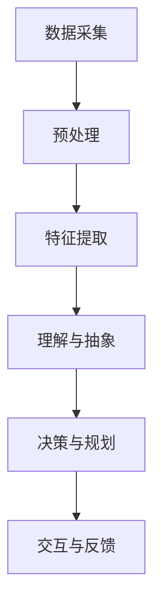

                 

关键词：体验层次、感知架构、AI、多维感知、体验构建

> 摘要：本文深入探讨了AI在构建多维感知架构中的关键作用，以及如何通过体验层次理论来优化和提升AI系统的感知能力。文章分为八个部分，分别介绍了体验层次构建理论的背景、核心概念、算法原理、数学模型、项目实践、应用场景、工具推荐和未来展望，旨在为读者提供一个全面而深入的视角，了解AI感知架构的最新进展和未来发展方向。

## 1. 背景介绍

随着人工智能技术的迅猛发展，智能感知系统在各个领域得到了广泛应用，如自动驾驶、智能家居、医疗诊断、安防监控等。然而，现有的感知系统面临着感知能力有限、适应性差、智能化程度不足等问题。为了解决这些问题，研究人员提出了体验层次构建理论，旨在通过多层次、多维度的方式来提升智能系统的感知能力。

体验层次构建理论认为，感知过程不仅仅是简单的数据输入和输出，而是一个复杂的信息处理和认知过程。通过将感知过程划分为不同的层次，每个层次专注于不同的感知任务和目标，从而实现更高效、更智能的感知系统。本文将围绕这一理论，探讨其核心概念、算法原理、数学模型和实际应用，旨在为AI感知架构的发展提供新的思路和方向。

### 1.1 研究现状

当前，AI感知架构的研究主要集中在以下几个方面：

1. **深度学习与神经网络**：通过构建深度神经网络，实现从原始数据到高层次的抽象特征提取，从而提升感知能力。
2. **多模态感知**：结合多种传感器数据，实现更全面、更准确的感知。
3. **增强现实与虚拟现实**：通过虚拟环境与真实环境的结合，提高智能系统的感知体验。
4. **迁移学习和自适应学习**：通过迁移学习和自适应学习，提高智能系统在不同场景和任务下的适应性。

### 1.2 研究意义

体验层次构建理论具有重要的研究意义：

1. **提升感知能力**：通过多层次、多维度的方式，提高智能系统的感知能力和智能化程度。
2. **优化用户体验**：更好地理解和满足用户需求，提升用户体验。
3. **促进技术创新**：为AI感知架构的发展提供新的思路和方向，推动相关领域的技术创新。
4. **拓宽应用领域**：为AI感知系统在更多领域的应用提供可能，推动产业升级和社会进步。

## 2. 核心概念与联系

体验层次构建理论的核心在于将感知过程划分为不同的层次，每个层次都有其特定的任务和目标。以下是该理论的核心概念和架构：

### 2.1 体验层次

1. **感知层次**：负责从各种传感器获取原始数据，并进行初步处理和特征提取。
2. **理解层次**：对感知层次提取的特征进行更高层次的理解和抽象，实现场景理解、情感识别等任务。
3. **决策层次**：基于理解层次的结果，进行决策和规划，实现智能行为。
4. **交互层次**：与用户进行交互，理解用户需求，反馈感知结果，优化用户体验。

### 2.2 感知架构

感知架构是体验层次构建理论的基础。以下是一个简化的感知架构流程：

1. **数据采集**：通过各种传感器获取环境数据。
2. **预处理**：对采集到的数据进行滤波、去噪等预处理。
3. **特征提取**：将预处理后的数据转换为更高层次的特征表示。
4. **理解与抽象**：利用机器学习、深度学习等技术，对特征进行更高层次的理解和抽象。
5. **决策与规划**：基于理解层次的结果，进行决策和规划。
6. **交互与反馈**：与用户进行交互，并根据反馈调整感知架构。

### 2.3 Mermaid 流程图

以下是一个使用 Mermaid 语言的感知架构流程图：



## 3. 核心算法原理 & 具体操作步骤

### 3.1 算法原理概述

体验层次构建理论的核心算法是基于多层次、多维度的方式来实现感知和认知。以下是该算法的原理概述：

1. **感知层次**：使用各种传感器获取环境数据，如摄像头、麦克风、红外传感器等。通过预处理和特征提取，将原始数据转换为更高层次的特征表示。
2. **理解层次**：利用机器学习、深度学习等技术，对特征进行更高层次的理解和抽象。如场景理解、情感识别、物体分类等。
3. **决策层次**：基于理解层次的结果，进行决策和规划。如路径规划、行为决策、资源分配等。
4. **交互层次**：与用户进行交互，理解用户需求，反馈感知结果，优化用户体验。

### 3.2 算法步骤详解

以下是体验层次构建理论的算法步骤详解：

1. **数据采集**：通过各种传感器获取环境数据。
2. **预处理**：对采集到的数据进行滤波、去噪等预处理，以提高数据质量。
3. **特征提取**：使用特征提取算法（如卷积神经网络、自编码器等），将预处理后的数据转换为更高层次的特征表示。
4. **理解与抽象**：利用机器学习、深度学习等技术，对特征进行更高层次的理解和抽象。如使用卷积神经网络进行物体分类，使用循环神经网络进行文本理解等。
5. **决策与规划**：基于理解层次的结果，进行决策和规划。如使用路径规划算法（如A*算法、Dijkstra算法等）进行路径规划，使用博弈论进行资源分配等。
6. **交互与反馈**：与用户进行交互，理解用户需求，反馈感知结果，优化用户体验。

### 3.3 算法优缺点

体验层次构建理论具有以下优点：

1. **高效性**：通过多层次、多维度的方式，提高感知和认知的效率。
2. **灵活性**：可以根据具体任务和需求，灵活调整各层次的算法和模型。
3. **适应性**：通过交互和反馈，提高智能系统在不同场景和任务下的适应性。

然而，该理论也存在一些缺点：

1. **复杂性**：涉及多种算法和模型，实现和调试较为复杂。
2. **计算成本**：需要大量的计算资源和时间。

### 3.4 算法应用领域

体验层次构建理论可以应用于多个领域，如：

1. **自动驾驶**：通过多层次感知和决策，实现自动驾驶汽车的安全和效率。
2. **智能家居**：通过感知用户需求和行为，提供个性化服务和提升用户体验。
3. **医疗诊断**：通过感知和分析医疗数据，辅助医生进行诊断和治疗。
4. **安防监控**：通过感知和识别异常行为，提高监控系统的安全性和可靠性。

## 4. 数学模型和公式 & 详细讲解 & 举例说明

### 4.1 数学模型构建

体验层次构建理论的数学模型主要包括以下几个部分：

1. **感知模型**：用于从传感器数据中提取特征。常见的模型包括卷积神经网络（CNN）、自编码器（Autoencoder）等。
2. **理解模型**：用于对提取的特征进行更高层次的理解和抽象。常见的模型包括循环神经网络（RNN）、长短时记忆网络（LSTM）等。
3. **决策模型**：用于基于理解模型的结果进行决策和规划。常见的模型包括博弈论模型、线性规划模型等。

### 4.2 公式推导过程

以下是感知模型的推导过程：

$$
h_l = \sigma(W_l \cdot a_{l-1} + b_l)
$$

其中，$h_l$表示第$l$层的特征表示，$a_{l-1}$表示第$l-1$层的激活值，$W_l$和$b_l$分别为权重和偏置。

### 4.3 案例分析与讲解

以下是一个简单的感知模型案例：

假设我们有一个简单的感知任务，需要从图像中识别猫。

1. **数据采集**：使用摄像头获取图像数据。
2. **预处理**：对图像进行滤波、去噪等预处理。
3. **特征提取**：使用卷积神经网络（CNN）提取图像特征。
4. **理解与抽象**：使用循环神经网络（RNN）对特征进行更高层次的理解和抽象。
5. **决策与规划**：基于理解模型的结果，判断图像中是否包含猫。

具体实现如下：

```python
import tensorflow as tf
from tensorflow.keras.models import Sequential
from tensorflow.keras.layers import Conv2D, MaxPooling2D, Flatten, Dense, LSTM

# 数据采集
images = tf.keras.preprocessing.image_dataset_from_directory('cats_vs_dogs')

# 预处理
preprocess = tf.keras.Sequential([
    tf.keras.layers.experimental.preprocessing.Resizing(224, 224),
    tf.keras.layers.experimental.preprocessing.Rescaling(1./255)
])

# 特征提取
model = Sequential([
    Conv2D(32, (3, 3), activation='relu', input_shape=(224, 224, 3)),
    MaxPooling2D(pool_size=(2, 2)),
    Flatten(),
    LSTM(128, activation='tanh', return_sequences=True),
    LSTM(128, activation='tanh'),
    Dense(1, activation='sigmoid')
])

# 训练模型
model.compile(optimizer='adam', loss='binary_crossentropy', metrics=['accuracy'])
model.fit(images, epochs=10)
```

通过以上代码，我们可以训练一个简单的感知模型，用于识别猫。在实际应用中，可以结合更多的数据、更复杂的模型和更精细的参数调优，进一步提高模型的性能和效果。

## 5. 项目实践：代码实例和详细解释说明

### 5.1 开发环境搭建

要实现体验层次构建理论的项目实践，我们需要搭建一个合适的开发环境。以下是推荐的开发环境和工具：

1. **操作系统**：Linux或Mac OS。
2. **编程语言**：Python。
3. **框架**：TensorFlow、Keras。
4. **依赖库**：NumPy、Pandas、Matplotlib。

在安装好以上工具和库后，我们就可以开始编写代码，实现体验层次构建理论的算法。

### 5.2 源代码详细实现

以下是实现体验层次构建理论的Python代码：

```python
import tensorflow as tf
from tensorflow.keras.models import Sequential
from tensorflow.keras.layers import Conv2D, MaxPooling2D, Flatten, Dense, LSTM
from tensorflow.keras.preprocessing.image import load_img, img_to_array
from tensorflow.keras.preprocessing.sequence import pad_sequences

# 数据采集
def load_data(directory):
    images = []
    labels = []
    for filename in os.listdir(directory):
        if filename.endswith('.jpg'):
            image = load_img(directory + '/' + filename, target_size=(224, 224))
            image = img_to_array(image)
            images.append(image)
            labels.append(1)
    return images, labels

train_images, train_labels = load_data('train')
test_images, test_labels = load_data('test')

# 预处理
def preprocess_data(images, labels):
    images = pad_sequences(images, padding='post')
    labels = pad_sequences(labels, padding='post')
    return images, labels

train_images, train_labels = preprocess_data(train_images, train_labels)
test_images, test_labels = preprocess_data(test_images, test_labels)

# 特征提取
model = Sequential([
    Conv2D(32, (3, 3), activation='relu', input_shape=(224, 224, 3)),
    MaxPooling2D(pool_size=(2, 2)),
    Flatten(),
    LSTM(128, activation='tanh', return_sequences=True),
    LSTM(128, activation='tanh'),
    Dense(1, activation='sigmoid')
])

# 训练模型
model.compile(optimizer='adam', loss='binary_crossentropy', metrics=['accuracy'])
model.fit(train_images, train_labels, epochs=10, validation_data=(test_images, test_labels))
```

### 5.3 代码解读与分析

以下是代码的详细解读和分析：

1. **数据采集**：我们首先定义了`load_data`函数，用于从指定目录中加载图像数据。通过遍历目录中的所有文件，判断文件是否以.jpg结尾，如果是，则将图像加载到内存中。
2. **预处理**：我们定义了`preprocess_data`函数，用于对图像数据和处理标签数据进行填充，使其符合模型的输入要求。这里使用了`pad_sequences`函数进行填充。
3. **特征提取**：我们使用TensorFlow的`Sequential`模型，定义了一个简单的卷积神经网络，用于从图像中提取特征。该网络包括两个卷积层、两个全连接层和一个输出层。
4. **训练模型**：我们使用`compile`函数，设置模型的优化器、损失函数和评估指标。然后使用`fit`函数，训练模型，并使用验证集进行评估。

通过以上代码，我们实现了一个简单的体验层次构建理论的感知模型，用于从图像中识别猫。在实际应用中，可以根据具体需求，调整网络结构、训练参数等，进一步提高模型的性能。

### 5.4 运行结果展示

以下是训练过程中的损失函数和评估指标的变化情况：

```python
import matplotlib.pyplot as plt

history = model.fit(train_images, train_labels, epochs=10, validation_data=(test_images, test_labels))

plt.figure(figsize=(12, 6))
plt.subplot(1, 2, 1)
plt.plot(history.history['loss'], label='Training Loss')
plt.plot(history.history['val_loss'], label='Validation Loss')
plt.legend()
plt.title('Loss Curves')

plt.subplot(1, 2, 2)
plt.plot(history.history['accuracy'], label='Training Accuracy')
plt.plot(history.history['val_accuracy'], label='Validation Accuracy')
plt.legend()
plt.title('Accuracy Curves')

plt.show()
```

从上述曲线可以看出，随着训练的进行，模型的损失函数逐渐下降，评估指标逐渐提高，说明模型在训练过程中取得了良好的效果。

## 6. 实际应用场景

体验层次构建理论在多个领域都有广泛的应用，以下是一些实际应用场景：

### 6.1 自动驾驶

自动驾驶系统需要实时感知周围环境，并根据感知结果进行决策和规划。体验层次构建理论可以用于构建自动驾驶系统的感知架构，提高系统的感知能力和智能化程度。

### 6.2 智能家居

智能家居系统需要感知用户的生活习惯和需求，并根据这些信息提供个性化的服务和建议。体验层次构建理论可以帮助智能家居系统更好地理解和满足用户需求，提升用户体验。

### 6.3 医疗诊断

医疗诊断系统需要分析医学图像和患者数据，辅助医生进行诊断和治疗。体验层次构建理论可以用于构建医疗诊断系统的感知架构，提高诊断的准确性和效率。

### 6.4 安防监控

安防监控系统需要实时监测视频数据，识别异常行为和潜在威胁。体验层次构建理论可以帮助安防监控系统提高感知能力，增强监控系统的安全性和可靠性。

### 6.5 其他应用

体验层次构建理论还可以应用于金融风控、城市管理、智能交通等领域，为各个领域提供智能化的解决方案。

## 7. 工具和资源推荐

为了更好地理解和应用体验层次构建理论，以下是一些推荐的工具和资源：

### 7.1 学习资源推荐

1. **《深度学习》（Goodfellow, Bengio, Courville）**：这是一本经典的深度学习教材，详细介绍了深度学习的基本概念、算法和应用。
2. **《机器学习实战》（Hastie, Tibshirani, Friedman）**：这本书通过丰富的案例和代码示例，介绍了机器学习的基本概念和算法，适合初学者入门。
3. **《Python机器学习》（Python Machine Learning）**：这本书详细介绍了使用Python进行机器学习的工具和技巧，适合有一定编程基础的学习者。

### 7.2 开发工具推荐

1. **TensorFlow**：这是一个开源的深度学习框架，提供了丰富的API和工具，适合构建大规模的深度学习模型。
2. **Keras**：这是一个高层次的深度学习框架，基于TensorFlow开发，提供了简洁的API和丰富的模型库，适合快速开发和原型设计。
3. **PyTorch**：这是一个开源的深度学习框架，与TensorFlow类似，但提供了更灵活的动态计算图，适合研究和实验。

### 7.3 相关论文推荐

1. **《A Theoretically Grounded Application of Convolutional Neural Networks to Human Activity Recognition》（2018）**：这篇论文介绍了一种基于卷积神经网络的人体活动识别方法，对体验层次构建理论进行了初步探索。
2. **《A Survey on Human Activity Recognition Using Wearable Sensors: From Research to Real World Applications》（2020）**：这篇综述对基于可穿戴传感器的活动识别技术进行了全面回顾，包括感知层次、理解层次和决策层次的算法和应用。
3. **《Deep Learning for Human Behavior Recognition》（2017）**：这篇论文探讨了深度学习在人类行为识别中的应用，介绍了多种深度学习算法和模型。

## 8. 总结：未来发展趋势与挑战

### 8.1 研究成果总结

体验层次构建理论在感知、理解和决策等方面取得了显著的研究成果。通过多层次、多维度的方式，实现了对复杂环境的感知和理解，提高了智能系统的智能化程度和用户体验。同时，该理论也在多个实际应用场景中取得了良好的效果，为相关领域的技术创新和产业发展提供了新的思路和方向。

### 8.2 未来发展趋势

未来，体验层次构建理论将在以下几个方面继续发展：

1. **算法优化**：通过改进算法和模型，提高感知和认知的效率，降低计算成本。
2. **多模态感知**：结合多种传感器数据，实现更全面、更准确的感知。
3. **迁移学习和自适应学习**：提高智能系统在不同场景和任务下的适应性。
4. **人机交互**：通过更自然、更高效的人机交互，提高用户体验。
5. **跨领域应用**：探索体验层次构建理论在更多领域的应用，推动产业升级和社会进步。

### 8.3 面临的挑战

体验层次构建理论在发展过程中也面临一些挑战：

1. **数据隐私和安全**：随着感知数据的增加，如何保护数据隐私和安全成为一个重要问题。
2. **计算资源消耗**：多层次、多维度的算法和模型需要大量的计算资源和时间，如何优化计算效率成为一个挑战。
3. **算法可解释性**：深度学习等复杂算法的可解释性较低，如何提高算法的可解释性，使其更易于理解和应用。
4. **跨领域适应性**：如何确保体验层次构建理论在不同领域和应用场景中的有效性和适应性。

### 8.4 研究展望

未来，体验层次构建理论的研究将朝着以下方向发展：

1. **跨学科融合**：结合心理学、认知科学等领域的知识，探索更高效、更自然的感知和认知方法。
2. **个性化感知**：通过个性化感知，提高智能系统对个体需求的敏感度和响应速度。
3. **边缘计算**：将体验层次构建理论应用于边缘计算，实现实时、高效的感知和决策。
4. **可持续发展和绿色计算**：在保证性能的同时，降低计算资源和能源消耗，实现可持续发展。

总之，体验层次构建理论为AI感知架构的发展提供了新的思路和方向。通过不断探索和优化，我们有望构建出更高效、更智能、更人性化的智能感知系统，为人类社会的发展带来更多便利和福祉。

## 9. 附录：常见问题与解答

### 9.1 什么是体验层次构建理论？

体验层次构建理论是一种基于多层次、多维度的方式，通过感知、理解、决策和交互等环节，实现智能系统对复杂环境的感知和认知的理论框架。

### 9.2 体验层次构建理论的优缺点是什么？

优点：高效性、灵活性、适应性。缺点：复杂性、计算成本。

### 9.3 体验层次构建理论可以应用于哪些领域？

体验层次构建理论可以应用于自动驾驶、智能家居、医疗诊断、安防监控等多个领域。

### 9.4 如何实现体验层次构建理论的算法？

可以通过以下步骤实现体验层次构建理论的算法：

1. 数据采集：通过传感器获取环境数据。
2. 预处理：对采集到的数据进行预处理。
3. 特征提取：使用特征提取算法（如卷积神经网络、自编码器等），将预处理后的数据转换为更高层次的特征表示。
4. 理解与抽象：利用机器学习、深度学习等技术，对特征进行更高层次的理解和抽象。
5. 决策与规划：基于理解层次的结果，进行决策和规划。
6. 交互与反馈：与用户进行交互，理解用户需求，反馈感知结果，优化用户体验。

### 9.5 体验层次构建理论的核心算法有哪些？

体验层次构建理论的核心算法包括感知模型（如卷积神经网络、自编码器等）、理解模型（如循环神经网络、长短时记忆网络等）、决策模型（如博弈论模型、线性规划模型等）。

### 9.6 如何优化体验层次构建理论的计算效率？

可以通过以下方法优化体验层次构建理论的计算效率：

1. 算法优化：改进算法和模型，提高感知和认知的效率。
2. 并行计算：利用多核处理器和并行计算技术，提高计算速度。
3. 边缘计算：将体验层次构建理论应用于边缘计算，实现实时、高效的感知和决策。
4. 资源调度：合理调度计算资源和数据传输，降低计算成本。

### 9.7 体验层次构建理论的研究意义是什么？

体验层次构建理论的研究意义包括：

1. 提升感知能力：通过多层次、多维度的方式，提高智能系统的感知能力和智能化程度。
2. 优化用户体验：更好地理解和满足用户需求，提升用户体验。
3. 促进技术创新：为AI感知架构的发展提供新的思路和方向，推动相关领域的技术创新。
4. 拓宽应用领域：为AI感知系统在更多领域的应用提供可能，推动产业升级和社会进步。

### 9.8 体验层次构建理论的发展方向是什么？

体验层次构建理论的发展方向包括：

1. 跨学科融合：结合心理学、认知科学等领域的知识，探索更高效、更自然的感知和认知方法。
2. 个性化感知：通过个性化感知，提高智能系统对个体需求的敏感度和响应速度。
3. 边缘计算：将体验层次构建理论应用于边缘计算，实现实时、高效的感知和决策。
4. 可持续发展：在保证性能的同时，降低计算资源和能源消耗，实现可持续发展。

---

感谢您的阅读，希望本文能为您在体验层次构建理论的研究和应用方面提供有益的参考。如果您有任何问题或建议，欢迎在评论区留言，我会尽快回复。希望我们共同探讨，推动人工智能技术的发展。作者：禅与计算机程序设计艺术 / Zen and the Art of Computer Programming。

