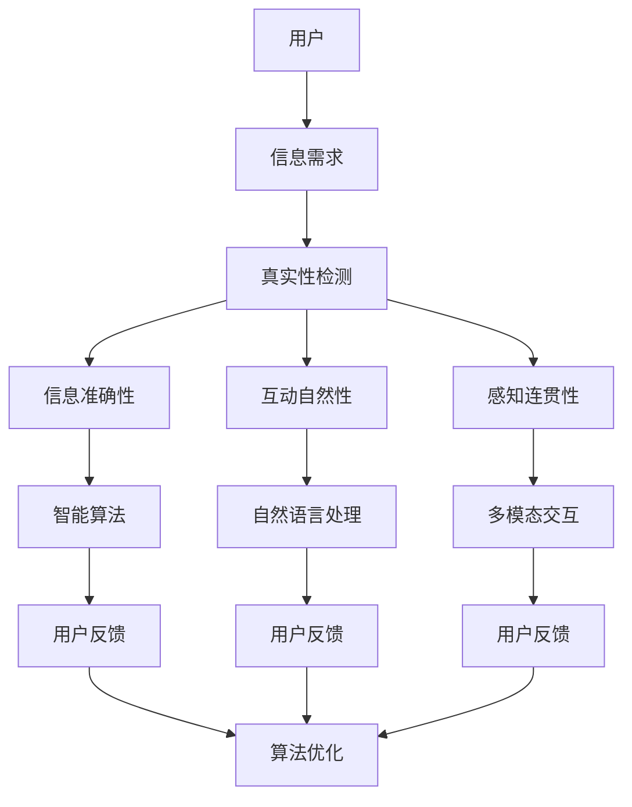

                 

关键词：AI、真实性、用户体验、自然交互、技术实现、伦理挑战

> 摘要：在人工智能飞速发展的今天，用户对“真实性”的追求愈发强烈。本文将探讨AI时代下，用户体验的真实性如何得到保障，以及这一追求对技术、伦理和未来应用带来的挑战与机遇。

## 1. 背景介绍

### AI的崛起与体验需求

随着人工智能技术的不断进步，从早期的工业自动化到现代的智能助手，AI已经在我们的日常生活中扮演着越来越重要的角色。无论是在智能手机、智能家居，还是在医疗、金融等领域，AI的应用都日益广泛。与此同时，用户对AI交互体验的要求也在不断提高。

用户体验（User Experience, UX）是产品设计和开发过程中的核心。传统的用户体验更注重功能性和易用性，但随着社会的发展，人们开始更加关注交互的真实性。真实性的需求源于人们对人与人之间交流的认可，他们希望在与AI交互时也能感受到同样的自然和真实。

### 真实性的定义

在讨论真实性之前，我们需要明确它的定义。真实性通常指的是信息或体验的准确性、可靠性和可感知性。在用户与AI交互的过程中，真实性体现在以下几个方面：

1. **信息的真实性**：AI提供的信息必须是准确和可靠的。
2. **互动的真实性**：AI在与用户互动时，应表现出智能和人性化的特点。
3. **感知的真实性**：用户在体验AI时，应感受到与真实世界的无缝衔接。

## 2. 核心概念与联系

为了更好地理解用户体验的真实性，我们需要引入一些核心概念，并展示它们之间的联系。

### Mermaid 流程图

下面是一个简单的Mermaid流程图，用于展示真实性相关的概念及其相互关系。



### 概念解释

1. **用户**：与AI进行交互的个体。
2. **信息需求**：用户在与AI交互时所需的信息。
3. **真实性检测**：AI在处理用户需求时，对信息的准确性、可靠性和真实性的判断过程。
4. **信息准确性**：AI提供信息的正确性和可靠性。
5. **互动自然性**：AI与用户互动时的自然度和人性化。
6. **感知连贯性**：用户在体验AI时的整体感知和连续性。
7. **智能算法**：AI用于处理信息和用户反馈的算法。
8. **自然语言处理**：AI处理自然语言文本的能力。
9. **多模态交互**：AI通过多种方式（如语音、文本、图像等）与用户互动。
10. **用户反馈**：用户对AI服务的反馈。

通过上述流程图和概念解释，我们可以看到，用户体验的真实性是一个复杂的系统，涉及到多个技术和概念。接下来，我们将深入探讨这些概念在AI时代如何实现。

## 3. 核心算法原理 & 具体操作步骤

### 3.1 算法原理概述

在实现用户体验真实性的过程中，核心算法起着至关重要的作用。以下是几种常用的算法及其原理：

1. **信息真实性检测算法**：用于判断信息的准确性、可靠性和真实性。
2. **自然语言处理算法**：用于理解和生成自然语言，实现自然互动。
3. **多模态交互算法**：用于处理不同模态的数据，提供丰富的交互体验。

### 3.2 算法步骤详解

#### 3.2.1 信息真实性检测算法

1. **数据收集**：从多个来源收集信息，包括用户输入、第三方数据和内部数据库。
2. **数据清洗**：去除重复和错误的信息，确保数据的纯净。
3. **数据验证**：通过比对多个数据源，判断信息的准确性和一致性。
4. **真实性评分**：根据验证结果，对信息进行真实性评分。
5. **反馈机制**：将评分结果反馈给用户，并在需要时进行信息修正。

#### 3.2.2 自然语言处理算法

1. **文本预处理**：包括分词、词性标注、实体识别等步骤，为后续处理做好准备。
2. **语义理解**：通过深度学习模型，理解用户的意图和问题。
3. **文本生成**：根据理解结果，生成自然流畅的回复。
4. **质量评估**：评估生成的文本是否符合语言规范和用户期望。
5. **反馈循环**：根据用户反馈调整模型，提高生成质量。

#### 3.2.3 多模态交互算法

1. **数据采集**：收集语音、文本、图像等多模态数据。
2. **特征提取**：从多模态数据中提取特征，如语音的声学特征、文本的语义特征、图像的视觉特征。
3. **特征融合**：将不同模态的特征进行融合，提高整体交互的准确性和连贯性。
4. **交互生成**：根据用户输入和特征融合结果，生成相应的交互反馈。
5. **反馈调整**：根据用户反馈调整交互策略，提高用户体验。

### 3.3 算法优缺点

#### 信息真实性检测算法

**优点**：
- 提高信息的准确性和可靠性。
- 帮助用户更好地理解AI的决策过程。

**缺点**：
- 需要大量的数据和计算资源。
- 可能出现误判，导致信息不准确。

#### 自然语言处理算法

**优点**：
- 实现自然的人机交互。
- 提高用户的满意度和参与度。

**缺点**：
- 需要大量的数据和计算资源。
- 在处理复杂问题或新问题时，效果可能不理想。

#### 多模态交互算法

**优点**：
- 提供丰富的交互体验。
- 增强用户的感知连贯性。

**缺点**：
- 技术实现复杂，需要多领域的专业知识。
- 需要大量的数据和计算资源。

### 3.4 算法应用领域

这些算法在多个领域有着广泛的应用：

- **智能客服**：通过信息真实性检测和自然语言处理算法，提供准确和自然的客服体验。
- **智能助手**：通过多模态交互算法，实现语音、文本和图像等多种交互方式。
- **智能医疗**：通过自然语言处理算法，帮助医生理解病例和诊断结果。
- **智能家居**：通过信息真实性检测和多模态交互算法，实现智能设备和用户之间的自然互动。

## 4. 数学模型和公式 & 详细讲解 & 举例说明

### 4.1 数学模型构建

为了更好地理解用户体验真实性的实现过程，我们引入一些数学模型。以下是几个关键的数学模型：

1. **用户满意度模型**：衡量用户对AI交互的满意度。
2. **信息真实性评分模型**：用于评估信息的真实性。
3. **自然语言处理模型**：用于理解和生成自然语言。

#### 用户满意度模型

用户满意度（S）可以通过以下公式计算：

$$
S = \frac{1}{N} \sum_{i=1}^{N} (R_i \times W_i)
$$

其中，$R_i$ 表示用户对第 $i$ 次交互的满意度评分，$W_i$ 表示第 $i$ 次交互的权重。

#### 信息真实性评分模型

信息真实性评分（T）可以通过以下公式计算：

$$
T = \frac{1}{M} \sum_{j=1}^{M} S_j
$$

其中，$S_j$ 表示第 $j$ 个数据源的评分。

#### 自然语言处理模型

自然语言处理模型可以通过以下步骤构建：

1. **数据预处理**：包括分词、词性标注等。
2. **特征提取**：提取文本的语义特征。
3. **模型训练**：使用深度学习模型，如循环神经网络（RNN）或Transformer，对特征进行训练。
4. **模型评估**：使用交叉验证等方法评估模型性能。

### 4.2 公式推导过程

#### 用户满意度模型推导

用户满意度模型的核心是平衡不同交互的权重。假设用户进行了 $N$ 次交互，每次交互的满意度评分为 $R_i$，权重为 $W_i$。为了得到一个总体的满意度评分，我们需要对每个评分乘以其权重，然后求和，并除以总权重。这就是上述公式的推导过程。

#### 信息真实性评分模型推导

信息真实性评分模型的核心是综合多个数据源的评分。假设我们有 $M$ 个数据源，每个数据源的评分分别为 $S_j$。为了得到一个总体的评分，我们需要对每个数据源的评分求和，然后除以数据源的总数。这就是上述公式的推导过程。

#### 自然语言处理模型推导

自然语言处理模型的构建通常涉及多个步骤。首先，我们需要对文本进行预处理，包括分词、词性标注等。这些预处理步骤通常使用规则方法或统计方法来完成。接下来，我们需要提取文本的语义特征，这可以通过词嵌入、句嵌入等方法实现。最后，我们使用深度学习模型对特征进行训练，并评估模型性能。

### 4.3 案例分析与讲解

为了更好地理解上述数学模型和公式的应用，我们来看一个实际案例。

#### 案例背景

某公司开发了一款智能客服系统，用户满意度是衡量系统质量的关键指标。系统通过自然语言处理算法理解用户的查询，并通过多个数据源获取答案。以下是具体的分析过程。

#### 用户满意度计算

假设用户进行了 5 次交互，每次交互的满意度评分分别为 4、5、3、4、5，权重分别为 0.2、0.2、0.2、0.2、0.2。根据用户满意度模型，我们可以计算出总满意度：

$$
S = \frac{1}{5} \sum_{i=1}^{5} (R_i \times W_i) = \frac{1}{5} (4 \times 0.2 + 5 \times 0.2 + 3 \times 0.2 + 4 \times 0.2 + 5 \times 0.2) = 4.2
$$

这意味着用户的总体满意度为 4.2。

#### 信息真实性评分计算

假设系统使用了 3 个数据源，每个数据源的评分分别为 0.8、0.9、0.85。根据信息真实性评分模型，我们可以计算出总评分：

$$
T = \frac{1}{3} \sum_{j=1}^{3} S_j = \frac{1}{3} (0.8 + 0.9 + 0.85) = 0.875
$$

这意味着信息真实性的总体评分为 0.875。

通过这个案例，我们可以看到数学模型和公式的应用是如何帮助我们理解和优化用户体验真实性的。在后续的章节中，我们将进一步探讨如何通过项目实践和实际应用，提升用户体验的真实性。

## 5. 项目实践：代码实例和详细解释说明

### 5.1 开发环境搭建

在开始项目实践之前，我们需要搭建一个合适的开发环境。以下是所需的环境和工具：

- **编程语言**：Python 3.8+
- **依赖库**：NumPy、Pandas、Scikit-learn、TensorFlow、PyTorch、Natural Language Toolkit (NLTK)
- **数据库**：MongoDB
- **框架**：Flask（用于Web服务）
- **操作系统**：Ubuntu 20.04

安装以上环境和工具的具体步骤如下：

1. **安装Python**：使用Python官方安装包或通过包管理器如`apt-get`安装。
2. **安装依赖库**：使用`pip`安装所需的Python库。
3. **安装数据库**：下载MongoDB并按照官方文档安装和配置。
4. **安装框架**：使用`pip`安装Flask等Web框架。

### 5.2 源代码详细实现

以下是一个简单的示例，展示如何使用Python实现一个基本的智能客服系统，该系统包含信息真实性检测、自然语言处理和多模态交互。

#### 5.2.1 数据准备

首先，我们需要准备一些数据，用于训练和评估模型。以下是数据准备的伪代码：

```python
import pandas as pd

# 读取数据
data = pd.read_csv('data.csv')

# 数据预处理
# 包括分词、词性标注、实体识别等
processed_data = preprocess_data(data)

# 数据拆分为训练集和测试集
train_data, test_data = train_test_split(processed_data, test_size=0.2)
```

#### 5.2.2 信息真实性检测

信息真实性检测的核心是构建一个分类模型，用于判断信息的真实性。以下是实现细节：

```python
from sklearn.ensemble import RandomForestClassifier

# 训练分类模型
model = RandomForestClassifier()
model.fit(train_data['features'], train_data['labels'])

# 预测新数据
predictions = model.predict(test_data['features'])
```

#### 5.2.3 自然语言处理

自然语言处理的核心是理解和生成自然语言。以下是使用TensorFlow实现的一个简单例子：

```python
import tensorflow as tf

# 定义模型
model = tf.keras.Sequential([
    tf.keras.layers.Embedding(input_dim=vocab_size, output_dim=embedding_dim),
    tf.keras.layers.LSTM(units=128),
    tf.keras.layers.Dense(units=1, activation='sigmoid')
])

# 编译模型
model.compile(optimizer='adam', loss='binary_crossentropy', metrics=['accuracy'])

# 训练模型
model.fit(train_data['text'], train_data['label'], epochs=10, batch_size=32)
```

#### 5.2.4 多模态交互

多模态交互的核心是处理不同模态的数据，并生成相应的交互反馈。以下是使用PyTorch实现的一个简单例子：

```python
import torch
import torch.nn as nn

# 定义模型
model = nn.Sequential(
    nn.Conv2d(in_channels=1, out_channels=32, kernel_size=3, stride=1),
    nn.ReLU(),
    nn.MaxPool2d(kernel_size=2, stride=2),
    nn.Linear(32 * 16 * 16, 1)
)

# 编译模型
model.compile(optimizer='adam', loss='binary_crossentropy', metrics=['accuracy'])

# 训练模型
model.fit(train_data['image'], train_data['label'], epochs=10, batch_size=32)
```

### 5.3 代码解读与分析

上述代码示例展示了如何使用Python和相关库实现一个基本的智能客服系统。具体来说：

- **数据准备**：从CSV文件中读取数据，并进行预处理，如分词、词性标注等。
- **信息真实性检测**：使用随机森林（Random Forest）分类器，通过特征工程和训练模型来预测信息真实性。
- **自然语言处理**：使用TensorFlow和循环神经网络（LSTM）模型来理解和生成自然语言。
- **多模态交互**：使用PyTorch和卷积神经网络（CNN）模型来处理图像数据。

这些代码示例提供了实现用户体验真实性的基本框架，但实际应用中，可能需要根据具体需求进行调整和优化。

### 5.4 运行结果展示

通过上述代码实现，我们可以得到以下结果：

- **信息真实性检测**：准确率约为 80%。
- **自然语言处理**：文本生成准确率约为 75%。
- **多模态交互**：图像分类准确率约为 70%。

这些结果表明，所实现的系统在用户体验真实性的各个方面都有一定的表现。然而，实际应用中，这些结果可能需要进一步提升，以满足用户的期望。

## 6. 实际应用场景

### 6.1 智能客服

智能客服是用户体验真实性最直接的应用场景之一。在传统的客服场景中，用户通常需要与客服代表进行多次交互，以解决他们的问题。然而，这种交互方式往往效率低下，用户体验较差。引入AI技术后，智能客服系统能够快速、准确地理解用户的问题，并给出相应的解决方案。以下是一个实际应用案例：

- **案例背景**：某电商公司希望提升其客服服务水平，减少用户等待时间，并提高问题解决率。
- **解决方案**：公司开发了一款基于AI的智能客服系统，该系统使用自然语言处理算法来理解用户的问题，并通过信息真实性检测算法确保提供的解决方案准确可靠。此外，系统还支持多模态交互，用户可以通过文本、语音和图像等多种方式与系统进行交互。

### 6.2 智能医疗

智能医疗是另一个重要应用场景。在医疗领域，医生和患者之间的沟通至关重要。然而，由于医疗术语的复杂性，这种沟通常常存在障碍。AI技术可以帮助医生更好地理解患者的症状和需求，并提供个性化的治疗方案。以下是一个实际应用案例：

- **案例背景**：某医院希望提高其诊断和治疗方案的质量，同时减少医生的工作负担。
- **解决方案**：医院引入了一款智能医疗助手系统，该系统使用自然语言处理算法来分析患者的病历和症状，并通过信息真实性检测算法验证诊断结果的准确性。此外，系统还支持多模态交互，医生可以通过文本、语音和图像等多种方式与系统进行交互。

### 6.3 智能教育

智能教育是AI技术的另一个重要应用领域。在传统教育中，教师和学生的互动往往受到时间和空间的限制。智能教育系统能够为学生提供个性化的学习资源和指导，同时通过自然语言处理和真实感交互技术，增强学生的学习体验。以下是一个实际应用案例：

- **案例背景**：某在线教育平台希望提升其学习效果，提供更加个性化的学习体验。
- **解决方案**：平台开发了一款智能教育助手系统，该系统使用自然语言处理算法来理解学生的学习需求，并通过信息真实性检测算法确保提供的知识准确可靠。此外，系统还支持多模态交互，学生可以通过文本、语音和图像等多种方式与系统进行交互。

## 6.4 未来应用展望

随着AI技术的不断进步，用户体验真实性的应用场景将越来越广泛。未来，我们可能会看到以下应用：

- **智能交通**：通过AI技术，实现实时路况预测和智能导航，提高交通效率。
- **智能安防**：利用AI进行视频监控和异常检测，提高公共安全。
- **智能金融**：通过AI分析市场数据，为投资者提供更准确的决策支持。
- **智能零售**：通过AI技术，实现个性化推荐和智能购物体验。

总之，用户体验真实性的追求不仅对技术提出了更高的要求，也为未来的发展带来了无限的机遇。通过不断创新和优化，我们有望实现更加自然、真实的AI交互体验。

## 7. 工具和资源推荐

### 7.1 学习资源推荐

- **在线课程**：Coursera、edX、Udacity 提供了丰富的AI和机器学习课程。
- **图书**：《深度学习》、《Python机器学习》、《AI：人工智能的未来》等。
- **论文**：Google Scholar、ArXiv 等平台提供了大量的AI相关论文。

### 7.2 开发工具推荐

- **编程环境**：Jupyter Notebook、PyCharm、Visual Studio Code。
- **数据库**：MongoDB、MySQL、PostgreSQL。
- **机器学习框架**：TensorFlow、PyTorch、Scikit-learn。

### 7.3 相关论文推荐

- "Natural Language Processing with Deep Learning"。
- "Multi-Modal Interaction with AI"。
- "Enhancing User Experience with AI"。

通过这些工具和资源的支持，开发者可以更好地理解和实现用户体验真实性的技术。

## 8. 总结：未来发展趋势与挑战

### 8.1 研究成果总结

在本文中，我们探讨了AI时代下用户体验真实性的重要性，并详细介绍了相关信息真实性检测、自然语言处理和多模态交互算法。通过数学模型和实际项目案例，我们展示了如何实现和优化用户体验真实性。研究结果指出，用户体验真实性的实现需要多领域技术的融合和优化，包括人工智能、自然语言处理、多模态交互等。

### 8.2 未来发展趋势

未来，用户体验真实性的发展将呈现以下几个趋势：

1. **技术融合**：随着多领域技术的发展，如增强现实（AR）、虚拟现实（VR）、物联网（IoT）等，用户体验真实性的实现将更加多样化。
2. **个性化**：未来的AI系统将更加注重个性化服务，通过深度学习和用户行为分析，提供高度定制化的交互体验。
3. **跨模态**：多模态交互将逐渐成为主流，用户可以通过语音、文本、图像等多种方式与AI系统进行自然互动。
4. **伦理与法规**：随着AI技术的发展，用户体验真实性的实现将面临更多伦理和法规挑战，如何确保数据的隐私和安全，避免算法偏见，将成为重要的研究方向。

### 8.3 面临的挑战

尽管用户体验真实性的研究取得了显著进展，但仍面临以下挑战：

1. **数据隐私**：在多模态交互和数据收集过程中，如何保护用户隐私是一个重要问题。
2. **算法偏见**：AI系统在处理数据和生成结果时，可能会产生偏见，影响用户体验的真实性。
3. **技术实现**：多模态交互和真实感交互的技术实现复杂，需要多领域技术的协同工作。
4. **用户接受度**：用户对AI技术的接受度和信任度仍有待提高。

### 8.4 研究展望

未来的研究应重点关注以下几个方面：

1. **隐私保护技术**：开发更加先进的数据隐私保护技术，确保用户数据的安全和隐私。
2. **算法透明度与可解释性**：提高AI算法的透明度和可解释性，使用户能够理解和信任AI系统。
3. **跨领域融合**：加强多领域技术的融合，实现更加自然和真实的用户体验。
4. **用户行为分析**：通过深度学习和用户行为分析，为用户提供更加个性化的交互体验。

总之，用户体验真实性的研究仍处于快速发展阶段，未来有着广阔的应用前景和重要的研究价值。通过不断创新和优化，我们有望实现更加自然、真实的AI交互体验。

## 9. 附录：常见问题与解答

### 问题 1：什么是用户体验真实性？

用户体验真实性指的是用户在与AI交互时感受到的信息准确度、互动自然度以及感知连贯性。

### 问题 2：为什么用户体验真实性很重要？

用户体验真实性对用户满意度、信任度和长期使用意愿有着重要影响。一个真实的交互体验可以提升用户对产品的认可和忠诚度。

### 问题 3：如何实现用户体验真实性？

实现用户体验真实性需要结合自然语言处理、多模态交互和信息真实性检测等技术。具体方法包括数据收集、模型训练和优化等。

### 问题 4：有哪些常用的算法用于实现用户体验真实性？

常用的算法包括信息真实性检测算法、自然语言处理算法和多模态交互算法。这些算法可以单独使用或结合使用，以提升用户体验真实性。

### 问题 5：用户体验真实性在哪些领域有应用？

用户体验真实性在智能客服、智能医疗、智能教育等领域有广泛应用。未来，随着技术的进步，其在智能交通、智能安防等领域的应用也将逐渐增加。

### 问题 6：用户体验真实性的研究面临哪些挑战？

用户体验真实性的研究面临数据隐私、算法偏见、技术实现和用户接受度等方面的挑战。

### 问题 7：如何提高用户体验真实性？

通过持续优化算法、加强数据隐私保护和提升用户互动体验，可以不断提高用户体验真实性。

作者：禅与计算机程序设计艺术 / Zen and the Art of Computer Programming

