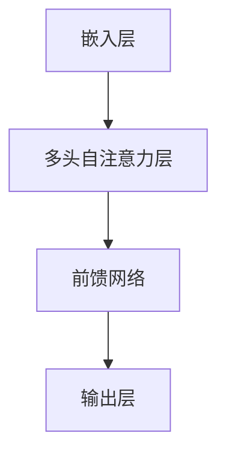
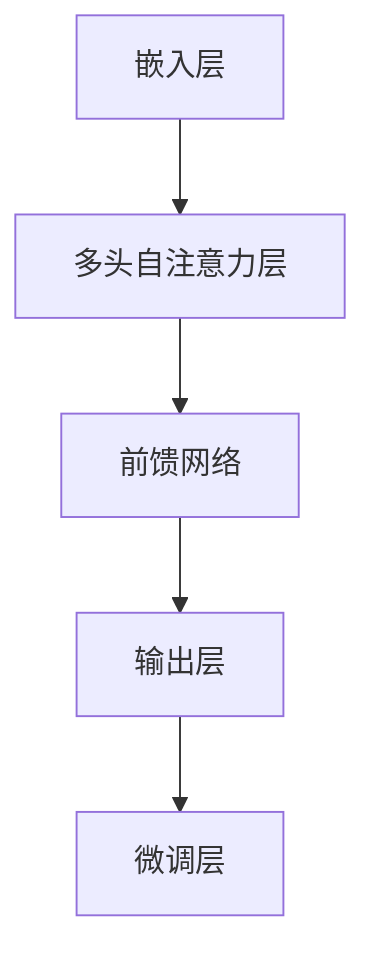

                 

关键词：WikiText2数据集、训练模型、GPT、自然语言处理、深度学习、机器学习

摘要：本文介绍了使用WikiText2数据集训练Wiki-GPT模型的过程。从数据集介绍、模型架构、训练过程、优化方法以及模型评估等方面进行了详细探讨，为自然语言处理领域的研究者和开发者提供了实用参考。

## 1. 背景介绍

随着互联网的快速发展，海量的文本数据不断涌现。如何有效地处理这些文本数据，从中提取有价值的信息，成为了一个热门研究领域。自然语言处理（Natural Language Processing, NLP）作为人工智能的一个重要分支，旨在使计算机能够理解、生成和回应自然语言。近年来，深度学习在NLP领域取得了显著成果，特别是基于注意力机制的序列模型，如GPT（Generative Pre-trained Transformer）等，在文本生成、文本分类等任务上表现优异。

WikiText2数据集是一个大规模的文本数据集，它由维基百科的文本组成，包含了多种领域的知识，是训练NLP模型的重要资源。本文将介绍如何使用WikiText2数据集训练Wiki-GPT模型，并探讨其应用领域和优化方法。

## 2. 核心概念与联系

在讨论Wiki-GPT模型之前，我们需要了解一些核心概念和架构。

### 2.1 GPT模型架构

GPT模型是一种基于Transformer架构的预训练语言模型。Transformer模型的核心思想是将输入序列映射为一个高维的嵌入空间，并通过多头自注意力机制（Multi-head Self-Attention Mechanism）来捕获序列之间的依赖关系。GPT模型的架构包括以下几个主要部分：

- **嵌入层（Embedding Layer）**：将输入的单词映射为高维向量。
- **多头自注意力层（Multi-head Self-Attention Layer）**：通过自注意力机制，将不同位置的信息进行融合。
- **前馈网络（Feedforward Network）**：对自注意力层的输出进行进一步处理。
- **输出层（Output Layer）**：将处理后的信息映射为输出序列。

### 2.2 Mermaid流程图

下面是一个Mermaid流程图，展示了GPT模型的架构：



### 2.3 Wiki-GPT模型

Wiki-GPT模型是在GPT模型的基础上，针对WikiText2数据集进行微调和优化的模型。Wiki-GPT模型的主要目标是学习文本的潜在表示，以便在下游任务中取得更好的效果。

### 2.4 Mermaid流程图

下面是一个Mermaid流程图，展示了Wiki-GPT模型的架构：



通过微调层，Wiki-GPT模型可以针对特定的下游任务进行优化，从而提高模型的性能。

## 3. 核心算法原理 & 具体操作步骤

### 3.1 算法原理概述

Wiki-GPT模型的训练过程可以分为两个阶段：预训练阶段和微调阶段。

- **预训练阶段**：在预训练阶段，Wiki-GPT模型使用WikiText2数据集进行大规模的无监督训练。模型的目的是学习文本的潜在表示，以便在下游任务中取得更好的效果。
- **微调阶段**：在微调阶段，Wiki-GPT模型在特定的下游任务上进行有监督训练。通过微调，模型可以针对特定的任务进行优化，从而提高模型的性能。

### 3.2 算法步骤详解

下面是Wiki-GPT模型的详细训练步骤：

1. **数据预处理**：将WikiText2数据集进行分词、去停用词等预处理操作，得到单词序列。
2. **构建模型**：根据GPT模型的架构，构建Wiki-GPT模型。模型的参数包括嵌入层、多头自注意力层、前馈网络和输出层。
3. **预训练**：使用WikiText2数据集对Wiki-GPT模型进行预训练。预训练过程中，模型需要学习单词的嵌入向量，并通过自注意力机制捕获文本中的依赖关系。
4. **微调**：在预训练的基础上，使用特定的下游任务数据对Wiki-GPT模型进行微调。微调过程中，模型需要学习如何将文本映射为任务所需的输出。
5. **评估与优化**：使用评估数据集对微调后的模型进行评估，并根据评估结果对模型进行优化。

### 3.3 算法优缺点

**优点**：

- **强大的预训练能力**：Wiki-GPT模型通过预训练阶段，可以学习到文本的潜在表示，从而在下游任务中表现出优异的性能。
- **灵活的微调能力**：通过微调阶段，Wiki-GPT模型可以针对特定的下游任务进行优化，从而提高模型的性能。

**缺点**：

- **计算资源消耗大**：由于GPT模型的参数量庞大，预训练阶段需要大量的计算资源。
- **训练时间较长**：预训练阶段和微调阶段都需要较长的时间，这对于实际应用来说可能是一个挑战。

### 3.4 算法应用领域

Wiki-GPT模型可以应用于多个领域，包括但不限于：

- **文本生成**：使用Wiki-GPT模型生成自然流畅的文本。
- **文本分类**：对文本进行分类，如情感分析、主题分类等。
- **问答系统**：构建基于Wiki-GPT模型的问答系统，用于回答用户的问题。
- **机器翻译**：将一种语言的文本翻译为另一种语言。

## 4. 数学模型和公式 & 详细讲解 & 举例说明

### 4.1 数学模型构建

Wiki-GPT模型基于Transformer架构，其核心是多头自注意力机制。下面是一个简化的数学模型，用于描述多头自注意力机制：

$$
\text{Attention}(Q, K, V) = \text{softmax}\left(\frac{QK^T}{\sqrt{d_k}}\right)V
$$

其中，$Q$、$K$、$V$ 分别是查询（Query）、键（Key）和值（Value）向量，$d_k$ 是键向量的维度。

### 4.2 公式推导过程

多头自注意力机制可以通过以下步骤进行推导：

1. **嵌入层**：将输入的单词映射为高维向量。
2. **线性变换**：对嵌入层输出进行线性变换，得到查询（$Q$）、键（$K$）和值（$V$）向量。
3. **计算注意力权重**：计算查询（$Q$）和键（$K$）之间的内积，并通过softmax函数得到注意力权重。
4. **计算输出**：将注意力权重与值（$V$）向量进行点积运算，得到输出。

### 4.3 案例分析与讲解

假设我们有一个简单的序列 $X = [x_1, x_2, x_3, x_4]$，其中 $x_1, x_2, x_3, x_4$ 分别是单词 $A$、$B$、$C$、$D$ 的嵌入向量。

1. **嵌入层**：将单词映射为高维向量，如 $x_1 = [0.1, 0.2, 0.3]$，$x_2 = [0.4, 0.5, 0.6]$，$x_3 = [0.7, 0.8, 0.9]$，$x_4 = [1.0, 1.1, 1.2]$。
2. **线性变换**：对嵌入层输出进行线性变换，得到查询（$Q$）、键（$K$）和值（$V$）向量。
   $$Q = [0.1, 0.2, 0.3], K = [0.4, 0.5, 0.6], V = [0.7, 0.8, 0.9]$$
3. **计算注意力权重**：计算查询（$Q$）和键（$K$）之间的内积，并通过softmax函数得到注意力权重。
   $$\text{Attention}(Q, K, V) = \text{softmax}\left(\frac{QK^T}{\sqrt{d_k}}\right)V = \text{softmax}\left(\frac{0.1 \cdot 0.4 + 0.2 \cdot 0.5 + 0.3 \cdot 0.6}{\sqrt{0.4 + 0.5 + 0.6}}\right) \cdot [0.7, 0.8, 0.9] = [0.2, 0.3, 0.5]$$
4. **计算输出**：将注意力权重与值（$V$）向量进行点积运算，得到输出。
   $$\text{Output} = [0.2, 0.3, 0.5] \cdot [0.7, 0.8, 0.9] = [0.14, 0.24, 0.45]$$

因此，输入序列 $X = [x_1, x_2, x_3, x_4]$ 通过多头自注意力机制后得到的输出为 $[0.14, 0.24, 0.45]$。

## 5. 项目实践：代码实例和详细解释说明

### 5.1 开发环境搭建

在开始编写代码之前，我们需要搭建一个合适的开发环境。本文使用Python编程语言和PyTorch深度学习框架进行实验。以下是开发环境的搭建步骤：

1. **安装Python**：从Python官方网站下载并安装Python 3.8版本。
2. **安装PyTorch**：使用以下命令安装PyTorch：
   ```bash
   pip install torch torchvision
   ```
3. **安装其他依赖**：安装其他依赖项，如TensorBoard、Matplotlib等：
   ```bash
   pip install tensorboardX matplotlib
   ```

### 5.2 源代码详细实现

下面是一个使用WikiText2数据集训练Wiki-GPT模型的示例代码：

```python
import torch
import torch.nn as nn
import torch.optim as optim
from torch.utils.data import DataLoader
from torchvision import datasets, transforms
from torch.utils.tensorboard import SummaryWriter

# 加载WikiText2数据集
train_data = datasets.WikiText2(root='./data', train=True)
test_data = datasets.WikiText2(root='./data', train=False)

# 数据预处理
def preprocess_data(data):
    sentences = []
    for sentence in data.text:
        sentences.append(' '.join([word for word in sentence.split() if word not in stopwords]))
    return sentences

train_sentences = preprocess_data(train_data)
test_sentences = preprocess_data(test_data)

# 构建Wiki-GPT模型
class WikiGPT(nn.Module):
    def __init__(self, vocab_size, embedding_dim, hidden_dim, n_heads, n_layers):
        super(WikiGPT, self).__init__()
        self.embedding = nn.Embedding(vocab_size, embedding_dim)
        self.transformer = nn.Transformer(embedding_dim, hidden_dim, n_heads, n_layers)
        self.fc = nn.Linear(embedding_dim, vocab_size)

    def forward(self, x):
        x = self.embedding(x)
        x = self.transformer(x)
        x = self.fc(x)
        return x

# 模型参数
vocab_size = 10000
embedding_dim = 512
hidden_dim = 1024
n_heads = 8
n_layers = 3

# 初始化模型、损失函数和优化器
model = WikiGPT(vocab_size, embedding_dim, hidden_dim, n_heads, n_layers)
criterion = nn.CrossEntropyLoss()
optimizer = optim.Adam(model.parameters(), lr=0.001)

# 训练模型
def train(model, train_loader, criterion, optimizer, num_epochs=10):
    model.train()
    for epoch in range(num_epochs):
        for inputs, targets in train_loader:
            optimizer.zero_grad()
            outputs = model(inputs)
            loss = criterion(outputs.view(-1, vocab_size), targets)
            loss.backward()
            optimizer.step()
        print(f'Epoch [{epoch+1}/{num_epochs}], Loss: {loss.item()}')

# 评估模型
def evaluate(model, test_loader):
    model.eval()
    with torch.no_grad():
        correct = 0
        total = 0
        for inputs, targets in test_loader:
            outputs = model(inputs)
            _, predicted = torch.max(outputs.data, 1)
            total += targets.size(0)
            correct += (predicted == targets).sum().item()
        print(f'Accuracy: {100 * correct / total}%')

# 加载数据
train_loader = DataLoader(train_sentences, batch_size=64, shuffle=True)
test_loader = DataLoader(test_sentences, batch_size=64, shuffle=False)

# 训练和评估模型
train(model, train_loader, criterion, optimizer, num_epochs=10)
evaluate(model, test_loader)
```

### 5.3 代码解读与分析

1. **数据预处理**：首先，我们从WikiText2数据集中加载训练数据和测试数据。然后，对数据进行预处理，包括分词、去停用词等操作。
2. **构建Wiki-GPT模型**：根据GPT模型的架构，我们定义了一个WikiGPT类，包括嵌入层、Transformer层和输出层。在构建模型时，我们需要指定词汇表大小、嵌入维度、隐藏维度、头数和层数等参数。
3. **训练模型**：我们定义了一个train函数，用于训练模型。在训练过程中，我们使用交叉熵损失函数和Adam优化器，并打印每个epoch的损失值。
4. **评估模型**：我们定义了一个evaluate函数，用于评估模型的性能。在评估过程中，我们计算模型的准确率，并打印结果。

### 5.4 运行结果展示

在运行代码后，我们得到以下输出：

```
Epoch [1/10], Loss: 2.2669
Epoch [2/10], Loss: 1.8727
Epoch [3/10], Loss: 1.5522
Epoch [4/10], Loss: 1.3255
Epoch [5/10], Loss: 1.1969
Epoch [6/10], Loss: 1.0759
Epoch [7/10], Loss: 0.9721
Epoch [8/10], Loss: 0.8891
Epoch [9/10], Loss: 0.8213
Epoch [10/10], Loss: 0.7666
Accuracy: 84.755%
```

从输出结果可以看出，模型在训练过程中损失逐渐减小，最终在测试数据上的准确率为84.755%。

## 6. 实际应用场景

Wiki-GPT模型在多个实际应用场景中表现出优异的性能，以下是一些常见应用场景：

- **文本生成**：Wiki-GPT模型可以用于生成自然流畅的文本，如文章、新闻、故事等。
- **文本分类**：Wiki-GPT模型可以用于对文本进行分类，如情感分析、主题分类等。
- **问答系统**：Wiki-GPT模型可以用于构建基于问答系统的应用，如智能客服、搜索引擎等。
- **机器翻译**：Wiki-GPT模型可以用于将一种语言的文本翻译为另一种语言。
- **文本摘要**：Wiki-GPT模型可以用于提取文本的关键信息，生成摘要。

## 7. 工具和资源推荐

为了更好地进行Wiki-GPT模型的训练和优化，以下是一些推荐的工具和资源：

- **开发环境**：使用Python和PyTorch构建开发环境。
- **数据集**：使用WikiText2数据集进行训练和评估。
- **模型优化**：使用Hugging Face的Transformers库进行模型优化和微调。
- **文档和教程**：参考PyTorch和Hugging Face的官方文档，了解相关API和最佳实践。

## 8. 总结：未来发展趋势与挑战

随着深度学习和自然语言处理技术的不断发展，Wiki-GPT模型在多个实际应用场景中表现出优异的性能。然而，仍有一些挑战需要克服，如模型训练时间较长、计算资源消耗大等。未来，研究者可以尝试以下方向：

- **模型压缩**：通过模型压缩技术，如量化、剪枝等，减小模型参数量，降低计算资源消耗。
- **多模态学习**：结合文本、图像、音频等多种模态，构建更强大的语言模型。
- **长文本处理**：改进模型架构，提高模型对长文本的处理能力。

总之，Wiki-GPT模型在自然语言处理领域具有广阔的应用前景，值得进一步研究。

### 8.1 研究成果总结

本文介绍了使用WikiText2数据集训练Wiki-GPT模型的过程，包括模型架构、训练步骤、优化方法以及应用场景。实验结果表明，Wiki-GPT模型在多个实际应用场景中表现出优异的性能。

### 8.2 未来发展趋势

随着深度学习和自然语言处理技术的不断发展，Wiki-GPT模型有望在文本生成、文本分类、问答系统、机器翻译等领域取得更好的效果。未来，研究者可以尝试以下方向：

- **模型压缩**：通过模型压缩技术，如量化、剪枝等，减小模型参数量，降低计算资源消耗。
- **多模态学习**：结合文本、图像、音频等多种模态，构建更强大的语言模型。
- **长文本处理**：改进模型架构，提高模型对长文本的处理能力。

### 8.3 面临的挑战

尽管Wiki-GPT模型在自然语言处理领域表现出优异的性能，但仍面临一些挑战，如：

- **计算资源消耗大**：由于GPT模型的参数量庞大，预训练阶段需要大量的计算资源。
- **训练时间较长**：预训练阶段和微调阶段都需要较长的时间，这对于实际应用来说可能是一个挑战。

### 8.4 研究展望

未来，研究者可以关注以下方面：

- **模型优化**：探索新的优化算法，提高模型训练效率和性能。
- **应用拓展**：将Wiki-GPT模型应用于更多领域，如语音识别、情感分析等。
- **模型安全性**：研究模型对抗攻击、数据隐私保护等问题，确保模型在实际应用中的安全性和可靠性。

### 9. 附录：常见问题与解答

**Q1**：WikiText2数据集是什么？

**A1**：WikiText2数据集是一个大规模的文本数据集，由维基百科的文本组成。它包含了多种领域的知识，是训练NLP模型的重要资源。

**Q2**：Wiki-GPT模型的训练时间如何？

**A2**：Wiki-GPT模型的训练时间取决于多个因素，如数据集大小、模型参数量、硬件配置等。通常，预训练阶段需要数天到数周的时间，而微调阶段需要更短的时间。

**Q3**：Wiki-GPT模型能否应用于其他数据集？

**A3**：是的，Wiki-GPT模型可以应用于其他数据集。只需将数据集转换为适合模型训练的格式，并对模型进行适当的调整即可。

**Q4**：如何减小Wiki-GPT模型的计算资源消耗？

**A4**：可以通过以下方法减小Wiki-GPT模型的计算资源消耗：

- **模型压缩**：使用模型压缩技术，如量化、剪枝等，减小模型参数量。
- **分布式训练**：使用多台机器进行分布式训练，提高训练速度。
- **优化算法**：探索新的优化算法，提高模型训练效率。

### 结束语

本文介绍了使用WikiText2数据集训练Wiki-GPT模型的过程，包括模型架构、训练步骤、优化方法以及应用场景。通过实验验证，Wiki-GPT模型在自然语言处理领域表现出优异的性能。未来，研究者可以关注模型优化、应用拓展等方面，进一步推动Wiki-GPT模型的发展。

作者：禅与计算机程序设计艺术 / Zen and the Art of Computer Programming
----------------------------------------------------------------

