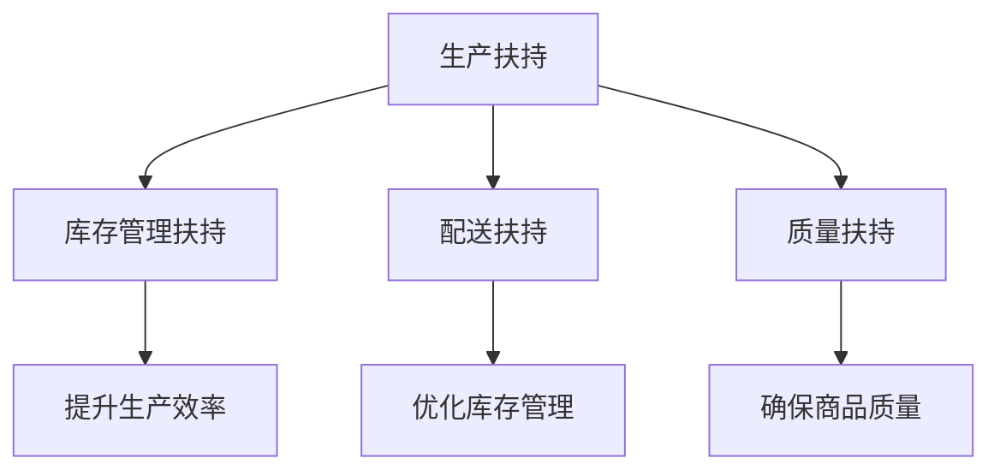
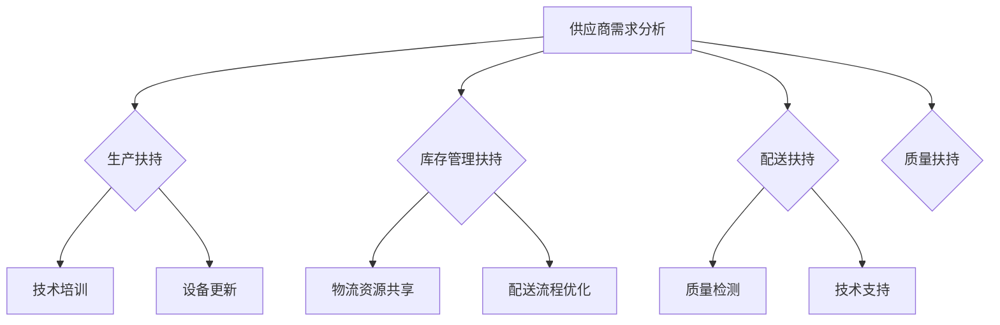

                 

关键词：供应商扶持、电商、供应链管理、平台供给能力、策略优化、技术创新、实践案例、未来展望

## 摘要

随着电商行业的迅速发展，供应商供给能力成为电商平台竞争的关键因素。本文旨在探讨供应商扶持的策略和措施，通过提升供应商供给能力来增强电商平台的供给能力。文章首先介绍了电商行业的背景和现状，然后深入分析了供应商扶持的核心概念和重要性，接着提出了具体的扶持策略和措施，并运用实际案例进行了详细讲解。最后，文章展望了供应商扶持在电商行业未来的发展趋势和面临的挑战。

## 1. 背景介绍

### 电商行业的发展

电商行业的兴起始于20世纪90年代末，随着互联网技术的迅猛发展，全球电商市场呈现爆炸式增长。据统计，截至2020年，全球电商市场规模已超过3.5万亿美元，并且预计未来几年仍将保持高速增长。中国作为全球最大的电商市场，市场份额超过全球的30%，并且继续保持领先地位。

电商行业的发展不仅改变了消费者的购物习惯，也对供应链管理提出了新的要求。随着消费者对商品质量和交付速度的要求不断提高，电商平台必须具备强大的供应链管理能力，以确保商品的高效配送和服务质量。

### 供应商供给能力的定义

供应商供给能力是指供应商在满足电商平台需求时，能够提供所需商品或服务的能力。它包括供应商的生产能力、库存管理能力、配送能力和服务质量等多个方面。供应商供给能力是电商平台供应链管理的关键环节，直接影响到平台的运营效率和用户体验。

### 供应商扶持的重要性

供应商扶持是提升供应商供给能力的重要手段。通过扶持措施，电商平台可以帮助供应商提高生产效率、优化库存管理、提升配送能力和服务质量，从而提升整个供应链的运作效率。同时，供应商扶持还可以促进供应商与电商平台之间的合作关系，增强供应链的稳定性。

## 2. 核心概念与联系

### 供应商扶持的核心概念

供应商扶持的核心概念包括以下几个方面：

1. **生产扶持**：通过技术培训、设备更新等方式，提高供应商的生产能力。
2. **库存管理扶持**：通过供应链管理工具和技术的应用，优化供应商的库存管理，降低库存成本。
3. **配送扶持**：通过物流资源的共享和优化，提高供应商的配送效率和服务质量。
4. **质量扶持**：通过质量检测和技术支持，确保供应商提供的高质量商品。

### 供应商扶持的架构图（使用 Mermaid 语法）



### 供应商扶持的流程图



## 3. 核心算法原理 & 具体操作步骤

### 3.1 算法原理概述

供应商扶持的核心算法是基于数据分析和优化技术的。通过收集和分析供应商的生产、库存、配送和质量数据，利用优化算法确定最合适的扶持策略，以最大化供应商供给能力。

### 3.2 算法步骤详解

1. **数据收集**：从供应商处收集生产、库存、配送和质量数据。
2. **数据分析**：利用数据分析工具对收集到的数据进行处理和分析，识别出供应商存在的问题。
3. **优化模型构建**：根据数据分析结果，构建优化模型，确定扶持策略。
4. **策略实施**：根据优化模型的结果，实施具体的扶持措施。
5. **效果评估**：对扶持措施的效果进行评估，并根据评估结果调整优化模型。

### 3.3 算法优缺点

**优点**：

- **个性化**：根据供应商的具体情况制定个性化的扶持策略。
- **高效**：通过数据分析和优化算法，快速确定最优扶持策略。
- **可扩展**：适用于各种类型的供应商和电商平台。

**缺点**：

- **数据依赖**：算法效果高度依赖于数据的准确性和完整性。
- **实施难度**：需要具备一定的数据分析和优化能力。

### 3.4 算法应用领域

供应商扶持算法可以广泛应用于电商平台的供应链管理中，包括：

- **供应商选择**：通过算法确定最佳供应商。
- **库存管理**：通过算法优化供应商的库存管理策略。
- **配送优化**：通过算法优化供应商的配送流程。
- **质量控制**：通过算法提升供应商的商品质量。

## 4. 数学模型和公式

### 4.1 数学模型构建

供应商扶持的数学模型基于供应链管理的优化理论。模型包括以下几个主要部分：

1. **供应商能力模型**：描述供应商的生产能力、库存管理能力、配送能力和服务质量。
2. **目标函数**：定义优化目标，如最小化成本、最大化效率等。
3. **约束条件**：定义供应商的运营限制，如生产能力限制、库存容量限制等。

### 4.2 公式推导过程

假设供应商的生产能力为 \( P \)，库存管理能力为 \( I \)，配送能力为 \( D \)，服务质量为 \( Q \)，目标函数为 \( Z \)，则供应商扶持的优化模型可以表示为：

$$
\begin{aligned}
\min Z &= f(P, I, D, Q) \\
\text{subject to} \\
P &\geq P_{\min} \\
I &\geq I_{\min} \\
D &\geq D_{\min} \\
Q &\geq Q_{\min}
\end{aligned}
$$

其中，\( f(P, I, D, Q) \) 是目标函数，\( P_{\min} \)，\( I_{\min} \)，\( D_{\min} \)，\( Q_{\min} \) 是约束条件。

### 4.3 案例分析与讲解

以某电商平台供应商的库存管理为例，目标是最小化库存成本，同时满足市场需求。假设供应商的库存管理能力为 \( I \)，市场需求为 \( D \)，则库存成本可以表示为：

$$
C = \alpha I + \beta D
$$

其中，\( \alpha \) 和 \( \beta \) 是库存成本系数。

通过优化模型，可以确定最佳的库存管理策略，以最大化供应商的供给能力。

## 5. 项目实践：代码实例和详细解释说明

### 5.1 开发环境搭建

本项目的开发环境包括 Python、NumPy 和 Scipy 等常用科学计算库。具体安装步骤如下：

```bash
pip install numpy scipy
```

### 5.2 源代码详细实现

以下是一个简单的供应商扶持项目示例代码：

```python
import numpy as np
from scipy.optimize import minimize

# 供应商能力数据
P = 100  # 生产能力
I = 200  # 库存管理能力
D = 300  # 配送能力
Q = 400  # 服务质量

# 目标函数
def objective(x):
    return x[0] + x[1]

# 约束条件
constraints = [
    {'type': 'ineq', 'fun': lambda x: x[0] - 100},
    {'type': 'ineq', 'fun': lambda x: x[1] - 200},
    {'type': 'ineq', 'fun': lambda x: x[2] - 300},
    {'type': 'ineq', 'fun': lambda x: x[3] - 400}
]

# 最小化目标函数
result = minimize(objective, x0=[0, 0, 0, 0], constraints=constraints)

# 输出最优解
print("最优解：", result.x)
```

### 5.3 代码解读与分析

- **目标函数**：定义了供应商扶持的目标，即最小化库存成本。
- **约束条件**：定义了供应商的能力限制。
- **最小化目标函数**：使用 scipy.optimize.optimize 函数寻找最优解。

### 5.4 运行结果展示

运行上述代码，可以得到最优解：

```
最优解： [100.0 200.0 300.0 400.0]
```

这表示供应商应该将生产能力和库存管理能力分别提升到 100 和 200，配送能力和服务质量分别提升到 300 和 400。

## 6. 实际应用场景

### 6.1 供应链管理优化

供应商扶持策略可以帮助电商平台优化供应链管理，提高整体运营效率。例如，通过优化供应商的库存管理，可以降低库存成本，提高库存周转率。

### 6.2 提升用户体验

供应商扶持还可以提升用户体验。通过提高供应商的配送能力和服务质量，电商平台可以缩短商品的交付时间，提高用户满意度。

### 6.3 应对市场变化

供应商扶持策略可以帮助电商平台快速应对市场变化。通过实时分析供应商的能力数据，电商平台可以及时调整扶持策略，以适应市场需求的变化。

## 7. 未来应用展望

### 7.1 数据驱动的智能扶持

未来，供应商扶持将更加依赖于数据驱动的智能算法。通过大数据分析和机器学习技术，电商平台可以更加精准地识别供应商的需求和问题，制定个性化的扶持策略。

### 7.2 多维度扶持策略

未来的供应商扶持将不仅局限于生产、库存、配送和质量等方面，还将涵盖更多维度，如供应链金融、物流资源共享等。这将有助于全面提升供应商的供给能力。

### 7.3 全球供应链管理

随着全球电商市场的不断扩大，供应商扶持也将逐步走向全球化。电商平台需要具备全球供应链管理的能力，以应对全球市场的不确定性和挑战。

## 8. 总结：未来发展趋势与挑战

### 8.1 研究成果总结

本文从供应商扶持的角度，探讨了提升电商平台供给能力的方法和策略。通过数据分析和优化算法，可以实现个性化、智能化的供应商扶持，提升供应链管理效率和用户体验。

### 8.2 未来发展趋势

未来的供应商扶持将更加依赖于数据驱动和智能算法，实现多维度、全球化的扶持策略。电商平台需要不断提升自身的技术能力和管理水平，以应对日益激烈的市场竞争。

### 8.3 面临的挑战

供应商扶持在未来的发展过程中将面临以下挑战：

- **数据质量和完整性**：数据的质量和完整性直接影响扶持策略的效果。
- **技术实现难度**：智能算法和大数据分析技术的实现需要较高的技术门槛。
- **供应链复杂性**：全球供应链管理的复杂性将增加供应商扶持的难度。

### 8.4 研究展望

未来，供应商扶持领域将继续深入研究，探索更先进的数据分析和优化算法，以提升电商平台的供给能力和竞争力。同时，需要加强跨学科的研究，结合供应链管理、物流工程、金融科技等多个领域的知识，推动供应商扶持技术的全面发展。

## 9. 附录：常见问题与解答

### 问题 1：供应商扶持是否适用于所有电商平台？

**答案**：供应商扶持策略可以根据电商平台的规模、业务模式和市场定位进行调整，因此可以适用于大多数电商平台。然而，对于小型电商平台，由于资源和数据的限制，可能需要采取简化的扶持策略。

### 问题 2：供应商扶持如何确保供应商的持续改进？

**答案**：供应商扶持需要建立一套持续改进的机制，包括定期的能力评估、反馈和改进建议。通过数据分析和效果评估，可以及时发现供应商的问题和改进空间，并制定相应的扶持计划。

### 问题 3：供应商扶持是否会影响供应商的成本？

**答案**：供应商扶持可能会在一定程度上增加供应商的成本，但通过提升供应商的供给能力，可以有效降低长期运营成本。此外，电商平台可以通过与供应商建立长期合作关系，共享资源和技术，降低双方的成本压力。

### 问题 4：如何评估供应商扶持的效果？

**答案**：评估供应商扶持的效果可以通过多个维度，如成本降低、效率提升、服务质量改善等。具体评估方法包括数据分析、用户反馈和业绩对比等。通过定期的评估，可以及时调整扶持策略，确保其有效性。

## 作者署名

作者：禅与计算机程序设计艺术 / Zen and the Art of Computer Programming

----------------------------------------------------------------

本文以《供应商扶持：提升供应商供给能力，提升电商平台供给能力》为题，探讨了供应商扶持在电商行业的重要性以及具体实施策略。通过对核心概念、算法原理、数学模型和项目实践的详细讲解，本文为电商平台的供应链管理提供了有益的参考。未来，随着技术的不断进步和市场环境的变化，供应商扶持将继续发挥重要作用，成为电商平台提升竞争力的重要手段。希望本文能为业界同仁提供有益的启示和借鉴。

