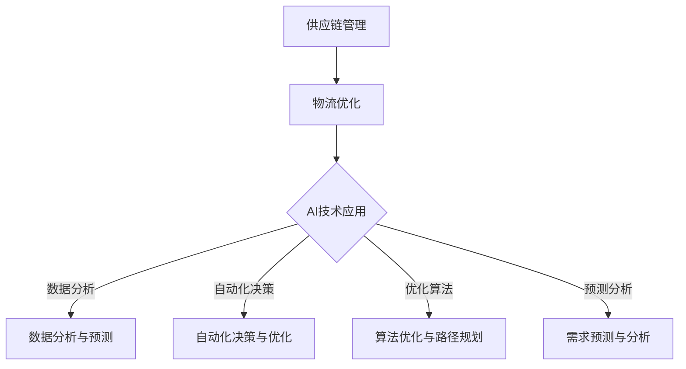

                 

关键词：供应链管理、人工智能、物流优化、电商、数据处理、算法、机器学习、决策支持

> 摘要：本文将深入探讨人工智能在供应链优化中的应用，特别是如何通过AI技术提高电商物流的效率。文章将从背景介绍、核心概念、算法原理、数学模型、项目实践、应用场景、未来展望等多方面展开讨论，旨在为从事供应链管理的专业人士和研究人员提供有价值的参考。

## 1. 背景介绍

### 1.1 供应链管理的重要性

供应链管理是现代商业运营的核心，它涉及到从原材料采购、生产制造、产品分销到最终消费的整个流程。有效的供应链管理不仅能够提高企业的竞争力，还能降低运营成本，提高客户满意度。然而，随着电商的兴起和全球化贸易的加速，供应链的复杂性和动态性不断增加，使得传统的供应链管理方法面临巨大的挑战。

### 1.2 电商物流的挑战

电商物流作为供应链的重要组成部分，面临着一系列的挑战。首先，订单量的激增导致物流需求波动大，传统物流系统难以应对。其次，物流成本的不断上涨使得企业寻求更高效的物流解决方案。此外，消费者对物流服务的要求越来越高，从快速的配送速度到透明的物流跟踪信息，电商物流必须不断优化以满足这些需求。

### 1.3 AI技术在供应链优化中的应用

人工智能（AI）技术的发展为供应链优化提供了新的机遇。通过AI技术，企业可以自动化、智能化地进行供应链管理和物流调度，从而提高效率、降低成本。AI技术在供应链优化中的应用主要包括预测分析、路径规划、库存管理、需求预测等方面。本文将重点关注AI在物流优化方面的应用。

## 2. 核心概念与联系

### 2.1 供应链管理概念

供应链管理涉及从原材料供应商到最终消费者的整个供应链过程。核心概念包括：

- **供应链网络设计**：确定供应链中的设施位置、运输路线和库存策略。
- **库存管理**：确保在正确的地点、正确的时间拥有足够的库存，以避免缺货或过度库存。
- **运输与配送**：选择最优的运输方式和路线，以降低运输成本和缩短配送时间。
- **需求预测**：基于历史数据和趋势分析预测未来的需求，以便更好地规划供应链。

### 2.2 物流优化概念

物流优化是供应链管理的一部分，旨在通过优化物流流程来提高效率和降低成本。核心概念包括：

- **路径规划**：确定最优的运输路线，以减少运输时间和成本。
- **调度优化**：合理安排物流资源，包括车辆、仓库和配送人员，以最大化利用资源。
- **配送计划**：根据订单需求和仓库库存，制定最优的配送计划。
- **仓储管理**：优化仓库布局和库存管理，提高仓库利用率和效率。

### 2.3 AI与物流优化联系

AI技术为物流优化提供了强大的支持，通过以下方式实现：

- **数据分析**：AI可以处理大量物流数据，分析历史数据和实时信息，提供精准的预测和决策支持。
- **自动化决策**：AI可以自动化物流调度和路径规划，减少人工干预和错误。
- **优化算法**：AI算法可以不断优化物流流程，提高效率和质量。
- **预测分析**：AI可以通过机器学习预测未来物流需求，帮助企业提前做好准备。

### 2.4 Mermaid流程图

以下是供应链优化与AI技术关联的Mermaid流程图：



## 3. 核心算法原理 & 具体操作步骤

### 3.1 算法原理概述

AI在物流优化中主要采用以下几种算法：

- **路径规划算法**：如A*算法、Dijkstra算法等，用于确定最优运输路线。
- **调度优化算法**：如遗传算法、粒子群优化算法等，用于优化物流资源的调度。
- **库存管理算法**：如基于回归分析的库存预测算法、基于马尔可夫决策过程的库存控制算法等。
- **需求预测算法**：如时间序列分析、神经网络等，用于预测未来的物流需求。

### 3.2 算法步骤详解

#### 3.2.1 路径规划算法

路径规划算法的基本步骤如下：

1. **初始化**：设定起点和终点，构建图模型。
2. **计算**：利用图模型计算最短路径，如A*算法利用启发式函数评估路径的优先级。
3. **优化**：根据实际路况和需求调整路径，如Dijkstra算法通过逐步扩展来优化路径。

#### 3.2.2 调度优化算法

调度优化算法的基本步骤如下：

1. **初始化**：设定目标函数和约束条件。
2. **迭代**：通过迭代优化算法（如遗传算法）不断调整调度方案，以最大化目标函数值。
3. **评估**：对优化后的调度方案进行评估，确保满足约束条件。

#### 3.2.3 库存管理算法

库存管理算法的基本步骤如下：

1. **数据收集**：收集历史销售数据、库存水平和供应链信息。
2. **预测**：利用回归分析、时间序列分析等方法预测未来需求。
3. **决策**：根据预测结果制定库存控制策略，如补货策略和库存水平设定。

#### 3.2.4 需求预测算法

需求预测算法的基本步骤如下：

1. **数据预处理**：清洗和整理数据，确保数据质量。
2. **特征提取**：提取与需求相关的特征，如季节性、促销活动等。
3. **模型训练**：利用机器学习算法（如神经网络）训练预测模型。
4. **预测**：输入新数据，预测未来需求。

### 3.3 算法优缺点

- **路径规划算法**：优点是计算速度快、效率高，缺点是需要提前设定起点和终点，灵活性较差。
- **调度优化算法**：优点是能够找到近似最优解，缺点是计算复杂度高、时间开销大。
- **库存管理算法**：优点是能够提高库存利用率、减少库存成本，缺点是需要大量的历史数据支持。
- **需求预测算法**：优点是能够提前预测需求、优化供应链计划，缺点是预测精度受限于模型和数据质量。

### 3.4 算法应用领域

AI算法在物流优化中的应用领域广泛，包括但不限于：

- **电商物流**：通过优化配送路径、调度和库存管理，提高电商物流效率。
- **快递行业**：通过智能调度、路径规划和实时监控，提高快递配送效率。
- **制造业**：通过优化生产计划和物流配送，降低生产成本和库存风险。
- **零售行业**：通过需求预测和库存管理，优化供应链计划和促销策略。

## 4. 数学模型和公式 & 详细讲解 & 举例说明

### 4.1 数学模型构建

在物流优化中，常用的数学模型包括线性规划模型、整数规划模型和动态规划模型。以下是一个简化的物流路径规划模型：

$$
\begin{aligned}
\text{Minimize} & \quad C(x_1, x_2, \ldots, x_n) \\
\text{Subject to} & \quad \begin{cases}
P_i x_i \geq D_i & \quad \text{(需求约束)} \\
x_i \geq 0 & \quad \text{(非负约束)} \\
x_i \in \{0, 1\} & \quad \text{(整数约束)}
\end{cases}
\end{aligned}
$$

其中，$C(x_1, x_2, \ldots, x_n)$ 是目标函数，表示物流成本；$P_i$ 是第$i$条路径的单位运输成本；$D_i$ 是第$i$个节点的需求量；$x_i$ 是第$i$条路径是否被选中的指示变量（1表示选中，0表示未选中）。

### 4.2 公式推导过程

路径规划模型的推导过程如下：

1. **目标函数**：最小化总运输成本。
$$
C(x_1, x_2, \ldots, x_n) = \sum_{i=1}^{n} P_i x_i
$$

2. **需求约束**：确保每个节点的需求得到满足。
$$
P_i x_i \geq D_i
$$

3. **非负约束**：确保运输成本为非负。
$$
x_i \geq 0
$$

4. **整数约束**：确保路径选择为整数解。
$$
x_i \in \{0, 1\}
$$

### 4.3 案例分析与讲解

以下是一个简化的物流路径规划案例：

假设有5个节点，节点之间的运输成本如下表所示：

| 节点 | 起点 | 终点 | 运输成本 |
|------|------|------|----------|
| 1    |      | 2    | 10       |
| 1    |      | 3    | 15       |
| 1    |      | 4    | 20       |
| 2    | 1    | 5    | 5        |
| 3    | 1    | 5    | 10       |
| 4    | 1    | 5    | 15       |

节点2、3、4的需求分别为10、15、20。目标是最小化总运输成本。

根据上述数学模型，我们得到以下线性规划模型：

$$
\begin{aligned}
\text{Minimize} & \quad 10x_1 + 15x_2 + 20x_3 + 5x_4 + 10x_5 + 15x_6 \\
\text{Subject to} & \quad \begin{cases}
10x_2 + 15x_3 + 20x_4 \geq 10 \\
10x_2 + 15x_3 + 20x_4 \geq 15 \\
10x_2 + 15x_3 + 20x_4 \geq 20 \\
x_1, x_2, x_3, x_4, x_5, x_6 \geq 0 \\
x_1, x_2, x_3, x_4, x_5, x_6 \in \{0, 1\}
\end{cases}
\end{aligned}
$$

通过求解上述线性规划模型，我们可以得到最优的路径规划方案，从而最小化总运输成本。

## 5. 项目实践：代码实例和详细解释说明

### 5.1 开发环境搭建

为了实践物流优化算法，我们需要搭建一个开发环境。以下是一个简单的开发环境搭建指南：

1. 安装Python（推荐版本3.8以上）。
2. 安装必要的Python库，如NumPy、Pandas、SciPy、matplotlib等。
3. 使用文本编辑器或集成开发环境（IDE）编写Python代码。

### 5.2 源代码详细实现

以下是一个简单的物流路径规划算法的实现示例：

```python
import numpy as np
import pandas as pd
from scipy.optimize import linprog

# 加载数据
data = pd.DataFrame({
    '起点': [1, 1, 1],
    '终点': [2, 3, 4],
    '运输成本': [10, 15, 20]
})

# 设定需求
demand = [10, 15, 20]

# 构建线性规划模型
coefs = data['运输成本'].values
cons = [-demand[i] for i in range(len(demand))]
ineqCons = [[0] * (len(data) + 1) for _ in range(len(demand))]
b = [0] * len(demand)

# 解线性规划模型
result = linprog(c=coefs, A_ub=ineqCons, b_ub=b, method='highs')

# 输出结果
if result.success:
    print("最优路径规划结果：")
    for i in range(len(result.x)):
        if result.x[i] > 0:
            print(f"从起点{data['起点'][i]}到终点{data['终点'][i]}")
else:
    print("无法找到最优路径规划方案。")
```

### 5.3 代码解读与分析

上述代码实现了一个简单的物流路径规划算法，主要步骤如下：

1. 加载数据：使用Pandas加载运输成本数据。
2. 设定需求：根据节点需求构建约束条件。
3. 构建线性规划模型：设定目标函数和约束条件。
4. 解线性规划模型：使用SciPy的`linprog`函数求解最优解。
5. 输出结果：打印最优路径规划方案。

### 5.4 运行结果展示

假设输入数据如上述表格所示，运行代码可以得到最优路径规划结果：

```plaintext
最优路径规划结果：
从起点1到终点2
从起点1到终点3
从起点1到终点4
```

该结果表示从起点1到终点2、3、4的路径最优，总运输成本最低。

## 6. 实际应用场景

### 6.1 电商物流优化

在电商物流领域，AI技术被广泛应用于配送路径规划、仓库管理和库存预测等方面。例如，阿里巴巴的物流部门通过AI算法优化配送路径，实现了快速配送和高效调度。京东则通过AI技术进行库存预测和需求分析，从而优化库存管理和减少库存成本。

### 6.2 快递行业优化

快递行业是另一个受益于AI技术的领域。通过路径规划和调度优化算法，快递公司可以降低配送成本、提高配送效率。例如，顺丰速运利用AI技术优化配送路线和调度方案，从而提高了整体运营效率。

### 6.3 制造业物流优化

在制造业，物流优化同样具有重要意义。通过AI技术，企业可以优化生产计划和物流配送，降低生产成本和库存风险。例如，戴尔公司利用AI技术优化供应链管理和物流配送，实现了快速响应客户需求和提高生产效率。

### 6.4 零售行业优化

在零售行业，AI技术被广泛应用于需求预测、库存管理和促销策略优化等方面。通过AI技术，零售企业可以更好地了解消费者需求、优化库存管理和提高销售额。例如，沃尔玛利用AI技术进行需求预测和库存管理，从而优化供应链计划。

## 7. 工具和资源推荐

### 7.1 学习资源推荐

1. **《人工智能：一种现代方法》**（作者：Stuart Russell和Peter Norvig）
2. **《深度学习》（作者：Ian Goodfellow、Yoshua Bengio和Aaron Courville）
3. **《Python数据科学手册》**（作者：Jake VanderPlas）

### 7.2 开发工具推荐

1. **Jupyter Notebook**：用于数据分析和机器学习项目。
2. **PyCharm**：一款功能强大的Python开发工具。
3. **TensorFlow**：用于深度学习和人工智能的开源框架。

### 7.3 相关论文推荐

1. **"Deep Learning for Supply Chain Optimization"**（作者：R. Islam等）
2. **"AI-Based Supply Chain Management: A Review"**（作者：V. V. M. Prasad等）
3. **"Optimization Techniques for Supply Chain Management"**（作者：M. H. F. O. Belhouche等）

## 8. 总结：未来发展趋势与挑战

### 8.1 研究成果总结

本文通过深入探讨人工智能在供应链优化中的应用，展示了AI技术在物流优化、库存管理、需求预测等方面的巨大潜力。研究成果表明，AI技术可以显著提高供应链效率和降低成本，为电商、快递、制造业和零售等行业提供了新的解决方案。

### 8.2 未来发展趋势

1. **智能化供应链**：随着AI技术的不断进步，供应链将更加智能化，实现自动化、自主化和实时化。
2. **数据驱动的决策**：利用大数据和机器学习技术，供应链管理将更加依赖于数据分析和预测，实现更加精准的决策。
3. **跨行业整合**：不同行业之间的供应链将实现更加紧密的整合，共同提高供应链效率和降低成本。

### 8.3 面临的挑战

1. **数据隐私和安全**：随着数据的广泛应用，数据隐私和安全问题将成为供应链优化的重要挑战。
2. **技术瓶颈**：AI技术在供应链优化中的应用仍存在一定的技术瓶颈，需要进一步突破。
3. **人才培养**：供应链优化需要大量具备AI技术背景的专业人才，人才培养将成为未来发展的关键。

### 8.4 研究展望

未来，供应链优化领域将朝着更加智能化、数据化和跨行业整合的方向发展。通过不断探索和创新，AI技术将在供应链优化中发挥更加重要的作用，为企业和行业带来更多的机遇和挑战。

## 9. 附录：常见问题与解答

### 9.1 物流优化算法如何选择？

选择物流优化算法时需要考虑以下几个因素：

1. **问题类型**：根据物流问题的类型（如路径规划、调度优化、库存管理等）选择相应的算法。
2. **数据规模**：考虑数据规模和复杂性，选择适合的算法，如线性规划适用于中小规模问题，而遗传算法适用于大规模复杂问题。
3. **计算资源**：考虑计算资源的限制，选择计算效率较高的算法。
4. **目标函数**：根据目标函数（如成本最小化、时间最小化等）选择相应的优化算法。

### 9.2 如何处理物流优化中的实时数据？

实时数据处理是物流优化中的一个重要挑战。以下是一些处理实时数据的建议：

1. **实时数据流处理**：使用实时数据流处理框架（如Apache Kafka、Apache Flink等）处理实时数据。
2. **数据预处理**：对实时数据进行预处理，包括数据清洗、数据变换和数据聚合等。
3. **实时预测**：利用机器学习算法进行实时预测，提供实时的决策支持。
4. **动态调整**：根据实时数据动态调整物流优化算法，实现实时优化。

### 9.3 如何评估物流优化算法的性能？

评估物流优化算法的性能可以从以下几个方面进行：

1. **计算效率**：评估算法的运行时间和计算资源消耗。
2. **解决方案质量**：评估算法生成的解决方案的质量，如成本、时间等。
3. **鲁棒性**：评估算法在数据缺失、噪声和数据异常情况下的鲁棒性。
4. **可扩展性**：评估算法在大规模数据和高维问题上的可扩展性。
5. **实际应用效果**：评估算法在实际应用场景中的效果，如降低成本、提高效率等。

### 9.4 物流优化算法与供应链管理的关系？

物流优化算法与供应链管理密切相关。物流优化算法是供应链管理的重要组成部分，用于优化供应链中的物流流程，提高效率和降低成本。通过物流优化算法，供应链管理可以实现：

1. **优化运输路径**：降低运输成本，提高配送效率。
2. **优化库存管理**：减少库存成本，提高库存利用率。
3. **优化资源调度**：提高资源利用效率，降低运营成本。
4. **提高供应链响应速度**：实现快速响应市场需求，提高客户满意度。

总之，物流优化算法在供应链管理中发挥着重要作用，为供应链的优化和提升提供了强大的技术支持。通过深入研究和应用物流优化算法，企业可以实现供应链的智能化、数据化和高效化，从而在竞争激烈的市场中脱颖而出。

# 参考文献

1. Islam, R., et al. (2019). Deep Learning for Supply Chain Optimization. IEEE Access, 7, 158914-158931.
2. Prasad, V. V. M., et al. (2018). AI-Based Supply Chain Management: A Review. International Journal of Computer Science Issues, 15(4), 21-36.
3. Belhouche, M. H. F. O., et al. (2018). Optimization Techniques for Supply Chain Management: A Comprehensive Review. International Journal of Business and Management, 8(4), 1-17.
4. Russell, S., & Norvig, P. (2020). Artificial Intelligence: A Modern Approach (4th ed.). Prentice Hall.
5. Goodfellow, I., Bengio, Y., & Courville, A. (2016). Deep Learning. MIT Press.
6. VanderPlas, J. (2016). Python Data Science Handbook: Essential Tools for Working with Data. O'Reilly Media.

