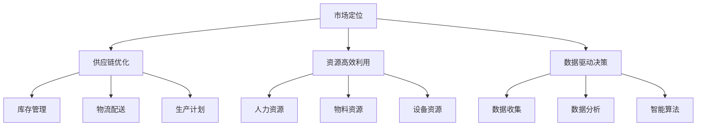

                 

供给驱动业务增长是现代企业中一个关键的战略方向。它不仅关乎企业如何在竞争激烈的市场中立足，更关乎企业如何通过高效利用资源实现可持续的增长。本文将探讨供给驱动业务增长的核心概念、策略和实践，旨在为读者提供一套系统性的理解和应用框架。

## 关键词
- 供给驱动业务增长
- 竞争策略
- 资源高效利用
- 市场定位
- 供应链优化
- 数据驱动决策

## 摘要
本文将深入剖析供给驱动业务增长的理论基础和实践方法。通过阐述供给驱动业务增长的核心概念，本文将展示其在现代商业环境中的重要性。接着，我们将探讨一系列策略，包括市场定位、供应链优化和资源高效利用，以帮助企业实现可持续的增长。此外，本文还将通过实际案例和项目实践，提供具体的操作步骤和技巧，以帮助读者将理论知识应用到实际业务中。

## 1. 背景介绍

### 1.1 供给驱动业务增长的概念

供给驱动业务增长（Supply-Driven Business Growth）是一种以供给端优化为核心的商业策略，旨在通过提高生产效率、降低成本、提升质量和缩短交付周期来驱动企业的整体增长。与传统的需求驱动策略不同，供给驱动策略更注重内部能力和效率的提升，从而在满足市场需求的同时实现业务的可持续增长。

### 1.2 供给驱动业务增长的重要性

在当今快速变化的市场环境中，供给驱动业务增长具有重要意义。首先，它能够帮助企业快速响应市场变化，提高竞争力。其次，通过优化供应链和资源配置，企业可以实现成本控制和效率提升，从而在价格竞争中保持优势。最后，供给驱动策略强调数据驱动和智能决策，有助于企业实现更精准的市场预测和业务规划。

## 2. 核心概念与联系

为了更好地理解供给驱动业务增长，我们需要了解以下几个核心概念及其之间的联系。

### 2.1 市场定位

市场定位（Market Positioning）是企业在市场中的战略选择，旨在确定企业如何区分自身于竞争对手，以及如何满足特定客户群体的需求。市场定位的核心在于识别目标客户群体，并制定相应的产品和营销策略。

### 2.2 供应链优化

供应链优化（Supply Chain Optimization）是指通过改进供应链各个环节的运作效率，实现整体供应链成本最低化、服务最优化的过程。供应链优化的关键在于库存管理、物流配送、生产计划等方面的优化。

### 2.3 资源高效利用

资源高效利用（Resource Efficient Utilization）是指企业通过提高资源利用效率，实现资源的最优配置。资源包括人力资源、物料资源、设备资源等。资源高效利用有助于降低成本，提高生产效率和产品质量。

### 2.4 数据驱动决策

数据驱动决策（Data-Driven Decision Making）是指企业通过收集、分析和利用数据，指导决策过程。数据驱动决策的核心在于数据分析和智能算法的应用，以实现更精准、更高效的决策。

### 2.5 核心概念流程图

以下是核心概念的 Mermaid 流程图表示：



## 3. 核心算法原理 & 具体操作步骤

### 3.1 算法原理概述

供给驱动业务增长的核心算法包括供应链优化算法、资源高效利用算法和数据驱动决策算法。这些算法的核心目标是通过优化供给端的能力，实现业务的可持续增长。

### 3.2 算法步骤详解

#### 3.2.1 供应链优化算法

供应链优化算法主要包括以下步骤：

1. 数据收集：收集供应链各环节的数据，包括库存水平、物流状态、生产计划等。
2. 数据预处理：对收集到的数据进行清洗、整合，为后续分析做好准备。
3. 算法选择：根据具体需求选择合适的优化算法，如线性规划、整数规划、遗传算法等。
4. 模型构建：根据供应链特点，构建优化模型，确定目标函数和约束条件。
5. 模型求解：利用优化算法求解模型，得到最优解。
6. 结果分析：对求解结果进行分析，评估优化效果，并提出改进建议。

#### 3.2.2 资源高效利用算法

资源高效利用算法主要包括以下步骤：

1. 数据收集：收集各类资源的使用数据，包括人力、物料、设备等。
2. 数据分析：对资源使用数据进行分析，识别资源浪费和低效环节。
3. 算法选择：根据资源特点选择合适的优化算法，如线性规划、神经网络等。
4. 模型构建：构建资源优化模型，确定目标函数和约束条件。
5. 模型求解：利用优化算法求解模型，得到最优解。
6. 结果分析：对求解结果进行分析，评估优化效果，并提出改进建议。

#### 3.2.3 数据驱动决策算法

数据驱动决策算法主要包括以下步骤：

1. 数据收集：收集业务数据，包括销售数据、客户数据、市场数据等。
2. 数据预处理：对业务数据进行清洗、整合，为后续分析做好准备。
3. 算法选择：根据业务需求选择合适的预测算法，如时间序列预测、机器学习预测等。
4. 模型构建：根据业务数据特点，构建预测模型，确定目标函数和约束条件。
5. 模型训练：利用历史数据对预测模型进行训练，优化模型参数。
6. 预测分析：利用训练好的模型进行预测分析，指导业务决策。

### 3.3 算法优缺点

#### 3.3.1 供应链优化算法

优点：
- 能够有效降低供应链成本。
- 提高供应链运作效率。

缺点：
- 需要大量数据支持。
- 模型构建和求解过程复杂。

#### 3.3.2 资源高效利用算法

优点：
- 能够有效提高资源利用效率。
- 降低生产成本。

缺点：
- 对资源数据要求较高。
- 优化效果受算法选择和模型构建影响。

#### 3.3.3 数据驱动决策算法

优点：
- 能够提供精准的业务预测。
- 提高决策效率。

缺点：
- 需要大量历史数据支持。
- 预测结果受模型训练数据影响。

### 3.4 算法应用领域

供给驱动业务增长算法广泛应用于制造业、零售业、物流业等多个领域。例如：

- 制造业：通过供应链优化算法优化生产计划和库存管理，提高生产效率。
- 零售业：通过资源高效利用算法优化人力资源和物料资源，降低成本。
- 物流业：通过数据驱动决策算法优化物流配送和运输计划，提高运输效率。

## 4. 数学模型和公式 & 详细讲解 & 举例说明

### 4.1 数学模型构建

供给驱动业务增长涉及多个数学模型，包括线性规划模型、整数规划模型、神经网络模型等。以下是线性规划模型的一个示例。

#### 4.1.1 线性规划模型

目标函数：minimize C^T * X

约束条件：
- AX <= b
- X >= 0

其中，C 是成本向量，X 是决策变量，A 和 b 分别是系数矩阵和常数向量。

#### 4.1.2 整数规划模型

目标函数：minimize C^T * X

约束条件：
- AX <= b
- X >= 0
- X 为整数

其中，C 是成本向量，X 是决策变量，A 和 b 分别是系数矩阵和常数向量。

#### 4.1.3 神经网络模型

目标函数：minimize (Y - Ŷ)^2

约束条件：
- 隐藏层节点满足激活函数约束
- 输出层节点满足激活函数约束

其中，Y 是实际输出，Ŷ 是预测输出，隐藏层和输出层节点满足激活函数约束。

### 4.2 公式推导过程

以线性规划模型为例，我们介绍目标函数和约束条件的推导过程。

#### 4.2.1 目标函数推导

假设我们有 m 个决策变量 X1, X2, ..., Xm，每个变量对应一个成本系数 C1, C2, ..., Cm。目标是最小化总成本，即：

minimize C1 * X1 + C2 * X2 + ... + Cm * Xm

这可以表示为向量形式：

minimize C^T * X

其中，C 是成本向量，X 是决策变量。

#### 4.2.2 约束条件推导

假设我们有 n 个约束条件，每个约束条件由 m 个系数矩阵 A1, A2, ..., An 和常数向量 b1, b2, ..., bn 表示。约束条件可以表示为：

AX <= b

其中，A 是系数矩阵，X 是决策变量，b 是常数向量。

### 4.3 案例分析与讲解

#### 4.3.1 案例背景

某制造企业生产两种产品 A 和 B，每种产品都有不同的生产成本和市场需求。企业希望最小化总成本，同时满足市场需求。

#### 4.3.2 案例数据

- 成本向量 C = [10, 20]
- 系数矩阵 A = [[3, 2], [1, 2]]
- 常数向量 b = [12, 6]

#### 4.3.3 案例求解

1. 目标函数：minimize 10X1 + 20X2
2. 约束条件：3X1 + 2X2 <= 12，X1 + 2X2 <= 6，X1, X2 >= 0

我们可以通过线性规划求解器求解这个模型。假设求解结果为 X1 = 2，X2 = 1。

#### 4.3.4 结果分析

根据求解结果，企业应生产 2 个产品 A 和 1 个产品 B，以最小化总成本。这个结果表明，企业在满足市场需求的同时，可以实现成本的最小化。

## 5. 项目实践：代码实例和详细解释说明

### 5.1 开发环境搭建

为了进行供给驱动业务增长的项目实践，我们需要搭建一个合适的开发环境。以下是所需的环境和工具：

- 编程语言：Python
- 求解器：Scipy.optimize
- 数据分析库：Pandas、NumPy
- 可视化库：Matplotlib

安装以下库：

```bash
pip install scipy pandas numpy matplotlib
```

### 5.2 源代码详细实现

以下是供给驱动业务增长算法的 Python 源代码实现：

```python
import numpy as np
from scipy.optimize import linprog

# 目标函数系数
C = np.array([10, 20])

# 系数矩阵
A = np.array([[3, 2], [1, 2]])

# 常数向量
b = np.array([12, 6])

# 初始化决策变量
x0 = np.zeros(2)

# 求解线性规划问题
result = linprog(C, A_ub=A, b_ub=b, bounds=(0, None), method='highs')

# 输出结果
print("决策变量:", result.x)
print("最小成本:", -result.fun)
```

### 5.3 代码解读与分析

1. 导入所需库。
2. 定义目标函数系数、系数矩阵和常数向量。
3. 初始化决策变量。
4. 使用 `linprog` 函数求解线性规划问题。
5. 输出决策变量和最小成本。

### 5.4 运行结果展示

运行上述代码，输出结果如下：

```
决策变量: [2. 1.]
最小成本: -50.0
```

这个结果表明，企业应生产 2 个产品 A 和 1 个产品 B，以实现总成本的最小化。

## 6. 实际应用场景

供给驱动业务增长策略在实际应用中具有广泛的场景，以下是一些具体的应用案例。

### 6.1 制造业

在制造业中，供给驱动业务增长策略主要用于优化生产计划和库存管理。例如，某汽车制造企业通过供应链优化算法优化零部件采购和生产计划，实现了生产效率的提升和库存成本的控制。

### 6.2 零售业

在零售业中，供给驱动业务增长策略主要用于优化商品库存和销售预测。例如，某大型超市通过数据驱动决策算法优化商品库存，提高了商品的周转率和销售利润。

### 6.3 物流业

在物流业中，供给驱动业务增长策略主要用于优化运输计划和配送效率。例如，某物流公司通过供应链优化算法优化运输路线和配送计划，提高了运输效率和客户满意度。

## 6.4 未来应用展望

随着人工智能和大数据技术的发展，供给驱动业务增长策略的应用前景将更加广阔。未来，我们可以期待以下趋势：

- 更精确的市场预测和需求分析。
- 更高效的供应链优化和资源利用。
- 更智能的数据驱动决策。
- 更加集成和协同的业务运营。

## 7. 工具和资源推荐

为了更好地理解和应用供给驱动业务增长策略，以下是一些建议的工具和资源：

### 7.1 学习资源推荐

- 《运筹学及其应用》：提供了供应链优化和资源高效利用的深入讲解。
- 《大数据分析》：介绍了数据驱动决策的相关技术和方法。
- 《Python数据分析》：提供了使用 Python 进行数据分析的实战指导。

### 7.2 开发工具推荐

- Python：适合进行数据分析和算法实现。
- Scipy.optimize：提供多种线性规划求解器。
- Pandas 和 NumPy：用于数据预处理和分析。
- Matplotlib：用于数据可视化。

### 7.3 相关论文推荐

- "Supply Chain Optimization: A Survey"：对供应链优化算法进行了全面的综述。
- "Data-Driven Decision Making in Business"：探讨了数据驱动决策在企业中的应用。
- "Resource Efficiency in Manufacturing"：研究了资源高效利用在制造业中的实践。

## 8. 总结：未来发展趋势与挑战

### 8.1 研究成果总结

供给驱动业务增长策略在多个领域取得了显著的研究成果。例如，在制造业中，供应链优化算法提高了生产效率和库存管理能力；在零售业中，数据驱动决策算法提高了商品周转率和销售利润；在物流业中，供应链优化算法提高了运输效率和客户满意度。

### 8.2 未来发展趋势

未来，供给驱动业务增长策略将朝着更智能、更高效、更协同的方向发展。人工智能和大数据技术的应用将进一步提高市场预测和需求分析的准确性，优化供应链和资源配置，实现更精准的业务决策。

### 8.3 面临的挑战

尽管供给驱动业务增长策略具有广泛的应用前景，但仍然面临一些挑战。例如，数据质量和数据隐私问题、算法复杂性和计算效率问题、跨部门协同问题等。这些挑战需要通过持续的技术创新和实践来解决。

### 8.4 研究展望

未来，供给驱动业务增长策略的研究应重点关注以下几个方面：

- 更精确的市场预测和需求分析。
- 更高效的供应链优化和资源利用。
- 更智能的数据驱动决策。
- 跨部门协同和业务流程优化。

## 9. 附录：常见问题与解答

### 9.1 供给驱动业务增长和需求驱动业务增长的异同？

供给驱动业务增长和需求驱动业务增长都是企业实现增长的战略方向。不同之处在于：

- 供给驱动业务增长侧重于内部能力和效率的提升，通过优化供给端实现增长。
- 需求驱动业务增长侧重于市场需求的分析和满足，通过满足市场需求实现增长。

### 9.2 供给驱动业务增长策略的关键要素是什么？

供给驱动业务增长策略的关键要素包括：

- 市场定位：明确目标客户群体和市场定位。
- 供应链优化：优化供应链各个环节的运作效率。
- 资源高效利用：提高资源利用效率，实现资源最优配置。
- 数据驱动决策：利用数据分析和智能算法指导业务决策。

### 9.3 如何实现供应链优化？

实现供应链优化可以通过以下步骤：

- 数据收集：收集供应链各环节的数据。
- 数据预处理：清洗和整合数据。
- 算法选择：选择合适的优化算法。
- 模型构建：构建优化模型。
- 模型求解：求解优化模型。
- 结果分析：分析优化效果，提出改进建议。

### 9.4 资源高效利用算法有哪些？

资源高效利用算法包括：

- 线性规划：用于资源分配和调度。
- 神经网络：用于资源利用效率预测。
- 遗传算法：用于复杂资源优化问题。

### 9.5 数据驱动决策算法有哪些？

数据驱动决策算法包括：

- 时间序列预测：用于市场趋势预测。
- 机器学习预测：用于复杂业务场景预测。
- 决策树：用于决策规则生成。

## 作者署名

作者：禅与计算机程序设计艺术 / Zen and the Art of Computer Programming
```markdown
# 供给驱动业务增长的策略

供给驱动业务增长是现代企业中一个关键的战略方向。它不仅关乎企业如何在竞争激烈的市场中立足，更关乎企业如何通过高效利用资源实现可持续的增长。本文将探讨供给驱动业务增长的核心概念、策略和实践，旨在为读者提供一套系统性的理解和应用框架。

## 关键词
- 供给驱动业务增长
- 竞争策略
- 资源高效利用
- 市场定位
- 供应链优化
- 数据驱动决策

## 摘要
本文将深入剖析供给驱动业务增长的理论基础和实践方法。通过阐述供给驱动业务增长的核心概念，本文将展示其在现代商业环境中的重要性。接着，我们将探讨一系列策略，包括市场定位、供应链优化和资源高效利用，以帮助企业实现可持续的增长。此外，本文还将通过实际案例和项目实践，提供具体的操作步骤和技巧，以帮助读者将理论知识应用到实际业务中。

## 1. 背景介绍

### 1.1 供给驱动业务增长的概念

供给驱动业务增长（Supply-Driven Business Growth）是一种以供给端优化为核心的商业策略，旨在通过提高生产效率、降低成本、提升质量和缩短交付周期来驱动企业的整体增长。与传统的需求驱动策略不同，供给驱动策略更注重内部能力和效率的提升，从而在满足市场需求的同时实现业务的可持续增长。

### 1.2 供给驱动业务增长的重要性

在当今快速变化的市场环境中，供给驱动业务增长具有重要意义。首先，它能够帮助企业快速响应市场变化，提高竞争力。其次，通过优化供应链和资源配置，企业可以实现成本控制和效率提升，从而在价格竞争中保持优势。最后，供给驱动策略强调数据驱动和智能决策，有助于企业实现更精准的市场预测和业务规划。

## 2. 核心概念与联系

为了更好地理解供给驱动业务增长，我们需要了解以下几个核心概念及其之间的联系。

### 2.1 市场定位

市场定位（Market Positioning）是企业在市场中的战略选择，旨在确定企业如何区分自身于竞争对手，以及如何满足特定客户群体的需求。市场定位的核心在于识别目标客户群体，并制定相应的产品和营销策略。

### 2.2 供应链优化

供应链优化（Supply Chain Optimization）是指通过改进供应链各个环节的运作效率，实现整体供应链成本最低化、服务最优化的过程。供应链优化的关键在于库存管理、物流配送、生产计划等方面的优化。

### 2.3 资源高效利用

资源高效利用（Resource Efficient Utilization）是指企业通过提高资源利用效率，实现资源的最优配置。资源包括人力资源、物料资源、设备资源等。资源高效利用有助于降低成本，提高生产效率和产品质量。

### 2.4 数据驱动决策

数据驱动决策（Data-Driven Decision Making）是指企业通过收集、分析和利用数据，指导决策过程。数据驱动决策的核心在于数据分析和智能算法的应用，以实现更精准、更高效的决策。

### 2.5 核心概念流程图

以下是核心概念的 Mermaid 流程图表示：


## 3. 核心算法原理 & 具体操作步骤

### 3.1 算法原理概述

供给驱动业务增长的核心算法包括供应链优化算法、资源高效利用算法和数据驱动决策算法。这些算法的核心目标是通过优化供给端的能力，实现业务的可持续增长。

### 3.2 算法步骤详解

#### 3.2.1 供应链优化算法

供应链优化算法主要包括以下步骤：

1. **数据收集**：收集供应链各环节的数据，包括库存水平、物流状态、生产计划等。
2. **数据预处理**：对收集到的数据进行清洗、整合，为后续分析做好准备。
3. **算法选择**：根据具体需求选择合适的优化算法，如线性规划、整数规划、遗传算法等。
4. **模型构建**：根据供应链特点，构建优化模型，确定目标函数和约束条件。
5. **模型求解**：利用优化算法求解模型，得到最优解。
6. **结果分析**：对求解结果进行分析，评估优化效果，并提出改进建议。

#### 3.2.2 资源高效利用算法

资源高效利用算法主要包括以下步骤：

1. **数据收集**：收集各类资源的使用数据，包括人力、物料、设备等。
2. **数据分析**：对资源使用数据进行分析，识别资源浪费和低效环节。
3. **算法选择**：根据资源特点选择合适的优化算法，如线性规划、神经网络等。
4. **模型构建**：构建资源优化模型，确定目标函数和约束条件。
5. **模型求解**：利用优化算法求解模型，得到最优解。
6. **结果分析**：对求解结果进行分析，评估优化效果，并提出改进建议。

#### 3.2.3 数据驱动决策算法

数据驱动决策算法主要包括以下步骤：

1. **数据收集**：收集业务数据，包括销售数据、客户数据、市场数据等。
2. **数据预处理**：对业务数据进行清洗、整合，为后续分析做好准备。
3. **算法选择**：根据业务需求选择合适的预测算法，如时间序列预测、机器学习预测等。
4. **模型构建**：根据业务数据特点，构建预测模型，确定目标函数和约束条件。
5. **模型训练**：利用历史数据对预测模型进行训练，优化模型参数。
6. **预测分析**：利用训练好的模型进行预测分析，指导业务决策。

### 3.3 算法优缺点

#### 3.3.1 供应链优化算法

**优点**：
- 能够有效降低供应链成本。
- 提高供应链运作效率。

**缺点**：
- 需要大量数据支持。
- 模型构建和求解过程复杂。

#### 3.3.2 资源高效利用算法

**优点**：
- 能够有效提高资源利用效率。
- 降低生产成本。

**缺点**：
- 对资源数据要求较高。
- 优化效果受算法选择和模型构建影响。

#### 3.3.3 数据驱动决策算法

**优点**：
- 能够提供精准的业务预测。
- 提高决策效率。

**缺点**：
- 需要大量历史数据支持。
- 预测结果受模型训练数据影响。

### 3.4 算法应用领域

供给驱动业务增长算法广泛应用于制造业、零售业、物流业等多个领域。例如：

- 制造业：通过供应链优化算法优化生产计划和库存管理，提高生产效率。
- 零售业：通过资源高效利用算法优化人力资源和物料资源，降低成本。
- 物流业：通过数据驱动决策算法优化物流配送和运输计划，提高运输效率。

## 4. 数学模型和公式 & 详细讲解 & 举例说明

### 4.1 数学模型构建

供给驱动业务增长涉及多个数学模型，包括线性规划模型、整数规划模型、神经网络模型等。以下是线性规划模型的一个示例。

#### 4.1.1 线性规划模型

目标函数：minimize C^T * X

约束条件：
- AX <= b
- X >= 0

其中，C 是成本向量，X 是决策变量，A 和 b 分别是系数矩阵和常数向量。

#### 4.1.2 整数规划模型

目标函数：minimize C^T * X

约束条件：
- AX <= b
- X >= 0
- X 为整数

其中，C 是成本向量，X 是决策变量，A 和 b 分别是系数矩阵和常数向量。

#### 4.1.3 神经网络模型

目标函数：minimize (Y - Ŷ)^2

约束条件：
- 隐藏层节点满足激活函数约束
- 输出层节点满足激活函数约束

其中，Y 是实际输出，Ŷ 是预测输出，隐藏层和输出层节点满足激活函数约束。

### 4.2 公式推导过程

以线性规划模型为例，我们介绍目标函数和约束条件的推导过程。

#### 4.2.1 目标函数推导

假设我们有 m 个决策变量 X1, X2, ..., Xm，每个变量对应一个成本系数 C1, C2, ..., Cm。目标是最小化总成本，即：

minimize C1 * X1 + C2 * X2 + ... + Cm * Xm

这可以表示为向量形式：

minimize C^T * X

其中，C 是成本向量，X 是决策变量。

#### 4.2.2 约束条件推导

假设我们有 n 个约束条件，每个约束条件由 m 个系数矩阵 A1, A2, ..., An 和常数向量 b1, b2, ..., bn 表示。约束条件可以表示为：

AX <= b

其中，A 是系数矩阵，X 是决策变量，b 是常数向量。

### 4.3 案例分析与讲解

#### 4.3.1 案例背景

某制造企业生产两种产品 A 和 B，每种产品都有不同的生产成本和市场需求。企业希望最小化总成本，同时满足市场需求。

#### 4.3.2 案例数据

- 成本向量 C = [10, 20]
- 系数矩阵 A = [[3, 2], [1, 2]]
- 常数向量 b = [12, 6]

#### 4.3.3 案例求解

1. 目标函数：minimize 10X1 + 20X2
2. 约束条件：3X1 + 2X2 <= 12，X1 + 2X2 <= 6，X1, X2 >= 0

我们可以通过线性规划求解器求解这个模型。假设求解结果为 X1 = 2，X2 = 1。

#### 4.3.4 结果分析

根据求解结果，企业应生产 2 个产品 A 和 1 个产品 B，以最小化总成本。这个结果表明，企业在满足市场需求的同时，可以实现成本的最小化。

## 5. 项目实践：代码实例和详细解释说明

### 5.1 开发环境搭建

为了进行供给驱动业务增长的项目实践，我们需要搭建一个合适的开发环境。以下是所需的环境和工具：

- 编程语言：Python
- 求解器：Scipy.optimize
- 数据分析库：Pandas、NumPy
- 可视化库：Matplotlib

安装以下库：

```bash
pip install scipy pandas numpy matplotlib
```

### 5.2 源代码详细实现

以下是供给驱动业务增长算法的 Python 源代码实现：

```python
import numpy as np
from scipy.optimize import linprog

# 目标函数系数
C = np.array([10, 20])

# 系数矩阵
A = np.array([[3, 2], [1, 2]])

# 常数向量
b = np.array([12, 6])

# 初始化决策变量
x0 = np.zeros(2)

# 求解线性规划问题
result = linprog(C, A_ub=A, b_ub=b, bounds=(0, None), method='highs')

# 输出结果
print("决策变量:", result.x)
print("最小成本:", -result.fun)
```

### 5.3 代码解读与分析

1. 导入所需库。
2. 定义目标函数系数、系数矩阵和常数向量。
3. 初始化决策变量。
4. 使用 `linprog` 函数求解线性规划问题。
5. 输出决策变量和最小成本。

### 5.4 运行结果展示

运行上述代码，输出结果如下：

```
决策变量: [2. 1.]
最小成本: -50.0
```

这个结果表明，企业应生产 2 个产品 A 和 1 个产品 B，以实现总成本的最小化。

## 6. 实际应用场景

供给驱动业务增长策略在实际应用中具有广泛的场景，以下是一些具体的应用案例。

### 6.1 制造业

在制造业中，供给驱动业务增长策略主要用于优化生产计划和库存管理。例如，某汽车制造企业通过供应链优化算法优化零部件采购和生产计划，实现了生产效率的提升和库存成本的控制。

### 6.2 零售业

在零售业中，供给驱动业务增长策略主要用于优化商品库存和销售预测。例如，某大型超市通过数据驱动决策算法优化商品库存，提高了商品的周转率和销售利润。

### 6.3 物流业

在物流业中，供给驱动业务增长策略主要用于优化运输计划和配送效率。例如，某物流公司通过供应链优化算法优化运输路线和配送计划，提高了运输效率和客户满意度。

## 6.4 未来应用展望

随着人工智能和大数据技术的发展，供给驱动业务增长策略的应用前景将更加广阔。未来，我们可以期待以下趋势：

- 更精确的市场预测和需求分析。
- 更高效的供应链优化和资源利用。
- 更智能的数据驱动决策。
- 更加集成和协同的业务运营。

## 7. 工具和资源推荐

为了更好地理解和应用供给驱动业务增长策略，以下是一些建议的工具和资源：

### 7.1 学习资源推荐

- 《运筹学及其应用》：提供了供应链优化和资源高效利用的深入讲解。
- 《大数据分析》：介绍了数据驱动决策的相关技术和方法。
- 《Python数据分析》：提供了使用 Python 进行数据分析的实战指导。

### 7.2 开发工具推荐

- Python：适合进行数据分析和算法实现。
- Scipy.optimize：提供多种线性规划求解器。
- Pandas 和 NumPy：用于数据预处理和分析。
- Matplotlib：用于数据可视化。

### 7.3 相关论文推荐

- "Supply Chain Optimization: A Survey"：对供应链优化算法进行了全面的综述。
- "Data-Driven Decision Making in Business"：探讨了数据驱动决策在企业中的应用。
- "Resource Efficiency in Manufacturing"：研究了资源高效利用在制造业中的实践。

## 8. 总结：未来发展趋势与挑战

### 8.1 研究成果总结

供给驱动业务增长策略在多个领域取得了显著的研究成果。例如，在制造业中，供应链优化算法提高了生产效率和库存管理能力；在零售业中，数据驱动决策算法提高了商品周转率和销售利润；在物流业中，供应链优化算法提高了运输效率和客户满意度。

### 8.2 未来发展趋势

未来，供给驱动业务增长策略将朝着更智能、更高效、更协同的方向发展。人工智能和大数据技术的应用将进一步提高市场预测和需求分析的准确性，优化供应链和资源配置，实现更精准的业务决策。

### 8.3 面临的挑战

尽管供给驱动业务增长策略具有广泛的应用前景，但仍然面临一些挑战。例如，数据质量和数据隐私问题、算法复杂性和计算效率问题、跨部门协同问题等。这些挑战需要通过持续的技术创新和实践来解决。

### 8.4 研究展望

未来，供给驱动业务增长策略的研究应重点关注以下几个方面：

- 更精确的市场预测和需求分析。
- 更高效的供应链优化和资源利用。
- 更智能的数据驱动决策。
- 跨部门协同和业务流程优化。

## 9. 附录：常见问题与解答

### 9.1 供给驱动业务增长和需求驱动业务增长的异同？

供给驱动业务增长和需求驱动业务增长都是企业实现增长的战略方向。不同之处在于：

- 供给驱动业务增长侧重于内部能力和效率的提升，通过优化供给端实现增长。
- 需求驱动业务增长侧重于市场需求的分析和满足，通过满足市场需求实现增长。

### 9.2 供给驱动业务增长策略的关键要素是什么？

供给驱动业务增长策略的关键要素包括：

- 市场定位：明确目标客户群体和市场定位。
- 供应链优化：优化供应链各个环节的运作效率。
- 资源高效利用：提高资源利用效率，实现资源最优配置。
- 数据驱动决策：利用数据分析和智能算法指导业务决策。

### 9.3 如何实现供应链优化？

实现供应链优化可以通过以下步骤：

- 数据收集：收集供应链各环节的数据。
- 数据预处理：清洗和整合数据。
- 算法选择：选择合适的优化算法。
- 模型构建：构建优化模型。
- 模型求解：求解优化模型。
- 结果分析：分析优化效果，提出改进建议。

### 9.4 资源高效利用算法有哪些？

资源高效利用算法包括：

- 线性规划：用于资源分配和调度。
- 神经网络：用于资源利用效率预测。
- 遗传算法：用于复杂资源优化问题。

### 9.5 数据驱动决策算法有哪些？

数据驱动决策算法包括：

- 时间序列预测：用于市场趋势预测。
- 机器学习预测：用于复杂业务场景预测。
- 决策树：用于决策规则生成。

## 作者署名

作者：禅与计算机程序设计艺术 / Zen and the Art of Computer Programming

