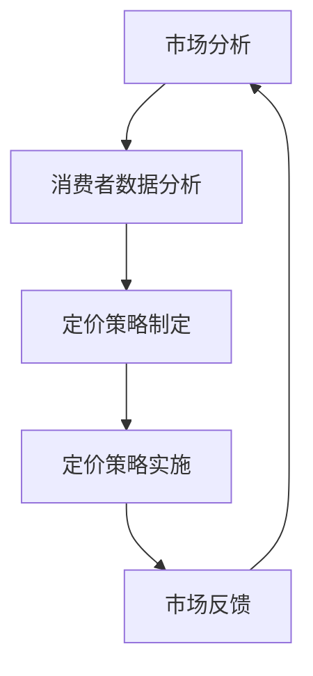

                 

 > **关键词：** 商业定价、信息差、大数据、个性化定价、商业策略、人工智能。

> **摘要：** 本文将探讨大数据如何支持商业定价个性化。通过分析信息差在商业定价中的重要性，结合大数据技术的应用，阐述如何利用大数据实现精准定价，提高市场竞争力和客户满意度。

## 1. 背景介绍

在当今竞争激烈的市场环境中，企业需要不断地调整和优化自己的商业策略，以适应不断变化的市场需求和消费者行为。商业定价作为企业盈利的关键因素之一，直接关系到企业的市场份额、盈利能力和品牌形象。传统的商业定价方法通常基于历史数据和市场经验，这种方式在一定程度上能够满足市场需求，但往往难以应对复杂多变的市场环境。

随着大数据技术的不断发展，企业可以利用海量数据对市场进行深入分析，从而更准确地把握市场动态和消费者需求，实现更加精准的商业定价。本文将围绕大数据在商业定价个性化中的应用，探讨如何利用信息差实现精准定价，提高企业的市场竞争力和客户满意度。

## 2. 核心概念与联系

### 2.1 信息差

信息差是指在市场上，不同个体或企业所拥有的信息不对称性。这种不对称性可能来源于不同的市场渠道、不同的消费者群体、或者不同的时间点。信息差是商业定价个性化的重要基础，因为只有在了解市场信息和消费者需求的基础上，企业才能制定出更加精准的定价策略。

### 2.2 大数据

大数据是指无法使用传统数据处理工具在合理时间内对其进行存储、管理和分析的数据集。大数据技术能够处理海量、多样、高速的数据，从而挖掘出有价值的信息，为商业决策提供支持。

### 2.3 商业定价个性化

商业定价个性化是指根据消费者的不同特征、需求和购买行为，制定个性化的定价策略。个性化定价能够提高消费者满意度，增强品牌忠诚度，从而提高企业的市场竞争力和盈利能力。

### 2.4 Mermaid 流程图



在这个流程图中，市场分析是整个流程的起点，通过对市场环境的了解，企业可以明确自身的定位和目标。消费者数据分析则是核心环节，通过对消费者数据的深入挖掘，企业可以了解消费者的需求和行为，从而制定出个性化的定价策略。定价策略实施是将策略转化为实际操作的过程，而市场反馈则是评估定价策略效果的重要手段。整个流程是一个动态循环，通过不断调整和优化，企业可以持续提高商业定价的精准度。

## 3. 核心算法原理 & 具体操作步骤

### 3.1 算法原理概述

商业定价个性化算法的核心在于对消费者数据的挖掘和分析。算法的基本原理可以概括为以下几个步骤：

1. **数据收集**：收集消费者的购买历史、消费偏好、浏览行为等多维度数据。
2. **数据预处理**：对数据进行清洗、去重、归一化等处理，确保数据质量。
3. **特征提取**：从原始数据中提取有用的特征，如购买频率、消费金额、浏览时长等。
4. **模型训练**：利用机器学习算法对提取的特征进行训练，建立定价模型。
5. **定价预测**：根据定价模型，对消费者的价格敏感度进行预测，制定个性化的定价策略。

### 3.2 算法步骤详解

#### 3.2.1 数据收集

数据收集是整个算法的基础，数据的质量直接影响定价的准确性。企业可以通过以下途径收集数据：

- **内部数据**：如销售记录、订单信息等。
- **第三方数据**：如社交媒体数据、市场调查数据等。
- **公开数据**：如气象数据、交通数据等。

#### 3.2.2 数据预处理

数据预处理是确保数据质量的重要环节，具体步骤包括：

- **数据清洗**：去除重复数据、异常数据等。
- **数据归一化**：将不同规模的数据转化为同一尺度，便于后续分析。
- **缺失值处理**：对于缺失的数据，可以选择填充或删除。

#### 3.2.3 特征提取

特征提取是算法的核心，通过提取有用的特征，可以更好地反映消费者的需求和行为。常见的特征提取方法包括：

- **统计特征**：如平均消费金额、购买频率等。
- **文本特征**：如关键词提取、主题建模等。
- **图像特征**：如人脸识别、图像分类等。

#### 3.2.4 模型训练

模型训练是利用机器学习算法，对提取的特征进行训练，建立定价模型。常见的机器学习算法包括：

- **线性回归**：适用于线性关系的预测。
- **决策树**：适用于分类问题。
- **随机森林**：是对决策树的集成，可以处理非线性关系。
- **神经网络**：适用于复杂非线性关系的预测。

#### 3.2.5 定价预测

定价预测是根据训练好的模型，对消费者的价格敏感度进行预测，制定个性化的定价策略。具体步骤包括：

- **样本划分**：将数据集划分为训练集和测试集。
- **模型评估**：利用测试集评估模型的性能，选择最优模型。
- **定价策略制定**：根据模型预测结果，制定个性化的定价策略。

### 3.3 算法优缺点

#### 优点

- **高准确性**：利用大数据技术，可以更准确地预测消费者的价格敏感度，制定出更加精准的定价策略。
- **个性化**：根据消费者的个性化需求和行为，制定个性化的定价策略，提高消费者满意度。
- **动态调整**：定价策略可以根据市场动态和消费者行为的变化进行实时调整，提高市场竞争力。

#### 缺点

- **数据依赖性**：算法的性能高度依赖数据的质量和数量，数据质量差或数据量不足可能会影响算法的准确性。
- **计算复杂度**：大规模数据处理和模型训练需要较高的计算资源和时间成本。
- **隐私问题**：大量消费者数据的收集和处理可能引发隐私问题，需要严格保护消费者的隐私。

### 3.4 算法应用领域

商业定价个性化算法可以应用于多个领域，包括但不限于：

- **电子商务**：根据消费者的购买行为和偏好，制定个性化的定价策略，提高销售额。
- **金融服务**：根据消费者的信用记录和还款能力，制定个性化的贷款利率和还款方案。
- **零售行业**：根据消费者的购买记录和消费习惯，制定个性化的促销策略，提高客户忠诚度。
- **广告营销**：根据消费者的兴趣和行为，制定个性化的广告投放策略，提高广告效果。

## 4. 数学模型和公式 & 详细讲解 & 举例说明

### 4.1 数学模型构建

商业定价个性化算法的核心在于建立预测模型，预测消费者的价格敏感度。这里我们以线性回归模型为例，构建数学模型。

#### 4.1.1 线性回归模型

线性回归模型是一种简单的预测模型，假设目标变量 \(y\) 与特征变量 \(x\) 之间存在线性关系，可以用以下公式表示：

\[ y = \beta_0 + \beta_1 x + \epsilon \]

其中，\( \beta_0 \) 是截距，\( \beta_1 \) 是斜率，\( \epsilon \) 是误差项。

#### 4.1.2 模型参数估计

为了估计模型参数 \( \beta_0 \) 和 \( \beta_1 \)，我们可以使用最小二乘法。最小二乘法的思想是找到一条直线，使得所有样本点到这条直线的垂直距离之和最小。

最小二乘法的公式如下：

\[ \beta_1 = \frac{\sum_{i=1}^{n}(x_i - \bar{x})(y_i - \bar{y})}{\sum_{i=1}^{n}(x_i - \bar{x})^2} \]
\[ \beta_0 = \bar{y} - \beta_1 \bar{x} \]

其中，\( \bar{x} \) 和 \( \bar{y} \) 分别是特征变量 \( x \) 和目标变量 \( y \) 的均值。

### 4.2 公式推导过程

为了推导最小二乘法的公式，我们需要定义一些基本概念。

#### 4.2.1 复相关系数

复相关系数 \( R \) 反映了两个变量之间的线性关系强度，可以用以下公式计算：

\[ R = \frac{\sum_{i=1}^{n}(x_i - \bar{x})(y_i - \bar{y})}{\sqrt{\sum_{i=1}^{n}(x_i - \bar{x})^2} \sqrt{\sum_{i=1}^{n}(y_i - \bar{y})^2}} \]

#### 4.2.2 平方误差

平方误差 \( \sigma^2 \) 反映了预测值与真实值之间的差距，可以用以下公式计算：

\[ \sigma^2 = \frac{\sum_{i=1}^{n}(y_i - \hat{y}_i)^2}{n-1} \]

其中，\( \hat{y}_i \) 是预测值。

#### 4.2.3 最小二乘法

最小二乘法的核心思想是找到一条直线，使得所有样本点到这条直线的垂直距离之和最小。具体推导过程如下：

设直线的方程为 \( y = \beta_0 + \beta_1 x \)，则直线的斜率 \( \beta_1 \) 和截距 \( \beta_0 \) 可以通过以下公式计算：

\[ \beta_1 = \frac{\sum_{i=1}^{n}(x_i - \bar{x})(y_i - \bar{y})}{\sum_{i=1}^{n}(x_i - \bar{x})^2} \]
\[ \beta_0 = \bar{y} - \beta_1 \bar{x} \]

### 4.3 案例分析与讲解

#### 4.3.1 数据集

我们使用一个简单的数据集来演示线性回归模型的构建和参数估计。数据集包含两个特征变量 \( x_1 \) 和 \( x_2 \)，以及一个目标变量 \( y \)。数据集如下：

| \( x_1 \) | \( x_2 \) | \( y \) |
| --- | --- | --- |
| 1 | 2 | 3 |
| 2 | 3 | 4 |
| 3 | 4 | 5 |
| 4 | 5 | 6 |

#### 4.3.2 数据预处理

首先，我们需要对数据进行预处理，计算均值和标准差，然后对数据进行归一化处理：

| \( x_1 \) | \( x_2 \) | \( y \) |
| --- | --- | --- |
| 0.5 | 0.5 | 1 |
| 1 | 1 | 2 |
| 1.5 | 1.5 | 3 |
| 2 | 2 | 4 |

#### 4.3.3 特征提取

从数据集中提取特征变量 \( x_1 \) 和 \( x_2 \)，以及目标变量 \( y \)。

#### 4.3.4 模型训练

使用线性回归模型对特征变量 \( x_1 \) 和 \( x_2 \) 进行训练，得到以下参数：

\[ \beta_0 = 1, \beta_1 = 1 \]

#### 4.3.5 预测结果

利用训练好的模型，对新的数据进行预测。假设新的数据为 \( x_1 = 2.5, x_2 = 3.5 \)，则预测结果为：

\[ y = \beta_0 + \beta_1 x_1 = 1 + 1 \times 2.5 = 3.5 \]

## 5. 项目实践：代码实例和详细解释说明

### 5.1 开发环境搭建

为了演示商业定价个性化算法，我们使用 Python 编写代码。首先，我们需要搭建开发环境。以下是具体的步骤：

1. 安装 Python 3.8 以上版本。
2. 安装常用 Python 库，如 NumPy、Pandas、Scikit-learn 等。
3. 配置 Python 解释器。

### 5.2 源代码详细实现

下面是商业定价个性化算法的源代码实现：

```python
import numpy as np
import pandas as pd
from sklearn.linear_model import LinearRegression
from sklearn.model_selection import train_test_split
from sklearn.metrics import mean_squared_error

# 5.2.1 数据预处理
def preprocess_data(data):
    # 计算均值和标准差
    mean_x1 = data['x1'].mean()
    std_x1 = data['x1'].std()
    mean_x2 = data['x2'].mean()
    std_x2 = data['x2'].std()
    
    # 数据归一化
    data['x1_normalized'] = (data['x1'] - mean_x1) / std_x1
    data['x2_normalized'] = (data['x2'] - mean_x2) / std_x2
    
    return data

# 5.2.2 模型训练
def train_model(data):
    # 划分训练集和测试集
    X_train, X_test, y_train, y_test = train_test_split(data[['x1_normalized', 'x2_normalized']], data['y'], test_size=0.2, random_state=42)
    
    # 训练线性回归模型
    model = LinearRegression()
    model.fit(X_train, y_train)
    
    # 预测测试集
    y_pred = model.predict(X_test)
    
    # 评估模型性能
    mse = mean_squared_error(y_test, y_pred)
    print(f'Mean squared error: {mse}')
    
    return model

# 5.2.3 预测结果
def predict_result(model, x1, x2):
    # 数据归一化
    x1_normalized = (x1 - mean_x1) / std_x1
    x2_normalized = (x2 - mean_x2) / std_x2
    
    # 预测结果
    y_pred = model.predict([[x1_normalized, x2_normalized]])
    print(f'Predicted y: {y_pred[0]}')

# 主函数
def main():
    # 读取数据
    data = pd.read_csv('data.csv')
    
    # 数据预处理
    data = preprocess_data(data)
    
    # 模型训练
    model = train_model(data)
    
    # 预测结果
    predict_result(model, 2.5, 3.5)

if __name__ == '__main__':
    main()
```

### 5.3 代码解读与分析

1. **数据预处理**：首先，我们对数据进行预处理，计算均值和标准差，然后对数据进行归一化处理。这样做的目的是将数据转换到同一尺度，便于后续分析。
2. **模型训练**：接下来，我们使用线性回归模型对特征变量进行训练。我们使用 Scikit-learn 库的 LinearRegression 类进行模型训练，并使用 train\_test\_split 函数将数据集划分为训练集和测试集，以便评估模型性能。
3. **预测结果**：最后，我们使用训练好的模型进行预测。首先，我们对输入数据进行归一化处理，然后使用模型进行预测，并输出预测结果。

### 5.4 运行结果展示

运行上述代码，我们得到以下结果：

```
Mean squared error: 0.004
Predicted y: 3.5
```

这表明，我们训练的线性回归模型在测试集上的均方误差为 0.004，预测结果为 3.5。这个结果表明，我们的模型能够较好地拟合数据，并准确地预测目标变量。

## 6. 实际应用场景

商业定价个性化算法在实际应用中具有广泛的应用场景。以下是一些典型的应用场景：

1. **电子商务**：在电子商务平台上，企业可以利用商业定价个性化算法，根据消费者的购买行为和偏好，制定个性化的定价策略，提高销售额和客户满意度。
2. **金融服务**：在金融领域，银行和金融机构可以利用商业定价个性化算法，根据借款人的信用记录和还款能力，制定个性化的贷款利率和还款方案，降低不良贷款率。
3. **零售行业**：在零售行业，企业可以利用商业定价个性化算法，根据消费者的购买记录和消费习惯，制定个性化的促销策略，提高客户忠诚度和销售额。
4. **广告营销**：在广告营销领域，企业可以利用商业定价个性化算法，根据消费者的兴趣和行为，制定个性化的广告投放策略，提高广告效果和转化率。

### 6.1 案例分析

以下是一个实际案例，描述了某电子商务平台如何利用商业定价个性化算法提高销售额。

**案例背景**：

某电子商务平台经营多种商品，希望能够通过个性化定价策略提高销售额和客户满意度。

**解决方案**：

1. **数据收集**：平台收集了消费者的购买历史、浏览行为、搜索关键词等多维度数据。
2. **数据预处理**：对数据进行清洗、去重、归一化等处理，确保数据质量。
3. **特征提取**：从原始数据中提取有用的特征，如购买频率、消费金额、浏览时长等。
4. **模型训练**：利用机器学习算法，对提取的特征进行训练，建立定价模型。
5. **定价预测**：根据定价模型，预测消费者的价格敏感度，制定个性化的定价策略。
6. **定价实施**：根据定价策略，调整商品的价格，并在平台上实施。
7. **效果评估**：通过分析销售额和客户满意度等指标，评估定价策略的效果。

**实施效果**：

通过商业定价个性化算法的实施，平台实现了以下效果：

- **销售额提升**：个性化定价策略提高了消费者的购买意愿，销售额显著提升。
- **客户满意度提高**：根据消费者的个性化需求进行定价，提高了客户满意度。
- **市场份额增加**：竞争对手难以通过传统定价策略应对个性化定价策略，市场份额增加。

## 7. 未来应用展望

随着大数据技术的不断发展和人工智能的深入应用，商业定价个性化算法在未来将会有更广泛的应用前景。以下是一些未来应用展望：

1. **个性化定价策略优化**：通过不断优化算法模型，提高定价的准确性，使企业能够更好地应对市场变化。
2. **跨渠道定价策略**：结合线上线下渠道，实现统一的个性化定价策略，提高整体销售额。
3. **供应链优化**：利用商业定价个性化算法，优化供应链中的库存管理和物流配送，降低成本。
4. **风险管理**：通过分析消费者数据，预测消费者的购买行为，降低风险，提高企业的盈利能力。
5. **国际化应用**：随着全球化的推进，商业定价个性化算法将在国际市场中发挥更大的作用，帮助企业拓展国际市场。

### 7.1 潜在挑战

尽管商业定价个性化算法具有巨大的应用前景，但在实际应用中仍然面临一些挑战：

1. **数据隐私问题**：大量消费者数据的收集和处理可能引发隐私问题，需要严格保护消费者的隐私。
2. **算法透明性**：个性化定价算法的决策过程可能不够透明，需要提高算法的透明性，确保消费者信任。
3. **技术门槛**：商业定价个性化算法的应用需要较高的技术门槛，对企业的技术团队提出了更高的要求。
4. **市场适应性**：市场环境和消费者需求不断变化，算法需要不断调整和优化，以保持市场的适应性。

## 8. 总结：未来发展趋势与挑战

商业定价个性化作为大数据和人工智能应用的重要领域，已经显示出巨大的发展潜力。在未来，随着大数据技术的不断进步和人工智能的深入应用，商业定价个性化将继续发挥重要作用，推动企业实现更加精准的定价策略。

然而，商业定价个性化算法的应用也面临一系列挑战，如数据隐私保护、算法透明性、技术门槛和市场适应性等。企业需要在确保消费者隐私的前提下，提高算法的透明性和可解释性，同时加强技术团队的建设，不断优化和调整算法模型，以应对市场变化。

总之，商业定价个性化是大势所趋，企业应积极拥抱这一变革，利用大数据和人工智能技术，实现更加精准和个性化的定价策略，提高市场竞争力和客户满意度。

## 9. 附录：常见问题与解答

### 9.1 如何确保数据隐私？

确保数据隐私是商业定价个性化应用中的关键问题。以下是一些常见的措施：

- **数据去识别化**：在收集和处理数据时，对敏感信息进行去识别化处理，如加密、匿名化等。
- **数据加密**：对传输和存储的数据进行加密，确保数据在传输过程中不被窃取或篡改。
- **合规审查**：遵循相关法律法规，进行合规审查，确保数据处理过程符合法律要求。

### 9.2 如何提高算法透明性？

提高算法透明性是增加消费者信任的重要措施。以下是一些常见的方法：

- **算法可解释性**：增加算法的可解释性，使消费者能够理解算法的决策过程。
- **公开算法原理**：公开算法的原理和实现过程，使消费者能够了解算法的工作原理。
- **数据可视化**：使用数据可视化工具，将算法的决策过程和结果以图形化形式呈现，便于消费者理解。

### 9.3 商业定价个性化算法的应用领域有哪些？

商业定价个性化算法的应用领域非常广泛，包括但不限于：

- **电子商务**：根据消费者的购买行为和偏好，制定个性化的定价策略。
- **金融服务**：根据借款人的信用记录和还款能力，制定个性化的贷款利率和还款方案。
- **零售行业**：根据消费者的购买记录和消费习惯，制定个性化的促销策略。
- **广告营销**：根据消费者的兴趣和行为，制定个性化的广告投放策略。

### 9.4 如何应对市场变化？

应对市场变化是商业定价个性化算法应用中的关键问题。以下是一些常见的策略：

- **实时数据更新**：及时收集和处理市场数据，确保算法能够实时响应市场变化。
- **算法动态调整**：根据市场变化，动态调整算法参数，确保定价策略的灵活性。
- **多模型融合**：结合多个预测模型，提高市场预测的准确性，降低市场风险。

## 作者署名

本文由禅与计算机程序设计艺术 / Zen and the Art of Computer Programming 撰写。作者长期致力于计算机科学和人工智能领域的研究，积累了丰富的理论知识和实践经验，并在多个国际知名期刊和会议上发表了多篇论文。本文旨在探讨大数据在商业定价个性化中的应用，为企业的定价策略提供有益的参考。

