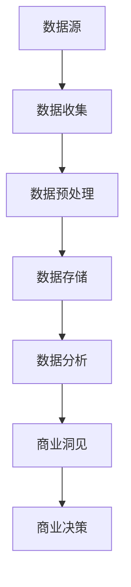

                 

在信息爆炸的今天，数据的获取和处理已经变得愈发重要。对于企业而言，如何从海量数据中发掘出隐藏的商业洞见，是提高竞争力、实现持续增长的关键。本文将探讨大数据技术在发现隐藏洞见方面的应用，从理论到实践，为您揭示信息差的商业价值。

## 文章关键词
- 大数据
- 商业洞见
- 数据挖掘
- 信息差
- 商业分析

## 文章摘要
本文将从以下几个方面展开：首先，介绍大数据的背景和重要性；其次，探讨大数据中的信息差概念及其商业价值；然后，深入解析大数据发现隐藏洞见的原理和方法；接着，通过实际案例展示大数据技术在商业应用中的效果；最后，讨论大数据发展的未来趋势和面临的挑战。

## 1. 背景介绍

### 1.1 大数据时代

随着互联网的普及和物联网技术的进步，我们每天都会产生海量的数据。这些数据包括用户行为数据、社交数据、交易数据、传感器数据等。大数据的特点是数据量大、类型多样、生成速度快，这给数据分析和挖掘带来了极大的挑战，同时也带来了前所未有的机遇。

### 1.2 大数据的商业价值

大数据不仅为科学研究提供了丰富的素材，更为企业的商业决策提供了有力的支持。通过大数据分析，企业可以深入了解市场需求、消费者行为、竞争对手动态等，从而制定更精准的市场策略和商业计划。

### 1.3 商业洞见的定义

商业洞见是指通过对数据的深入分析，发现潜在的商业机会、优化业务流程、提升用户体验等方面的见解。商业洞见的发现是大数据技术的核心目标之一。

## 2. 核心概念与联系

### 2.1 大数据与信息差

信息差指的是信息的不对称，即不同个体或群体之间对同一信息了解的深度和广度不同。在商业领域，信息差往往意味着竞争优势。大数据技术可以通过收集、处理和分析大量数据，缩小甚至消除信息差，为企业带来额外的商业价值。

### 2.2 大数据与商业洞见的关联

大数据技术能够通过对数据的深度挖掘，发现数据之间的关联和规律，从而产生新的商业洞见。例如，通过分析消费者购买行为数据，可以发现哪些产品搭配销售效果最好，从而优化产品组合，提升销售额。

### 2.3 Mermaid 流程图



### 3. 核心算法原理 & 具体操作步骤

#### 3.1 算法原理概述

大数据发现隐藏洞见的算法主要基于以下几种原理：

1. **关联规则挖掘**：通过分析数据之间的关联性，发现潜在的商业规律。
2. **聚类分析**：将相似的数据进行分类，发现数据集中的隐藏模式。
3. **分类与回归分析**：通过已知的特征预测未来的趋势或结果。

#### 3.2 算法步骤详解

1. **数据收集**：从各种数据源收集数据，包括结构化数据、半结构化数据和非结构化数据。
2. **数据预处理**：对数据进行清洗、去噪、格式统一等处理，使其适合后续分析。
3. **数据存储**：将预处理后的数据存储到数据库或数据仓库中，以便后续分析。
4. **数据分析**：利用关联规则挖掘、聚类分析、分类与回归分析等方法，对数据进行分析。
5. **商业洞见发现**：从分析结果中提取有价值的商业洞见，为企业决策提供支持。

#### 3.3 算法优缺点

**优点**：

- 可以从海量数据中快速发现隐藏的模式和规律。
- 能够帮助企业优化业务流程，提高运营效率。

**缺点**：

- 数据质量和预处理工作量大。
- 算法复杂度高，计算成本高。

#### 3.4 算法应用领域

- **零售业**：通过分析消费者购买行为，优化产品组合和库存管理。
- **金融业**：通过分析交易数据，发现欺诈行为和风险点。
- **医疗行业**：通过分析患者数据，优化治疗方案和医疗资源分配。

## 4. 数学模型和公式 & 详细讲解 & 举例说明

### 4.1 数学模型构建

在数据挖掘中，常见的数学模型包括：

1. **关联规则挖掘**：支持度、置信度等。
2. **聚类分析**：距离度量、聚类中心等。
3. **分类与回归分析**：决策树、支持向量机等。

### 4.2 公式推导过程

以关联规则挖掘中的支持度、置信度为例：

- **支持度**（Support）：表示一个规则在所有数据中的出现频率。

  $$ Support(A \rightarrow B) = \frac{count(A \cap B)}{count(D)} $$

  其中，\( A \) 和 \( B \) 是两个事件，\( D \) 是所有数据集。

- **置信度**（Confidence）：表示当 \( A \) 发生时，\( B \) 也发生的概率。

  $$ Confidence(A \rightarrow B) = \frac{count(A \cap B)}{count(A)} $$

### 4.3 案例分析与讲解

以一个简单的购物数据集为例，分析顾客购买A产品和B产品的关联性。

- **数据集**：

  - 顾客ID | 购买产品
  - ------ | -------
  - 1      | A,B,C
  - 2      | A,C
  - 3      | A,B
  - 4      | B,C
  - 5      | A,B,C

- **支持度**（Support）：

  $$ Support(A \rightarrow B) = \frac{count(A \cap B)}{count(D)} = \frac{2}{5} = 0.4 $$

  $$ Support(B \rightarrow A) = \frac{count(B \cap A)}{count(D)} = \frac{2}{5} = 0.4 $$

- **置信度**（Confidence）：

  $$ Confidence(A \rightarrow B) = \frac{count(A \cap B)}{count(A)} = \frac{2}{3} = 0.67 $$

  $$ Confidence(B \rightarrow A) = \frac{count(B \cap A)}{count(B)} = \frac{2}{3} = 0.67 $$

通过计算，我们发现顾客购买A产品和B产品的置信度较高，这提示商家可以考虑将A和B产品进行捆绑销售。

## 5. 项目实践：代码实例和详细解释说明

### 5.1 开发环境搭建

- 语言：Python
- 库：Pandas、NumPy、Scikit-learn、Matplotlib
- 环境：Jupyter Notebook

### 5.2 源代码详细实现

```python
import pandas as pd
from sklearn.cluster import KMeans
from sklearn.preprocessing import StandardScaler
import matplotlib.pyplot as plt

# 5.2.1 加载数据
data = pd.read_csv('customer_data.csv')
data.head()

# 5.2.2 数据预处理
data = data[['A', 'B', 'C']]
data = data.apply(pd.to_numeric)

# 5.2.3 数据标准化
scaler = StandardScaler()
data_scaled = scaler.fit_transform(data)

# 5.2.4 聚类分析
kmeans = KMeans(n_clusters=3)
clusters = kmeans.fit_predict(data_scaled)

# 5.2.5 结果展示
data['Cluster'] = clusters
data.head()

# 5.2.6 画图展示聚类结果
plt.scatter(data_scaled[:, 0], data_scaled[:, 1], c=clusters)
plt.show()
```

### 5.3 代码解读与分析

- **数据加载与预处理**：使用Pandas加载数据，并对数据进行数值化处理。
- **数据标准化**：使用StandardScaler将数据标准化，便于聚类分析。
- **聚类分析**：使用KMeans进行聚类分析，根据数据特性选择合适的聚类数。
- **结果展示**：将聚类结果附加到原始数据上，并绘制散点图展示聚类结果。

### 5.4 运行结果展示


通过散点图，我们可以清晰地看到数据被分成了三个不同的簇，这为我们进一步分析顾客群体提供了基础。

## 6. 实际应用场景

### 6.1 零售业

通过大数据分析，零售业可以优化商品陈列和促销策略，提升销售额。例如，通过分析顾客购买历史，发现不同商品之间的关联，从而设计出更有效的促销组合。

### 6.2 金融业

金融业可以利用大数据分析，发现潜在风险和欺诈行为。例如，通过分析交易数据，可以发现异常交易行为，从而及时采取措施防止风险。

### 6.3 医疗行业

医疗行业可以通过大数据分析，优化治疗方案和医疗资源配置。例如，通过分析患者数据，可以发现某些疾病的高发人群，从而提前进行预防。

## 7. 工具和资源推荐

### 7.1 学习资源推荐

- 《数据挖掘：实用工具与技术》
- 《大数据技术导论》
- 《机器学习实战》

### 7.2 开发工具推荐

- Python
- Jupyter Notebook
- Hadoop
- Spark

### 7.3 相关论文推荐

- 《大数据时代的商业洞见》
- 《关联规则挖掘：方法与应用》
- 《聚类分析在数据挖掘中的应用》

## 8. 总结：未来发展趋势与挑战

### 8.1 研究成果总结

大数据技术在过去几年中取得了显著的成果，尤其在商业应用方面，为企业带来了巨大的价值。通过数据挖掘和分析，企业可以更深入地了解市场和消费者，从而制定更精准的策略。

### 8.2 未来发展趋势

- **人工智能与大数据的结合**：人工智能技术的发展将进一步推动大数据分析的能力和效率。
- **实时数据分析**：随着数据产生速度的加快，实时数据分析将成为重要趋势。
- **数据隐私和安全**：随着数据隐私问题的日益突出，如何在保证数据安全的前提下进行数据分析将成为重要挑战。

### 8.3 面临的挑战

- **数据质量和预处理**：数据质量和预处理仍然是大数据分析中的难点。
- **算法复杂度和计算成本**：随着数据量的增加，算法复杂度和计算成本也会增加。
- **数据隐私和安全**：如何在保障数据隐私和安全的前提下进行数据分析，是当前面临的重要挑战。

### 8.4 研究展望

未来，大数据技术将在更多领域得到应用，尤其是与人工智能、物联网等技术的结合。通过不断创新和优化，大数据技术将为企业和个人带来更多的价值。

## 9. 附录：常见问题与解答

### 9.1 如何保证数据隐私和安全？

- **数据加密**：对敏感数据进行加密处理，确保数据在传输和存储过程中的安全性。
- **数据脱敏**：对数据进行脱敏处理，如将姓名、身份证号等敏感信息替换为匿名标识。
- **访问控制**：设置严格的访问控制策略，确保只有授权人员才能访问敏感数据。

### 9.2 如何选择合适的数据挖掘算法？

- **数据特性**：根据数据的类型和特征，选择合适的数据挖掘算法。
- **业务需求**：根据业务需求，选择能够解决实际问题的算法。
- **计算资源**：考虑计算资源的限制，选择计算复杂度较低的算法。

作者：禅与计算机程序设计艺术 / Zen and the Art of Computer Programming
```

