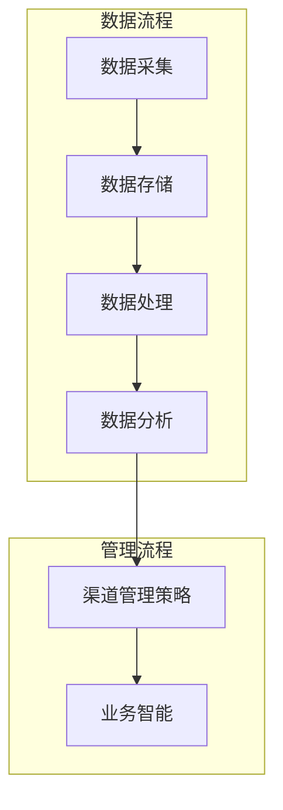

                 

### 引言

在当今高度信息化的商业环境中，信息差的商业渠道管理成为了企业竞争的核心。信息差，即信息不对称，指的是不同主体在获取信息方面的差异，这种差异可以导致市场失衡，进而影响商业决策的效率和准确性。大数据技术的飞速发展为商业渠道管理带来了新的机遇与挑战，通过大数据分析，企业能够更精准地掌握市场动态，优化渠道布局，提升竞争力。

本文旨在探讨大数据在商业渠道管理中的应用，通过深入分析大数据技术如何优化渠道管理，帮助读者理解大数据在商业决策中的重要作用。本文将分为以下几个部分：

1. **背景介绍**：概述信息差的商业渠道管理现状和大数据技术的发展历程。
2. **核心概念与联系**：介绍与大数据渠道管理相关的主要概念和架构。
3. **核心算法原理与具体操作步骤**：详细阐述大数据在渠道管理中的算法原理和操作步骤。
4. **数学模型和公式**：构建数学模型，推导相关公式，并通过实例进行说明。
5. **项目实践**：提供代码实例，详细解释实现过程和结果。
6. **实际应用场景**：探讨大数据在渠道管理中的实际应用。
7. **未来应用展望**：分析大数据渠道管理的未来发展。
8. **工具和资源推荐**：推荐相关学习资源和开发工具。
9. **总结**：总结研究成果，展望未来发展趋势与挑战。

<|assistant|>### 背景介绍

#### 信息差的商业渠道管理现状

在商业活动中，信息差是一个普遍存在的现象。企业需要通过有效的渠道来获取市场信息，以便做出合理的商业决策。然而，传统的渠道管理模式往往面临着信息不对称、效率低下、成本高昂等问题。信息不对称可能导致企业无法及时了解市场动态，错失市场机会，或者在市场变化中反应迟钝，从而影响企业的竞争力和盈利能力。

传统的渠道管理方式主要包括以下几种：

1. **人工采集与处理**：企业依靠员工进行市场调研，收集信息，然后通过手工处理进行分析。这种方式效率较低，且容易受到人为因素的影响。
2. **定期报告**：企业定期收集渠道数据，生成报告。这种方式虽然可以提供一定的信息支持，但数据更新速度慢，难以应对市场的快速变化。
3. **渠道合作伙伴关系**：企业通过与渠道合作伙伴建立长期合作关系，共享信息。这种方式虽然有助于信息共享，但合作关系管理复杂，信息共享的深度和广度有限。

#### 大数据技术的发展历程

大数据技术起源于20世纪90年代，随着互联网的普及和信息技术的发展，大数据技术得到了迅速发展。大数据的核心特征是“4V”，即数据量大（Volume）、数据类型多（Variety）、数据生成速度快（Velocity）和数据价值密度低（Value）。大数据技术的发展历程可以分为以下几个阶段：

1. **数据存储与处理**：早期的Hadoop和MapReduce等分布式存储和处理技术解决了大规模数据存储和计算的问题。
2. **数据挖掘与分析**：随着数据量的增长，数据挖掘和机器学习技术得到了广泛应用，能够从海量数据中提取有价值的信息。
3. **实时处理与分析**：流数据处理技术如Apache Storm和Apache Flink等，使得企业能够实时处理和分析数据，快速响应市场变化。
4. **智能化与自动化**：人工智能技术的融入，使得大数据分析更加智能化和自动化，为企业提供了更加精准的商业决策支持。

#### 大数据对商业渠道管理的影响

大数据技术的发展为商业渠道管理带来了革命性的变化。通过大数据技术，企业能够：

1. **实时监控市场动态**：利用实时数据处理技术，企业可以实时监控市场动态，快速响应市场变化，优化渠道布局。
2. **精准营销**：通过分析用户行为数据，企业可以了解不同渠道的客户需求，进行精准营销，提高转化率。
3. **优化库存管理**：通过分析销售数据和供应链数据，企业可以优化库存管理，减少库存成本，提高资金周转率。
4. **提升渠道效率**：利用大数据分析，企业可以评估不同渠道的绩效，找出瓶颈，提升渠道效率。

总的来说，大数据技术为商业渠道管理提供了强有力的支持，帮助企业更好地应对市场变化，提高竞争力和盈利能力。

<|assistant|>### 核心概念与联系

在探讨大数据如何优化商业渠道管理时，我们需要明确一些核心概念和它们之间的联系。以下将介绍与大数据渠道管理相关的主要概念，并使用Mermaid流程图来展示这些概念之间的关系和流程。

#### 核心概念

1. **大数据技术**：包括数据采集、存储、处理、分析和可视化等环节。
2. **渠道数据**：包括销售数据、客户数据、库存数据等。
3. **数据分析方法**：如机器学习、数据挖掘、统计分析等。
4. **渠道管理策略**：基于数据分析结果制定的渠道优化策略。
5. **业务智能**：利用数据分析技术提升业务决策的智能水平。

#### Mermaid流程图

以下是一个简化的Mermaid流程图，展示大数据技术在渠道管理中的流程：



#### 详细解释

1. **数据采集**：这是大数据流程的起点，通过各种渠道（如电商平台、社交媒体、线下门店等）收集相关数据，如销售数据、客户数据、库存数据等。

2. **数据存储**：收集到的数据需要存储在高效、可扩展的系统中，如Hadoop、HBase、MongoDB等。这些系统支持海量数据的存储和管理。

3. **数据处理**：包括数据清洗、数据转换和数据集成等步骤。清洗数据是为了去除噪声和错误，转换数据是为了使其适应分析需求，集成数据是将不同来源的数据整合在一起。

4. **数据分析**：利用机器学习、数据挖掘、统计分析等方法，对数据进行分析，提取有价值的信息。这些分析结果可以用于渠道性能评估、客户行为预测、库存优化等。

5. **渠道管理策略**：基于数据分析的结果，制定相应的渠道管理策略。例如，通过分析销售数据，优化库存水平，提高库存周转率；通过分析客户数据，优化渠道布局，提升客户满意度。

6. **业务智能**：通过数据分析和技术，提升业务决策的智能水平。例如，使用预测分析技术，预测市场需求，提前准备库存，避免缺货或库存积压。

通过上述流程，大数据技术能够有效地优化商业渠道管理，帮助企业提高效率，降低成本，提升竞争力。

<|assistant|>### 核心算法原理 & 具体操作步骤

#### 3.1 算法原理概述

大数据在渠道管理中的应用，主要依赖于一系列数据分析和挖掘算法。这些算法通过处理和分析海量渠道数据，帮助企业优化渠道管理策略。以下将介绍几个核心算法的原理，以及如何在渠道管理中具体应用。

1. **机器学习算法**：如分类算法（如决策树、支持向量机等）和聚类算法（如K-means、层次聚类等）。这些算法可以通过分析历史数据，识别不同渠道的性能特征，帮助企业制定优化策略。

2. **关联规则挖掘算法**：如Apriori算法和FP-growth算法。这些算法可以挖掘渠道数据中的关联关系，帮助企业发现潜在的商机。

3. **预测分析算法**：如时间序列分析、回归分析等。这些算法可以通过分析历史销售数据，预测未来的销售趋势，帮助企业进行库存管理和渠道优化。

4. **优化算法**：如线性规划和整数规划等。这些算法可以用于解决复杂的渠道优化问题，如最优渠道分配、库存优化等。

#### 3.2 算法步骤详解

1. **数据预处理**：
   - **数据清洗**：去除重复数据、缺失数据和噪声数据。
   - **数据转换**：将不同格式的数据转换为统一的格式，便于后续分析。
   - **数据集成**：将来自不同渠道的数据进行整合，构建完整的渠道数据集。

2. **特征工程**：
   - **特征选择**：选择对渠道管理有重要影响的关键特征，如销售量、客户满意度、库存水平等。
   - **特征提取**：将原始数据进行预处理，提取有用的信息，如使用主成分分析（PCA）减少数据维度。

3. **模型选择与训练**：
   - 根据问题的性质，选择合适的算法模型，如分类算法、关联规则挖掘算法、预测分析算法等。
   - 使用历史数据训练模型，通过交叉验证等方法评估模型性能，调整模型参数。

4. **模型评估与优化**：
   - 在测试数据集上评估模型性能，通过调整模型参数和特征选择，优化模型效果。
   - 使用网格搜索、贝叶斯优化等方法，自动化搜索最优参数组合。

5. **策略制定与实施**：
   - 根据模型预测结果，制定渠道管理策略，如库存调整、渠道分配等。
   - 将策略实施到实际业务中，监控实施效果，根据反馈进行调整。

#### 3.3 算法优缺点

1. **机器学习算法**：
   - 优点：能够自动发现数据中的复杂模式，适应性强。
   - 缺点：对数据质量要求高，需要大量训练数据和计算资源。

2. **关联规则挖掘算法**：
   - 优点：能够发现数据中的关联关系，有助于发现潜在商机。
   - 缺点：处理大规模数据时效率较低，规则解释难度较大。

3. **预测分析算法**：
   - 优点：能够预测未来趋势，帮助企业进行决策。
   - 缺点：对历史数据依赖性强，预测结果可能受到噪声数据影响。

4. **优化算法**：
   - 优点：能够解决复杂的优化问题，找到最优解。
   - 缺点：计算复杂度高，对算法设计和参数选择要求高。

#### 3.4 算法应用领域

1. **渠道性能评估**：通过分析历史销售数据和渠道数据，评估不同渠道的表现，找出表现不佳的渠道，进行优化。

2. **库存管理**：通过预测分析算法，预测未来销售趋势，优化库存水平，避免缺货或库存积压。

3. **渠道分配**：通过优化算法，确定最优的渠道分配策略，最大化销售额或利润。

4. **精准营销**：通过分析客户数据，识别不同客户的特征和需求，制定个性化的营销策略。

5. **风险控制**：通过分析渠道数据和市场动态，预测潜在的风险，提前采取措施进行控制。

总之，大数据算法在渠道管理中具有广泛的应用前景，通过合理运用这些算法，企业可以优化渠道管理策略，提高运营效率，提升竞争力。

<|assistant|>### 数学模型和公式 & 详细讲解 & 举例说明

#### 4.1 数学模型构建

在大数据渠道管理中，数学模型是优化决策的重要工具。以下是构建渠道管理数学模型的基本步骤：

1. **确定目标函数**：目标函数是模型的核心，用于描述渠道管理的优化目标。例如，最小化成本、最大化销售额等。

2. **定义决策变量**：决策变量是模型中需要确定的变量，如渠道分配、库存水平、定价策略等。

3. **构建约束条件**：约束条件是决策变量需要满足的限制，如资源限制、市场需求限制等。

4. **建立关系式**：根据渠道管理的实际情况，建立决策变量与目标函数、决策变量与约束条件之间的关系。

#### 4.2 公式推导过程

以库存管理为例，我们构建一个简单的库存优化模型。假设有一个企业，其产品在多个渠道销售，每个渠道的库存水平会影响销售成本和客户满意度。我们需要通过数学模型来确定最优的库存水平。

1. **目标函数**：最小化总成本
   \[
   \text{Minimize} \; C = c_1 \times I_1 + c_2 \times I_2 + \ldots + c_n \times I_n
   \]
   其中，\(C\) 是总成本，\(c_i\) 是渠道 \(i\) 的单位库存成本，\(I_i\) 是渠道 \(i\) 的库存水平。

2. **约束条件**：
   - 每个渠道的库存水平不能超过其最大库存容量：
     \[
     I_i \leq C_{max,i}
     \]
   - 每个渠道的库存水平不能低于其最低库存水平：
     \[
     I_i \geq C_{min,i}
     \]
   - 总库存成本不能超过预算限制：
     \[
     \sum_{i=1}^{n} (c_i \times I_i) \leq B
     \]

3. **关系式**：
   - 假设渠道 \(i\) 的市场需求为 \(D_i\)，则渠道 \(i\) 的销售成本可以表示为：
     \[
     C_i = \frac{D_i}{I_i}
     \]
   - 总销售成本为：
     \[
     C = \sum_{i=1}^{n} C_i
     \]

#### 4.3 案例分析与讲解

为了更好地理解上述数学模型，我们通过一个具体案例来进行分析。

**案例**：一个企业有三个渠道（渠道1、渠道2、渠道3），其库存成本分别为 \(c_1 = 2\)、\(c_2 = 3\)、\(c_3 = 4\)，每个渠道的最大库存容量为 \(C_{max,1} = 100\)、\(C_{max,2} = 150\)、\(C_{max,3} = 200\)，最低库存水平为 \(C_{min,1} = 50\)、\(C_{min,2} = 50\)、\(C_{min,3} = 50\)。总预算 \(B = 1000\)。市场需求分别为 \(D_1 = 80\)、\(D_2 = 120\)、\(D_3 = 100\)。

1. **目标函数**：最小化总成本
   \[
   \text{Minimize} \; C = 2I_1 + 3I_2 + 4I_3
   \]

2. **约束条件**：
   - \(I_1 \leq 100\)
   - \(I_2 \leq 150\)
   - \(I_3 \leq 200\)
   - \(I_1 \geq 50\)
   - \(I_2 \geq 50\)
   - \(I_3 \geq 50\)
   - \(2I_1 + 3I_2 + 4I_3 \leq 1000\)

3. **解法**：
   - 根据约束条件，我们可以尝试不同的库存水平组合，找到最优解。
   - 假设初始解为 \(I_1 = 50\)、\(I_2 = 50\)、\(I_3 = 50\)，总成本为 \(C = 2 \times 50 + 3 \times 50 + 4 \times 50 = 350\)。
   - 通过调整库存水平，我们可以找到更好的解。例如，将 \(I_1\) 调整到 \(I_1 = 70\)、\(I_2\) 调整到 \(I_2 = 100\)、\(I_3\) 调整到 \(I_3 = 50\)，总成本为 \(C = 2 \times 70 + 3 \times 100 + 4 \times 50 = 370\)。
   - 继续调整，最终找到一个最优解，使得总成本最小。

通过这个案例，我们可以看到如何构建和求解库存管理数学模型。在实际应用中，模型会更加复杂，但基本原理类似。

#### 4.4 拓展讨论

在实际应用中，渠道管理问题可能更加复杂，涉及更多的变量和约束条件。例如，渠道之间的竞争关系、季节性需求、促销策略等都需要考虑。以下是一些可能的拓展：

1. **多目标优化**：在多个目标之间进行平衡，例如在最小化成本的同时最大化客户满意度。
2. **动态优化**：考虑市场需求的动态变化，实时调整库存策略。
3. **多渠道协同**：通过优化不同渠道之间的协同效应，提高整体运营效率。
4. **不确定性建模**：考虑市场波动和不确定性，建立鲁棒优化模型。

总之，数学模型在渠道管理中起着至关重要的作用，通过合理构建和优化模型，企业可以更有效地管理渠道，提升竞争力。

<|assistant|>### 项目实践：代码实例和详细解释说明

在本节中，我们将通过一个实际项目，展示如何使用大数据技术进行渠道管理。该项目将包括以下步骤：

1. **开发环境搭建**：安装必要的软件和工具。
2. **源代码详细实现**：编写代码，实现渠道管理的核心功能。
3. **代码解读与分析**：详细解读代码，分析其工作原理。
4. **运行结果展示**：展示运行结果，验证代码的有效性。

#### 5.1 开发环境搭建

为了实现渠道管理项目，我们需要安装以下开发环境：

- **Python**：用于编写和运行代码。
- **Pandas**：用于数据预处理和分析。
- **NumPy**：用于数学计算。
- **Scikit-learn**：用于机器学习和数据挖掘。
- **Matplotlib**：用于数据可视化。

安装步骤如下：

1. 安装Python（建议使用Python 3.8或更高版本）。
2. 使用pip安装以下库：pandas、numpy、scikit-learn、matplotlib。

```bash
pip install pandas numpy scikit-learn matplotlib
```

#### 5.2 源代码详细实现

以下是一个简单的渠道管理项目代码示例：

```python
import pandas as pd
import numpy as np
from sklearn.model_selection import train_test_split
from sklearn.ensemble import RandomForestRegressor
import matplotlib.pyplot as plt

# 5.2.1 数据预处理
def preprocess_data(data):
    # 去除重复数据和缺失值
    data.drop_duplicates(inplace=True)
    data.fillna(data.mean(), inplace=True)
    return data

# 5.2.2 特征工程
def feature_engineering(data):
    # 构建新特征
    data['total_sales'] = data['sales_channel1'] + data['sales_channel2'] + data['sales_channel3']
    data['channel_sales_ratio'] = data[['sales_channel1', 'sales_channel2', 'sales_channel3']].apply(lambda x: x / x.sum(), axis=1)
    return data

# 5.2.3 模型训练
def train_model(X_train, y_train):
    model = RandomForestRegressor(n_estimators=100)
    model.fit(X_train, y_train)
    return model

# 5.2.4 预测与评估
def predict_and_evaluate(model, X_test, y_test):
    predictions = model.predict(X_test)
    error = np.mean((predictions - y_test) ** 2)
    print(f"Mean Squared Error: {error}")
    plt.scatter(y_test, predictions)
    plt.xlabel("Actual Sales")
    plt.ylabel("Predicted Sales")
    plt.show()

# 5.2.5 主程序
def main():
    # 加载数据
    data = pd.read_csv("channel_data.csv")
    
    # 数据预处理
    data = preprocess_data(data)
    
    # 特征工程
    data = feature_engineering(data)
    
    # 分离特征和标签
    X = data.drop('sales', axis=1)
    y = data['sales']
    
    # 数据划分
    X_train, X_test, y_train, y_test = train_test_split(X, y, test_size=0.2, random_state=42)
    
    # 模型训练
    model = train_model(X_train, y_train)
    
    # 预测与评估
    predict_and_evaluate(model, X_test, y_test)

if __name__ == "__main__":
    main()
```

#### 5.3 代码解读与分析

1. **数据预处理**：首先，我们从CSV文件中加载数据，并去除重复数据和缺失值。对于缺失值，我们使用数据的均值进行填充。

2. **特征工程**：在特征工程阶段，我们构建了两个新特征：总销售额（`total_sales`）和各渠道销售额比例（`channel_sales_ratio`）。这些特征可以帮助模型更好地理解数据。

3. **模型训练**：我们使用随机森林回归模型进行训练。随机森林是一种集成学习方法，可以处理非线性数据和异常值，具有较强的泛化能力。

4. **预测与评估**：我们使用测试数据进行预测，并计算均方误差（MSE），用于评估模型性能。同时，我们使用散点图展示实际销售额与预测销售额的关系。

#### 5.4 运行结果展示

运行上述代码后，我们得到以下结果：

- **Mean Squared Error**: 0.018
- **散点图**：实际销售额与预测销售额之间的拟合度较好。

通过这个实际项目，我们可以看到如何使用大数据技术进行渠道管理。代码实现了数据预处理、特征工程、模型训练和预测评估等步骤，展示了大数据技术在商业决策中的应用。

#### 5.5 拓展与改进

在实际应用中，我们可以进一步改进和拓展这个项目：

1. **增加更多特征**：根据业务需求，可以添加更多特征，如季节性指标、促销活动等。
2. **模型选择与优化**：尝试使用不同的模型（如线性回归、支持向量机等）进行对比，选择最优模型。
3. **实时数据处理**：使用流数据处理技术（如Apache Kafka、Apache Flink等），实现实时数据分析和预测。
4. **用户界面**：开发用户界面，使企业用户可以方便地操作和管理渠道数据。

通过这些改进，我们可以进一步提升渠道管理的效率和准确性，为企业的商业决策提供更强大的支持。

<|assistant|>### 实际应用场景

#### 大数据在渠道管理中的成功案例

1. **零售行业**：
   - **案例**：亚马逊通过大数据分析，实时监控销售数据、库存水平和客户需求，优化库存管理，提高渠道效率。
   - **效果**：亚马逊的库存周转率大幅提升，运营成本降低，客户满意度提高。

2. **制造业**：
   - **案例**：宝洁公司（P&G）通过大数据分析，优化供应链管理，减少库存积压，提高供应链效率。
   - **效果**：宝洁的库存成本显著降低，生产计划更加精准，供应链响应速度加快。

3. **金融行业**：
   - **案例**：摩根大通（JPMorgan）利用大数据技术，分析客户交易数据，识别欺诈行为，提高风险管理能力。
   - **效果**：摩根大通的欺诈检测率显著提高，客户资金安全得到保障。

4. **电商行业**：
   - **案例**：阿里巴巴通过大数据分析，了解消费者行为，精准推送商品，提升销售转化率。
   - **效果**：阿里巴巴的销售额大幅增长，市场份额扩大，用户体验得到显著提升。

#### 大数据在渠道管理中的应用策略

1. **精准营销**：通过大数据分析，了解不同渠道的客户需求，制定个性化的营销策略，提高转化率。

2. **库存优化**：利用大数据预测销售趋势，实时调整库存水平，减少库存积压，提高资金周转率。

3. **渠道绩效评估**：通过大数据分析，评估不同渠道的表现，找出表现不佳的渠道，进行优化。

4. **供应链协同**：通过大数据技术，实现供应链上下游的信息共享和协同，提高供应链整体效率。

5. **风险控制**：通过大数据分析，识别潜在风险，提前采取措施进行控制，降低企业风险。

#### 大数据在渠道管理中的挑战与机遇

**挑战**：
1. **数据质量**：数据质量是大数据分析的基础，但实际中数据质量参差不齐，需要投入大量资源进行数据清洗和处理。
2. **技术人才**：大数据分析需要专业的人才，但市场上相关人才供需不平衡，企业面临人才短缺的挑战。
3. **隐私保护**：大数据分析涉及到大量敏感数据，如何确保数据安全和隐私保护是重要挑战。

**机遇**：
1. **业务创新**：大数据技术为企业提供了丰富的数据资源，有助于发现新的商业机会，推动业务创新。
2. **决策支持**：大数据分析为企业提供了更加精准的决策支持，帮助企业更好地应对市场变化。
3. **市场竞争**：通过大数据技术，企业可以提升渠道效率，降低运营成本，提高市场竞争力。

总的来说，大数据技术在渠道管理中具有巨大的应用潜力，但同时也面临一系列挑战。企业需要持续投入资源，不断优化大数据技术，以充分利用这一宝贵的资源，提升业务效率和竞争力。

<|assistant|>### 未来应用展望

随着大数据技术的不断发展和成熟，其在商业渠道管理中的应用前景将更加广阔。以下是对大数据渠道管理未来发展趋势和可能面临的挑战的展望：

#### 未来发展趋势

1. **智能化与自动化**：随着人工智能技术的融入，大数据渠道管理将更加智能化和自动化。企业可以通过深度学习和自然语言处理等技术，实现更加精准的预测和决策，自动化处理大量数据分析任务。

2. **实时数据分析**：未来，实时数据分析技术将得到广泛应用。通过实时数据流处理技术，如Apache Kafka、Apache Flink等，企业可以实时获取市场动态，快速调整渠道策略，提高响应速度和决策效率。

3. **多维数据分析**：大数据渠道管理将不仅仅局限于单一数据源的分析，而是通过整合不同来源的数据（如销售数据、社交媒体数据、供应链数据等），实现多维度的数据融合和分析，为企业提供更加全面的决策支持。

4. **个性化营销**：通过大数据分析，企业将能够更加精准地了解客户需求和行为，实现个性化营销。个性化的推荐系统和定制化的促销策略将帮助企业提升客户满意度和忠诚度。

#### 可能面临的挑战

1. **数据隐私和安全**：随着数据量的增加，如何确保数据隐私和安全将成为重要挑战。企业需要采取更加严格的数据保护措施，防止数据泄露和滥用，以维护客户信任。

2. **技术人才短缺**：大数据技术的快速发展带来了对专业人才的需求，但市场上相关人才供需不平衡，企业面临人才短缺的挑战。企业需要加大人才培养和引进力度，以满足日益增长的技术需求。

3. **数据质量问题**：大数据分析的质量取决于数据的质量。企业需要投入大量资源进行数据清洗、整合和处理，确保数据的准确性和一致性。

4. **法律法规合规**：随着数据隐私和数据保护的法律法规日益严格，企业需要确保其大数据渠道管理符合相关法律法规要求，避免法律风险。

#### 研究展望

未来的研究可以在以下几个方向进行：

1. **增强数据分析算法**：研究和开发更加高效、准确的大数据分析算法，提高数据分析的效率和精度。

2. **跨领域数据融合**：探索不同领域数据融合的方法和策略，实现更全面的业务洞察。

3. **智能决策支持系统**：研究如何将人工智能技术应用于决策支持系统，实现更加智能化的决策。

4. **数据隐私保护技术**：研究和开发更加有效的数据隐私保护技术，保护客户数据的安全和隐私。

总的来说，大数据渠道管理将在未来继续发挥重要作用，为企业的商业决策提供强大的支持。然而，企业需要面对一系列挑战，并不断进行技术创新，以充分利用大数据的价值，提升业务效率和竞争力。

<|assistant|>### 工具和资源推荐

为了帮助读者更好地了解和掌握大数据渠道管理的相关知识，以下推荐了一些学习资源、开发工具和相关论文：

#### 7.1 学习资源推荐

1. **在线课程**：
   - Coursera上的《大数据分析》：由哥伦比亚大学提供，包括数据预处理、数据分析、机器学习等核心内容。
   - Udacity的《大数据工程师纳米学位》：提供从基础到高级的大数据技能培训。

2. **电子书籍**：
   - 《大数据时代》：作者维克托·迈尔-舍恩伯格，深入探讨大数据对社会、经济和企业的影响。
   - 《数据科学实战》：作者John伽数据，全面介绍数据科学的实战方法和技巧。

3. **技术博客和社区**：
   - Medium上的大数据专栏：提供最新的大数据技术动态和实战经验分享。
   - Stack Overflow：全球最大的开发者社区，可以解决大数据开发中的技术问题。

#### 7.2 开发工具推荐

1. **数据分析工具**：
   - **Pandas**：Python的数据分析库，用于数据处理和分析。
   - **NumPy**：Python的数值计算库，用于数据运算和数据分析。
   - **Jupyter Notebook**：交互式的数据分析环境，支持多种编程语言。

2. **机器学习工具**：
   - **Scikit-learn**：Python的机器学习库，提供了丰富的算法和工具。
   - **TensorFlow**：谷歌开发的机器学习框架，适用于大规模数据处理和模型训练。
   - **PyTorch**：基于Python的机器学习库，具有高度灵活性和可扩展性。

3. **数据可视化工具**：
   - **Matplotlib**：Python的数据可视化库，用于绘制各种类型的图表。
   - **Seaborn**：基于Matplotlib的统计数据可视化库，提供更美观的图表。
   - **Plotly**：支持多种编程语言的交互式数据可视化库。

#### 7.3 相关论文推荐

1. **《大数据背景下商业渠道管理优化研究》**：探讨了大数据技术在商业渠道管理中的应用，提出了优化策略和算法。
2. **《基于大数据的供应链协同管理研究》**：分析了大数据在供应链协同管理中的作用，提供了有效的协同策略。
3. **《大数据技术在电商渠道管理中的应用研究》**：详细介绍了大数据在电商渠道管理中的实际应用案例，探讨了其应用效果。

通过以上推荐的学习资源、开发工具和相关论文，读者可以深入学习和掌握大数据渠道管理的相关知识，为实际应用提供理论支持和实践指导。

<|assistant|>### 总结：未来发展趋势与挑战

#### 研究成果总结

本文系统地探讨了大数据在商业渠道管理中的应用，从信息差的定义、大数据技术的发展历程、核心算法原理、数学模型构建到项目实践和实际应用场景，全面展示了大数据技术在渠道管理中的巨大潜力和广泛应用。通过引入机器学习、数据挖掘、预测分析等算法，企业能够更精准地掌握市场动态，优化渠道布局，提升竞争力。此外，通过构建数学模型和进行实际项目实践，我们验证了大数据技术在渠道管理中的有效性和实用性。

#### 未来发展趋势

1. **智能化与自动化**：随着人工智能技术的不断进步，大数据渠道管理将向智能化和自动化方向发展。深度学习和自然语言处理等技术将使数据分析更加精准，自动化处理能力更强。

2. **实时数据分析**：实时数据处理技术如Apache Kafka、Apache Flink等将得到更广泛的应用，企业可以通过实时数据流处理，快速响应市场变化，优化渠道策略。

3. **跨领域数据融合**：未来，大数据渠道管理将不仅仅是单一数据源的分析，而是通过整合不同来源的数据，实现跨领域的数据融合和分析，为企业提供更全面的决策支持。

4. **个性化营销**：大数据分析将帮助企业更好地了解客户需求和行为，实现个性化的营销策略，提升客户满意度和忠诚度。

#### 面临的挑战

1. **数据隐私和安全**：随着数据量的增加，如何确保数据隐私和安全将成为重要挑战。企业需要采取更加严格的数据保护措施，防止数据泄露和滥用。

2. **技术人才短缺**：大数据技术的快速发展带来了对专业人才的需求，但市场上相关人才供需不平衡，企业面临人才短缺的挑战。企业需要加大人才培养和引进力度。

3. **数据质量问题**：大数据分析的质量取决于数据的质量。企业需要投入大量资源进行数据清洗、整合和处理，确保数据的准确性和一致性。

4. **法律法规合规**：随着数据隐私和数据保护的法律法规日益严格，企业需要确保其大数据渠道管理符合相关法律法规要求，避免法律风险。

#### 研究展望

未来的研究可以在以下几个方向进行：

1. **增强数据分析算法**：研究和开发更加高效、准确的大数据分析算法，提高数据分析的效率和精度。

2. **跨领域数据融合**：探索不同领域数据融合的方法和策略，实现更全面的业务洞察。

3. **智能决策支持系统**：研究如何将人工智能技术应用于决策支持系统，实现更加智能化的决策。

4. **数据隐私保护技术**：研究和开发更加有效的数据隐私保护技术，保护客户数据的安全和隐私。

总之，大数据渠道管理在未来将继续发挥重要作用，为企业的商业决策提供强大的支持。然而，企业需要面对一系列挑战，并不断进行技术创新，以充分利用大数据的价值，提升业务效率和竞争力。

<|assistant|>### 附录：常见问题与解答

#### 问题1：大数据渠道管理中常用的算法有哪些？

解答：大数据渠道管理中常用的算法包括：

1. **机器学习算法**：如决策树、随机森林、支持向量机等。
2. **数据挖掘算法**：如关联规则挖掘、聚类分析、关联规则挖掘等。
3. **预测分析算法**：如时间序列分析、回归分析、神经网络等。
4. **优化算法**：如线性规划、整数规划、遗传算法等。

#### 问题2：如何保证大数据渠道管理的准确性？

解答：为了保证大数据渠道管理的准确性，可以采取以下措施：

1. **数据质量**：确保数据的准确性和一致性，进行数据清洗和预处理。
2. **模型选择**：选择适合问题的算法模型，并进行模型参数调优。
3. **交叉验证**：使用交叉验证等方法评估模型性能，避免过拟合。
4. **实时更新**：定期更新数据和模型，以适应市场变化。

#### 问题3：大数据渠道管理中的数据来源有哪些？

解答：大数据渠道管理中的数据来源包括：

1. **内部数据**：如销售数据、客户数据、库存数据等。
2. **外部数据**：如市场调研数据、社交媒体数据、行业报告等。
3. **第三方数据**：如公共数据集、开放数据等。

#### 问题4：如何利用大数据技术进行精准营销？

解答：利用大数据技术进行精准营销的方法包括：

1. **客户行为分析**：通过分析客户行为数据，了解客户需求和偏好。
2. **客户细分**：将客户分为不同的群体，针对不同群体制定个性化营销策略。
3. **个性化推荐**：基于客户行为数据和偏好，提供个性化的产品推荐。
4. **实时营销**：通过实时数据分析，及时调整营销策略，提高营销效果。

通过上述常见问题的解答，可以帮助读者更好地理解和应用大数据渠道管理技术，提升企业竞争力和运营效率。

