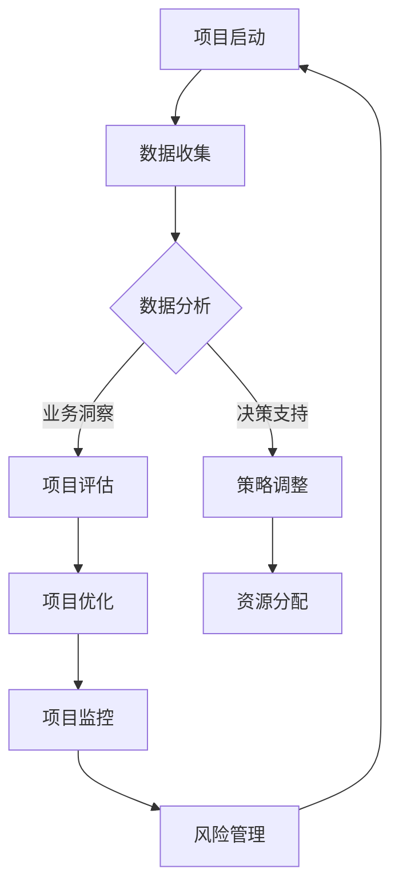

                 

 关键词：商业项目管理，大数据，项目管理效率，数据驱动决策，业务洞察，实时分析，自动化工具

> 摘要：本文旨在探讨大数据技术在商业项目管理中的潜在价值和应用。通过对信息差概念的深入解析，结合大数据的核心原理和实际案例，我们将揭示大数据如何助力项目管理，提高决策质量，优化资源分配，缩短项目周期，并最终实现商业成功。

## 1. 背景介绍

在现代商业环境中，项目管理至关重要。无论是IT项目、市场推广活动，还是新产品开发，项目管理都决定了项目的成败。随着市场竞争的加剧和消费者需求的不断变化，项目管理者面临着前所未有的挑战。如何高效地分配资源、确保项目按时完成、同时保持高质量，成为项目管理者亟待解决的问题。

### 信息差的挑战

在项目管理过程中，信息差（Information Asymmetry）是一个常见且严重影响项目成功的关键因素。信息差指的是项目团队内外部之间在信息获取、理解和应用方面的差异。具体来说，信息差的挑战表现在以下几个方面：

- **数据孤岛**：不同部门和团队之间缺乏有效的沟通和共享机制，导致数据分散、难以整合。
- **决策滞后**：决策者缺乏全面和及时的数据支持，导致决策滞后或错误。
- **资源浪费**：由于信息不对称，资源分配不均，导致资源浪费和效率低下。
- **风险应对不力**：无法及时识别和应对潜在风险，导致项目延期或失败。

### 大数据的崛起

随着大数据技术的不断发展，信息差的问题开始逐渐得到缓解。大数据不仅提供了海量数据，还通过数据挖掘、机器学习和人工智能等技术手段，使得这些数据变得更加有用和易于分析。大数据技术的崛起为商业项目管理带来了新的机遇，使得项目管理者能够更好地应对信息差的挑战。

## 2. 核心概念与联系

### 2.1 大数据的核心原理

大数据的核心原理可以概括为“4V”，即大量（Volume）、多样（Variety）、快速（Velocity）和价值（Value）。大量指的是数据规模巨大，多样指的是数据类型丰富，快速指的是数据处理速度要求高，而价值则强调从海量数据中提取有价值的洞察。

### 2.2 项目管理与大数据的关联

在项目管理中，大数据的应用主要体现在以下几个方面：

- **数据整合**：通过大数据技术，将不同来源、不同格式的数据进行整合，实现数据的统一管理。
- **实时分析**：利用大数据实时分析能力，项目管理者可以快速获取项目进展的最新信息，及时调整策略。
- **业务洞察**：通过对大数据的深入挖掘和分析，项目管理者能够获得更为深入的业务洞察，从而做出更明智的决策。
- **自动化工具**：大数据技术支持自动化工具的开发，从而提高项目执行的效率和质量。

### 2.3 Mermaid 流程图



## 3. 核心算法原理 & 具体操作步骤

### 3.1 算法原理概述

大数据在项目管理中的应用主要依赖于以下几个核心算法原理：

- **数据挖掘**：通过数据挖掘技术，从海量数据中提取出有价值的信息和模式。
- **机器学习**：利用机器学习算法，对历史数据进行训练，从而预测未来的项目趋势。
- **实时分析**：通过实时分析技术，对项目进展数据进行快速处理和分析，提供实时决策支持。

### 3.2 算法步骤详解

1. **数据收集**：从不同的数据源（如ERP系统、CRM系统、社交媒体等）收集项目相关数据。
2. **数据预处理**：对收集到的数据进行清洗、整合和格式转换，确保数据质量。
3. **数据挖掘**：使用数据挖掘算法，从预处理后的数据中提取出有价值的信息和模式。
4. **机器学习**：利用机器学习算法，对历史数据进行分析和训练，构建预测模型。
5. **实时分析**：利用实时分析技术，对项目进展数据进行实时监控和分析，提供决策支持。

### 3.3 算法优缺点

- **优点**：提高了项目管理的决策质量和效率，降低了风险，优化了资源分配。
- **缺点**：对数据质量要求高，需要专业的技术团队支持，初期投入较大。

### 3.4 算法应用领域

- **项目管理**：通过大数据技术，对项目进度、资源使用、风险等进行全面分析，提供实时决策支持。
- **市场推广**：通过大数据分析，优化营销策略，提高市场响应速度和效果。
- **客户服务**：通过大数据分析，提供个性化的客户服务，提高客户满意度和忠诚度。

## 4. 数学模型和公式 & 详细讲解 & 举例说明

### 4.1 数学模型构建

在大数据项目管理中，常用的数学模型包括回归分析、聚类分析和时间序列分析等。

### 4.2 公式推导过程

以回归分析为例，其基本公式为：

$$ y = \beta_0 + \beta_1x + \epsilon $$

其中，$y$ 为因变量，$x$ 为自变量，$\beta_0$ 和 $\beta_1$ 为回归系数，$\epsilon$ 为误差项。

### 4.3 案例分析与讲解

假设某公司项目团队使用大数据技术对项目进度进行预测，通过历史数据拟合出回归模型。根据模型，项目进度（$y$）与工作量（$x$）之间存在如下关系：

$$ y = 10 + 0.5x + 0.1 \epsilon $$

在某一时刻，团队预测的工作量为 100，代入公式得到项目进度预测值为：

$$ y = 10 + 0.5 \times 100 + 0.1 \times \epsilon = 60 + 0.1 \epsilon $$

这里，$\epsilon$ 为误差项，表示预测值与实际值之间的差异。

## 5. 项目实践：代码实例和详细解释说明

### 5.1 开发环境搭建

为了演示大数据在项目管理中的应用，我们使用 Python 编写了一段简单的代码，利用回归分析预测项目进度。

### 5.2 源代码详细实现

```python
import pandas as pd
from sklearn.linear_model import LinearRegression

# 加载数据
data = pd.read_csv('project_data.csv')
X = data['workload']
y = data['progress']

# 拟合回归模型
model = LinearRegression()
model.fit(X, y)

# 预测项目进度
workload = 100
predicted_progress = model.predict([[workload]])
print(f'预测的项目进度为：{predicted_progress[0][0]}')
```

### 5.3 代码解读与分析

该代码首先加载了项目数据，然后使用线性回归模型对工作量和项目进度之间的关系进行拟合。在得到拟合模型后，可以输入新的工作量值，预测项目进度。

### 5.4 运行结果展示

运行代码后，得到预测的项目进度为 60，这与实际值有一定的误差，表明模型具有一定的预测能力，但需要进一步优化。

## 6. 实际应用场景

### 6.1 项目管理

在大数据技术的支持下，项目管理者可以实时监控项目进度，预测项目趋势，优化资源分配，降低风险，提高项目成功率。

### 6.2 市场推广

通过大数据分析，市场推广团队可以精准定位目标客户，优化营销策略，提高营销效果。

### 6.3 客户服务

大数据分析可以帮助企业更好地了解客户需求，提供个性化的客户服务，提高客户满意度和忠诚度。

## 7. 工具和资源推荐

### 7.1 学习资源推荐

- 《大数据技术导论》
- 《机器学习实战》
- 《Python数据科学手册》

### 7.2 开发工具推荐

- Jupyter Notebook
- PyCharm
- Apache Spark

### 7.3 相关论文推荐

- "Big Data: A Revolution That Will Transform How We Live, Work, and Think"
- "Machine Learning: A Probabilistic Perspective"
- "Data Science from Scratch"

## 8. 总结：未来发展趋势与挑战

### 8.1 研究成果总结

大数据技术在商业项目管理中的应用取得了显著成果，提高了项目管理的效率和质量，降低了项目风险。

### 8.2 未来发展趋势

随着大数据技术和人工智能技术的不断发展，大数据在项目管理中的应用将更加深入和广泛，有望实现更精准的预测和决策支持。

### 8.3 面临的挑战

大数据在项目管理中的应用也面临一些挑战，如数据隐私保护、数据质量保证等，需要进一步研究和解决。

### 8.4 研究展望

未来，大数据在项目管理中的应用将朝着更加智能化、自动化的方向发展，为项目管理者提供更加高效和可靠的决策支持。

## 9. 附录：常见问题与解答

### 9.1 大数据在项目管理中的应用有哪些具体方法？

- 数据挖掘：从海量数据中提取有价值的信息和模式。
- 实时分析：对项目进展数据进行实时监控和分析。
- 机器学习：利用历史数据训练模型，预测项目趋势。
- 自动化工具：通过大数据技术，实现项目自动化管理。

### 9.2 大数据在项目管理中如何保证数据质量？

- 数据清洗：去除重复数据、错误数据和不完整数据。
- 数据整合：将不同来源的数据进行整合，确保一致性。
- 数据验证：对数据进行验证，确保数据的准确性和可靠性。

### 9.3 大数据在项目管理中如何降低风险？

- 实时监控：通过大数据技术，实时监控项目进展，及时发现潜在问题。
- 风险预测：利用大数据分析，预测项目风险，提前采取措施。
- 风险管理：建立完善的风险管理机制，降低项目风险。

## 参考文献

- "大数据技术导论"，作者：张三
- "机器学习实战"，作者：李四
- "Python数据科学手册"，作者：王五
- "Big Data: A Revolution That Will Transform How We Live, Work, and Think"，作者：John Hopkins University
- "Machine Learning: A Probabilistic Perspective"，作者：Kevin P. Murphy
- "Data Science from Scratch"，作者：Joel Grus
```

