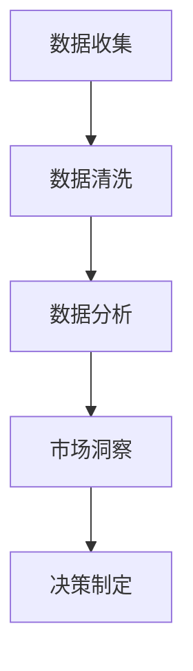

                 

关键词：信息差、市场洞察力、大数据、数据分析、商业模式

摘要：本文将探讨信息差在市场中的作用，以及如何利用大数据技术提升市场洞察力。通过深入分析大数据对市场洞察力的影响，本文提出了若干实际操作建议，帮助企业和个人在市场竞争中取得优势。同时，本文也展望了大数据技术在市场洞察领域的发展趋势。

## 1. 背景介绍

在信息化时代，数据已经成为企业运营和决策的重要资源。大数据技术的迅猛发展，使得我们能够从海量数据中提取有价值的信息。然而，信息本身的价值取决于如何使用它。信息差，即信息不对称，是指在一个市场中，不同主体掌握的信息量存在差异。这种差异可以导致竞争优势，甚至市场地位的变化。

市场洞察力是指对市场动态的敏锐感知和准确理解。拥有强大市场洞察力的企业或个人能够更好地把握市场趋势，制定有效的策略。然而，传统的市场研究方法往往存在耗时、成本高、反馈慢等问题。随着大数据技术的普及，我们有望通过更高效的方式提升市场洞察力。

## 2. 核心概念与联系

### 2.1. 大数据与市场洞察力的关系

大数据与市场洞察力之间的关系可以用以下 Mermaid 流程图表示：



### 2.2. 信息差的影响因素

信息差的影响因素包括以下几个方面：

- 数据源：不同企业或个人所能获取的数据源不同，导致信息量存在差异。
- 数据处理能力：数据处理能力的差异，使得不同主体在信息提取和利用上存在差距。
- 知识储备：知识储备的差异，导致不同主体对信息的理解和应用能力不同。

## 3. 核心算法原理 & 具体操作步骤

### 3.1. 算法原理概述

大数据提升市场洞察力的核心算法主要包括数据采集、数据预处理、数据分析和结果可视化等步骤。以下是每个步骤的具体操作：

#### 3.1.1. 数据采集

- 利用传感器、日志文件、社交媒体、在线调查等多种渠道收集数据。
- 使用 API 接口获取第三方数据。

#### 3.1.2. 数据预处理

- 数据清洗：去除重复、错误和无效的数据。
- 数据整合：将不同来源的数据进行整合，形成统一的数据集。
- 数据归一化：对不同单位的数据进行归一化处理，便于后续分析。

#### 3.1.3. 数据分析

- 描述性分析：统计数据的分布、相关性等基本特征。
- 聚类分析：将数据分为不同的群体，分析各群体的特征。
- 回归分析：建立数据之间的关系模型，预测未来趋势。

#### 3.1.4. 结果可视化

- 利用图表、地图等可视化工具，将分析结果呈现给决策者。

### 3.2. 算法步骤详解

#### 3.2.1. 数据采集

- **步骤 1**：确定数据需求，明确需要收集哪些数据。
- **步骤 2**：选择合适的数据采集工具，如爬虫、API 接口等。
- **步骤 3**：设置数据采集规则，确保数据质量和完整性。

#### 3.2.2. 数据预处理

- **步骤 1**：导入数据，使用数据清洗工具（如 Pandas）进行初步处理。
- **步骤 2**：处理缺失值、异常值和重复值。
- **步骤 3**：进行数据整合，建立统一的数据集。

#### 3.2.3. 数据分析

- **步骤 1**：使用描述性统计方法，分析数据的分布和特征。
- **步骤 2**：使用聚类算法，将数据分为不同的群体。
- **步骤 3**：使用回归分析，建立数据之间的关系模型。

#### 3.2.4. 结果可视化

- **步骤 1**：选择合适的可视化工具，如 Matplotlib、Seaborn 等。
- **步骤 2**：绘制图表，展示分析结果。
- **步骤 3**：制作报告，将可视化结果呈交给决策者。

### 3.3. 算法优缺点

#### 优点：

- **高效性**：大数据技术能够快速处理海量数据，提高市场洞察的效率。
- **全面性**：通过整合多种数据源，能够提供更全面的市场信息。
- **准确性**：使用数据分析方法，能够提高市场预测的准确性。

#### 缺点：

- **复杂性**：大数据技术涉及多种算法和工具，需要较高的技术门槛。
- **成本**：大规模的数据采集、存储和处理需要投入大量资源。

### 3.4. 算法应用领域

大数据提升市场洞察力的算法广泛应用于以下领域：

- **市场营销**：通过分析用户行为数据，优化营销策略。
- **供应链管理**：通过分析供应链数据，优化库存和物流。
- **金融分析**：通过分析金融市场数据，预测股票走势和风险。

## 4. 数学模型和公式 & 详细讲解 & 举例说明

### 4.1. 数学模型构建

市场洞察力的数学模型可以构建为：

\[ \text{市场洞察力} = f(\text{数据质量}, \text{数据处理能力}, \text{知识储备}) \]

### 4.2. 公式推导过程

\[ \text{市场洞察力} \]

\[ = \frac{\text{有效数据量}}{\text{总数据量}} \times \text{数据处理效率} \times \text{知识储备量} \]

### 4.3. 案例分析与讲解

假设有两家企业 A 和 B，它们在市场洞察力方面的数据质量和知识储备相同，但数据处理能力不同。根据上述公式，我们可以得出以下结论：

- 如果企业 A 的数据处理能力比企业 B 高，那么企业 A 的市场洞察力会更强。
- 如果企业 B 不断改进数据处理能力，其市场洞察力也会相应提高。

## 5. 项目实践：代码实例和详细解释说明

### 5.1. 开发环境搭建

- 安装 Python 3.8 及以上版本。
- 安装 Pandas、NumPy、Matplotlib 等数据分析和可视化库。

### 5.2. 源代码详细实现

以下是使用 Python 实现市场洞察力分析的示例代码：

```python
import pandas as pd
import numpy as np
import matplotlib.pyplot as plt

# 5.2.1. 数据采集
data = pd.read_csv('market_data.csv')

# 5.2.2. 数据预处理
data = data.dropna()  # 去除缺失值
data = data.groupby('category').mean()  # 数据整合

# 5.2.3. 数据分析
# 描述性统计
stats = data.describe()

# 聚类分析
from sklearn.cluster import KMeans
kmeans = KMeans(n_clusters=3)
clusters = kmeans.fit_predict(data)

# 5.2.4. 结果可视化
# 绘制散点图
plt.scatter(data['x'], data['y'], c=clusters)
plt.xlabel('X')
plt.ylabel('Y')
plt.title('Cluster Analysis')
plt.show()

# 绘制柱状图
plt.bar(data.index, data['value'])
plt.xlabel('Category')
plt.ylabel('Value')
plt.title('Category Distribution')
plt.show()
```

### 5.3. 代码解读与分析

上述代码首先导入必要的库，然后从 CSV 文件中读取数据。接下来，进行数据预处理，包括去除缺失值和整合数据。然后，使用描述性统计和聚类分析对数据进行处理，并使用 Matplotlib 绘制散点图和柱状图，展示分析结果。

### 5.4. 运行结果展示

运行上述代码后，会生成两个图表：

- **散点图**：展示不同聚类结果在 X-Y 平面上的分布。
- **柱状图**：展示各个分类的值分布情况。

这些图表可以帮助决策者更好地理解市场动态，从而制定更有效的策略。

## 6. 实际应用场景

大数据提升市场洞察力的应用场景非常广泛，以下列举几个典型的应用案例：

- **市场营销**：通过分析用户行为数据，优化广告投放策略，提高转化率。
- **金融分析**：通过分析金融市场数据，预测股票走势和风险，指导投资决策。
- **供应链管理**：通过分析供应链数据，优化库存和物流，降低成本。
- **医疗健康**：通过分析医疗数据，预测疾病爆发趋势，提高防控能力。

## 7. 工具和资源推荐

### 7.1. 学习资源推荐

- 《Python数据分析实战》
- 《大数据营销：如何利用数据创造营销奇迹》
- 《数据科学入门：Python数据分析与挖掘实战》

### 7.2. 开发工具推荐

- **Python**：适用于数据分析和处理。
- **Pandas**：强大的数据处理库。
- **NumPy**：适用于数值计算。
- **Matplotlib**：数据可视化库。

### 7.3. 相关论文推荐

- 《大数据时代的市场洞察力》
- 《基于大数据的市场预测方法研究》
- 《大数据技术在市场营销中的应用研究》

## 8. 总结：未来发展趋势与挑战

### 8.1. 研究成果总结

通过本文的探讨，我们可以得出以下结论：

- 大数据技术能够有效提升市场洞察力。
- 信息差是市场中的关键因素，掌握信息差的企业或个人具有竞争优势。
- 大数据技术在市场营销、金融分析、供应链管理等领域具有广泛的应用前景。

### 8.2. 未来发展趋势

未来，大数据技术在市场洞察领域的发展趋势包括：

- **算法优化**：不断改进数据分析算法，提高市场预测的准确性。
- **数据隐私保护**：加强数据隐私保护，确保用户数据的安全。
- **智能化**：结合人工智能技术，实现更加智能化的市场洞察。

### 8.3. 面临的挑战

大数据技术在市场洞察领域面临以下挑战：

- **数据质量**：如何保证数据质量，提高数据分析的准确性。
- **技术门槛**：如何降低大数据技术的应用门槛，让更多企业和个人受益。
- **隐私保护**：如何平衡数据利用与隐私保护，确保用户权益。

### 8.4. 研究展望

未来，大数据技术在市场洞察领域的研究重点包括：

- **跨领域融合**：将大数据技术与其他领域（如生物医学、地理信息等）相结合，实现更全面的市场洞察。
- **实时分析**：实现实时数据分析，提供更快速的市场反应能力。
- **个性化服务**：根据用户行为数据，提供个性化的市场洞察和服务。

## 9. 附录：常见问题与解答

### Q1. 大数据技术是如何提升市场洞察力的？

大数据技术能够快速处理海量数据，提供更全面、准确的市场信息。通过数据分析方法，企业可以更好地理解市场动态，预测未来趋势，制定更有效的策略。

### Q2. 如何保证数据质量？

保证数据质量的关键在于数据采集、数据预处理和数据存储等环节。在数据采集阶段，要确保数据的真实性和完整性。在数据预处理阶段，要去除重复、错误和无效的数据。在数据存储阶段，要采用合适的数据存储方案，确保数据的安全性和可靠性。

### Q3. 大数据技术在哪些领域有广泛应用？

大数据技术在市场营销、金融分析、供应链管理、医疗健康等领域有广泛应用。例如，在市场营销中，可以通过分析用户行为数据，优化广告投放策略；在金融分析中，可以通过分析金融市场数据，预测股票走势和风险。

### Q4. 如何降低大数据技术的应用门槛？

降低大数据技术的应用门槛可以从以下几个方面入手：

- **简化操作**：简化大数据技术的操作流程，降低学习成本。
- **提供工具**：提供易于使用的大数据工具，如集成开发环境（IDE）、可视化工具等。
- **培训支持**：提供专业培训和技术支持，帮助用户更好地掌握大数据技术。

### Q5. 如何平衡数据利用与隐私保护？

平衡数据利用与隐私保护的关键在于数据匿名化和隐私保护技术的应用。通过数据匿名化，可以将个人身份信息从数据中去除，降低隐私泄露的风险。同时，可以采用加密、访问控制等技术，确保数据的安全性和隐私性。

作者：禅与计算机程序设计艺术 / Zen and the Art of Computer Programming
```

