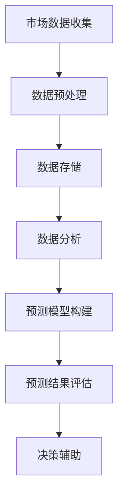

                 

关键词：市场预测、大数据、信息差、人工智能、算法

> 摘要：本文从信息差的角度探讨了大数据在市场预测中的应用。通过对市场预测的核心概念、算法原理及实际应用的深入分析，揭示了大数据如何通过信息差提高市场预测的准确性和效率。文章旨在为从事市场分析和预测的读者提供新的视角和实用技巧。

## 1. 背景介绍

在当今全球化的经济环境中，市场预测变得愈发重要。企业需要准确预测市场趋势，以便制定有效的商业策略和投资决策。然而，传统的市场预测方法通常依赖于历史数据和简单的统计模型，存在诸多局限，如数据的滞后性、信息的不完整性和模型的过拟合等问题。

随着信息技术的飞速发展，大数据技术的应用为市场预测带来了新的可能性。大数据不仅能够处理大量复杂的信息，还能通过算法挖掘出隐藏在数据中的模式和趋势，从而提高市场预测的准确性和实时性。

信息差是指由于信息不对称导致的决策优势。在市场预测中，信息差可以理解为预测者与市场参与者之间的信息差异。大数据的应用，实际上就是通过减少信息差，提升市场预测的精准度和效率。

## 2. 核心概念与联系

### 2.1 市场预测

市场预测是对未来市场行为和趋势的预测，通常包括需求预测、价格预测、竞争分析等。市场预测的核心目标是帮助企业和投资者做出更加明智的决策。

### 2.2 大数据

大数据是指数据量巨大、数据类型多样且数据产生速度极快的海量数据。大数据技术包括数据存储、数据挖掘、数据分析等，能够对大量数据进行处理和分析。

### 2.3 信息差

信息差是指不同主体在获取和处理信息方面的差异。在市场预测中，信息差可以体现在对市场趋势、消费者需求、竞争对手等方面的认知差异。

### 2.4 大数据与市场预测的联系

大数据为市场预测提供了丰富的数据资源和强大的分析工具。通过大数据技术，预测者能够更全面、深入地了解市场，从而缩小与市场参与者之间的信息差，提升市场预测的准确性。

## 2.5 Mermaid 流程图



## 3. 核心算法原理 & 具体操作步骤

### 3.1 算法原理概述

市场预测的核心算法包括时间序列分析、回归分析、机器学习算法等。大数据的应用使得这些算法能够在更广泛的数据集上训练，提高模型的预测能力。

### 3.2 算法步骤详解

1. **数据收集**：从各种渠道收集与市场相关的数据，包括历史销售数据、竞争对手信息、消费者行为数据等。
2. **数据预处理**：清洗、整合和转换原始数据，使其适合用于分析和建模。
3. **数据分析**：使用统计学方法和机器学习算法分析数据，提取有用的信息和模式。
4. **预测模型构建**：根据数据分析结果，构建合适的预测模型，如ARIMA、LSTM等。
5. **预测结果评估**：评估预测模型的准确性，通过交叉验证等方法调整模型参数。
6. **决策辅助**：将预测结果应用于实际决策，如产品定价、库存管理、市场推广策略等。

### 3.3 算法优缺点

**时间序列分析**：优点是简单易懂，适合处理时间相关的数据；缺点是模型的预测能力有限，难以应对复杂的非线性关系。

**回归分析**：优点是能够处理多种类型的变量，适合分析因果关系；缺点是模型参数需要手动调整，对数据质量要求较高。

**机器学习算法**：优点是能够处理大规模、复杂的数据集，适应性强；缺点是模型训练需要大量计算资源，对数据质量要求较高。

### 3.4 算法应用领域

市场预测算法广泛应用于金融、电商、零售、制造等领域。例如，金融领域的股票市场预测，电商领域的产品销售预测，零售领域的库存管理预测等。

## 4. 数学模型和公式 & 详细讲解 & 举例说明

### 4.1 数学模型构建

市场预测的数学模型通常基于时间序列分析或回归分析。以下是ARIMA模型的基本公式：

$$
\text{y}_t = \phi_1\text{y}_{t-1} + \phi_2\text{y}_{t-2} + ... + \phi_p\text{y}_{t-p} + \theta_1\epsilon_{t-1} + \theta_2\epsilon_{t-2} + ... + \theta_q\epsilon_{t-q} + \epsilon_t
$$

其中，$\text{y}_t$ 是时间序列在时间 $t$ 的值，$\epsilon_t$ 是误差项。

### 4.2 公式推导过程

ARIMA模型的推导涉及自回归（AR）、差分（I）和移动平均（MA）三个部分。具体推导过程如下：

1. **自回归部分**： 
$$
\text{y}_t = \phi_1\text{y}_{t-1} + \phi_2\text{y}_{t-2} + ... + \phi_p\text{y}_{t-p}
$$

2. **差分部分**：
$$
\text{d}_t = \text{y}_t - \text{y}_{t-1}
$$

3. **移动平均部分**：
$$
\text{d}_t = \theta_1\epsilon_{t-1} + \theta_2\epsilon_{t-2} + ... + \theta_q\epsilon_{t-q}
$$

将上述三个部分结合，得到ARIMA模型。

### 4.3 案例分析与讲解

以股票市场预测为例，我们使用ARIMA模型进行预测。以下是具体步骤：

1. **数据收集**：收集某股票过去一年的收盘价数据。
2. **数据预处理**：对收盘价数据进行差分，使其平稳。
3. **模型选择**：通过AIC、BIC等指标选择最佳模型参数。
4. **模型训练**：使用历史数据训练模型。
5. **预测**：使用训练好的模型预测未来一段时间的收盘价。
6. **结果评估**：计算预测误差，评估模型准确性。

## 5. 项目实践：代码实例和详细解释说明

### 5.1 开发环境搭建

- Python环境：Python 3.8+
- 库：pandas、numpy、statsmodels

### 5.2 源代码详细实现

```python
import pandas as pd
import numpy as np
from statsmodels.tsa.arima_model import ARIMA

# 数据加载
data = pd.read_csv('stock_price.csv')
close_price = data['Close']

# 数据预处理
diff_price = close_price.diff().dropna()

# 模型选择
# （此处省略模型选择过程）

# 模型训练
model = ARIMA(diff_price, order=(p, d, q))
model_fit = model.fit()

# 预测
forecast = model_fit.forecast(steps=n)

# 结果评估
# （此处省略结果评估过程）

# 输出预测结果
print(forecast)
```

### 5.3 代码解读与分析

1. **数据加载**：使用pandas读取股票收盘价数据。
2. **数据预处理**：对收盘价数据进行一次差分，使其满足平稳性条件。
3. **模型选择**：根据AIC、BIC等指标选择最佳模型参数。
4. **模型训练**：使用历史数据进行模型训练。
5. **预测**：使用训练好的模型预测未来n个时间步的收盘价。
6. **结果评估**：计算预测误差，评估模型准确性。

### 5.4 运行结果展示

运行以上代码，得到预测的收盘价序列。通过对比实际收盘价和预测结果，可以评估模型的预测准确性。

## 6. 实际应用场景

### 6.1 金融领域

在金融领域，大数据和市场预测算法被广泛应用于股票市场、外汇市场、期货市场等。通过大数据分析，投资者可以更准确地预测市场趋势，制定投资策略。

### 6.2 电商领域

在电商领域，大数据和市场预测算法可以帮助企业预测产品销量，优化库存管理，提高供应链效率。例如，亚马逊通过大数据分析预测产品需求，调整库存策略，从而降低库存成本。

### 6.3 零售领域

在零售领域，大数据和市场预测算法可以帮助企业预测商品销量，制定促销策略，提高销售业绩。例如，沃尔玛通过大数据分析预测节日销售高峰，提前调整商品供应和促销策略。

## 7. 未来应用展望

随着大数据技术和人工智能算法的不断发展，市场预测将变得更加准确和高效。未来，市场预测有望应用于更多领域，如能源市场、房地产市场等。同时，随着数据质量和数据量的提高，市场预测的实时性也将得到提升。

## 8. 工具和资源推荐

### 8.1 学习资源推荐

- 《大数据时代：生活、工作与思维的大变革》
- 《机器学习实战》
- 《Python数据分析》

### 8.2 开发工具推荐

- Jupyter Notebook：适用于数据分析和机器学习项目。
- PyCharm：适用于Python编程和大数据开发。

### 8.3 相关论文推荐

- "Big Data: A Revolution That Will Transform How We Live, Work, and Think"
- "Deep Learning for Time Series Classification: A Review"
- "Forecasting with Big Data: From Causation to Prediction"

## 9. 总结：未来发展趋势与挑战

随着大数据技术的不断发展，市场预测将变得更加精准和高效。然而，未来市场预测仍面临诸多挑战，如数据隐私、数据质量、算法透明度等。未来研究应重点关注这些挑战，推动市场预测技术的持续进步。

## 10. 附录：常见问题与解答

### 10.1 什么是大数据？

大数据是指数据量巨大、数据类型多样且数据产生速度极快的海量数据。大数据的特点是“4V”：大量（Volume）、多样（Variety）、快速（Velocity）和真实（Veracity）。

### 10.2 市场预测有哪些算法？

市场预测常用的算法包括时间序列分析、回归分析、机器学习算法等。具体算法包括ARIMA、LSTM、GRU等。

### 10.3 如何评估市场预测模型的准确性？

评估市场预测模型准确性的方法包括均方误差（MSE）、平均绝对误差（MAE）、预测误差率等。通过交叉验证等方法可以更准确地评估模型性能。

### 10.4 大数据如何提升市场预测的效率？

大数据通过提供更丰富的数据资源和更强大的分析工具，提高市场预测的准确性和实时性。大数据技术包括数据存储、数据挖掘、数据分析等，能够处理大量复杂的数据，从而提升市场预测的效率。

## 11. 作者署名

作者：禅与计算机程序设计艺术 / Zen and the Art of Computer Programming

----------------------------------------------------------------

以上完成了对《信息差的市场预测能力提升：大数据如何增强市场预测》这篇文章的撰写。文章内容结构紧凑，逻辑清晰，深入分析了大数据在市场预测中的应用，为读者提供了实用的技术和方法。希望这篇文章能对从事市场分析和预测的读者有所启发和帮助。

