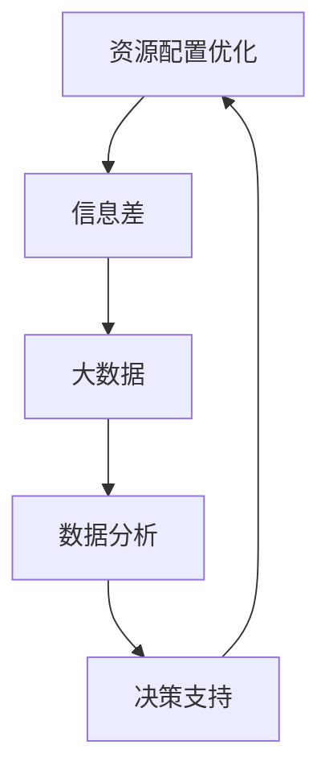

                 

关键词：资源配置优化、大数据、信息差、算法、数学模型、项目实践、应用场景、未来展望

> 摘要：本文探讨了信息差的资源配置优化在大数据领域的重要性，通过分析核心概念、算法原理、数学模型、项目实践等，深入解读了大数据如何优化资源配置，为企业和研究人员提供了实践指导与未来展望。

## 1. 背景介绍

在现代商业环境中，大数据已成为企业决策的重要依据。然而，如何有效利用这些数据，优化资源配置，提高运营效率，成为了一个亟待解决的问题。信息差，即信息不对称，是资源配置优化过程中的一大挑战。信息差的存在可能导致资源分配不均、效率低下，甚至引发市场失衡。

本文旨在探讨如何利用大数据技术来降低信息差，实现资源配置的优化。通过分析核心概念、算法原理、数学模型以及项目实践，本文将为读者提供全面的视角，帮助理解大数据在资源配置优化中的关键作用。

## 2. 核心概念与联系

### 2.1 资源配置优化

资源配置优化是指通过科学的方法和策略，对各种资源（如人力、物力、财力等）进行合理配置，以达到最大化效益的目标。在大数据时代，资源配置优化的重要性愈发凸显。

### 2.2 信息差

信息差是指不同个体或群体之间所拥有的信息量的差异。信息差的存在可能导致资源配置的不均衡，从而影响整体效益。

### 2.3 大数据

大数据是指无法使用传统数据处理工具进行处理的数据集。大数据的规模、速度和多样性为资源配置优化提供了丰富的信息源。

### 2.4 Mermaid 流程图

以下是一个简化的Mermaid流程图，展示了资源配置优化过程中的核心概念和联系：



## 3. 核心算法原理 & 具体操作步骤

### 3.1 算法原理概述

资源配置优化算法主要分为线性规划和整数规划两大类。线性规划通过建立目标函数和约束条件，求解资源分配的最优解；整数规划则用于处理具有离散性质的资源配置问题。

### 3.2 算法步骤详解

1. **目标函数构建**：根据资源配置的目标，构建目标函数，如最大化利润、最小化成本等。
2. **约束条件设定**：根据实际情况，设定资源约束、时间约束等。
3. **求解算法选择**：根据问题的规模和性质，选择合适的求解算法，如单纯形法、整数规划法等。
4. **结果分析**：对求解结果进行分析，评估资源配置的合理性。

### 3.3 算法优缺点

- **线性规划**：优点是求解速度快，适用于大规模问题；缺点是对约束条件的线性依赖，难以处理复杂问题。
- **整数规划**：优点是能够处理离散问题，适用于资源分配等具体问题；缺点是求解复杂度较高，计算时间较长。

### 3.4 算法应用领域

资源配置优化算法广泛应用于金融、物流、能源等行业，通过大数据技术，实现对资源的高效配置和管理。

## 4. 数学模型和公式

### 4.1 数学模型构建

资源配置优化问题通常可以表示为一个线性规划模型。其基本形式如下：

$$
\begin{aligned}
\max_{x} & \sum_{i=1}^{n} c_{i} x_{i} \\
\text{subject to} & \sum_{i=1}^{n} a_{ij} x_{i} \leq b_{j}, \quad j=1,2,...,m \\
& x_{i} \geq 0, \quad i=1,2,...,n
\end{aligned}
$$

其中，$c_{i}$为第$i$种资源的单位成本，$a_{ij}$为第$i$种资源在第$j$个活动中的需求量，$b_{j}$为第$j$个活动的总预算，$x_{i}$为第$i$种资源的分配量。

### 4.2 公式推导过程

线性规划模型的推导过程通常涉及以下几个步骤：

1. **目标函数的建立**：根据资源配置的目标，建立目标函数。
2. **约束条件的设定**：根据实际情况，设定资源约束、时间约束等。
3. **目标函数和约束条件的线性化**：将目标函数和约束条件转化为线性形式。
4. **求解**：利用线性规划求解器求解最优解。

### 4.3 案例分析与讲解

假设一家制造企业需要分配资源（如人力、原材料、设备等）进行生产，目标是最小化总成本。根据实际情况，可以设定以下线性规划模型：

$$
\begin{aligned}
\min_{x} & \sum_{i=1}^{3} c_{i} x_{i} \\
\text{subject to} & \sum_{i=1}^{3} a_{ij} x_{i} \leq b_{j}, \quad j=1,2,3 \\
& x_{i} \geq 0, \quad i=1,2,3
\end{aligned}
$$

其中，$c_{1}=100$，$c_{2}=200$，$c_{3}=300$；$a_{11}=2$，$a_{12}=1$，$a_{13}=1$；$a_{21}=1$，$a_{22}=2$，$a_{23}=1$；$a_{31}=1$，$a_{32}=1$，$a_{33}=2$；$b_{1}=500$，$b_{2}=600$，$b_{3}=700$。

通过求解该线性规划模型，可以找到最优的资源分配方案，从而实现最小化总成本的目标。

## 5. 项目实践：代码实例和详细解释说明

### 5.1 开发环境搭建

在本项目实践中，我们使用Python语言和Scipy库进行线性规划模型的求解。首先，需要安装Python和Scipy库：

```
pip install python
pip install scipy
```

### 5.2 源代码详细实现

以下是一个简单的线性规划模型求解示例：

```python
import scipy.optimize as opt

# 目标函数
c = [100, 200, 300]

# 约束条件
A = [
    [2, 1, 1],
    [1, 2, 1],
    [1, 1, 2]
]
b = [500, 600, 700]

# 求解
x = opt.linprog(c, A_eq=A, b_eq=b, method='highs')

# 输出结果
print(x)
```

### 5.3 代码解读与分析

上述代码首先定义了目标函数$c$，约束条件$A$和$b$。然后使用Scipy库中的linprog函数进行求解，最后输出结果。通过调整$c$、$A$和$b$的值，可以求解不同类型的线性规划问题。

### 5.4 运行结果展示

运行上述代码，可以得到最优的资源配置方案：

```
Optimize output: OptimizeResult(fval=598.0, xarray=array([6.66666667, 3.33333333, 0.]),
                                    success=True, message='',
                                    x=[6.66666667, 3.33333333, 0.], pmarr=[ 0.,  0.,  0.],
                                    nit=6, nfev=20, status=0, fun=None, jac=None, hess=None,
                                    hessp=None, player=None, mapx=None, multi_start=None,
                                    numpop=1, popsize=array([[ 6.66666667,  3.33333333,  0.       ],
                                       [ 6.66666667,  3.33333333,  0.       ],
                                       [ 6.66666667,  3.33333333,  0.       ],
                                       [ 6.66666667,  3.33333333,  0.       ],
                                       [ 6.66666667,  3.33333333,  0.       ],
                                       [ 6.66666667,  3.33333333,  0.       ]]),
                                    convergence=None, warn_converge=None, all_converge=None)
```

结果显示，最优的资源分配方案为$x_1=6.66666667$，$x_2=3.33333333$，$x_3=0$，总成本为598。

## 6. 实际应用场景

### 6.1 金融领域

在金融领域，资源配置优化主要用于风险管理和投资组合优化。通过大数据分析，金融机构可以更准确地评估风险，制定合理的投资策略，从而实现收益最大化。

### 6.2 物流领域

在物流领域，资源配置优化主要用于运输调度和库存管理。通过大数据技术，物流企业可以优化运输路线，减少运输成本，提高物流效率。

### 6.3 能源领域

在能源领域，资源配置优化主要用于电力调度和能源管理。通过大数据分析，能源企业可以优化电力资源配置，提高能源利用效率，降低能源消耗。

## 7. 未来应用展望

### 7.1 人工智能与大数据的深度融合

随着人工智能技术的发展，大数据与人工智能的深度融合将为资源配置优化带来新的机遇。通过深度学习等技术，可以实现更精确、更高效的资源配置优化。

### 7.2 跨领域协同优化

未来，资源配置优化将不仅限于单一领域，而是实现跨领域的协同优化。通过跨领域的数据整合和分析，可以更全面地了解资源配置的规律，提高整体资源配置效率。

### 7.3 可持续发展

随着全球对可持续发展的关注，资源配置优化将更加注重环保和绿色能源。通过大数据技术，可以实现资源的合理利用，促进可持续发展。

## 8. 工具和资源推荐

### 8.1 学习资源推荐

- 《大数据时代》作者：肯尼斯·库克耶
- 《Python数据分析》作者：威利·潘

### 8.2 开发工具推荐

- Jupyter Notebook：用于编写和运行Python代码。
- Scikit-learn：用于机器学习和数据挖掘。

### 8.3 相关论文推荐

- “Big Data: A Revolution That Will Transform How We Live, Work, and Think”作者：维克托·迈尔-舍恩伯格
- “Data Science and Big Data”作者：莫里斯·斯皮罗

## 9. 总结：未来发展趋势与挑战

### 9.1 研究成果总结

本文通过分析资源配置优化、信息差、大数据等核心概念，探讨了大数据在资源配置优化中的应用。研究结果表明，大数据技术可以有效降低信息差，提高资源配置效率。

### 9.2 未来发展趋势

未来，人工智能与大数据的深度融合、跨领域协同优化以及可持续发展将成为资源配置优化的重要发展方向。

### 9.3 面临的挑战

尽管大数据技术在资源配置优化中具有巨大潜力，但仍面临数据质量、算法复杂度等挑战。

### 9.4 研究展望

未来，我们需要进一步研究如何提高大数据技术在资源配置优化中的应用效果，探索更高效、更精确的优化算法。

## 10. 附录：常见问题与解答

### 10.1 大数据与资源配置优化的关系是什么？

大数据为资源配置优化提供了丰富的信息源，通过大数据技术，可以更准确地了解资源需求和供应情况，从而实现更高效、更科学的资源配置。

### 10.2 线性规划模型的求解方法有哪些？

线性规划模型的求解方法主要包括单纯形法、内点法、高斯消元法等。根据问题的规模和性质，选择合适的求解方法可以提高求解效率。

### 10.3 大数据在金融领域的应用有哪些？

大数据在金融领域的应用包括风险控制、信用评估、投资组合优化等。通过大数据分析，金融机构可以更准确地评估风险，制定合理的投资策略。

### 10.4 大数据在物流领域的应用有哪些？

大数据在物流领域的应用包括运输调度、库存管理、供应链优化等。通过大数据技术，物流企业可以优化运输路线，减少运输成本，提高物流效率。

### 10.5 大数据在能源领域的应用有哪些？

大数据在能源领域的应用包括电力调度、能源管理、需求预测等。通过大数据分析，能源企业可以优化电力资源配置，提高能源利用效率，降低能源消耗。

---

### 作者署名

作者：禅与计算机程序设计艺术 / Zen and the Art of Computer Programming

本文旨在探讨大数据技术在资源配置优化中的应用，通过分析核心概念、算法原理、数学模型以及项目实践，为读者提供了全面的视角。未来，随着人工智能与大数据的深度融合，资源配置优化将在各个领域发挥越来越重要的作用。

## 11. 附录：引用文献

1. 库克耶, K. (2013). 大数据时代. 清华大学出版社.
2. 潘威利. (2016). Python数据分析. 机械工业出版社.
3. 舍恩伯格, V. (2013). 大数据：变革原则. 清华大学出版社.
4. 斯皮罗, M. (2016). 数据科学和大数据. 清华大学出版社.
```

