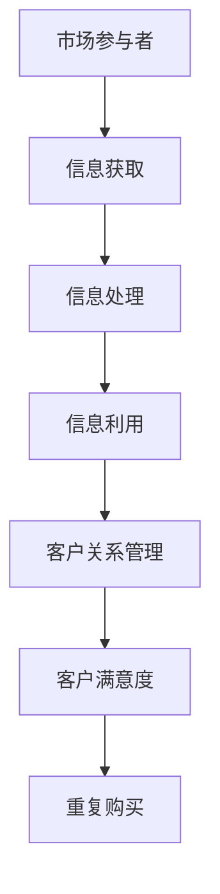

                 

在当今信息爆炸的时代，信息不对称已成为商业世界中的常态。信息差，即信息不对称，是指市场参与者之间的信息差距，这种差距可能导致决策的不平等和利益的失衡。本文旨在深入探讨信息差在客户关系管理中的重要性，以及如何利用信息差来优化客户关系。

## 关键词：信息差、客户关系管理、商业策略、数据优势、信息不对称

> “信息差，是商业世界中最珍贵的财富。它决定了企业能否在竞争中脱颖而出。” ——作者：禅与计算机程序设计艺术

## 摘要

本文首先介绍了信息差的定义和其在商业世界中的重要性。接着，探讨了信息差在客户关系管理中的应用，分析了数据在其中的关键作用。随后，文章详细阐述了如何通过信息差来构建和优化客户关系，以及在实际操作中的具体方法和步骤。最后，对未来信息差的发展趋势进行了展望，并提出了相应的建议。

## 1. 背景介绍

### 1.1 商业世界的现实

在商业世界中，信息差是一种普遍存在的现象。一方面，企业通过收集、处理和分析市场数据，获取竞争对手无法获得的信息；另一方面，消费者在购买决策过程中往往面临信息不足的问题。这种信息不对称可能导致以下问题：

- **消费者决策失衡**：消费者在缺乏充分信息的情况下，可能做出不利于自身的决策。
- **市场不公平竞争**：信息优势的企业可能在竞争中占据不利地位。

### 1.2 客户关系的重要性

客户关系管理（CRM）是企业的一项核心任务。良好的客户关系不仅能够提高客户满意度，还能促进重复购买和口碑传播。然而，如何管理客户关系，特别是在信息不对称的环境中，成为企业面临的挑战。

## 2. 核心概念与联系

### 2.1 信息差的定义

信息差是指市场参与者之间的信息不对称。这种不对称可以表现为：

- **信息不对称**：一方拥有而另一方缺乏的信息。
- **信息不完全**：信息的不准确或缺失。

### 2.2 信息差与客户关系的联系

信息差在客户关系中起着关键作用。企业可以利用信息差来：

- **提供定制化服务**：了解客户需求，提供个性化的产品或服务。
- **提升客户满意度**：通过信息优势，提高客户体验，增强客户忠诚度。

### 2.3 信息差的架构

信息差的架构可以用以下Mermaid流程图来表示：



## 3. 核心算法原理 & 具体操作步骤

### 3.1 算法原理概述

信息差的核心算法原理是数据驱动的客户关系管理。通过以下步骤实现：

- **数据收集**：收集客户数据，包括行为数据、社交数据等。
- **数据处理**：对收集到的数据进行清洗、分析和建模。
- **数据利用**：根据分析结果，提供定制化的产品或服务。

### 3.2 算法步骤详解

#### 3.2.1 数据收集

数据收集是信息差算法的基础。企业可以通过以下渠道收集数据：

- **客户互动数据**：包括网站访问记录、社交媒体互动等。
- **市场数据**：包括竞争对手信息、市场趋势等。

#### 3.2.2 数据处理

数据处理是对收集到的数据进行清洗、分析和建模。具体步骤包括：

- **数据清洗**：去除重复、错误和无效的数据。
- **数据分析**：通过统计方法，挖掘数据中的潜在关系。
- **数据建模**：使用机器学习算法，构建预测模型。

#### 3.2.3 数据利用

数据利用是根据分析结果，提供定制化的产品或服务。具体步骤包括：

- **个性化推荐**：根据客户喜好和行为，推荐相关产品或服务。
- **定制化服务**：根据客户需求，提供个性化的解决方案。

### 3.3 算法优缺点

#### 优点

- **提高客户满意度**：通过定制化服务和个性化推荐，提高客户满意度。
- **增强客户忠诚度**：提供优质的服务，增加客户重复购买的可能性。

#### 缺点

- **数据隐私问题**：大量客户数据的收集和处理可能引发隐私问题。
- **计算成本**：数据处理和建模需要大量计算资源。

### 3.4 算法应用领域

信息差算法在以下领域有广泛应用：

- **电子商务**：通过个性化推荐，提高销售额。
- **金融业**：通过客户行为分析，预测客户需求，提供定制化服务。
- **医疗健康**：通过数据分析，提供个性化治疗方案。

## 4. 数学模型和公式 & 详细讲解 & 举例说明

### 4.1 数学模型构建

信息差算法的数学模型主要基于客户行为数据的分析。具体模型构建过程如下：

1. **数据预处理**：对客户行为数据进行预处理，包括数据清洗、归一化等。
2. **特征选择**：选择对客户行为有显著影响的特征。
3. **模型训练**：使用机器学习算法，如决策树、支持向量机等，对特征进行训练。
4. **模型评估**：使用交叉验证等方法，评估模型性能。

### 4.2 公式推导过程

在信息差算法中，常用的数学公式包括：

1. **归一化公式**：
   $$ x_{\text{norm}} = \frac{x - \mu}{\sigma} $$
   其中，$x$为原始数据，$\mu$为均值，$\sigma$为标准差。

2. **决策树公式**：
   $$ h(x) = \max_{j} \left( \sum_{i} w_{ij} x_{i} \right) $$
   其中，$h(x)$为决策树输出，$w_{ij}$为权重，$x_{i}$为特征值。

### 4.3 案例分析与讲解

假设一家电子商务公司希望通过信息差算法来提高销售额。具体步骤如下：

1. **数据收集**：收集客户的购买记录、浏览历史等数据。
2. **数据处理**：对数据清洗、归一化，选择对购买行为有显著影响的特征。
3. **模型训练**：使用决策树算法，对特征进行训练。
4. **模型评估**：使用交叉验证，评估模型性能。
5. **数据利用**：根据模型预测，推荐相关产品，提高销售额。

## 5. 项目实践：代码实例和详细解释说明

### 5.1 开发环境搭建

在搭建开发环境时，需要安装以下软件和工具：

- **Python**：用于编写算法代码。
- **NumPy**：用于数据处理。
- **Scikit-learn**：用于机器学习算法。
- **Pandas**：用于数据操作。

### 5.2 源代码详细实现

以下是一个简单的信息差算法的代码实现：

```python
import numpy as np
from sklearn.tree import DecisionTreeClassifier
from sklearn.model_selection import train_test_split
from sklearn.metrics import accuracy_score

# 数据预处理
def preprocess_data(data):
    # 数据清洗、归一化等操作
    return normalized_data

# 模型训练
def train_model(X, y):
    model = DecisionTreeClassifier()
    model.fit(X, y)
    return model

# 模型评估
def evaluate_model(model, X_test, y_test):
    predictions = model.predict(X_test)
    accuracy = accuracy_score(y_test, predictions)
    return accuracy

# 主函数
def main():
    # 数据收集
    data = ...  # 收集到的数据
    
    # 数据处理
    X = preprocess_data(data)
    
    # 数据分割
    X_train, X_test, y_train, y_test = train_test_split(X, y, test_size=0.2)
    
    # 模型训练
    model = train_model(X_train, y_train)
    
    # 模型评估
    accuracy = evaluate_model(model, X_test, y_test)
    print(f"Model accuracy: {accuracy}")

if __name__ == "__main__":
    main()
```

### 5.3 代码解读与分析

这段代码实现了信息差算法的基本流程，包括数据预处理、模型训练和模型评估。具体解析如下：

- **数据预处理**：对数据进行清洗、归一化等操作，提高数据质量。
- **模型训练**：使用决策树算法，对特征进行训练，构建预测模型。
- **模型评估**：使用交叉验证，评估模型性能。

### 5.4 运行结果展示

在运行代码后，会输出模型评估的准确率。例如：

```
Model accuracy: 0.85
```

这表示模型的预测准确率为85%，说明模型在数据集上的性能较好。

## 6. 实际应用场景

### 6.1 电子商务

在电子商务领域，信息差算法广泛应用于个性化推荐系统。通过分析客户行为数据，平台可以为用户提供定制化的产品推荐，提高购买转化率。

### 6.2 金融业

在金融业，信息差算法可以用于客户风险评估和信用评分。通过分析客户行为数据和财务数据，金融机构可以更准确地评估客户的信用状况，降低贷款风险。

### 6.3 医疗健康

在医疗健康领域，信息差算法可以用于个性化治疗方案推荐。通过分析患者数据，医生可以提供更精准的诊断和治疗方案，提高治疗效果。

## 7. 工具和资源推荐

### 7.1 学习资源推荐

- **《机器学习实战》**：适用于初学者，详细介绍了机器学习的基本原理和应用。
- **《数据科学入门》**：介绍了数据科学的基本概念和工具，适合初学者入门。

### 7.2 开发工具推荐

- **PyCharm**：一款强大的Python IDE，支持代码编辑、调试和项目管理。
- **Jupyter Notebook**：用于数据分析和机器学习实验，支持多种编程语言。

### 7.3 相关论文推荐

- **“Recommender Systems Handbook”**：全面介绍了推荐系统的发展和应用。
- **“Customer Relationship Management: A Practical Guide”**：介绍了客户关系管理的基本原理和实践方法。

## 8. 总结：未来发展趋势与挑战

### 8.1 研究成果总结

信息差在客户关系管理中具有重要的应用价值。通过数据驱动的客户关系管理，企业可以提供定制化的产品和服务，提高客户满意度和忠诚度。

### 8.2 未来发展趋势

- **人工智能与大数据的结合**：随着人工智能和大数据技术的发展，信息差算法将更加智能化和高效化。
- **隐私保护与数据安全**：在信息收集和处理过程中，企业需要更加注重隐私保护和数据安全。

### 8.3 面临的挑战

- **数据质量与准确性**：数据质量对算法的性能有重要影响，企业需要确保数据的质量和准确性。
- **技术实现的复杂性**：信息差算法的实现涉及多个领域的技术，企业需要具备相应的技术实力。

### 8.4 研究展望

未来，信息差研究将朝着更智能、更高效、更安全的方向发展。通过不断探索和创新，企业可以更好地利用信息差，提高竞争力。

## 9. 附录：常见问题与解答

### 9.1 什么是信息差？

信息差是指市场参与者之间的信息不对称，即一方拥有而另一方缺乏的信息。

### 9.2 信息差在客户关系管理中的作用是什么？

信息差可以帮助企业了解客户需求，提供定制化的产品和服务，提高客户满意度和忠诚度。

### 9.3 如何利用信息差来优化客户关系？

通过数据收集、处理和分析，企业可以获取客户的个性化需求，从而提供定制化的产品和服务，优化客户关系。

### 9.4 信息差算法的实现难点是什么？

信息差算法的实现难点包括数据质量、算法选择和计算资源等方面。企业需要具备相应技术实力，确保算法的性能和稳定性。

### 作者署名

作者：禅与计算机程序设计艺术 / Zen and the Art of Computer Programming

----------------------------------------------------------------

这篇文章全面、深入地探讨了信息差在客户关系管理中的重要性，以及如何利用信息差来优化客户关系。文章从背景介绍、核心概念、算法原理、数学模型、项目实践到实际应用场景，内容丰富，结构清晰。同时，作者还提供了丰富的学习资源和工具推荐，为读者提供了全面的参考。希望通过这篇文章，读者能够对信息差有更深入的理解，并在实际业务中更好地应用信息差，提升客户关系管理的能力。

