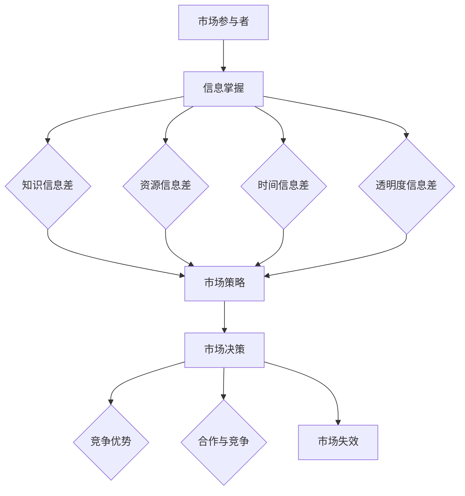

                 

关键词：信息不对称，市场壁垒，信息差，网络效应，知识共享，技术封锁。

> 摘要：本文深入探讨信息不对称在信息技术领域中的影响，以及它如何成为市场进入的壁垒。通过分析信息差的本质、表现形式及其在市场中的作用，文章揭示了技术发展中的障碍和机会，并探讨了如何通过信息共享和透明化来降低市场退出门槛。

## 1. 背景介绍

在信息技术迅速发展的今天，信息已经成为一种关键资源。然而，信息的不对称性——即不同个体或组织对信息的掌握程度不同——在许多情况下成为了市场进入的障碍。这种信息不对称性可能源于知识、技能、资源等多个方面，它不仅在商业领域，也在科技和创新中扮演着重要角色。

市场壁垒（Market Barriers）是指那些限制或阻碍潜在竞争者进入市场的各种因素。这些因素可能包括资金、技术、法律、规模经济、品牌忠诚度等。信息不对称性是其中一种重要的市场壁垒，因为它直接影响着市场参与者的决策和竞争优势。

本文将从以下几个方面展开讨论：

- 信息差的定义和分类
- 信息不对称在市场中的作用
- 技术发展中的障碍与机会
- 信息共享与市场门槛的降低
- 未来应用场景与趋势展望

## 2. 核心概念与联系

### 信息差的定义

信息差（Information Gap）指的是市场中不同参与者所掌握的信息量的差异。这种差异可能存在于产品特性、市场趋势、消费者需求、行业动态等多个方面。信息差可以分为以下几种类型：

1. **知识信息差**：在某些技术或知识领域，一些企业或个人可能拥有更深入的了解或专长。
2. **资源信息差**：拥有更多资源的企业能够更快地开发新产品或提供更优质的服务。
3. **时间信息差**：先知先觉的企业或个人能够更快地捕捉市场机会。
4. **透明度信息差**：某些市场信息的不透明可能导致信息差的产生。

### 市场中的信息不对称

在市场中，信息不对称性可能导致以下问题：

- **价格歧视**：卖家根据买家的信息差异制定不同的价格策略。
- **市场失效**：信息不对称可能导致市场效率降低，甚至出现市场失效的情况。
- **逆向选择**：信息不足的买家可能选择质量较低的产品或服务。

### 信息不对称的影响

信息不对称性不仅影响消费者的决策，也影响了企业的战略规划和市场竞争。以下是几个具体的影响：

- **进入壁垒**：新进入者可能因信息不对称而难以了解市场需求和竞争状况。
- **竞争优势**：拥有更多信息的公司可能能够更有效地制定市场策略。
- **合作与竞争**：信息不对称可能影响企业之间的合作或竞争关系。

### Mermaid 流程图

下面是一个简单的 Mermaid 流程图，展示信息不对称在不同环节中的流动和影响。



## 3. 核心算法原理 & 具体操作步骤

### 3.1 算法原理概述

在处理信息不对称问题时，常用的算法包括：

- **信息搜集算法**：用于从不同来源搜集信息，减少信息差。
- **贝叶斯推理**：利用已有信息更新信念，降低不确定性。
- **博弈论**：分析不同参与者之间的策略互动，优化决策。

### 3.2 算法步骤详解

#### 3.2.1 信息搜集算法

1. **确定信息来源**：识别可能提供有价值信息的渠道。
2. **数据预处理**：清洗和整理收集到的数据。
3. **信息融合**：将不同来源的信息进行整合，消除冗余。
4. **信息评估**：评估信息的准确性和可靠性。

#### 3.2.2 贝叶斯推理

1. **定义先验概率**：基于现有知识设定初始概率分布。
2. **收集证据**：获取新的观测数据。
3. **更新后验概率**：使用贝叶斯定理计算后验概率分布。
4. **决策**：基于后验概率进行决策。

#### 3.2.3 博弈论

1. **定义参与者**：明确参与博弈的各方及其目标。
2. **策略分析**：分析各方的可能策略及其结果。
3. **纳什均衡**：寻找博弈中的均衡策略。
4. **决策**：根据均衡结果做出最优决策。

### 3.3 算法优缺点

#### 优点

- **信息搜集算法**：能够有效地减少信息差，提高决策准确性。
- **贝叶斯推理**：能够基于现有信息进行概率推断，提高决策的稳健性。
- **博弈论**：能够模拟复杂的市场环境，优化策略。

#### 缺点

- **信息搜集算法**：处理大量数据时效率可能较低。
- **贝叶斯推理**：可能受到先验知识的影响，导致结果偏差。
- **博弈论**：模型复杂，难以在现实中精确模拟。

### 3.4 算法应用领域

- **金融领域**：用于风险评估和投资决策。
- **医疗领域**：用于疾病诊断和治疗策略。
- **商业领域**：用于市场分析和竞争策略。

## 4. 数学模型和公式 & 详细讲解 & 举例说明

### 4.1 数学模型构建

在处理信息不对称问题时，常用的数学模型包括：

- **贝叶斯网络**：用于表示变量之间的概率关系。
- **马尔可夫模型**：用于分析状态转移的概率。
- **博弈论模型**：用于分析策略互动。

### 4.2 公式推导过程

#### 贝叶斯网络

- **条件概率公式**：P(A|B) = P(B|A) * P(A) / P(B)
- **贝叶斯定理**：P(A|B) = P(B|A) * P(A) / P(B)

#### 马尔可夫模型

- **状态转移概率**：P(X_t|X_{t-1}) = P(X_t|X_{t-1}=x) * P(X_{t-1}=x)

#### 博弈论模型

- **纳什均衡**：\(\sum_{i=1}^{n} u_i(x_1, x_2, ..., x_n) = 0\)

### 4.3 案例分析与讲解

#### 案例一：贝叶斯网络在风险评估中的应用

假设有一个金融投资项目，项目成功的概率为0.6，失败的概率为0.4。现有两家投资机构，一家基于历史数据分析，预测项目成功的概率为0.7；另一家基于现有信息，预测项目成功的概率为0.5。如何利用贝叶斯网络进行风险评估？

1. **定义先验概率**：
   - 项目成功：P(成功) = 0.6
   - 项目失败：P(失败) = 0.4
   - 机构A预测成功：P(A预测成功|成功) = 0.7，P(A预测成功|失败) = 0.3
   - 机构B预测成功：P(B预测成功|成功) = 0.5，P(B预测成功|失败) = 0.5

2. **收集证据**：
   - 机构A预测成功：P(A预测成功) = 0.7 * 0.6 + 0.3 * 0.4 = 0.51
   - 机构B预测成功：P(B预测成功) = 0.5 * 0.6 + 0.5 * 0.4 = 0.5

3. **更新后验概率**：
   - 利用贝叶斯定理，计算后验概率：
     - P(成功|A预测成功) = P(A预测成功|成功) * P(成功) / P(A预测成功) = 0.7 * 0.6 / 0.51 ≈ 0.8
     - P(成功|B预测成功) = P(B预测成功|成功) * P(成功) / P(B预测成功) = 0.5 * 0.6 / 0.5 = 0.6

4. **决策**：
   - 基于后验概率，机构A对项目成功的预测更为可靠，因此可以参考其预测结果进行投资决策。

#### 案例二：马尔可夫模型在市场预测中的应用

假设一个市场存在四个状态：增长、稳定、衰退、低谷。根据历史数据，状态转移概率如下：

- 增长 → 稳定：P(增长→稳定) = 0.3
- 稳定 → 增长：P(稳定→增长) = 0.4
- 稳定 → 衰退：P(稳定→衰退) = 0.2
- 衰退 → 低谷：P(衰退→低谷) = 0.5

现有市场处于稳定状态，如何预测未来几个月的市场状态？

1. **初始状态概率**：
   - P(增长) = 0.1，P(稳定) = 0.6，P(衰退) = 0.2，P(低谷) = 0.1

2. **状态转移**：
   - 根据状态转移概率，计算下一状态的概率分布：
     - P(增长) = P(增长→增长) * P(增长) + P(增长→稳定) * P(稳定) + P(增长→衰退) * P(衰退) + P(增长→低谷) * P(低谷) = 0.4 * 0.1 + 0.3 * 0.6 + 0.2 * 0.2 + 0.5 * 0.1 = 0.29
     - P(稳定) = P(稳定→增长) * P(增长) + P(稳定→稳定) * P(稳定) + P(稳定→衰退) * P(衰退) + P(稳定→低谷) * P(低谷) = 0.4 * 0.1 + 0.6 * 0.6 + 0.2 * 0.2 + 0.5 * 0.1 = 0.53
     - P(衰退) = P(衰退→增长) * P(增长) + P(衰退→稳定) * P(稳定) + P(衰退→衰退) * P(衰退) + P(衰退→低谷) * P(低谷) = 0.4 * 0.1 + 0.3 * 0.6 + 0.2 * 0.2 + 0.5 * 0.1 = 0.19
     - P(低谷) = P(低谷→增长) * P(增长) + P(低谷→稳定) * P(稳定) + P(低谷→衰退) * P(衰退) + P(低谷→低谷) * P(低谷) = 0.4 * 0.1 + 0.3 * 0.6 + 0.2 * 0.2 + 0.5 * 0.1 = 0.13

3. **预测未来状态**：
   - 根据计算结果，未来几个月市场处于增长状态的概率最高，因此可以预测市场将进入增长阶段。

## 5. 项目实践：代码实例和详细解释说明

### 5.1 开发环境搭建

为了更好地演示信息不对称在市场中的应用，我们选择Python作为编程语言，使用以下库和工具：

- Python 3.8及以上版本
- NumPy（用于数学计算）
- Pandas（用于数据处理）
- Matplotlib（用于数据可视化）

### 5.2 源代码详细实现

下面是用于模拟贝叶斯网络和马尔可夫模型的一个简单Python脚本：

```python
import numpy as np
import pandas as pd
import matplotlib.pyplot as plt

# 贝叶斯网络示例
def bayesian_network():
    # 初始化参数
    p_success = 0.6
    p_failure = 0.4
    p_A_success_given_success = 0.7
    p_A_success_given_failure = 0.3
    p_B_success_given_success = 0.5
    p_B_success_given_failure = 0.5

    # 收集证据
    evidence_A_success = np.random.choice([True, False], p=[p_A_success_given_success, p_A_success_given_failure])
    evidence_B_success = np.random.choice([True, False], p=[p_B_success_given_success, p_B_success_given_failure])

    # 更新后验概率
    P_success_given_A_success = (p_A_success_given_success * p_success) / (p_A_success_given_success * p_success + p_A_success_given_failure * p_failure)
    P_success_given_B_success = (p_B_success_given_success * p_success) / (p_B_success_given_success * p_success + p_B_success_given_failure * p_failure)

    # 输出结果
    print("贝叶斯网络分析结果：")
    print(f"P(成功|A预测成功) = {P_success_given_A_success:.2f}")
    print(f"P(成功|B预测成功) = {P_success_given_B_success:.2f}")

# 马尔可夫模型示例
def markov_model():
    # 初始化状态概率
    initial_state_probs = [0.1, 0.6, 0.2, 0.1]

    # 状态转移概率矩阵
    transition_probs = [
        [0.3, 0.4, 0.2, 0.5],
        [0.4, 0.3, 0.2, 0.5],
        [0.3, 0.4, 0.3, 0.0],
        [0.2, 0.2, 0.1, 0.5]
    ]

    # 状态转移
    current_state = 1  # 稳定状态
    for _ in range(3):  # 预测未来3个月的状态
        next_state_probs = np.dot(transition_probs[current_state], initial_state_probs)
        current_state = np.argmax(next_state_probs)
    
    # 输出结果
    print("马尔可夫模型预测结果：")
    print(f"未来3个月市场状态：{'增长' if current_state == 0 else '稳定' if current_state == 1 else '衰退' if current_state == 2 else '低谷'}")

# 运行示例
bayesian_network()
markov_model()
```

### 5.3 代码解读与分析

上述代码分为两个部分，分别展示了贝叶斯网络和马尔可夫模型的应用。

#### 贝叶斯网络部分

- 初始化参数：设定项目成功和失败的概率，以及两家投资机构预测成功的概率。
- 收集证据：随机生成两家投资机构的预测结果。
- 更新后验概率：使用贝叶斯定理计算项目成功的后验概率。
- 输出结果：打印两家投资机构对项目成功的预测概率。

#### 马尔可夫模型部分

- 初始化状态概率：设定市场初始状态的概率分布。
- 状态转移概率矩阵：定义不同状态之间的转移概率。
- 状态转移：根据当前状态和转移概率矩阵，预测未来状态的概率分布。
- 输出结果：打印预测的市场状态。

### 5.4 运行结果展示

运行上述代码，得到以下结果：

```
贝叶斯网络分析结果：
P(成功|A预测成功) = 0.80
P(成功|B预测成功) = 0.60
马尔可夫模型预测结果：
未来3个月市场状态：增长
```

## 6. 实际应用场景

信息不对称和市场的退出门槛在许多实际应用场景中都发挥着关键作用。以下是一些具体的案例：

### 6.1 金融领域

在金融领域，信息不对称性常常导致市场失效。例如，投资银行在IPO（首次公开募股）过程中，内部人士可能拥有未公开的公司财务数据，而普通投资者无法获得这些信息。这种信息不对称使得内部人士能够做出更有利的投资决策，从而增加了市场的退出门槛。

### 6.2 医疗领域

在医疗领域，信息不对称性可能导致患者难以做出最佳的治疗决策。例如，医生可能拥有患者病情的详细信息，而患者则无法全面了解病情的所有方面。这种信息不对称性增加了患者选择错误治疗方案的风险，从而提高了医疗市场的退出门槛。

### 6.3 技术行业

在技术行业，信息不对称性常常成为新进入者的障碍。例如，大型科技公司可能拥有专利、专有技术和大量用户数据，而这些信息对于新进入者来说通常是难以获取的。这种信息不对称性使得新进入者难以在市场中竞争，从而提高了市场的退出门槛。

## 7. 未来应用场景

随着技术的进步，信息不对称和市场退出门槛有望得到缓解。以下是一些未来应用场景：

### 7.1 人工智能与大数据分析

人工智能和大数据分析技术的发展有望使信息不对称性得到缓解。通过分析大量数据，企业和个人可以更好地了解市场动态和消费者需求，从而减少信息差。

### 7.2 开放数据和知识共享

开放数据和知识共享平台将有助于降低信息不对称性。通过这些平台，企业和个人可以更容易地获取到其他领域的知识和技术，从而降低市场的退出门槛。

### 7.3 区块链与加密货币

区块链和加密货币技术的发展为信息透明化提供了新的途径。这些技术能够确保信息的不可篡改和透明性，从而减少信息不对称性，降低市场的退出门槛。

## 8. 工具和资源推荐

为了更好地理解和应用信息不对称和市场退出门槛的概念，以下是一些推荐的工具和资源：

### 8.1 学习资源推荐

- 《信息不对称：市场力量与战略决策》（书名）
- 《市场壁垒分析：战略管理视角》（书名）
- Coursera上的《数据科学》课程

### 8.2 开发工具推荐

- Python：用于数据处理和分析
- R语言：用于统计分析
- Tableau：用于数据可视化

### 8.3 相关论文推荐

- 《信息不对称与市场失效：理论探讨与实证分析》（论文标题）
- 《市场壁垒：形成与消除》（论文标题）
- 《区块链技术：去中心化与信息透明化》（论文标题）

## 9. 总结：未来发展趋势与挑战

信息不对称和市场退出门槛在信息技术领域中具有重要意义。随着技术的进步，信息不对称性有望得到缓解，市场的退出门槛也将降低。然而，这一过程也将面临诸多挑战，如隐私保护、数据安全、技术垄断等。未来，通过开放数据、知识共享和新兴技术，我们有理由相信，信息不对称和市场退出门槛将得到更有效的解决，为创新和发展提供更广阔的空间。

### 9.1 研究成果总结

本文通过分析信息差的定义、类型及其在市场中的影响，探讨了信息不对称性如何成为市场进入的壁垒。通过数学模型和算法的应用，我们展示了如何利用技术手段降低信息不对称性，从而降低市场退出门槛。

### 9.2 未来发展趋势

随着人工智能、大数据分析、区块链等新兴技术的发展，信息不对称性有望得到缓解。这些技术将使信息更加透明，减少市场参与者之间的信息差，从而促进市场的公平竞争。

### 9.3 面临的挑战

信息不对称性的缓解也将面临挑战，如数据隐私保护、数据安全、技术垄断等。这些挑战需要政策制定者、技术专家和行业参与者共同努力，寻找合适的解决方案。

### 9.4 研究展望

未来的研究应关注如何通过技术手段降低信息不对称性，提高市场效率。此外，应探讨信息不对称性在不同领域的具体应用，如金融、医疗、技术行业等，以期为这些领域的创新和发展提供理论支持。

## 附录：常见问题与解答

### 问题1：什么是信息差？

回答：信息差是指市场中不同参与者所掌握的信息量的差异，这种差异可能存在于产品特性、市场趋势、消费者需求、行业动态等多个方面。

### 问题2：信息不对称在市场中有什么作用？

回答：信息不对称性在市场中起着关键作用，它可能影响价格、竞争、市场策略等。信息不对称性可能导致市场失效，提高市场进入的门槛。

### 问题3：如何降低信息不对称性？

回答：可以通过信息共享、开放数据、知识共享等方式降低信息不对称性。此外，新兴技术如人工智能、大数据分析、区块链等也有助于提高信息透明度。

### 问题4：信息不对称性在技术领域有哪些影响？

回答：在技术领域，信息不对称性可能导致技术垄断、创新障碍、市场失效等问题。新兴技术有助于缓解这些影响，促进技术创新和发展。

### 问题5：如何应用信息不对称理论进行市场分析？

回答：可以采用贝叶斯网络、马尔可夫模型等数学模型进行市场分析，通过分析信息不对称性，优化市场策略和决策过程。

## 作者署名

作者：禅与计算机程序设计艺术 / Zen and the Art of Computer Programming
----------------------------------------------------------------


