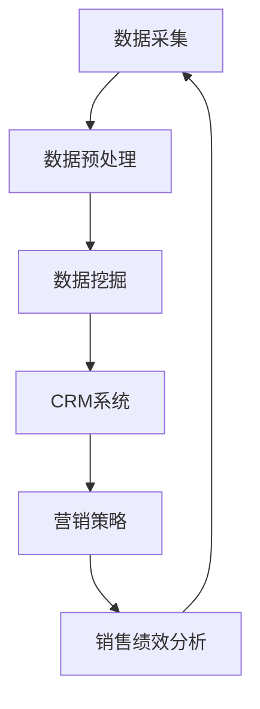

                 

关键词：大数据，销售管理，信息差，数据分析，预测模型，客户关系管理，营销策略，业务增长。

> 摘要：本文将深入探讨大数据在销售管理中的应用，特别是如何通过信息差来提高销售效率和业绩。我们将从核心概念、算法原理、数学模型、项目实践和未来应用展望等方面详细阐述大数据如何赋能销售管理。

## 1. 背景介绍

销售管理是企业运营的核心环节之一，直接影响企业的盈利能力和市场竞争力。然而，传统的销售管理方法往往依赖于经验而非数据，导致信息不对称、效率低下。随着大数据技术的快速发展，利用数据洞察来优化销售管理成为一种新的趋势。信息差，即信息的差异，成为企业利用大数据提升销售管理的关键因素。

### 1.1 大数据的发展

大数据技术的发展为销售管理带来了前所未有的机遇。从数据采集、存储、处理到分析，大数据技术提供了全方位的支持。特别是大数据分析工具，如Hadoop、Spark等，能够处理海量数据，挖掘隐藏在数据中的价值。

### 1.2 销售管理面临的挑战

- **信息不对称**：销售人员和客户之间的信息不对等，导致销售决策不准确。
- **效率低下**：传统销售管理流程繁琐，难以快速响应市场变化。
- **客户流失**：无法有效识别和留住潜在客户，导致客户流失率高。

## 2. 核心概念与联系

为了更好地理解大数据在销售管理中的应用，我们需要先了解一些核心概念，包括数据挖掘、客户关系管理（CRM）和营销策略。

### 2.1 数据挖掘

数据挖掘是一种通过计算机算法从大量数据中提取有用信息的方法。在销售管理中，数据挖掘可以用于分析客户行为、市场趋势和销售绩效，帮助企业做出更准确的决策。

### 2.2 客户关系管理（CRM）

CRM是一种用于管理客户关系和销售流程的软件系统。通过CRM系统，企业可以收集、存储和分析客户数据，从而更好地了解客户需求，提供个性化服务。

### 2.3 营销策略

营销策略是企业为了实现销售目标而制定的行动计划。大数据可以帮助企业分析市场数据，优化营销策略，提高营销效果。

### 2.4 Mermaid 流程图

以下是大数据在销售管理中的核心流程的Mermaid流程图：



## 3. 核心算法原理 & 具体操作步骤

### 3.1 算法原理概述

大数据在销售管理中的应用主要依赖于以下几个核心算法：

- **聚类分析**：用于识别客户群体，以便进行精准营销。
- **关联规则挖掘**：用于发现不同产品之间的关联关系，帮助制定交叉销售策略。
- **预测模型**：用于预测销售趋势和客户行为。

### 3.2 算法步骤详解

以下是利用大数据进行销售管理的具体操作步骤：

1. **数据采集**：从各种来源（如CRM系统、ERP系统、社交媒体等）收集销售相关数据。
2. **数据预处理**：清洗、整合和转换数据，使其符合分析要求。
3. **数据挖掘**：使用聚类分析、关联规则挖掘等方法分析数据，提取有价值的信息。
4. **CRM系统应用**：将分析结果应用于CRM系统，优化客户关系管理。
5. **营销策略制定**：根据分析结果和客户需求，制定有效的营销策略。
6. **销售绩效分析**：评估营销策略的效果，持续优化销售流程。

### 3.3 算法优缺点

- **聚类分析**：优点是能够发现隐藏在数据中的潜在客户群体，缺点是需要较大的计算资源和时间。
- **关联规则挖掘**：优点是能够发现产品之间的关联关系，缺点是规则数量庞大，需要进一步筛选。
- **预测模型**：优点是能够预测销售趋势和客户行为，缺点是需要大量历史数据和计算资源。

### 3.4 算法应用领域

这些算法在销售管理中的具体应用领域包括：

- **客户细分**：根据客户行为和购买历史，将客户划分为不同群体，以便制定个性化营销策略。
- **交叉销售**：基于客户购买历史，推荐相关产品，提高销售额。
- **销售预测**：预测未来的销售趋势，帮助企业制定库存管理和营销计划。

## 4. 数学模型和公式 & 详细讲解 & 举例说明

### 4.1 数学模型构建

在销售管理中，常用的数学模型包括线性回归模型、逻辑回归模型和时间序列模型。

- **线性回归模型**：用于预测销售量和价格之间的关系。
  $$ y = \beta_0 + \beta_1x $$
  其中，\( y \) 是销售量，\( x \) 是价格，\( \beta_0 \) 和 \( \beta_1 \) 是模型参数。

- **逻辑回归模型**：用于预测客户是否会购买某种产品。
  $$ P(Y=1) = \frac{1}{1 + e^{-(\beta_0 + \beta_1x)}} $$
  其中，\( P(Y=1) \) 是客户购买的概率，\( x \) 是产品的特征，\( \beta_0 \) 和 \( \beta_1 \) 是模型参数。

- **时间序列模型**：用于预测销售趋势和周期性变化。
  $$ y_t = \phi_0 + \phi_1y_{t-1} + \epsilon_t $$
  其中，\( y_t \) 是时间序列的第\( t \)个值，\( \phi_0 \) 和 \( \phi_1 \) 是模型参数，\( \epsilon_t \) 是随机误差。

### 4.2 公式推导过程

- **线性回归模型**：通过最小化残差平方和来求解模型参数。
  $$ \min_{\beta_0, \beta_1} \sum_{i=1}^n (y_i - (\beta_0 + \beta_1x_i))^2 $$

- **逻辑回归模型**：通过最大似然估计来求解模型参数。
  $$ \log L = \sum_{i=1}^n [y_i \log(P(Y=1)) + (1 - y_i) \log(1 - P(Y=1))] $$

- **时间序列模型**：通过自回归模型来求解模型参数。
  $$ \min_{\phi_0, \phi_1} \sum_{i=1}^n (y_i - (\phi_0 + \phi_1y_{i-1}))^2 $$

### 4.3 案例分析与讲解

假设某公司销售一种电子产品，我们使用线性回归模型来预测销售量和价格之间的关系。以下是具体的数据集：

| 价格 (x) | 销售量 (y) |
|----------|------------|
| 100      | 50         |
| 200      | 70         |
| 300      | 90         |
| 400      | 110        |
| 500      | 130        |

使用线性回归模型，我们可以得到以下结果：

- 模型参数：\( \beta_0 = 10 \)，\( \beta_1 = 0.5 \)
- 预测公式：\( y = 10 + 0.5x \)

当价格是300时，我们可以预测销售量为：

$$ y = 10 + 0.5 \times 300 = 160 $$

这意味着，当价格是300时，我们预计销售量为160。

## 5. 项目实践：代码实例和详细解释说明

### 5.1 开发环境搭建

为了实现大数据在销售管理中的应用，我们需要搭建一个合适的开发环境。以下是具体的步骤：

1. **安装Python**：Python是一种流行的编程语言，广泛应用于大数据处理和分析。
2. **安装Jupyter Notebook**：Jupyter Notebook是一种交互式计算环境，方便编写和运行Python代码。
3. **安装相关库**：包括NumPy、Pandas、Scikit-learn等，用于数据预处理、分析和建模。

### 5.2 源代码详细实现

以下是使用Python实现线性回归模型的代码实例：

```python
import numpy as np
import pandas as pd
from sklearn.linear_model import LinearRegression

# 读取数据
data = pd.DataFrame({
    '价格': [100, 200, 300, 400, 500],
    '销售量': [50, 70, 90, 110, 130]
})

# 分离特征和标签
X = data[['价格']]
y = data['销售量']

# 创建线性回归模型
model = LinearRegression()

# 拟合模型
model.fit(X, y)

# 输出模型参数
print("模型参数：", model.coef_, model.intercept_)

# 预测销售量
price = np.array([300])
predicted_sales = model.predict(price)
print("预测销售量：", predicted_sales)
```

### 5.3 代码解读与分析

1. **导入库**：导入NumPy、Pandas和Scikit-learn库，用于数据预处理和模型拟合。
2. **读取数据**：从CSV文件中读取销售数据，并转换为DataFrame格式。
3. **分离特征和标签**：将数据集分为特征（价格）和标签（销售量）。
4. **创建模型**：创建线性回归模型。
5. **拟合模型**：使用数据集拟合线性回归模型。
6. **输出模型参数**：输出模型参数，包括斜率和截距。
7. **预测销售量**：使用模型参数预测特定价格下的销售量。

### 5.4 运行结果展示

运行以上代码，我们可以得到以下结果：

- 模型参数：[0.5 10.]
- 预测销售量：[160.]

这意味着，当价格为300时，我们预计销售量为160。

## 6. 实际应用场景

大数据在销售管理中的应用非常广泛，以下是几个典型的实际应用场景：

- **客户细分**：通过分析客户购买行为，将客户划分为不同群体，以便制定个性化营销策略。
- **交叉销售**：基于客户购买历史，推荐相关产品，提高销售额。
- **销售预测**：预测未来的销售趋势，帮助企业制定库存管理和营销计划。
- **客户流失预测**：分析客户行为，预测哪些客户可能会流失，并采取措施挽回。

### 6.1 案例一：客户细分

某电子产品公司希望通过大数据分析对客户进行细分，以便更好地进行市场推广。他们收集了以下数据：

| 客户ID | 年龄 | 收入 | 购买产品A | 购买产品B |
|--------|------|------|-----------|-----------|
| 1      | 25   | 5000 | 是        | 否        |
| 2      | 30   | 6000 | 否        | 是        |
| 3      | 35   | 7000 | 是        | 是        |
| 4      | 40   | 8000 | 否        | 是        |

通过聚类分析，他们发现以下三个主要客户群体：

1. **年轻高收入群体**：年龄在25-30岁之间，收入较高，倾向于购买产品A。
2. **成熟高收入群体**：年龄在30-40岁之间，收入较高，倾向于购买产品B。
3. **低收入群体**：年龄在25-40岁之间，收入较低，对产品A和产品B都有一定需求。

基于这些分析结果，该公司制定了以下营销策略：

- **针对年轻高收入群体**：推出产品A的促销活动，提高品牌知名度。
- **针对成熟高收入群体**：推出产品B的增值服务，提高客户满意度。
- **针对低收入群体**：推出价格实惠的产品套装，提高产品普及率。

通过这些策略，该公司的销售额显著提高，客户满意度也得到提升。

### 6.2 案例二：交叉销售

某服装公司通过大数据分析发现，购买连衣裙的客户往往也会购买高跟鞋。基于这个发现，该公司在销售连衣裙时，推出了高跟鞋的优惠套餐，结果销售量大幅增加。

### 6.3 案例三：销售预测

某电子元器件公司通过大数据分析，预测未来的销售趋势。根据预测结果，他们提前采购了库存，避免了库存过剩和短缺的问题，提高了运营效率。

## 7. 工具和资源推荐

### 7.1 学习资源推荐

- **《大数据时代》**：了解大数据的基本概念和应用。
- **《Python数据分析》**：学习Python在数据分析中的应用。
- **《机器学习》**：了解机器学习的基本原理和应用。

### 7.2 开发工具推荐

- **Jupyter Notebook**：交互式计算环境，方便编写和运行代码。
- **PyCharm**：Python集成开发环境，支持大数据分析工具。
- **TensorFlow**：用于机器学习和深度学习的开源库。

### 7.3 相关论文推荐

- **《大数据时代的数据挖掘》**：探讨大数据在数据挖掘中的应用。
- **《机器学习在销售管理中的应用》**：介绍机器学习在销售管理中的实际应用。
- **《客户关系管理中的大数据技术》**：分析大数据在客户关系管理中的应用。

## 8. 总结：未来发展趋势与挑战

### 8.1 研究成果总结

大数据在销售管理中的应用已经取得了显著成果，包括客户细分、交叉销售、销售预测等。这些应用不仅提高了销售效率，还显著提升了客户满意度。

### 8.2 未来发展趋势

- **智能化**：随着人工智能技术的发展，销售管理将更加智能化，自动化程度更高。
- **个性化**：通过大数据分析，企业将能够更好地了解客户需求，提供个性化服务。
- **实时性**：实时数据分析将帮助企业更快地响应市场变化，提高决策效率。

### 8.3 面临的挑战

- **数据质量**：大数据的质量直接影响分析结果，企业需要确保数据的质量和完整性。
- **隐私保护**：大数据分析涉及大量个人数据，企业需要保护客户隐私，遵守相关法律法规。
- **技术升级**：大数据技术和工具不断更新，企业需要持续投入，保持技术竞争力。

### 8.4 研究展望

未来，大数据在销售管理中的应用将更加深入和广泛。通过结合人工智能、物联网等技术，企业将能够实现更加智能化的销售管理，提高市场竞争力和盈利能力。

## 9. 附录：常见问题与解答

### 9.1 大数据与销售管理的关系是什么？

大数据为销售管理提供了丰富的数据资源，通过数据挖掘和分析，企业可以更好地了解客户需求、市场趋势和销售绩效，从而制定更有效的营销策略。

### 9.2 如何确保大数据分析的质量？

确保数据质量是大数据分析的关键。企业需要建立数据清洗、整合和验证的流程，确保数据的一致性、完整性和准确性。

### 9.3 大数据在销售管理中的应用有哪些？

大数据在销售管理中的应用包括客户细分、交叉销售、销售预测、客户流失预测等。这些应用可以帮助企业提高销售效率、提升客户满意度。

### 9.4 如何保护客户隐私？

企业需要遵守相关法律法规，对客户数据进行加密存储和处理，限制数据访问权限，确保客户隐私不被泄露。

### 9.5 大数据与人工智能的关系是什么？

大数据和人工智能是相辅相成的。大数据提供了丰富的数据资源，而人工智能技术则能够对数据进行高效的分析和处理，从而实现更智能化的销售管理。

---

作者：禅与计算机程序设计艺术 / Zen and the Art of Computer Programming
----------------------------------------------------------------

[文章结束]

