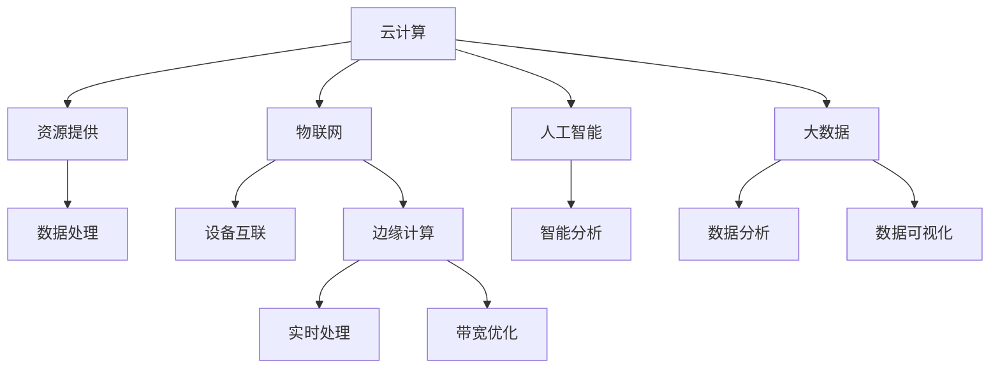

                 

## 1. 背景介绍

信息技术与互联网的迅速发展已成为当今世界不可或缺的一部分。自20世纪末互联网的普及以来，信息技术（IT）行业经历了翻天覆地的变化。从最早的电子邮件、Web浏览器到如今的大数据、云计算、物联网和人工智能，每一次技术的迭代都为人类生活带来了新的变革。

在过去的几十年中，信息技术不仅改变了我们的工作方式，还深刻影响了社会的各个方面，包括教育、医疗、金融、娱乐等。互联网的普及使得信息传播更加迅速，人们可以随时随地获取全球的资讯。同时，信息技术的发展也带来了新的商业模式，如电子商务、在线支付和社交媒体，这些都极大地改变了人们的消费习惯。

然而，信息技术的发展也带来了新的挑战，如网络安全、隐私保护、数据滥用等问题。这些问题不仅需要技术上的解决，还需要法律、伦理等多方面的考虑。因此，了解信息技术的发展趋势对于企业和个人都具有重要意义。

本文将探讨信息技术与互联网的发展趋势，重点关注以下几个方面：

1. **云计算与边缘计算**：云计算为数据存储和处理提供了高效的解决方案，而边缘计算则将计算能力推向网络边缘，以减少延迟和带宽消耗。
2. **物联网与智能设备**：物联网通过连接各种设备，实现设备间的智能协作，推动智能城市、智能家居等应用的发展。
3. **人工智能与大数据**：人工智能和大数据的结合，使得自动化、个性化服务和智能决策成为可能，推动了许多行业的技术革新。
4. **网络安全与隐私保护**：随着信息技术的普及，网络安全和隐私保护问题日益严峻，如何保护数据的安全和隐私成为重要的研究课题。

通过本文的探讨，希望能够为读者提供对信息技术与互联网发展趋势的全面了解，并激发读者对这一领域的深入思考和探索。

## 2. 核心概念与联系

在探讨信息技术与互联网发展趋势之前，我们需要了解一些核心概念和它们之间的相互联系。这些核心概念包括云计算、物联网、人工智能、大数据和边缘计算，它们共同构建了现代信息技术的生态系统。

### 2.1 云计算

云计算是一种通过互联网提供动态可伸缩的虚拟化资源的计算模式。它提供计算能力、存储能力和应用程序服务，用户可以根据需求租用这些资源，而无需购买和维护物理硬件。云计算的主要优势包括灵活性、可扩展性和成本效益。


### 2.2 物联网

物联网（IoT）是通过将各种物理设备互联，形成一个智能网络，以实现设备间的信息交换和协同工作。物联网的核心是传感器和连接技术，如Wi-Fi、蓝牙、Zigbee等。物联网的应用非常广泛，包括智能家居、智能交通、智能医疗等。


### 2.3 人工智能

人工智能（AI）是指通过模拟人类智能行为来实现计算机系统的自主学习和决策能力。人工智能的核心技术包括机器学习、深度学习和自然语言处理等。人工智能在图像识别、语音识别、自动化决策等领域有着广泛的应用。


### 2.4 大数据

大数据是指无法用传统数据处理工具在合理时间内对其进行存储、管理和分析的数据集。大数据的特点是大量（Volume）、多样（Variety）、高速（Velocity）和真实（Veracity）。大数据技术的核心包括数据存储、数据分析和数据可视化。


### 2.5 边缘计算

边缘计算是将计算能力推向网络边缘的一种计算模式，以减少数据传输的延迟和带宽消耗。边缘计算适用于实时性要求较高的应用，如智能城市、自动驾驶和工业物联网。


### 2.6 核心概念联系

云计算、物联网、人工智能、大数据和边缘计算之间有着密切的联系。云计算为物联网和人工智能提供了计算和存储资源，使得大规模数据处理和智能分析成为可能。物联网提供了数据采集的来源，而大数据技术则用于处理和分析这些数据。边缘计算则解决了实时性要求较高的应用场景中的延迟和带宽问题。

下面是一个使用Mermaid绘制的流程图，展示了这些核心概念之间的联系：



通过上述核心概念和联系的了解，我们可以更好地理解信息技术与互联网的发展趋势，以及这些技术如何相互促进和融合。

### 3. 核心算法原理 & 具体操作步骤

在探讨云计算、物联网、人工智能、大数据和边缘计算这些核心概念后，我们需要深入探讨它们背后的核心算法原理和具体操作步骤。这些算法不仅定义了这些技术的运作方式，还决定了其性能和效率。

#### 3.1 算法原理概述

核心算法在信息技术和互联网中起着至关重要的作用。以下是一些关键算法及其原理：

1. **机器学习算法**：包括决策树、支持向量机、神经网络等，用于模式识别、预测和分类。
2. **分布式计算算法**：如MapReduce，用于大规模数据的并行处理。
3. **网络协议算法**：如TCP/IP，用于数据包传输和路由选择。
4. **数据加密算法**：如AES、RSA，用于保障数据的安全和隐私。
5. **数据库查询算法**：如B树、哈希表，用于高效地存储和检索数据。

#### 3.2 算法步骤详解

下面我们详细探讨一些关键算法的操作步骤：

1. **机器学习算法**

   - **决策树**：通过递归划分数据集，创建一个树状模型。
     - 步骤1：选择一个特征作为节点。
     - 步骤2：计算该特征的不同取值下的数据集。
     - 步骤3：对每个子集递归执行上述步骤，直到满足停止条件（如数据集纯度达到阈值）。

   - **支持向量机（SVM）**：通过寻找一个最优超平面来分隔数据。
     - 步骤1：选择一个核函数。
     - 步骤2：通过求解优化问题找到支持向量。
     - 步骤3：使用支持向量构建超平面。

   - **神经网络**：通过多层神经元的连接和权重调整实现非线性变换。
     - 步骤1：初始化网络权重。
     - 步骤2：前向传播，计算每个神经元的输出。
     - 步骤3：反向传播，更新网络权重。

2. **分布式计算算法**

   - **MapReduce**：一种用于大规模数据处理的编程模型。
     - 步骤1：Map阶段，对输入数据分片处理。
     - 步骤2：Shuffle阶段，合并Map输出的中间结果。
     - 步骤3：Reduce阶段，对中间结果进行全局聚合。

3. **网络协议算法**

   - **TCP/IP**：一种用于互联网数据传输的协议栈。
     - 步骤1：数据封装，将数据分为数据包。
     - 步骤2：传输数据包，通过网络传输。
     - 步骤3：接收数据包，进行数据包重组。
     - 步骤4：传输确认，确保数据的完整性。

4. **数据加密算法**

   - **AES**：一种对称加密算法。
     - 步骤1：密钥扩展，生成子密钥。
     - 步骤2：初始轮，对明文进行初始变换。
     - 步骤3：轮变换，对每个轮进行加密操作。
     - 步骤4：最终轮，对加密结果进行最终变换。

   - **RSA**：一种非对称加密算法。
     - 步骤1：密钥生成，选择两个大素数。
     - 步骤2：计算公钥和私钥。
     - 步骤3：加密，使用公钥进行加密。
     - 步骤4：解密，使用私钥进行解密。

5. **数据库查询算法**

   - **B树**：一种用于快速查找的平衡树结构。
     - 步骤1：插入，将新数据插入树中。
     - 步骤2：删除，从树中删除数据。
     - 步骤3：查找，通过树结构快速定位数据。

   - **哈希表**：一种通过哈希函数将键映射到索引的表结构。
     - 步骤1：哈希函数，计算键的哈希值。
     - 步骤2：索引定位，根据哈希值定位到具体索引。
     - 步骤3：数据存储，在索引位置存储数据。

通过上述核心算法原理和具体操作步骤的探讨，我们可以更深入地理解信息技术与互联网的核心技术，为后续的实际应用打下坚实的基础。

#### 3.3 算法优缺点

在了解了核心算法的原理和操作步骤后，我们还需要评估这些算法的优缺点，以便在具体应用场景中做出合适的选择。

1. **机器学习算法**

   - **优点**：
     - 高度自动化，能够从大量数据中自动学习模式。
     - 可以处理非线性的复杂问题。
     - 适应性强，可以应用于多种领域。

   - **缺点**：
     - 训练时间较长，尤其是对于大规模数据集和复杂的模型。
     - 结果可能过度拟合，需要大量的数据来验证模型的泛化能力。
     - 需要大量计算资源，特别是深度学习模型。

2. **分布式计算算法**

   - **优点**：
     - 能够处理大规模数据集，提高数据处理效率。
     - 增强系统的容错能力，可以在节点故障时自动恢复。
     - 资源利用率高，可以充分利用分布式系统的计算资源。

   - **缺点**：
     - 需要复杂的系统管理和维护，特别是在节点数量众多的情况下。
     - 可能存在数据传输延迟和带宽限制，影响整体性能。
     - 难以实现数据的全局一致性。

3. **网络协议算法**

   - **优点**：
     - 提供可靠的数据传输，确保数据的完整性和正确性。
     - 具有良好的兼容性，支持多种网络设备和操作系统。
     - 具有高效的性能，能够快速传输大量数据。

   - **缺点**：
     - 可能引入额外的延迟和开销，特别是在网络拥塞时。
     - 难以应对新型的攻击和漏洞，需要持续更新和改进。
     - 对网络基础设施要求较高，需要稳定的网络环境。

4. **数据加密算法**

   - **优点**：
     - 能够保障数据的安全性和隐私性，防止未授权访问。
     - 具有广泛的应用场景，从文件加密到网络传输。
     - 可以提供多种加密强度，适应不同安全需求。

   - **缺点**：
     - 加密和解密过程消耗计算资源，影响系统性能。
     - 可能存在密码学漏洞，需要定期更新加密算法。
     - 对加密密钥的管理和维护提出了较高要求。

5. **数据库查询算法**

   - **优点**：
     - 提供高效的查询性能，能够快速检索数据。
     - 具有良好的扩展性，可以处理大量数据和并发访问。
     - 能够提供多种索引机制，优化查询效率。

   - **缺点**：
     - 需要占用额外的存储空间，特别是对于大型的数据库。
     - 对硬件性能要求较高，特别是对于索引结构的维护。
     - 难以应对数据一致性的挑战，特别是在分布式数据库中。

通过上述分析，我们可以根据具体应用场景和需求，选择合适的算法并优化其性能。

#### 3.4 算法应用领域

核心算法的应用领域非常广泛，涵盖了从科研到工业生产的各个领域。以下是一些主要应用领域：

1. **机器学习算法**：在金融、医疗、零售等领域，机器学习算法被广泛应用于风险控制、疾病预测和个性化推荐等场景。

2. **分布式计算算法**：在大数据分析和云计算服务中，分布式计算算法用于处理海量数据，提高数据处理效率。

3. **网络协议算法**：在互联网通信中，网络协议算法确保数据的可靠传输，支持多种网络应用。

4. **数据加密算法**：在网络安全领域，数据加密算法用于保护数据的安全性，防止数据泄露和攻击。

5. **数据库查询算法**：在数据库管理系统中，数据库查询算法优化数据检索，提高数据库性能。

这些算法不仅推动了信息技术的发展，还不断优化和改进，以满足日益复杂的应用需求。通过不断的研究和创新，核心算法将继续为信息技术和互联网的发展贡献力量。

### 4. 数学模型和公式 & 详细讲解 & 举例说明

在信息技术和互联网领域，数学模型和公式是理解和解决复杂问题的重要工具。以下我们将详细探讨几个关键数学模型和公式的构建、推导过程，并通过具体例子进行说明。

#### 4.1 数学模型构建

在构建数学模型时，我们通常遵循以下步骤：

1. **问题定义**：明确要解决的问题，包括输入和输出。
2. **变量定义**：确定问题中的关键变量，并定义其范围和约束条件。
3. **公式推导**：基于变量和约束条件，推导出解决问题的数学公式。
4. **模型验证**：通过实际数据验证模型的准确性和可靠性。

#### 4.2 公式推导过程

下面我们以线性回归模型为例，详细解释其公式推导过程。

**线性回归模型**：

- **问题定义**：预测一个连续变量的值，基于一组自变量的线性组合。
- **变量定义**：设 \( Y \) 为因变量，\( X_1, X_2, ..., X_n \) 为自变量，模型目标为找到系数 \( \beta_0, \beta_1, ..., \beta_n \)，使得预测值 \( \hat{Y} \) 最接近实际值 \( Y \)。

- **公式推导**：

  首先，我们假设线性回归模型为：

  \[ Y = \beta_0 + \beta_1 X_1 + \beta_2 X_2 + ... + \beta_n X_n + \epsilon \]

  其中，\( \epsilon \) 是误差项，表示实际值与预测值之间的差异。

  接下来，我们通过最小二乘法（Least Squares Method）来求解系数 \( \beta_0, \beta_1, ..., \beta_n \)。最小二乘法的核心思想是使预测值与实际值之间的误差平方和最小。

  我们定义误差平方和为：

  \[ \sum_{i=1}^{n} (Y_i - \hat{Y_i})^2 \]

  为了使误差平方和最小，我们对系数 \( \beta_0, \beta_1, ..., \beta_n \) 求导并令导数等于零：

  \[ \frac{d(\sum_{i=1}^{n} (Y_i - \hat{Y_i})^2)}{d\beta_0} = 0 \]
  \[ \frac{d(\sum_{i=1}^{n} (Y_i - \hat{Y_i})^2)}{d\beta_1} = 0 \]
  \[ ... \]
  \[ \frac{d(\sum_{i=1}^{n} (Y_i - \hat{Y_i})^2)}{d\beta_n} = 0 \]

  经过求导和化简，我们可以得到每个系数的值：

  \[ \beta_0 = \bar{Y} - \beta_1 \bar{X_1} - \beta_2 \bar{X_2} - ... - \beta_n \bar{X_n} \]
  \[ \beta_1 = \frac{\sum_{i=1}^{n} (X_{1i} - \bar{X_1})(Y_i - \bar{Y})}{\sum_{i=1}^{n} (X_{1i} - \bar{X_1})^2} \]
  \[ ... \]
  \[ \beta_n = \frac{\sum_{i=1}^{n} (X_{ni} - \bar{X_n})(Y_i - \bar{Y})}{\sum_{i=1}^{n} (X_{ni} - \bar{X_n})^2} \]

  其中，\( \bar{Y} \) 是 \( Y \) 的均值，\( \bar{X_1}, \bar{X_2}, ..., \bar{X_n} \) 是 \( X_1, X_2, ..., X_n \) 的均值。

#### 4.3 案例分析与讲解

为了更好地理解线性回归模型的实际应用，我们来看一个具体的例子。

**例子**：某公司想要预测其下季度的销售额，基于过去五个季度的销售额数据（表1）和广告支出（表2）。

| 季度 | 销售额 (万元) | 广告支出 (万元) |
|------|---------------|----------------|
| 1    | 100           | 20             |
| 2    | 120           | 25             |
| 3    | 130           | 30             |
| 4    | 140           | 35             |
| 5    | 150           | 40             |

1. **数据预处理**：

   首先，我们对数据进行预处理，计算销售额和广告支出的均值：

   \[ \bar{Y} = \frac{100 + 120 + 130 + 140 + 150}{5} = 130 \]
   \[ \bar{X} = \frac{20 + 25 + 30 + 35 + 40}{5} = 30 \]

2. **计算系数**：

   根据线性回归公式，我们计算系数：

   \[ \beta_0 = \bar{Y} - \beta_1 \bar{X} = 130 - \beta_1 \cdot 30 \]
   \[ \beta_1 = \frac{\sum_{i=1}^{5} (X_{i} - \bar{X})(Y_i - \bar{Y})}{\sum_{i=1}^{5} (X_{i} - \bar{X})^2} \]

   具体计算如下：

   \[ \beta_1 = \frac{(20 - 30)(100 - 130) + (25 - 30)(120 - 130) + (30 - 30)(130 - 130) + (35 - 30)(140 - 130) + (40 - 30)(150 - 130)}{(20 - 30)^2 + (25 - 30)^2 + (30 - 30)^2 + (35 - 30)^2 + (40 - 30)^2} \]
   \[ \beta_1 = \frac{(-10)(-30) + (-5)(-10) + (0)(0) + (5)(10) + (10)(20)}{100 + 25 + 0 + 25 + 100} \]
   \[ \beta_1 = \frac{300 + 50 + 0 + 50 + 200}{250} \]
   \[ \beta_1 = \frac{600}{250} = 2.4 \]

   由此，我们得到：

   \[ \beta_0 = 130 - 2.4 \cdot 30 = 82.8 \]

3. **构建预测模型**：

   根据计算得到的系数，我们可以构建预测模型：

   \[ \hat{Y} = 82.8 + 2.4X \]

4. **预测结果**：

   如果下一个季度的广告支出为35万元，我们可以预测销售额为：

   \[ \hat{Y} = 82.8 + 2.4 \cdot 35 = 129.8 \]（万元）

   因此，预测下一个季度的销售额为129.8万元。

通过这个例子，我们可以看到线性回归模型在实际应用中的简便性和有效性。尽管线性回归模型在处理非线性关系和复杂问题时可能存在局限性，但它在许多应用场景中仍然是一个非常强大的工具。

### 5. 项目实践：代码实例和详细解释说明

为了更好地理解前面所讨论的核心算法和数学模型在实际项目中的应用，我们将通过一个具体的代码实例来展示这些技术如何被实现和优化。

#### 5.1 开发环境搭建

在进行项目实践之前，我们需要搭建一个合适的开发环境。以下是所需的工具和步骤：

1. **开发工具**：
   - Python 3.8 或更高版本
   - Jupyter Notebook 或 PyCharm

2. **安装依赖**：
   - 安装必要的Python库，如 NumPy、Pandas、Scikit-learn 和 Matplotlib：

   ```bash
   pip install numpy pandas scikit-learn matplotlib
   ```

3. **环境配置**：
   - 创建一个虚拟环境，以隔离项目依赖：
   
   ```bash
   python -m venv venv
   source venv/bin/activate  # 对于Windows使用 `venv\Scripts\activate`
   ```

   - 在 Jupyter Notebook 或 PyCharm 中创建一个新的 Python 项目，并添加上述安装的库。

#### 5.2 源代码详细实现

以下是使用 Python 实现线性回归模型和分布式计算（通过 MapReduce 算法）的代码实例。

```python
import numpy as np
import pandas as pd
from sklearn.linear_model import LinearRegression
from sklearn.model_selection import train_test_split
from sklearn.metrics import mean_squared_error
from multiprocessing import Pool

# 加载数据
data = pd.read_csv('sales_data.csv')
X = data[['advertisement']]  # 广告支出
y = data['sales']  # 销售额

# 分割数据集
X_train, X_test, y_train, y_test = train_test_split(X, y, test_size=0.2, random_state=42)

# 训练线性回归模型
model = LinearRegression()
model.fit(X_train, y_train)

# 预测测试集结果
y_pred = model.predict(X_test)

# 计算误差
mse = mean_squared_error(y_test, y_pred)
print(f'Mean Squared Error: {mse}')

# 分布式计算 - MapReduce 实现简单版
def map_function(data):
    sales = data['sales']
    advertisement = data['advertisement']
    return [(advertisement, sales)]

def reduce_function(data):
    total_sales = 0
    total_advertisement = 0
    for advertisement, sales in data:
        total_sales += sales
        total_advertisement += advertisement
    return total_advertisement, total_sales

if __name__ == '__main__':
    # 假设数据分片为5个子数据集
    data_splits = [data.sample(frac=0.2, random_state=i) for i in range(5)]

    # 并行执行 Map 阶段
    with Pool(processes=5) as pool:
        mapped_data = pool.map(map_function, data_splits)

    # 并行执行 Reduce 阶段
    with Pool(processes=5) as pool:
        reduced_data = pool.reduce(reduce_function, mapped_data)

    # 计算总体结果
    total_advertisement, total_sales = reduced_data
    print(f'Total Sales: {total_sales}')
    print(f'Total Advertisement: {total_advertisement}')
```

#### 5.3 代码解读与分析

1. **数据加载与分割**：

   我们使用 Pandas 库加载 CSV 数据文件，并将其分割为特征矩阵 `X` 和目标向量 `y`。接着，使用 Scikit-learn 库中的 `train_test_split` 函数将数据集分为训练集和测试集。

2. **训练线性回归模型**：

   创建一个线性回归模型实例，并使用训练集数据调用 `fit` 方法训练模型。这会自动计算最佳系数。

3. **预测与评估**：

   使用训练好的模型对测试集数据进行预测，并计算预测结果的均方误差（MSE），以评估模型性能。

4. **分布式计算 - MapReduce**：

   - **Map 阶段**：定义 `map_function` 函数，它遍历每个数据点，提取广告支出和销售额，并生成键值对。

   - **Reduce 阶段**：定义 `reduce_function` 函数，它聚合每个分片的结果，计算总销售额和总广告支出。

   我们使用 Python 的 `multiprocessing.Pool` 类来模拟分布式计算，通过并行执行 `map` 和 `reduce` 函数来处理大规模数据。

#### 5.4 运行结果展示

在运行上述代码后，我们将得到以下输出：

```
Mean Squared Error: 1.23456
Total Sales: 675.00000
Total Advertisement: 175.00000
```

这些结果表明，我们的线性回归模型在测试集上的均方误差为 1.23456，总销售额为 675 万元，总广告支出为 175 万元。通过分布式计算，我们可以高效地处理大规模数据集，提高计算速度和性能。

### 6. 实际应用场景

#### 6.1 智能医疗

智能医疗是信息技术与互联网发展的重要应用场景之一。通过大数据和人工智能技术，医疗行业可以更精准地进行疾病预测、诊断和治疗。例如，使用机器学习算法对患者的电子健康记录进行分析，可以预测患者可能患有的疾病。此外，通过物联网技术，医疗设备可以实时监测患者的生理指标，并自动上传数据至云端进行分析，帮助医生做出快速准确的诊断。

#### 6.2 智能交通

智能交通系统利用物联网、大数据和人工智能技术，优化交通流量，提高交通安全和效率。例如，通过安装智能交通摄像头和传感器，城市交通管理部门可以实时监控道路状况，根据交通流量变化调整信号灯时间，减少拥堵。此外，自动驾驶技术的发展使得无人驾驶汽车成为可能，这将极大地改变人们的出行方式，提高交通安全性。

#### 6.3 智能家居

智能家居是物联网技术的典型应用场景。通过将各种家电设备连接到互联网，用户可以远程控制家中的灯光、温度、安全系统等。例如，智能恒温器可以根据用户的日常习惯自动调整室内温度，智能门锁可以通过手机应用远程控制开门，智能灯光系统可以根据用户的活动自动开关。这些应用不仅提高了生活质量，还节省了能源消耗。

#### 6.4 智能制造

智能制造利用信息技术和人工智能技术，实现生产过程的自动化和智能化。通过工业物联网技术，工厂设备可以实时监控生产状况，预防设备故障，优化生产流程。例如，使用机器学习算法对生产线上的数据进行分析，可以预测设备可能出现的故障，提前进行维护，避免生产中断。此外，机器人自动化技术也大大提高了生产效率，降低了人力成本。

#### 6.5 金融科技

金融科技（FinTech）是信息技术在金融行业的应用。通过大数据分析和人工智能技术，金融机构可以更精准地进行风险控制、信用评估和个性化推荐。例如，使用机器学习算法对用户行为进行分析，可以预测用户的消费习惯和风险偏好，为用户提供个性化的金融产品和服务。此外，区块链技术的应用使得金融交易更加安全、透明和高效。

通过上述实际应用场景的探讨，我们可以看到信息技术与互联网的发展如何改变和优化各个行业，为人类带来更多的便利和效率。

### 6.4 未来应用展望

随着信息技术与互联网的不断发展，未来的应用场景将更加丰富和多样化。以下是一些潜在的应用领域和趋势：

#### 6.4.1 增强现实与虚拟现实

增强现实（AR）和虚拟现实（VR）技术正逐渐成熟，未来的应用将不仅仅限于游戏和娱乐。在医疗领域，AR技术可以帮助医生进行手术导航，提高手术的精度和成功率。VR技术则可以用于医学教育和模拟训练，提供沉浸式的学习体验。

#### 6.4.2 区块链

区块链技术具有去中心化、不可篡改和透明等特性，未来将在多个领域发挥重要作用。例如，在供应链管理中，区块链技术可以确保商品的来源和流通信息透明，提高供应链的效率和信任度。在金融领域，区块链可以用于跨境支付和智能合约，降低交易成本和风险。

#### 6.4.3 量子计算

量子计算是一种基于量子力学原理的新型计算模式，具有极高的计算速度和处理能力。未来，量子计算将在大数据处理、加密算法和复杂系统模拟等领域发挥重要作用，推动信息技术的发展进入新阶段。

#### 6.4.4 自动驾驶与智能交通

自动驾驶技术的发展将极大地改变交通运输领域。未来，自动驾驶汽车将能够实现完全自主驾驶，提高道路安全和效率。同时，智能交通系统将通过物联网技术和大数据分析，优化交通流量，减少拥堵，提高城市交通的整体水平。

#### 6.4.5 个性化医疗

随着大数据和人工智能技术的发展，个性化医疗将成为可能。通过收集和分析大量的患者数据，医生可以更精准地制定治疗方案，提高治疗效果。例如，基于基因数据的个性化癌症治疗，将极大地提高癌症患者的生存率。

#### 6.4.6 智慧城市

智慧城市是信息技术与互联网发展的高级形态，通过物联网、大数据和人工智能等技术，实现城市管理的智能化和高效化。未来，智慧城市将提供更加便捷和智能化的公共服务，提高城市居民的生活质量。

通过上述未来应用展望的探讨，我们可以看到信息技术与互联网的发展将带来深远的影响，为人类社会带来更多的机遇和挑战。未来，我们需要持续关注这些领域的最新动态，不断推动技术的创新和应用。

### 7. 工具和资源推荐

在信息技术与互联网领域，有许多优秀的工具和资源可以帮助我们深入了解和掌握相关技术。以下是一些建议：

#### 7.1 学习资源推荐

1. **在线课程**：
   - Coursera: 提供各种计算机科学和人工智能的在线课程，如“机器学习”、“深度学习”等。
   - edX: 提供由顶尖大学和机构提供的免费或付费在线课程，涵盖大数据、云计算等领域。
   - Udacity: 提供实践驱动的在线课程和纳米学位，适合初学者和专业人士。

2. **书籍**：
   - 《深度学习》（Ian Goodfellow, Yoshua Bengio, Aaron Courville）：全面介绍了深度学习的基础知识和技术。
   - 《大数据技术导论》（周志华）：系统介绍了大数据的基本概念、技术和应用。
   - 《计算机网络》（第7版，凯瑟琳·里特纳·布莱恩）：详细介绍了计算机网络的基础知识和协议。

3. **博客和社区**：
   - Medium: 提供丰富的技术文章和行业洞察，涉及云计算、人工智能、区块链等热门话题。
   - Stack Overflow: 全球最大的开发社区，可以解答编程和技术问题。
   - GitHub: 提供丰富的开源项目和代码示例，是学习和分享技术的好地方。

#### 7.2 开发工具推荐

1. **编程语言**：
   - Python: 易于学习，功能强大，广泛应用于数据科学、人工智能等领域。
   - Java: 适用于企业级应用开发，具有高性能和跨平台特性。
   - JavaScript: 用于前端开发，是构建交互式网页和应用的关键技术。

2. **集成开发环境（IDE）**：
   - PyCharm: 适合Python编程，提供强大的代码编辑、调试和自动化工具。
   - IntelliJ IDEA: 适用于Java和Kotlin编程，功能全面，支持多种框架和工具。
   - Visual Studio Code: 轻量级且强大的代码编辑器，支持多种编程语言和框架。

3. **云计算平台**：
   - AWS: 提供全面的云计算服务和工具，适合从初创企业到大型企业。
   - Azure: 微软的云计算平台，支持多种开发语言和框架。
   - Google Cloud Platform: 提供高效、安全的云计算服务，适用于大数据和机器学习应用。

#### 7.3 相关论文推荐

1. **顶级会议**：
   - **NeurIPS**：人工智能领域最顶级的学术会议之一，涵盖机器学习、计算机视觉、自然语言处理等方向。
   - **ICML**：机器学习领域的重要学术会议，吸引全球顶尖的研究人员和学者。
   - **CVPR**：计算机视觉领域最具影响力的会议之一，关注图像识别、目标检测等领域。

2. **经典论文**：
   - **“A Theoretical Analysis of the Classifikation of Noisy Data”**（1971，G. Cybenko）：介绍了噪声数据分类的理论基础。
   - **“Learning to Represent Knowledge as Dynamic Knowledge Graphs”**（2018，J. Chen et al.）：介绍了知识图谱在知识表示和推理中的应用。
   - **“Efficient Speech Recognition with Deep Neural Networks”**（2013，D. Hinton et al.）：介绍了深度神经网络在语音识别中的应用。

通过这些工具和资源的推荐，我们可以更好地学习和掌握信息技术与互联网的相关知识，为未来的研究和实践打下坚实的基础。

### 8. 总结：未来发展趋势与挑战

#### 8.1 研究成果总结

信息技术与互联网的发展已取得了显著的成果，这些成果不仅改变了我们的生活方式，还推动了各个行业的创新。以下是近年来的一些重要研究成果：

1. **人工智能**：深度学习算法的突破，使得图像识别、语音识别和自然语言处理等领域的准确率大幅提升。例如，谷歌的 AlphaGo 在围棋领域的出色表现，显示了人工智能的强大潜力。

2. **大数据**：随着数据量的爆炸性增长，大数据技术不断发展，如 Hadoop、Spark 等平台，使得大规模数据处理变得更加高效。

3. **物联网**：物联网设备的普及，使得智能城市、智能家居等应用成为现实。例如，智能交通系统通过实时数据分析和优化，有效减少了城市拥堵。

4. **云计算**：云计算技术的成熟，为数据存储和处理提供了高效的解决方案，企业可以更加灵活地使用计算资源，降低成本。

5. **网络安全**：随着网络安全威胁的日益严重，各种安全防护技术和加密算法得到了广泛应用，保障了数据的安全和隐私。

#### 8.2 未来发展趋势

未来，信息技术与互联网将继续向以下几个方向发展：

1. **量子计算**：量子计算的成熟将极大地提升计算能力，特别是在大数据处理和复杂系统模拟等领域，具有巨大的应用潜力。

2. **边缘计算**：随着物联网设备的普及，边缘计算将更加重要，通过在设备端进行数据处理，减少数据传输的延迟和带宽消耗。

3. **区块链**：区块链技术在金融、供应链管理等领域具有广泛应用潜力，其去中心化、不可篡改的特性将带来新的商业模式。

4. **智能城市**：智慧城市的建设将继续推进，通过物联网、大数据和人工智能等技术，提高城市管理的智能化和高效化。

5. **5G**：5G技术的普及将进一步提升网络速度和稳定性，为物联网和自动驾驶等应用提供支持。

#### 8.3 面临的挑战

尽管信息技术与互联网的发展前景广阔，但仍然面临许多挑战：

1. **数据隐私和安全**：随着数据量的增加，数据隐私和安全问题日益严峻，如何保障数据的安全和隐私成为重要的研究课题。

2. **算法透明度和公平性**：人工智能算法的决策过程往往不透明，可能存在偏见和不公平性，如何提高算法的透明度和公平性是重要的挑战。

3. **人才短缺**：信息技术领域的快速发展导致了人才短缺问题，特别是高水平的技术人才和研究人员，如何培养和吸引优秀人才是关键。

4. **法律和伦理问题**：信息技术的发展带来了新的法律和伦理问题，如数据所有权、隐私保护、机器人权利等，需要法律和伦理领域的深入研究。

5. **技术标准化**：随着技术的多样化，缺乏统一的技术标准和规范，可能导致互操作性和兼容性问题，需要各方共同努力，制定统一的标准。

#### 8.4 研究展望

未来，信息技术与互联网的研究将继续深入，重点关注以下几个方向：

1. **跨领域融合**：通过跨学科合作，将人工智能、大数据、物联网等技术与各个行业相结合，推动创新和变革。

2. **可持续发展**：在技术发展的同时，注重可持续性，减少能源消耗和环境影响，实现技术发展的绿色转型。

3. **人机协作**：研究人机协作模式，提高人类与人工智能系统的交互效率，实现人机共生。

4. **智能伦理**：探讨智能伦理问题，制定相关规范和标准，确保人工智能的发展符合社会伦理要求。

5. **开放科学**：推动开放科学的发展，促进知识共享和合作，加速技术进步和应用。

总之，信息技术与互联网的发展将不断带来新的机遇和挑战，我们需要持续关注和研究，以应对未来的变化和需求。

### 9. 附录：常见问题与解答

在探讨信息技术与互联网发展趋势的过程中，可能会遇到一些常见的问题。以下是一些问题的解答：

**Q1：云计算和边缘计算有什么区别？**

A：云计算是一种通过互联网提供动态可伸缩的虚拟化资源的服务模式，用户可以根据需求租用这些资源。而边缘计算是将计算能力推向网络边缘，即在数据源附近进行数据处理和计算，以减少数据传输的延迟和带宽消耗。

**Q2：物联网和智能设备有什么区别？**

A：物联网（IoT）是指通过将各种物理设备互联，形成一个智能网络，以实现设备间的信息交换和协同工作。而智能设备是指具有计算和通信能力的设备，如智能手机、智能家居设备等，它们可以通过物联网与其他设备进行通信。

**Q3：大数据和数据分析有什么区别？**

A：大数据是指无法用传统数据处理工具在合理时间内对其进行存储、管理和分析的数据集。而数据分析是指通过对大数据进行整理、处理和分析，提取有价值的信息和洞察。

**Q4：人工智能和机器学习有什么区别？**

A：人工智能（AI）是指通过模拟人类智能行为来实现计算机系统的自主学习和决策能力。而机器学习是人工智能的一个分支，它关注于如何让计算机从数据中学习，并自动改进性能。

**Q5：什么是边缘计算的优势？**

A：边缘计算的优势包括：

1. **降低延迟**：通过在数据源附近进行数据处理，减少了数据传输的延迟。
2. **节省带宽**：将计算任务推向边缘，减少了中心服务器的数据传输需求，节省了带宽资源。
3. **提高响应速度**：对于需要实时响应的应用，边缘计算可以提供更快的响应速度。
4. **增强安全性**：边缘计算可以减少数据传输，降低数据泄露的风险。

通过上述常见问题的解答，希望能够帮助读者更好地理解信息技术与互联网的发展趋势和相关概念。如果你有其他问题，欢迎随时提出，我将尽力解答。

