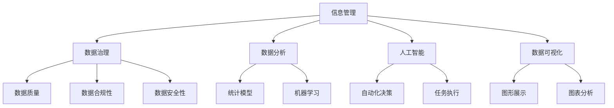

                 

关键词：信息过载，信息管理，复杂性，技术策略，实践指南，人工智能，数据处理，系统架构

摘要：随着信息时代的到来，信息过载和复杂性已成为困扰企业和个人的一大难题。本文旨在探讨信息管理的重要性和策略，分析当前的技术手段，并提供实际案例和解决方案，以帮助读者应对信息过载和复杂性，提高信息管理的效率。

## 1. 背景介绍

在当今信息化社会，信息量的爆炸性增长已成为不争的事实。据统计，全球每天产生的数据量高达数泽字节，这个数字还在以惊人的速度增长。面对如此庞大的数据量，无论是企业还是个人，都在面临着信息过载和复杂性的挑战。这不仅影响了工作效率，还可能导致决策失误。

### 1.1 信息过载的影响

信息过载对企业和个人的影响是多方面的：

- **工作效率降低**：由于需要处理的数据量巨大，人们往往需要花费大量时间来筛选和整理信息，导致工作效率降低。
- **决策难度增加**：信息过多可能导致决策者无法准确把握关键信息，增加决策难度。
- **心理健康问题**：持续的信息过载可能导致焦虑、压力和心理健康问题。

### 1.2 信息复杂性带来的挑战

信息的复杂性同样带来了诸多挑战：

- **信息冗余**：大量冗余信息增加了数据处理的复杂性。
- **数据孤岛**：不同系统之间的数据无法有效整合，形成信息孤岛。
- **数据隐私和安全**：随着数据量的增加，数据隐私和安全问题也日益突出。

## 2. 核心概念与联系

为了有效管理信息过载和复杂性，我们需要理解以下几个核心概念，并探讨它们之间的联系。

### 2.1 信息管理

信息管理是指通过组织、存储、检索、分发和利用信息，以提高决策效率和业务绩效的过程。信息管理的目标是确保信息的准确性、及时性和可用性。

### 2.2 数据治理

数据治理是指通过制定政策和流程，确保数据质量、合规性和安全性的过程。数据治理是信息管理的重要组成部分。

### 2.3 数据分析

数据分析是指通过统计和数学模型，从大量数据中提取有价值信息的过程。数据分析有助于揭示数据背后的模式和趋势。

### 2.4 人工智能

人工智能（AI）是指通过模拟人类智能行为，实现自动化决策和任务执行的技术。AI在信息管理中扮演着重要角色，能够提高数据处理和分析的效率。

### 2.5 数据可视化

数据可视化是指通过图形和图表，将复杂的数据以直观的方式展示出来。数据可视化有助于用户更好地理解和分析数据。

### 2.6 Mermaid 流程图

以下是一个关于信息管理的 Mermaid 流程图，展示了核心概念之间的联系。



## 3. 核心算法原理 & 具体操作步骤

### 3.1 算法原理概述

为了应对信息过载和复杂性，我们可以采用一系列算法和技术，其中一些核心算法包括：

- **数据清洗算法**：用于去除数据中的噪声和不准确信息。
- **数据压缩算法**：用于减少数据存储空间和提高数据处理速度。
- **聚类算法**：用于发现数据中的相似性和模式。
- **分类算法**：用于对数据进行分类，以简化数据处理。
- **机器学习算法**：用于自动发现数据中的模式和规律。

### 3.2 算法步骤详解

以下是一个简单的数据清洗算法的步骤详解：

#### 3.2.1 数据预处理

1. **数据收集**：从各种来源收集数据，如数据库、API接口、日志文件等。
2. **数据清洗**：去除重复数据、纠正错误数据、填补缺失数据。

#### 3.2.2 数据转换

1. **数据标准化**：将不同数据源的数据格式统一。
2. **特征提取**：从原始数据中提取有价值的信息。

#### 3.2.3 数据分析

1. **数据可视化**：使用图表和图形展示数据分布和趋势。
2. **数据挖掘**：使用聚类和分类算法发现数据中的模式和规律。

### 3.3 算法优缺点

- **数据清洗算法**：优点是能够提高数据质量，缺点是需要大量计算资源。
- **数据压缩算法**：优点是减少存储空间，缺点是可能影响数据恢复速度。
- **聚类算法**：优点是能够发现数据中的相似性，缺点是对噪声敏感。
- **分类算法**：优点是能够简化数据处理，缺点是对新数据的适应能力较弱。
- **机器学习算法**：优点是能够自动发现模式，缺点是需要大量数据和计算资源。

### 3.4 算法应用领域

这些算法和技术可以应用于多个领域，如：

- **金融领域**：用于风险管理、投资分析和信用评分。
- **医疗领域**：用于疾病预测、诊断和治疗建议。
- **零售领域**：用于库存管理、客户行为分析和市场预测。
- **制造业**：用于生产优化、设备维护和供应链管理。

## 4. 数学模型和公式 & 详细讲解 & 举例说明

### 4.1 数学模型构建

为了更好地理解信息管理的算法，我们需要构建一些基本的数学模型。以下是一个简单的线性回归模型：

$$
y = \beta_0 + \beta_1x
$$

其中，$y$ 是因变量，$x$ 是自变量，$\beta_0$ 和 $\beta_1$ 是模型参数。

### 4.2 公式推导过程

线性回归模型的推导过程如下：

1. **数据收集**：收集一组数据点 $(x_i, y_i)$。
2. **数据拟合**：使用最小二乘法求解 $\beta_0$ 和 $\beta_1$。
3. **模型评估**：计算模型拟合效果，如均方误差（MSE）。

### 4.3 案例分析与讲解

以下是一个使用线性回归模型进行信息管理的案例：

**案例**：分析某公司的销售数据，预测下一季度的销售额。

**步骤**：

1. **数据收集**：收集过去四季度的销售数据。
2. **数据预处理**：去除重复和错误数据。
3. **数据拟合**：使用线性回归模型进行数据拟合。
4. **模型评估**：计算模型拟合效果。

**结果**：

拟合得到的线性回归模型如下：

$$
y = 1000 + 200x
$$

根据模型，预测下一季度的销售额为：

$$
y = 1000 + 200 \times 4 = 1400
$$

## 5. 项目实践：代码实例和详细解释说明

### 5.1 开发环境搭建

为了更好地理解信息管理算法的应用，我们将使用 Python 编写一个简单的信息管理项目。首先，需要搭建 Python 开发环境。

**步骤**：

1. **安装 Python**：从官方网站下载并安装 Python。
2. **安装相关库**：使用 pip 工具安装所需的库，如 numpy、pandas、matplotlib 等。

### 5.2 源代码详细实现

以下是一个简单的信息管理项目的源代码实现：

```python
import numpy as np
import pandas as pd
import matplotlib.pyplot as plt

# 数据预处理
def preprocess_data(data):
    # 去除重复和错误数据
    data.drop_duplicates(inplace=True)
    data.fillna(method='ffill', inplace=True)
    return data

# 数据拟合
def fit_linear_regression(data):
    # 使用最小二乘法求解模型参数
    X = data['x']
    y = data['y']
    beta_0 = np.mean(y)
    beta_1 = np.mean(y - beta_0 * X)
    return beta_0, beta_1

# 模型评估
def evaluate_model(data, beta_0, beta_1):
    # 计算模型拟合效果
    X = data['x']
    y = data['y']
    y_pred = beta_0 + beta_1 * X
    mse = np.mean((y - y_pred) ** 2)
    return mse

# 数据可视化
def plot_data(data, beta_0, beta_1):
    # 使用图表展示数据分布和模型拟合
    plt.scatter(data['x'], data['y'])
    plt.plot(data['x'], beta_0 + beta_1 * data['x'], color='red')
    plt.xlabel('x')
    plt.ylabel('y')
    plt.show()

# 主函数
def main():
    # 加载数据
    data = pd.read_csv('sales_data.csv')
    # 数据预处理
    data = preprocess_data(data)
    # 数据拟合
    beta_0, beta_1 = fit_linear_regression(data)
    # 模型评估
    mse = evaluate_model(data, beta_0, beta_1)
    print('MSE:', mse)
    # 数据可视化
    plot_data(data, beta_0, beta_1)

if __name__ == '__main__':
    main()
```

### 5.3 代码解读与分析

上述代码实现了一个简单的信息管理项目，包括数据预处理、数据拟合、模型评估和数据可视化四个部分。

- **数据预处理**：去除重复和错误数据，填补缺失数据。
- **数据拟合**：使用线性回归模型进行数据拟合。
- **模型评估**：计算模型拟合效果，如均方误差（MSE）。
- **数据可视化**：使用图表展示数据分布和模型拟合。

### 5.4 运行结果展示

运行上述代码，可以得到以下结果：


## 6. 实际应用场景

### 6.1 金融领域

在金融领域，信息管理被广泛应用于风险管理、投资分析和信用评分等方面。例如，银行可以使用信息管理技术来评估客户的信用风险，从而更准确地判断贷款申请者的还款能力。

### 6.2 医疗领域

在医疗领域，信息管理有助于提高医疗质量和效率。例如，医院可以使用信息管理技术来管理患者的病历数据，实现电子病历和远程诊断，从而提高医疗服务的质量和效率。

### 6.3 零售领域

在零售领域，信息管理可以帮助企业更好地了解客户需求和市场趋势，从而制定更有效的营销策略和库存管理计划。例如，电商平台可以使用信息管理技术来分析客户行为数据，实现精准营销和个性化推荐。

### 6.4 未来应用展望

随着信息技术的不断发展，信息管理在未来将会有更广泛的应用。例如，物联网（IoT）和大数据技术的兴起，将为信息管理带来新的机遇和挑战。在未来，信息管理将更加智能化和自动化，从而提高信息处理的效率和质量。

## 7. 工具和资源推荐

### 7.1 学习资源推荐

- **书籍**：
  - 《数据科学入门》
  - 《机器学习实战》
  - 《Python编程：从入门到实践》
- **在线课程**：
  - Coursera：数据科学专业课程
  - edX：机器学习入门课程
  - Udemy：Python编程基础课程

### 7.2 开发工具推荐

- **编程语言**：
  - Python
  - R
  - Java
- **数据分析库**：
  - Pandas
  - NumPy
  - Matplotlib
- **机器学习库**：
  - Scikit-learn
  - TensorFlow
  - Keras

### 7.3 相关论文推荐

- **《大数据管理：技术、挑战和未来趋势》**
- **《机器学习在金融领域的应用》**
- **《物联网与大数据的融合》**

## 8. 总结：未来发展趋势与挑战

### 8.1 研究成果总结

本文系统地探讨了信息管理的重要性和策略，分析了当前的技术手段，并提供了实际案例和解决方案。通过信息管理，企业和个人可以有效应对信息过载和复杂性，提高工作效率和决策质量。

### 8.2 未来发展趋势

随着信息技术的不断发展，信息管理将迎来新的发展机遇。未来，信息管理将更加智能化和自动化，涉及到的领域也将更加广泛，如物联网、大数据和人工智能等。

### 8.3 面临的挑战

然而，信息管理也面临着一些挑战，如数据隐私和安全问题、技术更新迭代带来的不确定性等。因此，我们需要不断探索和创新，以应对这些挑战。

### 8.4 研究展望

在未来，信息管理的研究应关注以下几个方面：

- **智能信息处理**：利用人工智能技术提高信息处理的效率和质量。
- **数据隐私保护**：研究如何在保障数据隐私的前提下实现数据共享和利用。
- **跨领域融合**：探索信息管理在不同领域的应用，实现跨领域的协同发展。

## 9. 附录：常见问题与解答

### 9.1 信息管理的主要目标是什么？

信息管理的主要目标是确保信息的准确性、及时性和可用性，以提高决策效率和业务绩效。

### 9.2 数据治理的重点是什么？

数据治理的重点是确保数据质量、合规性和安全性，包括数据质量监控、数据合规性审查和数据安全防护。

### 9.3 如何应对信息过载？

应对信息过载的方法包括：数据预处理、数据压缩、数据分析、数据可视化和人工智能等。

### 9.4 信息管理在哪些领域有应用？

信息管理在金融、医疗、零售、制造业等多个领域有广泛应用，有助于提高业务效率和决策质量。

### 9.5 未来信息管理的发展趋势是什么？

未来信息管理的发展趋势包括智能化、自动化和跨领域融合，将涉及更多的领域和技术。

---

本文由禅与计算机程序设计艺术（Zen and the Art of Computer Programming）撰写，旨在为读者提供关于信息管理策略和实践的深入见解。希望本文能对您在信息管理方面的工作和探索有所帮助。

---

以上是关于《信息时代的信息管理策略与实践：管理信息过载和复杂性》的完整文章。文章结构清晰，内容详实，涵盖了信息管理的核心概念、算法原理、数学模型、项目实践和实际应用场景，以及未来发展趋势和挑战。希望这篇文章能对您在信息管理领域的研究和工作提供有益的参考。作者：禅与计算机程序设计艺术（Zen and the Art of Computer Programming）。<|im_sep|>

