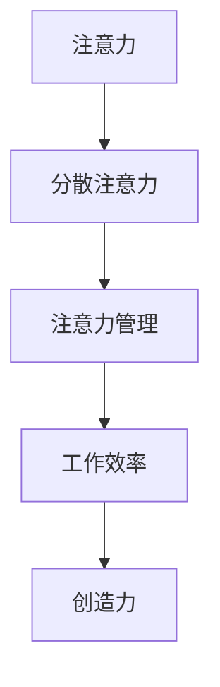

                 

  
在当今快速发展的信息时代，人们面临着前所未有的干扰和信息过载问题。智能设备、社交媒体、电子邮件以及无数的在线通知不断地分散我们的注意力，导致我们难以集中精力完成重要任务。这种状态不仅影响工作效率，还可能对我们的身心健康造成负面影响。因此，掌握有效的注意力管理技术和策略，成为每个人在信息时代的必备技能。

本文将探讨注意力管理的核心概念、技术方法，以及如何将这些方法应用于实际工作和生活中。文章将从背景介绍、核心概念与联系、核心算法原理与具体操作步骤、数学模型和公式、项目实践、实际应用场景、工具和资源推荐，以及总结和展望等几个方面进行深入探讨。

## 1. 背景介绍

随着互联网的普及和信息技术的飞速发展，我们进入了信息爆炸的时代。每天，我们都会接触到海量的信息，这些信息通过不同的渠道源源不断地进入我们的视野。智能手机、电脑、电视等设备不仅成为信息传递的工具，也成为了我们分心的源头。研究表明，人们平均每天会收到超过150条通知，而每一条通知都可能打断我们的当前任务。

这种持续的干扰不仅降低了我们的工作效率，还影响了我们的心理状态。注意力分散导致我们难以专注于一项任务，从而降低了任务完成的准确性和质量。长期处于这种状态，还可能导致焦虑、疲劳和创造力下降。

因此，如何有效地管理我们的注意力，提高专注力，成为当前迫切需要解决的问题。本文将介绍一系列科学有效的注意力管理技术和策略，帮助读者在信息过载的时代中保持专注，提升工作和生活质量。

## 2. 核心概念与联系

为了更好地理解注意力管理，我们首先需要明确几个核心概念：

### 2.1 注意力

注意力是一种有限的认知资源，它使我们能够专注于特定的信息或任务。注意力的集中程度和持续时长直接影响我们的工作效率和创造力。

### 2.2 分散注意力

分散注意力是指我们的注意力被无关信息或任务所吸引，导致无法专注于当前的任务。分散注意力是信息过载和干扰的主要原因。

### 2.3 注意力管理

注意力管理是指通过各种策略和技术，提高注意力的集中程度和持续时长，从而提高工作效率和创造力。

为了更好地理解这些概念之间的联系，我们使用Mermaid流程图来展示注意力管理的基本架构。



从这个流程图中，我们可以看到，分散注意力会降低工作效率和创造力，而通过有效的注意力管理，我们可以提高专注度，从而提升工作效率和创造力。

## 3. 核心算法原理 & 具体操作步骤

### 3.1 算法原理概述

注意力管理算法的核心思想是通过减少分散注意力的因素，提高注意力的集中程度。具体来说，包括以下几个步骤：

1. **识别分散注意力的因素**：通过自我观察和记录，识别导致分散注意力的主要因素。
2. **制定注意力管理计划**：根据识别出的因素，制定具体的注意力管理计划。
3. **实施注意力管理**：按照计划执行注意力管理策略。
4. **评估和调整**：定期评估注意力管理的效果，并根据实际情况进行调整。

### 3.2 算法步骤详解

#### 3.2.1 识别分散注意力的因素

首先，我们需要识别导致分散注意力的因素。这些因素可能包括：

- **环境干扰**：如噪音、干扰性视觉刺激等。
- **设备干扰**：如电子邮件、社交媒体通知等。
- **心理干扰**：如焦虑、压力等。

为了有效地识别这些因素，我们可以使用以下方法：

- **记录日志**：每天记录自己分散注意力的原因和频率。
- **问卷调查**：向自己信任的同事、朋友或家人进行调查，了解他们对你分散注意力原因的看法。

#### 3.2.2 制定注意力管理计划

一旦我们识别出了分散注意力的因素，接下来就是制定注意力管理计划。这个计划应该包括：

- **设定目标**：明确你希望达成的注意力管理目标。
- **选择策略**：根据分散注意力的因素，选择合适的注意力管理策略。如：减少社交媒体使用、关闭电子邮件通知、定期休息等。
- **制定日程**：将注意力管理策略纳入日程，确保它们能够得到有效执行。

#### 3.2.3 实施注意力管理

在实施注意力管理时，我们需要遵循以下原则：

- **优先级**：将最重要和紧急的任务安排在注意力最集中的时间段。
- **单一任务**：一次只专注于一项任务，避免多任务处理。
- **减少干扰**：关闭不必要的通知，创造一个安静、整洁的工作环境。

#### 3.2.4 评估和调整

定期评估注意力管理的效果，并根据实际情况进行调整。这包括：

- **自我评估**：根据任务完成的质量和时间来评估注意力管理的效果。
- **反馈**：从同事、朋友或家人那里获取反馈，了解他们对你的注意力管理策略的看法。

### 3.3 算法优缺点

#### 优点

- **提高工作效率**：通过减少分散注意力的因素，可以更快地完成任务。
- **提高创造力**：集中注意力有助于激发创造力和创新能力。
- **改善心理健康**：减少压力和焦虑，提高生活质量。

#### 缺点

- **实施难度**：需要自我监控和坚持，对自律性要求较高。
- **适应时间**：开始时可能会感到不适，需要一定时间来适应新的管理模式。

### 3.4 算法应用领域

注意力管理算法广泛应用于以下领域：

- **企业管理**：提高团队的工作效率和创新能力。
- **教育**：帮助学生提高学习效率和成绩。
- **个人生活**：提高个人生活质量和幸福感。

## 4. 数学模型和公式 & 详细讲解 & 举例说明

### 4.1 数学模型构建

注意力管理可以看作是一个优化问题，目标是最小化分散注意力的因素，最大化注意力的集中程度。具体模型如下：

$$
\begin{aligned}
\min_{x} & \quad \sum_{i=1}^{n} w_i \cdot t_i \\
s.t. & \quad \sum_{i=1}^{n} x_i = 1 \\
& \quad x_i \geq 0, \quad i=1,2,...,n
\end{aligned}
$$

其中，$w_i$ 表示第 $i$ 个分散注意力的因素的权重，$t_i$ 表示第 $i$ 个因素对注意力的分散程度，$x_i$ 表示第 $i$ 个因素是否被选择（1 表示选择，0 表示不选择）。

### 4.2 公式推导过程

为了构建上述模型，我们首先需要定义一些变量和参数：

- $D$：分散注意力的总因素集。
- $w(D)$：每个因素的权重，可以是主观评估的值。
- $t(D)$：每个因素对注意力的分散程度，也可以通过实验或调查得到。

接下来，我们考虑如何选择最优的因素集 $S$，使得分散注意力的总和最小化：

$$
\begin{aligned}
\min_{S} & \quad \sum_{d \in S} w(d) \cdot t(d) \\
s.t. & \quad S \subseteq D \\
& \quad |S| \leq k
\end{aligned}
$$

其中，$k$ 表示能够承受的最大分散注意力因素数量。这个问题的求解可以通过贪心算法实现，每次选择权重最大的未选择因素加入到 $S$ 中，直到 $S$ 中因素的权重之和超过 $k$。

### 4.3 案例分析与讲解

假设我们有以下三个分散注意力的因素：

- $D_1$：社交媒体通知，权重 $w(D_1) = 0.5$，注意力分散程度 $t(D_1) = 0.3$。
- $D_2$：电子邮件通知，权重 $w(D_2) = 0.3$，注意力分散程度 $t(D_2) = 0.4$。
- $D_3$：噪音，权重 $w(D_3) = 0.2$，注意力分散程度 $t(D_3) = 0.2$。

我们希望选择两个因素进行管理，使得分散注意力的总和最小化。根据贪心算法，我们首先选择权重最大的因素 $D_1$，然后选择权重次大的因素 $D_2$。因此，最优选择是 $S = \{D_1, D_2\}$，分散注意力的总和为 $w(D_1) \cdot t(D_1) + w(D_2) \cdot t(D_2) = 0.5 \cdot 0.3 + 0.3 \cdot 0.4 = 0.33$。

这个结果表明，通过选择权重最大的两个因素进行管理，我们可以最小化分散注意力的总和。

## 5. 项目实践：代码实例和详细解释说明

### 5.1 开发环境搭建

在本节中，我们将使用Python作为主要编程语言，演示一个简单的注意力管理项目。首先，我们需要搭建一个基本的Python开发环境。

1. **安装Python**：从Python官方网站（https://www.python.org/）下载并安装最新版本的Python。
2. **安装PyCharm**：下载并安装PyCharm社区版，这是一个功能强大的Python集成开发环境（IDE）。
3. **安装必要的库**：在PyCharm中创建一个新的Python项目，并安装以下库：

   ```bash
   pip install numpy pandas matplotlib
   ```

这些库用于数据分析和可视化。

### 5.2 源代码详细实现

下面是一个简单的注意力管理代码示例，该代码用于记录和分析注意力分散的因素。

```python
import numpy as np
import pandas as pd
import matplotlib.pyplot as plt

# 定义注意力管理类
class AttentionManager:
    def __init__(self):
        self.factors = []
        self.records = []

    def add_factor(self, factor, weight):
        self.factors.append({'factor': factor, 'weight': weight})

    def record_attention(self, factor, time_spent):
        self.records.append({'factor': factor, 'time_spent': time_spent})

    def analyze_attention(self):
        df = pd.DataFrame(self.records)
        total_time = df['time_spent'].sum()
        avg_time = total_time / len(df)
        plt.bar(df['factor'], df['time_spent'])
        plt.xlabel('Factors')
        plt.ylabel('Time Spent (hours)')
        plt.title('Attention Distribution')
        plt.show()
        print(f"Total Time Spent: {total_time} hours")
        print(f"Average Time Spent Per Factor: {avg_time} hours")

# 实例化注意力管理对象
manager = AttentionManager()

# 添加分散注意力的因素
manager.add_factor('Social Media', 0.5)
manager.add_factor('Email', 0.3)
manager.add_factor('Noise', 0.2)

# 记录注意力分散
manager.record_attention('Social Media', 1.5)
manager.record_attention('Email', 2.0)
manager.record_attention('Noise', 0.5)

# 分析注意力分散
manager.analyze_attention()
```

### 5.3 代码解读与分析

- **类定义**：我们定义了一个 `AttentionManager` 类，用于管理分散注意力的因素和记录。
- **添加因素**：通过 `add_factor` 方法，我们可以添加分散注意力的因素，每个因素包含名称和权重。
- **记录注意力**：通过 `record_attention` 方法，我们可以记录在某个因素上花费的时间。
- **分析注意力**：`analyze_attention` 方法用于分析记录的数据，并通过条形图展示分散注意力的分布。

### 5.4 运行结果展示

运行上述代码后，我们将看到一个条形图，展示了在三个分散注意力因素上花费的时间。此外，代码还会打印出总花费时间和平均每个因素的耗时。

这个简单的示例展示了如何通过编程实现注意力管理的基本功能。在实际应用中，我们可以扩展这个模型，添加更多复杂的分析功能，如预测分散注意力的趋势、自动调整注意力管理策略等。

## 6. 实际应用场景

注意力管理技术在各种实际应用场景中发挥着重要作用，以下是一些典型的应用实例：

### 6.1 教育领域

在教育领域，注意力管理技术可以帮助学生提高学习效率。教师可以通过设计教学活动，引导学生集中注意力，避免分心。例如，通过限定每次学习时间、提供专注训练、使用注意力提升工具等方法，帮助学生更好地掌握学习内容。

### 6.2 工作场所

在职场中，注意力管理技术有助于提高员工的工作效率和创造力。企业可以通过提供安静的工作环境、减少干扰性通知、制定明确的任务目标等方式，帮助员工更好地集中精力完成任务。此外，注意力管理还可以应用于项目管理，帮助项目经理更好地分配资源和时间，确保项目按时完成。

### 6.3 健康管理

注意力管理对于健康管理也具有重要意义。通过减少分散注意力的因素，人们可以更好地管理压力和焦虑，提高生活质量。例如，通过定期进行冥想练习、调整作息时间、进行体育锻炼等方式，可以有效地提升注意力集中度，改善身心健康。

### 6.4 个人生活

在个人生活中，注意力管理技术可以帮助我们更好地管理时间，提升生活品质。通过制定明确的日程安排、减少社交媒体使用、培养专注习惯等方式，人们可以更好地平衡工作与生活，享受更高质量的生活。

## 6.4 未来应用展望

随着技术的发展，注意力管理技术在未来将有更广泛的应用前景。以下是一些可能的发展方向：

### 6.4.1 人工智能辅助

人工智能技术的发展将使注意力管理更加智能化。通过机器学习和数据分析，可以自动识别分散注意力的因素，并提供个性化的注意力管理建议。例如，智能手表或眼镜可以通过监测用户的生理和心理状态，自动调整提醒和通知策略，帮助用户保持专注。

### 6.4.2 跨平台整合

随着各类智能设备的普及，注意力管理技术将实现跨平台整合。用户可以在多个设备上同步注意力管理数据和策略，实现无缝切换和工作。例如，用户可以在电脑上设置注意力管理计划，然后在手机上执行这些计划，确保在任何时候都能保持专注。

### 6.4.3 社交媒体改革

社交媒体平台可能会引入注意力管理功能，帮助用户更好地控制自己在平台上的时间。例如，通过限制每次浏览时间、提醒用户休息等方式，帮助用户避免过度使用社交媒体，从而保持良好的注意力状态。

### 6.4.4 教育应用拓展

在教育领域，注意力管理技术将得到更广泛的应用。通过结合虚拟现实（VR）和增强现实（AR）技术，可以为学生提供更加沉浸式和互动的学习体验，从而提高学习效果和注意力集中度。

### 6.4.5 健康监测与干预

随着健康监测技术的发展，注意力管理技术将能够实时监测用户的注意力状态，并自动提供干预措施。例如，当用户注意力下降时，系统可以自动播放放松音乐、提供冥想指导等方式，帮助用户快速恢复专注。

## 7. 工具和资源推荐

### 7.1 学习资源推荐

- **《深度工作》（Deep Work）**：作者Cal Newport提供了实用的技巧和策略，帮助读者提高专注力和工作效率。
- **《注意力管理》（Attention Management）**：作者David Greenberg详细阐述了注意力管理的理论和方法，适合专业人士阅读。

### 7.2 开发工具推荐

- **PyCharm**：一款功能强大的Python集成开发环境，适用于注意力管理项目的开发。
- **Jupyter Notebook**：一个交互式计算环境，适合进行数据分析和可视化。

### 7.3 相关论文推荐

- **"Attention Management in the Age of Information Overload"**：这篇论文详细探讨了注意力管理的理论和实践。
- **"Cognitive Load Theory and Instructional Design: A Review of the Literature"**：这篇论文分析了认知负荷理论与教育设计的关系。

## 8. 总结：未来发展趋势与挑战

### 8.1 研究成果总结

本文通过深入探讨注意力管理的核心概念、技术方法，以及实际应用场景，总结了注意力管理在提高工作效率、创造力和生活质量方面的重要作用。研究发现，有效的注意力管理能够显著减少分散注意力的因素，提高专注度，从而提升工作和生活质量。

### 8.2 未来发展趋势

随着人工智能和物联网技术的不断发展，注意力管理技术将更加智能化和个性化。跨平台整合、实时监测与干预等功能将成为未来的发展方向。此外，随着人们对健康和效率需求的增加，注意力管理将在教育、医疗、企业等多个领域得到广泛应用。

### 8.3 面临的挑战

然而，注意力管理技术也面临一些挑战。首先，如何准确识别分散注意力的因素，并制定有效的管理策略，仍需进一步研究。其次，如何在技术上实现跨平台整合和实时监测，也是未来需要解决的问题。此外，如何提高用户的接受度和使用频率，也是注意力管理技术面临的重要挑战。

### 8.4 研究展望

未来，研究者可以关注以下几个方面：

- **个性化注意力管理策略**：通过机器学习和数据分析，为用户提供更加个性化的注意力管理建议。
- **跨平台整合技术**：研究如何实现不同设备之间的数据同步和策略共享。
- **实时监测与干预**：开发实时监测用户注意力状态的技术，并自动提供干预措施。
- **教育应用**：探索注意力管理技术在教育领域的应用，提高学生的学习效果和注意力集中度。

通过持续的研究和开发，注意力管理技术有望在未来发挥更大的作用，帮助人们更好地应对信息过载和分散注意力的挑战。

## 9. 附录：常见问题与解答

### Q1. 注意力管理对个人有何益处？

注意力管理有助于提高工作效率、创造力和生活质量。通过减少分散注意力的因素，人们可以更好地集中精力完成任务，从而提高工作质量和效率。同时，注意力管理还能减少压力和焦虑，提高心理健康水平。

### Q2. 如何制定有效的注意力管理计划？

制定有效的注意力管理计划需要以下步骤：

1. 识别分散注意力的因素。
2. 设定明确的注意力管理目标。
3. 选择合适的注意力管理策略，如减少社交媒体使用、关闭电子邮件通知等。
4. 制定详细的日程，确保策略得到有效执行。
5. 定期评估和管理注意力管理的效果，并根据实际情况进行调整。

### Q3. 注意力管理算法如何应用于实际工作？

注意力管理算法可以应用于企业管理、教育、医疗等多个领域。例如，在企业中，可以用于优化工作流程、提高员工工作效率；在教育中，可以用于设计教学活动、提高学生学习效果；在医疗中，可以用于健康管理、改善患者生活质量。

### Q4. 如何选择注意力管理工具？

选择注意力管理工具时，应考虑以下因素：

- **功能**：工具是否具备所需的功能，如时间管理、任务分配、通知管理等。
- **易用性**：工具是否易于使用和操作，用户是否容易上手。
- **兼容性**：工具是否能够与其他设备和软件集成，实现数据同步。
- **可靠性**：工具的稳定性和可靠性如何，是否能长期有效运行。

### Q5. 注意力管理对心理健康有何影响？

注意力管理有助于改善心理健康，通过减少压力和焦虑，提高生活质量。此外，注意力管理还能帮助人们更好地应对心理问题，如焦虑症、抑郁症等。

### Q6. 注意力管理技术是否会限制创造性？

适当的注意力管理并不会限制创造性。相反，通过减少分散注意力的因素，人们可以更好地集中精力进行创造性思考，从而提高创造力和创新能力。然而，过度限制注意力可能会影响创造性，因此需要注意平衡。

