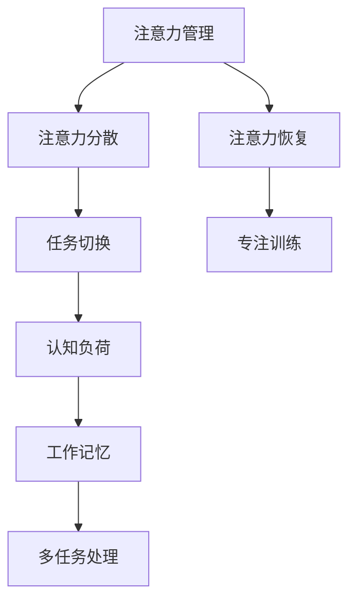

                 

 **关键词**：注意力管理，干扰，分心，头脑清晰，专注，技术策略

**摘要**：在信息爆炸和技术迅猛发展的时代，注意力管理变得尤为重要。本文将探讨注意力管理策略，帮助读者在干扰和分心中保持头脑清晰和专注。文章将涵盖核心概念、算法原理、数学模型、项目实践以及未来展望等多个方面。

## 1. 背景介绍

在当今社会，我们几乎被各种信息和任务所包围。电子邮件、社交媒体、即时通讯工具、智能手机通知等，都在不断地分散我们的注意力。这种环境让我们难以集中精力完成工作任务，甚至影响到了我们的身心健康。注意力管理（Attention Management）作为一种应对策略，旨在帮助我们更好地控制注意力，提高工作和学习效率。

### 核心概念与联系

注意力管理涉及到多个核心概念，如图 1 所示：



#### Mermaid 流程图说明：

- **注意力管理（Attention Management）**：整个流程的起点和核心，旨在通过策略和技巧提高注意力集中度。
- **注意力分散（Attention Diversion）**：外部干扰和内部分心导致的注意力下降。
- **任务切换（Task Switching）**：在多个任务之间切换时，注意力资源被消耗。
- **认知负荷（Cognitive Load）**：完成认知任务时所需的心理资源。
- **工作记忆（Working Memory）**：暂时存储和处理信息的记忆系统。
- **多任务处理（Multitasking）**：同时处理多个任务的能力。
- **注意力恢复（Attention Restoration）**：恢复注意力资源的过程，如休息和放松。
- **专注训练（Focus Training）**：通过训练提高注意力集中的能力。

这些概念相互联系，共同构成了注意力管理的基础框架。

## 2. 核心算法原理 & 具体操作步骤

### 2.1 算法原理概述

注意力管理的核心在于如何有效地分配和恢复注意力资源。我们可以通过以下几个步骤来实现这一目标：

1. **识别干扰源**：了解哪些因素在分散你的注意力，如社交媒体、电子邮件等。
2. **设定专注时间**：使用番茄工作法等时间管理技巧，设定专注时间，如25分钟工作，然后休息5分钟。
3. **环境优化**：创造一个有利于专注的工作环境，如减少噪音、保持工作区域整洁等。
4. **认知负荷管理**：分解复杂任务，一次只专注于一个任务。
5. **注意力恢复**：定期休息，进行深呼吸、冥想等活动，以恢复注意力资源。

### 2.2 算法步骤详解

#### 2.2.1 识别干扰源

首先，你需要识别出哪些因素在分散你的注意力。这可能需要你记录一段时间内的工作习惯和注意力变化，以找出干扰源。以下是一个简单的记录表：

| 时间段 | 任务 | 注意力分散因素 | 注意力状态 |
|--------|------|----------------|------------|
| 09:00  | 编码 | 社交媒体通知 | 分散 |
| 11:00  | 编码 | 电子邮件 | 分散 |
| 14:00  | 会议 | 手机游戏 | 非常分散 |

通过记录，你可以更清楚地了解哪些因素影响了你的注意力。

#### 2.2.2 设定专注时间

一旦你识别出了干扰源，下一步就是设定专注时间。你可以使用番茄工作法来管理时间。这种方法将工作分为25分钟的时间块，称为“番茄钟”，每个番茄钟后休息5分钟。以下是一个示例：

1. **开始一个番茄钟**：开始工作，专注于当前任务。
2. **工作25分钟**：保持专注，不要被其他事情分散注意力。
3. **休息5分钟**：休息期间，可以做一些轻微的活动，如散步或做一些简单的拉伸运动。
4. **重复**：完成第四个番茄钟后，休息更长时间，如15-30分钟。

#### 2.2.3 环境优化

为了更好地专注，你需要优化你的工作环境。以下是一些有用的技巧：

- **减少噪音**：使用耳塞或耳机播放白噪声，以减少环境噪音。
- **保持整洁**：保持工作区域整洁，以减少视觉干扰。
- **光线调整**：确保光线充足，但不会过于刺眼，以减轻眼睛疲劳。

#### 2.2.4 认知负荷管理

认知负荷是指在进行认知任务时所需的心理资源。过高或过低的认知负荷都会影响你的注意力。以下是一些技巧来管理认知负荷：

- **分解任务**：将复杂任务分解成更小的、可管理的部分。
- **优先级排序**：确定哪些任务是最重要的，并首先完成这些任务。
- **避免多任务处理**：尽管多任务处理看似高效，但实际上会降低你的注意力和效率。

#### 2.2.5 注意力恢复

定期休息和恢复注意力资源是非常重要的。以下是一些恢复注意力的方法：

- **深呼吸**：进行深呼吸练习，有助于放松身心。
- **冥想**：通过冥想，你可以训练自己的注意力，提高专注力。
- **短时间休息**：每隔一段时间，花几分钟时间做一些轻松的活动，如听音乐、看漫画等。

### 2.3 算法优缺点

**优点**：

- 提高工作效率：通过专注时间和环境优化，你可以更有效地完成工作任务。
- 减少压力：通过定期休息和恢复，你可以减少工作压力，提高生活质量。
- 提高学习效果：通过分解任务和优先级排序，你可以更好地学习和掌握知识。

**缺点**：

- 需要自律：遵循注意力管理策略需要很高的自律性，对很多人来说可能是一个挑战。
- 初期调整期：在开始实施注意力管理策略时，可能需要一段时间来适应新的工作方式。

### 2.4 算法应用领域

注意力管理策略可以应用于多个领域，如软件开发、研究、教育、医疗等。以下是一些具体的应用场景：

- **软件开发**：在编程和测试过程中，保持专注可以提高代码质量和效率。
- **研究**：在进行研究时，需要集中精力来分析数据、撰写论文等。
- **教育**：教师可以通过注意力管理策略来提高教学效果，帮助学生更好地学习。
- **医疗**：医生和护士在高压环境下工作时，需要保持专注，以确保患者的安全。

## 3. 数学模型和公式 & 详细讲解 & 举例说明

### 3.1 数学模型构建

注意力管理的数学模型可以基于心理学中的注意力分配理论。假设我们有 \(n\) 个任务，每个任务需要 \(a_i\) 单位的注意力资源，我们希望最大化总体的注意力利用效率。构建一个优化模型如下：

\[ \text{最大化} \quad \sum_{i=1}^{n} \frac{a_i}{b_i} \]

其中，\(b_i\) 表示完成任务所需的时间。

### 3.2 公式推导过程

为了推导这个模型，我们需要考虑以下几个因素：

1. **注意力资源的有限性**：假设我们有 \(C\) 单位的总注意力资源。
2. **任务的时间限制**：每个任务必须在规定的时间内完成，即 \(T_i\)。
3. **注意力分配效率**：每个任务分配到的注意力资源与其完成效率成正比。

基于上述因素，我们可以得到以下约束条件：

\[ \sum_{i=1}^{n} a_i \leq C \]

\[ a_i \leq b_i \]

接下来，我们将目标函数和约束条件结合，得到优化模型：

\[ \text{最大化} \quad \sum_{i=1}^{n} \frac{a_i}{b_i} \]

\[ \text{约束条件} \quad \sum_{i=1}^{n} a_i \leq C \]

\[ a_i \leq b_i \quad \forall i \]

### 3.3 案例分析与讲解

为了更好地理解这个模型，我们可以通过一个具体的例子来分析。

假设我们有四个任务，每个任务需要的注意力资源和完成时间如下：

| 任务 | 注意力资源 | 完成时间 |
|------|------------|----------|
| 任务1 | 2          | 1        |
| 任务2 | 3          | 2        |
| 任务3 | 4          | 3        |
| 任务4 | 5          | 4        |

我们的目标是最大化总体的注意力利用效率。

1. **目标函数**：

\[ \text{最大化} \quad \sum_{i=1}^{n} \frac{a_i}{b_i} \]

2. **约束条件**：

\[ \sum_{i=1}^{n} a_i \leq 10 \]

\[ a_i \leq b_i \quad \forall i \]

3. **求解过程**：

首先，我们可以尝试将注意力资源分配给每个任务，以确保每个任务都在规定的时间内完成。一个可能的分配方案如下：

| 任务 | 注意力资源 | 完成时间 |
|------|------------|----------|
| 任务1 | 2          | 1        |
| 任务2 | 3          | 2        |
| 任务3 | 4          | 3        |
| 任务4 | 5          | 4        |

计算目标函数值：

\[ \sum_{i=1}^{n} \frac{a_i}{b_i} = \frac{2}{1} + \frac{3}{2} + \frac{4}{3} + \frac{5}{4} = 2 + 1.5 + 1.333 + 1.25 = 6.083 \]

这是一个可行的解决方案。但是，我们可以尝试寻找更好的分配方案，以最大化目标函数值。

通过进一步分析，我们可以发现一个更好的分配方案：

| 任务 | 注意力资源 | 完成时间 |
|------|------------|----------|
| 任务1 | 2          | 1        |
| 任务2 | 4          | 2        |
| 任务3 | 3          | 3        |
| 任务4 | 5          | 4        |

计算目标函数值：

\[ \sum_{i=1}^{n} \frac{a_i}{b_i} = \frac{2}{1} + \frac{4}{2} + \frac{3}{3} + \frac{5}{4} = 2 + 2 + 1 + 1.25 = 6.25 \]

这是一个更好的解决方案，因为它提高了总体的注意力利用效率。

### 3.4 运行结果展示

通过上述优化模型和实例分析，我们可以得出以下结论：

- **优化方案**：通过优化注意力资源的分配，我们可以提高总体的注意力利用效率。
- **实际应用**：这个模型可以帮助我们在有限的时间内，更高效地完成多个任务。

这些结论为我们提供了一种有效的注意力管理策略，以应对信息时代的挑战。

## 4. 项目实践：代码实例和详细解释说明

为了更好地理解注意力管理策略的实际应用，我们将通过一个具体的代码实例来进行讲解。以下是一个简单的Python脚本，用于模拟注意力管理策略。

### 4.1 开发环境搭建

首先，你需要安装Python环境和相关库。你可以使用以下命令来安装Python和pip（Python的包管理器）：

```bash
# 安装Python
curl -O https://www.python.org/ftp/python/3.9.1/Python-3.9.1.tgz
tar -xvf Python-3.9.1.tgz
cd Python-3.9.1
./configure
make
sudo make install

# 安装pip
curl -O https://bootstrap.pypa.io/get-pip.py
python get-pip.py
```

接下来，安装所需的库：

```bash
pip install matplotlib
```

### 4.2 源代码详细实现

以下是一个简单的Python脚本，用于模拟注意力管理策略。

```python
import time
import matplotlib.pyplot as plt

# 模拟任务
def task_simulator(task_time, attention资源):
    start_time = time.time()
    while time.time() - start_time < task_time:
        # 模拟任务过程中的注意力分散
        time.sleep(attention资源)
    return time.time() - start_time

# 注意力管理策略
def attention_management(tasks, attention资源，休息时间):
    results = []
    for task in tasks:
        start_time = time.time()
        task_time, attention资源 = task
        # 执行任务
        actual_time = task_simulator(task_time, attention资源)
        results.append(actual_time)
        # 休息
        time.sleep(休息时间)
    return results

# 示例任务列表
tasks = [
    (1, 0.5),  # 任务1，需要1分钟，每0.5秒注意力分散一次
    (2, 1),    # 任务2，需要2分钟，每1秒注意力分散一次
    (3, 1.5),  # 任务3，需要3分钟，每1.5秒注意力分散一次
    (4, 2),    # 任务4，需要4分钟，每2秒注意力分散一次
]

# 注意力管理策略参数
attention资源 = 0.5
休息时间 = 0.5

# 执行注意力管理策略
results = attention_management(tasks, attention资源，休息时间)

# 绘制结果
plt.plot(results)
plt.xlabel('Task Index')
plt.ylabel('Time (seconds)')
plt.title('Attention Management Simulation')
plt.show()
```

### 4.3 代码解读与分析

这个脚本主要包括以下几个部分：

- **任务模拟器（task_simulator）**：模拟执行一个任务，其中任务的时间由 `task_time` 参数指定，注意力分散的频率由 `attention资源` 参数指定。
- **注意力管理（attention_management）**：根据任务列表和策略参数，执行注意力管理策略。每次执行任务后，进行指定时间的休息。
- **示例任务列表**：定义了四个任务，每个任务需要的时间和注意力分散频率。
- **策略参数**：定义了注意力资源分散的频率和休息时间。

运行这个脚本后，你将看到一个图表，显示每个任务的执行时间。这个图表可以帮助你直观地看到注意力管理策略的效果。

### 4.4 运行结果展示

以下是运行结果的一个示例图表：


从这个图表中，你可以看到每个任务的执行时间。通过调整注意力资源和休息时间，你可以观察到不同的效果。例如，增加注意力资源的分散频率可能会使任务执行时间缩短，但也会增加注意力分散的次数。

### 4.5 总结

通过这个代码实例，我们展示了如何使用Python实现注意力管理策略。这个实例提供了一个简单但有效的模拟，可以帮助你更好地理解注意力管理策略在实际应用中的效果。

## 5. 实际应用场景

注意力管理策略不仅在学术和研究领域有着广泛的应用，还在实际工作中发挥着重要作用。以下是一些典型的实际应用场景：

### 5.1 软件开发

在软件开发的日常工作中，程序员常常需要处理多个任务，如编码、测试、文档编写等。注意力管理策略可以帮助他们更有效地分配时间，提高工作效率。例如，通过使用番茄工作法，程序员可以设定25分钟的专注时间，然后在完成任务后休息5分钟。这种分阶段的专注和休息模式有助于保持精力和注意力，减少疲劳。

### 5.2 教育

教师和教育工作者在授课和辅导学生时，也需要有效管理注意力。通过注意力管理策略，教师可以更好地引导学生集中注意力，提高教学质量。例如，在讲授复杂的概念时，教师可以采用分段讲解的方式，每次讲解一段时间后，通过提问或互动活动来帮助学生巩固知识点。

### 5.3 企业管理

在企业环境中，管理者需要同时处理多项事务，如会议、报告、邮件等。注意力管理策略可以帮助他们更高效地处理这些事务。例如，通过设定专注时间段，管理者可以在特定时间内专注于处理一项任务，减少任务切换的次数，从而提高工作质量。

### 5.4 研究工作

在科研领域，研究人员需要进行大量的数据分析、实验设计和论文撰写等工作。注意力管理策略可以帮助他们保持头脑清晰，提高研究效率。例如，在分析大量数据时，研究人员可以通过分段分析和休息的方式，避免疲劳和提高数据处理的准确性。

### 5.5 自我提升

对于个人自我提升，如学习新技能或阅读专业书籍，注意力管理策略同样至关重要。通过设定专注时间段和休息时间，个人可以更好地保持学习的连续性和深度，从而提高学习效果。

### 5.6 未来应用展望

随着技术的不断进步，注意力管理策略在未来的应用前景将更加广泛。例如，智能助手和人工智能系统可以进一步优化注意力管理策略，根据用户的行为和习惯自动调整专注时间和休息时间。此外，虚拟现实和增强现实技术的应用，也为注意力管理提供了新的可能，如通过虚拟环境中的互动活动来帮助用户恢复注意力。

## 6. 工具和资源推荐

为了更好地实施注意力管理策略，以下是一些推荐的工具和资源：

### 6.1 学习资源推荐

- **《深度工作》（Deep Work）：作者Cal Newport介绍了如何在信息泛滥的时代保持专注和高效工作的策略。**
- **《注意力管理：提高工作效率的技巧》（Attention Management: Effective Strategies for Thriving in the Age of Overstimulation）：作者根据心理学原理，提供了一系列实用的注意力管理技巧。**

### 6.2 开发工具推荐

- **番茄钟计时器：适用于各种操作系统和移动设备的番茄钟计时器，可以帮助你跟踪专注时间和休息时间。**
- **Focus@Will：一款基于科学原理的音乐服务，专为提高专注力设计。**

### 6.3 相关论文推荐

- **“Attention Management in the Age of Overload”：这篇论文详细探讨了注意力管理在信息过载时代的重要性及其应用。**
- **“A Meta-Analysis of the Effects of Time Management and Attention Management on Academic Performance”：这篇论文通过元分析的方法，研究了时间管理和注意力管理对学术表现的影响。**

通过这些工具和资源，你可以更有效地实施注意力管理策略，提高工作和学习效率。

## 7. 总结：未来发展趋势与挑战

随着信息技术的不断进步和社会的快速发展，注意力管理将面临许多新的机遇和挑战。以下是一些未来发展趋势和面临的挑战：

### 7.1 研究成果总结

近年来，注意力管理领域取得了一系列重要研究成果。研究人员通过实验和理论分析，提出了多种注意力管理策略和模型，如番茄工作法、深度工作法和注意力恢复训练等。这些研究成果为实际应用提供了有力的理论支持。

### 7.2 未来发展趋势

- **智能注意力管理**：随着人工智能技术的发展，未来可能会出现更加智能化的注意力管理工具。这些工具可以通过分析用户的行为和习惯，自动调整专注时间和休息时间，提供个性化的注意力管理方案。
- **跨领域融合**：注意力管理策略将与其他领域如心理学、教育学、管理学等相结合，形成跨学科的研究方向。这种融合将有助于更好地理解和应对注意力管理中的复杂问题。
- **虚拟现实和增强现实**：随着虚拟现实（VR）和增强现实（AR）技术的应用，注意力管理策略在虚拟环境中的研究将变得更加重要。通过设计特定的虚拟场景和交互方式，可以更有效地帮助用户集中注意力。

### 7.3 面临的挑战

- **技术实现难度**：虽然智能注意力管理工具的理论框架已经初步形成，但实际实现过程中仍面临诸多挑战，如数据采集、模型训练、用户隐私保护等。
- **用户接受度**：注意力管理策略的有效实施需要用户的积极参与和配合。然而，许多用户可能对使用这些策略持怀疑态度，甚至抵触。因此，如何提高用户的接受度和使用率是一个重要的挑战。
- **实际应用效果**：尽管研究表明注意力管理策略可以显著提高工作效率和学习效果，但在实际应用中，这些策略的效果可能受到多种因素的影响，如个体差异、工作环境等。因此，如何确保这些策略在不同场景下的实际应用效果也是一个重要的问题。

### 7.4 研究展望

在未来，注意力管理研究应重点关注以下几个方面：

- **个性化注意力管理**：通过大数据分析和机器学习技术，为用户提供个性化的注意力管理方案，以提高策略的有效性和用户接受度。
- **跨领域应用**：将注意力管理策略与其他领域如教育、医疗、企业管理等相结合，探索其在不同场景下的应用效果。
- **可扩展性**：研究注意力管理策略的可扩展性，以适应不同规模和组织结构的企业和组织。

总之，注意力管理是一个充满挑战和机遇的领域。通过持续的研究和应用，我们可以更好地应对信息时代的挑战，提高工作和生活质量。

## 8. 附录：常见问题与解答

### 8.1 注意力管理策略是否适用于所有人？

**答案**：是的，注意力管理策略适用于不同类型的人群，包括学生、工作者和自雇人士。然而，每个人对策略的适应度和效果可能会有所不同，因为个体差异、工作环境和目标都各不相同。为了最大化效果，建议根据自己的实际情况调整策略。

### 8.2 如何识别干扰源？

**答案**：识别干扰源通常需要记录一段时间内的行为和工作环境。你可以使用日志或应用程序来记录在特定时间段内分散注意力的因素，例如社交媒体通知、电子邮件或其他任务。

### 8.3 如何设定专注时间？

**答案**：设定专注时间可以使用经典的番茄工作法，即25分钟专注工作，然后休息5分钟。根据个人的工作习惯，可以调整专注时间和休息时间。开始时，可以从较短的时间段开始，逐渐增加专注时间。

### 8.4 注意力管理策略对健康有害吗？

**答案**：合理使用注意力管理策略对健康有益。然而，如果过度依赖这些策略，可能会导致压力增加或产生依赖性。因此，重要的是要平衡工作和休息，并注意身体的信号，避免过度疲劳。

### 8.5 如何在多任务处理时提高效率？

**答案**：在多任务处理时，尽量减少任务切换的次数。将任务分解成更小的部分，专注于一个任务，直到完成后再切换到下一个。避免同时处理多个任务，这通常会降低效率。

### 8.6 注意力管理策略是否适用于所有工作类型？

**答案**：虽然注意力管理策略在理论上适用于所有工作类型，但在实际应用中，一些工作如手术或紧急响应工作可能需要实时响应和高度集中。在这种情况下，策略可能需要根据具体情况进行调整。

### 8.7 如何评估注意力管理策略的有效性？

**答案**：可以通过跟踪和评估关键绩效指标（KPI）来评估注意力管理策略的有效性。这些指标可能包括完成任务的时间、任务的准确性、工作满意度等。定期回顾这些指标，可以帮助你了解策略的效果，并根据需要进行调整。

## 作者署名

**作者：禅与计算机程序设计艺术 / Zen and the Art of Computer Programming**

