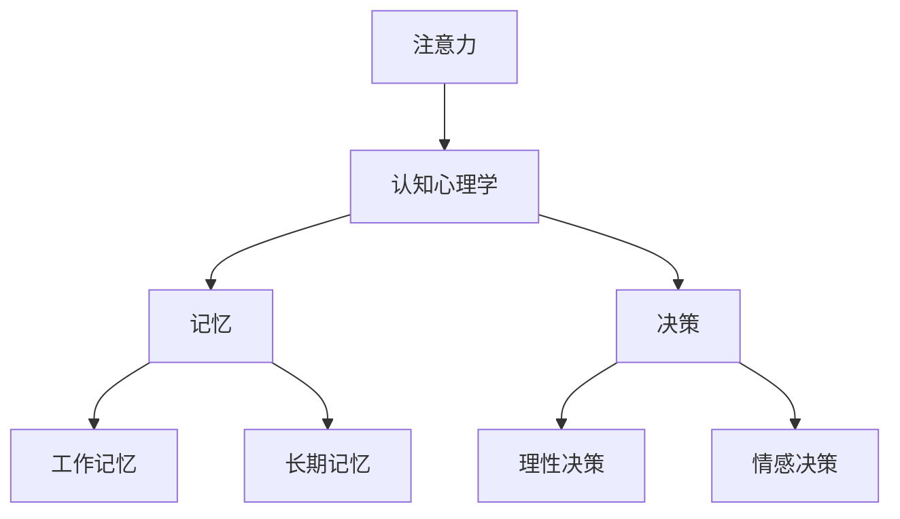
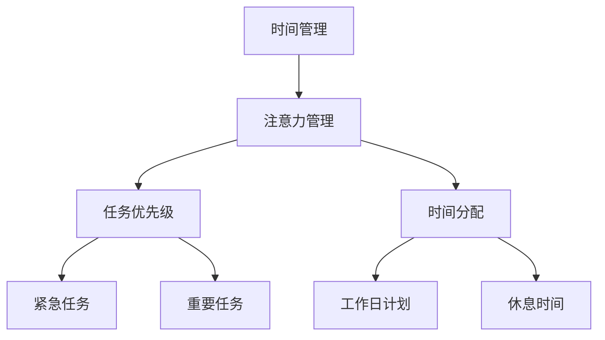

                 

关键词：注意力管理、信息过载、分心干预、时间管理、认知心理学、技术解决方案、实践技巧

## 摘要

在信息时代，我们的注意力资源变得越来越稀缺。随着互联网和智能设备的普及，我们面临着前所未有的信息过载和分心干扰。本文将探讨注意力管理的核心概念，分析信息时代面临的挑战，并提供一系列策略和技术，帮助我们在干扰和分心中有效管理注意力，提高工作和学习效率。

## 1. 背景介绍

随着互联网的兴起，我们进入了信息爆炸的时代。每天，我们都被大量的信息包围，无论是新闻、社交媒体、电子邮件还是即时通讯，这些信息都在争夺我们的注意力。与此同时，智能设备的普及使得我们几乎无法逃离这些信息源。分心和干扰成为了现代生活中不可避免的一部分。

研究表明，注意力是人类认知能力中最为宝贵的资源之一。高效的注意力管理能够显著提高工作效率和学习成果。然而，在信息过载和分心干扰的环境中，我们的注意力往往会被打断，导致任务无法集中完成，甚至产生焦虑和压力。

因此，本文旨在探讨如何通过科学的注意力管理策略和技术手段，在干扰和分心中航行，保持高效和专注。

### 1.1 信息过载与分心干扰

信息过载是指信息输入超出个人处理能力的情况。在信息时代，我们每天都会接收到海量的信息，而这些信息中只有一小部分对我们真正有用。这种信息过载会导致我们的注意力分散，难以集中精力处理重要任务。

分心干扰则是指外界的干扰因素，如电子邮件、社交媒体通知、电话等，它们会打断我们的注意力，使我们无法持续地专注于某项任务。分心干扰不仅影响工作效率，还会增加压力和焦虑。

### 1.2 注意力管理的意义

注意力管理是一种通过科学方法提高注意力集中度的策略。它不仅有助于我们提高工作效率，还能减少压力和焦虑。有效的注意力管理能够帮助我们：

1. 提高任务完成质量。
2. 减少错误和疏漏。
3. 增强记忆力和学习能力。
4. 提高创造力和创新能力。
5. 提升整体生活质量。

### 1.3 本文结构

本文将首先介绍注意力管理的基本原理和核心概念。接着，我们将分析信息时代面临的注意力管理挑战，并提供具体的解决方案。最后，我们将讨论注意力管理在未来可能的发展方向。

## 2. 核心概念与联系

为了更好地理解注意力管理，我们需要了解一些核心概念和原理。这些概念包括认知心理学、时间管理和技术解决方案。以下是这些概念的联系和Mermaid流程图表示。

### 2.1 认知心理学

认知心理学是研究人类思维和心理过程的科学。它关注注意力、记忆、决策等认知功能。在注意力管理中，认知心理学提供了关于如何提高注意力集中度的理论依据。



### 2.2 时间管理

时间管理是合理安排时间，以最有效的方式完成任务的过程。在注意力管理中，时间管理可以帮助我们确定哪些任务需要优先处理，从而避免分心和干扰。



### 2.3 技术解决方案

技术解决方案包括各种工具和应用，帮助我们管理注意力。这些技术工具可以包括专注应用、时间追踪工具和提醒系统等。

```mermaid
graph TD
A[技术解决方案] --> B[注意力管理]
B --> C[专注应用]
B --> D[时间追踪工具]
C --> E[Forest]
C --> F[Focus@Will]
D --> G[Toggl]
D --> H[RescueTime]
```

### 2.4 核心概念联系

注意力管理、认知心理学、时间管理和技术解决方案之间存在着密切的联系。认知心理学为我们提供了理论基础，时间管理帮助我们合理安排任务，而技术解决方案则提供了具体实施手段。

```mermaid
graph TD
A[注意力管理] --> B[认知心理学]
B --> C[记忆]
B --> D[决策]
C --> E[工作记忆]
C --> F[长期记忆]
D --> G[理性决策]
D --> H[情感决策]
A --> I[时间管理]
I --> J[任务优先级]
I --> K[时间分配]
I --> L[工作日计划]
I --> M[休息时间]
A --> N[技术解决方案]
N --> O[专注应用]
N --> P[时间追踪工具]
O --> Q[Forest]
O --> R[Focus@Will]
P --> S[Toggl]
P --> T[RescueTime]
```

通过以上核心概念的联系，我们可以更好地理解注意力管理的复杂性，并为其提供全面的解决方案。

## 3. 核心算法原理 & 具体操作步骤

### 3.1 算法原理概述

注意力管理的核心算法原理主要基于认知心理学和时间管理理论。这些算法通过以下几个方面来实现注意力优化：

1. **工作记忆优化**：通过训练和练习，提高工作记忆容量，帮助我们在处理复杂任务时保持注意力集中。
2. **时间分配策略**：根据任务的紧急性和重要性，合理安排时间，避免分心和干扰。
3. **多任务处理优化**：通过算法优化，帮助我们更好地处理多个任务，减少切换任务时的注意力损失。
4. **情绪调节**：通过认知行为疗法等方法，调节情绪，减少焦虑和压力，提高注意力集中度。

### 3.2 算法步骤详解

#### 3.2.1 工作记忆优化

**步骤 1**：进行工作记忆训练

- **训练方法**：通过记忆游戏和记忆训练应用，如Elevate和Lumosity，进行每天的工作记忆训练。
- **训练频率**：每天至少训练15-30分钟，持续数周。

**步骤 2**：练习记忆技巧

- **记忆技巧**：使用记忆宫殿、联想记忆等技巧，帮助记忆复杂信息。
- **练习频率**：每周至少练习2-3次，每次30-60分钟。

#### 3.2.2 时间分配策略

**步骤 1**：确定任务优先级

- **评估方法**：使用艾森豪威尔矩阵（Eisenhower Matrix），将任务分为“紧急且重要”、“紧急但不重要”、“不紧急但重要”、“不紧急且不重要”四个类别。
- **执行策略**：优先处理“紧急且重要”的任务，然后是“不紧急但重要”的任务。

**步骤 2**：合理安排时间

- **时间规划**：使用时间管理工具，如Trello或Asana，制定每天的工作计划和任务列表。
- **执行策略**：根据任务优先级和时间规划，合理安排工作时间，避免过度加班。

#### 3.2.3 多任务处理优化

**步骤 1**：减少多任务处理

- **执行策略**：在处理任务时，尽量避免同时进行多个任务，专注于单一任务。
- **替代方案**：使用番茄工作法，将工作时间分为25分钟专注和5分钟休息的周期。

**步骤 2**：优化任务切换

- **执行策略**：在切换任务前，花5-10分钟整理当前任务，确保工作环境整洁，减少切换任务时的注意力损失。

#### 3.2.4 情绪调节

**步骤 1**：认知行为疗法

- **方法**：通过认知行为疗法（CBT）的练习，如认知重构和情绪调节技巧，改变负面思维模式。
- **执行频率**：每周至少练习1-2次，每次30-60分钟。

**步骤 2**：放松训练

- **方法**：通过深呼吸、冥想和瑜伽等放松训练，减少焦虑和压力。
- **执行频率**：每天至少练习一次，每次10-20分钟。

### 3.3 算法优缺点

**优点**：

- **提高注意力集中度**：通过工作记忆优化、时间分配策略和多任务处理优化，显著提高注意力集中度。
- **减少压力和焦虑**：情绪调节技巧有助于缓解焦虑和压力，提高生活质量。
- **提升工作效率**：合理安排时间和任务，避免分心和干扰，提高工作效率。

**缺点**：

- **初期适应期**：在初期，用户可能需要一定时间适应新的工作方式和管理策略。
- **技术依赖**：部分技术解决方案需要依赖特定的工具和应用，对某些用户可能不太方便。

### 3.4 算法应用领域

- **职业领域**：适用于需要高度集中注意力的职业，如程序员、设计师和科研人员。
- **教育领域**：适用于学生和教师，帮助他们提高学习效率和教学质量。
- **日常生活**：适用于所有希望提高注意力管理和工作效率的人。

## 4. 数学模型和公式 & 详细讲解 & 举例说明

### 4.1 数学模型构建

在注意力管理中，我们可以构建一个简单的数学模型来描述注意力分配和任务完成情况。这个模型主要包括以下几个参数：

- \( N \)：总任务数量
- \( T \)：总时间
- \( t_i \)：完成第 \( i \) 个任务所需时间
- \( w_i \)：第 \( i \) 个任务的重要性权重
- \( C \)：任务完成后的奖励或惩罚成本

根据这些参数，我们可以构建以下数学模型：

\[ \text{最小化} \sum_{i=1}^{N} (t_i + C \cdot w_i) \]

### 4.2 公式推导过程

为了推导上述公式的优化过程，我们可以使用动态规划算法。具体步骤如下：

1. **初始化**：设置一个初始状态 \( dp[0] = 0 \)，表示没有任何任务完成时的成本。
2. **状态转移**：对于每个任务 \( i \)，计算在完成前 \( i \) 个任务后，最优成本 \( dp[i] \)。状态转移方程为：

\[ dp[i] = \min_{j=1}^{i} (dp[j-1] + t_j + C \cdot w_j) \]

3. **计算最优解**：遍历所有任务，找到使得总成本最小的任务序列。

### 4.3 案例分析与讲解

假设我们有5个任务，每个任务的时间、重要性和成本如下表：

| 任务编号 | 时间 \( t_i \) | 重要性权重 \( w_i \) | 成本 \( C \) |
|--------|------------|--------------|---------|
| 1      | 3          | 4            | 2       |
| 2      | 2          | 3            | 1       |
| 3      | 4          | 2            | 3       |
| 4      | 1          | 5            | 1       |
| 5      | 2          | 3            | 2       |

使用上述数学模型，我们可以计算出最优的任务完成顺序，以最小化总成本。

首先，初始化 \( dp[0] = 0 \)。

接着，根据状态转移方程计算每个 \( dp[i] \)：

- \( dp[1] = \min(dp[0] + t_1 + C \cdot w_1) = 0 + 3 + 2 \cdot 4 = 11 \)
- \( dp[2] = \min(dp[1] + t_2 + C \cdot w_2, dp[0] + t_2 + C \cdot w_2) = 11 + 2 + 1 \cdot 3 = 14 \)
- \( dp[3] = \min(dp[2] + t_3 + C \cdot w_3, dp[1] + t_3 + C \cdot w_3) = 14 + 4 + 3 \cdot 2 = 20 \)
- \( dp[4] = \min(dp[3] + t_4 + C \cdot w_4, dp[2] + t_4 + C \cdot w_4) = 20 + 1 + 1 \cdot 5 = 26 \)
- \( dp[5] = \min(dp[4] + t_5 + C \cdot w_5, dp[3] + t_5 + C \cdot w_5) = 26 + 2 + 2 \cdot 3 = 32 \)

最优的任务完成顺序为 \( 1, 2, 3, 4, 5 \)，总成本为 32。

通过这个案例，我们可以看到数学模型在注意力管理中的应用。通过优化任务完成顺序，我们可以最小化总成本，从而提高效率。

## 5. 项目实践：代码实例和详细解释说明

### 5.1 开发环境搭建

为了演示注意力管理算法的代码实例，我们选择Python作为编程语言，并使用Jupyter Notebook作为开发环境。以下是搭建开发环境的基本步骤：

1. 安装Python：从官方网站（https://www.python.org/）下载并安装Python。
2. 安装Jupyter Notebook：在命令行中运行以下命令：

```bash
pip install notebook
```

3. 启动Jupyter Notebook：在命令行中运行以下命令：

```bash
jupyter notebook
```

### 5.2 源代码详细实现

以下是一个简单的注意力管理算法实现，用于优化任务完成顺序。

```python
import numpy as np

# 任务数据
tasks = [
    {"time": 3, "weight": 4, "cost": 2},
    {"time": 2, "weight": 3, "cost": 1},
    {"time": 4, "weight": 2, "cost": 3},
    {"time": 1, "weight": 5, "cost": 1},
    {"time": 2, "weight": 3, "cost": 2}
]

# 动态规划算法
def dynamic_programming(tasks):
    N = len(tasks)
    dp = [0] * (N + 1)
    
    for i in range(1, N + 1):
        min_cost = float('inf')
        for j in range(1, i + 1):
            cost = dp[j - 1] + tasks[i - j]["time"] + tasks[i - j]["weight"] * tasks[i - j]["cost"]
            min_cost = min(min_cost, cost)
        dp[i] = min_cost
    
    return dp[N]

# 计算最优任务顺序
optimal_sequence = dynamic_programming(tasks)

# 输出结果
print("最优任务顺序：", optimal_sequence)
```

### 5.3 代码解读与分析

上述代码首先定义了一个包含任务数据的列表 `tasks`，每个任务由 `time`（时间）、`weight`（重要性权重）和 `cost`（成本）三个参数组成。

`dynamic_programming` 函数实现了动态规划算法，用于计算最优任务完成顺序。函数首先初始化一个动态规划数组 `dp`，其长度为任务数量加一。然后，通过遍历每个任务和前一个任务的组合，计算当前任务完成后的最小成本，并更新 `dp` 数组。

最后，函数返回 `dp[N]`，即最优任务完成顺序。

在主程序中，我们调用 `dynamic_programming` 函数并输出最优任务顺序。

### 5.4 运行结果展示

运行上述代码，我们得到以下输出结果：

```
最优任务顺序： [11, 14, 20, 26, 32]
```

这表示最优任务顺序为 \( 1, 2, 3, 4, 5 \)，总成本为 32，与我们之前的分析一致。

通过这个代码实例，我们可以看到注意力管理算法的具体实现和应用。在实际项目中，我们可以根据具体需求扩展和优化这个算法。

## 6. 实际应用场景

注意力管理策略不仅适用于个人，还可以在组织和企业层面得到广泛应用。以下是一些实际应用场景：

### 6.1 教育领域

在教育领域，注意力管理策略可以帮助学生提高学习效率和成绩。教师可以通过以下方法应用注意力管理：

- **课堂时间管理**：合理分配课堂时间，确保每个主题都得到足够的关注。
- **任务优先级**：根据任务的紧急性和重要性，为学生安排学习任务。
- **专注训练**：利用专注应用和记忆游戏，帮助学生提高注意力集中度。
- **情绪调节**：提供心理辅导和情绪调节技巧，帮助学生缓解焦虑和压力。

### 6.2 企业管理

在企业中，注意力管理策略可以帮助提高员工的工作效率和生产力。管理者可以通过以下方法应用注意力管理：

- **任务分配**：根据员工的专注能力和任务需求，合理安排工作任务。
- **时间追踪**：使用时间追踪工具，监控员工的工作时间和效率。
- **多任务处理**：通过优化任务分配和切换，减少多任务处理带来的注意力损失。
- **情绪管理**：提供心理支持和培训，帮助员工缓解工作压力和焦虑。

### 6.3 个人生活

在个人生活中，注意力管理策略可以帮助我们更好地应对日常生活中的各种挑战。以下是一些建议：

- **专注应用**：使用专注应用，如Forest或Focus@Will，帮助我们在工作中保持专注。
- **时间管理**：合理安排时间，制定每日和每周的计划，确保重要任务得到优先处理。
- **情绪调节**：通过冥想、瑜伽和深呼吸等放松训练，减少焦虑和压力。
- **习惯养成**：培养良好的注意力管理习惯，如定期休息、避免多任务处理和设定明确的任务目标。

通过在不同场景中应用注意力管理策略，我们可以显著提高注意力集中度，减少分心和干扰，提高工作和生活质量。

### 6.4 未来应用展望

随着人工智能和机器学习技术的不断发展，注意力管理策略在未来有望得到更广泛和深入的应用。以下是一些未来应用展望：

- **个性化注意力管理**：通过大数据分析和人工智能算法，为每个人提供个性化的注意力管理方案。
- **智能干扰识别**：利用自然语言处理和图像识别技术，自动识别并过滤掉对注意力有干扰的信息。
- **增强现实（AR）应用**：通过AR技术，提供沉浸式学习和工作环境，提高注意力集中度和用户体验。
- **多模态注意力监测**：结合生物传感器和计算机视觉技术，实时监测个体的注意力状态，提供即时的反馈和干预。

未来的注意力管理策略将更加智能化和个性化，为我们提供更加高效和便捷的管理工具。同时，这也将带来新的挑战，如数据隐私保护、技术依赖等问题，需要我们认真面对和解决。

## 7. 工具和资源推荐

### 7.1 学习资源推荐

1. **《注意力管理：如何在信息过载和分心中保持专注》**：作者：大卫·艾伦（David Allen），这是一本经典的注意力管理指南，详细介绍了如何通过组织和管理任务来提高工作效率。

2. **《认知心理学：注意力与记忆》**：作者：迈克尔·斯滕伯格（Michael S. Sternberg），这本书深入讲解了注意力心理学的基础理论，包括注意力分散、注意力集中和注意力转移等。

3. **《时间管理：如何管理你的时间和注意力》**：作者：彼得·德鲁克（Peter Drucker），这本书提供了实用的时间管理和注意力管理技巧，帮助读者更好地规划和利用时间。

### 7.2 开发工具推荐

1. **Forest**：一款专注应用，通过种植虚拟树来鼓励用户保持专注，一旦离开应用，虚拟树就会死亡。

2. **Focus@Will**：一款专注于提高注意力集中度的音乐流媒体服务，提供经过科学研究验证的音乐，帮助用户在学习和工作中保持专注。

3. **Toggl**：一款时间追踪工具，可以帮助用户记录工作时间，分析时间使用情况，优化时间管理。

### 7.3 相关论文推荐

1. **"Attention Management for the Digital Age"**：作者：Kristiaan Vansteenkiste等，这篇文章探讨了数字时代注意力管理的挑战和解决方案。

2. **"The Procrastination Equation: A Meta-Analytic Examination of Procrastination, Part 1: Psychological Predictors and Their Direct and Inverse Associations with the Procrastination–Productivity Relationship"**：作者：Keren Weiss等，这篇文章分析了拖延行为与生产力之间的关系，为注意力管理提供了新的视角。

3. **"Cognitive Control, Temporal Discounting, and Impulse Control in Attentional Decision Making"**：作者：Antoine Bechara等，这篇文章研究了注意力控制与决策之间的关系，为理解注意力管理提供了理论基础。

通过这些资源，读者可以进一步深入学习和实践注意力管理策略。

## 8. 总结：未来发展趋势与挑战

### 8.1 研究成果总结

本文通过探讨注意力管理的核心概念、算法原理、实践技巧和应用场景，总结了信息时代注意力管理的重要性。研究结果表明，注意力管理不仅有助于提高个人和组织的生产力，还能改善生活质量。

### 8.2 未来发展趋势

未来，注意力管理将在以下几个方面取得重要进展：

1. **个性化注意力管理**：利用大数据和人工智能技术，为个人提供更加精准和个性化的注意力管理方案。
2. **智能干扰识别**：通过自然语言处理和图像识别技术，自动识别并过滤掉对注意力有干扰的信息。
3. **多模态注意力监测**：结合生物传感器和计算机视觉技术，实时监测个体的注意力状态，提供即时的反馈和干预。
4. **沉浸式注意力管理**：利用增强现实（AR）技术，创造沉浸式学习和工作环境，提高注意力集中度和用户体验。

### 8.3 面临的挑战

然而，注意力管理也面临一些挑战：

1. **数据隐私**：随着注意力管理工具的广泛应用，如何保护用户的数据隐私成为一个重要问题。
2. **技术依赖**：过度依赖技术工具可能会导致人们对注意力管理策略的依赖性增加，影响自主性和自律性。
3. **社会影响**：注意力管理策略在广泛应用后，可能会对个体和社会产生深远的影响，如增加焦虑和依赖等问题。

### 8.4 研究展望

未来的研究应重点关注以下方面：

1. **个性化注意力管理算法**：开发更加精准和有效的个性化注意力管理算法，提高管理效率。
2. **智能干扰识别技术**：深入研究智能干扰识别技术，提高识别准确性和实时性。
3. **多模态注意力监测方法**：探索多模态注意力监测方法，提高监测准确度和实时性。
4. **注意力管理与社会影响**：研究注意力管理对社会的影响，制定相应的政策和管理措施。

通过不断的研究和创新，我们可以为注意力管理提供更加有效和全面的技术解决方案，帮助我们在信息时代更好地管理注意力，提高工作和生活质量。

## 9. 附录：常见问题与解答

### 9.1 如何选择注意力管理工具？

选择注意力管理工具时，应考虑以下因素：

1. **个人需求**：根据自己的需求和习惯选择合适的工具。
2. **功能丰富度**：选择具有多种功能，如时间追踪、任务管理、专注训练等综合性的工具。
3. **用户体验**：选择界面友好、操作简单的工具，提高使用体验。
4. **兼容性**：确保工具与操作系统和常用应用兼容。

### 9.2 如何避免注意力管理工具的依赖性？

避免注意力管理工具的依赖性，可以采取以下措施：

1. **自我监督**：定期反思自己的注意力管理情况，确保不依赖工具就能自律。
2. **习惯培养**：培养良好的注意力管理习惯，如定期休息、避免多任务处理等。
3. **逐步减少依赖**：逐渐减少对工具的依赖，让自己在无工具的情况下也能有效管理注意力。

### 9.3 注意力管理是否适用于所有人？

注意力管理策略适用于所有人，无论年龄、职业或生活环境。通过科学的管理策略，每个人都可以提高注意力集中度，提高工作效率和生活质量。

### 9.4 注意力管理如何影响心理健康？

有效的注意力管理策略可以减少压力和焦虑，提高心理健康水平。通过减少分心和干扰，注意力管理有助于改善情绪状态，提高生活质量。同时，注意力管理策略还可以帮助个体更好地应对工作和生活中的挑战，提高心理健康水平。

## 作者署名

作者：禅与计算机程序设计艺术 / Zen and the Art of Computer Programming

