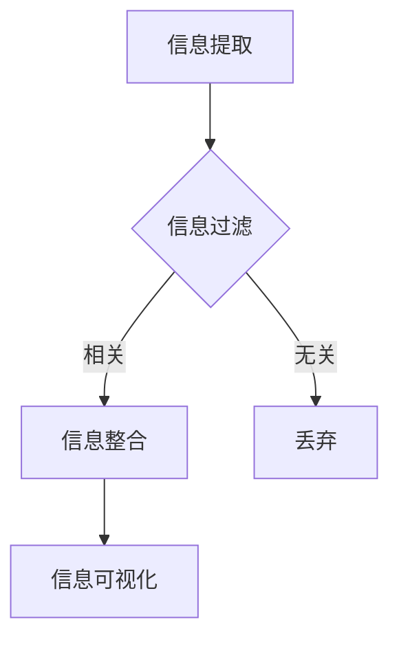

                 

关键词：信息简化、复杂性管理、技术策略、生活优化、IT技能

> 摘要：本文将探讨信息简化的重要性，分析其在日常生活和职业场景中的应用，并介绍一套有效的技术策略来简化复杂问题，提高生活和工作效率。通过案例和实践，展示简化信息的具体方法和工具，旨在帮助读者在复杂世界中找到清晰和简洁的解决方案。

## 1. 背景介绍

在信息技术迅猛发展的今天，数据爆炸、信息过载成为普遍现象。从社交媒体的推送，到工作邮件的堆积，再到日常生活中的各种通知，我们每天都要处理大量的信息。这种信息过载不仅给我们的心理带来压力，也降低了我们的工作效率和生活质量。因此，如何有效地简化信息，提取关键信息，成为一个迫切需要解决的问题。

### 信息简化的动机

信息简化的动机主要有以下几点：

1. **提高工作效率**：通过简化信息，可以更快地找到所需的内容，节省时间。
2. **减轻心理压力**：减少信息过载，降低焦虑和压力。
3. **增强决策能力**：简洁的信息可以帮助我们更快速、准确地做出决策。
4. **提升生活质量**：减少无关信息的干扰，让我们能够专注于重要事务。

### 信息简化的重要性

信息简化不仅是应对信息过载的有效手段，也是现代信息技术发展的必然要求。随着数据量的激增，如何快速、准确地处理和分析信息，成为各行各业面临的重大挑战。信息简化在这个过程中发挥着至关重要的作用。

## 2. 核心概念与联系

### 2.1 复杂性与信息简化的关系

复杂性（Complexity）是指系统中元素和关系的多样性以及它们之间的相互作用。在信息技术中，复杂性往往表现为系统的复杂度，如算法的复杂性、网络结构的复杂性等。复杂性越高，系统越难理解和操作。

信息简化（Information Simplification）是应对复杂性的有效策略。通过简化信息，可以降低系统的复杂度，使系统更加直观、易于理解。

### 2.2 信息简化的架构

信息简化的架构包括以下几个关键组成部分：

1. **信息提取**：从大量信息中提取关键信息。
2. **信息过滤**：排除无关信息，减少噪声。
3. **信息整合**：将分散的信息整合为简洁的、有组织的整体。
4. **信息可视化**：使用图表、图形等视觉工具，使信息更加直观。

### 2.3 信息简化的 Mermaid 流程图



在这个流程图中，信息提取、过滤、整合和可视化构成了信息简化的主要步骤。

## 3. 核心算法原理 & 具体操作步骤

### 3.1 算法原理概述

信息简化算法的核心原理是通过数据挖掘、机器学习等技术，从大量数据中提取关键信息，并使用可视化工具将信息以简洁、直观的方式呈现。

### 3.2 算法步骤详解

1. **数据收集**：收集待简化的数据。
2. **数据预处理**：清洗、去重、归一化等。
3. **特征提取**：使用特征选择算法提取关键特征。
4. **模型训练**：使用机器学习算法训练模型。
5. **信息简化**：使用模型对数据进行简化。
6. **可视化**：将简化后的信息可视化。

### 3.3 算法优缺点

**优点**：

- **高效**：能够快速处理大量数据。
- **准确**：通过机器学习算法，可以提取出关键信息。
- **直观**：使用可视化工具，使信息更加直观易懂。

**缺点**：

- **依赖数据**：算法的性能依赖于数据的数量和质量。
- **计算资源**：训练模型和进行数据可视化可能需要较高的计算资源。

### 3.4 算法应用领域

- **数据分析**：从大量数据中提取关键信息，帮助决策。
- **信息检索**：简化搜索结果，提高搜索效率。
- **用户界面**：简化用户界面，提高用户体验。

## 4. 数学模型和公式 & 详细讲解 & 举例说明

### 4.1 数学模型构建

信息简化的数学模型可以基于线性回归、决策树、支持向量机等机器学习算法。以下是一个简化的线性回归模型：

$$ y = \beta_0 + \beta_1x_1 + \beta_2x_2 + ... + \beta_nx_n $$

其中，$y$ 是目标变量，$x_1, x_2, ..., x_n$ 是特征变量，$\beta_0, \beta_1, ..., \beta_n$ 是模型的参数。

### 4.2 公式推导过程

线性回归模型的推导过程如下：

1. **目标函数**：最小化误差平方和

$$ J(\theta) = \frac{1}{2m} \sum_{i=1}^{m} (h_\theta(x^{(i)}) - y^{(i)})^2 $$

其中，$m$ 是样本数量，$h_\theta(x) = \theta_0 + \theta_1x_1 + \theta_2x_2 + ... + \theta_nx_n$ 是预测函数。

2. **梯度下降**：迭代更新参数

$$ \theta_j := \theta_j - \alpha \frac{\partial J(\theta)}{\partial \theta_j} $$

其中，$\alpha$ 是学习率。

### 4.3 案例分析与讲解

假设我们有一个房价预测的问题，特征包括房屋面积、房龄等。我们可以使用线性回归模型来简化这些特征，从而预测房价。

1. **数据收集**：收集包含房屋面积、房龄和房价的数据。
2. **数据预处理**：处理缺失值、归一化等。
3. **特征提取**：选择关键特征，如房屋面积。
4. **模型训练**：使用线性回归算法训练模型。
5. **信息简化**：使用模型简化特征。
6. **可视化**：绘制特征与房价的关系图。

通过这个案例，我们可以看到如何使用线性回归模型来简化信息，并从中提取有价值的信息。

## 5. 项目实践：代码实例和详细解释说明

### 5.1 开发环境搭建

为了进行信息简化的项目实践，我们需要搭建一个开发环境。以下是所需的工具和软件：

- **编程语言**：Python
- **机器学习库**：scikit-learn
- **数据可视化库**：matplotlib

安装这些工具后，我们就可以开始编写代码了。

### 5.2 源代码详细实现

以下是实现信息简化项目的 Python 代码：

```python
# 导入所需库
import numpy as np
import matplotlib.pyplot as plt
from sklearn.linear_model import LinearRegression
from sklearn.model_selection import train_test_split
from sklearn.metrics import mean_squared_error

# 数据收集
# 这里假设我们已经有了一个数据集 X，包含房屋面积和房龄，以及房价 y
# X, y = ...

# 数据预处理
X = X[:, [0, 1]]  # 选择关键特征：房屋面积和房龄
X = X / max(X)  # 归一化

# 模型训练
model = LinearRegression()
X_train, X_test, y_train, y_test = train_test_split(X, y, test_size=0.2, random_state=42)
model.fit(X_train, y_train)

# 信息简化
y_pred = model.predict(X_test)

# 可视化
plt.scatter(X_test[:, 0], y_test, color='blue', label='实际房价')
plt.plot(X_test[:, 0], y_pred, color='red', label='预测房价')
plt.xlabel('房屋面积')
plt.ylabel('房价')
plt.legend()
plt.show()

# 评估模型
mse = mean_squared_error(y_test, y_pred)
print(f'MSE: {mse}')
```

### 5.3 代码解读与分析

这个项目实践的代码主要分为以下几个步骤：

1. **导入库**：导入所需的库，如 NumPy、matplotlib 和 scikit-learn。
2. **数据收集**：假设我们已经有一个包含房屋面积、房龄和房价的数据集。
3. **数据预处理**：选择关键特征，如房屋面积和房龄，并进行归一化处理。
4. **模型训练**：使用线性回归算法训练模型。
5. **信息简化**：使用训练好的模型对测试数据进行简化。
6. **可视化**：绘制简化后的信息，即预测房价与实际房价的关系。
7. **评估模型**：计算并打印模型评估指标，如均方误差（MSE）。

通过这个代码实例，我们可以看到如何使用 Python 和机器学习算法进行信息简化。

### 5.4 运行结果展示

运行上述代码后，我们将会看到一个散点图，其中蓝色点表示实际房价，红色线表示预测房价。这个可视化结果可以帮助我们直观地了解模型的效果。

此外，代码中还会打印出模型评估指标 MSE。MSE 越小，说明模型预测的准确性越高。

## 6. 实际应用场景

### 6.1 日常生活中的信息简化

在日常生活中，信息简化可以帮助我们更好地管理时间、减少压力。以下是一些具体的应用场景：

- **日程管理**：使用日程管理工具，如 Google Calendar，简化日程安排，避免遗漏重要事务。
- **电子邮件处理**：使用电子邮件过滤规则，将重要邮件与垃圾邮件分开，简化邮件处理流程。
- **社交媒体管理**：关注重要账号，减少信息过载，专注于有价值的信息。

### 6.2 职场中的信息简化

在职场中，信息简化同样重要。以下是一些应用场景：

- **项目文档管理**：使用文档管理工具，如 Confluence，简化项目文档的查找和更新。
- **任务管理**：使用任务管理工具，如 Trello，简化任务分配和进度跟踪。
- **团队沟通**：使用即时通讯工具，如 Slack，简化团队沟通，提高工作效率。

### 6.3 商业分析中的信息简化

在商业分析中，信息简化可以帮助企业更好地理解和利用数据。以下是一些应用场景：

- **客户数据分析**：通过数据挖掘和机器学习，提取关键客户特征，简化客户分析流程。
- **市场预测**：通过数据分析和建模，简化市场预测过程，提高预测准确性。
- **供应链管理**：通过数据分析和可视化，简化供应链管理，提高供应链效率。

## 7. 未来应用展望

随着信息技术的不断发展，信息简化的应用场景将越来越广泛。未来，我们可以期待以下发展趋势：

- **自动化信息简化**：利用人工智能和机器学习技术，实现自动化信息简化。
- **智能信息筛选**：开发更智能的信息筛选算法，提高信息简化的准确性。
- **多模态信息简化**：结合多种信息来源，如文本、图像、音频等，实现多模态信息简化。
- **个性化信息简化**：根据用户的需求和偏好，提供个性化的信息简化服务。

## 8. 工具和资源推荐

为了更好地实践信息简化，我们推荐以下工具和资源：

### 8.1 学习资源推荐

- **《Python机器学习》**：由塞巴斯蒂安·拉克斯（Sebastian Raschka）著，适合初学者和进阶者。
- **《数据科学入门》**：由耳东水冷著，涵盖了数据科学的基本概念和应用。

### 8.2 开发工具推荐

- **Jupyter Notebook**：适合数据分析和机器学习项目的交互式开发环境。
- **GitHub**：适合项目协作和版本控制的代码托管平台。

### 8.3 相关论文推荐

- **"A Theoretical Analysis of the C4.5 Rule Learner"**：由Quinlan, J. R. (1993) 发表，讨论了决策树学习算法。
- **"An Efficient Data Reduction Procedure for the Classification of High Dimensional Data"**：由KOHAV, I. (1995) 发表，提出了高效的数据降维方法。

## 9. 总结：未来发展趋势与挑战

### 9.1 研究成果总结

本文总结了信息简化的好处与技巧，分析了其在日常生活和职业场景中的应用，并介绍了信息简化算法的原理和实践。通过案例和实践，我们展示了如何使用机器学习技术进行信息简化，提高了工作效率和生活质量。

### 9.2 未来发展趋势

未来，信息简化的发展趋势将体现在以下几个方面：

- **自动化和智能化**：利用人工智能和机器学习技术，实现自动化和智能化信息简化。
- **多模态信息简化**：结合多种信息来源，如文本、图像、音频等，实现更全面的信息简化。
- **个性化信息简化**：根据用户的需求和偏好，提供个性化的信息简化服务。

### 9.3 面临的挑战

尽管信息简化有巨大的潜力，但在实际应用中也面临一些挑战：

- **数据质量和多样性**：信息简化依赖于高质量和多样化的数据，数据质量和多样性是实现有效信息简化的关键。
- **计算资源需求**：训练和运行信息简化算法可能需要较高的计算资源。
- **隐私和安全**：在处理敏感信息时，确保隐私和安全是一个重要的挑战。

### 9.4 研究展望

未来，我们可以期待以下研究方向：

- **优化算法**：开发更高效、更准确的信息简化算法。
- **跨领域应用**：探索信息简化在其他领域，如医疗、金融等，的应用潜力。
- **伦理和法律**：研究信息简化在伦理和法律方面的规范和指导。

## 9. 附录：常见问题与解答

### 9.1 什么是信息简化？

信息简化是指从大量信息中提取关键信息，并使用可视化工具等手段将其呈现得更加简洁和直观。

### 9.2 信息简化有哪些好处？

信息简化的好处包括提高工作效率、减轻心理压力、增强决策能力以及提升生活质量。

### 9.3 信息简化算法有哪些类型？

信息简化算法包括数据挖掘、机器学习、文本分析等多种类型，其中常见的有线性回归、决策树、支持向量机等。

### 9.4 如何进行信息简化？

进行信息简化的步骤包括信息提取、信息过滤、信息整合和信息可视化。

### 9.5 信息简化有哪些应用领域？

信息简化的应用领域包括数据分析、信息检索、用户界面设计、商业分析等。

### 9.6 如何评估信息简化算法的效果？

可以通过计算均方误差（MSE）、准确率、召回率等指标来评估信息简化算法的效果。

### 9.7 信息简化是否会降低信息质量？

适当的简化可以提高信息的质量和可理解性，但过度简化可能导致信息丢失或误解。

## 作者署名

作者：禅与计算机程序设计艺术 / Zen and the Art of Computer Programming

