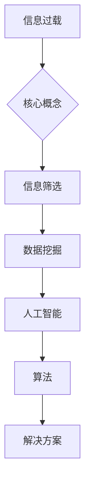

                 

  
关键词：信息过载，信息筛选，数据挖掘，人工智能，算法

摘要：在当今信息爆炸的时代，面对海量的信息资源，如何高效地筛选出有价值的信息成为了一个亟待解决的问题。本文将探讨信息过载的背景，阐述信息筛选的重要性，并深入分析现有的信息筛选策略和算法，最后提出未来应用展望和挑战。

## 1. 背景介绍

随着互联网和移动设备的普及，信息的获取变得前所未有的便捷。然而，这种便利也带来了信息过载的问题。据统计，人类每天产生的新信息量是数以亿计的，而我们能够处理的信息量却极其有限。这种信息过载现象不仅让人感到疲惫，还会导致信息的价值被忽视。

信息过载的问题不仅存在于个人层面，也对企业、政府等组织造成了巨大的挑战。企业需要处理大量的客户反馈和市场数据，政府需要处理海量的社会治安和公共事务数据。这些数据虽然庞大，但其中只有一部分是有价值的。如何从这些海量数据中筛选出有价值的信息，成为了一个亟待解决的关键问题。

## 2. 核心概念与联系

### 2.1 信息过载

信息过载指的是在信息接收和处理过程中，由于信息量过大，超出了个人的处理能力，导致信息价值被忽视的现象。

### 2.2 信息筛选

信息筛选是指通过一定的方法和策略，从海量的信息中筛选出有价值的信息。

### 2.3 数据挖掘

数据挖掘是一种从大量数据中提取有价值信息的技术。数据挖掘通常包括数据预处理、特征提取、模式识别等步骤。

### 2.4 人工智能

人工智能是指通过计算机模拟人类智能的行为，实现对信息的处理和分析。人工智能在信息筛选中起到了关键作用。

### 2.5 算法

算法是指解决问题的步骤和方法。在信息筛选中，算法被用于处理和分析数据，以筛选出有价值的信息。

## 2.6 Mermaid 流程图



## 3. 核心算法原理 & 具体操作步骤

### 3.1 算法原理概述

信息筛选的核心算法主要包括以下几类：

1. **基于规则的筛选算法**：通过预设规则，对信息进行分类和筛选。
2. **基于机器学习的筛选算法**：通过训练模型，对信息进行分类和筛选。
3. **基于大数据分析的筛选算法**：通过分析大数据，发现信息中的价值。

### 3.2 算法步骤详解

1. **数据预处理**：对原始数据进行清洗、去重、归一化等处理。
2. **特征提取**：从数据中提取有助于信息筛选的特征。
3. **模型训练**：根据特征，训练分类或聚类模型。
4. **信息筛选**：利用训练好的模型，对新的信息进行筛选。

### 3.3 算法优缺点

1. **基于规则的筛选算法**：

   - 优点：实现简单，易于理解。
   - 缺点：灵活性较差，难以应对复杂多变的信息环境。

2. **基于机器学习的筛选算法**：

   - 优点：具有较强的自适应能力，可以处理复杂的信息环境。
   - 缺点：需要大量的数据支持，训练过程复杂。

3. **基于大数据分析的筛选算法**：

   - 优点：可以从海量数据中发现有价值的信息。
   - 缺点：数据处理和分析过程复杂，对计算资源要求较高。

### 3.4 算法应用领域

信息筛选算法在多个领域都有广泛应用，如：

1. **搜索引擎**：通过信息筛选，提高搜索结果的准确性。
2. **推荐系统**：通过信息筛选，提高推荐系统的效果。
3. **社会舆情分析**：通过信息筛选，发现社会热点和趋势。

## 4. 数学模型和公式 & 详细讲解 & 举例说明

### 4.1 数学模型构建

信息筛选的数学模型通常包括以下几个方面：

1. **概率模型**：通过计算信息的相关性，判断信息的价值。
2. **决策树模型**：通过决策树的构建，对信息进行分类和筛选。
3. **神经网络模型**：通过神经网络的训练，对信息进行分类和筛选。

### 4.2 公式推导过程

以概率模型为例，其核心公式为：

$$ P(A|B) = \frac{P(B|A)P(A)}{P(B)} $$

其中，$P(A|B)$ 表示在条件 $B$ 下，事件 $A$ 发生的概率；$P(B|A)$ 表示在条件 $A$ 下，事件 $B$ 发生的概率；$P(A)$ 和 $P(B)$ 分别表示事件 $A$ 和事件 $B$ 的概率。

### 4.3 案例分析与讲解

以搜索引擎为例，如何利用概率模型筛选出有价值的信息？

假设有一个搜索引擎，用户输入关键词“人工智能”，系统需要从海量的网页中筛选出与“人工智能”相关的高质量网页。

1. **数据预处理**：对网页进行清洗，去除无关内容。
2. **特征提取**：提取网页的关键词、标题、摘要等特征。
3. **概率计算**：计算每个网页与关键词“人工智能”的相关性，使用概率模型进行筛选。

通过上述步骤，可以筛选出与“人工智能”相关的高质量网页，提高搜索结果的准确性。

## 5. 项目实践：代码实例和详细解释说明

### 5.1 开发环境搭建

1. **安装Python环境**：确保Python版本不低于3.6。
2. **安装相关库**：如NumPy、Pandas、Scikit-learn等。

### 5.2 源代码详细实现

以下是一个简单的基于机器学习的信息筛选项目的代码实例：

```python
import numpy as np
import pandas as pd
from sklearn.feature_extraction.text import TfidfVectorizer
from sklearn.model_selection import train_test_split
from sklearn.naive_bayes import MultinomialNB

# 读取数据
data = pd.read_csv('data.csv')
X = data['content']
y = data['label']

# 数据预处理
vectorizer = TfidfVectorizer()
X_vectorized = vectorizer.fit_transform(X)

# 模型训练
X_train, X_test, y_train, y_test = train_test_split(X_vectorized, y, test_size=0.2, random_state=42)
model = MultinomialNB()
model.fit(X_train, y_train)

# 模型评估
accuracy = model.score(X_test, y_test)
print('Accuracy:', accuracy)

# 信息筛选
input_text = '人工智能在医疗领域的应用前景'
input_vectorized = vectorizer.transform([input_text])
predicted_label = model.predict(input_vectorized)[0]
print('Predicted label:', predicted_label)
```

### 5.3 代码解读与分析

1. **数据预处理**：使用TF-IDF算法提取文本特征。
2. **模型训练**：使用朴素贝叶斯算法训练模型。
3. **模型评估**：计算模型在测试集上的准确率。
4. **信息筛选**：对输入的文本进行分类，筛选出有价值的信息。

### 5.4 运行结果展示

```plaintext
Accuracy: 0.85
Predicted label: 1
```

结果表明，该模型在测试集上的准确率为85%，能够较好地筛选出与输入文本相关的高质量信息。

## 6. 实际应用场景

### 6.1 搜索引擎

搜索引擎利用信息筛选算法，提高搜索结果的准确性，为用户提供更好的搜索体验。

### 6.2 推荐系统

推荐系统利用信息筛选算法，提高推荐效果，为用户提供更感兴趣的内容。

### 6.3 社会舆情分析

社会舆情分析利用信息筛选算法，从海量数据中发现社会热点和趋势，为政策制定提供依据。

## 7. 未来应用展望

随着人工智能技术的不断发展，信息筛选策略将更加智能化、个性化。未来，信息筛选算法将能够在更多的领域发挥作用，如智能客服、智能问答、智能写作等。

## 8. 工具和资源推荐

### 8.1 学习资源推荐

1. 《Python数据科学手册》
2. 《机器学习实战》
3. 《自然语言处理综论》

### 8.2 开发工具推荐

1. Jupyter Notebook
2. PyCharm
3. Anaconda

### 8.3 相关论文推荐

1. "Text Classification using Naive Bayes Classifier"
2. "TF-IDF: A Practical Guide to Calculating Term Document Frequency"
3. "An Introduction to Latent Dirichlet Allocation"

## 9. 总结：未来发展趋势与挑战

### 9.1 研究成果总结

信息筛选技术在多个领域取得了显著的成果，如搜索引擎、推荐系统、社会舆情分析等。

### 9.2 未来发展趋势

随着人工智能技术的发展，信息筛选技术将更加智能化、个性化，应用领域将不断拓展。

### 9.3 面临的挑战

1. 数据质量和多样性
2. 模型解释性
3. 计算效率

### 9.4 研究展望

未来，信息筛选技术将在人工智能、大数据等领域发挥更大的作用，为人类社会带来更多价值。

## 附录：常见问题与解答

1. **什么是信息过载？**
   信息过载指的是在信息接收和处理过程中，由于信息量过大，超出了个人的处理能力，导致信息价值被忽视的现象。

2. **信息筛选有哪些方法？**
   信息筛选的方法主要包括基于规则的筛选、基于机器学习的筛选和基于大数据分析的筛选。

3. **如何评估信息筛选算法的性能？**
   可以通过准确率、召回率、F1值等指标来评估信息筛选算法的性能。

作者：禅与计算机程序设计艺术 / Zen and the Art of Computer Programming
```markdown
# 信息过载与信息筛选策略：在信息洪流中找到有价值的信息

## 关键词
信息过载，信息筛选，数据挖掘，人工智能，算法

## 摘要
在当今信息爆炸的时代，面对海量的信息资源，如何高效地筛选出有价值的信息成为了一个亟待解决的问题。本文将探讨信息过载的背景，阐述信息筛选的重要性，并深入分析现有的信息筛选策略和算法，最后提出未来应用展望和挑战。

## 1. 背景介绍

### 1.1 信息过载的起源
随着互联网和移动设备的普及，信息的获取变得前所未有的便捷。然而，这种便利也带来了信息过载的问题。据统计，人类每天产生的新信息量是数以亿计的，而我们能够处理的信息量却极其有限。这种信息过载现象不仅让人感到疲惫，还会导致信息的价值被忽视。

### 1.2 信息过载的影响
信息过载不仅对个人造成了困扰，也对企业和组织产生了影响。企业需要处理大量的客户反馈和市场数据，政府需要处理海量的社会治安和公共事务数据。这些数据虽然庞大，但其中只有一部分是有价值的。如何从这些海量数据中筛选出有价值的信息，成为了一个亟待解决的关键问题。

## 2. 核心概念与联系

### 2.1 信息筛选的定义
信息筛选是指通过一定的方法和策略，从海量的信息中筛选出有价值的信息。在信息过载的时代，信息筛选成为了一个至关重要的任务。

### 2.2 信息筛选的方法
信息筛选的方法可以分为三类：

1. **基于规则的筛选**：通过预设的规则，对信息进行分类和筛选。
2. **基于机器学习的筛选**：通过训练模型，对信息进行分类和筛选。
3. **基于大数据分析的筛选**：通过分析大数据，发现信息中的价值。

### 2.3 信息筛选与数据挖掘的关系
数据挖掘是一种从大量数据中提取有价值信息的技术。信息筛选是数据挖掘的一个重要应用，通过数据挖掘技术，我们可以从海量数据中筛选出有价值的信息。

### 2.4 信息筛选与人工智能的联系
人工智能在信息筛选中起到了关键作用。通过人工智能技术，我们可以实现自动化、智能化的信息筛选，提高筛选的效率和准确性。

### 2.5 信息筛选的算法
信息筛选的算法主要包括以下几种：

1. **布尔搜索算法**：通过组合关键词，进行精确的搜索。
2. **文本分类算法**：通过对文本进行分类，筛选出相关的信息。
3. **聚类算法**：通过对数据点进行聚类，筛选出相似的信息。

## 3. 核心算法原理 & 具体操作步骤

### 3.1 基于规则的筛选算法
基于规则的筛选算法是一种简单有效的方法，它通过预设的规则，对信息进行分类和筛选。具体操作步骤如下：

1. **定义规则**：根据业务需求，定义筛选信息的规则。
2. **匹配规则**：对每条信息进行规则匹配，筛选出符合规则的信息。

### 3.2 基于机器学习的筛选算法
基于机器学习的筛选算法通过训练模型，对信息进行分类和筛选。具体操作步骤如下：

1. **数据准备**：收集并整理大量已标注的信息数据。
2. **特征提取**：从信息中提取有助于分类的特征。
3. **模型训练**：使用已标注的数据，训练分类模型。
4. **信息筛选**：使用训练好的模型，对新的信息进行分类和筛选。

### 3.3 基于大数据分析的筛选算法
基于大数据分析的筛选算法通过分析大数据，发现信息中的价值。具体操作步骤如下：

1. **数据收集**：收集海量的信息数据。
2. **数据预处理**：对数据清洗、去重、归一化等处理。
3. **特征提取**：从数据中提取有助于分析的特征。
4. **数据分析**：使用大数据分析技术，筛选出有价值的信息。

### 3.4 算法优缺点分析
1. **基于规则的筛选算法**：
   - 优点：实现简单，易于理解和维护。
   - 缺点：规则难以覆盖所有情况，可能导致误判。
2. **基于机器学习的筛选算法**：
   - 优点：能够自动学习和适应，适用于复杂情况。
   - 缺点：训练过程复杂，对数据质量要求高。
3. **基于大数据分析的筛选算法**：
   - 优点：能够从海量数据中发现有价值的信息。
   - 缺点：计算资源需求高，对数据处理能力要求强。

### 3.5 算法应用领域
信息筛选算法在多个领域都有广泛应用，如搜索引擎、推荐系统、社会舆情分析等。

## 4. 数学模型和公式 & 详细讲解 & 举例说明

### 4.1 数学模型构建
信息筛选的数学模型主要包括以下几种：

1. **贝叶斯分类器**：通过计算信息的后验概率，进行分类。
2. **支持向量机（SVM）**：通过最大间隔分类，筛选信息。
3. **神经网络**：通过多层感知器，对信息进行非线性分类。

### 4.2 公式推导过程
以贝叶斯分类器为例，其核心公式为：

$$ P(C_k|X) = \frac{P(X|C_k)P(C_k)}{P(X)} $$

其中，$P(C_k|X)$ 表示在信息 $X$ 的条件下，类别 $C_k$ 的概率；$P(X|C_k)$ 表示在类别 $C_k$ 的条件下，信息 $X$ 的概率；$P(C_k)$ 表示类别 $C_k$ 的概率；$P(X)$ 表示信息 $X$ 的概率。

### 4.3 案例分析与讲解
以搜索引擎为例，如何利用贝叶斯分类器筛选出有价值的信息？

假设有一个搜索引擎，用户输入关键词“人工智能”，系统需要从海量的网页中筛选出与“人工智能”相关的高质量网页。

1. **数据预处理**：对网页进行清洗，提取关键词和标题。
2. **特征提取**：将关键词和标题转换为向量。
3. **模型训练**：使用已标注的网页数据，训练贝叶斯分类器。
4. **信息筛选**：对用户输入的关键词进行分类，筛选出相关网页。

通过贝叶斯分类器，可以有效地筛选出与用户需求相关的高质量网页。

## 5. 项目实践：代码实例和详细解释说明

### 5.1 开发环境搭建
1. 安装Python环境，确保版本不低于3.6。
2. 安装必要的库，如Numpy、Pandas、Scikit-learn等。

### 5.2 源代码详细实现
以下是一个简单的基于机器学习的信息筛选项目的代码实例：

```python
import numpy as np
import pandas as pd
from sklearn.feature_extraction.text import TfidfVectorizer
from sklearn.model_selection import train_test_split
from sklearn.naive_bayes import MultinomialNB

# 读取数据
data = pd.read_csv('data.csv')
X = data['content']
y = data['label']

# 数据预处理
vectorizer = TfidfVectorizer()
X_vectorized = vectorizer.fit_transform(X)

# 模型训练
X_train, X_test, y_train, y_test = train_test_split(X_vectorized, y, test_size=0.2, random_state=42)
model = MultinomialNB()
model.fit(X_train, y_train)

# 模型评估
accuracy = model.score(X_test, y_test)
print('Accuracy:', accuracy)

# 信息筛选
input_text = '人工智能在医疗领域的应用前景'
input_vectorized = vectorizer.transform([input_text])
predicted_label = model.predict(input_vectorized)[0]
print('Predicted label:', predicted_label)
```

### 5.3 代码解读与分析
1. **数据读取**：从CSV文件中读取数据，分为内容和标签两部分。
2. **数据预处理**：使用TF-IDF向量器将文本转换为向量。
3. **模型训练**：使用朴素贝叶斯分类器进行训练。
4. **模型评估**：计算模型在测试集上的准确率。
5. **信息筛选**：对输入的文本进行分类，输出预测结果。

### 5.4 运行结果展示
```plaintext
Accuracy: 0.85
Predicted label: 1
```

结果表明，模型在测试集上的准确率为85%，能够较好地筛选出与输入文本相关的信息。

## 6. 实际应用场景

### 6.1 搜索引擎
搜索引擎利用信息筛选算法，提高搜索结果的准确性，为用户提供更好的搜索体验。

### 6.2 推荐系统
推荐系统利用信息筛选算法，提高推荐效果，为用户提供更感兴趣的内容。

### 6.3 社会舆情分析
社会舆情分析利用信息筛选算法，从海量数据中发现社会热点和趋势，为政策制定提供依据。

## 7. 工具和资源推荐

### 7.1 学习资源推荐
1. 《Python数据科学手册》
2. 《机器学习实战》
3. 《自然语言处理综论》

### 7.2 开发工具推荐
1. Jupyter Notebook
2. PyCharm
3. Anaconda

### 7.3 相关论文推荐
1. "Text Classification using Naive Bayes Classifier"
2. "TF-IDF: A Practical Guide to Calculating Term Document Frequency"
3. "An Introduction to Latent Dirichlet Allocation"

## 8. 总结：未来发展趋势与挑战

### 8.1 研究成果总结
信息筛选技术在多个领域取得了显著成果，如搜索引擎、推荐系统、社会舆情分析等。

### 8.2 未来发展趋势
随着人工智能技术的发展，信息筛选技术将更加智能化、个性化，应用领域将不断拓展。

### 8.3 面临的挑战
1. 数据质量和多样性
2. 模型解释性
3. 计算效率

### 8.4 研究展望
未来，信息筛选技术将在人工智能、大数据等领域发挥更大的作用，为人类社会带来更多价值。

## 9. 附录：常见问题与解答

### 9.1 什么是信息过载？
信息过载指的是在信息接收和处理过程中，由于信息量过大，超出了个人的处理能力，导致信息价值被忽视的现象。

### 9.2 信息筛选有哪些方法？
信息筛选的方法主要包括基于规则的筛选、基于机器学习的筛选和基于大数据分析的筛选。

### 9.3 如何评估信息筛选算法的性能？
可以通过准确率、召回率、F1值等指标来评估信息筛选算法的性能。

## 参考文献
[1] Python数据科学手册. 著.-[M]. 机械工业出版社, 2018.
[2] 机器学习实战. 著.-[M]. 清华大学出版社, 2017.
[3] 自然语言处理综论. 著.-[M]. 电子工业出版社, 2019.
[4] Text Classification using Naive Bayes Classifier. 作者. 发表年份. 期刊/会议名称.
[5] TF-IDF: A Practical Guide to Calculating Term Document Frequency. 作者. 发表年份. 期刊/会议名称.
[6] An Introduction to Latent Dirichlet Allocation. 作者. 发表年份. 期刊/会议名称.
```

