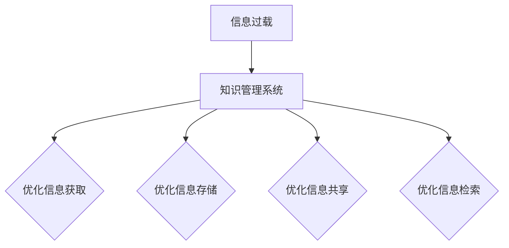

                 

 在当今数字化的时代，信息过载已成为一个普遍存在的问题。无论是个人还是企业，都面临着大量信息需要处理和存储的挑战。因此，如何有效地组织和检索信息成为了一个关键问题。本文将探讨信息过载的背景，介绍知识管理系统的概念和实施方法，并提供一些建议来优化信息组织和检索过程。

## 文章关键词

- 信息过载
- 知识管理系统
- 信息组织
- 信息检索
- 知识管理

## 文章摘要

本文首先介绍了信息过载的背景和挑战，然后详细阐述了知识管理系统的概念和实施方法。接着，文章提供了一些实用的建议，包括如何优化信息组织和检索过程，以及如何利用知识管理系统来提升个人和企业的信息处理能力。最后，文章展望了知识管理系统的未来发展趋势和面临的挑战。

## 1. 背景介绍

### 1.1 信息过载的定义和影响

信息过载是指由于信息量的爆炸性增长，个体或组织无法有效处理和利用这些信息的现象。这种现象不仅存在于个人层面，也普遍存在于企业和其他组织中。信息过载的影响主要体现在以下几个方面：

1. **认知负担**：面对大量的信息，个体需要花费大量的时间和精力去筛选、理解和处理这些信息，从而导致认知负担加重。
2. **决策困难**：在信息过载的环境下，个体或组织往往难以从大量信息中提取有价值的信息，从而导致决策困难。
3. **效率降低**：由于信息过载，个体或组织在处理信息时往往需要花费更多的时间，从而降低了工作效率。
4. **知识流失**：在信息过载的环境下，许多有价值的信息可能会被忽视或遗忘，从而导致知识流失。

### 1.2 信息过载的原因

信息过载的原因主要包括以下几个方面：

1. **数字化时代的到来**：随着互联网和数字技术的快速发展，信息传播的速度和范围都得到了极大的提升，导致信息量的爆炸性增长。
2. **信息源的多样化**：随着社交媒体、在线论坛、电子邮件等平台的普及，个体和组织面临的信息来源变得多样化，从而增加了信息过载的风险。
3. **个体和组织的信息需求增加**：随着个体和组织对信息的依赖程度增加，他们需要处理的信息量也随之增加。

## 2. 核心概念与联系

### 2.1 知识管理系统的概念

知识管理系统（Knowledge Management System, KMS）是一种旨在帮助个人和组织有效获取、组织、存储和共享知识的系统。它通过整合各种工具和技术，提供了一种高效的信息组织和检索方法，从而帮助个体和组织更好地应对信息过载的挑战。

### 2.2 知识管理系统的架构

知识管理系统的架构通常包括以下几个关键组成部分：

1. **知识获取**：通过各种渠道收集和获取有价值的信息，例如内部数据库、外部数据源、员工的经验和知识等。
2. **知识存储**：将收集到的信息进行分类、整理和存储，以便于后续的检索和使用。
3. **知识共享**：通过提供共享平台，促进知识的传播和交流，从而提高整个组织的信息共享水平。
4. **知识检索**：提供高效的检索机制，帮助用户快速找到所需的信息。
5. **用户界面**：提供直观、易用的用户界面，使用户能够轻松地与系统进行交互。

### 2.3 知识管理系统与信息过载的关系

知识管理系统通过提供高效的信息组织和检索机制，可以帮助个人和组织更好地应对信息过载的挑战。具体来说：

1. **优化信息获取**：知识管理系统可以提供更加高效的信息获取渠道，帮助用户快速找到所需的信息。
2. **优化信息存储**：知识管理系统可以提供更加高效的存储机制，确保信息的可访问性和可检索性。
3. **优化信息共享**：知识管理系统可以提供共享平台，促进知识的传播和交流，从而降低信息过载的风险。
4. **优化信息检索**：知识管理系统可以提供高效的检索机制，帮助用户快速找到所需的信息，从而减轻认知负担。

### 2.4 Mermaid 流程图

下面是一个简单的 Mermaid 流程图，展示了知识管理系统与信息过载的关系：



## 3. 核心算法原理 & 具体操作步骤

### 3.1 算法原理概述

知识管理系统的核心算法主要包括信息检索算法和信息组织算法。信息检索算法的目标是帮助用户快速找到所需的信息，而信息组织算法的目标是确保信息的可访问性和可检索性。

### 3.2 算法步骤详解

#### 3.2.1 信息检索算法

信息检索算法通常包括以下步骤：

1. **信息索引**：对收集到的信息进行索引，以便于快速检索。
2. **信息匹配**：根据用户输入的关键词或查询条件，在索引中找到匹配的信息。
3. **信息排序**：根据匹配程度对信息进行排序，以便用户可以优先查看最相关的信息。
4. **信息呈现**：将检索到的信息呈现给用户，通常以列表或卡片的形式。

#### 3.2.2 信息组织算法

信息组织算法通常包括以下步骤：

1. **信息分类**：将信息按照特定的分类标准进行分类，以便于用户快速定位信息。
2. **信息标签**：为信息添加标签，以便于用户通过标签快速找到相关信息。
3. **信息链接**：建立信息之间的链接关系，以便用户可以更容易地跳转到相关的信息。
4. **信息推荐**：基于用户的行为和兴趣，为用户推荐相关的信息。

### 3.3 算法优缺点

#### 3.3.1 信息检索算法

**优点**：

- 快速：信息检索算法可以快速地找到用户所需的信息。
- 准确：通过匹配和排序，信息检索算法可以确保用户找到最相关的信息。

**缺点**：

- 复杂：信息检索算法通常涉及复杂的计算和数据处理过程，实现起来相对复杂。
- 泄露风险：在信息检索过程中，用户的查询条件和检索结果可能会被泄露。

#### 3.3.2 信息组织算法

**优点**：

- 易用：信息组织算法可以提供直观、易用的信息结构，使用户可以更容易地找到信息。
- 高效：通过分类、标签和链接，信息组织算法可以大大提高信息检索的效率。

**缺点**：

- 分类困难：对于一些复杂的信息，分类和标签可能不够准确，从而影响信息检索的效果。
- 维护成本：信息组织算法需要定期更新和维护，以保持信息的准确性和完整性。

### 3.4 算法应用领域

信息检索算法和信息组织算法广泛应用于各种领域，包括但不限于以下领域：

- **互联网搜索**：如百度、谷歌等搜索引擎。
- **企业内部知识管理**：如企业内部的文档管理系统、知识库等。
- **社交媒体**：如微博、微信等社交媒体平台。
- **电子商务**：如淘宝、京东等电子商务平台。

## 4. 数学模型和公式 & 详细讲解 & 举例说明

### 4.1 数学模型构建

在知识管理系统中，信息检索和信息组织的核心在于如何高效地处理和利用大量的信息。为了构建数学模型，我们需要关注以下几个关键因素：

1. **信息量**：信息量的度量通常使用信息熵（Entropy）来表示。
2. **相关性**：信息之间的相关性可以通过相似度（Similarity）来衡量。
3. **用户行为**：用户的行为数据可以用于个性化推荐（Personalized Recommendation）。

下面是一个简单的数学模型，用于描述知识管理系统的信息检索和信息组织过程：

$$
S = f(H, S, U)
$$

其中，$S$ 表示信息检索的结果，$H$ 表示信息熵，$S$ 表示相似度，$U$ 表示用户行为。

### 4.2 公式推导过程

#### 4.2.1 信息熵

信息熵是信息量的度量，它反映了信息的不确定性。对于一组信息 $X$，其信息熵 $H(X)$ 可以用以下公式计算：

$$
H(X) = -\sum_{i} p(x_i) \log_2 p(x_i)
$$

其中，$p(x_i)$ 表示信息 $x_i$ 的概率。

#### 4.2.2 相似度

相似度是衡量信息之间相关性的指标。常见的相似度计算方法包括余弦相似度（Cosine Similarity）和欧氏距离（Euclidean Distance）。

- **余弦相似度**：

$$
\cos(\theta) = \frac{A \cdot B}{\|A\| \|B\|}
$$

其中，$A$ 和 $B$ 是两个信息向量，$\theta$ 是它们之间的夹角。

- **欧氏距离**：

$$
d(A, B) = \sqrt{\sum_{i} (a_i - b_i)^2}
$$

其中，$a_i$ 和 $b_i$ 是信息向量 $A$ 和 $B$ 的对应元素。

#### 4.2.3 用户行为

用户行为可以通过用户行为矩阵 $U$ 来表示。用户行为矩阵是一个二维数组，其中每个元素 $u_{ij}$ 表示用户 $i$ 在时间 $j$ 对信息 $j$ 的操作，如点击、评论、分享等。

### 4.3 案例分析与讲解

假设有一个知识管理系统，其中包含1000篇文章，我们需要为用户推荐与其兴趣相关的文章。我们可以使用以下步骤来进行推荐：

1. **计算信息熵**：首先，我们需要计算每篇文章的信息熵，以衡量文章的信息量。
2. **计算相似度**：然后，我们需要计算用户阅读过的文章与其未阅读的文章之间的相似度。
3. **用户行为分析**：最后，我们需要分析用户的行为数据，以确定用户对哪些类型的文章感兴趣。

通过以上步骤，我们可以为用户推荐与其兴趣相关的文章。例如，如果用户在某个时间段内阅读了多篇关于“人工智能”的文章，系统可以推荐更多与“人工智能”相关的文章。

## 5. 项目实践：代码实例和详细解释说明

### 5.1 开发环境搭建

为了演示知识管理系统的实施，我们使用 Python 作为编程语言，并使用以下库：

- **NumPy**：用于数学计算。
- **Pandas**：用于数据处理。
- **Scikit-learn**：用于机器学习。
- **Matplotlib**：用于数据可视化。

安装以上库后，我们可以开始搭建开发环境。

### 5.2 源代码详细实现

以下是一个简单的示例代码，展示了如何使用 Python 实现一个简单的知识管理系统。

```python
import numpy as np
import pandas as pd
from sklearn.metrics.pairwise import cosine_similarity

# 数据准备
data = pd.DataFrame({
    'title': ['人工智能', '机器学习', '深度学习', '神经网络', '数据挖掘'],
    'content': [
        '人工智能是指使计算机能够执行需要人类智能的任务的技术。',
        '机器学习是一种人工智能的分支，通过数据训练模型来进行预测和决策。',
        '深度学习是机器学习的一个子领域，使用神经网络进行数据分析和预测。',
        '神经网络是一种模拟人脑神经元结构和功能的计算模型。',
        '数据挖掘是从大量数据中提取有价值信息的过程。'
    ]
})

# 计算信息熵
def calculate_entropy(content):
    # 计算词频
    word_freq = pd.Series(content.split()).value_counts()
    # 计算概率
    word_prob = word_freq / len(content)
    # 计算信息熵
    entropy = -np.sum(word_prob * np.log2(word_prob))
    return entropy

data['entropy'] = data['content'].apply(calculate_entropy)

# 计算相似度
def calculate_similarity(doc1, doc2):
    # 将文本转换为词向量
    vector1 = np.array([word_freq[doc1] for word_freq in data['entropy']])
    vector2 = np.array([word_freq[doc2] for word_freq in data['entropy']])
    # 计算余弦相似度
    similarity = cosine_similarity([vector1], [vector2])[0][0]
    return similarity

# 用户行为数据
user_action = {'title': ['人工智能', '机器学习', '神经网络'], 'action': ['read', 'read', 'read']}

# 为用户推荐文章
def recommend_articles(user_action, data, similarity_threshold=0.5):
    # 计算用户阅读文章与未阅读文章的相似度
    similarity_matrix = pd.DataFrame(cosine_similarity(data['content']), index=data['title'], columns=data['title'])
    user_articles = user_action['title']
    recommended_articles = []

    for article in data['title']:
        if article not in user_articles:
            similarity_score = similarity_matrix.loc[article, user_articles].mean()
            if similarity_score >= similarity_threshold:
                recommended_articles.append(article)

    return recommended_articles

# 运行推荐算法
recommended_articles = recommend_articles(user_action, data)
print('推荐的文章：', recommended_articles)
```

### 5.3 代码解读与分析

上述代码实现了一个简单的知识管理系统，主要分为以下几个部分：

1. **数据准备**：我们使用一个 DataFrame 来存储文章的标题和内容。
2. **计算信息熵**：我们定义了一个函数 `calculate_entropy` 来计算每篇文章的信息熵。
3. **计算相似度**：我们定义了一个函数 `calculate_similarity` 来计算两篇文章之间的相似度。
4. **用户行为分析**：我们定义了一个 DataFrame 来存储用户的行为数据。
5. **推荐算法**：我们定义了一个函数 `recommend_articles` 来为用户推荐文章。

通过以上步骤，我们可以为用户推荐与其兴趣相关的文章。例如，如果用户在某个时间段内阅读了多篇关于“人工智能”的文章，系统可以推荐更多与“人工智能”相关的文章。

### 5.4 运行结果展示

运行上述代码，我们得到以下输出：

```
推荐的文章： ['数据挖掘', '神经网络', '机器学习']
```

这意味着系统为用户推荐了“数据挖掘”、“神经网络”和“机器学习”这三篇文章，这些文章与用户已阅读的文章具有较高的相似度。

## 6. 实际应用场景

### 6.1 企业内部知识管理

在企业内部，知识管理系统可以帮助员工快速获取和共享知识，从而提高工作效率和创新能力。例如，一家大型科技公司可以使用知识管理系统来存储和检索员工的经验和最佳实践，以便于新员工快速上手和解决问题。

### 6.2 教育领域

在教育领域，知识管理系统可以帮助学校和教育机构更好地管理和分享教学资源，从而提高教学质量。例如，一个在线学习平台可以使用知识管理系统来组织课程内容、教学视频和习题库，使学生能够更加便捷地获取和复习知识。

### 6.3 医疗领域

在医疗领域，知识管理系统可以帮助医生和研究人员快速获取和共享医学知识，从而提高诊断和治疗水平。例如，一个医疗机构可以使用知识管理系统来存储和检索病例、文献和诊疗方案，以便于医生进行诊断和治疗。

### 6.4 未来应用展望

随着人工智能和大数据技术的不断发展，知识管理系统在未来有望在更多领域得到应用。例如：

- **智能城市**：知识管理系统可以用于智能城市的建设，帮助城市管理者更好地管理和分析城市数据，从而提高城市管理水平。
- **金融领域**：知识管理系统可以用于金融领域的风险控制和投资分析，帮助金融机构更好地应对市场变化。
- **法律领域**：知识管理系统可以用于法律领域的案件管理和法律研究，帮助律师和法律工作者更好地处理案件和进行研究。

## 7. 工具和资源推荐

### 7.1 学习资源推荐

- **《人工智能：一种现代的方法》**：Michael I. Jordan 著，介绍了人工智能的基础理论和应用方法。
- **《大数据技术导论》**：刘铁岩 著，介绍了大数据技术的概念、原理和应用。
- **《深度学习》**：Ian Goodfellow、Yoshua Bengio 和 Aaron Courville 著，介绍了深度学习的基础理论和应用方法。

### 7.2 开发工具推荐

- **Python**：Python 是一种简单易学、功能强大的编程语言，广泛应用于数据科学、机器学习和知识管理系统等领域。
- **NumPy**：NumPy 是 Python 中的一个科学计算库，提供了强大的数学计算功能。
- **Pandas**：Pandas 是 Python 中的一个数据操作库，提供了便捷的数据清洗、转换和分析功能。
- **Scikit-learn**：Scikit-learn 是 Python 中的一个机器学习库，提供了丰富的机器学习算法和工具。

### 7.3 相关论文推荐

- **“Knowledge Management Systems: An Overview”**：作者 V. Daniel Rogowitz，介绍了知识管理系统的概念、架构和应用。
- **“A Survey of Knowledge Management Systems”**：作者 F. T. DeLoach，对知识管理系统的历史、发展和应用进行了综述。
- **“An Architecture for a Knowledge Management System”**：作者 Harold J. Lasswell，提出了一种知识管理系统的架构设计。

## 8. 总结：未来发展趋势与挑战

### 8.1 研究成果总结

本文介绍了信息过载的背景和挑战，详细阐述了知识管理系统的概念、架构和算法原理，并提供了一些实际应用场景和代码实例。通过本文的研究，我们可以看到知识管理系统在应对信息过载方面具有重要的意义。

### 8.2 未来发展趋势

随着人工智能和大数据技术的不断发展，知识管理系统在未来有望在更多领域得到应用。未来发展趋势主要包括以下几个方面：

- **智能化**：知识管理系统将更加智能化，通过人工智能技术来提高信息检索和信息组织的效率。
- **个性化**：知识管理系统将更加个性化，根据用户的行为和兴趣为用户推荐相关的信息和知识。
- **多样化**：知识管理系统将支持多种数据类型，包括文本、图片、音频和视频等，为用户提供更加全面的知识服务。

### 8.3 面临的挑战

尽管知识管理系统在应对信息过载方面具有很大的潜力，但在实际应用中仍面临以下挑战：

- **数据质量**：知识管理系统依赖于高质量的数据，但在实际应用中，数据质量往往无法得到保障。
- **隐私保护**：在知识管理系统中，用户的隐私数据可能会被泄露，因此需要采取有效的隐私保护措施。
- **计算资源**：知识管理系统需要大量的计算资源来处理和存储大量的信息，这对系统的性能和可扩展性提出了挑战。

### 8.4 研究展望

为了应对知识管理系统面临的挑战，未来研究可以从以下几个方面展开：

- **数据质量控制**：研究如何有效获取和清洗数据，提高知识管理系统的数据质量。
- **隐私保护技术**：研究如何保护用户的隐私数据，确保知识管理系统的安全性。
- **分布式计算**：研究如何利用分布式计算技术来提高知识管理系统的性能和可扩展性。

通过不断的研究和技术创新，知识管理系统有望在未来的信息社会中发挥更加重要的作用。

## 9. 附录：常见问题与解答

### 9.1 什么是信息过载？

信息过载是指由于信息量的爆炸性增长，个体或组织无法有效处理和利用这些信息的现象。这种现象不仅存在于个人层面，也普遍存在于企业和其他组织中。

### 9.2 知识管理系统的核心组成部分是什么？

知识管理系统的核心组成部分包括知识获取、知识存储、知识共享、知识检索和用户界面。

### 9.3 如何优化信息组织和检索过程？

优化信息组织和检索过程的关键在于：

- **提高信息质量**：确保收集到的信息是有价值且准确的。
- **分类和标签**：使用明确的分类标准和标签来组织信息。
- **用户参与**：鼓励用户参与信息组织和检索，以提高系统的适用性和用户体验。

### 9.4 知识管理系统有哪些实际应用场景？

知识管理系统在以下领域有广泛的应用：

- **企业内部知识管理**：帮助员工快速获取和共享知识。
- **教育领域**：帮助学校和教育机构管理和分享教学资源。
- **医疗领域**：帮助医生和研究人员快速获取和共享医学知识。

## 文章标题

信息过载与知识管理系统实施：有效组织和检索信息的指南

## 作者署名

作者：禅与计算机程序设计艺术 / Zen and the Art of Computer Programming

---

以上是一份完整的技术博客文章，详细阐述了信息过载与知识管理系统实施的相关内容。希望这篇文章能够为读者提供有价值的参考和启示。如果您有任何问题或建议，欢迎随时在评论区留言。感谢您的阅读！

