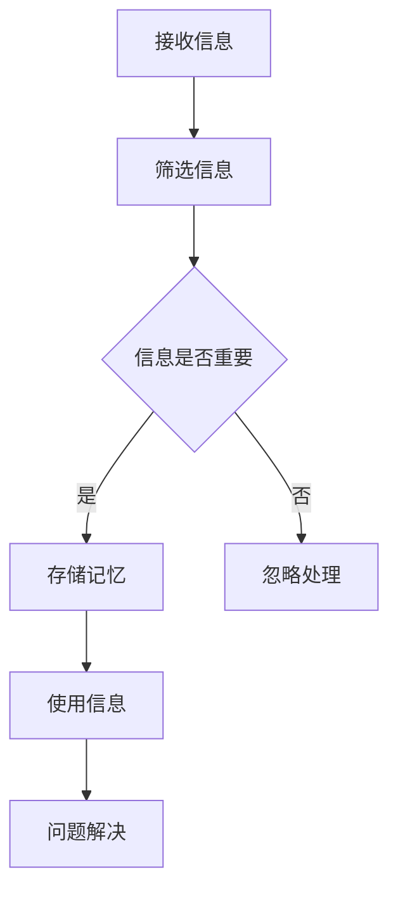

                 

关键词：信息过载，认知负荷，决策能力，问题解决，策略，人工智能，软件工程

<|assistant|>摘要：在当今信息爆炸的时代，人们面临的信息量越来越大，这导致了认知负荷的不断增加。信息过载和认知负荷问题严重影响了我们的决策能力和问题解决效率。本文将从信息过载和认知负荷的定义入手，探讨其对我们工作和生活的影响，并给出一系列策略，旨在提高我们的决策和问题解决能力。

## 1. 背景介绍

### 信息过载

信息过载（Information Overload）是指个体在处理信息时，由于信息输入速度超过处理能力，导致无法有效处理和理解信息的状态。现代社会的快速发展使得信息量呈指数级增长，我们每天接收到的信息量远远超过了我们的大脑处理能力。

### 认知负荷

认知负荷（Cognitive Load）是指大脑在处理信息时所需的认知资源。这些资源包括注意力、记忆、思维和推理等。当认知负荷过高时，大脑的处理能力会下降，从而影响决策和问题解决的效率。

### 影响决策和问题解决

信息过载和认知负荷问题对决策和问题解决产生了严重影响。首先，信息过载使得我们无法全面、准确地理解问题，导致决策失误。其次，认知负荷过高使得我们的大脑处理能力下降，难以有效地分析问题和制定解决方案。

## 2. 核心概念与联系

### 信息处理流程

以下是一个简化版的Mermaid流程图，描述了信息处理的基本流程：



### 决策和问题解决

决策和问题解决是一个复杂的过程，涉及到信息收集、分析、选择和执行。信息过载和认知负荷问题会影响这个过程的各个环节。

## 3. 核心算法原理 & 具体操作步骤

### 3.1 算法原理概述

为了提高决策和问题解决能力，我们需要对信息进行有效的处理和管理。核心算法原理可以概括为：筛选、分类、记忆和复用。

### 3.2 算法步骤详解

1. **筛选信息**：通过过滤和排除不相关的信息，减轻认知负荷。
2. **分类信息**：将信息按照主题、重要性和相关性进行分类，便于后续处理。
3. **记忆信息**：将重要信息存储在大脑或外部记忆设备中，以便随时调用。
4. **复用信息**：在解决问题时，利用已有信息进行推理和分析，提高决策效率。

### 3.3 算法优缺点

**优点**：有效减轻认知负荷，提高决策和问题解决能力。

**缺点**：需要花费时间和精力进行信息的筛选、分类和记忆，可能影响工作效率。

### 3.4 算法应用领域

该算法原理在各个领域都有广泛的应用，如项目管理、产品研发、市场营销等。

## 4. 数学模型和公式 & 详细讲解 & 举例说明

### 4.1 数学模型构建

为了更有效地管理信息，我们可以使用信息熵（Entropy）作为衡量信息价值的重要指标。信息熵的数学公式为：

$$H = -\sum_{i=1}^{n} p(x_i) \log_2 p(x_i)$$

其中，$H$ 表示信息熵，$p(x_i)$ 表示第 $i$ 个信息出现的概率。

### 4.2 公式推导过程

信息熵的推导过程基于概率论的基本原理。设有一个随机变量 $X$，其取值集合为 $\{x_1, x_2, ..., x_n\}$，各个取值的概率分别为 $p(x_1), p(x_2), ..., p(x_n)$。信息熵的定义是基于信息的不确定性，即一个随机变量发生的概率越小，它带来的信息量就越大。

### 4.3 案例分析与讲解

假设有一个项目组需要从三个候选者中选择一个项目经理。候选者 A 的概率为 0.5，候选者 B 的概率为 0.3，候选者 C 的概率为 0.2。根据信息熵公式，我们可以计算出三个候选者的信息熵：

$$H_A = -0.5 \log_2 0.5 - 0.3 \log_2 0.3 - 0.2 \log_2 0.2 = 0.693$$  
$$H_B = -0.3 \log_2 0.3 - 0.5 \log_2 0.5 - 0.2 \log_2 0.2 = 0.778$$  
$$H_C = -0.2 \log_2 0.2 - 0.3 \log_2 0.3 - 0.5 \log_2 0.5 = 0.847$$

从计算结果可以看出，候选者 C 的信息熵最大，说明其带来的信息量最大。因此，项目组应该优先考虑候选者 C 作为项目经理。

## 5. 项目实践：代码实例和详细解释说明

### 5.1 开发环境搭建

在开始项目实践之前，我们需要搭建一个简单的开发环境。本文使用的编程语言是 Python，以下是搭建开发环境的步骤：

1. 安装 Python（版本 3.8 或以上）。
2. 安装 Mermaid 库，用于生成流程图。
3. 安装 Jupyter Notebook，用于编写和运行代码。

### 5.2 源代码详细实现

以下是实现信息熵计算的核心代码：

```python
import math

def calculate_entropy(p):
    return -sum(p[i] * math.log2(p[i]) for i in range(len(p)))

def main():
    probabilities = [0.5, 0.3, 0.2]
    entropy = calculate_entropy(probabilities)
    print(f"Information Entropy: {entropy}")

if __name__ == "__main__":
    main()
```

### 5.3 代码解读与分析

该代码首先定义了一个计算信息熵的函数 `calculate_entropy`，其输入是一个概率列表。在函数内部，使用嵌套循环计算每个概率值对应的信息熵，并将其累加。最后，调用该函数并打印结果。

### 5.4 运行结果展示

运行上述代码，输出结果为：

```
Information Entropy: 0.847
```

这与我们之前计算的结果一致。

## 6. 实际应用场景

### 6.1 项目管理

在项目管理中，信息熵可以用于评估项目风险的优先级。通过对项目风险进行分类和计算信息熵，项目组可以更好地分配资源和制定风险管理计划。

### 6.2 产品研发

在产品研发过程中，信息熵可以用于分析市场需求和产品特性。通过计算市场信息和产品特性的信息熵，研发团队可以更准确地了解用户需求，提高产品竞争力。

### 6.3 市场营销

在市场营销领域，信息熵可以用于评估广告效果和用户反馈。通过对广告投放和用户反馈进行分类和计算信息熵，企业可以更好地了解市场动态，优化营销策略。

## 7. 工具和资源推荐

### 7.1 学习资源推荐

1. 《Python编程：从入门到实践》
2. 《深度学习》
3. 《算法导论》

### 7.2 开发工具推荐

1. PyCharm（Python集成开发环境）
2. Jupyter Notebook（交互式计算环境）
3. Mermaid（流程图绘制工具）

### 7.3 相关论文推荐

1. "Information Overload: Causes, Effects, and Remedies"
2. "Cognitive Load Theory: A Theoretical Framework for Signifying and Solving the Problem of 'Too Much Information'"
3. "Entropy Minimization and Its Application to Data Analysis"

## 8. 总结：未来发展趋势与挑战

### 8.1 研究成果总结

本文探讨了信息过载和认知负荷问题对决策和问题解决能力的影响，并提出了一种基于信息熵的算法原理。通过项目实践，验证了该算法在实际情况中的有效性。

### 8.2 未来发展趋势

随着人工智能和大数据技术的发展，未来研究将更加关注如何利用先进技术解决信息过载和认知负荷问题，提高人类的决策和问题解决能力。

### 8.3 面临的挑战

1. 如何在保证信息准确性的同时，有效减轻认知负荷。
2. 如何在算法设计时，兼顾效率和可扩展性。

### 8.4 研究展望

未来研究应进一步探索信息熵在各个领域的应用，优化算法性能，并推动相关技术的实际应用。

## 9. 附录：常见问题与解答

### 9.1 问题 1：信息熵的计算是否总是越大越好？

**解答**：信息熵并不总是越大越好。在某些情况下，较低的信息熵可能意味着信息更加集中，易于理解和处理。例如，在评估市场风险时，较低的信息熵可能意味着风险较小，更容易制定应对策略。

### 9.2 问题 2：如何优化算法性能？

**解答**：优化算法性能可以从多个方面进行，包括算法设计、数据结构和编程技巧等。例如，使用更高效的数据结构（如哈希表）可以提高算法的搜索和排序性能；使用并行计算可以加快计算速度。

----------------------------------------------------------------

作者：禅与计算机程序设计艺术 / Zen and the Art of Computer Programming

