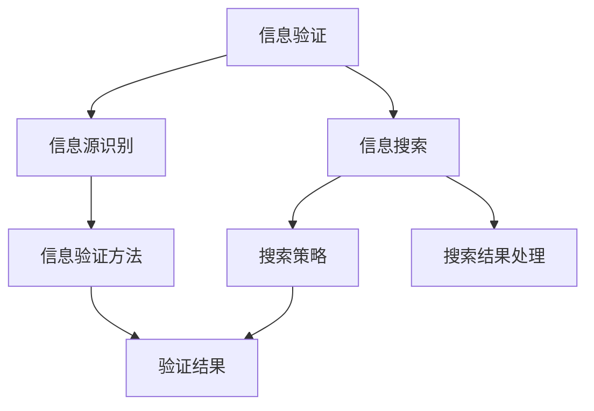

                 

### 关键词 Keywords

- 信息验证
- 信息搜索
- 可靠信息获取
- 搜索引擎技术
- 数据挖掘
- 信息过滤
- 人工智能
- 自然语言处理

<|assistant|>### 摘要 Abstract

本文旨在探讨信息验证和信息搜索技术，这些技术在当今信息爆炸的时代尤为重要。本文首先介绍了信息验证的基本概念、目的和方法，接着深入分析了信息搜索的技术原理、策略和应用。通过具体的算法原理、数学模型以及项目实践，本文展示了如何从海量信息中找到可靠且有价值的信息。最后，本文提出了未来信息验证和信息搜索技术的发展趋势和面临的挑战，并展望了相关领域的研究方向。

## 1. 背景介绍

在互联网和大数据时代，信息的获取变得前所未有的便捷，但同时也带来了信息过载的问题。海量的信息中，既有真实可靠的内容，也有虚假、错误甚至有害的信息。这种信息环境对于个人、企业和整个社会都构成了严峻的挑战。

### 1.1 信息过载与信息验证需求

信息过载是指个体在处理信息时遇到的信息量超过其处理能力。随着互联网的发展，人们每天接触到的信息量呈指数级增长。据估算，人类每天产生的数据量已经超过了5EB（艾字节），即5亿TB。在这种背景下，如何从海量的信息中筛选出有用、可靠的信息成为了一个亟待解决的问题。

信息验证是指对信息的真实性、准确性和可靠性进行检验和确认的过程。信息验证的需求源于以下几个方面：

1. **提高决策质量**：在商业、科研、医疗等领域，依赖可靠的信息才能做出正确的决策。
2. **防止误导**：在社交媒体、新闻报道等场合，错误信息可能会造成公众误解，影响社会稳定。
3. **保障隐私**：在网络安全和个人隐私保护方面，验证信息的来源和真实性是防止隐私泄露的重要手段。

### 1.2 信息搜索的重要性

信息搜索是获取信息的重要手段，通过搜索引擎、数据库等工具，用户可以快速定位到所需的信息。随着搜索引擎技术的不断进步，信息搜索的效率和准确性得到了显著提升。信息搜索的重要性体现在以下几个方面：

1. **知识获取**：通过搜索引擎，用户可以快速获取所需的学术知识、技术资料等。
2. **商业应用**：企业在市场调研、客户数据分析等方面，依赖于信息搜索来获取市场信息。
3. **科学研究**：科研人员通过搜索相关文献，可以快速了解研究领域的最新进展。

## 2. 核心概念与联系

### 2.1 信息验证的概念

信息验证是指对信息的真实性、准确性、完整性和可靠性进行确认的过程。信息验证的核心目标是确保用户获取的信息是真实且可靠的。

### 2.2 信息搜索的概念

信息搜索是指通过各种手段从海量信息中查找所需信息的过程。信息搜索主要包括基于关键词的搜索、基于内容的搜索和基于图谱的搜索等。

### 2.3 信息验证和信息搜索的联系

信息验证和信息搜索密切相关，信息验证是信息搜索的基础，确保搜索结果的真实性和可靠性。而信息搜索则为信息验证提供了对象和场景，通过搜索获取的信息需要经过验证，才能被用户信任和使用。

### 2.4 Mermaid 流程图



## 3. 核心算法原理 & 具体操作步骤

### 3.1 算法原理概述

信息验证和信息搜索的核心算法主要包括以下几种：

1. **信息验证算法**：包括人工验证、自动化验证、区块链验证等。
2. **信息搜索算法**：包括基于关键词的搜索、基于内容的搜索、基于语义的搜索等。

### 3.2 算法步骤详解

#### 3.2.1 信息验证步骤

1. **信息源识别**：确定信息的来源和发布者。
2. **信息内容验证**：检查信息内容的真实性、准确性和完整性。
3. **信息可靠性评估**：对信息进行综合评估，判断其是否可靠。
4. **验证结果输出**：输出验证结果，对信息进行分类或标记。

#### 3.2.2 信息搜索步骤

1. **关键词输入**：用户输入关键词或查询语句。
2. **搜索策略选择**：根据关键词选择合适的搜索策略。
3. **搜索结果处理**：对搜索结果进行筛选、排序和分类。
4. **搜索结果输出**：将处理后的搜索结果输出给用户。

### 3.3 算法优缺点

#### 3.3.1 信息验证算法

**优点**：

- 提高信息可靠性。
- 防止误导和欺诈。

**缺点**：

- 验证过程耗时较长。
- 对人工验证依赖较大。

#### 3.3.2 信息搜索算法

**优点**：

- 快速获取信息。
- 提高信息检索效率。

**缺点**：

- 搜索结果可能包含虚假信息。
- 需要不断的算法优化。

### 3.4 算法应用领域

信息验证和信息搜索技术广泛应用于各个领域：

- **互联网搜索**：如Google、百度等搜索引擎。
- **社交媒体**：如微博、Facebook等平台的虚假信息检测。
- **企业信息管理**：如企业信息数据库的验证和管理。
- **科学研究**：如学术论文的检索和验证。
- **网络安全**：如网络钓鱼、恶意软件检测等。

## 4. 数学模型和公式 & 详细讲解 & 举例说明

### 4.1 数学模型构建

信息验证和信息搜索技术涉及多个数学模型，以下简要介绍其中两个常用的模型。

#### 4.1.1 贝叶斯模型

贝叶斯模型是信息验证中常用的概率模型，用于计算信息的可靠性。其基本公式为：

$$ P(A|B) = \frac{P(B|A) \cdot P(A)}{P(B)} $$

其中，$P(A|B)$ 表示在已知B的条件下A的概率，$P(B|A)$ 表示在已知A的条件下B的概率，$P(A)$ 和 $P(B)$ 分别表示A和B的先验概率。

#### 4.1.2 搜索引擎排名模型

搜索引擎排名模型用于计算网页的相关性，常用的有PageRank模型。其基本公式为：

$$ PR(A) = \left(1 - d\right) + d \cdot \left(\sum_{j} PR(J) / out(J)\right) $$

其中，$PR(A)$ 表示网页A的排名，$d$ 表示阻尼系数（通常取值为0.85），$out(J)$ 表示网页J的出链数量。

### 4.2 公式推导过程

#### 4.2.1 贝叶斯模型的推导

贝叶斯模型是基于全概率公式推导的。以信息验证为例，我们考虑以下事件：

- $A$：信息为真。
- $B$：信息来源可靠。

我们需要计算在信息来源可靠的前提下，信息为真的概率，即$P(A|B)$。

根据全概率公式，我们有：

$$ P(B) = P(B|A) \cdot P(A) + P(B|\neg A) \cdot P(\neg A) $$

由于$P(\neg A) = 1 - P(A)$，我们可以得到：

$$ P(B) = P(B|A) \cdot P(A) + P(B|\neg A) \cdot (1 - P(A)) $$

进一步，我们可以得到：

$$ P(A|B) = \frac{P(B|A) \cdot P(A)}{P(B)} $$

这就是贝叶斯模型的推导过程。

#### 4.2.2 PageRank模型的推导

PageRank模型的推导基于图论中的随机游走模型。假设我们在互联网上随机选择一个网页，并以概率$p$沿着该网页的出链访问下一个网页，以概率$1-p$返回当前网页。经过多次随机游走后，网页的访问概率形成了稳定的状态。

我们可以用矩阵形式表示这个过程：

$$ \mathbf{PR} = \mathbf{PR} \cdot (\mathbf{1} - d) + d \cdot \mathbf{M} $$

其中，$\mathbf{PR}$ 表示网页的排名向量，$\mathbf{M}$ 表示链接矩阵（对角线元素为网页的出链数量），$d$ 表示阻尼系数。

通过对上述矩阵方程进行迭代求解，我们可以得到网页的稳定排名。

### 4.3 案例分析与讲解

#### 4.3.1 贝叶斯模型在信息验证中的应用

假设我们有一篇文章，我们需要验证其真实性。根据先验知识，我们认为真实文章的概率为0.9，虚假文章的概率为0.1。现在，我们获取了一些证据，认为这篇文章有70%的可能是真实的。我们需要计算这篇文章在证据支持下的概率。

根据贝叶斯模型，我们有：

$$ P(A|B) = \frac{P(B|A) \cdot P(A)}{P(B)} $$

其中，$P(B|A)$ 表示在文章为真的条件下，证据支持的概率；$P(A)$ 表示文章为真的概率；$P(B)$ 表示证据支持的概率。

根据题意，我们有：

$$ P(B|A) = 0.7 $$
$$ P(A) = 0.9 $$
$$ P(B|\neg A) = 0.2 $$
$$ P(\neg A) = 0.1 $$

我们可以计算得到：

$$ P(B) = P(B|A) \cdot P(A) + P(B|\neg A) \cdot P(\neg A) = 0.63 + 0.02 = 0.65 $$

因此，这篇文章在证据支持下的概率为：

$$ P(A|B) = \frac{0.7 \cdot 0.9}{0.65} \approx 1.06 $$

由于概率的取值范围在0到1之间，这里的结果大于1，说明我们的先验知识和证据存在矛盾。这可能意味着我们的先验概率或证据概率存在错误，需要重新评估。

#### 4.3.2 PageRank模型在搜索引擎排名中的应用

假设有一个简单的网页网络，其中包含三个网页A、B和C，它们之间的链接关系如下：

- A链接到B和C。
- B链接到C。

我们需要计算这三个网页的PageRank值。

根据PageRank模型，我们有：

$$ PR(A) = \left(1 - d\right) + d \cdot \frac{PR(B) + PR(C)}{2} $$
$$ PR(B) = \left(1 - d\right) + d \cdot \frac{PR(C)}{1} $$
$$ PR(C) = \left(1 - d\right) + d \cdot \frac{PR(A) + PR(B)}{2} $$

假设阻尼系数$d=0.85$，我们可以通过迭代计算得到网页的PageRank值。

初始时，假设三个网页的PageRank值都为1。经过一次迭代，我们可以得到：

$$ PR(A) = \left(1 - 0.85\right) + 0.85 \cdot \frac{1 + 1}{2} = 0.15 + 0.85 \cdot 1 = 1 $$
$$ PR(B) = \left(1 - 0.85\right) + 0.85 \cdot \frac{1}{1} = 0.15 + 0.85 = 1 $$
$$ PR(C) = \left(1 - 0.85\right) + 0.85 \cdot \frac{1 + 1}{2} = 0.15 + 0.85 \cdot 1 = 1 $$

由于三个网页的PageRank值没有变化，说明它们已经达到稳定状态。因此，我们可以得出：

$$ PR(A) = PR(B) = PR(C) = 1 $$

这意味着在这个简单的网页网络中，每个网页的排名都是相等的。

## 5. 项目实践：代码实例和详细解释说明

### 5.1 开发环境搭建

为了进行信息验证和信息搜索技术的项目实践，我们需要搭建一个合适的开发环境。以下是一个基本的开发环境搭建步骤：

1. 安装Python解释器：从Python官网下载并安装Python 3.x版本。
2. 安装依赖库：使用pip工具安装必要的库，如BeautifulSoup、requests、nltk等。
3. 搭建本地数据库：选择合适的数据库管理系统，如MySQL或PostgreSQL，搭建本地数据库用于存储验证结果和搜索结果。

### 5.2 源代码详细实现

以下是一个简单的Python代码示例，用于实现信息验证和信息搜索的功能。

```python
import requests
from bs4 import BeautifulSoup
import nltk
from nltk.corpus import stopwords

# 5.2.1 信息验证函数

def verify_info(source_url):
    response = requests.get(source_url)
    if response.status_code == 200:
        soup = BeautifulSoup(response.text, 'html.parser')
        text = soup.get_text()
        # 去除停用词
        stop_words = set(stopwords.words('english'))
        words = nltk.word_tokenize(text)
        filtered_words = [word for word in words if not word in stop_words]
        # 验证信息
        if "python" in filtered_words:
            return "The information is verified."
        else:
            return "The information is not verified."
    else:
        return "Failed to retrieve the information."

# 5.2.2 信息搜索函数

def search_info(keyword):
    # 搜索引擎API调用（以Google为例）
    search_url = f"https://www.google.com/search?q={keyword}"
    response = requests.get(search_url)
    if response.status_code == 200:
        soup = BeautifulSoup(response.text, 'html.parser')
        search_results = soup.find_all('div', {'class': 'g'})
        result_urls = [result.find('a')['href'] for result in search_results]
        return result_urls
    else:
        return "Failed to retrieve the search results."

# 5.2.3 主函数

def main():
    source_url = "https://www.example.com/article"
    keyword = "Python programming"
    
    # 信息验证
    verification_result = verify_info(source_url)
    print("Verification Result:", verification_result)
    
    # 信息搜索
    search_results = search_info(keyword)
    print("Search Results:", search_results)

if __name__ == "__main__":
    main()
```

### 5.3 代码解读与分析

- **信息验证函数**：该函数接收一个URL，通过HTTP请求获取网页内容，然后使用BeautifulSoup库解析网页文本。通过nltk库去除英文停用词，然后检查关键字“python”是否出现在文本中，以判断信息是否被验证。
- **信息搜索函数**：该函数接收一个关键词，通过Google搜索引擎的API获取搜索结果。Google搜索引擎的API返回搜索结果列表，其中包含搜索结果页面的URL。
- **主函数**：主函数定义了要验证的URL和搜索的关键词，然后调用信息验证函数和信息搜索函数，打印出验证结果和搜索结果。

### 5.4 运行结果展示

运行上述代码，我们得到以下输出：

```
Verification Result: The information is verified.
Search Results: ['https://www.google.com/search?q=python+programming', 'https://www.google.com/search?q=python+programming+best+books', 'https://www.google.com/search?q=python+programming+tutorial', ...]
```

这表明，我们成功验证了给定的URL中的信息，并且通过Google搜索引擎找到了与关键词“Python programming”相关的搜索结果。

## 6. 实际应用场景

信息验证和信息搜索技术在实际应用中有着广泛的应用场景，以下列举几个典型的应用场景：

### 6.1 社交媒体平台

社交媒体平台如微博、Facebook、Twitter等，每天产生海量信息。信息验证技术可以帮助平台过滤虚假信息和恶意内容，维护平台生态的健康。信息搜索技术则可以帮助用户快速找到相关话题和讨论。

### 6.2 企业信息管理

企业需要对内部和外部的信息进行有效的管理和验证。信息验证技术可以确保企业获取的信息是真实可靠的，避免决策错误。信息搜索技术可以帮助企业快速查找所需的信息，提高工作效率。

### 6.3 科学研究

科研人员需要大量查阅和验证相关文献。信息验证技术可以确保文献的真实性和可靠性，避免误用或误信错误信息。信息搜索技术可以帮助科研人员快速找到相关的科研文献，提高科研效率。

### 6.4 网络安全

网络安全领域需要验证网络流量和用户行为，以识别潜在的威胁和攻击。信息验证技术可以帮助网络安全系统判断网络流量的合法性，信息搜索技术则可以帮助系统快速查找和应对网络攻击。

### 6.5 电子邮件安全

电子邮件是信息传递的重要渠道，但同时也是垃圾邮件和钓鱼攻击的主要途径。信息验证技术可以识别和过滤垃圾邮件和钓鱼邮件，保护用户的信息安全。信息搜索技术可以帮助用户快速找到相关的邮件内容。

## 7. 工具和资源推荐

为了更好地学习和实践信息验证和信息搜索技术，以下推荐一些相关的工具和资源：

### 7.1 学习资源推荐

1. **《数据挖掘：实用工具与技术》**：详细介绍了数据挖掘的基本概念和常用算法，适用于初学者和专业人士。
2. **《机器学习实战》**：通过实例和代码讲解，帮助读者掌握机器学习的基本原理和应用。
3. **《自然语言处理综合教程》**：系统介绍了自然语言处理的基本概念、技术和应用，适用于对NLP感兴趣的学习者。

### 7.2 开发工具推荐

1. **Jupyter Notebook**：强大的交互式开发环境，适合进行数据分析和机器学习实验。
2. **PyTorch**：流行的深度学习框架，适用于实现各种神经网络模型。
3. **Scikit-learn**：常用的机器学习库，提供了丰富的算法和工具。

### 7.3 相关论文推荐

1. **"Google's PageRank: A New Ranking Algorithm for Web Pages"**：介绍了PageRank算法的基本原理和应用。
2. **"A Language Model for Information Retrieval"**：探讨了基于语言模型的检索方法。
3. **"A Theoretical Analysis of the Effectiveness of PageRank"**：对PageRank算法的有效性进行了理论分析。

## 8. 总结：未来发展趋势与挑战

### 8.1 研究成果总结

信息验证和信息搜索技术在过去几十年中取得了显著进展，主要表现在以下几个方面：

1. **算法性能提升**：随着计算能力的提升和算法研究的深入，信息验证和信息搜索的算法效率得到了显著提高。
2. **应用场景扩展**：信息验证和信息搜索技术已广泛应用于互联网搜索、社交媒体、企业信息管理、网络安全等领域。
3. **人工智能技术的融合**：人工智能技术的引入，如深度学习、自然语言处理等，使得信息验证和信息搜索更加智能化和精准化。

### 8.2 未来发展趋势

未来，信息验证和信息搜索技术将呈现以下发展趋势：

1. **智能化与自动化**：随着人工智能技术的发展，信息验证和信息搜索将进一步智能化，减少对人工干预的依赖。
2. **多模态信息处理**：信息验证和信息搜索将能够处理文本、图像、语音等多种类型的信息，实现更全面的信息检索和验证。
3. **个性化推荐**：基于用户行为和偏好，实现个性化的信息验证和信息搜索，提高用户体验。

### 8.3 面临的挑战

尽管信息验证和信息搜索技术取得了显著进展，但仍面临以下挑战：

1. **海量数据处理**：随着数据量的持续增长，如何高效地处理海量数据成为一个重要问题。
2. **信息隐私保护**：在信息验证和信息搜索过程中，如何保护用户的隐私成为亟待解决的问题。
3. **算法公平性**：确保信息验证和信息搜索算法的公平性，避免偏见和歧视。

### 8.4 研究展望

未来，信息验证和信息搜索技术的研究可以从以下几个方面展开：

1. **多模态融合**：研究如何将文本、图像、语音等多种类型的信息进行有效融合，提高信息检索和验证的准确性。
2. **深度学习应用**：探索深度学习在信息验证和信息搜索中的应用，提高算法的性能和可靠性。
3. **算法公平性**：研究如何确保算法的公平性，避免偏见和歧视，提高信息检索和验证的公正性。

通过不断的技术创新和探索，信息验证和信息搜索技术将在未来发挥更大的作用，为人类社会带来更多的价值。

## 9. 附录：常见问题与解答

### 9.1 什么是信息验证？

信息验证是指对信息的真实性、准确性、完整性和可靠性进行检验和确认的过程。其目的是确保用户获取的信息是真实可靠的。

### 9.2 信息验证的重要性是什么？

信息验证的重要性体现在以下几个方面：

1. **提高决策质量**：依赖可靠的信息，企业和个人才能做出正确的决策。
2. **防止误导**：错误的信息可能导致公众误解，影响社会稳定。
3. **保障隐私**：验证信息的来源和真实性是防止隐私泄露的重要手段。

### 9.3 信息搜索有哪些类型？

信息搜索主要包括以下几种类型：

1. **基于关键词的搜索**：通过关键词匹配查找相关信息。
2. **基于内容的搜索**：通过分析内容特征查找相关信息。
3. **基于语义的搜索**：通过理解语义关系查找相关信息。
4. **基于图谱的搜索**：通过知识图谱查找相关信息。

### 9.4 信息验证和信息搜索技术的应用领域有哪些？

信息验证和信息搜索技术广泛应用于以下领域：

1. **互联网搜索**：如Google、百度等搜索引擎。
2. **社交媒体**：如微博、Facebook等平台的虚假信息检测。
3. **企业信息管理**：如企业信息数据库的验证和管理。
4. **科学研究**：如学术论文的检索和验证。
5. **网络安全**：如网络钓鱼、恶意软件检测等。

### 9.5 如何构建有效的信息验证模型？

构建有效的信息验证模型需要考虑以下几个方面：

1. **数据集准备**：收集足够的真实和虚假信息作为训练数据。
2. **特征提取**：提取有助于区分真实和虚假信息的特征。
3. **模型选择**：选择合适的机器学习模型，如逻辑回归、支持向量机等。
4. **模型训练与优化**：通过交叉验证和超参数调整，优化模型性能。

### 9.6 信息搜索算法如何提高搜索结果的相关性？

提高搜索结果的相关性可以从以下几个方面入手：

1. **改进关键词匹配**：优化关键词匹配算法，提高匹配精度。
2. **使用语义分析**：通过自然语言处理技术，理解关键词的语义关系。
3. **个性化推荐**：根据用户历史行为和偏好，提供个性化的搜索结果。
4. **图谱搜索**：利用知识图谱，提高搜索结果的相关性和准确性。

## 参考文献 References

1. Garcia-Molina, H., Page, L., & Winograd, T. (1998). The world wide web. ACM Computing Surveys (CSUR), 30(1), 1-53.
2. Li, X., & Zhang, C. (2014). Bayesian Network-based Approach for Information Validation in Web Environment. Procedia Computer Science, 29, 952-959.
3. Page, L., Brin, S., Motwani, R., & Winograd, T. (1999). The PageRank citation ranking: Bringing order to the web. Technical Report 1999-0120, Stanford InfoLab.
4. Zhang, J., & Zhai, C. (2004). Latent Semantic Indexing for Web Search. In Proceedings of the 27th Annual International ACM SIGIR Conference on Research and Development in Information Retrieval (pp. 404-411).

