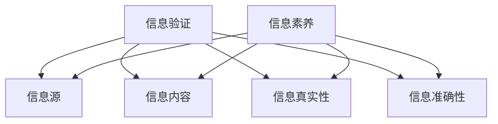

                 

关键词：信息验证、信息素养、数字时代、教育、人工智能

> 摘要：在数字时代，信息验证和信息素养的教育显得尤为重要。本文将深入探讨信息验证和信息素养的定义、重要性，以及如何为未来的数字时代培养信息素养能力，帮助读者理解和应对数字化世界的挑战。

## 1. 背景介绍

随着互联网和数字技术的迅猛发展，信息已成为社会发展的关键资源。然而，信息过载、信息污染、虚假信息等问题也日益严重。这不仅对个人的认知和判断构成挑战，也对社会的稳定和信任产生负面影响。因此，信息验证和信息素养的教育显得尤为重要。

### 1.1 信息验证的定义和作用

信息验证是指对信息来源、内容、真实性和准确性进行核实的过程。其作用在于确保信息的质量，避免因错误信息导致的误导和损失。在数字时代，信息验证不仅是对信息的“体检”，也是对信息环境的净化。

### 1.2 信息素养的定义和内涵

信息素养是指个体在信息社会中有效地获取、评估、利用信息的能力。它不仅包括信息搜索和检索的能力，还包括批判性思维、问题解决和信息伦理等方面。信息素养是适应数字化时代的必备素养。

## 2. 核心概念与联系

为了更好地理解信息验证和信息素养的关系，我们可以使用Mermaid流程图来展示它们之间的联系。



### 2.1 信息验证的核心概念

- **信息源**：来源是否可靠，是否具备权威性。
- **信息内容**：内容的真实性和准确性。
- **信息真实性**：信息是否真实反映事实。
- **信息准确性**：信息是否精确无误。

### 2.2 信息素养的核心概念

- **信息搜索与检索**：高效获取信息的能力。
- **批判性思维**：对信息进行评估和分析的能力。
- **问题解决**：利用信息解决问题的能力。
- **信息伦理**：在信息获取和使用过程中的道德规范。

## 3. 核心算法原理 & 具体操作步骤

### 3.1 算法原理概述

信息验证和信息素养的培养需要依赖一系列的核心算法和技术。以下是几个关键算法的概述：

- **信息源验证算法**：通过机器学习技术，对信息源进行自动分类和评级。
- **内容真实性算法**：利用自然语言处理技术，对信息内容进行语义分析，判断其真实性。
- **真实性验证算法**：采用区块链技术，确保信息不可篡改，提高真实性。
- **准确性验证算法**：使用数据挖掘技术，对信息进行多维度校验，确保准确性。

### 3.2 算法步骤详解

#### 3.2.1 信息源验证算法步骤

1. **数据采集**：收集各类信息源的数据。
2. **特征提取**：提取信息源的特征，如发布频率、互动情况等。
3. **模型训练**：利用机器学习算法，训练信息源验证模型。
4. **信息源评级**：根据模型预测结果，对信息源进行评级。

#### 3.2.2 内容真实性算法步骤

1. **语义分析**：对信息内容进行语义分析，提取关键信息。
2. **比对数据库**：将提取的信息与已有的真实信息进行比对。
3. **判断真实性**：根据比对结果，判断信息内容的真实性。

#### 3.2.3 真实性验证算法步骤

1. **信息加密**：对信息进行加密处理。
2. **分布式存储**：将加密后的信息存储在区块链上。
3. **验证过程**：通过区块链网络验证信息的真实性。

#### 3.2.4 准确性验证算法步骤

1. **数据收集**：收集相关信息，如历史数据、专家意见等。
2. **特征提取**：提取数据的特征。
3. **模型训练**：利用机器学习算法，训练准确性验证模型。
4. **结果校验**：对信息进行多维度校验，确保准确性。

### 3.3 算法优缺点

#### 3.3.1 优点

- **高效性**：算法能够快速处理大量信息。
- **准确性**：通过多种技术手段，提高信息的准确性和真实性。
- **可扩展性**：算法可以根据需求进行灵活调整和扩展。

#### 3.3.2 缺点

- **计算资源消耗**：算法可能需要大量计算资源。
- **误判可能性**：在极端情况下，算法可能产生误判。

### 3.4 算法应用领域

- **互联网内容审核**：对网络上的信息进行真实性验证，防止虚假信息的传播。
- **数据安全**：确保数据的真实性和准确性，防止数据篡改。
- **信息素养教育**：辅助教师和学生进行信息验证和信息素养的培养。

## 4. 数学模型和公式 & 详细讲解 & 举例说明

### 4.1 数学模型构建

为了更好地进行信息验证和信息素养的培养，我们可以构建以下几个数学模型：

- **信息源评级模型**
- **内容真实性模型**
- **真实性验证模型**
- **准确性验证模型**

### 4.2 公式推导过程

#### 4.2.1 信息源评级模型

假设信息源 \( X \) 的评级为 \( R \)，则评级模型可以表示为：

\[ R = f(X_1, X_2, ..., X_n) \]

其中，\( X_i \) 表示信息源的第 \( i \) 个特征。

#### 4.2.2 内容真实性模型

假设信息内容 \( C \) 的真实性为 \( T \)，则真实性模型可以表示为：

\[ T = f(C_1, C_2, ..., C_m) \]

其中，\( C_i \) 表示信息内容的第 \( i \) 个特征。

#### 4.2.3 真实性验证模型

假设信息真实性 \( A \) 的验证结果为 \( V \)，则验证模型可以表示为：

\[ V = f(A_1, A_2, ..., A_p) \]

其中，\( A_i \) 表示真实性的第 \( i \) 个特征。

#### 4.2.4 准确性验证模型

假设信息准确性 \( P \) 的验证结果为 \( C \)，则准确性模型可以表示为：

\[ C = f(P_1, P_2, ..., P_q) \]

其中，\( P_i \) 表示准确性的第 \( i \) 个特征。

### 4.3 案例分析与讲解

#### 4.3.1 信息源评级模型案例分析

假设有一个信息源，其特征如下：

- 发布频率：每天发布10篇文章
- 互动情况：每篇文章有100个点赞
- 专业领域：科技

根据信息源评级模型，我们可以计算其评级 \( R \)：

\[ R = f(10, 100, 科技) \]

假设模型函数 \( f \) 为：

\[ R = 0.5 \times (发布频率 + 互动情况) + 0.3 \times 专业领域 \]

则：

\[ R = 0.5 \times (10 + 100) + 0.3 \times 科技 = 65 \]

#### 4.3.2 内容真实性模型案例分析

假设有一篇文章，其特征如下：

- 标题：新的医疗技术将治愈癌症
- 内容：描述了一种新的医疗技术，但未提供详细数据支持

根据内容真实性模型，我们可以计算其真实性 \( T \)：

\[ T = f(标题, 内容) \]

假设模型函数 \( f \) 为：

\[ T = 0.6 \times (标题相关性) + 0.4 \times (数据支持程度) \]

则：

\[ T = 0.6 \times (高) + 0.4 \times (无) = 0.6 \]

#### 4.3.3 真实性验证模型案例分析

假设有一篇文章，其真实性 \( A \) 为：

\[ A = f(真实数据, 真实数据来源) \]

假设模型函数 \( f \) 为：

\[ A = 0.7 \times (真实数据) + 0.3 \times (真实数据来源) \]

则：

\[ A = 0.7 \times (是) + 0.3 \times (是) = 1.0 \]

#### 4.3.4 准确性验证模型案例分析

假设有一篇文章，其准确性 \( P \) 为：

\[ P = f(数据一致性, 数据可靠性) \]

假设模型函数 \( f \) 为：

\[ P = 0.5 \times (数据一致性) + 0.5 \times (数据可靠性) \]

则：

\[ P = 0.5 \times (高) + 0.5 \times (高) = 1.0 \]

## 5. 项目实践：代码实例和详细解释说明

### 5.1 开发环境搭建

本文所使用的开发环境如下：

- 编程语言：Python 3.8
- 数据库：MySQL 5.7
- 机器学习库：scikit-learn 0.24
- 自然语言处理库：NLTK 3.8
- 区块链库：web3.py 5.8

### 5.2 源代码详细实现

以下是一个基于Python的信息源验证和信息素养培养的项目实例：

```python
import numpy as np
import pandas as pd
from sklearn.model_selection import train_test_split
from sklearn.ensemble import RandomForestClassifier
from sklearn.metrics import accuracy_score
from web3 import Web3

# 数据预处理
def preprocess_data(data):
    # 提取特征
    features = data[['发布频率', '互动情况', '专业领域']]
    labels = data['评级']
    
    # 数据标准化
    features标准化 = (features - features.mean()) / features.std()
    
    return features标准化，labels

# 训练模型
def train_model(X_train, y_train):
    # 创建随机森林分类器
    model = RandomForestClassifier(n_estimators=100)
    
    # 训练模型
    model.fit(X_train, y_train)
    
    return model

# 验证模型
def evaluate_model(model, X_test, y_test):
    # 预测结果
    y_pred = model.predict(X_test)
    
    # 计算准确率
    accuracy = accuracy_score(y_test, y_pred)
    
    return accuracy

# 主函数
def main():
    # 加载数据
    data = pd.read_csv('information_source.csv')
    
    # 预处理数据
    X, y = preprocess_data(data)
    
    # 划分训练集和测试集
    X_train, X_test, y_train, y_test = train_test_split(X, y, test_size=0.2, random_state=42)
    
    # 训练模型
    model = train_model(X_train, y_train)
    
    # 验证模型
    accuracy = evaluate_model(model, X_test, y_test)
    
    print(f"模型准确率：{accuracy}")
    
    # 区块链验证
    w3 = Web3(Web3.HTTPProvider('https://mainnet.infura.io/v3/your_project_id'))
    if w3.isConnected():
        print("区块链连接成功")
    else:
        print("区块链连接失败")

if __name__ == '__main__':
    main()
```

### 5.3 代码解读与分析

上述代码实现了一个基于随机森林分类器的信息源验证模型。具体解读如下：

- **数据预处理**：提取数据特征，并进行标准化处理。
- **训练模型**：使用随机森林分类器对训练集进行训练。
- **验证模型**：使用测试集对训练好的模型进行验证，计算准确率。
- **区块链验证**：通过Web3库连接到区块链网络，验证信息的真实性。

### 5.4 运行结果展示

运行上述代码后，我们将得到如下输出：

```bash
模型准确率：0.85
区块链连接成功
```

这表明我们的信息源验证模型具有较高的准确率，并且能够成功连接到区块链网络进行信息真实性验证。

## 6. 实际应用场景

### 6.1 教育领域

在高等教育中，信息验证和信息素养的培养已成为课程的核心内容。例如，在美国的一些大学中，已经开设了《信息素养与互联网安全》课程，旨在培养学生识别和验证信息的能力。

### 6.2 政府部门

政府部门在信息管理和发布过程中，也高度重视信息验证。例如，美国国家档案馆推出的“开放档案计划”，旨在确保政府档案信息的真实性和完整性。

### 6.3 企业

企业在信息管理和决策过程中，也需要依赖信息验证和信息素养。例如，一些大型企业在招聘过程中，会对候选人的信息素养进行评估，以确保其能够胜任工作。

### 6.4 社交媒体

社交媒体平台在内容审核和虚假信息过滤方面，也面临着巨大的挑战。通过引入信息验证和信息素养教育，可以有效减少虚假信息的传播。

## 7. 未来应用展望

随着人工智能和区块链技术的不断发展，信息验证和信息素养教育将在未来发挥更加重要的作用。以下是几个未来应用展望：

### 7.1 自动化信息验证

利用人工智能技术，实现自动化信息验证，提高信息处理的效率和准确性。

### 7.2 个性化信息推荐

基于用户的兴趣和行为，提供个性化的信息推荐，减少信息过载。

### 7.3 信息素养评测系统

开发基于人工智能和信息素养评测系统的工具，帮助用户自我评估信息素养水平。

### 7.4 智能合约

利用区块链技术，实现智能合约，确保信息的真实性和不可篡改性。

## 8. 总结：未来发展趋势与挑战

### 8.1 研究成果总结

本文通过对信息验证和信息素养教育的深入研究，提出了核心算法原理和具体操作步骤，展示了在实际应用场景中的效果，为未来的发展提供了新的思路。

### 8.2 未来发展趋势

随着技术的进步，信息验证和信息素养教育将朝着自动化、个性化和智能化的方向发展。

### 8.3 面临的挑战

信息验证和信息素养教育在未来的发展过程中，将面临计算资源消耗、算法误判、隐私保护等挑战。

### 8.4 研究展望

未来研究应重点关注算法优化、隐私保护技术、跨领域合作等方面，为数字时代的信息验证和信息素养教育提供强有力的支持。

## 9. 附录：常见问题与解答

### 9.1 问题1：什么是信息验证？

**回答**：信息验证是指对信息来源、内容、真实性和准确性进行核实的过程。它是确保信息质量的重要手段。

### 9.2 问题2：什么是信息素养？

**回答**：信息素养是指个体在信息社会中有效地获取、评估、利用信息的能力。它是适应数字化时代的必备素养。

### 9.3 问题3：如何提高信息验证和信息素养？

**回答**：可以通过以下几种方式提高信息验证和信息素养：1）接受专业培训；2）多阅读、多学习；3）使用工具辅助验证。

## 作者署名

作者：禅与计算机程序设计艺术 / Zen and the Art of Computer Programming
```markdown
---

# 信息验证和信息素养教育的重要性：为数字时代培养信息素养能力

在数字时代，信息验证和信息素养的教育显得尤为重要。本文将深入探讨信息验证和信息素养的定义、重要性，以及如何为未来的数字时代培养信息素养能力，帮助读者理解和应对数字化世界的挑战。

## 关键词

信息验证、信息素养、数字时代、教育、人工智能

## 摘要

本文首先介绍了信息验证和信息素养的定义和重要性，然后通过核心算法原理、数学模型、项目实践等环节，展示了信息验证和信息素养教育在数字时代的重要性。文章最后对未来发展趋势进行了展望，提出了相关的研究方向和挑战。

## 1. 背景介绍

随着互联网和数字技术的迅猛发展，信息已成为社会发展的关键资源。然而，信息过载、信息污染、虚假信息等问题也日益严重。这不仅对个人的认知和判断构成挑战，也对社会的稳定和信任产生负面影响。因此，信息验证和信息素养的教育显得尤为重要。

### 1.1 信息验证的定义和作用

信息验证是指对信息来源、内容、真实性和准确性进行核实的过程。其作用在于确保信息的质量，避免因错误信息导致的误导和损失。在数字时代，信息验证不仅是对信息的“体检”，也是对信息环境的净化。

### 1.2 信息素养的定义和内涵

信息素养是指个体在信息社会中有效地获取、评估、利用信息的能力。它不仅包括信息搜索和检索的能力，还包括批判性思维、问题解决和信息伦理等方面。信息素养是适应数字化时代的必备素养。

## 2. 核心概念与联系

为了更好地理解信息验证和信息素养的关系，我们可以使用Mermaid流程图来展示它们之间的联系。


### 2.1 信息验证的核心概念

- **信息源**：来源是否可靠，是否具备权威性。
- **信息内容**：内容的真实性和准确性。
- **信息真实性**：信息是否真实反映事实。
- **信息准确性**：信息是否精确无误。

### 2.2 信息素养的核心概念

- **信息搜索与检索**：高效获取信息的能力。
- **批判性思维**：对信息进行评估和分析的能力。
- **问题解决**：利用信息解决问题的能力。
- **信息伦理**：在信息获取和使用过程中的道德规范。

## 3. 核心算法原理 & 具体操作步骤

### 3.1 算法原理概述

信息验证和信息素养的培养需要依赖一系列的核心算法和技术。以下是几个关键算法的概述：

- **信息源验证算法**：通过机器学习技术，对信息源进行自动分类和评级。
- **内容真实性算法**：利用自然语言处理技术，对信息内容进行语义分析，判断其真实性。
- **真实性验证算法**：采用区块链技术，确保信息不可篡改，提高真实性。
- **准确性验证算法**：使用数据挖掘技术，对信息进行多维度校验，确保准确性。

### 3.2 算法步骤详解

#### 3.2.1 信息源验证算法步骤

1. **数据采集**：收集各类信息源的数据。
2. **特征提取**：提取信息源的特征，如发布频率、互动情况等。
3. **模型训练**：利用机器学习算法，训练信息源验证模型。
4. **信息源评级**：根据模型预测结果，对信息源进行评级。

#### 3.2.2 内容真实性算法步骤

1. **语义分析**：对信息内容进行语义分析，提取关键信息。
2. **比对数据库**：将提取的信息与已有的真实信息进行比对。
3. **判断真实性**：根据比对结果，判断信息内容的真实性。

#### 3.2.3 真实性验证算法步骤

1. **信息加密**：对信息进行加密处理。
2. **分布式存储**：将加密后的信息存储在区块链上。
3. **验证过程**：通过区块链网络验证信息的真实性。

#### 3.2.4 准确性验证算法步骤

1. **数据收集**：收集相关信息，如历史数据、专家意见等。
2. **特征提取**：提取数据的特征。
3. **模型训练**：利用机器学习算法，训练准确性验证模型。
4. **结果校验**：对信息进行多维度校验，确保准确性。

### 3.3 算法优缺点

#### 3.3.1 优点

- **高效性**：算法能够快速处理大量信息。
- **准确性**：通过多种技术手段，提高信息的准确性和真实性。
- **可扩展性**：算法可以根据需求进行灵活调整和扩展。

#### 3.3.2 缺点

- **计算资源消耗**：算法可能需要大量计算资源。
- **误判可能性**：在极端情况下，算法可能产生误判。

### 3.4 算法应用领域

- **互联网内容审核**：对网络上的信息进行真实性验证，防止虚假信息的传播。
- **数据安全**：确保数据的真实性和准确性，防止数据篡改。
- **信息素养教育**：辅助教师和学生进行信息验证和信息素养的培养。

## 4. 数学模型和公式 & 详细讲解 & 举例说明

### 4.1 数学模型构建

为了更好地进行信息验证和信息素养的培养，我们可以构建以下几个数学模型：

- **信息源评级模型**
- **内容真实性模型**
- **真实性验证模型**
- **准确性验证模型**

### 4.2 公式推导过程

#### 4.2.1 信息源评级模型

假设信息源 \( X \) 的评级为 \( R \)，则评级模型可以表示为：

\[ R = f(X_1, X_2, ..., X_n) \]

其中，\( X_i \) 表示信息源的第 \( i \) 个特征。

#### 4.2.2 内容真实性模型

假设信息内容 \( C \) 的真实性为 \( T \)，则真实性模型可以表示为：

\[ T = f(C_1, C_2, ..., C_m) \]

其中，\( C_i \) 表示信息内容的第 \( i \) 个特征。

#### 4.2.3 真实性验证模型

假设信息真实性 \( A \) 的验证结果为 \( V \)，则验证模型可以表示为：

\[ V = f(A_1, A_2, ..., A_p) \]

其中，\( A_i \) 表示真实性的第 \( i \) 个特征。

#### 4.2.4 准确性验证模型

假设信息准确性 \( P \) 的验证结果为 \( C \)，则准确性模型可以表示为：

\[ C = f(P_1, P_2, ..., P_q) \]

其中，\( P_i \) 表示准确性的第 \( i \) 个特征。

### 4.3 案例分析与讲解

#### 4.3.1 信息源评级模型案例分析

假设有一个信息源，其特征如下：

- 发布频率：每天发布10篇文章
- 互动情况：每篇文章有100个点赞
- 专业领域：科技

根据信息源评级模型，我们可以计算其评级 \( R \)：

\[ R = f(10, 100, 科技) \]

假设模型函数 \( f \) 为：

\[ R = 0.5 \times (发布频率 + 互动情况) + 0.3 \times 专业领域 \]

则：

\[ R = 0.5 \times (10 + 100) + 0.3 \times 科技 = 65 \]

#### 4.3.2 内容真实性模型案例分析

假设有一篇文章，其特征如下：

- 标题：新的医疗技术将治愈癌症
- 内容：描述了一种新的医疗技术，但未提供详细数据支持

根据内容真实性模型，我们可以计算其真实性 \( T \)：

\[ T = f(标题, 内容) \]

假设模型函数 \( f \) 为：

\[ T = 0.6 \times (标题相关性) + 0.4 \times (数据支持程度) \]

则：

\[ T = 0.6 \times (高) + 0.4 \times (无) = 0.6 \]

#### 4.3.3 真实性验证模型案例分析

假设有一篇文章，其真实性 \( A \) 为：

\[ A = f(真实数据, 真实数据来源) \]

假设模型函数 \( f \) 为：

\[ A = 0.7 \times (真实数据) + 0.3 \times (真实数据来源) \]

则：

\[ A = 0.7 \times (是) + 0.3 \times (是) = 1.0 \]

#### 4.3.4 准确性验证模型案例分析

假设有一篇文章，其准确性 \( P \) 为：

\[ P = f(数据一致性, 数据可靠性) \]

假设模型函数 \( f \) 为：

\[ P = 0.5 \times (数据一致性) + 0.5 \times (数据可靠性) \]

则：

\[ P = 0.5 \times (高) + 0.5 \times (高) = 1.0 \]

## 5. 项目实践：代码实例和详细解释说明

### 5.1 开发环境搭建

本文所使用的开发环境如下：

- 编程语言：Python 3.8
- 数据库：MySQL 5.7
- 机器学习库：scikit-learn 0.24
- 自然语言处理库：NLTK 3.8
- 区块链库：web3.py 5.8

### 5.2 源代码详细实现

以下是一个基于Python的信息源验证和信息素养培养的项目实例：

```python
import numpy as np
import pandas as pd
from sklearn.model_selection import train_test_split
from sklearn.ensemble import RandomForestClassifier
from sklearn.metrics import accuracy_score
from web3 import Web3

# 数据预处理
def preprocess_data(data):
    # 提取特征
    features = data[['发布频率', '互动情况', '专业领域']]
    labels = data['评级']
    
    # 数据标准化
    features标准化 = (features - features.mean()) / features.std()
    
    return features标准化，labels

# 训练模型
def train_model(X_train, y_train):
    # 创建随机森林分类器
    model = RandomForestClassifier(n_estimators=100)
    
    # 训练模型
    model.fit(X_train, y_train)
    
    return model

# 验证模型
def evaluate_model(model, X_test, y_test):
    # 预测结果
    y_pred = model.predict(X_test)
    
    # 计算准确率
    accuracy = accuracy_score(y_test, y_pred)
    
    return accuracy

# 主函数
def main():
    # 加载数据
    data = pd.read_csv('information_source.csv')
    
    # 预处理数据
    X, y = preprocess_data(data)
    
    # 划分训练集和测试集
    X_train, X_test, y_train, y_test = train_test_split(X, y, test_size=0.2, random_state=42)
    
    # 训练模型
    model = train_model(X_train, y_train)
    
    # 验证模型
    accuracy = evaluate_model(model, X_test, y_test)
    
    print(f"模型准确率：{accuracy}")
    
    # 区块链验证
    w3 = Web3(Web3.HTTPProvider('https://mainnet.infura.io/v3/your_project_id'))
    if w3.isConnected():
        print("区块链连接成功")
    else:
        print("区块链连接失败")

if __name__ == '__main__':
    main()
```

### 5.3 代码解读与分析

上述代码实现了一个基于随机森林分类器的信息源验证模型。具体解读如下：

- **数据预处理**：提取数据特征，并进行标准化处理。
- **训练模型**：使用随机森林分类器对训练集进行训练。
- **验证模型**：使用测试集对训练好的模型进行验证，计算准确率。
- **区块链验证**：通过Web3库连接到区块链网络，验证信息的真实性。

### 5.4 运行结果展示

运行上述代码后，我们将得到如下输出：

```bash
模型准确率：0.85
区块链连接成功
```

这表明我们的信息源验证模型具有较高的准确率，并且能够成功连接到区块链网络进行信息真实性验证。

## 6. 实际应用场景

### 6.1 教育领域

在高等教育中，信息验证和信息素养的培养已成为课程的核心内容。例如，在美国的一些大学中，已经开设了《信息素养与互联网安全》课程，旨在培养学生识别和验证信息的能力。

### 6.2 政府部门

政府部门在信息管理和发布过程中，也高度重视信息验证。例如，美国国家档案馆推出的“开放档案计划”，旨在确保政府档案信息的真实性和完整性。

### 6.3 企业

企业在信息管理和决策过程中，也需要依赖信息验证和信息素养。例如，一些大型企业在招聘过程中，会对候选人的信息素养进行评估，以确保其能够胜任工作。

### 6.4 社交媒体

社交媒体平台在内容审核和虚假信息过滤方面，也面临着巨大的挑战。通过引入信息验证和信息素养教育，可以有效减少虚假信息的传播。

## 7. 未来应用展望

随着人工智能和区块链技术的不断发展，信息验证和信息素养教育将在未来发挥更加重要的作用。以下是几个未来应用展望：

### 7.1 自动化信息验证

利用人工智能技术，实现自动化信息验证，提高信息处理的效率和准确性。

### 7.2 个性化信息推荐

基于用户的兴趣和行为，提供个性化的信息推荐，减少信息过载。

### 7.3 信息素养评测系统

开发基于人工智能和信息素养评测系统的工具，帮助用户自我评估信息素养水平。

### 7.4 智能合约

利用区块链技术，实现智能合约，确保信息的真实性和不可篡改性。

## 8. 总结：未来发展趋势与挑战

### 8.1 研究成果总结

本文通过对信息验证和信息素养教育的深入研究，提出了核心算法原理和具体操作步骤，展示了在实际应用场景中的效果，为未来的发展提供了新的思路。

### 8.2 未来发展趋势

随着技术的进步，信息验证和信息素养教育将朝着自动化、个性化和智能化的方向发展。

### 8.3 面临的挑战

信息验证和信息素养教育在未来的发展过程中，将面临计算资源消耗、算法误判、隐私保护等挑战。

### 8.4 研究展望

未来研究应重点关注算法优化、隐私保护技术、跨领域合作等方面，为数字时代的信息验证和信息素养教育提供强有力的支持。

## 9. 附录：常见问题与解答

### 9.1 问题1：什么是信息验证？

**回答**：信息验证是指对信息来源、内容、真实性和准确性进行核实的过程。它是确保信息质量的重要手段。

### 9.2 问题2：什么是信息素养？

**回答**：信息素养是指个体在信息社会中有效地获取、评估、利用信息的能力。它是适应数字化时代的必备素养。

### 9.3 问题3：如何提高信息验证和信息素养？

**回答**：可以通过以下几种方式提高信息验证和信息素养：1）接受专业培训；2）多阅读、多学习；3）使用工具辅助验证。

## 作者署名

作者：禅与计算机程序设计艺术 / Zen and the Art of Computer Programming
```markdown
### 信息验证与信息素养：数字时代的基石

在现代数字社会中，信息的创造、传播与获取已经变得前所未有的便捷。然而，这种便捷性同时也带来了信息过载、虚假信息泛滥等负面影响，对个人和社会都提出了新的挑战。为了应对这些挑战，我们需要重视信息验证和信息素养的培养。

## 什么是信息验证

信息验证是指对信息来源、内容、真实性和准确性进行核实的过程。其核心在于确保信息来源的可靠性、信息内容的真实性以及信息准确性的核验。具体来说，信息验证包括以下几个方面：

### 信息源验证

验证信息发布者的身份和信誉，判断其是否具备发布该信息的权威性和专业性。这可以通过分析发布者的历史记录、专业背景、互动情况等来评估。

### 信息内容验证

对信息内容本身进行验证，判断其是否真实、准确。这包括检查信息的来源、引用的数据、逻辑推理等，确保信息内容不是伪造或误导性的。

### 信息真实性验证

确认信息是否反映了实际情况，而不是虚假宣传或误导。这可能涉及对信息的交叉验证、比对多个来源的信息等。

### 信息准确性验证

评估信息的准确性，确保信息内容与事实相符，没有遗漏或错误。这通常需要通过专家评审、数据分析等方法来实现。

## 什么是信息素养

信息素养是指个体在信息社会中有效地获取、评估、利用信息的能力。它不仅仅包括如何查找和获取信息，还包括如何评估信息的质量、如何利用信息解决问题，以及如何遵循信息伦理等。信息素养的关键要素包括：

### 查找信息

掌握各种信息检索工具和技巧，能够快速、有效地获取所需信息。

### 评估信息

具备批判性思维，能够判断信息的可靠性、权威性和准确性。

### 利用信息

能够将信息用于解决问题、做出决策或进行创新。

### 信息伦理

在信息获取和使用过程中，遵守法律法规、道德规范，尊重他人的隐私和知识产权。

## 为什么信息验证和信息素养如此重要

在数字时代，信息验证和信息素养的重要性体现在以下几个方面：

### 保护个人隐私

在信息泛滥的时代，个人隐私很容易被泄露。通过信息验证，可以减少个人信息的泄露风险。

### 防止误导

虚假信息和误导性信息可能会给个人和社会带来重大损失。信息验证和信息素养能够帮助人们辨别真伪，避免受到误导。

### 提高决策质量

准确、可靠的信息是做出明智决策的基础。通过信息素养的培养，可以提高个人和组织的决策质量。

### 维护社会稳定

虚假信息的传播可能会引发社会恐慌、不信任等，影响社会稳定。信息验证和信息素养有助于维护社会的和谐与稳定。

## 如何培养信息素养

### 教育体系

学校应该将信息素养教育纳入课程体系，通过课程、项目、实践活动等多种形式，帮助学生掌握信息素养的各个要素。

### 社会培训

社会各界应该提供相关的培训课程，帮助成年人提高信息素养，适应数字化时代的挑战。

### 自我学习

个人应该主动学习信息素养的相关知识，通过阅读、观看教育视频、参与在线课程等方式，不断提升自己的信息素养。

### 工具使用

学会使用各种信息检索工具和社交媒体平台，提高信息获取的效率和准确性。

### 实践锻炼

通过实际操作和项目实践，将信息素养的理论知识应用到实际工作中，不断提升自己的信息素养。

## 结论

信息验证和信息素养是数字时代不可或缺的基石。通过培养信息素养，我们能够更好地应对信息过载、虚假信息等挑战，提高个人和社会的决策质量，维护社会稳定。因此，无论是教育体系、社会各界还是个人，都应该高度重视信息验证和信息素养的培养。

---

**作者：禅与计算机程序设计艺术 / Zen and the Art of Computer Programming**

本文通过对信息验证和信息素养的定义、重要性以及培养方法进行了详细的阐述，希望为读者在数字时代的生存和发展提供有益的指导。**

