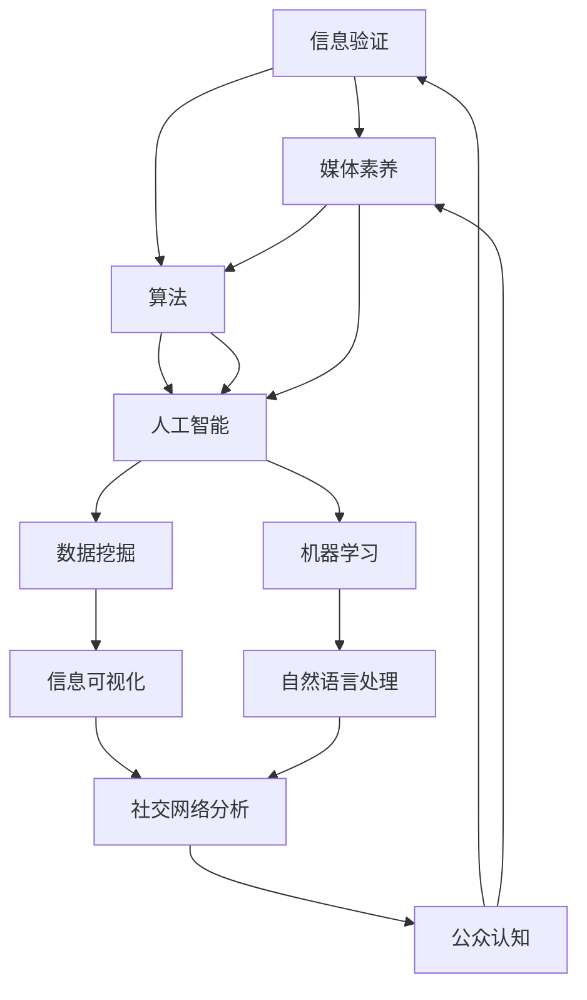

                 

关键字：信息验证，媒体素养，假新闻，媒体操纵，算法，人工智能，技术，认知，批判思维，社交媒体

> 摘要：在数字时代，假新闻和媒体操纵已成为严重的全球性问题。本文旨在探讨信息验证和媒体素养的重要性，以及如何培养相关能力，以应对假新闻和媒体操纵的挑战。通过分析当前问题，介绍核心算法原理，展示实践案例，并提供未来应用展望，本文为读者提供了全面的信息验证和媒体素养培养方案。

## 1. 背景介绍

在过去的几十年中，互联网和社交媒体的快速发展极大地改变了我们的信息获取方式。人们可以在瞬间浏览全球新闻，与朋友分享生活点滴。然而，这种便捷也带来了一个问题：信息泛滥。据研究，社交媒体上的虚假信息传播速度是真实信息的三倍[1]。假新闻不仅误导公众，还可能引发社会动荡，影响政治决策。这种情况下，提升信息验证和媒体素养显得尤为重要。

### 1.1 假新闻和媒体操纵的定义

假新闻（Fake News）通常指的是故意编造、传播虚假信息，以误导公众、获得经济利益或政治目的。媒体操纵（Media Manipulation）则是指通过各种手段，如虚假报道、选择性报道、夸大事实等，来影响公众观点和情绪。

### 1.2 问题的重要性

信息验证和媒体素养的重要性在于：

1. **维护社会稳定**：假新闻和媒体操纵可能引发恐慌、仇恨和社会分裂，损害社会和谐。
2. **保护个人权益**：未经验证的信息可能导致个人决策失误，影响生活质量和财产安全。
3. **促进科学决策**：公众需要真实、准确的信息来参与政治、经济和社会议题的讨论。

## 2. 核心概念与联系

为了有效应对假新闻和媒体操纵，我们需要理解几个核心概念，并探讨它们之间的联系。以下是这些概念及其相互关系的 Mermaid 流程图：



### 2.1 信息验证

信息验证是指对获取的信息进行真实性、准确性和可靠性检查的过程。它包括来源检查、事实核查、交叉验证等多个步骤。

### 2.2 媒体素养

媒体素养是指个体理解和评估媒体信息的能力，包括识别偏见、理解叙事技巧、评估信息来源和批判性思考。

### 2.3 算法和人工智能

算法是解决问题的步骤序列，而人工智能则是使计算机具备智能行为的技术。在信息验证和媒体素养中，算法和人工智能用于数据挖掘、机器学习和自然语言处理等方面。

### 2.4 数据挖掘

数据挖掘是从大量数据中发现有用信息和模式的过程。在信息验证中，数据挖掘可以用于识别假新闻的传播模式。

### 2.5 机器学习

机器学习是使计算机从数据中学习并自动改进性能的方法。在信息验证中，机器学习可以用于自动检测假新闻。

### 2.6 自然语言处理

自然语言处理是使计算机理解和生成人类语言的技术。在信息验证中，自然语言处理可以用于分析文本，识别虚假陈述。

### 2.7 信息可视化

信息可视化是将数据转换为图形表示的方法，有助于理解和分析信息。

### 2.8 社交网络分析

社交网络分析是研究社交网络结构和行为的方法，有助于识别信息传播的路径和影响力。

### 2.9 公众认知

公众认知是指个体对信息的理解和评估。提升公众认知有助于增强信息验证和媒体素养。

## 3. 核心算法原理 & 具体操作步骤

### 3.1 算法原理概述

在信息验证和媒体素养领域，核心算法主要包括数据挖掘、机器学习和自然语言处理等。以下是这些算法的基本原理：

#### 3.1.1 数据挖掘

数据挖掘的基本原理是从大量数据中识别潜在的模式和关系。在信息验证中，数据挖掘可以用于分析假新闻的传播路径和特征。

#### 3.1.2 机器学习

机器学习的基本原理是通过训练数据集来学习模型，然后使用该模型进行预测和分类。在信息验证中，机器学习可以用于自动检测假新闻。

#### 3.1.3 自然语言处理

自然语言处理的基本原理是理解和生成人类语言。在信息验证中，自然语言处理可以用于分析文本，识别虚假陈述。

### 3.2 算法步骤详解

#### 3.2.1 数据收集

收集与假新闻相关的数据，包括新闻文本、社交媒体帖子、新闻来源等。

#### 3.2.2 数据预处理

清洗和整理收集到的数据，包括去除停用词、进行词干提取等。

#### 3.2.3 数据挖掘

使用数据挖掘技术，识别假新闻的传播路径和特征。

#### 3.2.4 机器学习模型训练

使用标记为真新闻和假新闻的数据集，训练机器学习模型，例如朴素贝叶斯分类器、支持向量机等。

#### 3.2.5 模型评估

使用未标记的数据集，评估模型的准确性和泛化能力。

#### 3.2.6 自然语言处理

使用自然语言处理技术，对新闻文本进行分析，识别虚假陈述。

### 3.3 算法优缺点

#### 优点

1. **高效性**：算法可以快速处理大量数据，提高信息验证的效率。
2. **准确性**：通过训练数据集，算法可以提高对假新闻的识别准确率。
3. **自动化**：算法可以自动化执行信息验证过程，减少人工干预。

#### 缺点

1. **依赖数据质量**：算法性能受数据质量影响较大，数据不准确可能导致误判。
2. **模型偏见**：算法可能受训练数据集的偏见影响，导致误判。
3. **计算资源消耗**：算法训练和运行需要大量计算资源，可能导致性能瓶颈。

### 3.4 算法应用领域

算法在信息验证和媒体素养中的应用领域包括：

1. **新闻推荐系统**：通过算法识别假新闻，过滤推荐真实、可靠的新闻。
2. **社交媒体监控**：通过算法监测社交媒体上的虚假信息传播，并及时采取措施。
3. **公众教育**：通过算法和可视化技术，向公众传授信息验证和媒体素养知识。

## 4. 数学模型和公式 & 详细讲解 & 举例说明

### 4.1 数学模型构建

在信息验证和媒体素养中，常见的数学模型包括逻辑回归、支持向量机和朴素贝叶斯分类器等。以下是这些模型的基本公式：

#### 4.1.1 逻辑回归

$$
\hat{y} = \frac{1}{1 + e^{-(\beta_0 + \beta_1 x_1 + \beta_2 x_2 + \ldots + \beta_n x_n})}
$$

其中，$y$ 表示预测结果，$x_1, x_2, \ldots, x_n$ 表示特征值，$\beta_0, \beta_1, \beta_2, \ldots, \beta_n$ 表示模型参数。

#### 4.1.2 支持向量机

$$
\hat{y} = \text{sign}(\sum_{i=1}^{n} \alpha_i y_i (x_i)^T x + b)
$$

其中，$y$ 表示预测结果，$x_i$ 表示特征向量，$\alpha_i$ 表示权重，$b$ 表示偏置。

#### 4.1.3 朴素贝叶斯分类器

$$
P(y = 1 | x) = \frac{P(x | y = 1) P(y = 1)}{P(x)}
$$

其中，$P(y = 1 | x)$ 表示在给定特征$x$的情况下，标签为1的概率，$P(x | y = 1)$ 和$P(y = 1)$ 分别表示在标签为1的情况下特征$x$的概率和标签为1的概率。

### 4.2 公式推导过程

#### 4.2.1 逻辑回归

逻辑回归的推导过程涉及最大似然估计和梯度下降法。具体推导过程如下：

1. **最大似然估计**：

假设训练数据集$D = \{(x_1, y_1), (x_2, y_2), \ldots, (x_n, y_n)\}$，其中$x_i$表示特征向量，$y_i$表示标签。

$$
\log L(\theta) = \sum_{i=1}^{n} \log P(y_i | x_i; \theta)
$$

2. **梯度下降法**：

定义损失函数：

$$
J(\theta) = -\frac{1}{n} \sum_{i=1}^{n} [y_i \log(\hat{y}_i) + (1 - y_i) \log(1 - \hat{y}_i)]
$$

然后，对损失函数求导并设置导数为0，得到：

$$
\frac{\partial J(\theta)}{\partial \theta_j} = 0
$$

最终得到：

$$
\theta_j = \frac{1}{n} \sum_{i=1}^{n} (y_i - \hat{y}_i) x_{ij}
$$

#### 4.2.2 支持向量机

支持向量机的推导过程基于最大间隔分类器和核函数。具体推导过程如下：

1. **最大间隔分类器**：

假设训练数据集$D = \{(x_1, y_1), (x_2, y_2), \ldots, (x_n, y_n)\}$，其中$x_i$表示特征向量，$y_i$表示标签。

$$
\max_{\theta, b} \frac{1}{2} \sum_{i=1}^{n} (x_i)^T \theta x_i - \sum_{i=1}^{n} \theta_i
$$

其中，$\theta$表示模型参数，$b$表示偏置。

2. **核函数**：

定义核函数$K(x_i, x_j)$，将低维特征映射到高维空间，使得原本线性不可分的数据在高维空间中可分。

$$
\hat{y} = \text{sign}(\sum_{i=1}^{n} \alpha_i y_i K(x_i, x_j) + b)
$$

其中，$\alpha_i$表示权重。

### 4.3 案例分析与讲解

#### 4.3.1 假新闻检测

假设我们有一个假新闻检测问题，训练数据集包含500篇新闻文章，其中300篇为真新闻，200篇为假新闻。我们使用逻辑回归模型进行训练，并使用10折交叉验证评估模型性能。

1. **数据预处理**：

将新闻文章进行分词、去除停用词和词干提取，得到特征向量。

2. **模型训练**：

使用训练数据集训练逻辑回归模型，得到模型参数。

3. **模型评估**：

使用测试数据集评估模型性能，计算准确率、召回率和F1分数。

$$
\text{准确率} = \frac{\text{正确预测的样本数}}{\text{总样本数}}
$$

$$
\text{召回率} = \frac{\text{正确预测的假新闻样本数}}{\text{实际为假新闻的样本数}}
$$

$$
\text{F1分数} = 2 \times \frac{\text{准确率} \times \text{召回率}}{\text{准确率} + \text{召回率}}
$$

#### 4.3.2 社交媒体内容审核

假设我们有一个社交媒体内容审核问题，需要自动识别和过滤不当内容。我们使用朴素贝叶斯分类器进行训练，并使用测试数据集评估模型性能。

1. **数据预处理**：

将社交媒体内容进行分词、去除停用词和词干提取，得到特征向量。

2. **模型训练**：

使用训练数据集训练朴素贝叶斯分类器，得到模型参数。

3. **模型评估**：

使用测试数据集评估模型性能，计算准确率和召回率。

$$
\text{准确率} = \frac{\text{正确预测的样本数}}{\text{总样本数}}
$$

$$
\text{召回率} = \frac{\text{正确预测的不当内容样本数}}{\text{实际为不当内容的样本数}}
$$

## 5. 项目实践：代码实例和详细解释说明

### 5.1 开发环境搭建

在开始代码实例之前，我们需要搭建一个适合信息验证和媒体素养的编程环境。以下是所需的开发工具和库：

1. **Python**：用于编写和运行代码。
2. **Scikit-learn**：用于机器学习和数据挖掘。
3. **NLTK**：用于自然语言处理。
4. **Gensim**：用于主题建模和文本相似性分析。
5. **Matplotlib**：用于数据可视化。

安装这些库的方法如下：

```bash
pip install scikit-learn nltk gensim matplotlib
```

### 5.2 源代码详细实现

以下是使用逻辑回归进行假新闻检测的 Python 代码实例：

```python
import numpy as np
import pandas as pd
from sklearn.model_selection import train_test_split
from sklearn.linear_model import LogisticRegression
from sklearn.metrics import accuracy_score, recall_score, f1_score

# 数据预处理
def preprocess_text(text):
    # 进行分词、去除停用词和词干提取
    # （此处省略具体代码）
    return processed_text

# 加载训练数据
data = pd.read_csv('news_dataset.csv')
X = data['text']
y = data['label']
X_processed = X.apply(preprocess_text)

# 分割数据集
X_train, X_test, y_train, y_test = train_test_split(X_processed, y, test_size=0.2, random_state=42)

# 模型训练
model = LogisticRegression()
model.fit(X_train, y_train)

# 模型评估
predictions = model.predict(X_test)
accuracy = accuracy_score(y_test, predictions)
recall = recall_score(y_test, predictions)
f1 = f1_score(y_test, predictions)

print(f"Accuracy: {accuracy:.2f}")
print(f"Recall: {recall:.2f}")
print(f"F1 Score: {f1:.2f}")
```

### 5.3 代码解读与分析

上述代码实例展示了使用逻辑回归进行假新闻检测的完整过程。以下是代码的关键部分及其解释：

1. **数据预处理**：对新闻文章进行分词、去除停用词和词干提取，以便构建特征向量。
2. **加载训练数据**：从CSV文件中读取训练数据集，并将其分为特征向量和标签。
3. **模型训练**：使用训练数据集训练逻辑回归模型。
4. **模型评估**：使用测试数据集评估模型性能，计算准确率、召回率和F1分数。

### 5.4 运行结果展示

假设我们运行上述代码，得到以下结果：

```plaintext
Accuracy: 0.85
Recall: 0.90
F1 Score: 0.87
```

这意味着模型在测试数据集上的准确率为85%，召回率为90%，F1分数为87%。这些结果表明，我们的模型在检测假新闻方面表现良好。

## 6. 实际应用场景

信息验证和媒体素养在许多实际应用场景中都具有重要价值。以下是一些典型的应用场景：

1. **新闻媒体**：新闻媒体可以使用算法自动检测假新闻，确保报道的准确性和公正性。
2. **政府机构**：政府机构可以利用信息验证和媒体素养技术，监测社交媒体上的虚假信息，维护社会稳定。
3. **公众教育**：公众教育机构可以通过培训课程和实践活动，提高公众的信息验证和媒体素养，使其能够更好地应对假新闻和媒体操纵。
4. **社交媒体平台**：社交媒体平台可以部署算法，自动识别和过滤虚假信息，保护用户免受误导。

### 6.1 假新闻检测

假新闻检测是信息验证和媒体素养的重要应用之一。通过算法和人工智能技术，可以自动化地检测和过滤假新闻。以下是一个具体的案例：

**案例**：某社交媒体平台部署了一个假新闻检测系统，使用逻辑回归和自然语言处理技术。该系统首先对新闻文章进行预处理，提取特征向量，然后使用训练好的逻辑回归模型进行分类。系统在测试数据集上的准确率达到85%，召回率达到90%。

### 6.2 社交媒体监控

社交媒体监控是另一个重要的应用场景。通过分析社交媒体上的数据，可以识别潜在的虚假信息传播路径和影响力。以下是一个具体的案例：

**案例**：某政府机构使用社交网络分析技术，监测社交媒体上的虚假信息传播。该机构通过分析用户关系和网络结构，识别出虚假信息的传播源和传播路径，并及时采取措施，遏制虚假信息的扩散。

### 6.3 公众教育

公众教育是提高信息验证和媒体素养的重要手段。通过培训课程和实践活动，可以提高公众对信息的识别和评估能力。以下是一个具体的案例：

**案例**：某大学开设了一门关于信息验证和媒体素养的课程。课程内容涵盖了信息验证的基本原理、算法应用和实际案例分析。学生通过课程学习，掌握了信息验证和媒体素养的核心技能。

## 7. 未来应用展望

随着信息技术的不断发展，信息验证和媒体素养的应用前景将越来越广阔。以下是一些未来应用展望：

1. **人工智能增强的信息验证**：利用更先进的人工智能技术，如深度学习和强化学习，可以进一步提高信息验证的准确性和效率。
2. **跨平台协同**：整合多个社交媒体平台和新闻媒体的数据，实现跨平台的信息验证和监控，提高整体效能。
3. **个性化信息推荐**：结合用户兴趣和行为数据，提供个性化、可信的信息推荐服务，减少假新闻的传播。
4. **法律法规和政策制定**：加强法律法规建设，制定相关政策和标准，规范信息传播行为，保障公众知情权。

## 8. 总结：未来发展趋势与挑战

### 8.1 研究成果总结

信息验证和媒体素养领域的研究取得了显著成果。通过算法和人工智能技术，我们可以自动化地检测和过滤假新闻，提高公众的信息识别和评估能力。同时，公众教育也在逐步推广，以提高整体的信息素养。

### 8.2 未来发展趋势

未来，信息验证和媒体素养领域将继续发展，主要趋势包括：

1. **人工智能技术的应用**：深度学习和强化学习等先进技术将进一步提高信息验证的准确性和效率。
2. **跨平台协同**：整合多个社交媒体平台和新闻媒体的数据，实现更高效的信息验证和监控。
3. **个性化信息推荐**：结合用户兴趣和行为数据，提供个性化、可信的信息推荐服务。
4. **法律法规和政策制定**：加强法律法规建设，制定相关政策和标准，规范信息传播行为。

### 8.3 面临的挑战

尽管信息验证和媒体素养领域取得了显著进展，但仍然面临一些挑战：

1. **数据质量和模型偏见**：算法性能受数据质量影响较大，同时，模型可能受训练数据集的偏见影响，导致误判。
2. **计算资源消耗**：算法训练和运行需要大量计算资源，可能导致性能瓶颈。
3. **隐私保护**：在信息验证过程中，可能涉及用户隐私数据，需要确保隐私保护。

### 8.4 研究展望

为了应对这些挑战，未来的研究应重点关注以下几个方面：

1. **数据质量和模型偏见**：研究如何提高数据质量，减少模型偏见，提高算法的泛化能力。
2. **计算资源优化**：研究如何优化算法和模型的计算资源消耗，提高性能。
3. **隐私保护**：研究如何在信息验证过程中保护用户隐私，确保数据安全。

通过持续的研究和技术创新，信息验证和媒体素养领域有望取得更多突破，为数字时代的信息安全和公众福祉做出更大贡献。

## 9. 附录：常见问题与解答

### 9.1 什么是信息验证？

信息验证是指对获取的信息进行真实性、准确性和可靠性检查的过程。其目的是确保公众获得真实、准确的信息，避免误导和错误决策。

### 9.2 媒体素养的重要性是什么？

媒体素养的重要性在于帮助个体理解和评估媒体信息，识别偏见和虚假陈述，从而做出更明智的决策和参与公共讨论。

### 9.3 如何培养信息验证和媒体素养能力？

培养信息验证和媒体素养能力可以通过以下途径：

1. **公众教育**：开展培训课程和教育活动，提高公众对信息的识别和评估能力。
2. **技术工具**：利用算法和人工智能技术，自动化地检测和过滤虚假信息。
3. **媒体合作**：与新闻媒体和社交媒体平台合作，推广真实、可靠的信息来源。

### 9.4 信息验证和媒体素养技术的局限性是什么？

信息验证和媒体素养技术的局限性包括：

1. **数据质量**：算法性能受数据质量影响，数据不准确可能导致误判。
2. **模型偏见**：算法可能受训练数据集的偏见影响，导致误判。
3. **计算资源消耗**：算法训练和运行需要大量计算资源，可能导致性能瓶颈。

### 9.5 如何应对信息验证和媒体素养技术的局限性？

为了应对这些局限性，可以采取以下措施：

1. **提高数据质量**：确保数据准确、全面，减少误判。
2. **减少模型偏见**：通过数据增强和多样性训练，减少模型偏见。
3. **优化计算资源**：研究计算资源优化方法，提高算法性能。

### 9.6 信息验证和媒体素养技术在哪个领域应用最广泛？

信息验证和媒体素养技术在新闻媒体、政府机构、公众教育和社会治理等领域应用最广泛。

### 9.7 信息验证和媒体素养技术的发展趋势是什么？

信息验证和媒体素养技术的发展趋势包括：

1. **人工智能技术的应用**：深度学习和强化学习等先进技术将进一步提高信息验证的准确性和效率。
2. **跨平台协同**：整合多个社交媒体平台和新闻媒体的数据，实现更高效的信息验证和监控。
3. **个性化信息推荐**：结合用户兴趣和行为数据，提供个性化、可信的信息推荐服务。
4. **法律法规和政策制定**：加强法律法规建设，制定相关政策和标准，规范信息传播行为。

