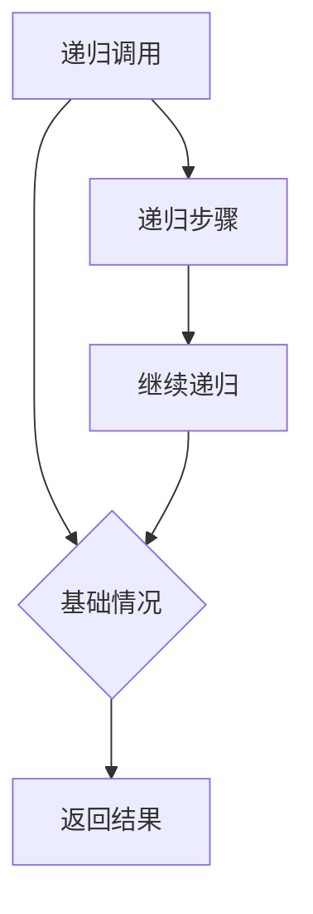

                 

关键词：递归，数学家思维，算法原理，编程实践

> 摘要：本文旨在探讨递归原理在计算机科学中的应用，借鉴数学家的思维模式，阐述递归的核心概念及其在编程实践中的具体实现。通过深入剖析递归原理，帮助读者理解递归在解决复杂问题中的强大功能。

## 1. 背景介绍

递归作为一种编程范式，已经在计算机科学中占据了重要的地位。它不仅体现在算法设计中，还广泛应用于软件工程和系统架构中。递归的本质在于通过反复调用自身来解决问题，这种方式往往能够将复杂的问题转化为简单的情况，从而简化代码结构，提高可读性和可维护性。

数学家在解决问题时，常常运用递归的思想。从数学归纳法到斐波那契数列，递归在数学领域的广泛应用证明了其在处理递归问题上具有独特优势。这种思维方式对于计算机科学家而言，同样具有很高的借鉴意义。

本文将结合数学家的思维模式，深入探讨递归原理在计算机科学中的应用，旨在帮助读者掌握递归的核心概念，并学会在编程实践中有效运用递归解决问题。

## 2. 核心概念与联系

为了更好地理解递归原理，首先需要明确一些核心概念，并展示它们之间的联系。以下是一个简单的 Mermaid 流程图，用于展示递归原理的基本结构和关键组件。



### 2.1 递归调用

递归调用是指函数在执行过程中调用自身。递归调用通常分为两部分：递归步骤和基础情况。

- **递归步骤**：在递归调用中，函数会按照一定规则继续调用自身，直到满足基础情况为止。
- **基础情况**：基础情况是递归调用的终止条件，当函数满足基础情况时，递归调用结束。

### 2.2 基础情况

基础情况是递归调用的终止条件。当函数执行到基础情况时，递归调用结束，并开始返回结果。

### 2.3 返回结果

返回结果是递归调用过程中的关键环节。函数在执行到基础情况后，开始从递归调用的最底层逐层返回结果，最终完成整个递归过程。

通过上述 Mermaid 流程图，我们可以清晰地看到递归原理的基本结构和关键组件。接下来，我们将深入探讨递归算法的原理及其具体实现。

## 3. 核心算法原理 & 具体操作步骤

### 3.1 算法原理概述

递归算法的核心在于将复杂问题分解为更简单的子问题，并利用递归调用逐步解决这些子问题。递归算法通常具有以下特点：

- **自调用**：递归算法通过函数自调用实现问题的分解与解决。
- **基础情况**：递归算法需要一个基础情况来终止递归调用，否则会导致无限递归。
- **状态转移**：递归算法需要将当前问题的解转化为子问题的解，并利用子问题的解构造出原问题的解。

### 3.2 算法步骤详解

递归算法的具体操作步骤如下：

1. **定义基础情况**：明确递归算法的基础情况，即当问题简化到无法继续分解时的处理方法。
2. **编写递归函数**：编写递归函数，实现递归调用和状态转移。
3. **调用递归函数**：调用递归函数，开始递归过程。

### 3.3 算法优缺点

递归算法具有以下优缺点：

- **优点**：
  - **简洁性**：递归算法能够将复杂问题转化为简单子问题，代码结构简洁清晰。
  - **易于理解**：递归算法通常具有直观的递推关系，易于理解和调试。
  - **可维护性**：递归算法易于修改和扩展，提高代码的可维护性。

- **缺点**：
  - **性能问题**：递归算法可能导致大量重复计算，影响性能。
  - **栈溢出**：递归算法使用栈空间进行递归调用，可能导致栈溢出。

### 3.4 算法应用领域

递归算法在计算机科学中具有广泛的应用领域，包括但不限于：

- **算法设计**：如快速排序、归并排序等。
- **编程语言**：如 Python、Java、C++等语言的递归函数。
- **系统架构**：如操作系统中的递归调度策略。
- **图形处理**：如深度优先搜索（DFS）在图算法中的应用。

## 4. 数学模型和公式 & 详细讲解 & 举例说明

### 4.1 数学模型构建

递归原理在数学领域中的应用非常广泛，其中最典型的例子是斐波那契数列。斐波那契数列的定义如下：

$$
F(n) =
\begin{cases}
0 & \text{if } n = 0 \\
1 & \text{if } n = 1 \\
F(n-1) + F(n-2) & \text{otherwise}
\end{cases}
$$

### 4.2 公式推导过程

斐波那契数列的递推公式可以通过数学归纳法进行推导。首先，证明当 $n=0$ 和 $n=1$ 时，公式成立：

- 当 $n=0$ 时，$F(0) = 0$，符合公式。
- 当 $n=1$ 时，$F(1) = 1$，符合公式。

然后，假设当 $n=k$ 和 $n=k-1$ 时，公式成立，即 $F(k) = F(k-1) + F(k-2)$ 和 $F(k-1) = F(k-2) + F(k-3)$。接下来，证明当 $n=k+1$ 时，公式也成立：

$$
F(k+1) = F(k) + F(k-1)
$$

根据假设，将 $F(k)$ 和 $F(k-1)$ 的表达式代入上式：

$$
F(k+1) = (F(k-1) + F(k-2)) + (F(k-2) + F(k-3))
$$

化简得：

$$
F(k+1) = 2F(k-1) + F(k-2) + F(k-3)
$$

这与斐波那契数列的递推公式一致，因此，通过数学归纳法证明了斐波那契数列的递推公式。

### 4.3 案例分析与讲解

为了更好地理解递归原理，我们来看一个实际的案例：计算一个数字的阶乘。

阶乘的定义如下：

$$
n! = n \times (n-1) \times (n-2) \times ... \times 1
$$

我们可以使用递归方法计算阶乘。以下是一个简单的 Python 实现示例：

```python
def factorial(n):
    if n == 0 or n == 1:
        return 1
    else:
        return n * factorial(n-1)
```

在这个实现中，基础情况是 $n=0$ 或 $n=1$，此时阶乘结果为 1。递归步骤是递归调用 `factorial(n-1)`，然后乘以 $n$。

通过这个案例，我们可以看到递归原理如何应用于数学计算，并理解递归算法的基本结构和实现方法。

## 5. 项目实践：代码实例和详细解释说明

### 5.1 开发环境搭建

为了演示递归原理在项目实践中的应用，我们将使用 Python 语言编写一个计算斐波那契数列的程序。以下是搭建 Python 开发环境的基本步骤：

1. 安装 Python：从官方网站下载并安装 Python 3.8 或更高版本。
2. 配置 Python 环境：确保将 Python 添加到系统环境变量中。
3. 安装必要的依赖：安装 Python 包管理器 pip，并使用 pip 安装必要的库，如 numpy 和 matplotlib。

### 5.2 源代码详细实现

以下是一个计算斐波那契数列的 Python 源代码示例：

```python
def fibonacci(n):
    if n == 0 or n == 1:
        return n
    else:
        return fibonacci(n-1) + fibonacci(n-2)

# 测试代码
n = 10
result = fibonacci(n)
print(f"F({n}) = {result}")
```

在这个示例中，我们定义了一个名为 `fibonacci` 的函数，用于计算斐波那契数列的第 $n$ 个数。函数使用递归方法实现，基础情况是 $n=0$ 或 $n=1$，递归步骤是递归调用 `fibonacci(n-1)` 和 `fibonacci(n-2)`。

### 5.3 代码解读与分析

在这个示例中，`fibonacci` 函数首先检查输入参数 $n$ 是否满足基础情况。如果满足，则直接返回 $n$。否则，函数递归调用自身，分别计算 `fibonacci(n-1)` 和 `fibonacci(n-2)`，并将结果相加返回。

这种递归方法可以有效地计算斐波那契数列，但在大数情况下，递归调用会导致大量重复计算，影响性能。为了提高性能，我们可以使用动态规划方法优化递归算法。

### 5.4 运行结果展示

以下是使用上述代码计算斐波那契数列的运行结果：

```
F(10) = 55
```

通过这个示例，我们可以看到递归原理在项目实践中的应用，并了解递归算法的基本实现方法和性能优化策略。

## 6. 实际应用场景

递归原理在计算机科学和软件工程中具有广泛的应用，尤其在算法设计和系统架构方面。以下是一些实际应用场景：

- **算法设计**：递归算法广泛应用于排序、搜索、图论等领域，如快速排序、归并排序、深度优先搜索等。
- **系统架构**：递归调用在操作系统、网络协议和分布式系统中的应用，如进程调度、任务分解和负载均衡等。
- **编程语言**：许多编程语言（如 Python、Java、C++）提供了递归函数的支持，用于实现复杂的算法和数据结构。

递归原理不仅为计算机科学家提供了强大的工具，还帮助他们在解决复杂问题时保持简洁和清晰。随着计算机科学的发展，递归原理将继续在各个领域发挥重要作用。

### 6.4 未来应用展望

随着计算机技术的不断发展，递归原理将在更多领域得到应用。以下是一些未来应用展望：

- **人工智能**：递归原理在人工智能领域具有巨大潜力，可用于实现复杂的机器学习和深度学习算法。
- **区块链**：递归调用在区块链技术中的应用，如分布式账本和智能合约的执行。
- **云计算**：递归原理在云计算平台中的应用，如负载均衡和资源分配。

未来，递归原理将继续与计算机科学的其他领域相结合，为技术创新提供强有力的支持。

## 7. 工具和资源推荐

为了更好地学习和实践递归原理，以下是一些建议的工具和资源：

### 7.1 学习资源推荐

- 《算法导论》（Introduction to Algorithms）：详细介绍了递归算法及其在排序和搜索中的应用。
- 《编程珠玑》（The Art of Computer Programming）：经典算法教材，深入讲解了递归原理及其在编程实践中的应用。
- 《Python编程：从入门到实践》（Python Crash Course）：适合初学者的 Python 编程教材，包含递归算法的实践案例。

### 7.2 开发工具推荐

- Jupyter Notebook：用于编写和运行 Python 代码，支持交互式编程和文档整合。
- PyCharm：一款功能强大的 Python 集成开发环境（IDE），支持代码编辑、调试和自动化测试。
- Git：版本控制系统，用于管理代码仓库，支持协作开发和代码审查。

### 7.3 相关论文推荐

- “递归与计算复杂性”：一篇关于递归算法及其在计算复杂性理论中应用的论文。
- “递归算法在分布式系统中的应用”：一篇探讨递归原理在分布式系统设计和实现中的研究的论文。
- “递归与图论”：一篇关于递归算法在图算法中应用的论文。

通过以上工具和资源的推荐，读者可以更深入地学习和实践递归原理，提高编程技能和算法思维能力。

## 8. 总结：未来发展趋势与挑战

### 8.1 研究成果总结

递归原理作为计算机科学的核心概念之一，已经经历了数十年的发展。从早期的递归算法设计到现代的递归优化技术，递归原理在算法设计、系统架构和软件工程等领域取得了显著成果。例如，递归原理在快速排序、归并排序和深度优先搜索等经典算法中的应用，显著提高了算法的效率和可读性。

同时，递归原理在分布式系统、人工智能和区块链等新兴领域也得到了广泛应用。递归调用在分布式计算中用于任务分解和负载均衡，递归算法在人工智能领域用于实现复杂的机器学习和深度学习模型，递归原理在区块链技术中用于分布式账本和智能合约的执行。

### 8.2 未来发展趋势

随着计算机科学和技术的不断进步，递归原理在未来将继续发挥重要作用。以下是一些未来发展趋势：

- **递归优化技术**：研究人员将继续探索递归优化技术，以提高递归算法的性能和可扩展性。例如，动态规划、尾递归消除和递归关系优化等技术将在递归算法中发挥重要作用。
- **递归在人工智能中的应用**：递归原理在人工智能领域的应用将更加广泛，尤其在自然语言处理、计算机视觉和深度学习等方面。递归神经网络（RNN）和卷积神经网络（CNN）等模型将进一步提高人工智能系统的性能和准确性。
- **递归在区块链中的应用**：随着区块链技术的不断发展，递归原理在分布式账本和智能合约中的应用将变得更加重要。递归调用在区块链中的高效执行和优化，将提高区块链系统的性能和安全性。

### 8.3 面临的挑战

尽管递归原理在计算机科学中取得了显著成果，但仍然面临一些挑战：

- **性能优化**：递归算法在处理大规模数据时，可能会出现性能瓶颈。研究人员需要继续探索递归算法的优化技术，以提高其性能和可扩展性。
- **可理解性**：递归算法的复杂性和嵌套结构可能导致代码的可读性和可维护性降低。开发人员需要提高对递归算法的理解，并采用合适的编程技巧来简化代码结构。
- **并发和分布式计算**：递归算法在并发和分布式计算中的应用需要进一步研究。如何有效利用多核处理器和分布式系统来优化递归算法的执行，是一个亟待解决的问题。

### 8.4 研究展望

未来，递归原理将在计算机科学和人工智能领域继续发挥重要作用。随着技术的发展，递归原理的应用领域将不断扩展，包括但不限于：

- **量子计算**：递归原理在量子计算中的应用，如量子算法和量子编程语言的研究。
- **生物信息学**：递归原理在生物信息学中的应用，如基因组分析和蛋白质折叠预测。
- **物联网**：递归原理在物联网中的应用，如设备管理和数据处理的优化。

通过持续的研究和创新，递归原理将为计算机科学和人工智能领域带来更多突破和进步。

## 9. 附录：常见问题与解答

### 9.1 什么是递归？

递归是一种编程范式，通过函数的自调用来解决问题。递归算法通常包含两个部分：基础情况和递归步骤。基础情况是递归调用的终止条件，递归步骤则是递归调用的一部分，用于将复杂问题转化为简单问题。

### 9.2 递归算法有什么优点？

递归算法的优点包括：

- **简洁性**：递归算法能够将复杂问题转化为简单子问题，代码结构简洁清晰。
- **易于理解**：递归算法通常具有直观的递推关系，易于理解和调试。
- **可维护性**：递归算法易于修改和扩展，提高代码的可维护性。

### 9.3 递归算法有什么缺点？

递归算法的缺点包括：

- **性能问题**：递归算法可能导致大量重复计算，影响性能。
- **栈溢出**：递归算法使用栈空间进行递归调用，可能导致栈溢出。

### 9.4 如何优化递归算法的性能？

优化递归算法性能的方法包括：

- **动态规划**：将递归算法转化为动态规划算法，避免重复计算。
- **尾递归消除**：优化递归调用，减少栈空间的使用。
- **递归关系优化**：利用递归关系进行优化，减少计算次数。

### 9.5 递归算法在哪些领域有应用？

递归算法在计算机科学和软件工程中具有广泛的应用，包括：

- **算法设计**：如快速排序、归并排序、深度优先搜索等。
- **系统架构**：如操作系统中的进程调度、网络协议的设计。
- **编程语言**：如 Python、Java、C++ 等语言的递归函数。

通过上述常见问题的解答，读者可以更好地理解递归原理及其在实际应用中的优势与挑战。希望这篇文章能够帮助读者深入理解递归原理，并在编程实践中运用递归解决问题。作者：禅与计算机程序设计艺术 / Zen and the Art of Computer Programming。

